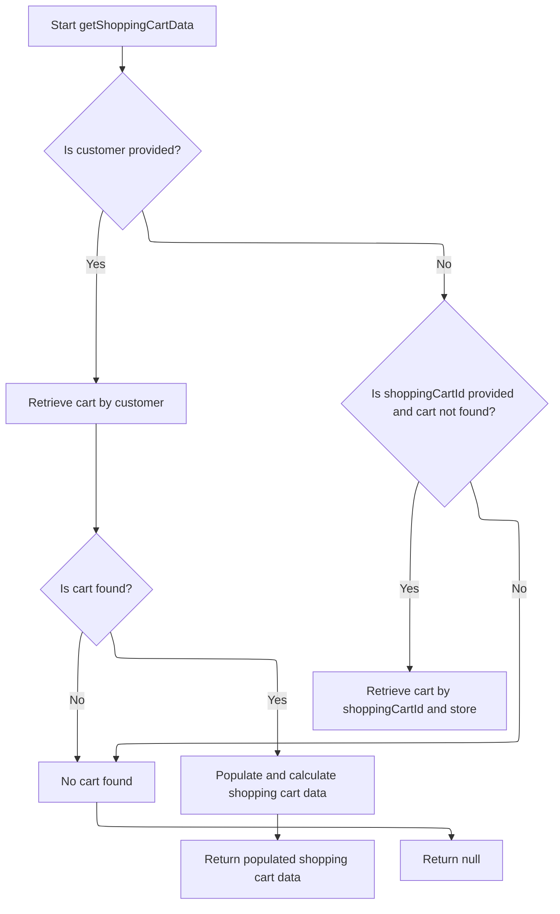

This document explains the flow of displaying the mini shopping cart. It involves retrieving merchant store and customer information, fetching and validating the shopping cart data, enriching it with pricing and calculation details, updating the session, and returning the cart data for display.

# Starting the Mini Cart Display Process

This section initiates the process to display the mini shopping cart by retrieving necessary context information and fetching the shopping cart data.

| Category       | Rule Name                       | Description                                                                                                                                    |
| -------------- | ------------------------------- | ---------------------------------------------------------------------------------------------------------------------------------------------- |
| Business logic | Merchant store context required | The mini cart display must always be associated with a valid merchant store context.                                                           |
| Business logic | Customer personalization        | The mini cart display must be personalized to the current customer if customer information is available.                                       |
| Business logic | Accurate cart retrieval         | The shopping cart data must be retrieved using the provided shopping cart code, customer, and merchant store to ensure accurate cart contents. |

<SwmSnippet path="/shopizer/sm-shop/src/main/java/com/salesmanager/web/shop/controller/shoppingCart/MiniCartController.java" line="43">

---

Here we start by grabbing the merchant store and customer info from the request, then we call the facade to get the shopping cart data. This sets up the context and delegates the heavy lifting to the facade, which handles the business logic and data retrieval.

```java
	public @ResponseBody ShoppingCartData displayMiniCart(final String shoppingCartCode, HttpServletRequest request, Model model){
		
		try {
			MerchantStore merchantStore = (MerchantStore)request.getAttribute(Constants.MERCHANT_STORE);
		    Customer customer = getSessionAttribute(  Constants.CUSTOMER, request );
			ShoppingCartData cart =  shoppingCartFacade.getShoppingCartData(customer,merchantStore,shoppingCartCode);
```

---

</SwmSnippet>

## Fetching and Validating the Shopping Cart in Facade



This section describes the process of fetching and validating the shopping cart in the facade layer of the Shopizer e-commerce platform. It handles retrieving the cart based on customer presence or shopping cart ID, validating the cart's obsolescence, and populating the cart data with pricing and calculation details before returning it.

| Category       | Rule Name                     | Description                                                                                                                                                                                                                                                                                                                                                                                                                                                                                                                                                                                                                                                                 |
| -------------- | ----------------------------- | --------------------------------------------------------------------------------------------------------------------------------------------------------------------------------------------------------------------------------------------------------------------------------------------------------------------------------------------------------------------------------------------------------------------------------------------------------------------------------------------------------------------------------------------------------------------------------------------------------------------------------------------------------------------------- |
| Business logic | Customer cart retrieval       | If a customer is provided, retrieve the shopping cart associated with that customer.                                                                                                                                                                                                                                                                                                                                                                                                                                                                                                                                                                                        |
| Business logic | Fallback cart retrieval by ID | If no customer is provided or no cart is found for the customer, and a <SwmToken path="shopizer/sm-shop/src/main/java/com/salesmanager/web/shop/controller/shoppingCart/facade/ShoppingCartFacadeImpl.java" pos="261:5:5" line-data="                                                 final String shoppingCartId )">`shoppingCartId`</SwmToken> is provided, retrieve the cart by the <SwmToken path="shopizer/sm-shop/src/main/java/com/salesmanager/web/shop/controller/shoppingCart/facade/ShoppingCartFacadeImpl.java" pos="261:5:5" line-data="                                                 final String shoppingCartId )">`shoppingCartId`</SwmToken> and store. |
| Business logic | Obsolete cart deletion        | If the retrieved shopping cart is marked as obsolete, delete the cart and return null instead of returning the obsolete cart.                                                                                                                                                                                                                                                                                                                                                                                                                                                                                                                                               |
| Business logic | Return null if no cart found  | If no shopping cart is found by customer or <SwmToken path="shopizer/sm-shop/src/main/java/com/salesmanager/web/shop/controller/shoppingCart/facade/ShoppingCartFacadeImpl.java" pos="261:5:5" line-data="                                                 final String shoppingCartId )">`shoppingCartId`</SwmToken>, return null to indicate no active cart exists.                                                                                                                                                                                                                                                                                                       |
| Business logic | Populate cart data            | If a valid shopping cart is found, populate the shopping cart data with pricing, calculation, language, and store details before returning it.                                                                                                                                                                                                                                                                                                                                                                                                                                                                                                                              |

<SwmSnippet path="/shopizer/sm-shop/src/main/java/com/salesmanager/web/shop/controller/shoppingCart/facade/ShoppingCartFacadeImpl.java" line="260">

---

Here the facade checks if we have a customer to get their cart via the service. If no customer, it plans to fetch by cart code later. This splits retrieval logic based on user presence.

```java
    public ShoppingCartData getShoppingCartData( final Customer customer, final MerchantStore store,
                                                 final String shoppingCartId )
        throws Exception
    {

        ShoppingCart cart = null;
        try
        {
            if ( customer != null )
            {
                LOG.info( "Reteriving customer shopping cart..." );

                cart = shoppingCartService.getShoppingCart( customer );

            }

            else
            {
```

---

</SwmSnippet>

<SwmSnippet path="/shopizer/sm-core/src/main/java/com/salesmanager/core/business/shoppingcart/service/ShoppingCartServiceImpl.java" line="68">

---

Here the service grabs the cart from the DAO, enriches it with extra data, then checks if it's obsolete. If it is, it deletes the cart and returns null; otherwise, it returns the updated cart.

```java
	public ShoppingCart getShoppingCart(final Customer customer) throws ServiceException {

		try {

			ShoppingCart shoppingCart = shoppingCartDao.getByCustomer(customer);
			populateShoppingCart(shoppingCart);
			if(shoppingCart!=null && shoppingCart.isObsolete()) {
				delete(shoppingCart);
				return null;
			} else {
				return shoppingCart;
			}


		} catch (Exception e) {
			throw new ServiceException(e);
		}

	}
```

---

</SwmSnippet>

<SwmSnippet path="/shopizer/sm-shop/src/main/java/com/salesmanager/web/shop/controller/shoppingCart/facade/ShoppingCartFacadeImpl.java" line="278">

---

After the service returns, the facade checks if the cart is null and tries to get it by code if needed. Then it populates the cart data with pricing and calculation details before returning it.

```java
                if ( StringUtils.isNotBlank( shoppingCartId ) && cart == null )
                {
                    cart = shoppingCartService.getByCode( shoppingCartId, store );
                }

            }
        }
        catch ( ServiceException ex )
        {
            LOG.error( "Error while retriving cart from customer", ex );
        }
        catch( NoResultException nre) {
        	//nothing
        }

        if ( cart == null )
        {
            return null;
        }

        LOG.info( "Cart model found." );

        ShoppingCartDataPopulator shoppingCartDataPopulator = new ShoppingCartDataPopulator();
        shoppingCartDataPopulator.setShoppingCartCalculationService( shoppingCartCalculationService );
        shoppingCartDataPopulator.setPricingService( pricingService );

        Language language = (Language) getKeyValue( Constants.LANGUAGE );
        MerchantStore merchantStore = (MerchantStore) getKeyValue( Constants.MERCHANT_STORE );
        return shoppingCartDataPopulator.populate( cart, merchantStore, language );

    }
```

---

</SwmSnippet>

## Updating Session and Returning Cart Data in Controller

<SwmSnippet path="/shopizer/sm-shop/src/main/java/com/salesmanager/web/shop/controller/shoppingCart/MiniCartController.java" line="49">

---

After getting the cart data, the controller updates the session with the cart code if present, or removes it if no cart exists, then returns the cart or null.

```java
			if(cart!=null) {
				request.getSession().setAttribute(Constants.SHOPPING_CART, cart.getCode());
			}
			if(cart==null) {
				request.getSession().removeAttribute(Constants.SHOPPING_CART);//make sure there is no cart here
			}
			return cart;
			
			
		} catch(Exception e) {
			LOG.error("Error while getting the shopping cart",e);
		}
		
		return null;

	}
```

---

</SwmSnippet>

&nbsp;

*This is an auto-generated document by Swimm 🌊 and has not yet been verified by a human*

<SwmMeta version="3.0.0" repo-id="Z2l0aHViJTNBJTNBU2hvcGl6ZXIlM0ElM0F1bWFsaW5nYXN3YW1p" repo-name="Shopizer"><sup>Powered by [Swimm](https://app.swimm.io/)</sup></SwmMeta>
