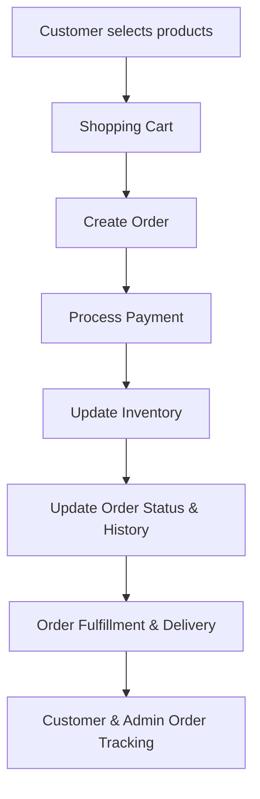

# Overview of Order Business Concept

In the business domain, an Order represents a customer's purchase transaction within the system. It serves as a comprehensive record that includes all relevant details such as the products selected, their quantities, prices, and customer information.

The Order entity is central to managing the entire lifecycle of a purchase. This lifecycle spans from the initial creation of the order, through processing stages including payment, and finally to fulfillment and delivery.

To ensure seamless transaction handling, the Order interacts with multiple other components of the system. These include the shopping cart, which holds the items before purchase; payment processing modules that handle financial transactions; and inventory management systems that track stock availability.

Additionally, the Order entity maintains the status and history of each transaction. This functionality supports both administrative operations and customer-facing features such as order review, tracking, and status updates.

## Purpose and Importance of Order

The Order is essential for maintaining accurate and complete records of customer purchases. It enables the system to track the progress of each transaction from start to finish, facilitating features like payment confirmation, shipment tracking, and historical order data retrieval.

## Usage of Order in the Codebase

Within the codebase, the Order entity is primarily used in the business logic layer. The `OrderService` interface and its implementation `OrderServiceImpl` encapsulate the core operations related to orders, such as processing payments and updating order statuses.

The data access layer also utilizes the Order entity through interfaces like `OrderDao` and its implementation `OrderDaoImpl`. These components handle database operations, including creating, retrieving, updating, and deleting order records.

## Example: Processing an Order

A practical example of Order usage is the `processOrder` method found in `OrderServiceImpl`. This method accepts an Order object along with associated customer details, shopping cart items, payment information, and merchant store data.

The method orchestrates the complete processing of the purchase by validating the order, handling payment transactions, updating inventory, and recording the order status and history. This demonstrates how the Order entity integrates with various system components to fulfill a customer's purchase.

&nbsp;

*This is an auto-generated document by Swimm 🌊 and has not yet been verified by a human*

<SwmMeta version="3.0.0" repo-id="Z2l0aHViJTNBJTNBU2hvcGl6ZXIlM0ElM0F1bWFsaW5nYXN3YW1p" repo-name="Shopizer">Powered by [Swimm](https://app.swimm.io/)</SwmMeta>
