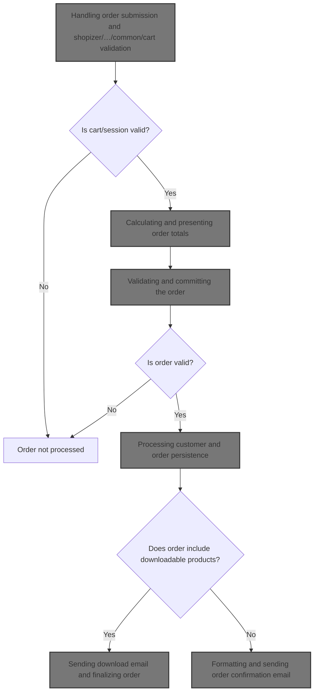
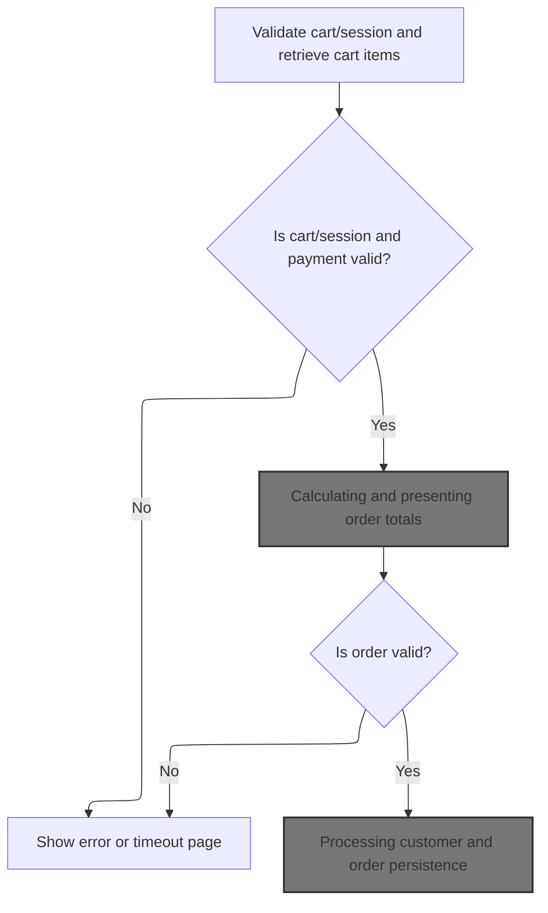
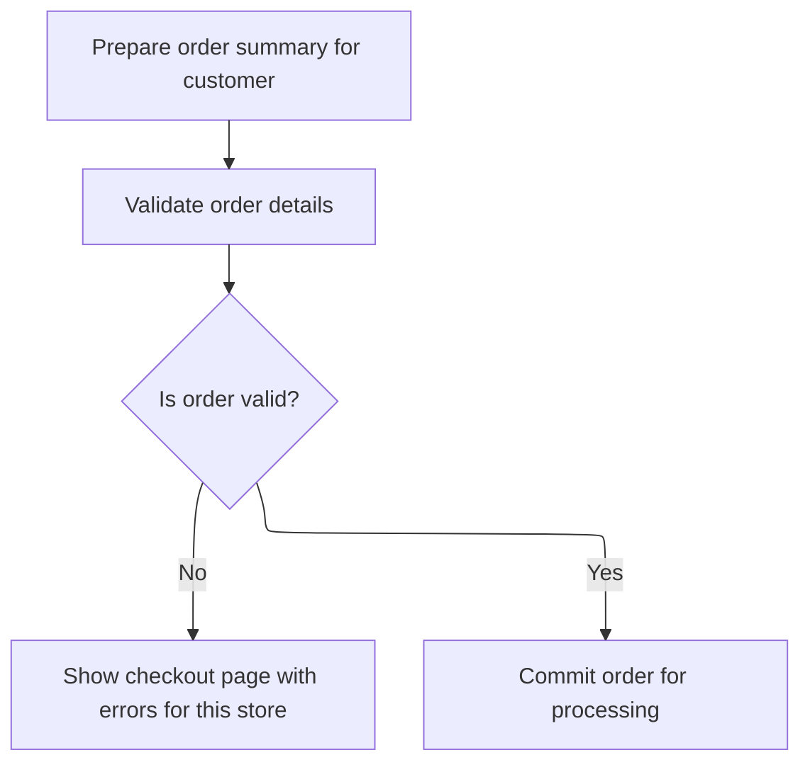
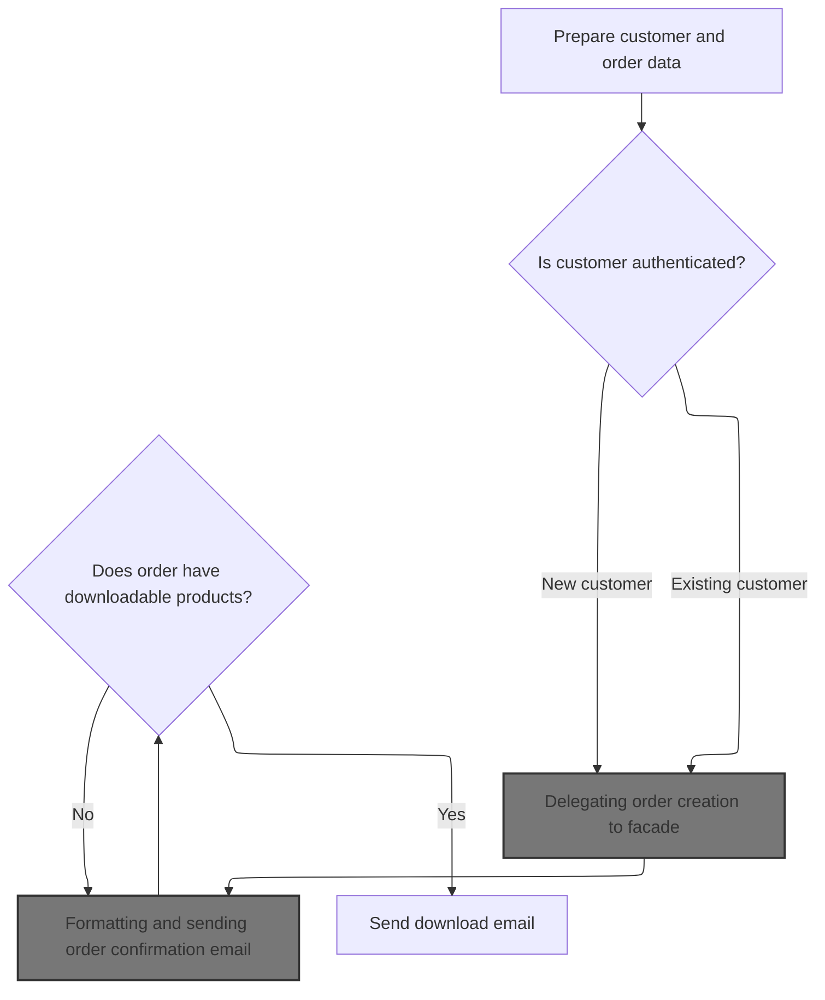
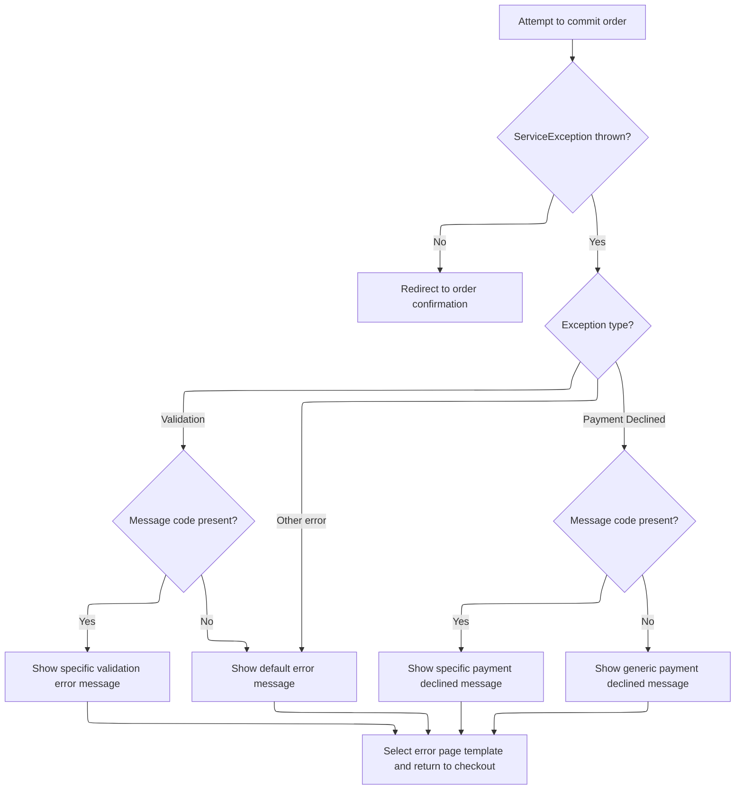

```mermaid
%%{init: {"flowchart": {"defaultRenderer": "elk"}} }%%
flowchart TD
  node1["Save order ID and token in session"] --> node2{"Is there a cart to delete?"}
  click node1 openCode "shopizer/sm-shop/src/main/java/com/salesmanager/web/shop/controller/order/ShoppingOrderController.java:432:435"
  node2 -->|"Yes"| node3["Delete shopping cart"]
  click node2 openCode "shopizer/sm-shop/src/main/java/com/salesmanager/web/shop/controller/order/ShoppingOrderController.java:439:447"
  node2 -->|"No"| node4["Cleanup session data"]
  click node3 openCode "shopizer/sm-shop/src/main/java/com/salesmanager/web/shop/controller/order/ShoppingOrderController.java:442:443"
  node3 --> node4
  node4["Cleanup session data"] --> node5["Refresh customer data"]
  click node4 openCode "shopizer/sm-shop/src/main/java/com/salesmanager/web/shop/controller/order/ShoppingOrderController.java:451:456"
  node5 --> node6{"Are there downloadable products in the order?"}
  click node5 openCode "shopizer/sm-shop/src/main/java/com/salesmanager/web/shop/controller/order/ShoppingOrderController.java:463:468"
  node6 -->|"Yes"| node7{"Is customer authenticated?"}
  click node6 openCode "shopizer/sm-shop/src/main/java/com/salesmanager/web/shop/controller/order/ShoppingOrderController.java:469:487"
  node6 -->|"No"| node13["Send order confirmation email"]
  node7 -->|"Yes"| node8{"Is customer new? (ID is null or 0)"}
  node7 -->|"No"| node9["Authenticate customer"]
  node9 --> node8
  node8 -->|"Yes"| node10["Set password and username for customer"]
  node8 -->|"No"| node13
  node10 --> node11["Send registration email"]
  click node10 openCode "shopizer/sm-shop/src/main/java/com/salesmanager/web/shop/controller/order/ShoppingOrderController.java:483:484"
  node11 --> node13
  node13["Send order confirmation email"]
  click node13 openCode "shopizer/sm-shop/src/main/java/com/salesmanager/web/shop/controller/order/ShoppingOrderController.java:489:490"
classDef HeadingStyle fill:#777777,stroke:#333,stroke-width:2px;

%% Swimm:
%% %%{init: {"flowchart": {"defaultRenderer": "elk"}} }%%
%% flowchart TD
%%   node1["Save order ID and token in session"] --> node2{"Is there a cart to delete?"}
%%   click node1 openCode "<SwmPath>[shopizer/…/order/ShoppingOrderController.java](shopizer/sm-shop/src/main/java/com/salesmanager/web/shop/controller/order/ShoppingOrderController.java)</SwmPath>:432:435"
%%   node2 -->|"Yes"| node3["Delete shopping cart"]
%%   click node2 openCode "<SwmPath>[shopizer/…/order/ShoppingOrderController.java](shopizer/sm-shop/src/main/java/com/salesmanager/web/shop/controller/order/ShoppingOrderController.java)</SwmPath>:439:447"
%%   node2 -->|"No"| node4["Cleanup session data"]
%%   click node3 openCode "<SwmPath>[shopizer/…/order/ShoppingOrderController.java](shopizer/sm-shop/src/main/java/com/salesmanager/web/shop/controller/order/ShoppingOrderController.java)</SwmPath>:442:443"
%%   node3 --> node4
%%   node4["Cleanup session data"] --> node5["Refresh customer data"]
%%   click node4 openCode "<SwmPath>[shopizer/…/order/ShoppingOrderController.java](shopizer/sm-shop/src/main/java/com/salesmanager/web/shop/controller/order/ShoppingOrderController.java)</SwmPath>:451:456"
%%   node5 --> node6{"Are there downloadable products in the order?"}
%%   click node5 openCode "<SwmPath>[shopizer/…/order/ShoppingOrderController.java](shopizer/sm-shop/src/main/java/com/salesmanager/web/shop/controller/order/ShoppingOrderController.java)</SwmPath>:463:468"
%%   node6 -->|"Yes"| node7{"Is customer authenticated?"}
%%   click node6 openCode "<SwmPath>[shopizer/…/order/ShoppingOrderController.java](shopizer/sm-shop/src/main/java/com/salesmanager/web/shop/controller/order/ShoppingOrderController.java)</SwmPath>:469:487"
%%   node6 -->|"No"| node13["Send order confirmation email"]
%%   node7 -->|"Yes"| node8{"Is customer new? (ID is null or 0)"}
%%   node7 -->|"No"| node9["Authenticate customer"]
%%   node9 --> node8
%%   node8 -->|"Yes"| node10["Set password and username for customer"]
%%   node8 -->|"No"| node13
%%   node10 --> node11["Send registration email"]
%%   click node10 openCode "<SwmPath>[shopizer/…/order/ShoppingOrderController.java](shopizer/sm-shop/src/main/java/com/salesmanager/web/shop/controller/order/ShoppingOrderController.java)</SwmPath>:483:484"
%%   node11 --> node13
%%   node13["Send order confirmation email"]
%%   click node13 openCode "<SwmPath>[shopizer/…/order/ShoppingOrderController.java](shopizer/sm-shop/src/main/java/com/salesmanager/web/shop/controller/order/ShoppingOrderController.java)</SwmPath>:489:490"
%% classDef HeadingStyle fill:#777777,stroke:#333,stroke-width:2px;
```

This document describes the flow for processing and committing a customer's order. When a customer completes checkout, the system validates the cart and session, calculates order totals, and ensures payment and shipping details are correct. If the order is valid, it is persisted and the customer receives confirmation and download emails if applicable.



# Handling order submission and <SwmPath>[shopizer/…/common/cart/](shopizer/sm-shop/src/main/webapp/pages/shop/common/cart/)</SwmPath> validation



<SwmSnippet path="/shopizer/sm-shop/src/main/java/com/salesmanager/web/shop/controller/order/ShoppingOrderController.java" line="514">

---

This section checks for a valid cart/session, recovers from cookie if needed, and sets up the order with cart items, payment methods, and shipping quotes. If anything's off, it returns an error view.

```java
	public String commitOrder(@CookieValue("cart") String cookie, @Valid @ModelAttribute(value="order") ShopOrder order, BindingResult bindingResult, Model model, HttpServletRequest request, HttpServletResponse response, Locale locale) throws Exception {

		MerchantStore store = (MerchantStore)request.getAttribute(Constants.MERCHANT_STORE);
		Language language = (Language)request.getAttribute("LANGUAGE");
		//validate if session has expired
		

			
		try {
				
				//basic stuff
				String shoppingCartCode  = (String)request.getSession().getAttribute(Constants.SHOPPING_CART);
				if(shoppingCartCode==null) {
					
					if(cookie==null) {//session expired and cookie null, nothing to do
						StringBuilder template = new StringBuilder().append(ControllerConstants.Tiles.Pages.timeout).append(".").append(store.getStoreTemplate());
						return template.toString();
					}
					String merchantCookie[] = cookie.split("_");
					String merchantStoreCode = merchantCookie[0];
					if(!merchantStoreCode.equals(store.getCode())) {
						StringBuilder template = new StringBuilder().append(ControllerConstants.Tiles.Pages.timeout).append(".").append(store.getStoreTemplate());
						return template.toString();
					}
					shoppingCartCode = merchantCookie[1];
				}
				com.salesmanager.core.business.shoppingcart.model.ShoppingCart cart = null;
			
			    if(StringUtils.isBlank(shoppingCartCode)) {
					StringBuilder template = new StringBuilder().append(ControllerConstants.Tiles.Pages.timeout).append(".").append(store.getStoreTemplate());
					return template.toString();	
			    }
			    cart = shoppingCartFacade.getShoppingCartModel(shoppingCartCode, store);

				Set<ShoppingCartItem> items = cart.getLineItems();
				List<ShoppingCartItem> cartItems = new ArrayList<ShoppingCartItem>(items);
				order.setShoppingCartItems(cartItems);

				//get payment methods
				List<PaymentMethod> paymentMethods = paymentService.getAcceptedPaymentMethods(store);
				boolean freeShoppingCart = shoppingCartService.isFreeShoppingCart(cart);

				//not free and no payment methods
				if(CollectionUtils.isEmpty(paymentMethods) && !freeShoppingCart) {
					LOGGER.error("No payment method configured");
					model.addAttribute("errorMessages", "No payments configured");
				}
				
				if(!CollectionUtils.isEmpty(paymentMethods)) {//select default payment method
					PaymentMethod defaultPaymentSelected = null;
					for(PaymentMethod paymentMethod : paymentMethods) {
						if(paymentMethod.isDefaultSelected()) {
							defaultPaymentSelected = paymentMethod;
							break;
						}
					}
```

---

</SwmSnippet>

<SwmSnippet path="/shopizer/sm-shop/src/main/java/com/salesmanager/web/shop/controller/order/ShoppingOrderController.java" line="571">

---

After setting up the cart and payment methods, this part grabs shipping summary and options from the session, or recalculates them if missing. It then builds a readable summary for the UI, matches the selected shipping option, and updates the order with the correct shipping info. This sets up everything needed for order total calculation next.

```java
					if(defaultPaymentSelected==null) {//forced default selection
						defaultPaymentSelected = paymentMethods.get(0);
						defaultPaymentSelected.setDefaultSelected(true);
					}
					
					
				}
				
				ShippingQuote quote = orderFacade.getShippingQuote(order.getCustomer(), cart, order, store, language);
				model.addAttribute("shippingQuote", quote);
				model.addAttribute("paymentMethods", paymentMethods);
				
				if(quote!=null) {
					List<Country> shippingCountriesList = orderFacade.getShipToCountry(store, language);
					model.addAttribute("countries", shippingCountriesList);
				} else {
					//get all countries
					List<Country> countries = countryService.getCountries(language);
					model.addAttribute("countries", countries);
				}
				
				//set shipping summary
				if(order.getSelectedShippingOption()!=null) {
					ShippingSummary summary = (ShippingSummary)request.getSession().getAttribute(Constants.SHIPPING_SUMMARY);
					@SuppressWarnings("unchecked")
					List<ShippingOption> options = (List<ShippingOption>)request.getSession().getAttribute(Constants.SHIPPING_OPTIONS);
					
					if(summary==null) {
						summary = orderFacade.getShippingSummary(quote, store, language);
						request.getSession().setAttribute(Constants.SHIPPING_SUMMARY, options);
					}
					
					if(options==null) {
						options = quote.getShippingOptions();
						request.getSession().setAttribute(Constants.SHIPPING_OPTIONS, options);
					}

					ReadableShippingSummary readableSummary = new ReadableShippingSummary();
					ReadableShippingSummaryPopulator readableSummaryPopulator = new ReadableShippingSummaryPopulator();
					readableSummaryPopulator.setPricingService(pricingService);
					readableSummaryPopulator.populate(summary, readableSummary, store, language);
					
					
					if(!CollectionUtils.isEmpty(options)) {
					
						//get submitted shipping option
						ShippingOption quoteOption = null;
						ShippingOption selectedOption = order.getSelectedShippingOption();

						//check if selectedOption exist
						for(ShippingOption shipOption : options) {
							if(!StringUtils.isBlank(shipOption.getOptionId()) && shipOption.getOptionId().equals(selectedOption.getOptionId())) {
								quoteOption = shipOption;
							}
						}
```

---

</SwmSnippet>

<SwmSnippet path="/shopizer/sm-shop/src/main/java/com/salesmanager/web/shop/controller/order/ShoppingOrderController.java" line="626">

---

Once the shipping summary is set, we check if the order total summary is in the session. If not, we call <SwmToken path="shopizer/sm-shop/src/main/java/com/salesmanager/web/shop/controller/order/ShoppingOrderController.java" pos="643:7:7" line-data="					totalSummary = orderFacade.calculateOrderTotal(store, order, language);">`calculateOrderTotal`</SwmToken> to get the updated totals based on the latest shipping and cart info, and store it for later use.

```java
						if(quoteOption==null) {
							quoteOption = options.get(0);
						}
						
						readableSummary.setSelectedShippingOption(quoteOption);
						readableSummary.setShippingOptions(options);
						summary.setShippingOption(quoteOption.getOptionId());
						summary.setShipping(quoteOption.getOptionPrice());
					
					}

					order.setShippingSummary(summary);
				}
				
				OrderTotalSummary totalSummary = super.getSessionAttribute(Constants.ORDER_SUMMARY, request);
				
				if(totalSummary==null) {
					totalSummary = orderFacade.calculateOrderTotal(store, order, language);
					super.setSessionAttribute(Constants.ORDER_SUMMARY, totalSummary, request);
				}
				
				
```

---

</SwmSnippet>

## Calculating and presenting order totals

```mermaid
%%{init: {"flowchart": {"defaultRenderer": "elk"}} }%%
flowchart TD
    node1["Start order total calculation"] --> node2{"Is shipping option selected?"}
    click node1 openCode "shopizer/sm-shop/src/main/java/com/salesmanager/web/shop/controller/order/ShoppingOrderController.java:836:838"
    node2 -->|"Yes"| node3["Retrieve shipping options and validate selection"]
    click node2 openCode "shopizer/sm-shop/src/main/java/com/salesmanager/web/shop/controller/order/ShoppingOrderController.java:853:854"
    node2 -->|"No"| node5["Calculate order total"]
    click node3 openCode "shopizer/sm-shop/src/main/java/com/salesmanager/web/shop/controller/order/ShoppingOrderController.java:855:881"
    node3 --> node4["Set shipping summary"]
    click node4 openCode "shopizer/sm-shop/src/main/java/com/salesmanager/web/shop/controller/order/ShoppingOrderController.java:898:899"
    node4 --> node5
    click node5 openCode "shopizer/sm-shop/src/main/java/com/salesmanager/web/shop/controller/order/ShoppingOrderController.java:906:907"
    node5 --> node6["Summarize order totals"]
    click node6 openCode "shopizer/sm-shop/src/main/java/com/salesmanager/web/shop/controller/order/ShoppingOrderController.java:910:914"
    
    subgraph loop1["For each order total line"]
        node6 --> node7{"Is this a subtotal?"}
        click node7 openCode "shopizer/sm-shop/src/main/java/com/salesmanager/web/shop/controller/order/ShoppingOrderController.java:915:916"
        node7 -->|"Yes"| node8["Add to subtotals"]
        click node8 openCode "shopizer/sm-shop/src/main/java/com/salesmanager/web/shop/controller/order/ShoppingOrderController.java:917:919"
        node7 -->|"No (Grand total)"| node9["Set grand total"]
        click node9 openCode "shopizer/sm-shop/src/main/java/com/salesmanager/web/shop/controller/order/ShoppingOrderController.java:921:923"
        node8 --> node10["Next total"]
        node9 --> node10
        node10 --> node7
    end
    node6 --> node11["Return readable order"]
    click node11 openCode "shopizer/sm-shop/src/main/java/com/salesmanager/web/shop/controller/order/ShoppingOrderController.java:928:936"

classDef HeadingStyle fill:#777777,stroke:#333,stroke-width:2px;

%% Swimm:
%% %%{init: {"flowchart": {"defaultRenderer": "elk"}} }%%
%% flowchart TD
%%     node1["Start order total calculation"] --> node2{"Is shipping option selected?"}
%%     click node1 openCode "<SwmPath>[shopizer/…/order/ShoppingOrderController.java](shopizer/sm-shop/src/main/java/com/salesmanager/web/shop/controller/order/ShoppingOrderController.java)</SwmPath>:836:838"
%%     node2 -->|"Yes"| node3["Retrieve shipping options and validate selection"]
%%     click node2 openCode "<SwmPath>[shopizer/…/order/ShoppingOrderController.java](shopizer/sm-shop/src/main/java/com/salesmanager/web/shop/controller/order/ShoppingOrderController.java)</SwmPath>:853:854"
%%     node2 -->|"No"| node5["Calculate order total"]
%%     click node3 openCode "<SwmPath>[shopizer/…/order/ShoppingOrderController.java](shopizer/sm-shop/src/main/java/com/salesmanager/web/shop/controller/order/ShoppingOrderController.java)</SwmPath>:855:881"
%%     node3 --> node4["Set shipping summary"]
%%     click node4 openCode "<SwmPath>[shopizer/…/order/ShoppingOrderController.java](shopizer/sm-shop/src/main/java/com/salesmanager/web/shop/controller/order/ShoppingOrderController.java)</SwmPath>:898:899"
%%     node4 --> node5
%%     click node5 openCode "<SwmPath>[shopizer/…/order/ShoppingOrderController.java](shopizer/sm-shop/src/main/java/com/salesmanager/web/shop/controller/order/ShoppingOrderController.java)</SwmPath>:906:907"
%%     node5 --> node6["Summarize order totals"]
%%     click node6 openCode "<SwmPath>[shopizer/…/order/ShoppingOrderController.java](shopizer/sm-shop/src/main/java/com/salesmanager/web/shop/controller/order/ShoppingOrderController.java)</SwmPath>:910:914"
%%     
%%     subgraph loop1["For each order total line"]
%%         node6 --> node7{"Is this a subtotal?"}
%%         click node7 openCode "<SwmPath>[shopizer/…/order/ShoppingOrderController.java](shopizer/sm-shop/src/main/java/com/salesmanager/web/shop/controller/order/ShoppingOrderController.java)</SwmPath>:915:916"
%%         node7 -->|"Yes"| node8["Add to subtotals"]
%%         click node8 openCode "<SwmPath>[shopizer/…/order/ShoppingOrderController.java](shopizer/sm-shop/src/main/java/com/salesmanager/web/shop/controller/order/ShoppingOrderController.java)</SwmPath>:917:919"
%%         node7 -->|"No (Grand total)"| node9["Set grand total"]
%%         click node9 openCode "<SwmPath>[shopizer/…/order/ShoppingOrderController.java](shopizer/sm-shop/src/main/java/com/salesmanager/web/shop/controller/order/ShoppingOrderController.java)</SwmPath>:921:923"
%%         node8 --> node10["Next total"]
%%         node9 --> node10
%%         node10 --> node7
%%     end
%%     node6 --> node11["Return readable order"]
%%     click node11 openCode "<SwmPath>[shopizer/…/order/ShoppingOrderController.java](shopizer/sm-shop/src/main/java/com/salesmanager/web/shop/controller/order/ShoppingOrderController.java)</SwmPath>:928:936"
%% 
%% classDef HeadingStyle fill:#777777,stroke:#333,stroke-width:2px;
```



<SwmSnippet path="/shopizer/sm-shop/src/main/java/com/salesmanager/web/shop/controller/order/ShoppingOrderController.java" line="836">

---

In <SwmToken path="shopizer/sm-shop/src/main/java/com/salesmanager/web/shop/controller/order/ShoppingOrderController.java" pos="836:8:8" line-data="	public @ResponseBody ReadableShopOrder calculateOrderTotal(@ModelAttribute(value=&quot;order&quot;) ShopOrder order, HttpServletRequest request, HttpServletResponse response, Locale locale) throws Exception {">`calculateOrderTotal`</SwmToken>, we grab language, store, and cart code from the session/request, then rebuild the cart model to make sure we're working with the latest cart state. We use a populator to convert the order to a readable format for the UI, and if shipping is involved, we pull shipping summary and options from the session and update the readable order accordingly.

```java
	public @ResponseBody ReadableShopOrder calculateOrderTotal(@ModelAttribute(value="order") ShopOrder order, HttpServletRequest request, HttpServletResponse response, Locale locale) throws Exception {
		
		Language language = (Language)request.getAttribute("LANGUAGE");
		MerchantStore store = (MerchantStore)request.getAttribute(Constants.MERCHANT_STORE);
		String shoppingCartCode  = getSessionAttribute(Constants.SHOPPING_CART, request);
		
		Validate.notNull(shoppingCartCode,"shoppingCartCode does not exist in the session");
		
		ReadableShopOrder readableOrder = new ReadableShopOrder();
		try {

			//re-generate cart
			com.salesmanager.core.business.shoppingcart.model.ShoppingCart cart = shoppingCartFacade.getShoppingCartModel(shoppingCartCode, store);

			ReadableShopOrderPopulator populator = new ReadableShopOrderPopulator();
			populator.populate(order, readableOrder, store, language);

			if(order.getSelectedShippingOption()!=null) {
						ShippingSummary summary = (ShippingSummary)request.getSession().getAttribute(Constants.SHIPPING_SUMMARY);
						@SuppressWarnings("unchecked")
						List<ShippingOption> options = (List<ShippingOption>)request.getSession().getAttribute(Constants.SHIPPING_OPTIONS);
						
						
						order.setShippingSummary(summary);//for total calculation
						
						
						ReadableShippingSummary readableSummary = new ReadableShippingSummary();
						ReadableShippingSummaryPopulator readableSummaryPopulator = new ReadableShippingSummaryPopulator();
						readableSummaryPopulator.setPricingService(pricingService);
						readableSummaryPopulator.populate(summary, readableSummary, store, language);
						
						
						if(!CollectionUtils.isEmpty(options)) {
						
							//get submitted shipping option
							ShippingOption quoteOption = null;
							ShippingOption selectedOption = order.getSelectedShippingOption();

							
							
							//check if selectedOption exist
							for(ShippingOption shipOption : options) {
								if(!StringUtils.isBlank(shipOption.getOptionId()) && shipOption.getOptionId().equals(selectedOption.getOptionId())) {
									quoteOption = shipOption;
								}
							}
```

---

</SwmSnippet>

<SwmSnippet path="/shopizer/sm-shop/src/main/java/com/salesmanager/web/shop/controller/order/ShoppingOrderController.java" line="883">

---

After updating shipping info, we set the latest cart items into the order, calculate the order total summary, and store it in the session. Then we use a populator to split out subtotals and the grand total for the UI, so the frontend can show a detailed price breakdown.

```java
							if(quoteOption==null) {
								quoteOption = options.get(0);
							}
							
							
							readableSummary.setSelectedShippingOption(quoteOption);
							readableSummary.setShippingOptions(options);
							

							summary.setShippingOption(quoteOption.getOptionId());
							summary.setShipping(quoteOption.getOptionPrice());
						
						}

						
						readableOrder.setShippingSummary(readableSummary);

			}
			
			//set list of shopping cart items for core price calculation
			List<ShoppingCartItem> items = new ArrayList<ShoppingCartItem>(cart.getLineItems());
			order.setShoppingCartItems(items);
			
			OrderTotalSummary orderTotalSummary = orderFacade.calculateOrderTotal(store, order, language);
			super.setSessionAttribute(Constants.ORDER_SUMMARY, orderTotalSummary, request);
			
			
			ReadableOrderTotalPopulator totalPopulator = new ReadableOrderTotalPopulator();
			totalPopulator.setMessages(messages);
			totalPopulator.setPricingService(pricingService);

			List<ReadableOrderTotal> subtotals = new ArrayList<ReadableOrderTotal>();
			for(OrderTotal total : orderTotalSummary.getTotals()) {
				if(!total.getOrderTotalCode().equals("order.total.total")) {
					ReadableOrderTotal t = new ReadableOrderTotal();
					totalPopulator.populate(total, t, store, language);
					subtotals.add(t);
				} else {//grand total
					ReadableOrderTotal ot = new ReadableOrderTotal();
					totalPopulator.populate(total, ot, store, language);
					readableOrder.setGrandTotal(ot.getTotal());
				}
			}
```

---

</SwmSnippet>

<SwmSnippet path="/shopizer/sm-shop/src/main/java/com/salesmanager/web/shop/controller/order/ShoppingOrderController.java" line="928">

---

Finally, we return the <SwmToken path="shopizer/sm-shop/src/main/java/com/salesmanager/web/shop/controller/order/ShoppingOrderController.java" pos="836:6:6" line-data="	public @ResponseBody ReadableShopOrder calculateOrderTotal(@ModelAttribute(value=&quot;order&quot;) ShopOrder order, HttpServletRequest request, HttpServletResponse response, Locale locale) throws Exception {">`ReadableShopOrder`</SwmToken> with all subtotals, grand total, shipping info, and any error messages, so the UI can show the user a complete order summary.

```java
			readableOrder.setSubTotals(subtotals);
		
		} catch(Exception e) {
			LOGGER.error("Error while getting shipping quotes",e);
			readableOrder.setErrorMessage(messages.getMessage("message.error", locale));
		}
		
		return readableOrder;
	}
```

---

</SwmSnippet>

## Validating and committing the order



<SwmSnippet path="/shopizer/sm-shop/src/main/java/com/salesmanager/web/shop/controller/order/ShoppingOrderController.java" line="648">

---

We just got back from <SwmToken path="shopizer/sm-shop/src/main/java/com/salesmanager/web/shop/controller/order/ShoppingOrderController.java" pos="643:7:7" line-data="					totalSummary = orderFacade.calculateOrderTotal(store, order, language);">`calculateOrderTotal`</SwmToken>, so now we validate the order. If there are errors, we bail out and show the checkout view with error messages. If validation passes, we call <SwmToken path="shopizer/sm-shop/src/main/java/com/salesmanager/web/shop/controller/order/ShoppingOrderController.java" pos="663:9:9" line-data="				Order modelOrder = this.commitOrder(order, request, locale);">`commitOrder`</SwmToken> to actually process and save the order.

```java
				order.setOrderTotalSummary(totalSummary);
				
			
				orderFacade.validateOrder(order, bindingResult, new HashMap<String,String>(), store, locale);
		        
		        if ( bindingResult.hasErrors() )
		        {
		            LOGGER.info( "found {} validation error while validating in customer registration ",
		                         bindingResult.getErrorCount() );
		    		StringBuilder template = new StringBuilder().append(ControllerConstants.Tiles.Checkout.checkout).append(".").append(store.getStoreTemplate());
		    		return template.toString();
	
		        }
		        
		        @SuppressWarnings("unused")
				Order modelOrder = this.commitOrder(order, request, locale);

	        
```

---

</SwmSnippet>

## Processing customer and order persistence



<SwmSnippet path="/shopizer/sm-shop/src/main/java/com/salesmanager/web/shop/controller/order/ShoppingOrderController.java" line="367">

---

In <SwmToken path="shopizer/sm-shop/src/main/java/com/salesmanager/web/shop/controller/order/ShoppingOrderController.java" pos="367:5:5" line-data="	private Order commitOrder(ShopOrder order, HttpServletRequest request, Locale locale) throws Exception, ServiceException {">`commitOrder`</SwmToken>, we handle customer authentication, password setup for new users, and either create or update the customer model. Once that's sorted, we call <SwmToken path="shopizer/sm-shop/src/main/java/com/salesmanager/web/shop/controller/order/ShoppingOrderController.java" pos="427:3:5" line-data="	        	modelOrder=orderFacade.processOrder(order, modelCustomer, initialTransaction, store, language);">`orderFacade.processOrder`</SwmToken> to actually create the order and handle payment, cart items, and totals.

```java
	private Order commitOrder(ShopOrder order, HttpServletRequest request, Locale locale) throws Exception, ServiceException {
		
		
			MerchantStore store = (MerchantStore)request.getAttribute(Constants.MERCHANT_STORE);
			Language language = (Language)request.getAttribute("LANGUAGE");
			
			
			String userName = null;
			String password = null;
			
			PersistableCustomer customer = order.getCustomer();
			
	        /** set username and password to persistable object **/
			Authentication auth = SecurityContextHolder.getContext().getAuthentication();
			Customer authCustomer = null;
        	if(auth != null &&
	        		 request.isUserInRole("AUTH_CUSTOMER")) {
        		authCustomer = customerFacade.getCustomerByUserName(auth.getName(), store);
        		//set id and authentication information
        		customer.setUserName(authCustomer.getNick());
        		customer.setEncodedPassword(authCustomer.getPassword());
        		customer.setId(authCustomer.getId());
	        } else {
	        	//set customer id to null
	        	customer.setId(null);
	        }
		
	        //if the customer is new, generate a password
	        if(customer.getId()==null || customer.getId()==0) {//new customer
	        	password = UserReset.generateRandomString();
	        	String encodedPassword = passwordEncoder.encodePassword(password, null);
	        	customer.setEncodedPassword(encodedPassword);
	        }
	        
	        if(order.isShipToBillingAdress()) {
	        	customer.setDelivery(customer.getBilling());
	        }
	        


			Customer modelCustomer = null;
			try {//set groups
				if(authCustomer==null) {//not authenticated, create a new volatile user
					modelCustomer = customerFacade.getCustomerModel(customer, store, language);
					customerFacade.setCustomerModelDefaultProperties(modelCustomer, store);
					userName = modelCustomer.getNick();
					LOGGER.debug( "About to persist volatile customer to database." );
			        customerService.saveOrUpdate( modelCustomer );
				} else {//use existing customer
					modelCustomer = customerFacade.populateCustomerModel(authCustomer, customer, store, language);
				}
			} catch(Exception e) {
				throw new ServiceException(e);
			}
	        
           
	        
	        Order modelOrder = null;
	        Transaction initialTransaction = (Transaction)super.getSessionAttribute(Constants.INIT_TRANSACTION_KEY, request);
	        if(initialTransaction!=null) {
	        	modelOrder=orderFacade.processOrder(order, modelCustomer, initialTransaction, store, language);
	        } else {
	        	modelOrder=orderFacade.processOrder(order, modelCustomer, store, language);
	        }
	        
```

---

</SwmSnippet>

### Delegating order creation to facade

<SwmSnippet path="/shopizer/sm-shop/src/main/java/com/salesmanager/web/shop/controller/order/facade/OrderFacadeImpl.java" line="252">

---

<SwmToken path="shopizer/sm-shop/src/main/java/com/salesmanager/web/shop/controller/order/facade/OrderFacadeImpl.java" pos="252:5:5" line-data="	public Order processOrder(ShopOrder order, Customer customer, MerchantStore store,">`processOrder`</SwmToken> just hands off to <SwmToken path="shopizer/sm-shop/src/main/java/com/salesmanager/web/shop/controller/order/facade/OrderFacadeImpl.java" pos="255:5:5" line-data="		return this.processOrderModel(order, customer, null, store, language);">`processOrderModel`</SwmToken>, passing all the order, customer, and store info. This keeps the main logic in one place and lets us handle transactions if needed.

```java
	public Order processOrder(ShopOrder order, Customer customer, MerchantStore store,
			Language language) throws ServiceException {
				
		return this.processOrderModel(order, customer, null, store, language);

	}
```

---

</SwmSnippet>

### Populating order details and payment

```mermaid
%%{init: {"flowchart": {"defaultRenderer": "elk"}} }%%
flowchart TD
  node1["Start order processing"]
  click node1 openCode "shopizer/sm-shop/src/main/java/com/salesmanager/web/shop/controller/order/facade/OrderFacadeImpl.java:267:267"
  node1 --> node2{"Ship to billing address?"}
  click node2 openCode "shopizer/sm-shop/src/main/java/com/salesmanager/web/shop/controller/order/facade/OrderFacadeImpl.java:272:276"
  node2 -->|"Yes"| node3["Set delivery address to billing address"]
  click node3 openCode "shopizer/sm-shop/src/main/java/com/salesmanager/web/shop/controller/order/facade/OrderFacadeImpl.java:273:275"
  node2 -->|"No"| node4["Proceed with delivery address"]
  click node4 openCode "shopizer/sm-shop/src/main/java/com/salesmanager/web/shop/controller/order/facade/OrderFacadeImpl.java:284:284"
  node3 --> node5["Create order model and set details"]
  node4 --> node5
  click node5 openCode "shopizer/sm-shop/src/main/java/com/salesmanager/web/shop/controller/order/facade/OrderFacadeImpl.java:281:288"

  subgraph loop1["For each item in shopping cart"]
    node5 --> node6["Add product to order"]
    click node6 openCode "shopizer/sm-shop/src/main/java/com/salesmanager/web/shop/controller/order/facade/OrderFacadeImpl.java:298:303"
  end

  node6 --> node7["Sort order totals"]
  click node7 openCode "shopizer/sm-shop/src/main/java/com/salesmanager/web/shop/controller/order/facade/OrderFacadeImpl.java:311:320"

  subgraph loop2["For each order total"]
    node7 --> node8["Add total to order"]
    click node8 openCode "shopizer/sm-shop/src/main/java/com/salesmanager/web/shop/controller/order/facade/OrderFacadeImpl.java:323:326"
  end

  node8 --> node9{"Payment method?"}
  click node9 openCode "shopizer/sm-shop/src/main/java/com/salesmanager/web/shop/controller/order/facade/OrderFacadeImpl.java:345:347"
  node9 -->|"Credit Card"| node10["Handle credit card details"]
  click node10 openCode "shopizer/sm-shop/src/main/java/com/salesmanager/web/shop/controller/order/facade/OrderFacadeImpl.java:348:389"
  node9 -->|"PayPal"| node11["Handle PayPal details"]
  click node11 openCode "shopizer/sm-shop/src/main/java/com/salesmanager/web/shop/controller/order/facade/OrderFacadeImpl.java:392:405"
  node10 --> node12["Process order"]
  node11 --> node12
  click node12 openCode "shopizer/sm-shop/src/main/java/com/salesmanager/web/shop/controller/order/facade/OrderFacadeImpl.java:411:415"
  node12 --> node13["Return finalized order"]
  click node13 openCode "shopizer/sm-shop/src/main/java/com/salesmanager/web/shop/controller/order/facade/OrderFacadeImpl.java:419:419"

classDef HeadingStyle fill:#777777,stroke:#333,stroke-width:2px;

%% Swimm:
%% %%{init: {"flowchart": {"defaultRenderer": "elk"}} }%%
%% flowchart TD
%%   node1["Start order processing"]
%%   click node1 openCode "<SwmPath>[shopizer/…/facade/OrderFacadeImpl.java](shopizer/sm-shop/src/main/java/com/salesmanager/web/shop/controller/order/facade/OrderFacadeImpl.java)</SwmPath>:267:267"
%%   node1 --> node2{"Ship to billing address?"}
%%   click node2 openCode "<SwmPath>[shopizer/…/facade/OrderFacadeImpl.java](shopizer/sm-shop/src/main/java/com/salesmanager/web/shop/controller/order/facade/OrderFacadeImpl.java)</SwmPath>:272:276"
%%   node2 -->|"Yes"| node3["Set delivery address to billing address"]
%%   click node3 openCode "<SwmPath>[shopizer/…/facade/OrderFacadeImpl.java](shopizer/sm-shop/src/main/java/com/salesmanager/web/shop/controller/order/facade/OrderFacadeImpl.java)</SwmPath>:273:275"
%%   node2 -->|"No"| node4["Proceed with delivery address"]
%%   click node4 openCode "<SwmPath>[shopizer/…/facade/OrderFacadeImpl.java](shopizer/sm-shop/src/main/java/com/salesmanager/web/shop/controller/order/facade/OrderFacadeImpl.java)</SwmPath>:284:284"
%%   node3 --> node5["Create order model and set details"]
%%   node4 --> node5
%%   click node5 openCode "<SwmPath>[shopizer/…/facade/OrderFacadeImpl.java](shopizer/sm-shop/src/main/java/com/salesmanager/web/shop/controller/order/facade/OrderFacadeImpl.java)</SwmPath>:281:288"
%% 
%%   subgraph loop1["For each item in shopping cart"]
%%     node5 --> node6["Add product to order"]
%%     click node6 openCode "<SwmPath>[shopizer/…/facade/OrderFacadeImpl.java](shopizer/sm-shop/src/main/java/com/salesmanager/web/shop/controller/order/facade/OrderFacadeImpl.java)</SwmPath>:298:303"
%%   end
%% 
%%   node6 --> node7["Sort order totals"]
%%   click node7 openCode "<SwmPath>[shopizer/…/facade/OrderFacadeImpl.java](shopizer/sm-shop/src/main/java/com/salesmanager/web/shop/controller/order/facade/OrderFacadeImpl.java)</SwmPath>:311:320"
%% 
%%   subgraph loop2["For each order total"]
%%     node7 --> node8["Add total to order"]
%%     click node8 openCode "<SwmPath>[shopizer/…/facade/OrderFacadeImpl.java](shopizer/sm-shop/src/main/java/com/salesmanager/web/shop/controller/order/facade/OrderFacadeImpl.java)</SwmPath>:323:326"
%%   end
%% 
%%   node8 --> node9{"Payment method?"}
%%   click node9 openCode "<SwmPath>[shopizer/…/facade/OrderFacadeImpl.java](shopizer/sm-shop/src/main/java/com/salesmanager/web/shop/controller/order/facade/OrderFacadeImpl.java)</SwmPath>:345:347"
%%   node9 -->|"Credit Card"| node10["Handle credit card details"]
%%   click node10 openCode "<SwmPath>[shopizer/…/facade/OrderFacadeImpl.java](shopizer/sm-shop/src/main/java/com/salesmanager/web/shop/controller/order/facade/OrderFacadeImpl.java)</SwmPath>:348:389"
%%   node9 -->|"PayPal"| node11["Handle PayPal details"]
%%   click node11 openCode "<SwmPath>[shopizer/…/facade/OrderFacadeImpl.java](shopizer/sm-shop/src/main/java/com/salesmanager/web/shop/controller/order/facade/OrderFacadeImpl.java)</SwmPath>:392:405"
%%   node10 --> node12["Process order"]
%%   node11 --> node12
%%   click node12 openCode "<SwmPath>[shopizer/…/facade/OrderFacadeImpl.java](shopizer/sm-shop/src/main/java/com/salesmanager/web/shop/controller/order/facade/OrderFacadeImpl.java)</SwmPath>:411:415"
%%   node12 --> node13["Return finalized order"]
%%   click node13 openCode "<SwmPath>[shopizer/…/facade/OrderFacadeImpl.java](shopizer/sm-shop/src/main/java/com/salesmanager/web/shop/controller/order/facade/OrderFacadeImpl.java)</SwmPath>:419:419"
%% 
%% classDef HeadingStyle fill:#777777,stroke:#333,stroke-width:2px;
```



<SwmSnippet path="/shopizer/sm-shop/src/main/java/com/salesmanager/web/shop/controller/order/facade/OrderFacadeImpl.java" line="267">

---

In <SwmToken path="shopizer/sm-shop/src/main/java/com/salesmanager/web/shop/controller/order/facade/OrderFacadeImpl.java" pos="267:5:5" line-data="	private Order processOrderModel(ShopOrder order, Customer customer, Transaction transaction, MerchantStore store,">`processOrderModel`</SwmToken>, we copy billing to delivery if needed, set up the order object, and convert each cart item into an order product using a populator. This gets all the product and address info ready for the order.

```java
	private Order processOrderModel(ShopOrder order, Customer customer, Transaction transaction, MerchantStore store,
			Language language) throws ServiceException {
		
		try {
			
			if(order.isShipToBillingAdress()) {//customer shipping is billing
				PersistableCustomer orderCustomer = order.getCustomer();
				Address billing = orderCustomer.getBilling();
				orderCustomer.setDelivery(billing);
			}

 

			
			Order modelOrder = new Order();
			modelOrder.setDatePurchased(new Date());
			modelOrder.setBilling(customer.getBilling());
			modelOrder.setDelivery(customer.getDelivery());
			modelOrder.setPaymentModuleCode(order.getPaymentModule());
			modelOrder.setPaymentType(PaymentType.valueOf(order.getPaymentMethodType()));
			modelOrder.setShippingModuleCode(order.getShippingModule());
			modelOrder.setLocale(LocaleUtils.getLocale(store));//set the store locale based on the country for order $ formatting
	
			List<ShoppingCartItem> shoppingCartItems = order.getShoppingCartItems();
			Set<OrderProduct> orderProducts = new LinkedHashSet<OrderProduct>();
			
			OrderProductPopulator orderProductPopulator = new OrderProductPopulator();
			orderProductPopulator.setDigitalProductService(digitalProductService);
			orderProductPopulator.setProductAttributeService(productAttributeService);
			orderProductPopulator.setProductService(productService);
			
			for(ShoppingCartItem item : shoppingCartItems) {
				OrderProduct orderProduct = new OrderProduct();
				orderProduct = orderProductPopulator.populate(item, orderProduct , store, language);
				orderProduct.setOrder(modelOrder);
				orderProducts.add(orderProduct);
			}
```

---

</SwmSnippet>

<SwmSnippet path="/shopizer/sm-shop/src/main/java/com/salesmanager/web/shop/controller/order/facade/OrderFacadeImpl.java" line="305">

---

After building order products, we sort the order totals by sortOrder, link each to the order, and add them to the order's totals set. This keeps the totals organized for later use.

```java
			modelOrder.setOrderProducts(orderProducts);
			
			OrderTotalSummary summary = order.getOrderTotalSummary();
			List<com.salesmanager.core.business.order.model.OrderTotal> totals = summary.getTotals();

			//re-order totals
			Collections.sort(
					totals,
					new Comparator<com.salesmanager.core.business.order.model.OrderTotal>() {
					       public int compare(com.salesmanager.core.business.order.model.OrderTotal x, com.salesmanager.core.business.order.model.OrderTotal y) {
					            if(x.getSortOrder()==y.getSortOrder())
					            	return 0;
					            return x.getSortOrder() < y.getSortOrder() ? -1 : 1;
					        }
				
			});
			
			Set<com.salesmanager.core.business.order.model.OrderTotal> modelTotals = new LinkedHashSet<com.salesmanager.core.business.order.model.OrderTotal>();
			for(com.salesmanager.core.business.order.model.OrderTotal total : totals) {
				total.setOrder(modelOrder);
				modelTotals.add(total);
			}
```

---

</SwmSnippet>

<SwmSnippet path="/shopizer/sm-shop/src/main/java/com/salesmanager/web/shop/controller/order/facade/OrderFacadeImpl.java" line="328">

---

The returned Order has all products, totals, and payment info set up for the next steps.

```java
			modelOrder.setOrderTotal(modelTotals);
			modelOrder.setTotal(order.getOrderTotalSummary().getTotal());
	
			//order misc objects
			modelOrder.setCurrency(store.getCurrency());
			modelOrder.setMerchant(store);

			
			
			//customer object
			orderCustomer(customer, modelOrder, language);
			
			//populate shipping information
			if(!StringUtils.isBlank(order.getShippingModule())) {
				modelOrder.setShippingModuleCode(order.getShippingModule());
			}
			
			String paymentType = order.getPaymentMethodType();
			Payment payment = new Payment();
			payment.setPaymentType(PaymentType.valueOf(paymentType));
			if(PaymentType.CREDITCARD.name().equals(paymentType)) {
				
				
				
				payment = new CreditCardPayment();
				((CreditCardPayment)payment).setCardOwner(order.getPayment().get("creditcard_card_holder"));
				((CreditCardPayment)payment).setCredidCardValidationNumber(order.getPayment().get("creditcard_card_cvv"));
				((CreditCardPayment)payment).setCreditCardNumber(order.getPayment().get("creditcard_card_number"));
				((CreditCardPayment)payment).setExpirationMonth(order.getPayment().get("creditcard_card_expirationmonth"));
				((CreditCardPayment)payment).setExpirationYear(order.getPayment().get("creditcard_card_expirationyear"));
				
				CreditCardType creditCardType =null;
				String cardType = order.getPayment().get("creditcard_card_type");
				
				if(cardType.equalsIgnoreCase(CreditCardType.AMEX.name())) {
					creditCardType = CreditCardType.AMEX;
				} else if(cardType.equalsIgnoreCase(CreditCardType.VISA.name())) {
					creditCardType = CreditCardType.VISA;
				} else if(cardType.equalsIgnoreCase(CreditCardType.MASTERCARD.name())) {
					creditCardType = CreditCardType.MASTERCARD;
				} else if(cardType.equalsIgnoreCase(CreditCardType.DINERS.name())) {
					creditCardType = CreditCardType.DINERS;
				} else if(cardType.equalsIgnoreCase(CreditCardType.DISCOVERY.name())) {
					creditCardType = CreditCardType.DISCOVERY;
				}
				

				
				
				((CreditCardPayment)payment).setCreditCard(creditCardType);
			
				CreditCard cc = new CreditCard();
				cc.setCardType(creditCardType);
				cc.setCcCvv(((CreditCardPayment)payment).getCredidCardValidationNumber());
				cc.setCcOwner(((CreditCardPayment)payment).getCardOwner());
				cc.setCcExpires(((CreditCardPayment)payment).getExpirationMonth() + "-" + ((CreditCardPayment)payment).getExpirationYear());
			
				//hash credit card number
				String maskedNumber = CreditCardUtils.maskCardNumber(order.getPayment().get("creditcard_card_number"));
				cc.setCcNumber(maskedNumber);
				modelOrder.setCreditCard(cc);

			}
			
			if(PaymentType.PAYPAL.name().equals(paymentType)) {
				
				//check for previous transaction
				if(transaction==null) {
					throw new ServiceException("payment.error");
				}
				
				payment = new com.salesmanager.core.business.payments.model.PaypalPayment();
				
				((com.salesmanager.core.business.payments.model.PaypalPayment)payment).setPayerId(transaction.getTransactionDetails().get("PAYERID"));
				((com.salesmanager.core.business.payments.model.PaypalPayment)payment).setPaymentToken(transaction.getTransactionDetails().get("TOKEN"));
				
				
			}
			

			modelOrder.setPaymentModuleCode(order.getPaymentModule());
			payment.setModuleName(order.getPaymentModule());

			if(transaction!=null) {
				orderService.processOrder(modelOrder, customer, order.getShoppingCartItems(), summary, payment, store);
			} else {
				orderService.processOrder(modelOrder, customer, order.getShoppingCartItems(), summary, payment, transaction, store);
			}
			

			
			return modelOrder;
		
		} catch(ServiceException se) {//may be invalid credit card
			throw se;
		} catch(Exception e) {
			throw new ServiceException(e);
		}
		
	}
```

---

</SwmSnippet>

### Sending download email and finalizing order



<SwmSnippet path="/shopizer/sm-shop/src/main/java/com/salesmanager/web/shop/controller/order/ShoppingOrderController.java" line="432">

---

<SwmToken path="shopizer/sm-shop/src/main/java/com/salesmanager/web/shop/controller/order/ShoppingOrderController.java" pos="485:3:3" line-data="						emailTemplatesUtils.sendRegistrationEmail( customer, store, locale, request.getContextPath() );">`sendRegistrationEmail`</SwmToken> builds up template tokens using customer billing info and clear password, then sends a localized registration email. It assumes billing and password fields are present, so missing data could break the flow.

```java
	        //save order id in session
	        super.setSessionAttribute(Constants.ORDER_ID, modelOrder.getId(), request);
	        //set a unique token for confirmation
	        super.setSessionAttribute(Constants.ORDER_ID_TOKEN, modelOrder.getId(), request);
	        

			//get cart
			String cartCode = super.getSessionAttribute(Constants.SHOPPING_CART, request);
			if(StringUtils.isNotBlank(cartCode)) {
				try {
					shoppingCartFacade.deleteShoppingCart(cartCode, store);
				} catch(Exception e) {
					LOGGER.error("Cannot delete cart " + cartCode, e);
					throw new ServiceException(e);
				}
			}

			
	        //cleanup the order objects
	        super.removeAttribute(Constants.ORDER, request);
	        super.removeAttribute(Constants.ORDER_SUMMARY, request);
	        super.removeAttribute(Constants.INIT_TRANSACTION_KEY, request);
	        super.removeAttribute(Constants.SHIPPING_OPTIONS, request);
	        super.removeAttribute(Constants.SHIPPING_SUMMARY, request);
	        super.removeAttribute(Constants.SHOPPING_CART, request);
	        
	        
	        

	        try {
		        //refresh customer --
	        	modelCustomer = customerFacade.getCustomerByUserName(modelCustomer.getNick(), store);
		        
	        	//if has downloads, authenticate
	        	
	        	//check if any downloads exist for this order6
	    		List<OrderProductDownload> orderProductDownloads = orderProdctDownloadService.getByOrderId(modelOrder.getId());
	    		if(CollectionUtils.isNotEmpty(orderProductDownloads)) {

		        	LOGGER.debug("Is user authenticated ? ",auth.isAuthenticated());
		        	if(auth != null &&
			        		 request.isUserInRole("AUTH_CUSTOMER")) {
			        	//already authenticated
			        } else {
				        //authenticate
				        customerFacade.authenticate(modelCustomer, userName, password);
				        super.setSessionAttribute(Constants.CUSTOMER, modelCustomer, request);
			        }
		        	//send new user registration template
					if(order.getCustomer().getId()==null || order.getCustomer().getId().longValue()==0) {
						//send email for new customer
						customer.setClearPassword(password);//set clear password for email
						customer.setUserName(userName);
						emailTemplatesUtils.sendRegistrationEmail( customer, store, locale, request.getContextPath() );
					}
	    		}
	    		
```

---

</SwmSnippet>

<SwmSnippet path="/shopizer/sm-shop/src/main/java/com/salesmanager/web/utils/EmailTemplatesUtils.java" line="273">

---

After sending the registration email, we send the order confirmation email with all order details using <SwmToken path="shopizer/sm-shop/src/main/java/com/salesmanager/web/shop/controller/order/ShoppingOrderController.java" pos="76:10:10" line-data="import com.salesmanager.web.utils.EmailTemplatesUtils;">`EmailTemplatesUtils`</SwmToken>. This keeps the customer informed about their purchase.

```java
	public void sendRegistrationEmail(
		PersistableCustomer customer, MerchantStore merchantStore,
			Locale customerLocale, String contextPath) {
		   /** issue with putting that elsewhere **/ 
	       LOGGER.info( "Sending welcome email to customer" );
	       try {

	           Map<String, String> templateTokens = EmailUtils.createEmailObjectsMap(contextPath, merchantStore, messages, customerLocale);
	           templateTokens.put(EmailConstants.LABEL_HI, messages.getMessage("label.generic.hi", customerLocale));
	           templateTokens.put(EmailConstants.EMAIL_CUSTOMER_FIRSTNAME, customer.getBilling().getFirstName());
	           templateTokens.put(EmailConstants.EMAIL_CUSTOMER_LASTNAME, customer.getBilling().getLastName());
	           String[] greetingMessage = {merchantStore.getStorename(),FilePathUtils.buildCustomerUri(merchantStore,contextPath),merchantStore.getStoreEmailAddress()};
	           templateTokens.put(EmailConstants.EMAIL_CUSTOMER_GREETING, messages.getMessage("email.customer.greeting", greetingMessage, customerLocale));
	           templateTokens.put(EmailConstants.EMAIL_USERNAME_LABEL, messages.getMessage("label.generic.username",customerLocale));
	           templateTokens.put(EmailConstants.EMAIL_PASSWORD_LABEL, messages.getMessage("label.generic.password",customerLocale));
	           templateTokens.put(EmailConstants.CUSTOMER_ACCESS_LABEL, messages.getMessage("label.customer.accessportal",customerLocale));
	           templateTokens.put(EmailConstants.ACCESS_NOW_LABEL, messages.getMessage("label.customer.accessnow",customerLocale));
	           templateTokens.put(EmailConstants.EMAIL_USER_NAME, customer.getUserName());
	           templateTokens.put(EmailConstants.EMAIL_CUSTOMER_PASSWORD, customer.getClearPassword());

	           //shop url
	           String customerUrl = FilePathUtils.buildStoreUri(merchantStore, contextPath);
	           templateTokens.put(EmailConstants.CUSTOMER_ACCESS_URL, customerUrl);

	           Email email = new Email();
	           email.setFrom(merchantStore.getStorename());
	           email.setFromEmail(merchantStore.getStoreEmailAddress());
	           email.setSubject(messages.getMessage("email.newuser.title",customerLocale));
	           email.setTo(customer.getEmailAddress());
	           email.setTemplateName(EmailConstants.EMAIL_CUSTOMER_TPL);
	           email.setTemplateTokens(templateTokens);

	           LOGGER.debug( "Sending email to {} on their  registered email id {} ",customer.getBilling().getFirstName(),customer.getEmailAddress() );
	           emailService.sendHtmlEmail(merchantStore, email);

	       } catch (Exception e) {
	           LOGGER.error("Error occured while sending welcome email ",e);
	       }
		
	}
```

---

</SwmSnippet>

<SwmSnippet path="/shopizer/sm-shop/src/main/java/com/salesmanager/web/shop/controller/order/ShoppingOrderController.java" line="489">

---

After sending the registration email, we send the order confirmation email with all order details using <SwmToken path="shopizer/sm-shop/src/main/java/com/salesmanager/web/shop/controller/order/ShoppingOrderController.java" pos="76:10:10" line-data="import com.salesmanager.web.utils.EmailTemplatesUtils;">`EmailTemplatesUtils`</SwmToken>. This keeps the customer informed about their purchase.

```java
				//send order confirmation email
				emailTemplatesUtils.sendOrderEmail(modelCustomer, modelOrder, locale, language, store, request.getContextPath());
		        
```

---

</SwmSnippet>

### Formatting and sending order confirmation email

```mermaid
%%{init: {"flowchart": {"defaultRenderer": "elk"}} }%%
flowchart TD
    node1["Start: Prepare order confirmation email"] --> node2{"Is billing address for company?"}
    click node1 openCode "shopizer/sm-shop/src/main/java/com/salesmanager/web/utils/EmailTemplatesUtils.java:79:81"
    node2 -->|"Yes"| node3["Billing: Use company name"]
    click node2 openCode "shopizer/sm-shop/src/main/java/com/salesmanager/web/utils/EmailTemplatesUtils.java:90:95"
    node2 -->|"No"| node4["Billing: Use customer name"]
    click node3 openCode "shopizer/sm-shop/src/main/java/com/salesmanager/web/utils/EmailTemplatesUtils.java:94:95"
    click node4 openCode "shopizer/sm-shop/src/main/java/com/salesmanager/web/utils/EmailTemplatesUtils.java:91:92"
    node3 --> node5["Add billing address details"]
    node4 --> node5
    click node5 openCode "shopizer/sm-shop/src/main/java/com/salesmanager/web/utils/EmailTemplatesUtils.java:96:115"
    node5 --> node6{"Is shipping address present?"}
    click node6 openCode "shopizer/sm-shop/src/main/java/com/salesmanager/web/utils/EmailTemplatesUtils.java:119:146"
    node6 -->|"Yes"| node7{"Is shipping address for company?"}
    node6 -->|"No"| node8["Use billing address as shipping address"]
    click node8 openCode "shopizer/sm-shop/src/main/java/com/salesmanager/web/utils/EmailTemplatesUtils.java:150:151"
    node7 -->|"Yes"| node9["Shipping: Use company name"]
    node7 -->|"No"| node10["Shipping: Use customer name"]
    click node9 openCode "shopizer/sm-shop/src/main/java/com/salesmanager/web/utils/EmailTemplatesUtils.java:125:126"
    click node10 openCode "shopizer/sm-shop/src/main/java/com/salesmanager/web/utils/EmailTemplatesUtils.java:123:124"
    node9 --> node11["Add shipping address details"]
    node10 --> node11
    node8 --> node11
    click node11 openCode "shopizer/sm-shop/src/main/java/com/salesmanager/web/utils/EmailTemplatesUtils.java:127:145"
    node11 --> node12["Format order details table"]
    click node12 openCode "shopizer/sm-shop/src/main/java/com/salesmanager/web/utils/EmailTemplatesUtils.java:155:175"
    subgraph loop1["For each product in order"]
      node12 --> node13["Add product name, quantity, price"]
      click node13 openCode "shopizer/sm-shop/src/main/java/com/salesmanager/web/utils/EmailTemplatesUtils.java:157:174"
    end
    node12 --> node14["Format order totals"]
    click node14 openCode "shopizer/sm-shop/src/main/java/com/salesmanager/web/utils/EmailTemplatesUtils.java:178:207"
    subgraph loop2["For each order total"]
      node14 --> node15["Add total line (tax, subtotal, total)"]
      click node15 openCode "shopizer/sm-shop/src/main/java/com/salesmanager/web/utils/EmailTemplatesUtils.java:178:206"
    end
    node14 --> node16{"Is shipping module code present?"}
    click node16 openCode "shopizer/sm-shop/src/main/java/com/salesmanager/web/utils/EmailTemplatesUtils.java:228:240"
    node16 -->|"Yes"| node17["Include shipping info in email"]
    node16 -->|"No"| node18["Do not include shipping info"]
    click node17 openCode "shopizer/sm-shop/src/main/java/com/salesmanager/web/utils/EmailTemplatesUtils.java:229:233"
    click node18 openCode "shopizer/sm-shop/src/main/java/com/salesmanager/web/utils/EmailTemplatesUtils.java:235:239"
    node17 --> node19["Populate email template with details"]
    node18 --> node19
    click node19 openCode "shopizer/sm-shop/src/main/java/com/salesmanager/web/utils/EmailTemplatesUtils.java:210:254"
    node19 --> node20["Send email to customer"]
    click node20 openCode "shopizer/sm-shop/src/main/java/com/salesmanager/web/utils/EmailTemplatesUtils.java:257:257"

classDef HeadingStyle fill:#777777,stroke:#333,stroke-width:2px;

%% Swimm:
%% %%{init: {"flowchart": {"defaultRenderer": "elk"}} }%%
%% flowchart TD
%%     node1["Start: Prepare order confirmation email"] --> node2{"Is billing address for company?"}
%%     click node1 openCode "<SwmPath>[shopizer/…/utils/EmailTemplatesUtils.java](shopizer/sm-shop/src/main/java/com/salesmanager/web/utils/EmailTemplatesUtils.java)</SwmPath>:79:81"
%%     node2 -->|"Yes"| node3["Billing: Use company name"]
%%     click node2 openCode "<SwmPath>[shopizer/…/utils/EmailTemplatesUtils.java](shopizer/sm-shop/src/main/java/com/salesmanager/web/utils/EmailTemplatesUtils.java)</SwmPath>:90:95"
%%     node2 -->|"No"| node4["Billing: Use customer name"]
%%     click node3 openCode "<SwmPath>[shopizer/…/utils/EmailTemplatesUtils.java](shopizer/sm-shop/src/main/java/com/salesmanager/web/utils/EmailTemplatesUtils.java)</SwmPath>:94:95"
%%     click node4 openCode "<SwmPath>[shopizer/…/utils/EmailTemplatesUtils.java](shopizer/sm-shop/src/main/java/com/salesmanager/web/utils/EmailTemplatesUtils.java)</SwmPath>:91:92"
%%     node3 --> node5["Add billing address details"]
%%     node4 --> node5
%%     click node5 openCode "<SwmPath>[shopizer/…/utils/EmailTemplatesUtils.java](shopizer/sm-shop/src/main/java/com/salesmanager/web/utils/EmailTemplatesUtils.java)</SwmPath>:96:115"
%%     node5 --> node6{"Is shipping address present?"}
%%     click node6 openCode "<SwmPath>[shopizer/…/utils/EmailTemplatesUtils.java](shopizer/sm-shop/src/main/java/com/salesmanager/web/utils/EmailTemplatesUtils.java)</SwmPath>:119:146"
%%     node6 -->|"Yes"| node7{"Is shipping address for company?"}
%%     node6 -->|"No"| node8["Use billing address as shipping address"]
%%     click node8 openCode "<SwmPath>[shopizer/…/utils/EmailTemplatesUtils.java](shopizer/sm-shop/src/main/java/com/salesmanager/web/utils/EmailTemplatesUtils.java)</SwmPath>:150:151"
%%     node7 -->|"Yes"| node9["Shipping: Use company name"]
%%     node7 -->|"No"| node10["Shipping: Use customer name"]
%%     click node9 openCode "<SwmPath>[shopizer/…/utils/EmailTemplatesUtils.java](shopizer/sm-shop/src/main/java/com/salesmanager/web/utils/EmailTemplatesUtils.java)</SwmPath>:125:126"
%%     click node10 openCode "<SwmPath>[shopizer/…/utils/EmailTemplatesUtils.java](shopizer/sm-shop/src/main/java/com/salesmanager/web/utils/EmailTemplatesUtils.java)</SwmPath>:123:124"
%%     node9 --> node11["Add shipping address details"]
%%     node10 --> node11
%%     node8 --> node11
%%     click node11 openCode "<SwmPath>[shopizer/…/utils/EmailTemplatesUtils.java](shopizer/sm-shop/src/main/java/com/salesmanager/web/utils/EmailTemplatesUtils.java)</SwmPath>:127:145"
%%     node11 --> node12["Format order details table"]
%%     click node12 openCode "<SwmPath>[shopizer/…/utils/EmailTemplatesUtils.java](shopizer/sm-shop/src/main/java/com/salesmanager/web/utils/EmailTemplatesUtils.java)</SwmPath>:155:175"
%%     subgraph loop1["For each product in order"]
%%       node12 --> node13["Add product name, quantity, price"]
%%       click node13 openCode "<SwmPath>[shopizer/…/utils/EmailTemplatesUtils.java](shopizer/sm-shop/src/main/java/com/salesmanager/web/utils/EmailTemplatesUtils.java)</SwmPath>:157:174"
%%     end
%%     node12 --> node14["Format order totals"]
%%     click node14 openCode "<SwmPath>[shopizer/…/utils/EmailTemplatesUtils.java](shopizer/sm-shop/src/main/java/com/salesmanager/web/utils/EmailTemplatesUtils.java)</SwmPath>:178:207"
%%     subgraph loop2["For each order total"]
%%       node14 --> node15["Add total line (tax, subtotal, total)"]
%%       click node15 openCode "<SwmPath>[shopizer/…/utils/EmailTemplatesUtils.java](shopizer/sm-shop/src/main/java/com/salesmanager/web/utils/EmailTemplatesUtils.java)</SwmPath>:178:206"
%%     end
%%     node14 --> node16{"Is shipping module code present?"}
%%     click node16 openCode "<SwmPath>[shopizer/…/utils/EmailTemplatesUtils.java](shopizer/sm-shop/src/main/java/com/salesmanager/web/utils/EmailTemplatesUtils.java)</SwmPath>:228:240"
%%     node16 -->|"Yes"| node17["Include shipping info in email"]
%%     node16 -->|"No"| node18["Do not include shipping info"]
%%     click node17 openCode "<SwmPath>[shopizer/…/utils/EmailTemplatesUtils.java](shopizer/sm-shop/src/main/java/com/salesmanager/web/utils/EmailTemplatesUtils.java)</SwmPath>:229:233"
%%     click node18 openCode "<SwmPath>[shopizer/…/utils/EmailTemplatesUtils.java](shopizer/sm-shop/src/main/java/com/salesmanager/web/utils/EmailTemplatesUtils.java)</SwmPath>:235:239"
%%     node17 --> node19["Populate email template with details"]
%%     node18 --> node19
%%     click node19 openCode "<SwmPath>[shopizer/…/utils/EmailTemplatesUtils.java](shopizer/sm-shop/src/main/java/com/salesmanager/web/utils/EmailTemplatesUtils.java)</SwmPath>:210:254"
%%     node19 --> node20["Send email to customer"]
%%     click node20 openCode "<SwmPath>[shopizer/…/utils/EmailTemplatesUtils.java](shopizer/sm-shop/src/main/java/com/salesmanager/web/utils/EmailTemplatesUtils.java)</SwmPath>:257:257"
%% 
%% classDef HeadingStyle fill:#777777,stroke:#333,stroke-width:2px;
```



<SwmSnippet path="/shopizer/sm-shop/src/main/java/com/salesmanager/web/utils/EmailTemplatesUtils.java" line="79">

---

In <SwmToken path="shopizer/sm-shop/src/main/java/com/salesmanager/web/utils/EmailTemplatesUtils.java" pos="79:5:5" line-data="	public void sendOrderEmail(Customer customer, Order order, Locale customerLocale, Language language, MerchantStore merchantStore, String contextPath) {">`sendOrderEmail`</SwmToken>, we build up billing and shipping address strings from order fields, using localized zone and country names. Then we build an HTML table for order products and totals, ready for the email template.

```java
	public void sendOrderEmail(Customer customer, Order order, Locale customerLocale, Language language, MerchantStore merchantStore, String contextPath) {
			   /** issue with putting that elsewhere **/ 
		       LOGGER.info( "Sending welcome email to customer" );
		       try {
		    	   
		    	   Map<String,Zone> zones = zoneService.getZones(language);
		    	   
		    	   Map<String,Country> countries = countryService.getCountriesMap(language);
		    	   
		    	   //format Billing address
		    	   StringBuilder billing = new StringBuilder();
		    	   if(StringUtils.isBlank(order.getBilling().getCompany())) {
		    		   billing.append(order.getBilling().getFirstName()).append(" ")
		    		   .append(order.getBilling().getLastName()).append(LINE_BREAK);
		    	   } else {
		    		   billing.append(order.getBilling().getCompany()).append(LINE_BREAK);
		    	   }
		    	   billing.append(order.getBilling().getAddress()).append(LINE_BREAK);
		    	   billing.append(order.getBilling().getCity()).append(", ");
		    	   
		    	   if(order.getBilling().getZone()!=null) {
		    		   Zone zone = zones.get(order.getBilling().getZone().getCode());
		    		   if(zone!=null) {
		    			   billing.append(zone.getName());
		    		   } else {
		    			   billing.append(zone.getCode());
		    		   }
		    		   billing.append(LINE_BREAK);
		    	   } else if(!StringUtils.isBlank(order.getBilling().getState())) {
		    		   billing.append(order.getBilling().getState()).append(LINE_BREAK); 
		    	   }
		    	   Country country = countries.get(order.getBilling().getCountry().getIsoCode());
		    	   if(country!=null) {
		    		   billing.append(country.getName()).append(" ");
		    	   }
		    	   billing.append(order.getBilling().getPostalCode());
		    	   
		    	   
		    	   //format shipping address
		    	   StringBuilder shipping = null;
		    	   if(order.getDelivery()!=null && !StringUtils.isBlank(order.getDelivery().getFirstName())) {
		    		   shipping = new StringBuilder();
			    	   if(StringUtils.isBlank(order.getDelivery().getCompany())) {
			    		   shipping.append(order.getDelivery().getFirstName()).append(" ")
			    		   .append(order.getDelivery().getLastName()).append(LINE_BREAK);
			    	   } else {
			    		   shipping.append(order.getDelivery().getCompany()).append(LINE_BREAK);
			    	   }
			    	   shipping.append(order.getDelivery().getAddress()).append(LINE_BREAK);
			    	   shipping.append(order.getDelivery().getCity()).append(", ");
			    	   
			    	   if(order.getDelivery().getZone()!=null) {
			    		   Zone zone = zones.get(order.getDelivery().getZone().getCode());
			    		   if(zone!=null) {
			    			   shipping.append(zone.getName());
			    		   } else {
			    			   shipping.append(zone.getCode());
			    		   }
			    		   shipping.append(LINE_BREAK);
			    	   } else if(!StringUtils.isBlank(order.getDelivery().getState())) {
			    		   shipping.append(order.getDelivery().getState()).append(LINE_BREAK); 
			    	   }
			    	   Country deliveryCountry = countries.get(order.getDelivery().getCountry().getIsoCode());
			    	   if(country!=null) {
			    		   shipping.append(deliveryCountry.getName()).append(" ");
			    	   }
			    	   shipping.append(order.getDelivery().getPostalCode());
		    	   }
		    	   
		    	   if(shipping==null && StringUtils.isNotBlank(order.getShippingModuleCode())) {
		    		   //TODO IF HAS NO SHIPPING
		    		   shipping = billing;
		    	   }
		    	   
		    	   //format order
		    	   //String storeUri = FilePathUtils.buildStoreUri(merchantStore, contextPath);
		    	   StringBuilder orderTable = new StringBuilder();
		    	   orderTable.append(TABLE);
		    	   for(OrderProduct product : order.getOrderProducts()) {
		    		   //Product productModel = productService.getByCode(product.getSku(), language);
		    		   orderTable.append(TR);
		    		   	   //images are ugly
/*		    		       orderTable.append(TD);
			    		   if(productModel!=null && productModel.getProductImage()!=null) {
			    			   String productImage = new StringBuilder().append(storeUri).append(ImageFilePathUtils.buildProductImageFilePath(merchantStore, productModel, productModel.getProductImage().getProductImage())).toString();
			    			   
			    			   String imgSrc = new StringBuilder().append("").toString();
			    			   orderTable.append(imgSrc);
			    		   } else {
			    			   orderTable.append("&nbsp;");
			    		   }
			    		   orderTable.append(CLOSING_TD);*/
			    		   orderTable.append(TD).append(product.getProductName()).append(CLOSING_TD);
		    		   	   orderTable.append(TD).append(messages.getMessage("label.quantity", customerLocale)).append(": ").append(product.getProductQuantity()).append(CLOSING_TD);
	    		   		   orderTable.append(TD).append(pricingService.getDisplayAmount(product.getOneTimeCharge(), merchantStore)).append(CLOSING_TD);
    		   		   orderTable.append(CLOSING_TR);
		    	   }
```

---

</SwmSnippet>

<SwmSnippet path="/shopizer/sm-shop/src/main/java/com/salesmanager/web/utils/EmailTemplatesUtils.java" line="177">

---

After listing products, we add order totals to the email table, using localized labels and formatted amounts for clarity.

```java
		    	   //order totals
		    	   for(OrderTotal total : order.getOrderTotal()) {
		    		   orderTable.append(TR_BORDER);
		    		   		//orderTable.append(TD);
		    		   		//orderTable.append(CLOSING_TD);
		    		   		orderTable.append(TD);
		    		   		orderTable.append(CLOSING_TD);
		    		   		orderTable.append(TD);
		    		   		orderTable.append("<strong>");
		    		   			if(total.getModule().equals("tax")) {
		    		   				orderTable.append(total.getText()).append(": ");

		    		   			} else {
		    		   				//if(total.getModule().equals("total") || total.getModule().equals("subtotal")) {
		    		   				//}
		    		   				orderTable.append(messages.getMessage(total.getOrderTotalCode(), customerLocale)).append(": ");
		    		   				//if(total.getModule().equals("total") || total.getModule().equals("subtotal")) {
		    		   					
		    		   				//}
		    		   			}
		    		   		orderTable.append("</strong>");
		    		   		orderTable.append(CLOSING_TD);
		    		   		orderTable.append(TD);
		    		   			orderTable.append("<strong>");

		    		   			orderTable.append(pricingService.getDisplayAmount(total.getValue(), merchantStore));

	    		   				orderTable.append("</strong>");
		    		   		orderTable.append(CLOSING_TD);
		    		   orderTable.append(CLOSING_TR);
		    	   }
```

---

</SwmSnippet>

<SwmSnippet path="/shopizer/sm-shop/src/main/java/com/salesmanager/web/utils/EmailTemplatesUtils.java" line="208">

---

The email is built with all order info, addresses, product details, totals, and localized messages, then sent to the customer.

```java
		    	   orderTable.append(CLOSING_TABLE);

		           Map<String, String> templateTokens = EmailUtils.createEmailObjectsMap(contextPath, merchantStore, messages, customerLocale);
		           templateTokens.put(EmailConstants.LABEL_HI, messages.getMessage("label.generic.hi", customerLocale));
		           templateTokens.put(EmailConstants.EMAIL_CUSTOMER_FIRSTNAME, order.getBilling().getFirstName());
		           templateTokens.put(EmailConstants.EMAIL_CUSTOMER_LASTNAME, order.getBilling().getLastName());
		           
		           String[] params = {String.valueOf(order.getId())};
		           String[] dt = {DateUtils.formatDate(order.getDatePurchased())};
		           templateTokens.put(EmailConstants.EMAIL_ORDER_NUMBER, messages.getMessage("email.order.confirmation", params, customerLocale));
		           templateTokens.put(EmailConstants.EMAIL_ORDER_DATE, messages.getMessage("email.order.ordered", dt, customerLocale));
		           templateTokens.put(EmailConstants.EMAIL_ORDER_THANKS, messages.getMessage("email.order.thanks",customerLocale));
		           templateTokens.put(EmailConstants.ADDRESS_BILLING, billing.toString());
		           
		           templateTokens.put(EmailConstants.ORDER_PRODUCTS_DETAILS, orderTable.toString());
		           templateTokens.put(EmailConstants.EMAIL_ORDER_DETAILS_TITLE, messages.getMessage("label.order.details",customerLocale));
		           templateTokens.put(EmailConstants.ADDRESS_BILLING_TITLE, messages.getMessage("label.customer.billinginformation",customerLocale));
		           templateTokens.put(EmailConstants.PAYMENT_METHOD_TITLE, messages.getMessage("label.order.paymentmode",customerLocale));
		           templateTokens.put(EmailConstants.PAYMENT_METHOD_DETAILS, messages.getMessage(new StringBuilder().append("payment.type.").append(order.getPaymentType().name()).toString(),customerLocale,order.getPaymentType().name()));
		           
		           if(StringUtils.isNotBlank(order.getShippingModuleCode())) {
		        	   templateTokens.put(EmailConstants.SHIPPING_METHOD_DETAILS, messages.getMessage(new StringBuilder().append("module.shipping.").append(order.getShippingModuleCode()).toString(),customerLocale,order.getShippingModuleCode()));
		        	   templateTokens.put(EmailConstants.ADDRESS_SHIPPING_TITLE, messages.getMessage("label.order.shippingmethod",customerLocale));
		        	   templateTokens.put(EmailConstants.ADDRESS_DELIVERY_TITLE, messages.getMessage("label.customer.shippinginformation",customerLocale));
		        	   templateTokens.put(EmailConstants.SHIPPING_METHOD_TITLE, messages.getMessage("label.customer.shippinginformation",customerLocale));
		        	   templateTokens.put(EmailConstants.ADDRESS_DELIVERY, shipping.toString());
		           } else {
		        	   templateTokens.put(EmailConstants.SHIPPING_METHOD_DETAILS, "");
		        	   templateTokens.put(EmailConstants.ADDRESS_SHIPPING_TITLE, "");
		        	   templateTokens.put(EmailConstants.ADDRESS_DELIVERY_TITLE, "");
		        	   templateTokens.put(EmailConstants.SHIPPING_METHOD_TITLE, "");
		        	   templateTokens.put(EmailConstants.ADDRESS_DELIVERY, "");
		           }
		           
			       String status = messages.getMessage("label.order." + order.getStatus().name(), customerLocale, order.getStatus().name());
			       String[] statusMessage = {DateUtils.formatDate(order.getDatePurchased()),status};
		           templateTokens.put(EmailConstants.ORDER_STATUS, messages.getMessage("email.order.status", statusMessage, customerLocale));
		           

		           String[] title = {merchantStore.getStorename(), String.valueOf(order.getId())};
		           Email email = new Email();
		           email.setFrom(merchantStore.getStorename());
		           email.setFromEmail(merchantStore.getStoreEmailAddress());
		           email.setSubject(messages.getMessage("email.order.title", title, customerLocale));
		           email.setTo(customer.getEmailAddress());
		           email.setTemplateName(EmailConstants.EMAIL_ORDER_TPL);
		           email.setTemplateTokens(templateTokens);

		           LOGGER.debug( "Sending email to {} for order id {} ",customer.getEmailAddress(), order.getId() );
		           emailService.sendHtmlEmail(merchantStore, email);

		       } catch (Exception e) {
		           LOGGER.error("Error occured while sending order confirmation email ",e);
		       }
			
		}
```

---

</SwmSnippet>

### Sending download email and finalizing order

<SwmSnippet path="/shopizer/sm-shop/src/main/java/com/salesmanager/web/shop/controller/order/ShoppingOrderController.java" line="492">

---

After sending the order confirmation email, if the order has downloads, we send a download email using <SwmToken path="shopizer/sm-shop/src/main/java/com/salesmanager/web/shop/controller/order/ShoppingOrderController.java" pos="76:10:10" line-data="import com.salesmanager.web.utils.EmailTemplatesUtils;">`EmailTemplatesUtils`</SwmToken>. This wraps up all customer notifications before returning the order.

```java
		        if(orderService.hasDownloadFiles(modelOrder)) {
		        	emailTemplatesUtils.sendOrderDownloadEmail(modelCustomer, modelOrder, store, locale, request.getContextPath());
		
		        }
	    		
	    		
	        } catch(Exception e) {
	        	LOGGER.error("Error while post processing order",e);
	        }


			
			
	        return modelOrder;
		
		
	}
```

---

</SwmSnippet>

<SwmSnippet path="/shopizer/sm-shop/src/main/java/com/salesmanager/web/utils/EmailTemplatesUtils.java" line="416">

---

<SwmToken path="shopizer/sm-shop/src/main/java/com/salesmanager/web/utils/EmailTemplatesUtils.java" pos="416:5:5" line-data="	public void sendOrderDownloadEmail(">`sendOrderDownloadEmail`</SwmToken> builds the download email using billing info and order IDs, assuming all fields are present. Missing data could break the flow, so the objects need to be complete.

```java
	public void sendOrderDownloadEmail(
			Customer customer, Order order, MerchantStore merchantStore,
			Locale customerLocale, String contextPath) {
		   /** issue with putting that elsewhere **/ 
	       LOGGER.info( "Sending download email to customer" );
	       try {

	           Map<String, String> templateTokens = EmailUtils.createEmailObjectsMap(contextPath, merchantStore, messages, customerLocale);
	           templateTokens.put(EmailConstants.LABEL_HI, messages.getMessage("label.generic.hi", customerLocale));
	           templateTokens.put(EmailConstants.EMAIL_CUSTOMER_FIRSTNAME, customer.getBilling().getFirstName());
	           templateTokens.put(EmailConstants.EMAIL_CUSTOMER_LASTNAME, customer.getBilling().getLastName());
	           String[] downloadMessage = {String.valueOf(ApplicationConstants.MAX_DOWNLOAD_DAYS), String.valueOf(order.getId()), FilePathUtils.buildCustomerUri(merchantStore, contextPath), merchantStore.getStoreEmailAddress()};
	           templateTokens.put(EmailConstants.EMAIL_ORDER_DOWNLOAD, messages.getMessage("email.order.download.text", downloadMessage, customerLocale));
	           templateTokens.put(EmailConstants.CUSTOMER_ACCESS_LABEL, messages.getMessage("label.customer.accessportal",customerLocale));
	           templateTokens.put(EmailConstants.ACCESS_NOW_LABEL, messages.getMessage("label.customer.accessnow",customerLocale));

	           //shop url
	           String customerUrl = FilePathUtils.buildStoreUri(merchantStore, contextPath);
	           templateTokens.put(EmailConstants.CUSTOMER_ACCESS_URL, customerUrl);

	           String[] orderInfo = {String.valueOf(order.getId())};
	           
	           Email email = new Email();
	           email.setFrom(merchantStore.getStorename());
	           email.setFromEmail(merchantStore.getStoreEmailAddress());
	           email.setSubject(messages.getMessage("email.order.download.title", orderInfo, customerLocale));
	           email.setTo(customer.getEmailAddress());
	           email.setTemplateName(EmailConstants.EMAIL_ORDER_DOWNLOAD_TPL);
	           email.setTemplateTokens(templateTokens);

	           LOGGER.debug( "Sending email to {} with download info",customer.getEmailAddress() );
	           emailService.sendHtmlEmail(merchantStore, email);

	       } catch (Exception e) {
	           LOGGER.error("Error occured while sending order download email ",e);
	       }
		
	}
```

---

</SwmSnippet>

## Final error handling and redirect



<SwmSnippet path="/shopizer/sm-shop/src/main/java/com/salesmanager/web/shop/controller/order/ShoppingOrderController.java" line="666">

---

After returning from <SwmToken path="shopizer/sm-shop/src/main/java/com/salesmanager/web/shop/controller/order/ShoppingOrderController.java" pos="367:5:5" line-data="	private Order commitOrder(ShopOrder order, HttpServletRequest request, Locale locale) throws Exception, ServiceException {">`commitOrder`</SwmToken>, we handle any exceptions, map them to error messages, and either show the checkout view with errors or redirect to the confirmation page if all is good.

```java
			} catch(ServiceException se) {


            	LOGGER.error("Error while creating an order ", se);
            	
            	String defaultMessage = messages.getMessage("message.error", locale);
            	model.addAttribute("errorMessages", defaultMessage);
            	
            	if(se.getExceptionType()==ServiceException.EXCEPTION_VALIDATION) {
            		if(!StringUtils.isBlank(se.getMessageCode())) {
            			String messageLabel = messages.getMessage(se.getMessageCode(), locale, defaultMessage);
            			model.addAttribute("errorMessages", messageLabel);
            		}
            	} else if(se.getExceptionType()==ServiceException.EXCEPTION_PAYMENT_DECLINED) {
            		String paymentDeclinedMessage = messages.getMessage("message.payment.declined", locale);
            		if(!StringUtils.isBlank(se.getMessageCode())) {
            			String messageLabel = messages.getMessage(se.getMessageCode(), locale, paymentDeclinedMessage);
            			model.addAttribute("errorMessages", messageLabel);
            		} else {
            			model.addAttribute("errorMessages", paymentDeclinedMessage);
            		}
            	}
            	
            	
            	
            	StringBuilder template = new StringBuilder().append(ControllerConstants.Tiles.Checkout.checkout).append(".").append(store.getStoreTemplate());
	    		return template.toString();
				
			} catch(Exception e) {
				LOGGER.error("Error while commiting order",e);
				throw e;		
				
			}

	        //redirect to completd
	        return "redirect://shop/order/confirmation.html";
	  
			


		
	}
```

---

</SwmSnippet>

&nbsp;

*This is an auto-generated document by Swimm 🌊 and has not yet been verified by a human*

<SwmMeta version="3.0.0" repo-id="Z2l0aHViJTNBJTNBU2hvcGl6ZXIlM0ElM0F1bWFsaW5nYXN3YW1p" repo-name="Shopizer"><sup>Powered by [Swimm](https://app.swimm.io/)</sup></SwmMeta>
