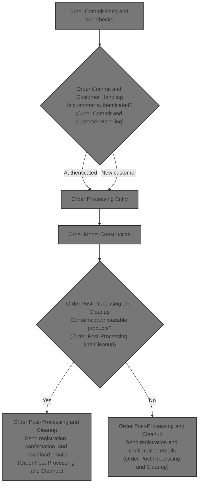
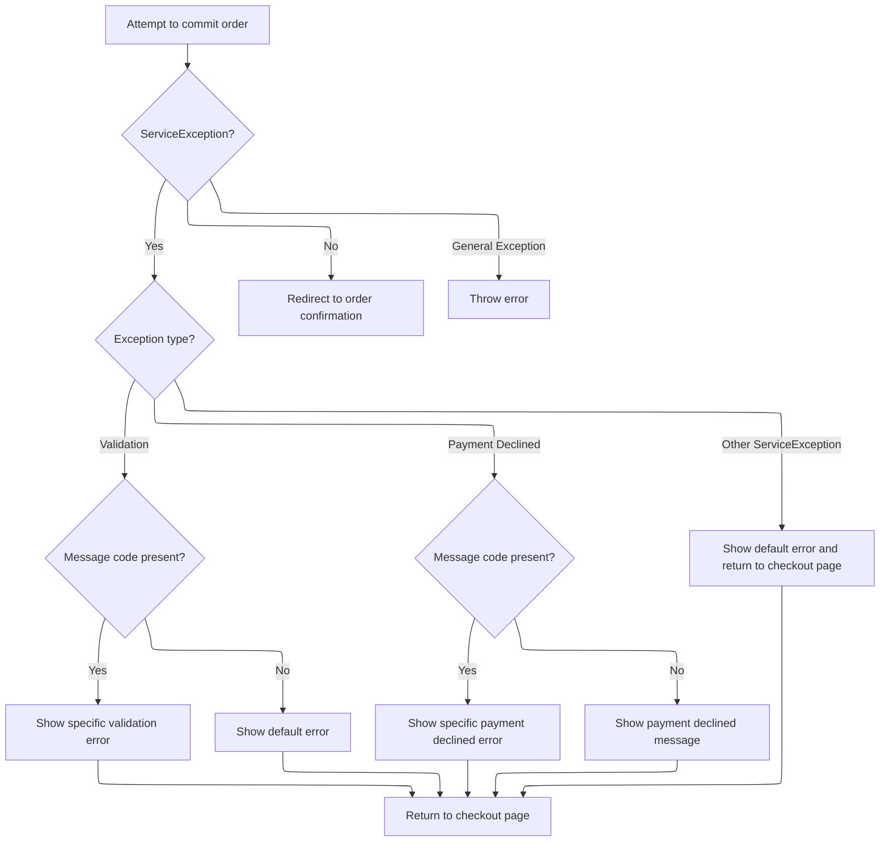

This document describes the flow for committing an order, from cart and payment validation, through customer authentication or registration, to order processing and completion. The flow enforces business rules, manages customer data, and ensures users receive confirmation and registration emails, including for downloadable products. Error handling provides user feedback throughout the process.



# Order Commit Entry and Pre-checks

This section governs the business logic for committing an order, including pre-checks for cart validity, payment method selection, shipping quote preparation, and order validation. It ensures all necessary context is set before the order is finalized.

| Category        | Rule Name                  | Description                                                                                                                                               |
| --------------- | -------------------------- | --------------------------------------------------------------------------------------------------------------------------------------------------------- |
| Data validation | Cart Code Required         | If the shopping cart code is missing from both the session and the cookie, the order process is terminated and the user is redirected to a timeout view.  |
| Data validation | Store Code Match           | If the merchant store code in the cookie does not match the current store, the order process is terminated and the user is redirected to a timeout view.  |
| Data validation | Payment Method Required    | If the shopping cart is not free and no payment methods are configured for the store, an error message is shown and the order cannot proceed.             |
| Data validation | Order Validation Required  | Order validation is performed before committing the order. If validation errors are found, the user is returned to the checkout view with error messages. |
| Business logic  | Default Payment Selection  | If no default payment method is selected, the first available payment method is automatically set as the default.                                         |
| Business logic  | Shipping Country Selection | If a shipping quote is available, only countries eligible for shipping are shown; otherwise, all countries are displayed.                                 |
| Business logic  | Default Shipping Option    | If the selected shipping option is not found among available options, the first available shipping option is selected by default.                         |
| Business logic  | Order Commit on Success    | If all pre-checks and validations pass, the order is committed and persisted using the prepared context.                                                  |

<SwmSnippet path="/shopizer/sm-shop/src/main/java/com/salesmanager/web/shop/controller/order/ShoppingOrderController.java" line="514">

---

In <SwmToken path="shopizer/sm-shop/src/main/java/com/salesmanager/web/shop/controller/order/ShoppingOrderController.java" pos="514:5:5" line-data="	public String commitOrder(@CookieValue(&quot;cart&quot;) String cookie, @Valid @ModelAttribute(value=&quot;order&quot;) ShopOrder order, BindingResult bindingResult, Model model, HttpServletRequest request, HttpServletResponse response, Locale locale) throws Exception {">`commitOrder`</SwmToken>, we kick off the order commit flow by checking for a valid shopping cart code in the session or, if missing, parsing it from a cookie (expects 'merchantStoreCode_shoppingCartCode' format). If neither is present or valid, we bail out to a timeout view. Once we have the cart, we load its items, fetch payment methods, check if the cart is free, and select a default payment method if needed. This sets up all the context needed for payment and shipping calculations, not just a simple commit. The function also sets up error handling for missing payment methods and invalid carts, and expects certain fields in the order object for the rest of the flow.

```java
	public String commitOrder(@CookieValue("cart") String cookie, @Valid @ModelAttribute(value="order") ShopOrder order, BindingResult bindingResult, Model model, HttpServletRequest request, HttpServletResponse response, Locale locale) throws Exception {

		MerchantStore store = (MerchantStore)request.getAttribute(Constants.MERCHANT_STORE);
		Language language = (Language)request.getAttribute("LANGUAGE");
		//validate if session has expired
		

			
		try {
				
				//basic stuff
				String shoppingCartCode  = (String)request.getSession().getAttribute(Constants.SHOPPING_CART);
				if(shoppingCartCode==null) {
					
					if(cookie==null) {//session expired and cookie null, nothing to do
						StringBuilder template = new StringBuilder().append(ControllerConstants.Tiles.Pages.timeout).append(".").append(store.getStoreTemplate());
						return template.toString();
					}
					String merchantCookie[] = cookie.split("_");
					String merchantStoreCode = merchantCookie[0];
					if(!merchantStoreCode.equals(store.getCode())) {
						StringBuilder template = new StringBuilder().append(ControllerConstants.Tiles.Pages.timeout).append(".").append(store.getStoreTemplate());
						return template.toString();
					}
					shoppingCartCode = merchantCookie[1];
				}
				com.salesmanager.core.business.shoppingcart.model.ShoppingCart cart = null;
			
			    if(StringUtils.isBlank(shoppingCartCode)) {
					StringBuilder template = new StringBuilder().append(ControllerConstants.Tiles.Pages.timeout).append(".").append(store.getStoreTemplate());
					return template.toString();	
			    }
			    cart = shoppingCartFacade.getShoppingCartModel(shoppingCartCode, store);

				Set<ShoppingCartItem> items = cart.getLineItems();
				List<ShoppingCartItem> cartItems = new ArrayList<ShoppingCartItem>(items);
				order.setShoppingCartItems(cartItems);

				//get payment methods
				List<PaymentMethod> paymentMethods = paymentService.getAcceptedPaymentMethods(store);
				boolean freeShoppingCart = shoppingCartService.isFreeShoppingCart(cart);

				//not free and no payment methods
				if(CollectionUtils.isEmpty(paymentMethods) && !freeShoppingCart) {
					LOGGER.error("No payment method configured");
					model.addAttribute("errorMessages", "No payments configured");
				}
				
				if(!CollectionUtils.isEmpty(paymentMethods)) {//select default payment method
					PaymentMethod defaultPaymentSelected = null;
					for(PaymentMethod paymentMethod : paymentMethods) {
						if(paymentMethod.isDefaultSelected()) {
							defaultPaymentSelected = paymentMethod;
							break;
						}
					}
```

---

</SwmSnippet>

<SwmSnippet path="/shopizer/sm-shop/src/main/java/com/salesmanager/web/shop/controller/order/ShoppingOrderController.java" line="571">

---

After prepping the cart and payment methods, we pick a default payment method if none is set, then fetch the shipping quote and add it to the model. Depending on whether a quote exists, we load either shipping countries or all countries. If a shipping option is selected, we retrieve or calculate its summary and options, and set the selected option in the summary. This chunk connects the initial <SwmPath>[shopizer/…/model/payment/](shopizer/sm-core-model/src/main/java/com/salesmanager/core/business/order/model/payment/)</SwmPath> setup to the shipping logic, prepping everything for order total calculation and validation.

```java
					if(defaultPaymentSelected==null) {//forced default selection
						defaultPaymentSelected = paymentMethods.get(0);
						defaultPaymentSelected.setDefaultSelected(true);
					}
					
					
				}
				
				ShippingQuote quote = orderFacade.getShippingQuote(order.getCustomer(), cart, order, store, language);
				model.addAttribute("shippingQuote", quote);
				model.addAttribute("paymentMethods", paymentMethods);
				
				if(quote!=null) {
					List<Country> shippingCountriesList = orderFacade.getShipToCountry(store, language);
					model.addAttribute("countries", shippingCountriesList);
				} else {
					//get all countries
					List<Country> countries = countryService.getCountries(language);
					model.addAttribute("countries", countries);
				}
				
				//set shipping summary
				if(order.getSelectedShippingOption()!=null) {
					ShippingSummary summary = (ShippingSummary)request.getSession().getAttribute(Constants.SHIPPING_SUMMARY);
					@SuppressWarnings("unchecked")
					List<ShippingOption> options = (List<ShippingOption>)request.getSession().getAttribute(Constants.SHIPPING_OPTIONS);
					
					if(summary==null) {
						summary = orderFacade.getShippingSummary(quote, store, language);
						request.getSession().setAttribute(Constants.SHIPPING_SUMMARY, options);
					}
					
					if(options==null) {
						options = quote.getShippingOptions();
						request.getSession().setAttribute(Constants.SHIPPING_OPTIONS, options);
					}

					ReadableShippingSummary readableSummary = new ReadableShippingSummary();
					ReadableShippingSummaryPopulator readableSummaryPopulator = new ReadableShippingSummaryPopulator();
					readableSummaryPopulator.setPricingService(pricingService);
					readableSummaryPopulator.populate(summary, readableSummary, store, language);
					
					
					if(!CollectionUtils.isEmpty(options)) {
					
						//get submitted shipping option
						ShippingOption quoteOption = null;
						ShippingOption selectedOption = order.getSelectedShippingOption();

						//check if selectedOption exist
						for(ShippingOption shipOption : options) {
							if(!StringUtils.isBlank(shipOption.getOptionId()) && shipOption.getOptionId().equals(selectedOption.getOptionId())) {
								quoteOption = shipOption;
							}
						}
```

---

</SwmSnippet>

<SwmSnippet path="/shopizer/sm-shop/src/main/java/com/salesmanager/web/shop/controller/order/ShoppingOrderController.java" line="626">

---

After prepping shipping and payment, we calculate or fetch the order total summary, set it in the order, and run validation. If there are errors, we return to the checkout view. If validation passes, we call the internal <SwmToken path="shopizer/sm-shop/src/main/java/com/salesmanager/web/shop/controller/order/ShoppingOrderController.java" pos="663:9:9" line-data="				Order modelOrder = this.commitOrder(order, request, locale);">`commitOrder`</SwmToken> to actually create and persist the order, using all the fields we've set up so far.

```java
						if(quoteOption==null) {
							quoteOption = options.get(0);
						}
						
						readableSummary.setSelectedShippingOption(quoteOption);
						readableSummary.setShippingOptions(options);
						summary.setShippingOption(quoteOption.getOptionId());
						summary.setShipping(quoteOption.getOptionPrice());
					
					}

					order.setShippingSummary(summary);
				}
				
				OrderTotalSummary totalSummary = super.getSessionAttribute(Constants.ORDER_SUMMARY, request);
				
				if(totalSummary==null) {
					totalSummary = orderFacade.calculateOrderTotal(store, order, language);
					super.setSessionAttribute(Constants.ORDER_SUMMARY, totalSummary, request);
				}
				
				
				order.setOrderTotalSummary(totalSummary);
				
			
				orderFacade.validateOrder(order, bindingResult, new HashMap<String,String>(), store, locale);
		        
		        if ( bindingResult.hasErrors() )
		        {
		            LOGGER.info( "found {} validation error while validating in customer registration ",
		                         bindingResult.getErrorCount() );
		    		StringBuilder template = new StringBuilder().append(ControllerConstants.Tiles.Checkout.checkout).append(".").append(store.getStoreTemplate());
		    		return template.toString();
	
		        }
		        
		        @SuppressWarnings("unused")
				Order modelOrder = this.commitOrder(order, request, locale);

	        
```

---

</SwmSnippet>

## Order Commit and Customer Handling

This section governs how customer information is handled during order commitment, ensuring that both new and returning customers are properly authenticated or registered, and that orders are processed with accurate customer data.

| Category       | Rule Name                     | Description                                                                                                                                                                                                                                                                                                                                                                                              |
| -------------- | ----------------------------- | -------------------------------------------------------------------------------------------------------------------------------------------------------------------------------------------------------------------------------------------------------------------------------------------------------------------------------------------------------------------------------------------------------- |
| Business logic | Authenticated customer reuse  | If the user is authenticated and has the <SwmToken path="shopizer/sm-shop/src/main/java/com/salesmanager/web/shop/controller/order/ShoppingOrderController.java" pos="383:6:6" line-data="	        		 request.isUserInRole(&quot;AUTH_CUSTOMER&quot;)) {">`AUTH_CUSTOMER`</SwmToken> role, their existing customer profile must be used for the order, including their username, password, and customer ID. |
| Business logic | New customer creation         | If the user is not authenticated or does not have an existing customer profile, a new customer record must be created, and a random password must be generated for them.                                                                                                                                                                                                                                 |
| Business logic | Ship to billing address       | If the customer chooses to ship to their billing address, the delivery address must be set to the billing address for the order.                                                                                                                                                                                                                                                                         |
| Business logic | Initial transaction inclusion | If an initial transaction exists for the order, it must be included in the order processing; otherwise, the order is processed without it.                                                                                                                                                                                                                                                               |

<SwmSnippet path="/shopizer/sm-shop/src/main/java/com/salesmanager/web/shop/controller/order/ShoppingOrderController.java" line="367">

---

In <SwmToken path="shopizer/sm-shop/src/main/java/com/salesmanager/web/shop/controller/order/ShoppingOrderController.java" pos="367:5:5" line-data="	private Order commitOrder(ShopOrder order, HttpServletRequest request, Locale locale) throws Exception, ServiceException {">`commitOrder`</SwmToken>, we handle customer authentication: if the user is logged in, we fetch and set their info; if not, we create a new customer, generate a password, and persist them. Once the customer model is ready, we call <SwmToken path="shopizer/sm-shop/src/main/java/com/salesmanager/web/shop/controller/order/ShoppingOrderController.java" pos="427:3:5" line-data="	        	modelOrder=orderFacade.processOrder(order, modelCustomer, initialTransaction, store, language);">`orderFacade.processOrder`</SwmToken> to actually process and create the order, passing all the customer and order data.

```java
	private Order commitOrder(ShopOrder order, HttpServletRequest request, Locale locale) throws Exception, ServiceException {
		
		
			MerchantStore store = (MerchantStore)request.getAttribute(Constants.MERCHANT_STORE);
			Language language = (Language)request.getAttribute("LANGUAGE");
			
			
			String userName = null;
			String password = null;
			
			PersistableCustomer customer = order.getCustomer();
			
	        /** set username and password to persistable object **/
			Authentication auth = SecurityContextHolder.getContext().getAuthentication();
			Customer authCustomer = null;
        	if(auth != null &&
	        		 request.isUserInRole("AUTH_CUSTOMER")) {
        		authCustomer = customerFacade.getCustomerByUserName(auth.getName(), store);
        		//set id and authentication information
        		customer.setUserName(authCustomer.getNick());
        		customer.setEncodedPassword(authCustomer.getPassword());
        		customer.setId(authCustomer.getId());
	        } else {
	        	//set customer id to null
	        	customer.setId(null);
	        }
		
	        //if the customer is new, generate a password
	        if(customer.getId()==null || customer.getId()==0) {//new customer
	        	password = UserReset.generateRandomString();
	        	String encodedPassword = passwordEncoder.encodePassword(password, null);
	        	customer.setEncodedPassword(encodedPassword);
	        }
	        
	        if(order.isShipToBillingAdress()) {
	        	customer.setDelivery(customer.getBilling());
	        }
	        


			Customer modelCustomer = null;
			try {//set groups
				if(authCustomer==null) {//not authenticated, create a new volatile user
					modelCustomer = customerFacade.getCustomerModel(customer, store, language);
					customerFacade.setCustomerModelDefaultProperties(modelCustomer, store);
					userName = modelCustomer.getNick();
					LOGGER.debug( "About to persist volatile customer to database." );
			        customerService.saveOrUpdate( modelCustomer );
				} else {//use existing customer
					modelCustomer = customerFacade.populateCustomerModel(authCustomer, customer, store, language);
				}
			} catch(Exception e) {
				throw new ServiceException(e);
			}
	        
           
	        
	        Order modelOrder = null;
	        Transaction initialTransaction = (Transaction)super.getSessionAttribute(Constants.INIT_TRANSACTION_KEY, request);
	        if(initialTransaction!=null) {
	        	modelOrder=orderFacade.processOrder(order, modelCustomer, initialTransaction, store, language);
	        } else {
	        	modelOrder=orderFacade.processOrder(order, modelCustomer, store, language);
	        }
	        
```

---

</SwmSnippet>

### Order Processing Entry

This section governs the entry point for processing a new order in Shopizer, ensuring that all required information is present and that the order is created under standard conditions.

| Category        | Rule Name                  | Description                                                                                                                         |
| --------------- | -------------------------- | ----------------------------------------------------------------------------------------------------------------------------------- |
| Data validation | Required order information | An order cannot be processed unless valid order, customer, store, and language information are provided.                            |
| Business logic  | Standard order creation    | Orders processed through this entry point must follow the standard order creation workflow, without any custom transaction context. |

<SwmSnippet path="/shopizer/sm-shop/src/main/java/com/salesmanager/web/shop/controller/order/facade/OrderFacadeImpl.java" line="252">

---

<SwmToken path="shopizer/sm-shop/src/main/java/com/salesmanager/web/shop/controller/order/facade/OrderFacadeImpl.java" pos="252:5:5" line-data="	public Order processOrder(ShopOrder order, Customer customer, MerchantStore store,">`processOrder`</SwmToken> just hands off to <SwmToken path="shopizer/sm-shop/src/main/java/com/salesmanager/web/shop/controller/order/facade/OrderFacadeImpl.java" pos="255:5:5" line-data="		return this.processOrderModel(order, customer, null, store, language);">`processOrderModel`</SwmToken>, passing all the order, customer, store, and language info. The transaction argument is null here, so the flow continues with a standard order creation.

```java
	public Order processOrder(ShopOrder order, Customer customer, MerchantStore store,
			Language language) throws ServiceException {
				
		return this.processOrderModel(order, customer, null, store, language);

	}
```

---

</SwmSnippet>

### Order Model Construction

```mermaid
%%{init: {"flowchart": {"defaultRenderer": "elk"}} }%%
flowchart TD
    node1["Start order model creation"]
    click node1 openCode "shopizer/sm-shop/src/main/java/com/salesmanager/web/shop/controller/order/facade/OrderFacadeImpl.java:267:270"
    node1 --> node2{"Ship to billing address?"}
    click node2 openCode "shopizer/sm-shop/src/main/java/com/salesmanager/web/shop/controller/order/facade/OrderFacadeImpl.java:272:276"
    node2 -->|"Yes"| node3["Set delivery address to billing"]
    click node3 openCode "shopizer/sm-shop/src/main/java/com/salesmanager/web/shop/controller/order/facade/OrderFacadeImpl.java:273:275"
    node2 -->|"No"| node4["Use provided delivery address"]
    click node4 openCode "shopizer/sm-shop/src/main/java/com/salesmanager/web/shop/controller/order/facade/OrderFacadeImpl.java:284:284"
    node3 --> node5["Initialize order model"]
    node4 --> node5
    click node5 openCode "shopizer/sm-shop/src/main/java/com/salesmanager/web/shop/controller/order/facade/OrderFacadeImpl.java:281:288"
    node5 --> node6["Associate customer with order"]
    click node6 openCode "shopizer/sm-shop/src/main/java/com/salesmanager/web/shop/controller/order/facade/OrderFacadeImpl.java:338:338"
    node6 --> node7["Associate store details"]
    click node7 openCode "shopizer/sm-shop/src/main/java/com/salesmanager/web/shop/controller/order/facade/OrderFacadeImpl.java:332:333"
    node7 --> node8["Set payment and shipping modules"]
    click node8 openCode "shopizer/sm-shop/src/main/java/com/salesmanager/web/shop/controller/order/facade/OrderFacadeImpl.java:285:287"
    node8 --> node9["Set order date and locale"]
    click node9 openCode "shopizer/sm-shop/src/main/java/com/salesmanager/web/shop/controller/order/facade/OrderFacadeImpl.java:282:288"
    node9 --> node10["Populate order products"]
    click node10 openCode "shopizer/sm-shop/src/main/java/com/salesmanager/web/shop/controller/order/facade/OrderFacadeImpl.java:290:303"
    subgraph loop1["For each shopping cart item"]
      node10 --> node11["Create and populate order product"]
      click node11 openCode "shopizer/sm-shop/src/main/java/com/salesmanager/web/shop/controller/order/facade/OrderFacadeImpl.java:299:302"
      node11 --> node10
    end
    node10 --> node12["Sort and associate order totals"]
    click node12 openCode "shopizer/sm-shop/src/main/java/com/salesmanager/web/shop/controller/order/facade/OrderFacadeImpl.java:308:326"
    subgraph loop2["For each order total"]
      node12 --> node13["Associate total with order"]
      click node13 openCode "shopizer/sm-shop/src/main/java/com/salesmanager/web/shop/controller/order/facade/OrderFacadeImpl.java:324:325"
      node13 --> node12
    end
    node12 --> node14{"Payment method?"}
    click node14 openCode "shopizer/sm-shop/src/main/java/com/salesmanager/web/shop/controller/order/facade/OrderFacadeImpl.java:345:348"
    node14 -->|"Credit Card"| node15{"Credit card type?"}
    click node15 openCode "shopizer/sm-shop/src/main/java/com/salesmanager/web/shop/controller/order/facade/OrderFacadeImpl.java:360:372"
    node15 -->|"AMEX"| node16["Set AMEX card details"]
    click node16 openCode "shopizer/sm-shop/src/main/java/com/salesmanager/web/shop/controller/order/facade/OrderFacadeImpl.java:363:388"
    node15 -->|"VISA"| node17["Set VISA card details"]
    click node17 openCode "shopizer/sm-shop/src/main/java/com/salesmanager/web/shop/controller/order/facade/OrderFacadeImpl.java:365:388"
    node15 -->|"MASTERCARD"| node18["Set MASTERCARD card details"]
    click node18 openCode "shopizer/sm-shop/src/main/java/com/salesmanager/web/shop/controller/order/facade/OrderFacadeImpl.java:367:388"
    node15 -->|"Other"| node19["Set other card details"]
    click node19 openCode "shopizer/sm-shop/src/main/java/com/salesmanager/web/shop/controller/order/facade/OrderFacadeImpl.java:369:388"
    node14 -->|"PayPal"| node20{"Has transaction?"}
    click node20 openCode "shopizer/sm-shop/src/main/java/com/salesmanager/web/shop/controller/order/facade/OrderFacadeImpl.java:395:397"
    node20 -->|"Yes"| node21["Set PayPal details"]
    click node21 openCode "shopizer/sm-shop/src/main/java/com/salesmanager/web/shop/controller/order/facade/OrderFacadeImpl.java:401:402"
    node20 -->|"No"| node22["Cannot process order"]
    click node22 openCode "shopizer/sm-shop/src/main/java/com/salesmanager/web/shop/controller/order/facade/OrderFacadeImpl.java:396:397"
    node16 --> node23["Finalize order details"]
    node17 --> node23
    node18 --> node23
    node19 --> node23
    node21 --> node23
    node23 --> node24["Process order"]
    click node24 openCode "shopizer/sm-shop/src/main/java/com/salesmanager/web/shop/controller/order/facade/OrderFacadeImpl.java:411:415"
    node24 --> node25["Return finalized order"]
    click node25 openCode "shopizer/sm-shop/src/main/java/com/salesmanager/web/shop/controller/order/facade/OrderFacadeImpl.java:419:419"

classDef HeadingStyle fill:#777777,stroke:#333,stroke-width:2px;

%% Swimm:
%% %%{init: {"flowchart": {"defaultRenderer": "elk"}} }%%
%% flowchart TD
%%     node1["Start order model creation"]
%%     click node1 openCode "<SwmPath>[shopizer/…/facade/OrderFacadeImpl.java](shopizer/sm-shop/src/main/java/com/salesmanager/web/shop/controller/order/facade/OrderFacadeImpl.java)</SwmPath>:267:270"
%%     node1 --> node2{"Ship to billing address?"}
%%     click node2 openCode "<SwmPath>[shopizer/…/facade/OrderFacadeImpl.java](shopizer/sm-shop/src/main/java/com/salesmanager/web/shop/controller/order/facade/OrderFacadeImpl.java)</SwmPath>:272:276"
%%     node2 -->|"Yes"| node3["Set delivery address to billing"]
%%     click node3 openCode "<SwmPath>[shopizer/…/facade/OrderFacadeImpl.java](shopizer/sm-shop/src/main/java/com/salesmanager/web/shop/controller/order/facade/OrderFacadeImpl.java)</SwmPath>:273:275"
%%     node2 -->|"No"| node4["Use provided delivery address"]
%%     click node4 openCode "<SwmPath>[shopizer/…/facade/OrderFacadeImpl.java](shopizer/sm-shop/src/main/java/com/salesmanager/web/shop/controller/order/facade/OrderFacadeImpl.java)</SwmPath>:284:284"
%%     node3 --> node5["Initialize order model"]
%%     node4 --> node5
%%     click node5 openCode "<SwmPath>[shopizer/…/facade/OrderFacadeImpl.java](shopizer/sm-shop/src/main/java/com/salesmanager/web/shop/controller/order/facade/OrderFacadeImpl.java)</SwmPath>:281:288"
%%     node5 --> node6["Associate customer with order"]
%%     click node6 openCode "<SwmPath>[shopizer/…/facade/OrderFacadeImpl.java](shopizer/sm-shop/src/main/java/com/salesmanager/web/shop/controller/order/facade/OrderFacadeImpl.java)</SwmPath>:338:338"
%%     node6 --> node7["Associate store details"]
%%     click node7 openCode "<SwmPath>[shopizer/…/facade/OrderFacadeImpl.java](shopizer/sm-shop/src/main/java/com/salesmanager/web/shop/controller/order/facade/OrderFacadeImpl.java)</SwmPath>:332:333"
%%     node7 --> node8["Set payment and shipping modules"]
%%     click node8 openCode "<SwmPath>[shopizer/…/facade/OrderFacadeImpl.java](shopizer/sm-shop/src/main/java/com/salesmanager/web/shop/controller/order/facade/OrderFacadeImpl.java)</SwmPath>:285:287"
%%     node8 --> node9["Set order date and locale"]
%%     click node9 openCode "<SwmPath>[shopizer/…/facade/OrderFacadeImpl.java](shopizer/sm-shop/src/main/java/com/salesmanager/web/shop/controller/order/facade/OrderFacadeImpl.java)</SwmPath>:282:288"
%%     node9 --> node10["Populate order products"]
%%     click node10 openCode "<SwmPath>[shopizer/…/facade/OrderFacadeImpl.java](shopizer/sm-shop/src/main/java/com/salesmanager/web/shop/controller/order/facade/OrderFacadeImpl.java)</SwmPath>:290:303"
%%     subgraph loop1["For each shopping cart item"]
%%       node10 --> node11["Create and populate order product"]
%%       click node11 openCode "<SwmPath>[shopizer/…/facade/OrderFacadeImpl.java](shopizer/sm-shop/src/main/java/com/salesmanager/web/shop/controller/order/facade/OrderFacadeImpl.java)</SwmPath>:299:302"
%%       node11 --> node10
%%     end
%%     node10 --> node12["Sort and associate order totals"]
%%     click node12 openCode "<SwmPath>[shopizer/…/facade/OrderFacadeImpl.java](shopizer/sm-shop/src/main/java/com/salesmanager/web/shop/controller/order/facade/OrderFacadeImpl.java)</SwmPath>:308:326"
%%     subgraph loop2["For each order total"]
%%       node12 --> node13["Associate total with order"]
%%       click node13 openCode "<SwmPath>[shopizer/…/facade/OrderFacadeImpl.java](shopizer/sm-shop/src/main/java/com/salesmanager/web/shop/controller/order/facade/OrderFacadeImpl.java)</SwmPath>:324:325"
%%       node13 --> node12
%%     end
%%     node12 --> node14{"Payment method?"}
%%     click node14 openCode "<SwmPath>[shopizer/…/facade/OrderFacadeImpl.java](shopizer/sm-shop/src/main/java/com/salesmanager/web/shop/controller/order/facade/OrderFacadeImpl.java)</SwmPath>:345:348"
%%     node14 -->|"Credit Card"| node15{"Credit card type?"}
%%     click node15 openCode "<SwmPath>[shopizer/…/facade/OrderFacadeImpl.java](shopizer/sm-shop/src/main/java/com/salesmanager/web/shop/controller/order/facade/OrderFacadeImpl.java)</SwmPath>:360:372"
%%     node15 -->|"AMEX"| node16["Set AMEX card details"]
%%     click node16 openCode "<SwmPath>[shopizer/…/facade/OrderFacadeImpl.java](shopizer/sm-shop/src/main/java/com/salesmanager/web/shop/controller/order/facade/OrderFacadeImpl.java)</SwmPath>:363:388"
%%     node15 -->|"VISA"| node17["Set VISA card details"]
%%     click node17 openCode "<SwmPath>[shopizer/…/facade/OrderFacadeImpl.java](shopizer/sm-shop/src/main/java/com/salesmanager/web/shop/controller/order/facade/OrderFacadeImpl.java)</SwmPath>:365:388"
%%     node15 -->|"MASTERCARD"| node18["Set MASTERCARD card details"]
%%     click node18 openCode "<SwmPath>[shopizer/…/facade/OrderFacadeImpl.java](shopizer/sm-shop/src/main/java/com/salesmanager/web/shop/controller/order/facade/OrderFacadeImpl.java)</SwmPath>:367:388"
%%     node15 -->|"Other"| node19["Set other card details"]
%%     click node19 openCode "<SwmPath>[shopizer/…/facade/OrderFacadeImpl.java](shopizer/sm-shop/src/main/java/com/salesmanager/web/shop/controller/order/facade/OrderFacadeImpl.java)</SwmPath>:369:388"
%%     node14 -->|"PayPal"| node20{"Has transaction?"}
%%     click node20 openCode "<SwmPath>[shopizer/…/facade/OrderFacadeImpl.java](shopizer/sm-shop/src/main/java/com/salesmanager/web/shop/controller/order/facade/OrderFacadeImpl.java)</SwmPath>:395:397"
%%     node20 -->|"Yes"| node21["Set PayPal details"]
%%     click node21 openCode "<SwmPath>[shopizer/…/facade/OrderFacadeImpl.java](shopizer/sm-shop/src/main/java/com/salesmanager/web/shop/controller/order/facade/OrderFacadeImpl.java)</SwmPath>:401:402"
%%     node20 -->|"No"| node22["Cannot process order"]
%%     click node22 openCode "<SwmPath>[shopizer/…/facade/OrderFacadeImpl.java](shopizer/sm-shop/src/main/java/com/salesmanager/web/shop/controller/order/facade/OrderFacadeImpl.java)</SwmPath>:396:397"
%%     node16 --> node23["Finalize order details"]
%%     node17 --> node23
%%     node18 --> node23
%%     node19 --> node23
%%     node21 --> node23
%%     node23 --> node24["Process order"]
%%     click node24 openCode "<SwmPath>[shopizer/…/facade/OrderFacadeImpl.java](shopizer/sm-shop/src/main/java/com/salesmanager/web/shop/controller/order/facade/OrderFacadeImpl.java)</SwmPath>:411:415"
%%     node24 --> node25["Return finalized order"]
%%     click node25 openCode "<SwmPath>[shopizer/…/facade/OrderFacadeImpl.java](shopizer/sm-shop/src/main/java/com/salesmanager/web/shop/controller/order/facade/OrderFacadeImpl.java)</SwmPath>:419:419"
%% 
%% classDef HeadingStyle fill:#777777,stroke:#333,stroke-width:2px;
```



This section is responsible for constructing the core order model from the provided order, customer, transaction, and store data. It ensures all relevant fields are populated, business rules are enforced, and the order is ready for further processing and completion.

| Category        | Rule Name                            | Description                                                                                                                                                                      |
| --------------- | ------------------------------------ | -------------------------------------------------------------------------------------------------------------------------------------------------------------------------------- |
| Data validation | PayPal Transaction Validation        | If PayPal is selected as the payment method, a valid transaction must be present; otherwise, the order cannot be processed.                                                      |
| Data validation | Credit Card Masking                  | Credit card numbers must be masked before being stored in the order model.                                                                                                       |
| Business logic  | Ship to Billing Address              | If the customer chooses to ship to their billing address, the delivery address must be set to the billing address for the order.                                                 |
| Business logic  | Convert Cart Items to Order Products | All shopping cart items must be converted into order products and associated with the order.                                                                                     |
| Business logic  | Order Totals Sorting                 | Order totals must be sorted by their defined sort order before being associated with the order.                                                                                  |
| Business logic  | Payment Method Handling              | The order must include the correct payment method and details, with specific handling for credit card types (AMEX, VISA, MASTERCARD, DINERS, DISCOVERY) and PayPal transactions. |
| Business logic  | Associate Customer and Store         | The order must be associated with the correct customer and store details, including currency and locale for formatting.                                                          |

<SwmSnippet path="/shopizer/sm-shop/src/main/java/com/salesmanager/web/shop/controller/order/facade/OrderFacadeImpl.java" line="267">

---

In <SwmToken path="shopizer/sm-shop/src/main/java/com/salesmanager/web/shop/controller/order/facade/OrderFacadeImpl.java" pos="267:5:5" line-data="	private Order processOrderModel(ShopOrder order, Customer customer, Transaction transaction, MerchantStore store,">`processOrderModel`</SwmToken>, we set up the order model: handle shipping-to-billing if needed, set basic fields, and convert shopping cart items to order products using the populator. This builds the core order data structure for the next steps.

```java
	private Order processOrderModel(ShopOrder order, Customer customer, Transaction transaction, MerchantStore store,
			Language language) throws ServiceException {
		
		try {
			
			if(order.isShipToBillingAdress()) {//customer shipping is billing
				PersistableCustomer orderCustomer = order.getCustomer();
				Address billing = orderCustomer.getBilling();
				orderCustomer.setDelivery(billing);
			}

 

			
			Order modelOrder = new Order();
			modelOrder.setDatePurchased(new Date());
			modelOrder.setBilling(customer.getBilling());
			modelOrder.setDelivery(customer.getDelivery());
			modelOrder.setPaymentModuleCode(order.getPaymentModule());
			modelOrder.setPaymentType(PaymentType.valueOf(order.getPaymentMethodType()));
			modelOrder.setShippingModuleCode(order.getShippingModule());
			modelOrder.setLocale(LocaleUtils.getLocale(store));//set the store locale based on the country for order $ formatting
	
			List<ShoppingCartItem> shoppingCartItems = order.getShoppingCartItems();
			Set<OrderProduct> orderProducts = new LinkedHashSet<OrderProduct>();
			
			OrderProductPopulator orderProductPopulator = new OrderProductPopulator();
			orderProductPopulator.setDigitalProductService(digitalProductService);
			orderProductPopulator.setProductAttributeService(productAttributeService);
			orderProductPopulator.setProductService(productService);
			
			for(ShoppingCartItem item : shoppingCartItems) {
				OrderProduct orderProduct = new OrderProduct();
				orderProduct = orderProductPopulator.populate(item, orderProduct , store, language);
				orderProduct.setOrder(modelOrder);
				orderProducts.add(orderProduct);
			}
```

---

</SwmSnippet>

<SwmSnippet path="/shopizer/sm-shop/src/main/java/com/salesmanager/web/shop/controller/order/facade/OrderFacadeImpl.java" line="305">

---

After building the order products, we sort and attach the order totals to the order model, making sure they're in the right order and linked to the order. This sets up the financial summary for the order before finalizing.

```java
			modelOrder.setOrderProducts(orderProducts);
			
			OrderTotalSummary summary = order.getOrderTotalSummary();
			List<com.salesmanager.core.business.order.model.OrderTotal> totals = summary.getTotals();

			//re-order totals
			Collections.sort(
					totals,
					new Comparator<com.salesmanager.core.business.order.model.OrderTotal>() {
					       public int compare(com.salesmanager.core.business.order.model.OrderTotal x, com.salesmanager.core.business.order.model.OrderTotal y) {
					            if(x.getSortOrder()==y.getSortOrder())
					            	return 0;
					            return x.getSortOrder() < y.getSortOrder() ? -1 : 1;
					        }
				
			});
			
			Set<com.salesmanager.core.business.order.model.OrderTotal> modelTotals = new LinkedHashSet<com.salesmanager.core.business.order.model.OrderTotal>();
			for(com.salesmanager.core.business.order.model.OrderTotal total : totals) {
				total.setOrder(modelOrder);
				modelTotals.add(total);
			}
```

---

</SwmSnippet>

<SwmSnippet path="/shopizer/sm-shop/src/main/java/com/salesmanager/web/shop/controller/order/facade/OrderFacadeImpl.java" line="328">

---

We finalize the order with payment and customer info, process it, and return the completed order model.

```java
			modelOrder.setOrderTotal(modelTotals);
			modelOrder.setTotal(order.getOrderTotalSummary().getTotal());
	
			//order misc objects
			modelOrder.setCurrency(store.getCurrency());
			modelOrder.setMerchant(store);

			
			
			//customer object
			orderCustomer(customer, modelOrder, language);
			
			//populate shipping information
			if(!StringUtils.isBlank(order.getShippingModule())) {
				modelOrder.setShippingModuleCode(order.getShippingModule());
			}
			
			String paymentType = order.getPaymentMethodType();
			Payment payment = new Payment();
			payment.setPaymentType(PaymentType.valueOf(paymentType));
			if(PaymentType.CREDITCARD.name().equals(paymentType)) {
				
				
				
				payment = new CreditCardPayment();
				((CreditCardPayment)payment).setCardOwner(order.getPayment().get("creditcard_card_holder"));
				((CreditCardPayment)payment).setCredidCardValidationNumber(order.getPayment().get("creditcard_card_cvv"));
				((CreditCardPayment)payment).setCreditCardNumber(order.getPayment().get("creditcard_card_number"));
				((CreditCardPayment)payment).setExpirationMonth(order.getPayment().get("creditcard_card_expirationmonth"));
				((CreditCardPayment)payment).setExpirationYear(order.getPayment().get("creditcard_card_expirationyear"));
				
				CreditCardType creditCardType =null;
				String cardType = order.getPayment().get("creditcard_card_type");
				
				if(cardType.equalsIgnoreCase(CreditCardType.AMEX.name())) {
					creditCardType = CreditCardType.AMEX;
				} else if(cardType.equalsIgnoreCase(CreditCardType.VISA.name())) {
					creditCardType = CreditCardType.VISA;
				} else if(cardType.equalsIgnoreCase(CreditCardType.MASTERCARD.name())) {
					creditCardType = CreditCardType.MASTERCARD;
				} else if(cardType.equalsIgnoreCase(CreditCardType.DINERS.name())) {
					creditCardType = CreditCardType.DINERS;
				} else if(cardType.equalsIgnoreCase(CreditCardType.DISCOVERY.name())) {
					creditCardType = CreditCardType.DISCOVERY;
				}
				

				
				
				((CreditCardPayment)payment).setCreditCard(creditCardType);
			
				CreditCard cc = new CreditCard();
				cc.setCardType(creditCardType);
				cc.setCcCvv(((CreditCardPayment)payment).getCredidCardValidationNumber());
				cc.setCcOwner(((CreditCardPayment)payment).getCardOwner());
				cc.setCcExpires(((CreditCardPayment)payment).getExpirationMonth() + "-" + ((CreditCardPayment)payment).getExpirationYear());
			
				//hash credit card number
				String maskedNumber = CreditCardUtils.maskCardNumber(order.getPayment().get("creditcard_card_number"));
				cc.setCcNumber(maskedNumber);
				modelOrder.setCreditCard(cc);

			}
			
			if(PaymentType.PAYPAL.name().equals(paymentType)) {
				
				//check for previous transaction
				if(transaction==null) {
					throw new ServiceException("payment.error");
				}
				
				payment = new com.salesmanager.core.business.payments.model.PaypalPayment();
				
				((com.salesmanager.core.business.payments.model.PaypalPayment)payment).setPayerId(transaction.getTransactionDetails().get("PAYERID"));
				((com.salesmanager.core.business.payments.model.PaypalPayment)payment).setPaymentToken(transaction.getTransactionDetails().get("TOKEN"));
				
				
			}
			

			modelOrder.setPaymentModuleCode(order.getPaymentModule());
			payment.setModuleName(order.getPaymentModule());

			if(transaction!=null) {
				orderService.processOrder(modelOrder, customer, order.getShoppingCartItems(), summary, payment, store);
			} else {
				orderService.processOrder(modelOrder, customer, order.getShoppingCartItems(), summary, payment, transaction, store);
			}
			

			
			return modelOrder;
		
		} catch(ServiceException se) {//may be invalid credit card
			throw se;
		} catch(Exception e) {
			throw new ServiceException(e);
		}
		
	}
```

---

</SwmSnippet>

### Order Post-Processing and Cleanup

```mermaid
%%{init: {"flowchart": {"defaultRenderer": "elk"}} }%%
flowchart TD
    node1["Save order ID and token in session"]
    click node1 openCode "shopizer/sm-shop/src/main/java/com/salesmanager/web/shop/controller/order/ShoppingOrderController.java:432:435"
    node1 --> node2{"Is there a shopping cart?"}
    click node2 openCode "shopizer/sm-shop/src/main/java/com/salesmanager/web/shop/controller/order/ShoppingOrderController.java:439:440"
    node2 -->|"Yes"| node3["Delete shopping cart"]
    click node3 openCode "shopizer/sm-shop/src/main/java/com/salesmanager/web/shop/controller/order/ShoppingOrderController.java:441:447"
    node2 -->|"No"| node4["Clean up session data"]
    node3 --> node4
    click node4 openCode "shopizer/sm-shop/src/main/java/com/salesmanager/web/shop/controller/order/ShoppingOrderController.java:451:456"
    node4 --> node5["Refresh customer info"]
    click node5 openCode "shopizer/sm-shop/src/main/java/com/salesmanager/web/shop/controller/order/ShoppingOrderController.java:463:463"
    node5 --> node6{"Order contains downloads?"}
    click node6 openCode "shopizer/sm-shop/src/main/java/com/salesmanager/web/shop/controller/order/ShoppingOrderController.java:468:469"
    node6 -->|"Yes"| node7{"Is customer authenticated?"}
    node6 -->|"No"| node10["Send order confirmation email"]
    click node10 openCode "shopizer/sm-shop/src/main/java/com/salesmanager/web/shop/controller/order/ShoppingOrderController.java:490:490"
    node7 -->|"No"| node8["Authenticate customer"]
    click node8 openCode "shopizer/sm-shop/src/main/java/com/salesmanager/web/shop/controller/order/ShoppingOrderController.java:477:478"
    node7 -->|"Yes"| node9["Is customer new?"]
    click node9 openCode "shopizer/sm-shop/src/main/java/com/salesmanager/web/shop/controller/order/ShoppingOrderController.java:481:482"
    node8 --> node9
    node9 -->|"Yes"| node12["Send registration email"]
    click node12 openCode "shopizer/sm-shop/src/main/java/com/salesmanager/web/utils/EmailTemplatesUtils.java:273:312"
    node9 -->|"No"| node10
    node12 --> node10
    node10 --> node13{"Order has downloadable files?"}
    click node13 openCode "shopizer/sm-shop/src/main/java/com/salesmanager/web/shop/controller/order/ShoppingOrderController.java:492:493"
    node13 -->|"Yes"| node14["Send download email"]
    click node14 openCode "shopizer/sm-shop/src/main/java/com/salesmanager/web/shop/controller/order/ShoppingOrderController.java:493:493"
    node13 -->|"No"| node15["Return completed order"]
    click node15 openCode "shopizer/sm-shop/src/main/java/com/salesmanager/web/shop/controller/order/ShoppingOrderController.java:505:505"
    node14 --> node15
classDef HeadingStyle fill:#777777,stroke:#333,stroke-width:2px;

%% Swimm:
%% %%{init: {"flowchart": {"defaultRenderer": "elk"}} }%%
%% flowchart TD
%%     node1["Save order ID and token in session"]
%%     click node1 openCode "<SwmPath>[shopizer/…/order/ShoppingOrderController.java](shopizer/sm-shop/src/main/java/com/salesmanager/web/shop/controller/order/ShoppingOrderController.java)</SwmPath>:432:435"
%%     node1 --> node2{"Is there a shopping cart?"}
%%     click node2 openCode "<SwmPath>[shopizer/…/order/ShoppingOrderController.java](shopizer/sm-shop/src/main/java/com/salesmanager/web/shop/controller/order/ShoppingOrderController.java)</SwmPath>:439:440"
%%     node2 -->|"Yes"| node3["Delete shopping cart"]
%%     click node3 openCode "<SwmPath>[shopizer/…/order/ShoppingOrderController.java](shopizer/sm-shop/src/main/java/com/salesmanager/web/shop/controller/order/ShoppingOrderController.java)</SwmPath>:441:447"
%%     node2 -->|"No"| node4["Clean up session data"]
%%     node3 --> node4
%%     click node4 openCode "<SwmPath>[shopizer/…/order/ShoppingOrderController.java](shopizer/sm-shop/src/main/java/com/salesmanager/web/shop/controller/order/ShoppingOrderController.java)</SwmPath>:451:456"
%%     node4 --> node5["Refresh customer info"]
%%     click node5 openCode "<SwmPath>[shopizer/…/order/ShoppingOrderController.java](shopizer/sm-shop/src/main/java/com/salesmanager/web/shop/controller/order/ShoppingOrderController.java)</SwmPath>:463:463"
%%     node5 --> node6{"Order contains downloads?"}
%%     click node6 openCode "<SwmPath>[shopizer/…/order/ShoppingOrderController.java](shopizer/sm-shop/src/main/java/com/salesmanager/web/shop/controller/order/ShoppingOrderController.java)</SwmPath>:468:469"
%%     node6 -->|"Yes"| node7{"Is customer authenticated?"}
%%     node6 -->|"No"| node10["Send order confirmation email"]
%%     click node10 openCode "<SwmPath>[shopizer/…/order/ShoppingOrderController.java](shopizer/sm-shop/src/main/java/com/salesmanager/web/shop/controller/order/ShoppingOrderController.java)</SwmPath>:490:490"
%%     node7 -->|"No"| node8["Authenticate customer"]
%%     click node8 openCode "<SwmPath>[shopizer/…/order/ShoppingOrderController.java](shopizer/sm-shop/src/main/java/com/salesmanager/web/shop/controller/order/ShoppingOrderController.java)</SwmPath>:477:478"
%%     node7 -->|"Yes"| node9["Is customer new?"]
%%     click node9 openCode "<SwmPath>[shopizer/…/order/ShoppingOrderController.java](shopizer/sm-shop/src/main/java/com/salesmanager/web/shop/controller/order/ShoppingOrderController.java)</SwmPath>:481:482"
%%     node8 --> node9
%%     node9 -->|"Yes"| node12["Send registration email"]
%%     click node12 openCode "<SwmPath>[shopizer/…/utils/EmailTemplatesUtils.java](shopizer/sm-shop/src/main/java/com/salesmanager/web/utils/EmailTemplatesUtils.java)</SwmPath>:273:312"
%%     node9 -->|"No"| node10
%%     node12 --> node10
%%     node10 --> node13{"Order has downloadable files?"}
%%     click node13 openCode "<SwmPath>[shopizer/…/order/ShoppingOrderController.java](shopizer/sm-shop/src/main/java/com/salesmanager/web/shop/controller/order/ShoppingOrderController.java)</SwmPath>:492:493"
%%     node13 -->|"Yes"| node14["Send download email"]
%%     click node14 openCode "<SwmPath>[shopizer/…/order/ShoppingOrderController.java](shopizer/sm-shop/src/main/java/com/salesmanager/web/shop/controller/order/ShoppingOrderController.java)</SwmPath>:493:493"
%%     node13 -->|"No"| node15["Return completed order"]
%%     click node15 openCode "<SwmPath>[shopizer/…/order/ShoppingOrderController.java](shopizer/sm-shop/src/main/java/com/salesmanager/web/shop/controller/order/ShoppingOrderController.java)</SwmPath>:505:505"
%%     node14 --> node15
%% classDef HeadingStyle fill:#777777,stroke:#333,stroke-width:2px;
```



<SwmSnippet path="/shopizer/sm-shop/src/main/java/com/salesmanager/web/shop/controller/order/ShoppingOrderController.java" line="432">

---

After returning from `OrderFacadeImpl.processOrder`, we clean up session and cart data, handle customer authentication for downloads, and if the customer is new, we call <SwmToken path="shopizer/sm-shop/src/main/java/com/salesmanager/web/shop/controller/order/ShoppingOrderController.java" pos="485:1:3" line-data="						emailTemplatesUtils.sendRegistrationEmail( customer, store, locale, request.getContextPath() );">`emailTemplatesUtils.sendRegistrationEmail`</SwmToken> to send them their credentials. This wraps up the order commit flow in `ShoppingOrderController.commitOrder` before moving to confirmation emails.

```java
	        //save order id in session
	        super.setSessionAttribute(Constants.ORDER_ID, modelOrder.getId(), request);
	        //set a unique token for confirmation
	        super.setSessionAttribute(Constants.ORDER_ID_TOKEN, modelOrder.getId(), request);
	        

			//get cart
			String cartCode = super.getSessionAttribute(Constants.SHOPPING_CART, request);
			if(StringUtils.isNotBlank(cartCode)) {
				try {
					shoppingCartFacade.deleteShoppingCart(cartCode, store);
				} catch(Exception e) {
					LOGGER.error("Cannot delete cart " + cartCode, e);
					throw new ServiceException(e);
				}
			}

			
	        //cleanup the order objects
	        super.removeAttribute(Constants.ORDER, request);
	        super.removeAttribute(Constants.ORDER_SUMMARY, request);
	        super.removeAttribute(Constants.INIT_TRANSACTION_KEY, request);
	        super.removeAttribute(Constants.SHIPPING_OPTIONS, request);
	        super.removeAttribute(Constants.SHIPPING_SUMMARY, request);
	        super.removeAttribute(Constants.SHOPPING_CART, request);
	        
	        
	        

	        try {
		        //refresh customer --
	        	modelCustomer = customerFacade.getCustomerByUserName(modelCustomer.getNick(), store);
		        
	        	//if has downloads, authenticate
	        	
	        	//check if any downloads exist for this order6
	    		List<OrderProductDownload> orderProductDownloads = orderProdctDownloadService.getByOrderId(modelOrder.getId());
	    		if(CollectionUtils.isNotEmpty(orderProductDownloads)) {

		        	LOGGER.debug("Is user authenticated ? ",auth.isAuthenticated());
		        	if(auth != null &&
			        		 request.isUserInRole("AUTH_CUSTOMER")) {
			        	//already authenticated
			        } else {
				        //authenticate
				        customerFacade.authenticate(modelCustomer, userName, password);
				        super.setSessionAttribute(Constants.CUSTOMER, modelCustomer, request);
			        }
		        	//send new user registration template
					if(order.getCustomer().getId()==null || order.getCustomer().getId().longValue()==0) {
						//send email for new customer
						customer.setClearPassword(password);//set clear password for email
						customer.setUserName(userName);
						emailTemplatesUtils.sendRegistrationEmail( customer, store, locale, request.getContextPath() );
					}
	    		}
	    		
```

---

</SwmSnippet>

<SwmSnippet path="/shopizer/sm-shop/src/main/java/com/salesmanager/web/utils/EmailTemplatesUtils.java" line="273">

---

<SwmToken path="shopizer/sm-shop/src/main/java/com/salesmanager/web/utils/EmailTemplatesUtils.java" pos="273:5:5" line-data="	public void sendRegistrationEmail(">`sendRegistrationEmail`</SwmToken> builds a token map for the email template using customer billing info, username, and password, then sends the email via Shopizer's email service. It relies on Shopizer utilities and expects specific customer fields for personalization.

```java
	public void sendRegistrationEmail(
		PersistableCustomer customer, MerchantStore merchantStore,
			Locale customerLocale, String contextPath) {
		   /** issue with putting that elsewhere **/ 
	       LOGGER.info( "Sending welcome email to customer" );
	       try {

	           Map<String, String> templateTokens = EmailUtils.createEmailObjectsMap(contextPath, merchantStore, messages, customerLocale);
	           templateTokens.put(EmailConstants.LABEL_HI, messages.getMessage("label.generic.hi", customerLocale));
	           templateTokens.put(EmailConstants.EMAIL_CUSTOMER_FIRSTNAME, customer.getBilling().getFirstName());
	           templateTokens.put(EmailConstants.EMAIL_CUSTOMER_LASTNAME, customer.getBilling().getLastName());
	           String[] greetingMessage = {merchantStore.getStorename(),FilePathUtils.buildCustomerUri(merchantStore,contextPath),merchantStore.getStoreEmailAddress()};
	           templateTokens.put(EmailConstants.EMAIL_CUSTOMER_GREETING, messages.getMessage("email.customer.greeting", greetingMessage, customerLocale));
	           templateTokens.put(EmailConstants.EMAIL_USERNAME_LABEL, messages.getMessage("label.generic.username",customerLocale));
	           templateTokens.put(EmailConstants.EMAIL_PASSWORD_LABEL, messages.getMessage("label.generic.password",customerLocale));
	           templateTokens.put(EmailConstants.CUSTOMER_ACCESS_LABEL, messages.getMessage("label.customer.accessportal",customerLocale));
	           templateTokens.put(EmailConstants.ACCESS_NOW_LABEL, messages.getMessage("label.customer.accessnow",customerLocale));
	           templateTokens.put(EmailConstants.EMAIL_USER_NAME, customer.getUserName());
	           templateTokens.put(EmailConstants.EMAIL_CUSTOMER_PASSWORD, customer.getClearPassword());

	           //shop url
	           String customerUrl = FilePathUtils.buildStoreUri(merchantStore, contextPath);
	           templateTokens.put(EmailConstants.CUSTOMER_ACCESS_URL, customerUrl);

	           Email email = new Email();
	           email.setFrom(merchantStore.getStorename());
	           email.setFromEmail(merchantStore.getStoreEmailAddress());
	           email.setSubject(messages.getMessage("email.newuser.title",customerLocale));
	           email.setTo(customer.getEmailAddress());
	           email.setTemplateName(EmailConstants.EMAIL_CUSTOMER_TPL);
	           email.setTemplateTokens(templateTokens);

	           LOGGER.debug( "Sending email to {} on their  registered email id {} ",customer.getBilling().getFirstName(),customer.getEmailAddress() );
	           emailService.sendHtmlEmail(merchantStore, email);

	       } catch (Exception e) {
	           LOGGER.error("Error occured while sending welcome email ",e);
	       }
		
	}
```

---

</SwmSnippet>

<SwmSnippet path="/shopizer/sm-shop/src/main/java/com/salesmanager/web/shop/controller/order/ShoppingOrderController.java" line="489">

---

After returning from <SwmToken path="shopizer/sm-shop/src/main/java/com/salesmanager/web/shop/controller/order/ShoppingOrderController.java" pos="485:3:3" line-data="						emailTemplatesUtils.sendRegistrationEmail( customer, store, locale, request.getContextPath() );">`sendRegistrationEmail`</SwmToken>, we send order confirmation and, if needed, download emails to the customer. This wraps up the communication part of `ShoppingOrderController.commitOrder` before returning the order model.

```java
				//send order confirmation email
				emailTemplatesUtils.sendOrderEmail(modelCustomer, modelOrder, locale, language, store, request.getContextPath());
		        
		        if(orderService.hasDownloadFiles(modelOrder)) {
		        	emailTemplatesUtils.sendOrderDownloadEmail(modelCustomer, modelOrder, store, locale, request.getContextPath());
		
		        }
	    		
	    		
	        } catch(Exception e) {
	        	LOGGER.error("Error while post processing order",e);
	        }


			
			
	        return modelOrder;
		
		
	}
```

---

</SwmSnippet>

## Order Completion and Error Handling



<SwmSnippet path="/shopizer/sm-shop/src/main/java/com/salesmanager/web/shop/controller/order/ShoppingOrderController.java" line="666">

---

After returning from `ShoppingOrderController.commitOrder`, we handle any errors from the commit process, map them to user messages, and redirect to the appropriate view (checkout or confirmation). This wraps up the flow, covering all error and success cases.

```java
			} catch(ServiceException se) {


            	LOGGER.error("Error while creating an order ", se);
            	
            	String defaultMessage = messages.getMessage("message.error", locale);
            	model.addAttribute("errorMessages", defaultMessage);
            	
            	if(se.getExceptionType()==ServiceException.EXCEPTION_VALIDATION) {
            		if(!StringUtils.isBlank(se.getMessageCode())) {
            			String messageLabel = messages.getMessage(se.getMessageCode(), locale, defaultMessage);
            			model.addAttribute("errorMessages", messageLabel);
            		}
            	} else if(se.getExceptionType()==ServiceException.EXCEPTION_PAYMENT_DECLINED) {
            		String paymentDeclinedMessage = messages.getMessage("message.payment.declined", locale);
            		if(!StringUtils.isBlank(se.getMessageCode())) {
            			String messageLabel = messages.getMessage(se.getMessageCode(), locale, paymentDeclinedMessage);
            			model.addAttribute("errorMessages", messageLabel);
            		} else {
            			model.addAttribute("errorMessages", paymentDeclinedMessage);
            		}
            	}
            	
            	
            	
            	StringBuilder template = new StringBuilder().append(ControllerConstants.Tiles.Checkout.checkout).append(".").append(store.getStoreTemplate());
	    		return template.toString();
				
			} catch(Exception e) {
				LOGGER.error("Error while commiting order",e);
				throw e;		
				
			}

	        //redirect to completd
	        return "redirect://shop/order/confirmation.html";
	  
			


		
	}
```

---

</SwmSnippet>

&nbsp;

*This is an auto-generated document by Swimm 🌊 and has not yet been verified by a human*

<SwmMeta version="3.0.0" repo-id="Z2l0aHViJTNBJTNBU2hvcGl6ZXIlM0ElM0F1bWFsaW5nYXN3YW1p" repo-name="Shopizer"><sup>Powered by [Swimm](https://app.swimm.io/)</sup></SwmMeta>
