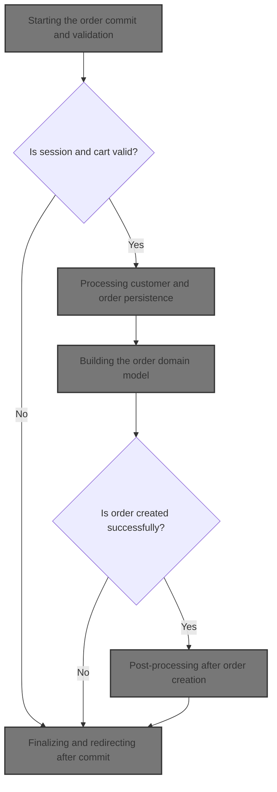
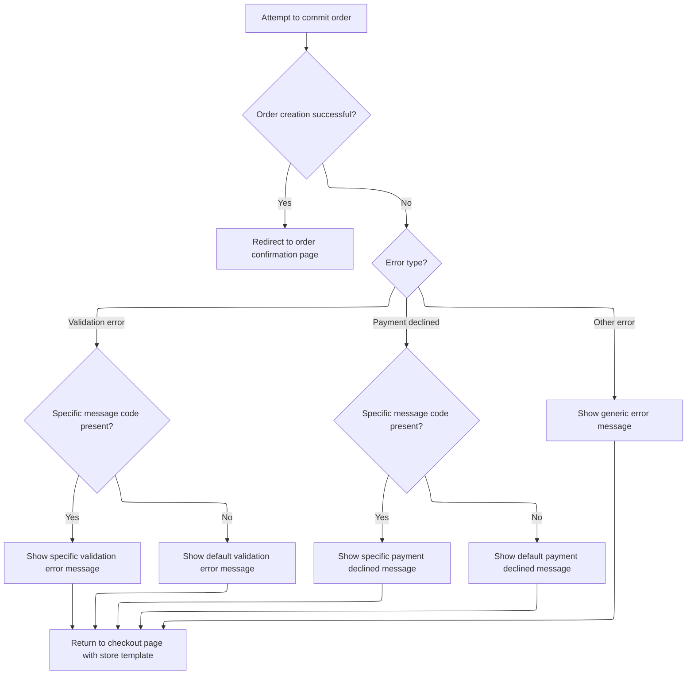

This document describes the flow for committing an order, transforming the user's shopping cart and checkout selections into a finalized order. It covers validation, customer authentication, order creation, post-processing, and user communication.



# Starting the order commit and validation

This section ensures that all necessary order data—cart, payment, shipping, and totals—are validated and correctly set up before the order is committed. It handles session recovery, payment and shipping selection, and order validation, providing error feedback when needed.

| Category        | Rule Name                   | Description                                                                                                                                                    |
| --------------- | --------------------------- | -------------------------------------------------------------------------------------------------------------------------------------------------------------- |
| Data validation | Session and Cart Validation | If the user's session has expired and no cart cookie is present, the order process is halted and the user is redirected to a timeout page.                     |
| Data validation | Cart Code Presence          | If the cart code from the session or cookie is blank, the order process is halted and the user is redirected to a timeout page.                                |
| Data validation | Payment Method Requirement  | If no payment methods are configured and the cart is not free, an error message is displayed and the order cannot proceed.                                     |
| Business logic  | Default Payment Selection   | If multiple payment methods are available, the default payment method is selected. If none is marked as default, the first available method is set as default. |
| Business logic  | Default Shipping Option     | If the user's selected shipping option does not match any available options, the first available shipping option is selected by default.                       |
| Business logic  | Shipping Summary Attachment | The selected shipping option and its price are set in the shipping summary and attached to the order before total calculation.                                 |

<SwmSnippet path="/shopizer/sm-shop/src/main/java/com/salesmanager/web/shop/controller/order/ShoppingOrderController.java" line="514">

---

We start by validating the <SwmPath>[shopizer/…/common/cart/](shopizer/sm-shop/src/main/webapp/pages/shop/common/cart/)</SwmPath>, recover from cookie if needed, and set up cart items and payment methods for the order. This sets the stage for the rest of the commit flow.

```java
	public String commitOrder(@CookieValue("cart") String cookie, @Valid @ModelAttribute(value="order") ShopOrder order, BindingResult bindingResult, Model model, HttpServletRequest request, HttpServletResponse response, Locale locale) throws Exception {

		MerchantStore store = (MerchantStore)request.getAttribute(Constants.MERCHANT_STORE);
		Language language = (Language)request.getAttribute("LANGUAGE");
		//validate if session has expired
		

			
		try {
				
				//basic stuff
				String shoppingCartCode  = (String)request.getSession().getAttribute(Constants.SHOPPING_CART);
				if(shoppingCartCode==null) {
					
					if(cookie==null) {//session expired and cookie null, nothing to do
						StringBuilder template = new StringBuilder().append(ControllerConstants.Tiles.Pages.timeout).append(".").append(store.getStoreTemplate());
						return template.toString();
					}
					String merchantCookie[] = cookie.split("_");
					String merchantStoreCode = merchantCookie[0];
					if(!merchantStoreCode.equals(store.getCode())) {
						StringBuilder template = new StringBuilder().append(ControllerConstants.Tiles.Pages.timeout).append(".").append(store.getStoreTemplate());
						return template.toString();
					}
					shoppingCartCode = merchantCookie[1];
				}
				com.salesmanager.core.business.shoppingcart.model.ShoppingCart cart = null;
			
			    if(StringUtils.isBlank(shoppingCartCode)) {
					StringBuilder template = new StringBuilder().append(ControllerConstants.Tiles.Pages.timeout).append(".").append(store.getStoreTemplate());
					return template.toString();	
			    }
			    cart = shoppingCartFacade.getShoppingCartModel(shoppingCartCode, store);

				Set<ShoppingCartItem> items = cart.getLineItems();
				List<ShoppingCartItem> cartItems = new ArrayList<ShoppingCartItem>(items);
				order.setShoppingCartItems(cartItems);

				//get payment methods
				List<PaymentMethod> paymentMethods = paymentService.getAcceptedPaymentMethods(store);
				boolean freeShoppingCart = shoppingCartService.isFreeShoppingCart(cart);

				//not free and no payment methods
				if(CollectionUtils.isEmpty(paymentMethods) && !freeShoppingCart) {
					LOGGER.error("No payment method configured");
					model.addAttribute("errorMessages", "No payments configured");
				}
				
				if(!CollectionUtils.isEmpty(paymentMethods)) {//select default payment method
					PaymentMethod defaultPaymentSelected = null;
					for(PaymentMethod paymentMethod : paymentMethods) {
						if(paymentMethod.isDefaultSelected()) {
							defaultPaymentSelected = paymentMethod;
							break;
						}
					}
```

---

</SwmSnippet>

<SwmSnippet path="/shopizer/sm-shop/src/main/java/com/salesmanager/web/shop/controller/order/ShoppingOrderController.java" line="571">

---

After setting up payment, we move on to shipping. Here, we pull shipping summary and options from the session, or generate them if missing. We build a readable summary for the UI, match the user's selected shipping option, and default to the first if not found. The selected option and its price are set in the summary and attached to the order, prepping it for total calculation and validation.

```java
					if(defaultPaymentSelected==null) {//forced default selection
						defaultPaymentSelected = paymentMethods.get(0);
						defaultPaymentSelected.setDefaultSelected(true);
					}
					
					
				}
				
				ShippingQuote quote = orderFacade.getShippingQuote(order.getCustomer(), cart, order, store, language);
				model.addAttribute("shippingQuote", quote);
				model.addAttribute("paymentMethods", paymentMethods);
				
				if(quote!=null) {
					List<Country> shippingCountriesList = orderFacade.getShipToCountry(store, language);
					model.addAttribute("countries", shippingCountriesList);
				} else {
					//get all countries
					List<Country> countries = countryService.getCountries(language);
					model.addAttribute("countries", countries);
				}
				
				//set shipping summary
				if(order.getSelectedShippingOption()!=null) {
					ShippingSummary summary = (ShippingSummary)request.getSession().getAttribute(Constants.SHIPPING_SUMMARY);
					@SuppressWarnings("unchecked")
					List<ShippingOption> options = (List<ShippingOption>)request.getSession().getAttribute(Constants.SHIPPING_OPTIONS);
					
					if(summary==null) {
						summary = orderFacade.getShippingSummary(quote, store, language);
						request.getSession().setAttribute(Constants.SHIPPING_SUMMARY, options);
					}
					
					if(options==null) {
						options = quote.getShippingOptions();
						request.getSession().setAttribute(Constants.SHIPPING_OPTIONS, options);
					}

					ReadableShippingSummary readableSummary = new ReadableShippingSummary();
					ReadableShippingSummaryPopulator readableSummaryPopulator = new ReadableShippingSummaryPopulator();
					readableSummaryPopulator.setPricingService(pricingService);
					readableSummaryPopulator.populate(summary, readableSummary, store, language);
					
					
					if(!CollectionUtils.isEmpty(options)) {
					
						//get submitted shipping option
						ShippingOption quoteOption = null;
						ShippingOption selectedOption = order.getSelectedShippingOption();

						//check if selectedOption exist
						for(ShippingOption shipOption : options) {
							if(!StringUtils.isBlank(shipOption.getOptionId()) && shipOption.getOptionId().equals(selectedOption.getOptionId())) {
								quoteOption = shipOption;
							}
						}
```

---

</SwmSnippet>

<SwmSnippet path="/shopizer/sm-shop/src/main/java/com/salesmanager/web/shop/controller/order/ShoppingOrderController.java" line="626">

---

After prepping shipping and totals, we validate the order and, if all checks pass, call <SwmToken path="shopizer/sm-shop/src/main/java/com/salesmanager/web/shop/controller/order/ShoppingOrderController.java" pos="663:9:9" line-data="				Order modelOrder = this.commitOrder(order, request, locale);">`commitOrder`</SwmToken> to process it.

```java
						if(quoteOption==null) {
							quoteOption = options.get(0);
						}
						
						readableSummary.setSelectedShippingOption(quoteOption);
						readableSummary.setShippingOptions(options);
						summary.setShippingOption(quoteOption.getOptionId());
						summary.setShipping(quoteOption.getOptionPrice());
					
					}

					order.setShippingSummary(summary);
				}
				
				OrderTotalSummary totalSummary = super.getSessionAttribute(Constants.ORDER_SUMMARY, request);
				
				if(totalSummary==null) {
					totalSummary = orderFacade.calculateOrderTotal(store, order, language);
					super.setSessionAttribute(Constants.ORDER_SUMMARY, totalSummary, request);
				}
				
				
				order.setOrderTotalSummary(totalSummary);
				
			
				orderFacade.validateOrder(order, bindingResult, new HashMap<String,String>(), store, locale);
		        
		        if ( bindingResult.hasErrors() )
		        {
		            LOGGER.info( "found {} validation error while validating in customer registration ",
		                         bindingResult.getErrorCount() );
		    		StringBuilder template = new StringBuilder().append(ControllerConstants.Tiles.Checkout.checkout).append(".").append(store.getStoreTemplate());
		    		return template.toString();
	
		        }
		        
		        @SuppressWarnings("unused")
				Order modelOrder = this.commitOrder(order, request, locale);

	        
```

---

</SwmSnippet>

## Processing customer and order persistence

This section governs how customer authentication and credentials are handled during order commitment, ensures customer data is correctly persisted, and manages the processing and persistence of the order itself.

| Category       | Rule Name                                    | Description                                                                                                                                                                       |
| -------------- | -------------------------------------------- | --------------------------------------------------------------------------------------------------------------------------------------------------------------------------------- |
| Business logic | Customer authentication and credential setup | If the customer is authenticated, their existing credentials and ID must be used for the order. If not authenticated, a new customer record is created with a generated password. |
| Business logic | New customer password generation             | For new customers, a random password must be generated and securely encoded before persisting the customer record.                                                                |
| Business logic | Ship to billing address                      | If the order specifies shipping to the billing address, the customer's delivery address must be set to match the billing address.                                                 |
| Business logic | Volatile customer persistence                | If the customer is not authenticated, a new volatile customer model must be created and persisted before processing the order.                                                    |
| Business logic | Initial transaction usage                    | If an initial transaction exists in the session, it must be used when processing the order; otherwise, the order is processed without it.                                         |

<SwmSnippet path="/shopizer/sm-shop/src/main/java/com/salesmanager/web/shop/controller/order/ShoppingOrderController.java" line="367">

---

In <SwmToken path="shopizer/sm-shop/src/main/java/com/salesmanager/web/shop/controller/order/ShoppingOrderController.java" pos="367:5:5" line-data="	private Order commitOrder(ShopOrder order, HttpServletRequest request, Locale locale) throws Exception, ServiceException {">`commitOrder`</SwmToken>, we handle customer authentication, set up credentials for new users, and prep the customer model. Once that's sorted, we call <SwmToken path="shopizer/sm-shop/src/main/java/com/salesmanager/web/shop/controller/order/ShoppingOrderController.java" pos="427:3:5" line-data="	        	modelOrder=orderFacade.processOrder(order, modelCustomer, initialTransaction, store, language);">`orderFacade.processOrder`</SwmToken> to actually persist the order and handle payment logic. This handoff is where the order gets processed in the backend.

```java
	private Order commitOrder(ShopOrder order, HttpServletRequest request, Locale locale) throws Exception, ServiceException {
		
		
			MerchantStore store = (MerchantStore)request.getAttribute(Constants.MERCHANT_STORE);
			Language language = (Language)request.getAttribute("LANGUAGE");
			
			
			String userName = null;
			String password = null;
			
			PersistableCustomer customer = order.getCustomer();
			
	        /** set username and password to persistable object **/
			Authentication auth = SecurityContextHolder.getContext().getAuthentication();
			Customer authCustomer = null;
        	if(auth != null &&
	        		 request.isUserInRole("AUTH_CUSTOMER")) {
        		authCustomer = customerFacade.getCustomerByUserName(auth.getName(), store);
        		//set id and authentication information
        		customer.setUserName(authCustomer.getNick());
        		customer.setEncodedPassword(authCustomer.getPassword());
        		customer.setId(authCustomer.getId());
	        } else {
	        	//set customer id to null
	        	customer.setId(null);
	        }
		
	        //if the customer is new, generate a password
	        if(customer.getId()==null || customer.getId()==0) {//new customer
	        	password = UserReset.generateRandomString();
	        	String encodedPassword = passwordEncoder.encodePassword(password, null);
	        	customer.setEncodedPassword(encodedPassword);
	        }
	        
	        if(order.isShipToBillingAdress()) {
	        	customer.setDelivery(customer.getBilling());
	        }
	        


			Customer modelCustomer = null;
			try {//set groups
				if(authCustomer==null) {//not authenticated, create a new volatile user
					modelCustomer = customerFacade.getCustomerModel(customer, store, language);
					customerFacade.setCustomerModelDefaultProperties(modelCustomer, store);
					userName = modelCustomer.getNick();
					LOGGER.debug( "About to persist volatile customer to database." );
			        customerService.saveOrUpdate( modelCustomer );
				} else {//use existing customer
					modelCustomer = customerFacade.populateCustomerModel(authCustomer, customer, store, language);
				}
			} catch(Exception e) {
				throw new ServiceException(e);
			}
	        
           
	        
	        Order modelOrder = null;
	        Transaction initialTransaction = (Transaction)super.getSessionAttribute(Constants.INIT_TRANSACTION_KEY, request);
	        if(initialTransaction!=null) {
	        	modelOrder=orderFacade.processOrder(order, modelCustomer, initialTransaction, store, language);
	        } else {
	        	modelOrder=orderFacade.processOrder(order, modelCustomer, store, language);
	        }
	        
```

---

</SwmSnippet>

### Delegating order processing to facade

This section ensures that order processing is initiated with all required contextual information, and delegates the detailed logic to a specialized method, maintaining a clean separation between entry point and business logic.

| Category        | Rule Name                 | Description                                                                                                                                            |
| --------------- | ------------------------- | ------------------------------------------------------------------------------------------------------------------------------------------------------ |
| Data validation | Required order context    | Order processing must be initiated only when valid order, customer, and store information are provided.                                                |
| Business logic  | Business rule enforcement | The processed order must reflect all business rules applied during processing, such as inventory checks, payment validation, and customer eligibility. |

<SwmSnippet path="/shopizer/sm-shop/src/main/java/com/salesmanager/web/shop/controller/order/facade/OrderFacadeImpl.java" line="252">

---

<SwmToken path="shopizer/sm-shop/src/main/java/com/salesmanager/web/shop/controller/order/facade/OrderFacadeImpl.java" pos="252:5:5" line-data="	public Order processOrder(ShopOrder order, Customer customer, MerchantStore store,">`processOrder`</SwmToken> just hands off to <SwmToken path="shopizer/sm-shop/src/main/java/com/salesmanager/web/shop/controller/order/facade/OrderFacadeImpl.java" pos="255:5:5" line-data="		return this.processOrderModel(order, customer, null, store, language);">`processOrderModel`</SwmToken>, passing all the order, customer, and store info. This keeps the main entry point clean and lets the detailed logic live in the private method.

```java
	public Order processOrder(ShopOrder order, Customer customer, MerchantStore store,
			Language language) throws ServiceException {
				
		return this.processOrderModel(order, customer, null, store, language);

	}
```

---

</SwmSnippet>

### Building the order domain model

```mermaid
%%{init: {"flowchart": {"defaultRenderer": "elk"}} }%%
flowchart TD
    node1["Start order processing"] --> node2{"Ship to billing address?"}
    click node1 openCode "shopizer/sm-shop/src/main/java/com/salesmanager/web/shop/controller/order/facade/OrderFacadeImpl.java:267:270"
    node2 -->|"Yes"| node3["Set delivery address to billing"]
    click node2 openCode "shopizer/sm-shop/src/main/java/com/salesmanager/web/shop/controller/order/facade/OrderFacadeImpl.java:272:276"
    node2 -->|"No"| node4["Keep delivery address"]
    click node4 openCode "shopizer/sm-shop/src/main/java/com/salesmanager/web/shop/controller/order/facade/OrderFacadeImpl.java:284:284"
    node3 --> node5["Create order model"]
    click node3 openCode "shopizer/sm-shop/src/main/java/com/salesmanager/web/shop/controller/order/facade/OrderFacadeImpl.java:281:288"
    node4 --> node5
    node5 --> node6["Set order details (totals, currency, merchant, shipping module)"]
    click node6 openCode "shopizer/sm-shop/src/main/java/com/salesmanager/web/shop/controller/order/facade/OrderFacadeImpl.java:305:343"
    node6 --> node7["Associate customer with order"]
    click node7 openCode "shopizer/sm-shop/src/main/java/com/salesmanager/web/shop/controller/order/facade/OrderFacadeImpl.java:338:338"
    subgraph loop1["For each cart item"]
      node7 --> node8["Transform cart item to order product"]
      click node8 openCode "shopizer/sm-shop/src/main/java/com/salesmanager/web/shop/controller/order/facade/OrderFacadeImpl.java:298:303"
      node8 --> node7
    end
    node7 --> node9["Sort and associate order totals"]
    click node9 openCode "shopizer/sm-shop/src/main/java/com/salesmanager/web/shop/controller/order/facade/OrderFacadeImpl.java:307:326"
    subgraph loop2["For each order total"]
      node9 --> node10["Associate total with order"]
      click node10 openCode "shopizer/sm-shop/src/main/java/com/salesmanager/web/shop/controller/order/facade/OrderFacadeImpl.java:323:325"
      node10 --> node9
    end
    node9 --> node11{"Payment method?"}
    click node11 openCode "shopizer/sm-shop/src/main/java/com/salesmanager/web/shop/controller/order/facade/OrderFacadeImpl.java:345:348"
    node11 -->|"Credit Card"| node12{"Credit card type?"}
    click node12 openCode "shopizer/sm-shop/src/main/java/com/salesmanager/web/shop/controller/order/facade/OrderFacadeImpl.java:360:372"
    node12 -->|"AMEX/VISA/MASTERCARD/etc."| node13["Set credit card details"]
    click node13 openCode "shopizer/sm-shop/src/main/java/com/salesmanager/web/shop/controller/order/facade/OrderFacadeImpl.java:353:388"
    node11 -->|"PayPal"| node14{"Transaction present?"}
    click node14 openCode "shopizer/sm-shop/src/main/java/com/salesmanager/web/shop/controller/order/facade/OrderFacadeImpl.java:395:397"
    node14 -->|"Yes"| node15["Set PayPal details"]
    click node15 openCode "shopizer/sm-shop/src/main/java/com/salesmanager/web/shop/controller/order/facade/OrderFacadeImpl.java:399:402"
    node14 -->|"No"| node16["Order cannot be processed"]
    node13 --> node17["Finalize payment"]
    click node17 openCode "shopizer/sm-shop/src/main/java/com/salesmanager/web/shop/controller/order/facade/OrderFacadeImpl.java:408:409"
    node15 --> node17
    node17 --> node18{"Transaction present?"}
    click node18 openCode "shopizer/sm-shop/src/main/java/com/salesmanager/web/shop/controller/order/facade/OrderFacadeImpl.java:411:415"
    node18 -->|"Yes"| node19["Process order"]
    click node19 openCode "shopizer/sm-shop/src/main/java/com/salesmanager/web/shop/controller/order/facade/OrderFacadeImpl.java:412:412"
    node18 -->|"No"| node20["Process order with transaction"]
    click node20 openCode "shopizer/sm-shop/src/main/java/com/salesmanager/web/shop/controller/order/facade/OrderFacadeImpl.java:414:414"
    node19 --> node21["Return finalized order"]
    click node21 openCode "shopizer/sm-shop/src/main/java/com/salesmanager/web/shop/controller/order/facade/OrderFacadeImpl.java:419:419"
    node20 --> node21
classDef HeadingStyle fill:#777777,stroke:#333,stroke-width:2px;

%% Swimm:
%% %%{init: {"flowchart": {"defaultRenderer": "elk"}} }%%
%% flowchart TD
%%     node1["Start order processing"] --> node2{"Ship to billing address?"}
%%     click node1 openCode "<SwmPath>[shopizer/…/facade/OrderFacadeImpl.java](shopizer/sm-shop/src/main/java/com/salesmanager/web/shop/controller/order/facade/OrderFacadeImpl.java)</SwmPath>:267:270"
%%     node2 -->|"Yes"| node3["Set delivery address to billing"]
%%     click node2 openCode "<SwmPath>[shopizer/…/facade/OrderFacadeImpl.java](shopizer/sm-shop/src/main/java/com/salesmanager/web/shop/controller/order/facade/OrderFacadeImpl.java)</SwmPath>:272:276"
%%     node2 -->|"No"| node4["Keep delivery address"]
%%     click node4 openCode "<SwmPath>[shopizer/…/facade/OrderFacadeImpl.java](shopizer/sm-shop/src/main/java/com/salesmanager/web/shop/controller/order/facade/OrderFacadeImpl.java)</SwmPath>:284:284"
%%     node3 --> node5["Create order model"]
%%     click node3 openCode "<SwmPath>[shopizer/…/facade/OrderFacadeImpl.java](shopizer/sm-shop/src/main/java/com/salesmanager/web/shop/controller/order/facade/OrderFacadeImpl.java)</SwmPath>:281:288"
%%     node4 --> node5
%%     node5 --> node6["Set order details (totals, currency, merchant, shipping module)"]
%%     click node6 openCode "<SwmPath>[shopizer/…/facade/OrderFacadeImpl.java](shopizer/sm-shop/src/main/java/com/salesmanager/web/shop/controller/order/facade/OrderFacadeImpl.java)</SwmPath>:305:343"
%%     node6 --> node7["Associate customer with order"]
%%     click node7 openCode "<SwmPath>[shopizer/…/facade/OrderFacadeImpl.java](shopizer/sm-shop/src/main/java/com/salesmanager/web/shop/controller/order/facade/OrderFacadeImpl.java)</SwmPath>:338:338"
%%     subgraph loop1["For each cart item"]
%%       node7 --> node8["Transform cart item to order product"]
%%       click node8 openCode "<SwmPath>[shopizer/…/facade/OrderFacadeImpl.java](shopizer/sm-shop/src/main/java/com/salesmanager/web/shop/controller/order/facade/OrderFacadeImpl.java)</SwmPath>:298:303"
%%       node8 --> node7
%%     end
%%     node7 --> node9["Sort and associate order totals"]
%%     click node9 openCode "<SwmPath>[shopizer/…/facade/OrderFacadeImpl.java](shopizer/sm-shop/src/main/java/com/salesmanager/web/shop/controller/order/facade/OrderFacadeImpl.java)</SwmPath>:307:326"
%%     subgraph loop2["For each order total"]
%%       node9 --> node10["Associate total with order"]
%%       click node10 openCode "<SwmPath>[shopizer/…/facade/OrderFacadeImpl.java](shopizer/sm-shop/src/main/java/com/salesmanager/web/shop/controller/order/facade/OrderFacadeImpl.java)</SwmPath>:323:325"
%%       node10 --> node9
%%     end
%%     node9 --> node11{"Payment method?"}
%%     click node11 openCode "<SwmPath>[shopizer/…/facade/OrderFacadeImpl.java](shopizer/sm-shop/src/main/java/com/salesmanager/web/shop/controller/order/facade/OrderFacadeImpl.java)</SwmPath>:345:348"
%%     node11 -->|"Credit Card"| node12{"Credit card type?"}
%%     click node12 openCode "<SwmPath>[shopizer/…/facade/OrderFacadeImpl.java](shopizer/sm-shop/src/main/java/com/salesmanager/web/shop/controller/order/facade/OrderFacadeImpl.java)</SwmPath>:360:372"
%%     node12 -->|"AMEX/VISA/MASTERCARD/etc."| node13["Set credit card details"]
%%     click node13 openCode "<SwmPath>[shopizer/…/facade/OrderFacadeImpl.java](shopizer/sm-shop/src/main/java/com/salesmanager/web/shop/controller/order/facade/OrderFacadeImpl.java)</SwmPath>:353:388"
%%     node11 -->|"PayPal"| node14{"Transaction present?"}
%%     click node14 openCode "<SwmPath>[shopizer/…/facade/OrderFacadeImpl.java](shopizer/sm-shop/src/main/java/com/salesmanager/web/shop/controller/order/facade/OrderFacadeImpl.java)</SwmPath>:395:397"
%%     node14 -->|"Yes"| node15["Set PayPal details"]
%%     click node15 openCode "<SwmPath>[shopizer/…/facade/OrderFacadeImpl.java](shopizer/sm-shop/src/main/java/com/salesmanager/web/shop/controller/order/facade/OrderFacadeImpl.java)</SwmPath>:399:402"
%%     node14 -->|"No"| node16["Order cannot be processed"]
%%     node13 --> node17["Finalize payment"]
%%     click node17 openCode "<SwmPath>[shopizer/…/facade/OrderFacadeImpl.java](shopizer/sm-shop/src/main/java/com/salesmanager/web/shop/controller/order/facade/OrderFacadeImpl.java)</SwmPath>:408:409"
%%     node15 --> node17
%%     node17 --> node18{"Transaction present?"}
%%     click node18 openCode "<SwmPath>[shopizer/…/facade/OrderFacadeImpl.java](shopizer/sm-shop/src/main/java/com/salesmanager/web/shop/controller/order/facade/OrderFacadeImpl.java)</SwmPath>:411:415"
%%     node18 -->|"Yes"| node19["Process order"]
%%     click node19 openCode "<SwmPath>[shopizer/…/facade/OrderFacadeImpl.java](shopizer/sm-shop/src/main/java/com/salesmanager/web/shop/controller/order/facade/OrderFacadeImpl.java)</SwmPath>:412:412"
%%     node18 -->|"No"| node20["Process order with transaction"]
%%     click node20 openCode "<SwmPath>[shopizer/…/facade/OrderFacadeImpl.java](shopizer/sm-shop/src/main/java/com/salesmanager/web/shop/controller/order/facade/OrderFacadeImpl.java)</SwmPath>:414:414"
%%     node19 --> node21["Return finalized order"]
%%     click node21 openCode "<SwmPath>[shopizer/…/facade/OrderFacadeImpl.java](shopizer/sm-shop/src/main/java/com/salesmanager/web/shop/controller/order/facade/OrderFacadeImpl.java)</SwmPath>:419:419"
%%     node20 --> node21
%% classDef HeadingStyle fill:#777777,stroke:#333,stroke-width:2px;
```



This section governs the creation of the order domain model, ensuring all relevant business data is correctly mapped from the shopping cart and customer input to the order record, including address handling, product transformation, totals calculation, and payment details.

| Category        | Rule Name                   | Description                                                                                                                                     |
| --------------- | --------------------------- | ----------------------------------------------------------------------------------------------------------------------------------------------- |
| Data validation | Payment method details      | The order must include payment details matching the selected payment method, with specific fields required for credit card and PayPal payments. |
| Data validation | PayPal transaction required | If PayPal is selected as the payment method, a valid transaction must be present; otherwise, the order cannot be processed.                     |
| Data validation | Mask credit card number     | Credit card numbers must be masked before being stored in the order record.                                                                     |
| Data validation | Complete order record       | The finalized order must include all relevant customer, address, product, totals, payment, and transaction details before being returned.       |
| Business logic  | Ship to billing address     | If the customer chooses to ship to their billing address, the delivery address for the order must be set to match the billing address.          |
| Business logic  | Cart item to order product  | Each shopping cart item must be transformed into an order product and associated with the order.                                                |
| Business logic  | Order totals sorting        | Order totals must be sorted by their defined sort order before being attached to the order.                                                     |

<SwmSnippet path="/shopizer/sm-shop/src/main/java/com/salesmanager/web/shop/controller/order/facade/OrderFacadeImpl.java" line="267">

---

In <SwmToken path="shopizer/sm-shop/src/main/java/com/salesmanager/web/shop/controller/order/facade/OrderFacadeImpl.java" pos="267:5:5" line-data="	private Order processOrderModel(ShopOrder order, Customer customer, Transaction transaction, MerchantStore store,">`processOrderModel`</SwmToken>, we set up the order's delivery address if shipping matches billing, then build the order domain object. We loop through cart items, use <SwmToken path="shopizer/sm-shop/src/main/java/com/salesmanager/web/shop/controller/order/facade/OrderFacadeImpl.java" pos="293:1:1" line-data="			OrderProductPopulator orderProductPopulator = new OrderProductPopulator();">`OrderProductPopulator`</SwmToken> to turn each into an <SwmToken path="shopizer/sm-shop/src/main/java/com/salesmanager/web/shop/controller/order/facade/OrderFacadeImpl.java" pos="291:3:3" line-data="			Set&lt;OrderProduct&gt; orderProducts = new LinkedHashSet&lt;OrderProduct&gt;();">`OrderProduct`</SwmToken>, and attach them to the order. This sets up all the products for the order record.

```java
	private Order processOrderModel(ShopOrder order, Customer customer, Transaction transaction, MerchantStore store,
			Language language) throws ServiceException {
		
		try {
			
			if(order.isShipToBillingAdress()) {//customer shipping is billing
				PersistableCustomer orderCustomer = order.getCustomer();
				Address billing = orderCustomer.getBilling();
				orderCustomer.setDelivery(billing);
			}

 

			
			Order modelOrder = new Order();
			modelOrder.setDatePurchased(new Date());
			modelOrder.setBilling(customer.getBilling());
			modelOrder.setDelivery(customer.getDelivery());
			modelOrder.setPaymentModuleCode(order.getPaymentModule());
			modelOrder.setPaymentType(PaymentType.valueOf(order.getPaymentMethodType()));
			modelOrder.setShippingModuleCode(order.getShippingModule());
			modelOrder.setLocale(LocaleUtils.getLocale(store));//set the store locale based on the country for order $ formatting
	
			List<ShoppingCartItem> shoppingCartItems = order.getShoppingCartItems();
			Set<OrderProduct> orderProducts = new LinkedHashSet<OrderProduct>();
			
			OrderProductPopulator orderProductPopulator = new OrderProductPopulator();
			orderProductPopulator.setDigitalProductService(digitalProductService);
			orderProductPopulator.setProductAttributeService(productAttributeService);
			orderProductPopulator.setProductService(productService);
			
			for(ShoppingCartItem item : shoppingCartItems) {
				OrderProduct orderProduct = new OrderProduct();
				orderProduct = orderProductPopulator.populate(item, orderProduct , store, language);
				orderProduct.setOrder(modelOrder);
				orderProducts.add(orderProduct);
			}
```

---

</SwmSnippet>

<SwmSnippet path="/shopizer/sm-shop/src/main/java/com/salesmanager/web/shop/controller/order/facade/OrderFacadeImpl.java" line="305">

---

We sort the order totals and attach them to the order for correct processing.

```java
			modelOrder.setOrderProducts(orderProducts);
			
			OrderTotalSummary summary = order.getOrderTotalSummary();
			List<com.salesmanager.core.business.order.model.OrderTotal> totals = summary.getTotals();

			//re-order totals
			Collections.sort(
					totals,
					new Comparator<com.salesmanager.core.business.order.model.OrderTotal>() {
					       public int compare(com.salesmanager.core.business.order.model.OrderTotal x, com.salesmanager.core.business.order.model.OrderTotal y) {
					            if(x.getSortOrder()==y.getSortOrder())
					            	return 0;
					            return x.getSortOrder() < y.getSortOrder() ? -1 : 1;
					        }
				
			});
			
			Set<com.salesmanager.core.business.order.model.OrderTotal> modelTotals = new LinkedHashSet<com.salesmanager.core.business.order.model.OrderTotal>();
			for(com.salesmanager.core.business.order.model.OrderTotal total : totals) {
				total.setOrder(modelOrder);
				modelTotals.add(total);
			}
```

---

</SwmSnippet>

<SwmSnippet path="/shopizer/sm-shop/src/main/java/com/salesmanager/web/shop/controller/order/facade/OrderFacadeImpl.java" line="328">

---

We set payment details, call <SwmToken path="shopizer/sm-shop/src/main/java/com/salesmanager/web/shop/controller/order/facade/OrderFacadeImpl.java" pos="412:1:1" line-data="				orderService.processOrder(modelOrder, customer, order.getShoppingCartItems(), summary, payment, store);">`orderService`</SwmToken> to process the order, and return the finalized order model.

```java
			modelOrder.setOrderTotal(modelTotals);
			modelOrder.setTotal(order.getOrderTotalSummary().getTotal());
	
			//order misc objects
			modelOrder.setCurrency(store.getCurrency());
			modelOrder.setMerchant(store);

			
			
			//customer object
			orderCustomer(customer, modelOrder, language);
			
			//populate shipping information
			if(!StringUtils.isBlank(order.getShippingModule())) {
				modelOrder.setShippingModuleCode(order.getShippingModule());
			}
			
			String paymentType = order.getPaymentMethodType();
			Payment payment = new Payment();
			payment.setPaymentType(PaymentType.valueOf(paymentType));
			if(PaymentType.CREDITCARD.name().equals(paymentType)) {
				
				
				
				payment = new CreditCardPayment();
				((CreditCardPayment)payment).setCardOwner(order.getPayment().get("creditcard_card_holder"));
				((CreditCardPayment)payment).setCredidCardValidationNumber(order.getPayment().get("creditcard_card_cvv"));
				((CreditCardPayment)payment).setCreditCardNumber(order.getPayment().get("creditcard_card_number"));
				((CreditCardPayment)payment).setExpirationMonth(order.getPayment().get("creditcard_card_expirationmonth"));
				((CreditCardPayment)payment).setExpirationYear(order.getPayment().get("creditcard_card_expirationyear"));
				
				CreditCardType creditCardType =null;
				String cardType = order.getPayment().get("creditcard_card_type");
				
				if(cardType.equalsIgnoreCase(CreditCardType.AMEX.name())) {
					creditCardType = CreditCardType.AMEX;
				} else if(cardType.equalsIgnoreCase(CreditCardType.VISA.name())) {
					creditCardType = CreditCardType.VISA;
				} else if(cardType.equalsIgnoreCase(CreditCardType.MASTERCARD.name())) {
					creditCardType = CreditCardType.MASTERCARD;
				} else if(cardType.equalsIgnoreCase(CreditCardType.DINERS.name())) {
					creditCardType = CreditCardType.DINERS;
				} else if(cardType.equalsIgnoreCase(CreditCardType.DISCOVERY.name())) {
					creditCardType = CreditCardType.DISCOVERY;
				}
				

				
				
				((CreditCardPayment)payment).setCreditCard(creditCardType);
			
				CreditCard cc = new CreditCard();
				cc.setCardType(creditCardType);
				cc.setCcCvv(((CreditCardPayment)payment).getCredidCardValidationNumber());
				cc.setCcOwner(((CreditCardPayment)payment).getCardOwner());
				cc.setCcExpires(((CreditCardPayment)payment).getExpirationMonth() + "-" + ((CreditCardPayment)payment).getExpirationYear());
			
				//hash credit card number
				String maskedNumber = CreditCardUtils.maskCardNumber(order.getPayment().get("creditcard_card_number"));
				cc.setCcNumber(maskedNumber);
				modelOrder.setCreditCard(cc);

			}
			
			if(PaymentType.PAYPAL.name().equals(paymentType)) {
				
				//check for previous transaction
				if(transaction==null) {
					throw new ServiceException("payment.error");
				}
				
				payment = new com.salesmanager.core.business.payments.model.PaypalPayment();
				
				((com.salesmanager.core.business.payments.model.PaypalPayment)payment).setPayerId(transaction.getTransactionDetails().get("PAYERID"));
				((com.salesmanager.core.business.payments.model.PaypalPayment)payment).setPaymentToken(transaction.getTransactionDetails().get("TOKEN"));
				
				
			}
			

			modelOrder.setPaymentModuleCode(order.getPaymentModule());
			payment.setModuleName(order.getPaymentModule());

			if(transaction!=null) {
				orderService.processOrder(modelOrder, customer, order.getShoppingCartItems(), summary, payment, store);
			} else {
				orderService.processOrder(modelOrder, customer, order.getShoppingCartItems(), summary, payment, transaction, store);
			}
			

			
			return modelOrder;
		
		} catch(ServiceException se) {//may be invalid credit card
			throw se;
		} catch(Exception e) {
			throw new ServiceException(e);
		}
		
	}
```

---

</SwmSnippet>

### Post-processing after order creation

```mermaid
%%{init: {"flowchart": {"defaultRenderer": "elk"}} }%%
flowchart TD
  node1["Finalize order: Save order ID and token in session"]
  click node1 openCode "shopizer/sm-shop/src/main/java/com/salesmanager/web/shop/controller/order/ShoppingOrderController.java:432:435"
  node1 --> node2{"Is there a shopping cart to delete?"}
  click node2 openCode "shopizer/sm-shop/src/main/java/com/salesmanager/web/shop/controller/order/ShoppingOrderController.java:439:447"
  node2 -->|"Yes"| node3["Delete shopping cart"]
  click node3 openCode "shopizer/sm-shop/src/main/java/com/salesmanager/web/shop/controller/order/ShoppingOrderController.java:442:443"
  node2 -->|"No"| node4["Clean up session attributes"]
  click node4 openCode "shopizer/sm-shop/src/main/java/com/salesmanager/web/shop/controller/order/ShoppingOrderController.java:451:456"
  node3 --> node4
  node4 --> node5{"Are there downloadable products in the order?"}
  click node5 openCode "shopizer/sm-shop/src/main/java/com/salesmanager/web/shop/controller/order/ShoppingOrderController.java:468:469"
  node5 -->|"Yes"| node6{"Is customer authenticated?"}
  node5 -->|"No"| node9["Send order confirmation email"]
  click node9 openCode "shopizer/sm-shop/src/main/java/com/salesmanager/web/shop/controller/order/ShoppingOrderController.java:490:490"
  node6 -->|"No"| node7["Authenticate customer"]
  click node7 openCode "shopizer/sm-shop/src/main/java/com/salesmanager/web/shop/controller/order/ShoppingOrderController.java:477:478"
  node6 -->|"Yes"| node8{"Is this a new customer?"}
  click node8 openCode "shopizer/sm-shop/src/main/java/com/salesmanager/web/shop/controller/order/ShoppingOrderController.java:481:486"
  node7 --> node8
  node8 -->|"Yes"| node10["Send registration email"]
  click node10 openCode "shopizer/sm-shop/src/main/java/com/salesmanager/web/utils/EmailTemplatesUtils.java:273:312"
  node8 -->|"No"| node9
  node10 --> node9
  node9 --> node11{"Does order have downloadable files?"}
  click node11 openCode "shopizer/sm-shop/src/main/java/com/salesmanager/web/shop/controller/order/ShoppingOrderController.java:492:493"
  node11 -->|"Yes"| node12["Send download email"]
  click node12 openCode "shopizer/sm-shop/src/main/java/com/salesmanager/web/shop/controller/order/ShoppingOrderController.java:493:493"
  node11 -->|"No"| node13["Return order"]
  click node13 openCode "shopizer/sm-shop/src/main/java/com/salesmanager/web/shop/controller/order/ShoppingOrderController.java:505:505"
  node12 --> node13

classDef HeadingStyle fill:#777777,stroke:#333,stroke-width:2px;

%% Swimm:
%% %%{init: {"flowchart": {"defaultRenderer": "elk"}} }%%
%% flowchart TD
%%   node1["Finalize order: Save order ID and token in session"]
%%   click node1 openCode "<SwmPath>[shopizer/…/order/ShoppingOrderController.java](shopizer/sm-shop/src/main/java/com/salesmanager/web/shop/controller/order/ShoppingOrderController.java)</SwmPath>:432:435"
%%   node1 --> node2{"Is there a shopping cart to delete?"}
%%   click node2 openCode "<SwmPath>[shopizer/…/order/ShoppingOrderController.java](shopizer/sm-shop/src/main/java/com/salesmanager/web/shop/controller/order/ShoppingOrderController.java)</SwmPath>:439:447"
%%   node2 -->|"Yes"| node3["Delete shopping cart"]
%%   click node3 openCode "<SwmPath>[shopizer/…/order/ShoppingOrderController.java](shopizer/sm-shop/src/main/java/com/salesmanager/web/shop/controller/order/ShoppingOrderController.java)</SwmPath>:442:443"
%%   node2 -->|"No"| node4["Clean up session attributes"]
%%   click node4 openCode "<SwmPath>[shopizer/…/order/ShoppingOrderController.java](shopizer/sm-shop/src/main/java/com/salesmanager/web/shop/controller/order/ShoppingOrderController.java)</SwmPath>:451:456"
%%   node3 --> node4
%%   node4 --> node5{"Are there downloadable products in the order?"}
%%   click node5 openCode "<SwmPath>[shopizer/…/order/ShoppingOrderController.java](shopizer/sm-shop/src/main/java/com/salesmanager/web/shop/controller/order/ShoppingOrderController.java)</SwmPath>:468:469"
%%   node5 -->|"Yes"| node6{"Is customer authenticated?"}
%%   node5 -->|"No"| node9["Send order confirmation email"]
%%   click node9 openCode "<SwmPath>[shopizer/…/order/ShoppingOrderController.java](shopizer/sm-shop/src/main/java/com/salesmanager/web/shop/controller/order/ShoppingOrderController.java)</SwmPath>:490:490"
%%   node6 -->|"No"| node7["Authenticate customer"]
%%   click node7 openCode "<SwmPath>[shopizer/…/order/ShoppingOrderController.java](shopizer/sm-shop/src/main/java/com/salesmanager/web/shop/controller/order/ShoppingOrderController.java)</SwmPath>:477:478"
%%   node6 -->|"Yes"| node8{"Is this a new customer?"}
%%   click node8 openCode "<SwmPath>[shopizer/…/order/ShoppingOrderController.java](shopizer/sm-shop/src/main/java/com/salesmanager/web/shop/controller/order/ShoppingOrderController.java)</SwmPath>:481:486"
%%   node7 --> node8
%%   node8 -->|"Yes"| node10["Send registration email"]
%%   click node10 openCode "<SwmPath>[shopizer/…/utils/EmailTemplatesUtils.java](shopizer/sm-shop/src/main/java/com/salesmanager/web/utils/EmailTemplatesUtils.java)</SwmPath>:273:312"
%%   node8 -->|"No"| node9
%%   node10 --> node9
%%   node9 --> node11{"Does order have downloadable files?"}
%%   click node11 openCode "<SwmPath>[shopizer/…/order/ShoppingOrderController.java](shopizer/sm-shop/src/main/java/com/salesmanager/web/shop/controller/order/ShoppingOrderController.java)</SwmPath>:492:493"
%%   node11 -->|"Yes"| node12["Send download email"]
%%   click node12 openCode "<SwmPath>[shopizer/…/order/ShoppingOrderController.java](shopizer/sm-shop/src/main/java/com/salesmanager/web/shop/controller/order/ShoppingOrderController.java)</SwmPath>:493:493"
%%   node11 -->|"No"| node13["Return order"]
%%   click node13 openCode "<SwmPath>[shopizer/…/order/ShoppingOrderController.java](shopizer/sm-shop/src/main/java/com/salesmanager/web/shop/controller/order/ShoppingOrderController.java)</SwmPath>:505:505"
%%   node12 --> node13
%% 
%% classDef HeadingStyle fill:#777777,stroke:#333,stroke-width:2px;
```



<SwmSnippet path="/shopizer/sm-shop/src/main/java/com/salesmanager/web/shop/controller/order/ShoppingOrderController.java" line="432">

---

After order creation, we clean up, handle downloads, and trigger emails for registration and order confirmation.

```java
	        //save order id in session
	        super.setSessionAttribute(Constants.ORDER_ID, modelOrder.getId(), request);
	        //set a unique token for confirmation
	        super.setSessionAttribute(Constants.ORDER_ID_TOKEN, modelOrder.getId(), request);
	        

			//get cart
			String cartCode = super.getSessionAttribute(Constants.SHOPPING_CART, request);
			if(StringUtils.isNotBlank(cartCode)) {
				try {
					shoppingCartFacade.deleteShoppingCart(cartCode, store);
				} catch(Exception e) {
					LOGGER.error("Cannot delete cart " + cartCode, e);
					throw new ServiceException(e);
				}
			}

			
	        //cleanup the order objects
	        super.removeAttribute(Constants.ORDER, request);
	        super.removeAttribute(Constants.ORDER_SUMMARY, request);
	        super.removeAttribute(Constants.INIT_TRANSACTION_KEY, request);
	        super.removeAttribute(Constants.SHIPPING_OPTIONS, request);
	        super.removeAttribute(Constants.SHIPPING_SUMMARY, request);
	        super.removeAttribute(Constants.SHOPPING_CART, request);
	        
	        
	        

	        try {
		        //refresh customer --
	        	modelCustomer = customerFacade.getCustomerByUserName(modelCustomer.getNick(), store);
		        
	        	//if has downloads, authenticate
	        	
	        	//check if any downloads exist for this order6
	    		List<OrderProductDownload> orderProductDownloads = orderProdctDownloadService.getByOrderId(modelOrder.getId());
	    		if(CollectionUtils.isNotEmpty(orderProductDownloads)) {

		        	LOGGER.debug("Is user authenticated ? ",auth.isAuthenticated());
		        	if(auth != null &&
			        		 request.isUserInRole("AUTH_CUSTOMER")) {
			        	//already authenticated
			        } else {
				        //authenticate
				        customerFacade.authenticate(modelCustomer, userName, password);
				        super.setSessionAttribute(Constants.CUSTOMER, modelCustomer, request);
			        }
		        	//send new user registration template
					if(order.getCustomer().getId()==null || order.getCustomer().getId().longValue()==0) {
						//send email for new customer
						customer.setClearPassword(password);//set clear password for email
						customer.setUserName(userName);
						emailTemplatesUtils.sendRegistrationEmail( customer, store, locale, request.getContextPath() );
					}
	    		}
	    		
```

---

</SwmSnippet>

<SwmSnippet path="/shopizer/sm-shop/src/main/java/com/salesmanager/web/utils/EmailTemplatesUtils.java" line="273">

---

<SwmToken path="shopizer/sm-shop/src/main/java/com/salesmanager/web/utils/EmailTemplatesUtils.java" pos="273:5:5" line-data="	public void sendRegistrationEmail(">`sendRegistrationEmail`</SwmToken> builds up template tokens using customer and store info, including names, credentials, and localized messages. It then sends a welcome email to the customer using the email service. The function expects the customer object to have billing details and clear password set.

```java
	public void sendRegistrationEmail(
		PersistableCustomer customer, MerchantStore merchantStore,
			Locale customerLocale, String contextPath) {
		   /** issue with putting that elsewhere **/ 
	       LOGGER.info( "Sending welcome email to customer" );
	       try {

	           Map<String, String> templateTokens = EmailUtils.createEmailObjectsMap(contextPath, merchantStore, messages, customerLocale);
	           templateTokens.put(EmailConstants.LABEL_HI, messages.getMessage("label.generic.hi", customerLocale));
	           templateTokens.put(EmailConstants.EMAIL_CUSTOMER_FIRSTNAME, customer.getBilling().getFirstName());
	           templateTokens.put(EmailConstants.EMAIL_CUSTOMER_LASTNAME, customer.getBilling().getLastName());
	           String[] greetingMessage = {merchantStore.getStorename(),FilePathUtils.buildCustomerUri(merchantStore,contextPath),merchantStore.getStoreEmailAddress()};
	           templateTokens.put(EmailConstants.EMAIL_CUSTOMER_GREETING, messages.getMessage("email.customer.greeting", greetingMessage, customerLocale));
	           templateTokens.put(EmailConstants.EMAIL_USERNAME_LABEL, messages.getMessage("label.generic.username",customerLocale));
	           templateTokens.put(EmailConstants.EMAIL_PASSWORD_LABEL, messages.getMessage("label.generic.password",customerLocale));
	           templateTokens.put(EmailConstants.CUSTOMER_ACCESS_LABEL, messages.getMessage("label.customer.accessportal",customerLocale));
	           templateTokens.put(EmailConstants.ACCESS_NOW_LABEL, messages.getMessage("label.customer.accessnow",customerLocale));
	           templateTokens.put(EmailConstants.EMAIL_USER_NAME, customer.getUserName());
	           templateTokens.put(EmailConstants.EMAIL_CUSTOMER_PASSWORD, customer.getClearPassword());

	           //shop url
	           String customerUrl = FilePathUtils.buildStoreUri(merchantStore, contextPath);
	           templateTokens.put(EmailConstants.CUSTOMER_ACCESS_URL, customerUrl);

	           Email email = new Email();
	           email.setFrom(merchantStore.getStorename());
	           email.setFromEmail(merchantStore.getStoreEmailAddress());
	           email.setSubject(messages.getMessage("email.newuser.title",customerLocale));
	           email.setTo(customer.getEmailAddress());
	           email.setTemplateName(EmailConstants.EMAIL_CUSTOMER_TPL);
	           email.setTemplateTokens(templateTokens);

	           LOGGER.debug( "Sending email to {} on their  registered email id {} ",customer.getBilling().getFirstName(),customer.getEmailAddress() );
	           emailService.sendHtmlEmail(merchantStore, email);

	       } catch (Exception e) {
	           LOGGER.error("Error occured while sending welcome email ",e);
	       }
		
	}
```

---

</SwmSnippet>

<SwmSnippet path="/shopizer/sm-shop/src/main/java/com/salesmanager/web/shop/controller/order/ShoppingOrderController.java" line="489">

---

We send order and download emails after registration, then finish up the <SwmToken path="shopizer/sm-shop/src/main/java/com/salesmanager/web/shop/controller/order/ShoppingOrderController.java" pos="367:5:5" line-data="	private Order commitOrder(ShopOrder order, HttpServletRequest request, Locale locale) throws Exception, ServiceException {">`commitOrder`</SwmToken> flow.

```java
				//send order confirmation email
				emailTemplatesUtils.sendOrderEmail(modelCustomer, modelOrder, locale, language, store, request.getContextPath());
		        
		        if(orderService.hasDownloadFiles(modelOrder)) {
		        	emailTemplatesUtils.sendOrderDownloadEmail(modelCustomer, modelOrder, store, locale, request.getContextPath());
		
		        }
	    		
	    		
	        } catch(Exception e) {
	        	LOGGER.error("Error while post processing order",e);
	        }


			
			
	        return modelOrder;
		
		
	}
```

---

</SwmSnippet>

## Finalizing and redirecting after commit



<SwmSnippet path="/shopizer/sm-shop/src/main/java/com/salesmanager/web/shop/controller/order/ShoppingOrderController.java" line="666">

---

After returning from <SwmToken path="shopizer/sm-shop/src/main/java/com/salesmanager/web/shop/controller/order/ShoppingOrderController.java" pos="367:5:5" line-data="	private Order commitOrder(ShopOrder order, HttpServletRequest request, Locale locale) throws Exception, ServiceException {">`commitOrder`</SwmToken>, we handle any exceptions, set error messages for validation or payment issues, and redirect the user to either the checkout page or the order confirmation page. This wraps up the order commit flow and gives feedback based on the outcome.

```java
			} catch(ServiceException se) {


            	LOGGER.error("Error while creating an order ", se);
            	
            	String defaultMessage = messages.getMessage("message.error", locale);
            	model.addAttribute("errorMessages", defaultMessage);
            	
            	if(se.getExceptionType()==ServiceException.EXCEPTION_VALIDATION) {
            		if(!StringUtils.isBlank(se.getMessageCode())) {
            			String messageLabel = messages.getMessage(se.getMessageCode(), locale, defaultMessage);
            			model.addAttribute("errorMessages", messageLabel);
            		}
            	} else if(se.getExceptionType()==ServiceException.EXCEPTION_PAYMENT_DECLINED) {
            		String paymentDeclinedMessage = messages.getMessage("message.payment.declined", locale);
            		if(!StringUtils.isBlank(se.getMessageCode())) {
            			String messageLabel = messages.getMessage(se.getMessageCode(), locale, paymentDeclinedMessage);
            			model.addAttribute("errorMessages", messageLabel);
            		} else {
            			model.addAttribute("errorMessages", paymentDeclinedMessage);
            		}
            	}
            	
            	
            	
            	StringBuilder template = new StringBuilder().append(ControllerConstants.Tiles.Checkout.checkout).append(".").append(store.getStoreTemplate());
	    		return template.toString();
				
			} catch(Exception e) {
				LOGGER.error("Error while commiting order",e);
				throw e;		
				
			}

	        //redirect to completd
	        return "redirect://shop/order/confirmation.html";
	  
			


		
	}
```

---

</SwmSnippet>

&nbsp;

*This is an auto-generated document by Swimm 🌊 and has not yet been verified by a human*

<SwmMeta version="3.0.0" repo-id="Z2l0aHViJTNBJTNBU2hvcGl6ZXIlM0ElM0F1bWFsaW5nYXN3YW1p" repo-name="Shopizer"><sup>Powered by [Swimm](https://app.swimm.io/)</sup></SwmMeta>
