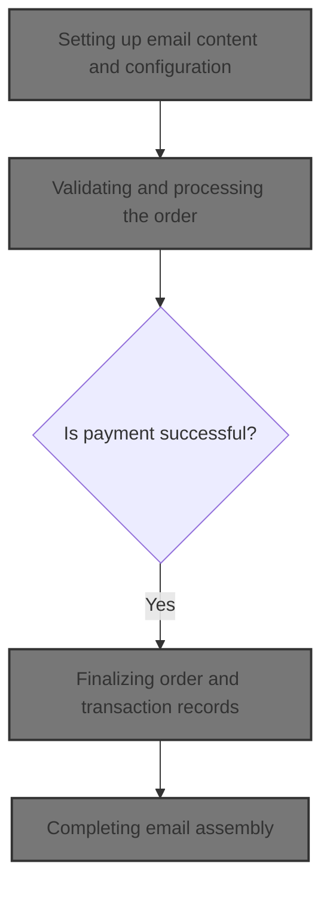

This document outlines the flow for completing an order, processing payment, and preparing a transactional email for the customer. The process starts with configuring email content, validates and processes the order, confirms payment, updates records, and assembles a multi-format email using templates and order details. Input includes order, customer, cart, payment, and store information; output is a finalized order, processed payment, and a ready-to-send email.



# Setting up email content and configuration

This section ensures that transactional emails are correctly configured and contain the necessary content, using templates and order details, before sending them to customers.

| Category        | Rule Name                          | Description                                                                                                                                             |
| --------------- | ---------------------------------- | ------------------------------------------------------------------------------------------------------------------------------------------------------- |
| Data validation | Recipient Address Enforcement      | Every email must be sent to the intended recipient's address as specified in the order or notification context.                                         |
| Business logic  | Database Email Configuration       | If email server configuration is available in the database, it must be used to set the protocol, host, port, username, and password for sending emails. |
| Business logic  | Multi-format Email Content         | Emails must include both plain text and HTML versions of the content to ensure compatibility with different email clients.                              |
| Business logic  | Template-driven Content Generation | Email content must be generated using the appropriate template and populated with order-specific tokens and details.                                    |

<SwmSnippet path="/shopizer/sm-core/src/main/java/com/salesmanager/core/modules/email/HtmlEmailSenderImpl.java" line="51">

---

In <SwmToken path="shopizer/sm-core/src/main/java/com/salesmanager/core/modules/email/HtmlEmailSenderImpl.java" pos="51:5:5" line-data="			public void prepare(MimeMessage mimeMessage)">`prepare`</SwmToken>, we configure the email and generate its content. Next, we need to call order processing to fetch order details for the email.

```java
			public void prepare(MimeMessage mimeMessage)
					throws MessagingException, IOException {
				
				JavaMailSenderImpl impl = (JavaMailSenderImpl)mailSender;
				// if email configuration is present in Database, use the same
				if(emailConfig != null) {
					impl.setProtocol(emailConfig.getProtocol());
					impl.setHost(emailConfig.getHost());
					impl.setPort(Integer.parseInt(emailConfig.getPort()));
					impl.setUsername(emailConfig.getUsername());
					impl.setPassword(emailConfig.getPassword());
					
					Properties prop = new Properties();
					prop.put("mail.smtp.auth", emailConfig.isSmtpAuth());
					prop.put("mail.smtp.starttls.enable", emailConfig.isStarttls());
					impl.setJavaMailProperties(prop);
				}
				
				mimeMessage.setRecipient(Message.RecipientType.TO, new InternetAddress(to));

				InternetAddress inetAddress = new InternetAddress();

				inetAddress.setPersonal(eml);
				inetAddress.setAddress(from);

				mimeMessage.setFrom(inetAddress);
				mimeMessage.setSubject(subject);

				Multipart mp = new MimeMultipart("alternative");

				// Create a "text" Multipart message
				BodyPart textPart = new MimeBodyPart();
				freemarkerMailConfiguration.setClassForTemplateLoading(HtmlEmailSenderImpl.class, "/");
				Template textTemplate = freemarkerMailConfiguration.getTemplate(new StringBuilder(TEMPLATE_PATH).append("").append("/").append(tmpl).toString());
				final StringWriter textWriter = new StringWriter();
				try {
					textTemplate.process(templateTokens, textWriter);
				} catch (TemplateException e) {
					throw new MailPreparationException(
							"Can't generate text mail", e);
				}
				textPart.setDataHandler(new javax.activation.DataHandler(
						new javax.activation.DataSource() {
							public InputStream getInputStream()
									throws IOException {
								//return new StringBufferInputStream(textWriter
								//		.toString());
								return new ByteArrayInputStream(textWriter
										.toString().getBytes(CHARSET));
							}

							public OutputStream getOutputStream()
									throws IOException {
								throw new IOException("Read-only data");
							}

							public String getContentType() {
								return "text/plain";
							}

							public String getName() {
								return "main";
							}
						}));
				mp.addBodyPart(textPart);

				// Create a "HTML" Multipart message
				Multipart htmlContent = new MimeMultipart("related");
				BodyPart htmlPage = new MimeBodyPart();
				freemarkerMailConfiguration.setClassForTemplateLoading(HtmlEmailSenderImpl.class, "/");
				Template htmlTemplate = freemarkerMailConfiguration.getTemplate(new StringBuilder(TEMPLATE_PATH).append("").append("/").append(tmpl).toString());
				final StringWriter htmlWriter = new StringWriter();
				try {
					htmlTemplate.process(templateTokens, htmlWriter);
				} catch (TemplateException e) {
					throw new MailPreparationException(
							"Can't generate HTML mail", e);
				}
```

---

</SwmSnippet>

## Validating and processing the order

This section ensures that all necessary information for an order is present and valid before processing the payment and confirming the transaction. It is responsible for validating the order data and handling payment processing to complete the order.

| Category        | Rule Name                        | Description                                                                                                                                                          |
| --------------- | -------------------------------- | -------------------------------------------------------------------------------------------------------------------------------------------------------------------- |
| Data validation | Required data validation         | An order cannot be processed unless all required data (order, customer, shopping cart items, payment, merchant store, and order total summary) is present and valid. |
| Business logic  | Payment confirmation requirement | Payment must be processed and confirmed before the order can be finalized. If payment fails, the order is not completed.                                             |

<SwmSnippet path="/shopizer/sm-core/src/main/java/com/salesmanager/core/business/order/service/OrderServiceImpl.java" line="105">

---

In <SwmToken path="shopizer/sm-core/src/main/java/com/salesmanager/core/business/order/service/OrderServiceImpl.java" pos="105:5:5" line-data="    private Order process(Order order, Customer customer, List&lt;ShoppingCartItem&gt; items, OrderTotalSummary summary, Payment payment, Transaction transaction, MerchantStore store) throws ServiceException {">`process`</SwmToken>, we validate all required order, customer, cart, payment, and store data. Then, we immediately process the payment to confirm the transaction before moving forward. Next, we need to call the payment service to handle the actual payment logic.

```java
    private Order process(Order order, Customer customer, List<ShoppingCartItem> items, OrderTotalSummary summary, Payment payment, Transaction transaction, MerchantStore store) throws ServiceException {
    	
    	
    	Validate.notNull(order, "Order cannot be null");
    	Validate.notNull(customer, "Customer cannot be null (even if anonymous order)");
    	Validate.notEmpty(items, "ShoppingCart items cannot be null");
    	Validate.notNull(payment, "Payment cannot be null");
    	Validate.notNull(store, "MerchantStore cannot be null");
    	Validate.notNull(summary, "Order total Summary cannot be null");
    	
    	//first process payment
    	Transaction processTransaction = paymentService.processPayment(customer, store, payment, items, order);
```

---

</SwmSnippet>

### Handling payment transaction

This section governs how payment transactions are handled within the Shopizer e-commerce platform. It ensures that customer payments are processed securely, accurately, and in accordance with business requirements, including validation, error handling, and business logic for successful and failed transactions.

| Category        | Rule Name                             | Description                                                                                                                                |
| --------------- | ------------------------------------- | ------------------------------------------------------------------------------------------------------------------------------------------ |
| Data validation | Order completeness validation         | A payment transaction must only be initiated if the customer has a valid order with all required details completed.                        |
| Data validation | Payment amount accuracy               | The payment amount must match the total order value, including taxes, shipping, and discounts, before the transaction is processed.        |
| Business logic  | Order confirmation on payment success | Successful payment transactions must trigger order confirmation and update the order status to 'Paid'.                                     |
| Business logic  | Transaction logging                   | All payment transactions must be logged with a unique transaction ID, timestamp, and status for audit and reconciliation purposes.         |
| Business logic  | Refund eligibility and tracking       | Refunds must only be processed for transactions that have a 'Paid' status and must be logged with a reference to the original transaction. |

See <SwmLink doc-title="Processing a customer payment">[Processing a customer payment](.swm%5Cprocessing-a-customer-payment.d9clj2m9.sw.md)</SwmLink>

### Finalizing order and transaction records

```mermaid
%%{init: {"flowchart": {"defaultRenderer": "elk"}} }%%
flowchart TD
    node1["Start order processing"] --> node2{"Is order status/history missing?"}
    click node1 openCode "shopizer/sm-core/src/main/java/com/salesmanager/core/business/order/service/OrderServiceImpl.java:117:119"
    node2 -->|"Missing"| node3["Set initial order status and history"]
    click node2 openCode "shopizer/sm-core/src/main/java/com/salesmanager/core/business/order/service/OrderServiceImpl.java:119:133"
    node2 -->|"Exists"| node4{"Is customer new?"}
    click node3 openCode "shopizer/sm-core/src/main/java/com/salesmanager/core/business/order/service/OrderServiceImpl.java:120:133"
    node3 --> node4
    node4 -->|"New"| node5["Create customer"]
    click node4 openCode "shopizer/sm-core/src/main/java/com/salesmanager/core/business/order/service/OrderServiceImpl.java:135:137"
    node4 -->|"Existing"| node6["Save order"]
    click node5 openCode "shopizer/sm-core/src/main/java/com/salesmanager/core/business/order/service/OrderServiceImpl.java:136:137"
    node5 --> node6["Save order"]
    click node6 openCode "shopizer/sm-core/src/main/java/com/salesmanager/core/business/order/service/OrderServiceImpl.java:139:141"
    node6 --> node7{"Is there a transaction?"}
    click node7 openCode "shopizer/sm-core/src/main/java/com/salesmanager/core/business/order/service/OrderServiceImpl.java:143:150"
    node7 -->|"Exists"| node8{"Is transaction new?"}
    node7 -->|"None"| node9{"Is there a process transaction?"}
    click node8 openCode "shopizer/sm-core/src/main/java/com/salesmanager/core/business/order/service/OrderServiceImpl.java:145:149"
    node8 -->|"New"| node10["Create transaction"]
    click node10 openCode "shopizer/sm-core/src/main/java/com/salesmanager/core/business/order/service/OrderServiceImpl.java:146:147"
    node8 -->|"Existing"| node11["Update transaction"]
    click node11 openCode "shopizer/sm-core/src/main/java/com/salesmanager/core/business/order/service/OrderServiceImpl.java:148:149"
    node10 --> node9
    node11 --> node9
    node9 -->|"Exists"| node12{"Is process transaction new?"}
    click node9 openCode "shopizer/sm-core/src/main/java/com/salesmanager/core/business/order/service/OrderServiceImpl.java:152:159"
    node9 -->|"None"| node13["Return order"]
    click node12 openCode "shopizer/sm-core/src/main/java/com/salesmanager/core/business/order/service/OrderServiceImpl.java:154:158"
    node12 -->|"New"| node14["Create process transaction"]
    click node14 openCode "shopizer/sm-core/src/main/java/com/salesmanager/core/business/order/service/OrderServiceImpl.java:155:156"
    node12 -->|"Existing"| node15["Update process transaction"]
    click node15 openCode "shopizer/sm-core/src/main/java/com/salesmanager/core/business/order/service/OrderServiceImpl.java:157:158"
    node14 --> node13
    node15 --> node13
    node13["Return order"]
    click node13 openCode "shopizer/sm-core/src/main/java/com/salesmanager/core/business/order/service/OrderServiceImpl.java:161:161"
classDef HeadingStyle fill:#777777,stroke:#333,stroke-width:2px;

%% Swimm:
%% %%{init: {"flowchart": {"defaultRenderer": "elk"}} }%%
%% flowchart TD
%%     node1["Start order processing"] --> node2{"Is order status/history missing?"}
%%     click node1 openCode "<SwmPath>[shopizer/…/service/OrderServiceImpl.java](shopizer/sm-core/src/main/java/com/salesmanager/core/business/order/service/OrderServiceImpl.java)</SwmPath>:117:119"
%%     node2 -->|"Missing"| node3["Set initial order status and history"]
%%     click node2 openCode "<SwmPath>[shopizer/…/service/OrderServiceImpl.java](shopizer/sm-core/src/main/java/com/salesmanager/core/business/order/service/OrderServiceImpl.java)</SwmPath>:119:133"
%%     node2 -->|"Exists"| node4{"Is customer new?"}
%%     click node3 openCode "<SwmPath>[shopizer/…/service/OrderServiceImpl.java](shopizer/sm-core/src/main/java/com/salesmanager/core/business/order/service/OrderServiceImpl.java)</SwmPath>:120:133"
%%     node3 --> node4
%%     node4 -->|"New"| node5["Create customer"]
%%     click node4 openCode "<SwmPath>[shopizer/…/service/OrderServiceImpl.java](shopizer/sm-core/src/main/java/com/salesmanager/core/business/order/service/OrderServiceImpl.java)</SwmPath>:135:137"
%%     node4 -->|"Existing"| node6["Save order"]
%%     click node5 openCode "<SwmPath>[shopizer/…/service/OrderServiceImpl.java](shopizer/sm-core/src/main/java/com/salesmanager/core/business/order/service/OrderServiceImpl.java)</SwmPath>:136:137"
%%     node5 --> node6["Save order"]
%%     click node6 openCode "<SwmPath>[shopizer/…/service/OrderServiceImpl.java](shopizer/sm-core/src/main/java/com/salesmanager/core/business/order/service/OrderServiceImpl.java)</SwmPath>:139:141"
%%     node6 --> node7{"Is there a transaction?"}
%%     click node7 openCode "<SwmPath>[shopizer/…/service/OrderServiceImpl.java](shopizer/sm-core/src/main/java/com/salesmanager/core/business/order/service/OrderServiceImpl.java)</SwmPath>:143:150"
%%     node7 -->|"Exists"| node8{"Is transaction new?"}
%%     node7 -->|"None"| node9{"Is there a process transaction?"}
%%     click node8 openCode "<SwmPath>[shopizer/…/service/OrderServiceImpl.java](shopizer/sm-core/src/main/java/com/salesmanager/core/business/order/service/OrderServiceImpl.java)</SwmPath>:145:149"
%%     node8 -->|"New"| node10["Create transaction"]
%%     click node10 openCode "<SwmPath>[shopizer/…/service/OrderServiceImpl.java](shopizer/sm-core/src/main/java/com/salesmanager/core/business/order/service/OrderServiceImpl.java)</SwmPath>:146:147"
%%     node8 -->|"Existing"| node11["Update transaction"]
%%     click node11 openCode "<SwmPath>[shopizer/…/service/OrderServiceImpl.java](shopizer/sm-core/src/main/java/com/salesmanager/core/business/order/service/OrderServiceImpl.java)</SwmPath>:148:149"
%%     node10 --> node9
%%     node11 --> node9
%%     node9 -->|"Exists"| node12{"Is process transaction new?"}
%%     click node9 openCode "<SwmPath>[shopizer/…/service/OrderServiceImpl.java](shopizer/sm-core/src/main/java/com/salesmanager/core/business/order/service/OrderServiceImpl.java)</SwmPath>:152:159"
%%     node9 -->|"None"| node13["Return order"]
%%     click node12 openCode "<SwmPath>[shopizer/…/service/OrderServiceImpl.java](shopizer/sm-core/src/main/java/com/salesmanager/core/business/order/service/OrderServiceImpl.java)</SwmPath>:154:158"
%%     node12 -->|"New"| node14["Create process transaction"]
%%     click node14 openCode "<SwmPath>[shopizer/…/service/OrderServiceImpl.java](shopizer/sm-core/src/main/java/com/salesmanager/core/business/order/service/OrderServiceImpl.java)</SwmPath>:155:156"
%%     node12 -->|"Existing"| node15["Update process transaction"]
%%     click node15 openCode "<SwmPath>[shopizer/…/service/OrderServiceImpl.java](shopizer/sm-core/src/main/java/com/salesmanager/core/business/order/service/OrderServiceImpl.java)</SwmPath>:157:158"
%%     node14 --> node13
%%     node15 --> node13
%%     node13["Return order"]
%%     click node13 openCode "<SwmPath>[shopizer/…/service/OrderServiceImpl.java](shopizer/sm-core/src/main/java/com/salesmanager/core/business/order/service/OrderServiceImpl.java)</SwmPath>:161:161"
%% classDef HeadingStyle fill:#777777,stroke:#333,stroke-width:2px;
```



<SwmSnippet path="/shopizer/sm-core/src/main/java/com/salesmanager/core/business/order/service/OrderServiceImpl.java" line="117">

---

After payment, we update order status/history and handle customer/transaction records in <SwmToken path="shopizer/sm-core/src/main/java/com/salesmanager/core/modules/email/HtmlEmailSenderImpl.java" pos="87:3:3" line-data="					textTemplate.process(templateTokens, textWriter);">`process`</SwmToken>.

```java
    	//transactionService.save(processTransaction);
    	
    	if(order.getOrderHistory()==null || order.getOrderHistory().size()==0 || order.getStatus()==null) {
    		OrderStatus status = order.getStatus();
    		if(status==null) {
    			status = OrderStatus.ORDERED;
    			order.setStatus(status);
    		}
    		Set<OrderStatusHistory> statusHistorySet = new HashSet<OrderStatusHistory>();
    		OrderStatusHistory statusHistory = new OrderStatusHistory();
    		statusHistory.setStatus(status);
    		statusHistory.setDateAdded(new Date());
    		statusHistory.setOrder(order);
    		statusHistorySet.add(statusHistory);
    		order.setOrderHistory(statusHistorySet);
    		
    	}
    	
    	if(customer.getId()==null || customer.getId()==0) {
    		customerService.create(customer);
    	}
    	
    	order.setCustomerId(customer.getId());
    	
    	this.create(order);

    	if(transaction!=null) {
    		transaction.setOrder(order);
    		if(transaction.getId()==null || transaction.getId()==0) {
    			transactionService.create(transaction);
    		} else {
    			transactionService.update(transaction);
    		}
    	}
    	
    	if(processTransaction!=null) {
    		processTransaction.setOrder(order);
    		if(processTransaction.getId()==null || processTransaction.getId()==0) {
    			transactionService.create(processTransaction);
    		} else {
    			transactionService.update(processTransaction);
    		}
    	}
    	
    	return order;
    	
    	
    }
```

---

</SwmSnippet>

## Completing email assembly

<SwmSnippet path="/shopizer/sm-core/src/main/java/com/salesmanager/core/modules/email/HtmlEmailSenderImpl.java" line="129">

---

After order processing, we finish assembling the email content in <SwmToken path="shopizer/sm-core/src/main/java/com/salesmanager/core/modules/email/HtmlEmailSenderImpl.java" pos="51:5:5" line-data="			public void prepare(MimeMessage mimeMessage)">`prepare`</SwmToken>.

```java
				htmlPage.setDataHandler(new javax.activation.DataHandler(
						new javax.activation.DataSource() {
							public InputStream getInputStream()
									throws IOException {
								//return new StringBufferInputStream(htmlWriter
								//		.toString());
								return new ByteArrayInputStream(textWriter
										.toString().getBytes(CHARSET));
							}

							public OutputStream getOutputStream()
									throws IOException {
								throw new IOException("Read-only data");
							}

							public String getContentType() {
								return "text/html";
							}

							public String getName() {
								return "main";
							}
						}));
				htmlContent.addBodyPart(htmlPage);
				BodyPart htmlPart = new MimeBodyPart();
				htmlPart.setContent(htmlContent);
				mp.addBodyPart(htmlPart);

				mimeMessage.setContent(mp);

				// if(attachment!=null) {
				// MimeMessageHelper messageHelper = new
				// MimeMessageHelper(mimeMessage, true);
				// messageHelper.addAttachment(attachmentFileName, attachment);
				// }

			}
```

---

</SwmSnippet>

&nbsp;

*This is an auto-generated document by Swimm 🌊 and has not yet been verified by a human*

<SwmMeta version="3.0.0" repo-id="Z2l0aHViJTNBJTNBU2hvcGl6ZXIlM0ElM0F1bWFsaW5nYXN3YW1p" repo-name="Shopizer"><sup>Powered by [Swimm](https://app.swimm.io/)</sup></SwmMeta>
