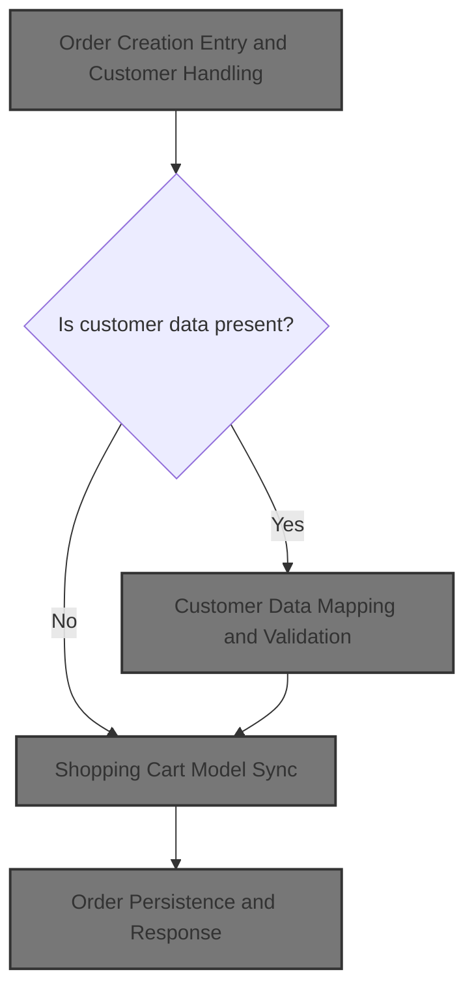
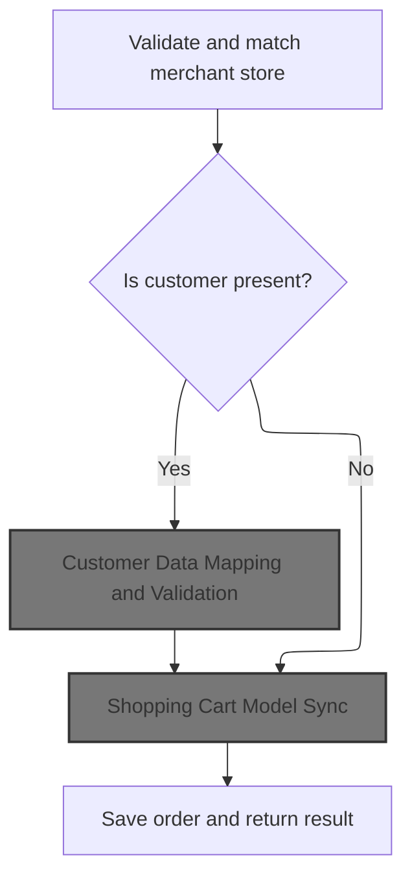

This document describes the process of creating a new order, ensuring merchant store validation, customer data mapping, and shopping cart synchronization before saving the order. The flow receives order data and returns a finalized, persisted order.



# Order Creation Entry and Customer Handling



This section governs how orders are created in Shopizer, ensuring that merchant stores are validated, customer data is properly handled and mapped, and orders are saved only when all required conditions are met.

| Category        | Rule Name                 | Description                                                                                                                                                                                   |
| --------------- | ------------------------- | --------------------------------------------------------------------------------------------------------------------------------------------------------------------------------------------- |
| Data validation | Merchant Store Validation | An order must be associated with a valid merchant store. If the merchant store code provided does not match any existing store, the order creation is rejected and an error is returned.      |
| Data validation | Customer Data Validation  | If customer data is present in the order, the system must map and validate the customer information before saving the order. Invalid or incomplete customer data will prevent order creation. |
| Business logic  | Customer Entity Reference | When a new customer is created as part of the order, the order must reference the newly persisted customer entity by updating the customer ID in the order data.                              |
| Business logic  | Shopping Cart Sync        | If no customer is present in the order, the system must synchronize the shopping cart model to ensure all order items and details are up to date before saving the order.                     |

<SwmSnippet path="/shopizer/sm-shop/src/main/java/com/salesmanager/web/services/controller/order/OrderRESTController.java" line="74">

---

In `OrderRESTController.createOrder`, we kick off by validating the merchant store from the request or service, then move on to handling customer data. If a customer is present in the order, we use <SwmToken path="shopizer/sm-shop/src/main/java/com/salesmanager/web/services/controller/order/OrderRESTController.java" pos="95:1:1" line-data="			CustomerPopulator customerPopulator = new CustomerPopulator();">`CustomerPopulator`</SwmToken> to convert and validate the DTO into a Customer entity, save it, and update the DTO with the new ID. This step is needed so the order can reference a persisted customer. Next, we call <SwmToken path="shopizer/sm-shop/src/main/java/com/salesmanager/web/services/controller/order/OrderRESTController.java" pos="95:1:1" line-data="			CustomerPopulator customerPopulator = new CustomerPopulator();">`CustomerPopulator`</SwmToken> to handle all the customer data mapping and validation.

```java
	public PersistableOrder createOrder(@PathVariable final String store, @Valid @RequestBody PersistableOrder order, HttpServletRequest request, HttpServletResponse response) throws Exception {
		MerchantStore merchantStore = (MerchantStore)request.getAttribute(Constants.MERCHANT_STORE);
		if(merchantStore!=null) {
			if(!merchantStore.getCode().equals(store)) {
				merchantStore = null;
			}
		}
		
		if(merchantStore== null) {
			merchantStore = merchantStoreService.getByCode(store);
		}
		
		if(merchantStore==null) {
			LOGGER.error("Merchant store is null for code " + store);
			response.sendError(503, "Merchant store is null for code " + store);
			return null;
		}
		
		
		PersistableCustomer cust = order.getCustomer();
		if(cust!=null) {
			CustomerPopulator customerPopulator = new CustomerPopulator();
			Customer customer = new Customer();
			customerPopulator.populate(cust, customer, merchantStore, merchantStore.getDefaultLanguage());
			customerService.save(customer);
			cust.setId(customer.getId());
		}
		
		
```

---

</SwmSnippet>

## Customer Data Mapping and Validation

```mermaid
%%{init: {"flowchart": {"defaultRenderer": "elk"}} }%%
flowchart TD
    node1["Start customer population"] --> node2{"Source has valid ID?"}
    click node1 openCode "shopizer/sm-shop/src/main/java/com/salesmanager/web/populator/customer/CustomerPopulator.java:47:58"
    node2 -->|"Yes"| node3["Set target ID from source"]
    click node2 openCode "shopizer/sm-shop/src/main/java/com/salesmanager/web/populator/customer/CustomerPopulator.java:58:60"
    node2 -->|"No"| node5
    click node3 openCode "shopizer/sm-shop/src/main/java/com/salesmanager/web/populator/customer/CustomerPopulator.java:59:59"
    node3 --> node5
    node5{"Source has encoded password?"}
    click node5 openCode "shopizer/sm-shop/src/main/java/com/salesmanager/web/populator/customer/CustomerPopulator.java:63:66"
    node5 -->|"Yes"| node6["Set password and mark as not anonymous"]
    node5 -->|"No"| node8
    click node6 openCode "shopizer/sm-shop/src/main/java/com/salesmanager/web/populator/customer/CustomerPopulator.java:64:65"
    node6 --> node8["Set email, username, merchant store"]
    node8 --> node9{"Set gender from source or default?"}
    click node8 openCode "shopizer/sm-shop/src/main/java/com/salesmanager/web/populator/customer/CustomerPopulator.java:68:79"
    click node9 openCode "shopizer/sm-shop/src/main/java/com/salesmanager/web/populator/customer/CustomerPopulator.java:70:75"
    node9 -->|"Source gender present"| node10["Set gender from source"]
    node9 -->|"No"| node11["Set default gender"]
    click node10 openCode "shopizer/sm-shop/src/main/java/com/salesmanager/web/populator/customer/CustomerPopulator.java:71:71"
    click node11 openCode "shopizer/sm-shop/src/main/java/com/salesmanager/web/populator/customer/CustomerPopulator.java:74:74"
    node10 --> node12
    node11 --> node12
    node12{"Billing info present?"}
    click node12 openCode "shopizer/sm-shop/src/main/java/com/salesmanager/web/populator/customer/CustomerPopulator.java:81:111"
    node12 -->|"Yes"| node13{"Billing country valid?"}
    node12 -->|"No"| node16{"Delivery info present?"}
    node13 -->|"Valid"| node14["Set billing info"]
    node13 -->|"Invalid"| node15["Set default billing"]
    click node14 openCode "shopizer/sm-shop/src/main/java/com/salesmanager/web/populator/customer/CustomerPopulator.java:83:109"
    click node15 openCode "shopizer/sm-shop/src/main/java/com/salesmanager/web/populator/customer/CustomerPopulator.java:112:124"
    node14 --> node16
    node15 --> node16
    node16{"Delivery info present?"}
    click node16 openCode "shopizer/sm-shop/src/main/java/com/salesmanager/web/populator/customer/CustomerPopulator.java:125:156"
    node16 -->|"Yes"| node17{"Delivery country valid?"}
    node16 -->|"No"| node20
    node17 -->|"Valid"| node18["Set delivery info"]
    node17 -->|"Invalid"| node19["Set default delivery"]
    click node18 openCode "shopizer/sm-shop/src/main/java/com/salesmanager/web/populator/customer/CustomerPopulator.java:127:155"
    click node19 openCode "shopizer/sm-shop/src/main/java/com/salesmanager/web/populator/customer/CustomerPopulator.java:158:169"
    node18 --> node20
    node19 --> node20
    subgraph loop1["For each attribute in source"]
      node20["Validate and add attribute to target"]
      click node20 openCode "shopizer/sm-shop/src/main/java/com/salesmanager/web/populator/customer/CustomerPopulator.java:172:201"
    end
    node20 --> node21{"Default language set?"}
    click node21 openCode "shopizer/sm-shop/src/main/java/com/salesmanager/web/populator/customer/CustomerPopulator.java:204:211"
    node21 -->|"No"| node22["Set language from source or store default"]
    click node22 openCode "shopizer/sm-shop/src/main/java/com/salesmanager/web/populator/customer/CustomerPopulator.java:205:210"
    node21 -->|"Yes"| node23["Return populated customer"]
    click node23 openCode "shopizer/sm-shop/src/main/java/com/salesmanager/web/populator/customer/CustomerPopulator.java:221:221"
    node22 --> node23

classDef HeadingStyle fill:#777777,stroke:#333,stroke-width:2px;

%% Swimm:
%% %%{init: {"flowchart": {"defaultRenderer": "elk"}} }%%
%% flowchart TD
%%     node1["Start customer population"] --> node2{"Source has valid ID?"}
%%     click node1 openCode "<SwmPath>[shopizer/…/customer/CustomerPopulator.java](shopizer/sm-shop/src/main/java/com/salesmanager/web/populator/customer/CustomerPopulator.java)</SwmPath>:47:58"
%%     node2 -->|"Yes"| node3["Set target ID from source"]
%%     click node2 openCode "<SwmPath>[shopizer/…/customer/CustomerPopulator.java](shopizer/sm-shop/src/main/java/com/salesmanager/web/populator/customer/CustomerPopulator.java)</SwmPath>:58:60"
%%     node2 -->|"No"| node5
%%     click node3 openCode "<SwmPath>[shopizer/…/customer/CustomerPopulator.java](shopizer/sm-shop/src/main/java/com/salesmanager/web/populator/customer/CustomerPopulator.java)</SwmPath>:59:59"
%%     node3 --> node5
%%     node5{"Source has encoded password?"}
%%     click node5 openCode "<SwmPath>[shopizer/…/customer/CustomerPopulator.java](shopizer/sm-shop/src/main/java/com/salesmanager/web/populator/customer/CustomerPopulator.java)</SwmPath>:63:66"
%%     node5 -->|"Yes"| node6["Set password and mark as not anonymous"]
%%     node5 -->|"No"| node8
%%     click node6 openCode "<SwmPath>[shopizer/…/customer/CustomerPopulator.java](shopizer/sm-shop/src/main/java/com/salesmanager/web/populator/customer/CustomerPopulator.java)</SwmPath>:64:65"
%%     node6 --> node8["Set email, username, merchant store"]
%%     node8 --> node9{"Set gender from source or default?"}
%%     click node8 openCode "<SwmPath>[shopizer/…/customer/CustomerPopulator.java](shopizer/sm-shop/src/main/java/com/salesmanager/web/populator/customer/CustomerPopulator.java)</SwmPath>:68:79"
%%     click node9 openCode "<SwmPath>[shopizer/…/customer/CustomerPopulator.java](shopizer/sm-shop/src/main/java/com/salesmanager/web/populator/customer/CustomerPopulator.java)</SwmPath>:70:75"
%%     node9 -->|"Source gender present"| node10["Set gender from source"]
%%     node9 -->|"No"| node11["Set default gender"]
%%     click node10 openCode "<SwmPath>[shopizer/…/customer/CustomerPopulator.java](shopizer/sm-shop/src/main/java/com/salesmanager/web/populator/customer/CustomerPopulator.java)</SwmPath>:71:71"
%%     click node11 openCode "<SwmPath>[shopizer/…/customer/CustomerPopulator.java](shopizer/sm-shop/src/main/java/com/salesmanager/web/populator/customer/CustomerPopulator.java)</SwmPath>:74:74"
%%     node10 --> node12
%%     node11 --> node12
%%     node12{"Billing info present?"}
%%     click node12 openCode "<SwmPath>[shopizer/…/customer/CustomerPopulator.java](shopizer/sm-shop/src/main/java/com/salesmanager/web/populator/customer/CustomerPopulator.java)</SwmPath>:81:111"
%%     node12 -->|"Yes"| node13{"Billing country valid?"}
%%     node12 -->|"No"| node16{"Delivery info present?"}
%%     node13 -->|"Valid"| node14["Set billing info"]
%%     node13 -->|"Invalid"| node15["Set default billing"]
%%     click node14 openCode "<SwmPath>[shopizer/…/customer/CustomerPopulator.java](shopizer/sm-shop/src/main/java/com/salesmanager/web/populator/customer/CustomerPopulator.java)</SwmPath>:83:109"
%%     click node15 openCode "<SwmPath>[shopizer/…/customer/CustomerPopulator.java](shopizer/sm-shop/src/main/java/com/salesmanager/web/populator/customer/CustomerPopulator.java)</SwmPath>:112:124"
%%     node14 --> node16
%%     node15 --> node16
%%     node16{"Delivery info present?"}
%%     click node16 openCode "<SwmPath>[shopizer/…/customer/CustomerPopulator.java](shopizer/sm-shop/src/main/java/com/salesmanager/web/populator/customer/CustomerPopulator.java)</SwmPath>:125:156"
%%     node16 -->|"Yes"| node17{"Delivery country valid?"}
%%     node16 -->|"No"| node20
%%     node17 -->|"Valid"| node18["Set delivery info"]
%%     node17 -->|"Invalid"| node19["Set default delivery"]
%%     click node18 openCode "<SwmPath>[shopizer/…/customer/CustomerPopulator.java](shopizer/sm-shop/src/main/java/com/salesmanager/web/populator/customer/CustomerPopulator.java)</SwmPath>:127:155"
%%     click node19 openCode "<SwmPath>[shopizer/…/customer/CustomerPopulator.java](shopizer/sm-shop/src/main/java/com/salesmanager/web/populator/customer/CustomerPopulator.java)</SwmPath>:158:169"
%%     node18 --> node20
%%     node19 --> node20
%%     subgraph loop1["For each attribute in source"]
%%       node20["Validate and add attribute to target"]
%%       click node20 openCode "<SwmPath>[shopizer/…/customer/CustomerPopulator.java](shopizer/sm-shop/src/main/java/com/salesmanager/web/populator/customer/CustomerPopulator.java)</SwmPath>:172:201"
%%     end
%%     node20 --> node21{"Default language set?"}
%%     click node21 openCode "<SwmPath>[shopizer/…/customer/CustomerPopulator.java](shopizer/sm-shop/src/main/java/com/salesmanager/web/populator/customer/CustomerPopulator.java)</SwmPath>:204:211"
%%     node21 -->|"No"| node22["Set language from source or store default"]
%%     click node22 openCode "<SwmPath>[shopizer/…/customer/CustomerPopulator.java](shopizer/sm-shop/src/main/java/com/salesmanager/web/populator/customer/CustomerPopulator.java)</SwmPath>:205:210"
%%     node21 -->|"Yes"| node23["Return populated customer"]
%%     click node23 openCode "<SwmPath>[shopizer/…/customer/CustomerPopulator.java](shopizer/sm-shop/src/main/java/com/salesmanager/web/populator/customer/CustomerPopulator.java)</SwmPath>:221:221"
%%     node22 --> node23
%% 
%% classDef HeadingStyle fill:#777777,stroke:#333,stroke-width:2px;
```



This section governs the mapping and validation of customer data, ensuring that all required fields are present, valid, and correctly associated with the merchant store before the customer entity is used in business processes.

| Category        | Rule Name                   | Description                                                                                                                                                                      |
| --------------- | --------------------------- | -------------------------------------------------------------------------------------------------------------------------------------------------------------------------------- |
| Data validation | Billing Country Validation  | If billing information is present, validate the country code against supported countries. If invalid, block the operation and throw an exception.                                |
| Data validation | Billing Zone Validation     | If a zone code is provided in billing, validate it against supported zones for the country. If invalid, block the operation and throw an exception.                              |
| Data validation | Delivery Country Validation | If delivery information is present, validate the country code against supported countries. If invalid, block the operation and throw an exception.                               |
| Data validation | Delivery Zone Validation    | If a zone code is provided in delivery, validate it against supported zones for the country. If invalid, block the operation and throw an exception.                             |
| Data validation | Attribute Store Validation  | For each attribute in the source, validate that the customer option and option value exist and belong to the merchant store. If not, block the operation and throw an exception. |
| Business logic  | Source ID Mapping           | If the source customer has a valid ID (greater than zero), set the target customer's ID to match the source.                                                                     |
| Business logic  | Password Assignment         | If the source customer provides an encoded password, set the target customer's password and mark the customer as not anonymous.                                                  |
| Business logic  | Gender Defaulting           | Set the target customer's gender from the source if provided; otherwise, assign a default gender value (male).                                                                   |
| Business logic  | Default Billing Assignment  | If billing information is present but incomplete, set default values where possible to ensure the customer entity is usable.                                                     |
| Business logic  | Default Delivery Assignment | If delivery information is present but incomplete, set default values where possible to ensure the customer entity is usable.                                                    |
| Business logic  | Default Language Assignment | If the target customer does not have a default language, set it from the source language code or fall back to the store's default language.                                      |

<SwmSnippet path="/shopizer/sm-shop/src/main/java/com/salesmanager/web/populator/customer/CustomerPopulator.java" line="47">

---

In `CustomerPopulator.populate`, we validate and map customer fields, including country and zone codes for billing and delivery. We also check and set customer attributes, making sure they belong to the merchant store. If any country or zone code is invalid, we throw an exception to block bad data.

```java
	public Customer populate(PersistableCustomer source, Customer target,
			MerchantStore store, Language language) throws ConversionException {

		Validate.notNull(customerOptionService, "Requires to set CustomerOptionService");
		Validate.notNull(customerOptionValueService, "Requires to set CustomerOptionValueService");
		Validate.notNull(zoneService, "Requires to set ZoneService");
		Validate.notNull(countryService, "Requires to set CountryService");
		Validate.notNull(languageService, "Requires to set LanguageService");

		try {
			
			if(source.getId() !=null && source.getId()>0){
			    target.setId( source.getId() );
			}
		    
		    
		    if(!StringUtils.isBlank(source.getEncodedPassword())) {
				target.setPassword(source.getEncodedPassword());
				target.setAnonymous(false);
			}

			target.setEmailAddress(source.getEmailAddress());
			target.setNick(source.getUserName());
			if(source.getGender()!=null && target.getGender()==null) {
				target.setGender( com.salesmanager.core.business.customer.model.CustomerGender.valueOf( source.getGender() ) );
			}
			if(target.getGender()==null) {
				target.setGender( com.salesmanager.core.business.customer.model.CustomerGender.M);
			}

			Map<String,Country> countries = countryService.getCountriesMap(language);
			
			target.setMerchantStore( store );

			Address sourceBilling = source.getBilling();
			if(sourceBilling!=null) {
				Billing billing = new Billing();
				billing.setAddress(sourceBilling.getAddress());
				billing.setCity(sourceBilling.getCity());
				billing.setCompany(sourceBilling.getCompany());
				//billing.setCountry(country);
				billing.setFirstName(sourceBilling.getFirstName());
				billing.setLastName(sourceBilling.getLastName());
				billing.setTelephone(sourceBilling.getPhone());
				billing.setPostalCode(sourceBilling.getPostalCode());
				billing.setState(sourceBilling.getStateProvince());
				Country billingCountry = null;
				if(!StringUtils.isBlank(sourceBilling.getCountry())) {
					billingCountry = countries.get(sourceBilling.getCountry());
					if(billingCountry==null) {
						throw new ConversionException("Unsuported country code " + sourceBilling.getCountry());
					}
					billing.setCountry(billingCountry);
				}
				
				if(billingCountry!=null && !StringUtils.isBlank(sourceBilling.getZone())) {
					Zone zone = zoneService.getByCode(sourceBilling.getZone());
					if(zone==null) {
						throw new ConversionException("Unsuported zone code " + sourceBilling.getZone());
					}
					billing.setZone(zone);
				}
				target.setBilling(billing);

			}
			if(target.getBilling() ==null && source.getBilling()!=null){
			    LOG.info( "Setting default values for billing" );
			    Billing billing = new Billing();
			    Country billingCountry = null;
			    if(StringUtils.isNotBlank( source.getBilling().getCountry() )) {
                    billingCountry = countries.get(source.getBilling().getCountry());
                    if(billingCountry==null) {
                        throw new ConversionException("Unsuported country code " + sourceBilling.getCountry());
                    }
                    billing.setCountry(billingCountry);
                    target.setBilling( billing );
                }
			}
			Address sourceShipping = source.getDelivery();
			if(sourceShipping!=null) {
				Delivery delivery = new Delivery();
				delivery.setAddress(sourceShipping.getAddress());
				delivery.setCity(sourceShipping.getCity());
				delivery.setCompany(sourceShipping.getCompany());
				delivery.setFirstName(sourceShipping.getFirstName());
				delivery.setLastName(sourceShipping.getLastName());
				delivery.setTelephone(sourceShipping.getPhone());
				delivery.setPostalCode(sourceShipping.getPostalCode());
				delivery.setState(sourceShipping.getStateProvince());
				Country deliveryCountry = null;
				
				
				
				if(!StringUtils.isBlank(sourceShipping.getCountry())) {
					deliveryCountry = countries.get(sourceShipping.getCountry());
					if(deliveryCountry==null) {
						throw new ConversionException("Unsuported country code " + sourceShipping.getCountry());
					}
					delivery.setCountry(deliveryCountry);
				}
				
				if(deliveryCountry!=null && !StringUtils.isBlank(sourceShipping.getZone())) {
					Zone zone = zoneService.getByCode(sourceShipping.getZone());
					if(zone==null) {
						throw new ConversionException("Unsuported zone code " + sourceShipping.getZone());
					}
					delivery.setZone(zone);
				}
				target.setDelivery(delivery);
			}
			
			if(target.getDelivery() ==null && source.getDelivery()!=null){
			    LOG.info( "Setting default value for delivery" );
			    Delivery delivery = new Delivery();
			    Country deliveryCountry = null;
                if(StringUtils.isNotBlank( source.getDelivery().getCountry() )) {
                    deliveryCountry = countries.get(source.getDelivery().getCountry());
                    if(deliveryCountry==null) {
                        throw new ConversionException("Unsuported country code " + sourceShipping.getCountry());
                    }
                    delivery.setCountry(deliveryCountry);
                    target.setDelivery( delivery );
                }
			}
			
			if(source.getAttributes()!=null) {
				for(PersistableCustomerAttribute attr : source.getAttributes()) {

					CustomerOption customerOption = customerOptionService.getById(attr.getCustomerOption().getId());
					if(customerOption==null) {
						throw new ConversionException("Customer option id " + attr.getCustomerOption().getId() + " does not exist");
					}
					
					CustomerOptionValue customerOptionValue = customerOptionValueService.getById(attr.getCustomerOptionValue().getId());
					if(customerOptionValue==null) {
						throw new ConversionException("Customer option value id " + attr.getCustomerOptionValue().getId() + " does not exist");
					}
					
					if(customerOption.getMerchantStore().getId().intValue()!=store.getId().intValue()) {
						throw new ConversionException("Invalid customer option id ");
					}
					
					if(customerOptionValue.getMerchantStore().getId().intValue()!=store.getId().intValue()) {
						throw new ConversionException("Invalid customer option value id ");
					}
					
					CustomerAttribute attribute = new CustomerAttribute();
					attribute.setCustomer(target);
					attribute.setCustomerOption(customerOption);
					attribute.setCustomerOptionValue(customerOptionValue);
					attribute.setTextValue(attr.getTextValue());
					
					target.getAttributes().add(attribute);
					
				}
```

---

</SwmSnippet>

<SwmSnippet path="/shopizer/sm-shop/src/main/java/com/salesmanager/web/populator/customer/CustomerPopulator.java" line="204">

---

Here we finish up by making sure the customer has a valid default language, either from the source or the store. The populated and validated Customer entity is returned for use in order creation.

```java
			if(target.getDefaultLanguage()==null) {
				Language lang = languageService.getByCode(source.getLanguage());
				if(lang==null) {
					lang = store.getDefaultLanguage();
				}
				
				target.setDefaultLanguage(lang);
			}

		
		} catch (Exception e) {
			throw new ConversionException(e);
		}
		
		
		
		
		return target;
	}
```

---

</SwmSnippet>

## Order Model Population

<SwmSnippet path="/shopizer/sm-shop/src/main/java/com/salesmanager/web/services/controller/order/OrderRESTController.java" line="103">

---

Back in `OrderRESTController.createOrder`, after handling the customer, we set up the order model and use a populator to map the DTO to the Order entity. Next, we call <SwmToken path="shopizer/sm-shop/src/main/java/com/salesmanager/web/populator/shoppingCart/ShoppingCartModelPopulator.java" pos="37:4:4" line-data="public class ShoppingCartModelPopulator">`ShoppingCartModelPopulator`</SwmToken> to turn the shopping cart data into a persistent model, making sure the order can reference real cart items.

```java
		Order modelOrder = new Order();
		PersistableOrderPopulator populator = new PersistableOrderPopulator();
		populator.setDigitalProductService(digitalProductService);
		populator.setProductAttributeService(productAttributeService);
		populator.setProductService(productService);
		
		populator.populate(order, modelOrder, merchantStore, merchantStore.getDefaultLanguage());
		
	
```

---

</SwmSnippet>

## Shopping Cart Model Sync

```mermaid
%%{init: {"flowchart": {"defaultRenderer": "elk"}} }%%
flowchart TD
    node1["Start cart population"] --> node2{"Is cart id > 0 and code not blank?"}
    click node1 openCode "shopizer/sm-shop/src/main/java/com/salesmanager/web/populator/shoppingCart/ShoppingCartModelPopulator.java:85:90"
    node2 -->|"Yes"| node3["Retrieve cart from database"]
    click node2 openCode "shopizer/sm-shop/src/main/java/com/salesmanager/web/populator/shoppingCart/ShoppingCartModelPopulator.java:91:92"
    node3 --> node4{"Does cart exist in database?"}
    click node3 openCode "shopizer/sm-shop/src/main/java/com/salesmanager/web/populator/shoppingCart/ShoppingCartModelPopulator.java:93:94"
    node4 -->|"No"| node5["Create new cart with code, store, customer"]
    click node4 openCode "shopizer/sm-shop/src/main/java/com/salesmanager/web/populator/shoppingCart/ShoppingCartModelPopulator.java:95:103"
    node4 -->|"Yes"| node6["Use existing cart"]
    click node6 openCode "shopizer/sm-shop/src/main/java/com/salesmanager/web/populator/shoppingCart/ShoppingCartModelPopulator.java:93:94"
    node2 -->|"No"| node5
    node5 --> node7["Save cart to database"]
    click node5 openCode "shopizer/sm-shop/src/main/java/com/salesmanager/web/populator/shoppingCart/ShoppingCartModelPopulator.java:102:103"
    node6 --> node7
    node7 --> node8["Process cart items"]
    click node7 openCode "shopizer/sm-shop/src/main/java/com/salesmanager/web/populator/shoppingCart/ShoppingCartModelPopulator.java:116:117"
    subgraph loop1["For each item in cart"]
        node8 --> node9{"Does item exist in cart model?"}
        click node9 openCode "shopizer/sm-shop/src/main/java/com/salesmanager/web/populator/shoppingCart/ShoppingCartModelPopulator.java:124:126"
        node9 -->|"Yes"| node10{"Does item have attributes?"}
        click node10 openCode "shopizer/sm-shop/src/main/java/com/salesmanager/web/populator/shoppingCart/ShoppingCartModelPopulator.java:134:139"
        node10 -->|"Yes"| node11["Update quantity and attributes"]
        click node11 openCode "shopizer/sm-shop/src/main/java/com/salesmanager/web/populator/shoppingCart/ShoppingCartModelPopulator.java:132:152"
        node10 -->|"No"| node12["Remove all attributes"]
        click node12 openCode "shopizer/sm-shop/src/main/java/com/salesmanager/web/populator/shoppingCart/ShoppingCartModelPopulator.java:156:157"
        node11 --> node13["Add item to cart and update database"]
        click node13 openCode "shopizer/sm-shop/src/main/java/com/salesmanager/web/populator/shoppingCart/ShoppingCartModelPopulator.java:158:159"
        node12 --> node13
        node9 -->|"No"| node14["Create new cart item"]
        click node14 openCode "shopizer/sm-shop/src/main/java/com/salesmanager/web/populator/shoppingCart/ShoppingCartModelPopulator.java:163:165"
        node14 --> node15["Add new item to cart and update database"]
        click node15 openCode "shopizer/sm-shop/src/main/java/com/salesmanager/web/populator/shoppingCart/ShoppingCartModelPopulator.java:173:174"
        node13 --> node8
        node15 --> node8
    end
    node8 --> node16["Return updated cart"]
    click node16 openCode "shopizer/sm-shop/src/main/java/com/salesmanager/web/populator/shoppingCart/ShoppingCartModelPopulator.java:187:188"

classDef HeadingStyle fill:#777777,stroke:#333,stroke-width:2px;

%% Swimm:
%% %%{init: {"flowchart": {"defaultRenderer": "elk"}} }%%
%% flowchart TD
%%     node1["Start cart population"] --> node2{"Is cart id > 0 and code not blank?"}
%%     click node1 openCode "<SwmPath>[shopizer/…/shoppingCart/ShoppingCartModelPopulator.java](shopizer/sm-shop/src/main/java/com/salesmanager/web/populator/shoppingCart/ShoppingCartModelPopulator.java)</SwmPath>:85:90"
%%     node2 -->|"Yes"| node3["Retrieve cart from database"]
%%     click node2 openCode "<SwmPath>[shopizer/…/shoppingCart/ShoppingCartModelPopulator.java](shopizer/sm-shop/src/main/java/com/salesmanager/web/populator/shoppingCart/ShoppingCartModelPopulator.java)</SwmPath>:91:92"
%%     node3 --> node4{"Does cart exist in database?"}
%%     click node3 openCode "<SwmPath>[shopizer/…/shoppingCart/ShoppingCartModelPopulator.java](shopizer/sm-shop/src/main/java/com/salesmanager/web/populator/shoppingCart/ShoppingCartModelPopulator.java)</SwmPath>:93:94"
%%     node4 -->|"No"| node5["Create new cart with code, store, customer"]
%%     click node4 openCode "<SwmPath>[shopizer/…/shoppingCart/ShoppingCartModelPopulator.java](shopizer/sm-shop/src/main/java/com/salesmanager/web/populator/shoppingCart/ShoppingCartModelPopulator.java)</SwmPath>:95:103"
%%     node4 -->|"Yes"| node6["Use existing cart"]
%%     click node6 openCode "<SwmPath>[shopizer/…/shoppingCart/ShoppingCartModelPopulator.java](shopizer/sm-shop/src/main/java/com/salesmanager/web/populator/shoppingCart/ShoppingCartModelPopulator.java)</SwmPath>:93:94"
%%     node2 -->|"No"| node5
%%     node5 --> node7["Save cart to database"]
%%     click node5 openCode "<SwmPath>[shopizer/…/shoppingCart/ShoppingCartModelPopulator.java](shopizer/sm-shop/src/main/java/com/salesmanager/web/populator/shoppingCart/ShoppingCartModelPopulator.java)</SwmPath>:102:103"
%%     node6 --> node7
%%     node7 --> node8["Process cart items"]
%%     click node7 openCode "<SwmPath>[shopizer/…/shoppingCart/ShoppingCartModelPopulator.java](shopizer/sm-shop/src/main/java/com/salesmanager/web/populator/shoppingCart/ShoppingCartModelPopulator.java)</SwmPath>:116:117"
%%     subgraph loop1["For each item in cart"]
%%         node8 --> node9{"Does item exist in cart model?"}
%%         click node9 openCode "<SwmPath>[shopizer/…/shoppingCart/ShoppingCartModelPopulator.java](shopizer/sm-shop/src/main/java/com/salesmanager/web/populator/shoppingCart/ShoppingCartModelPopulator.java)</SwmPath>:124:126"
%%         node9 -->|"Yes"| node10{"Does item have attributes?"}
%%         click node10 openCode "<SwmPath>[shopizer/…/shoppingCart/ShoppingCartModelPopulator.java](shopizer/sm-shop/src/main/java/com/salesmanager/web/populator/shoppingCart/ShoppingCartModelPopulator.java)</SwmPath>:134:139"
%%         node10 -->|"Yes"| node11["Update quantity and attributes"]
%%         click node11 openCode "<SwmPath>[shopizer/…/shoppingCart/ShoppingCartModelPopulator.java](shopizer/sm-shop/src/main/java/com/salesmanager/web/populator/shoppingCart/ShoppingCartModelPopulator.java)</SwmPath>:132:152"
%%         node10 -->|"No"| node12["Remove all attributes"]
%%         click node12 openCode "<SwmPath>[shopizer/…/shoppingCart/ShoppingCartModelPopulator.java](shopizer/sm-shop/src/main/java/com/salesmanager/web/populator/shoppingCart/ShoppingCartModelPopulator.java)</SwmPath>:156:157"
%%         node11 --> node13["Add item to cart and update database"]
%%         click node13 openCode "<SwmPath>[shopizer/…/shoppingCart/ShoppingCartModelPopulator.java](shopizer/sm-shop/src/main/java/com/salesmanager/web/populator/shoppingCart/ShoppingCartModelPopulator.java)</SwmPath>:158:159"
%%         node12 --> node13
%%         node9 -->|"No"| node14["Create new cart item"]
%%         click node14 openCode "<SwmPath>[shopizer/…/shoppingCart/ShoppingCartModelPopulator.java](shopizer/sm-shop/src/main/java/com/salesmanager/web/populator/shoppingCart/ShoppingCartModelPopulator.java)</SwmPath>:163:165"
%%         node14 --> node15["Add new item to cart and update database"]
%%         click node15 openCode "<SwmPath>[shopizer/…/shoppingCart/ShoppingCartModelPopulator.java](shopizer/sm-shop/src/main/java/com/salesmanager/web/populator/shoppingCart/ShoppingCartModelPopulator.java)</SwmPath>:173:174"
%%         node13 --> node8
%%         node15 --> node8
%%     end
%%     node8 --> node16["Return updated cart"]
%%     click node16 openCode "<SwmPath>[shopizer/…/shoppingCart/ShoppingCartModelPopulator.java](shopizer/sm-shop/src/main/java/com/salesmanager/web/populator/shoppingCart/ShoppingCartModelPopulator.java)</SwmPath>:187:188"
%% 
%% classDef HeadingStyle fill:#777777,stroke:#333,stroke-width:2px;
```



This section governs how the <SwmToken path="shopizer/sm-shop/src/main/java/com/salesmanager/web/populator/shoppingCart/ShoppingCartModelPopulator.java" pos="85:3:3" line-data="    public ShoppingCart populate(ShoppingCartData shoppingCart,ShoppingCart cartMdel,final MerchantStore store, Language language)">`ShoppingCart`</SwmToken> model is synchronized with incoming cart data, ensuring the cart in the database accurately reflects the user's selections, including items and their attributes.

| Category        | Rule Name                          | Description                                                                                                                                                                                                                       |
| --------------- | ---------------------------------- | --------------------------------------------------------------------------------------------------------------------------------------------------------------------------------------------------------------------------------- |
| Data validation | Product Validation for Cart Item   | When creating a new cart item, validate that the product exists and belongs to the correct merchant store. If the product is invalid or does not belong to the store, the process must fail.                                      |
| Data validation | Attribute Validation for Cart Item | When adding attributes to a cart item, ensure each attribute belongs to the correct product. Only valid attributes are linked to the cart item.                                                                                   |
| Business logic  | Cart Retrieval or Creation         | If the input cart has a valid id (>0) and a non-blank code, attempt to retrieve the cart from the database using the code. If the cart does not exist, create a new cart with the provided code, store, and customer information. |
| Business logic  | New Cart Creation                  | If the input cart does not have a valid id or code, always create a new cart with the provided code, store, and customer information.                                                                                             |
| Business logic  | Cart Item Synchronization          | For each item in the input cart, if the item already exists in the cart model, update its quantity and synchronize its attributes. If the item does not exist, create a new cart item and add it to the cart.                     |
| Business logic  | Cart Item Attribute Sync           | When updating an existing cart item, if the input item has attributes, update the item's attributes to match. If no attributes are provided, remove all attributes from the item.                                                 |

<SwmSnippet path="/shopizer/sm-shop/src/main/java/com/salesmanager/web/populator/shoppingCart/ShoppingCartModelPopulator.java" line="85">

---

In `ShoppingCartModelPopulator.populate`, we either fetch or create the <SwmToken path="shopizer/sm-shop/src/main/java/com/salesmanager/web/populator/shoppingCart/ShoppingCartModelPopulator.java" pos="85:3:3" line-data="    public ShoppingCart populate(ShoppingCartData shoppingCart,ShoppingCart cartMdel,final MerchantStore store, Language language)">`ShoppingCart`</SwmToken> model based on the input data. Then we sync the cart items and their attributes, updating existing items or adding new ones as needed. This keeps the cart model up-to-date with the incoming data.

```java
    public ShoppingCart populate(ShoppingCartData shoppingCart,ShoppingCart cartMdel,final MerchantStore store, Language language)
    {


        // if id >0 get the original from the database, override products
       try{
        if ( shoppingCart.getId() > 0  && StringUtils.isNotBlank( shoppingCart.getCode()))
        {
            cartMdel = shoppingCartService.getByCode( shoppingCart.getCode(), store );
            if(cartMdel==null){
                cartMdel=new ShoppingCart();
                cartMdel.setShoppingCartCode( shoppingCart.getCode() );
                cartMdel.setMerchantStore( store );
                if ( customer != null )
                {
                    cartMdel.setCustomerId( customer.getId() );
                }
                shoppingCartService.create( cartMdel );
            }
        }
        else
        {
            cartMdel.setShoppingCartCode( shoppingCart.getCode() );
            cartMdel.setMerchantStore( store );
            if ( customer != null )
            {
                cartMdel.setCustomerId( customer.getId() );
            }
            shoppingCartService.create( cartMdel );
        }

        List<ShoppingCartItem> items = shoppingCart.getShoppingCartItems();
        Set<com.salesmanager.core.business.shoppingcart.model.ShoppingCartItem> newItems =
            new HashSet<com.salesmanager.core.business.shoppingcart.model.ShoppingCartItem>();
        if ( items != null && items.size() > 0 )
        {
            for ( ShoppingCartItem item : items )
            {

                Set<com.salesmanager.core.business.shoppingcart.model.ShoppingCartItem> cartItems = cartMdel.getLineItems();
                if ( cartItems != null && cartItems.size() > 0 )
                {

                    for ( com.salesmanager.core.business.shoppingcart.model.ShoppingCartItem dbItem : cartItems )
                    {
                        if ( dbItem.getId().longValue() == item.getId() )
                        {
                            dbItem.setQuantity( item.getQuantity() );
                            // compare attributes
                            Set<com.salesmanager.core.business.shoppingcart.model.ShoppingCartAttributeItem> attributes =
                                dbItem.getAttributes();
                            Set<com.salesmanager.core.business.shoppingcart.model.ShoppingCartAttributeItem> newAttributes =
                                new HashSet<com.salesmanager.core.business.shoppingcart.model.ShoppingCartAttributeItem>();
                            List<ShoppingCartAttribute> cartAttributes = item.getShoppingCartAttributes();
                            if ( !CollectionUtils.isEmpty( cartAttributes ) )
                            {
                                for ( ShoppingCartAttribute attribute : cartAttributes )
                                {
                                    for ( com.salesmanager.core.business.shoppingcart.model.ShoppingCartAttributeItem dbAttribute : attributes )
                                    {
                                        if ( dbAttribute.getId().longValue() == attribute.getId() )
                                        {
                                            newAttributes.add( dbAttribute );
                                        }
                                    }
                                }
                                
                                dbItem.setAttributes( newAttributes );
                            }
                            else
                            {
                                dbItem.removeAllAttributes();
                            }
                            newItems.add( dbItem );
                        }
                    }
```

---

</SwmSnippet>

<SwmSnippet path="/shopizer/sm-shop/src/main/java/com/salesmanager/web/populator/shoppingCart/ShoppingCartModelPopulator.java" line="163">

---

Here we handle cases where an input cart item isn't already in the cart model. We call <SwmToken path="shopizer/sm-shop/src/main/java/com/salesmanager/web/populator/shoppingCart/ShoppingCartModelPopulator.java" pos="165:1:1" line-data="                        createCartItem( cartMdel, item, store );">`createCartItem`</SwmToken> to build and add it, making sure the cart matches the user's selections.

```java
                {// create new item
                    com.salesmanager.core.business.shoppingcart.model.ShoppingCartItem cartItem =
                        createCartItem( cartMdel, item, store );
```

---

</SwmSnippet>

<SwmSnippet path="/shopizer/sm-shop/src/main/java/com/salesmanager/web/populator/shoppingCart/ShoppingCartModelPopulator.java" line="191">

---

<SwmToken path="shopizer/sm-shop/src/main/java/com/salesmanager/web/populator/shoppingCart/ShoppingCartModelPopulator.java" pos="191:17:17" line-data="    private com.salesmanager.core.business.shoppingcart.model.ShoppingCartItem createCartItem( com.salesmanager.core.business.shoppingcart.model.ShoppingCart cart,">`createCartItem`</SwmToken> validates the product and store, then builds a new cart item with quantity, price, and attributes. It checks each attribute to make sure it belongs to the right product before linking it to the cart item.

```java
    private com.salesmanager.core.business.shoppingcart.model.ShoppingCartItem createCartItem( com.salesmanager.core.business.shoppingcart.model.ShoppingCart cart,
                                                                                               ShoppingCartItem shoppingCartItem,
                                                                                               MerchantStore store )
        throws Exception
    {

        Product product = productService.getById( shoppingCartItem.getProductId() );

        if ( product == null )
        {
            throw new Exception( "Item with id " + shoppingCartItem.getProductId() + " does not exist" );
        }

        if ( product.getMerchantStore().getId().intValue() != store.getId().intValue() )
        {
            throw new Exception( "Item with id " + shoppingCartItem.getProductId() + " does not belong to merchant "
                + store.getId() );
        }

        com.salesmanager.core.business.shoppingcart.model.ShoppingCartItem item =
            new com.salesmanager.core.business.shoppingcart.model.ShoppingCartItem( cart, product );
        item.setQuantity( shoppingCartItem.getQuantity() );
        item.setItemPrice( shoppingCartItem.getProductPrice() );
        item.setShoppingCart( cart );

        // attributes
        List<ShoppingCartAttribute> cartAttributes = shoppingCartItem.getShoppingCartAttributes();
        if ( !CollectionUtils.isEmpty( cartAttributes ) )
        {
            Set<com.salesmanager.core.business.shoppingcart.model.ShoppingCartAttributeItem> newAttributes =
                new HashSet<com.salesmanager.core.business.shoppingcart.model.ShoppingCartAttributeItem>();
            for ( ShoppingCartAttribute attribute : cartAttributes )
            {
                ProductAttribute productAttribute = productAttributeService.getById( attribute.getAttributeId() );
                if ( productAttribute != null
                    && productAttribute.getProduct().getId().longValue() == product.getId().longValue() )
                {
                    com.salesmanager.core.business.shoppingcart.model.ShoppingCartAttributeItem attributeItem =
                        new com.salesmanager.core.business.shoppingcart.model.ShoppingCartAttributeItem( item,
                                                                                                         productAttribute );
                    if ( attribute.getAttributeId() > 0 )
                    {
                        attributeItem.setId( attribute.getId() );
                    }
                    item.addAttributes( attributeItem );
                    //newAttributes.add( attributeItem );
                }

            }
```

---

</SwmSnippet>

<SwmSnippet path="/shopizer/sm-shop/src/main/java/com/salesmanager/web/populator/shoppingCart/ShoppingCartModelPopulator.java" line="166">

---

After returning from `ShoppingCartModelPopulator.createCartItem`, we add the new item to the cart's line items and update the cart in the database. This keeps the cart model aligned with the input data.

```java
                    Set<com.salesmanager.core.business.shoppingcart.model.ShoppingCartItem> lineItems =
                        cartMdel.getLineItems();
                    if ( lineItems == null )
                    {
                        lineItems = new HashSet<com.salesmanager.core.business.shoppingcart.model.ShoppingCartItem>();
                        cartMdel.setLineItems( lineItems );
                    }
                    lineItems.add( cartItem );
                    shoppingCartService.update( cartMdel );
                }
            }// end for
        }// end if
       }catch(ServiceException se){
           LOG.error( "Error while converting cart data to cart model.."+se );
           throw new ConversionException( "Unable to create cart model", se ); 
       }
       catch (Exception ex){
           LOG.error( "Error while converting cart data to cart model.."+ex );
           throw new ConversionException( "Unable to create cart model", ex );  
       }

        return cartMdel;
    }
```

---

</SwmSnippet>

## Order Persistence and Response

<SwmSnippet path="/shopizer/sm-shop/src/main/java/com/salesmanager/web/services/controller/order/OrderRESTController.java" line="112">

---

After returning from `ShoppingCartModelPopulator.populate`, we save the order model, update the DTO with the new order ID, and return it. This finalizes the order creation and gives the client the order reference.

```java
		orderService.save(modelOrder);
		order.setId(modelOrder.getId());
		
		return order;
	}
```

---

</SwmSnippet>

&nbsp;

*This is an auto-generated document by Swimm 🌊 and has not yet been verified by a human*

<SwmMeta version="3.0.0" repo-id="Z2l0aHViJTNBJTNBU2hvcGl6ZXIlM0ElM0F1bWFsaW5nYXN3YW1p" repo-name="Shopizer"><sup>Powered by [Swimm](https://app.swimm.io/)</sup></SwmMeta>
