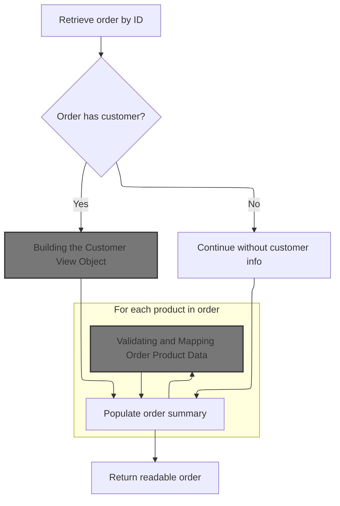
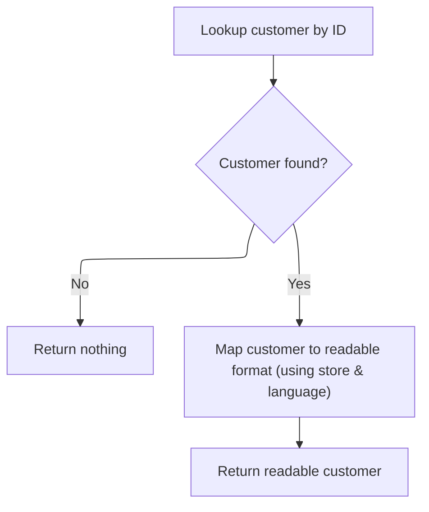
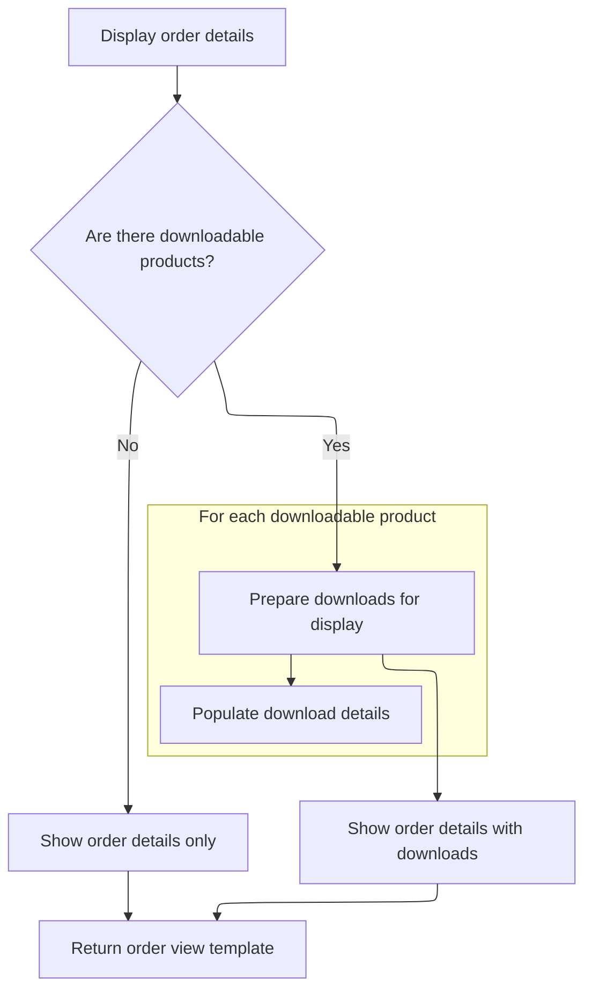

This document describes how a customer can view the details of their order. The system validates the order ID and customer authentication, verifies order ownership, loads and maps all relevant customer and product data, and prepares any downloadable product information. The result is a detailed order view tailored to the customer.

# Validating Order Access and Context

This section is responsible for validating access to order details by ensuring the <SwmToken path="shopizer/sm-shop/src/main/java/com/salesmanager/web/shop/controller/customer/CustomerOrdersController.java" pos="105:26:26" line-data="    public String orderDetails(final Model model,final HttpServletRequest request,@RequestParam(value = &quot;orderId&quot; ,required=true) final String orderId) throws Exception{">`orderId`</SwmToken> is present and valid, the user is authenticated as a customer, and the order belongs to the requesting customer. Only after these checks are passed, the order details are fetched and displayed.

| Category        | Rule Name                         | Description                                                                                                                                                                                                                                                                                                                                                                                                                                                                                           |
| --------------- | --------------------------------- | ----------------------------------------------------------------------------------------------------------------------------------------------------------------------------------------------------------------------------------------------------------------------------------------------------------------------------------------------------------------------------------------------------------------------------------------------------------------------------------------------------- |
| Data validation | Order ID Required                 | The <SwmToken path="shopizer/sm-shop/src/main/java/com/salesmanager/web/shop/controller/customer/CustomerOrdersController.java" pos="105:26:26" line-data="    public String orderDetails(final Model model,final HttpServletRequest request,@RequestParam(value = &quot;orderId&quot; ,required=true) final String orderId) throws Exception{">`orderId`</SwmToken> parameter must be present and not blank in the request. If it is missing or empty, the order details cannot be accessed.         |
| Data validation | Order ID Format Validation        | The <SwmToken path="shopizer/sm-shop/src/main/java/com/salesmanager/web/shop/controller/customer/CustomerOrdersController.java" pos="105:26:26" line-data="    public String orderDetails(final Model model,final HttpServletRequest request,@RequestParam(value = &quot;orderId&quot; ,required=true) final String orderId) throws Exception{">`orderId`</SwmToken> must be a valid numeric value. If it cannot be parsed as a number, access to order details is denied and the user is redirected. |
| Data validation | Customer Authentication Required  | Only authenticated users with the customer role can access order details. If the user is not authenticated as a customer, access is denied.                                                                                                                                                                                                                                                                                                                                                           |
| Data validation | Order Ownership Verification      | The order must belong to the authenticated customer. If the order does not belong to the customer, access is denied.                                                                                                                                                                                                                                                                                                                                                                                  |
| Business logic  | Conditional Order Details Display | Order details are only fetched and displayed if all validations pass and the order belongs to the authenticated customer.                                                                                                                                                                                                                                                                                                                                                                             |

<SwmSnippet path="/shopizer/sm-shop/src/main/java/com/salesmanager/web/shop/controller/customer/CustomerOrdersController.java" line="105">

---

In <SwmToken path="shopizer/sm-shop/src/main/java/com/salesmanager/web/shop/controller/customer/CustomerOrdersController.java" pos="105:5:5" line-data="    public String orderDetails(final Model model,final HttpServletRequest request,@RequestParam(value = &quot;orderId&quot; ,required=true) final String orderId) throws Exception{">`orderDetails`</SwmToken>, we start by pulling the <SwmToken path="shopizer/sm-shop/src/main/java/com/salesmanager/web/shop/controller/customer/CustomerOrdersController.java" pos="107:1:1" line-data="		MerchantStore store = getSessionAttribute(Constants.MERCHANT_STORE, request);">`MerchantStore`</SwmToken> and Language from the session/request to set the context for the order lookup. We validate the <SwmToken path="shopizer/sm-shop/src/main/java/com/salesmanager/web/shop/controller/customer/CustomerOrdersController.java" pos="105:26:26" line-data="    public String orderDetails(final Model model,final HttpServletRequest request,@RequestParam(value = &quot;orderId&quot; ,required=true) final String orderId) throws Exception{">`orderId`</SwmToken>, make sure the user is authenticated as a customer, and confirm the order belongs to them. Once that's done, we call <SwmToken path="shopizer/sm-shop/src/main/java/com/salesmanager/web/shop/controller/customer/CustomerOrdersController.java" pos="139:7:9" line-data="    	ReadableOrder order = orderFacade.getReadableOrder(lOrderId, store, customer.getDefaultLanguage());">`orderFacade.getReadableOrder`</SwmToken> to actually fetch the order details, since that's where the order data is assembled for display.

```java
    public String orderDetails(final Model model,final HttpServletRequest request,@RequestParam(value = "orderId" ,required=true) final String orderId) throws Exception{
        
		MerchantStore store = getSessionAttribute(Constants.MERCHANT_STORE, request);
		
		Language language = (Language)request.getAttribute(Constants.LANGUAGE);
		
		if(StringUtils.isBlank( orderId )){
        	LOGGER.error( "Order Id can not be null or empty" );
        }
        LOGGER.info( "Fetching order details for Id " +orderId);
        
        //get order id
        Long lOrderId = null;
        try {
        	lOrderId = Long.parseLong(orderId);
        } catch(NumberFormatException nfe) {
        	LOGGER.error("Cannot parse orderId to long " + orderId);
        	return "redirect:/"+Constants.SHOP_URI;
        }
        
        
        //check if order belongs to customer logged in
		Authentication auth = SecurityContextHolder.getContext().getAuthentication();
		Customer customer = null;
    	if(auth != null &&
        		 request.isUserInRole("AUTH_CUSTOMER")) {
    		customer = customerFacade.getCustomerByUserName(auth.getName(), store);

        }
    	
    	if(customer==null) {
    		return "redirect:/"+Constants.SHOP_URI;
    	}
    	
    	ReadableOrder order = orderFacade.getReadableOrder(lOrderId, store, customer.getDefaultLanguage());

```

---

</SwmSnippet>

## Loading and Assembling Order Data



This section is responsible for loading an order by its ID, assembling all relevant data including customer and product details, and returning a comprehensive, readable representation of the order for display or further processing.

| Category        | Rule Name                  | Description                                                                                                                               |
| --------------- | -------------------------- | ----------------------------------------------------------------------------------------------------------------------------------------- |
| Data validation | Order Existence Validation | If the order with the provided ID does not exist, the process must terminate and an error indicating 'Order not found' must be generated. |
| Business logic  | Customer Data Inclusion    | If the order contains a customer ID, the full customer details must be retrieved and included in the readable order output.               |
| Business logic  | Order Product Summary      | The readable order must include a summary of all products in the order, with each product's data validated and mapped for display.        |

<SwmSnippet path="/shopizer/sm-shop/src/main/java/com/salesmanager/web/shop/controller/order/facade/OrderFacadeImpl.java" line="903">

---

In <SwmToken path="shopizer/sm-shop/src/main/java/com/salesmanager/web/shop/controller/order/facade/OrderFacadeImpl.java" pos="903:5:5" line-data="	public ReadableOrder getReadableOrder(Long orderId, MerchantStore store,">`getReadableOrder`</SwmToken>, we load the order by ID, check it exists, and then start building a <SwmToken path="shopizer/sm-shop/src/main/java/com/salesmanager/web/shop/controller/order/facade/OrderFacadeImpl.java" pos="903:3:3" line-data="	public ReadableOrder getReadableOrder(Long orderId, MerchantStore store,">`ReadableOrder`</SwmToken>. If the order has a <SwmToken path="shopizer/sm-shop/src/main/java/com/salesmanager/web/shop/controller/order/facade/OrderFacadeImpl.java" pos="915:3:3" line-data="		Long customerId = modelOrder.getCustomerId();">`customerId`</SwmToken>, we fetch the full customer details using <SwmToken path="shopizer/sm-shop/src/main/java/com/salesmanager/web/shop/controller/order/facade/OrderFacadeImpl.java" pos="917:7:9" line-data="			ReadableCustomer readableCustomer = customerFacade.getCustomerById(customerId, store, language);">`customerFacade.getCustomerById`</SwmToken>, since we need more than just the ID for the view.

```java
	public ReadableOrder getReadableOrder(Long orderId, MerchantStore store,
			Language language) throws Exception {
		
		
		
		Order modelOrder = orderService.getById(orderId);
		if(modelOrder==null) {
			throw new Exception("Order not found with id " + orderId);
		}
		
		ReadableOrder readableOrder = new ReadableOrder();
		
		Long customerId = modelOrder.getCustomerId();
		if(customerId != null) {
			ReadableCustomer readableCustomer = customerFacade.getCustomerById(customerId, store, language);
			if(readableCustomer==null) {
				LOGGER.warn("Customer id " + customerId + " not found in order " + orderId);
			} else {
				readableOrder.setCustomer(readableCustomer);
			}
		}
		
```

---

</SwmSnippet>

### Building the Customer View Object



This section is responsible for retrieving a customer by their unique ID and converting their data into a readable format that is appropriate for the current store and language context. The process ensures that only valid, existing customers are returned and that the data is properly localized and structured for presentation.

| Category        | Rule Name                            | Description                                                                                                                    |
| --------------- | ------------------------------------ | ------------------------------------------------------------------------------------------------------------------------------ |
| Data validation | Nonexistent customer returns nothing | If no customer exists for the provided ID, no customer data should be returned.                                                |
| Business logic  | Localized readable customer output   | Customer data must be presented in a readable format that is tailored to the specific store and language context.              |
| Business logic  | Complete customer data mapping       | All nested customer information (such as addresses or attributes) must be included and properly mapped in the readable output. |

<SwmSnippet path="/shopizer/sm-shop/src/main/java/com/salesmanager/web/shop/controller/customer/facade/CustomerFacadeImpl.java" line="524">

---

<SwmToken path="shopizer/sm-shop/src/main/java/com/salesmanager/web/shop/controller/customer/facade/CustomerFacadeImpl.java" pos="524:5:5" line-data="	public ReadableCustomer getCustomerById(final Long id, final MerchantStore merchantStore, final Language language) throws Exception {">`getCustomerById`</SwmToken> loads the Customer by ID, checks if it exists, and then uses a populator to map it into a <SwmToken path="shopizer/sm-shop/src/main/java/com/salesmanager/web/shop/controller/customer/facade/CustomerFacadeImpl.java" pos="524:3:3" line-data="	public ReadableCustomer getCustomerById(final Long id, final MerchantStore merchantStore, final Language language) throws Exception {">`ReadableCustomer`</SwmToken>. The populator is needed because the mapping isn't just field-to-field; it handles nested objects and validation.

```java
	public ReadableCustomer getCustomerById(final Long id, final MerchantStore merchantStore, final Language language) throws Exception {
		Customer customerModel = customerService.getById(id);
		if(customerModel==null) {
			return null;
		}
		
		ReadableCustomer readableCustomer = new ReadableCustomer();
		
		ReadableCustomerPopulator customerPopulator = new ReadableCustomerPopulator();
		customerPopulator.populate(customerModel,readableCustomer, merchantStore, language);
		
		return readableCustomer;
	}
```

---

</SwmSnippet>

### Mapping and Validating Customer Data

```mermaid
%%{init: {"flowchart": {"defaultRenderer": "elk"}} }%%
flowchart TD
    node1["Start customer population"]
    click node1 openCode "shopizer/sm-shop/src/main/java/com/salesmanager/web/populator/customer/CustomerPopulator.java:47:58"
    node1 --> node2{"Is source ID present?"}
    click node2 openCode "shopizer/sm-shop/src/main/java/com/salesmanager/web/populator/customer/CustomerPopulator.java:58:60"
    node2 -->|"Yes"| node3["Set customer ID"]
    click node3 openCode "shopizer/sm-shop/src/main/java/com/salesmanager/web/populator/customer/CustomerPopulator.java:59:60"
    node2 -->|"No"| node4["Continue"]
    click node4 openCode "shopizer/sm-shop/src/main/java/com/salesmanager/web/populator/customer/CustomerPopulator.java:60:63"
    node3 --> node5{"Is password present?"}
    node4 --> node5
    click node5 openCode "shopizer/sm-shop/src/main/java/com/salesmanager/web/populator/customer/CustomerPopulator.java:63:66"
    node5 -->|"Yes"| node6["Set password and mark as not anonymous"]
    click node6 openCode "shopizer/sm-shop/src/main/java/com/salesmanager/web/populator/customer/CustomerPopulator.java:64:65"
    node5 -->|"No"| node7["Continue"]
    click node7 openCode "shopizer/sm-shop/src/main/java/com/salesmanager/web/populator/customer/CustomerPopulator.java:66:68"
    node6 --> node8["Set contact info (email, username)"]
    click node8 openCode "shopizer/sm-shop/src/main/java/com/salesmanager/web/populator/customer/CustomerPopulator.java:68:69"
    node7 --> node8
    node8 --> node9{"Is gender present?"}
    click node9 openCode "shopizer/sm-shop/src/main/java/com/salesmanager/web/populator/customer/CustomerPopulator.java:70:75"
    node9 -->|"Yes"| node10["Set gender from source"]
    click node10 openCode "shopizer/sm-shop/src/main/java/com/salesmanager/web/populator/customer/CustomerPopulator.java:71:72"
    node9 -->|"No"| node11["Set default gender"]
    click node11 openCode "shopizer/sm-shop/src/main/java/com/salesmanager/web/populator/customer/CustomerPopulator.java:73:75"
    node10 --> node12["Set merchant store"]
    node11 --> node12
    click node12 openCode "shopizer/sm-shop/src/main/java/com/salesmanager/web/populator/customer/CustomerPopulator.java:79:79"
    node12 --> node13["Set billing and delivery addresses (if present, with validated shopizer/…/reference/zone)"]
    click node13 openCode "shopizer/sm-shop/src/main/java/com/salesmanager/web/populator/customer/CustomerPopulator.java:81:170"
    node13 --> node14{"Are attributes present?"}
    click node14 openCode "shopizer/sm-shop/src/main/java/com/salesmanager/web/populator/customer/CustomerPopulator.java:172:201"
    node14 -->|"Yes"| node15["Process attributes"]
    node14 -->|"No"| node16["Continue"]
    click node15 openCode "shopizer/sm-shop/src/main/java/com/salesmanager/web/populator/customer/CustomerPopulator.java:173:201"
    click node16 openCode "shopizer/sm-shop/src/main/java/com/salesmanager/web/populator/customer/CustomerPopulator.java:201:204"
    subgraph loop1["For each attribute"]
        node15 --> node17{"Is option and value valid for store?"}
        click node17 openCode "shopizer/sm-shop/src/main/java/com/salesmanager/web/populator/customer/CustomerPopulator.java:175:191"
        node17 -->|"Yes"| node18["Add attribute to customer"]
        click node18 openCode "shopizer/sm-shop/src/main/java/com/salesmanager/web/populator/customer/CustomerPopulator.java:193:199"
        node17 -->|"No"| node19["Skip attribute"]
        click node19 openCode "shopizer/sm-shop/src/main/java/com/salesmanager/web/populator/customer/CustomerPopulator.java:177:191"
        node18 --> node15
        node19 --> node15
    end
    node15 --> node20{"Is source language present?"}
    click node20 openCode "shopizer/sm-shop/src/main/java/com/salesmanager/web/populator/customer/CustomerPopulator.java:204:208"
    node16 --> node20
    node20 -->|"Yes"| node21["Set default language from source"]
    click node21 openCode "shopizer/sm-shop/src/main/java/com/salesmanager/web/populator/customer/CustomerPopulator.java:205:206"
    node20 -->|"No"| node22["Set default language from store"]
    click node22 openCode "shopizer/sm-shop/src/main/java/com/salesmanager/web/populator/customer/CustomerPopulator.java:207:210"
    node21 --> node23["Return populated customer"]
    node22 --> node23
    click node23 openCode "shopizer/sm-shop/src/main/java/com/salesmanager/web/populator/customer/CustomerPopulator.java:221:222"

classDef HeadingStyle fill:#777777,stroke:#333,stroke-width:2px;

%% Swimm:
%% %%{init: {"flowchart": {"defaultRenderer": "elk"}} }%%
%% flowchart TD
%%     node1["Start customer population"]
%%     click node1 openCode "<SwmPath>[shopizer/…/customer/CustomerPopulator.java](shopizer/sm-shop/src/main/java/com/salesmanager/web/populator/customer/CustomerPopulator.java)</SwmPath>:47:58"
%%     node1 --> node2{"Is source ID present?"}
%%     click node2 openCode "<SwmPath>[shopizer/…/customer/CustomerPopulator.java](shopizer/sm-shop/src/main/java/com/salesmanager/web/populator/customer/CustomerPopulator.java)</SwmPath>:58:60"
%%     node2 -->|"Yes"| node3["Set customer ID"]
%%     click node3 openCode "<SwmPath>[shopizer/…/customer/CustomerPopulator.java](shopizer/sm-shop/src/main/java/com/salesmanager/web/populator/customer/CustomerPopulator.java)</SwmPath>:59:60"
%%     node2 -->|"No"| node4["Continue"]
%%     click node4 openCode "<SwmPath>[shopizer/…/customer/CustomerPopulator.java](shopizer/sm-shop/src/main/java/com/salesmanager/web/populator/customer/CustomerPopulator.java)</SwmPath>:60:63"
%%     node3 --> node5{"Is password present?"}
%%     node4 --> node5
%%     click node5 openCode "<SwmPath>[shopizer/…/customer/CustomerPopulator.java](shopizer/sm-shop/src/main/java/com/salesmanager/web/populator/customer/CustomerPopulator.java)</SwmPath>:63:66"
%%     node5 -->|"Yes"| node6["Set password and mark as not anonymous"]
%%     click node6 openCode "<SwmPath>[shopizer/…/customer/CustomerPopulator.java](shopizer/sm-shop/src/main/java/com/salesmanager/web/populator/customer/CustomerPopulator.java)</SwmPath>:64:65"
%%     node5 -->|"No"| node7["Continue"]
%%     click node7 openCode "<SwmPath>[shopizer/…/customer/CustomerPopulator.java](shopizer/sm-shop/src/main/java/com/salesmanager/web/populator/customer/CustomerPopulator.java)</SwmPath>:66:68"
%%     node6 --> node8["Set contact info (email, username)"]
%%     click node8 openCode "<SwmPath>[shopizer/…/customer/CustomerPopulator.java](shopizer/sm-shop/src/main/java/com/salesmanager/web/populator/customer/CustomerPopulator.java)</SwmPath>:68:69"
%%     node7 --> node8
%%     node8 --> node9{"Is gender present?"}
%%     click node9 openCode "<SwmPath>[shopizer/…/customer/CustomerPopulator.java](shopizer/sm-shop/src/main/java/com/salesmanager/web/populator/customer/CustomerPopulator.java)</SwmPath>:70:75"
%%     node9 -->|"Yes"| node10["Set gender from source"]
%%     click node10 openCode "<SwmPath>[shopizer/…/customer/CustomerPopulator.java](shopizer/sm-shop/src/main/java/com/salesmanager/web/populator/customer/CustomerPopulator.java)</SwmPath>:71:72"
%%     node9 -->|"No"| node11["Set default gender"]
%%     click node11 openCode "<SwmPath>[shopizer/…/customer/CustomerPopulator.java](shopizer/sm-shop/src/main/java/com/salesmanager/web/populator/customer/CustomerPopulator.java)</SwmPath>:73:75"
%%     node10 --> node12["Set merchant store"]
%%     node11 --> node12
%%     click node12 openCode "<SwmPath>[shopizer/…/customer/CustomerPopulator.java](shopizer/sm-shop/src/main/java/com/salesmanager/web/populator/customer/CustomerPopulator.java)</SwmPath>:79:79"
%%     node12 --> node13["Set billing and delivery addresses (if present, with validated <SwmPath>[shopizer/…/reference/zone/](shopizer/sm-core-model/src/main/java/com/salesmanager/core/business/reference/zone/)</SwmPath>)"]
%%     click node13 openCode "<SwmPath>[shopizer/…/customer/CustomerPopulator.java](shopizer/sm-shop/src/main/java/com/salesmanager/web/populator/customer/CustomerPopulator.java)</SwmPath>:81:170"
%%     node13 --> node14{"Are attributes present?"}
%%     click node14 openCode "<SwmPath>[shopizer/…/customer/CustomerPopulator.java](shopizer/sm-shop/src/main/java/com/salesmanager/web/populator/customer/CustomerPopulator.java)</SwmPath>:172:201"
%%     node14 -->|"Yes"| node15["Process attributes"]
%%     node14 -->|"No"| node16["Continue"]
%%     click node15 openCode "<SwmPath>[shopizer/…/customer/CustomerPopulator.java](shopizer/sm-shop/src/main/java/com/salesmanager/web/populator/customer/CustomerPopulator.java)</SwmPath>:173:201"
%%     click node16 openCode "<SwmPath>[shopizer/…/customer/CustomerPopulator.java](shopizer/sm-shop/src/main/java/com/salesmanager/web/populator/customer/CustomerPopulator.java)</SwmPath>:201:204"
%%     subgraph loop1["For each attribute"]
%%         node15 --> node17{"Is option and value valid for store?"}
%%         click node17 openCode "<SwmPath>[shopizer/…/customer/CustomerPopulator.java](shopizer/sm-shop/src/main/java/com/salesmanager/web/populator/customer/CustomerPopulator.java)</SwmPath>:175:191"
%%         node17 -->|"Yes"| node18["Add attribute to customer"]
%%         click node18 openCode "<SwmPath>[shopizer/…/customer/CustomerPopulator.java](shopizer/sm-shop/src/main/java/com/salesmanager/web/populator/customer/CustomerPopulator.java)</SwmPath>:193:199"
%%         node17 -->|"No"| node19["Skip attribute"]
%%         click node19 openCode "<SwmPath>[shopizer/…/customer/CustomerPopulator.java](shopizer/sm-shop/src/main/java/com/salesmanager/web/populator/customer/CustomerPopulator.java)</SwmPath>:177:191"
%%         node18 --> node15
%%         node19 --> node15
%%     end
%%     node15 --> node20{"Is source language present?"}
%%     click node20 openCode "<SwmPath>[shopizer/…/customer/CustomerPopulator.java](shopizer/sm-shop/src/main/java/com/salesmanager/web/populator/customer/CustomerPopulator.java)</SwmPath>:204:208"
%%     node16 --> node20
%%     node20 -->|"Yes"| node21["Set default language from source"]
%%     click node21 openCode "<SwmPath>[shopizer/…/customer/CustomerPopulator.java](shopizer/sm-shop/src/main/java/com/salesmanager/web/populator/customer/CustomerPopulator.java)</SwmPath>:205:206"
%%     node20 -->|"No"| node22["Set default language from store"]
%%     click node22 openCode "<SwmPath>[shopizer/…/customer/CustomerPopulator.java](shopizer/sm-shop/src/main/java/com/salesmanager/web/populator/customer/CustomerPopulator.java)</SwmPath>:207:210"
%%     node21 --> node23["Return populated customer"]
%%     node22 --> node23
%%     click node23 openCode "<SwmPath>[shopizer/…/customer/CustomerPopulator.java](shopizer/sm-shop/src/main/java/com/salesmanager/web/populator/customer/CustomerPopulator.java)</SwmPath>:221:222"
%% 
%% classDef HeadingStyle fill:#777777,stroke:#333,stroke-width:2px;
```



This section is responsible for mapping and validating customer data from a source object to a target customer entity. It ensures that all required customer information is present, valid, and associated with the correct merchant store, applying defaults and raising errors for invalid or missing critical data.

| Category        | Rule Name                   | Description                                                                                                                                                   |
| --------------- | --------------------------- | ------------------------------------------------------------------------------------------------------------------------------------------------------------- |
| Data validation | Country Code Validation     | Country codes for billing and delivery addresses must be valid and supported; otherwise, an exception is raised.                                              |
| Data validation | Zone Code Validation        | Zone codes for billing and delivery addresses must be valid for the selected country; otherwise, an exception is raised.                                      |
| Data validation | Attribute Store Association | Customer attributes must reference valid options and values that exist and are associated with the current merchant store; otherwise, an exception is raised. |
| Business logic  | Source ID Mapping           | If the source customer ID is present and greater than zero, set the target customer ID to match the source.                                                   |
| Business logic  | Password Assignment         | If a password is provided, set it for the customer and mark the customer as not anonymous.                                                                    |
| Business logic  | Default Gender Assignment   | If gender is not provided, default the customer gender to 'M'.                                                                                                |
| Business logic  | Default Language Assignment | If the source customer specifies a language, set it as the default; otherwise, use the store's default language.                                              |

<SwmSnippet path="/shopizer/sm-shop/src/main/java/com/salesmanager/web/populator/customer/CustomerPopulator.java" line="47">

---

In <SwmToken path="shopizer/sm-shop/src/main/java/com/salesmanager/web/populator/customer/CustomerPopulator.java" pos="47:5:5" line-data="	public Customer populate(PersistableCustomer source, Customer target,">`populate`</SwmToken>, we map fields from the source customer to the target, validate country and zone codes for addresses, set up billing and delivery, and handle customer attributes by checking their existence and store association. If gender isn't set, we default it to 'M'. Any invalid codes or IDs throw exceptions to keep the data clean.

```java
	public Customer populate(PersistableCustomer source, Customer target,
			MerchantStore store, Language language) throws ConversionException {

		Validate.notNull(customerOptionService, "Requires to set CustomerOptionService");
		Validate.notNull(customerOptionValueService, "Requires to set CustomerOptionValueService");
		Validate.notNull(zoneService, "Requires to set ZoneService");
		Validate.notNull(countryService, "Requires to set CountryService");
		Validate.notNull(languageService, "Requires to set LanguageService");

		try {
			
			if(source.getId() !=null && source.getId()>0){
			    target.setId( source.getId() );
			}
		    
		    
		    if(!StringUtils.isBlank(source.getEncodedPassword())) {
				target.setPassword(source.getEncodedPassword());
				target.setAnonymous(false);
			}

			target.setEmailAddress(source.getEmailAddress());
			target.setNick(source.getUserName());
			if(source.getGender()!=null && target.getGender()==null) {
				target.setGender( com.salesmanager.core.business.customer.model.CustomerGender.valueOf( source.getGender() ) );
			}
			if(target.getGender()==null) {
				target.setGender( com.salesmanager.core.business.customer.model.CustomerGender.M);
			}

			Map<String,Country> countries = countryService.getCountriesMap(language);
			
			target.setMerchantStore( store );

			Address sourceBilling = source.getBilling();
			if(sourceBilling!=null) {
				Billing billing = new Billing();
				billing.setAddress(sourceBilling.getAddress());
				billing.setCity(sourceBilling.getCity());
				billing.setCompany(sourceBilling.getCompany());
				//billing.setCountry(country);
				billing.setFirstName(sourceBilling.getFirstName());
				billing.setLastName(sourceBilling.getLastName());
				billing.setTelephone(sourceBilling.getPhone());
				billing.setPostalCode(sourceBilling.getPostalCode());
				billing.setState(sourceBilling.getStateProvince());
				Country billingCountry = null;
				if(!StringUtils.isBlank(sourceBilling.getCountry())) {
					billingCountry = countries.get(sourceBilling.getCountry());
					if(billingCountry==null) {
						throw new ConversionException("Unsuported country code " + sourceBilling.getCountry());
					}
					billing.setCountry(billingCountry);
				}
				
				if(billingCountry!=null && !StringUtils.isBlank(sourceBilling.getZone())) {
					Zone zone = zoneService.getByCode(sourceBilling.getZone());
					if(zone==null) {
						throw new ConversionException("Unsuported zone code " + sourceBilling.getZone());
					}
					billing.setZone(zone);
				}
				target.setBilling(billing);

			}
			if(target.getBilling() ==null && source.getBilling()!=null){
			    LOG.info( "Setting default values for billing" );
			    Billing billing = new Billing();
			    Country billingCountry = null;
			    if(StringUtils.isNotBlank( source.getBilling().getCountry() )) {
                    billingCountry = countries.get(source.getBilling().getCountry());
                    if(billingCountry==null) {
                        throw new ConversionException("Unsuported country code " + sourceBilling.getCountry());
                    }
                    billing.setCountry(billingCountry);
                    target.setBilling( billing );
                }
			}
			Address sourceShipping = source.getDelivery();
			if(sourceShipping!=null) {
				Delivery delivery = new Delivery();
				delivery.setAddress(sourceShipping.getAddress());
				delivery.setCity(sourceShipping.getCity());
				delivery.setCompany(sourceShipping.getCompany());
				delivery.setFirstName(sourceShipping.getFirstName());
				delivery.setLastName(sourceShipping.getLastName());
				delivery.setTelephone(sourceShipping.getPhone());
				delivery.setPostalCode(sourceShipping.getPostalCode());
				delivery.setState(sourceShipping.getStateProvince());
				Country deliveryCountry = null;
				
				
				
				if(!StringUtils.isBlank(sourceShipping.getCountry())) {
					deliveryCountry = countries.get(sourceShipping.getCountry());
					if(deliveryCountry==null) {
						throw new ConversionException("Unsuported country code " + sourceShipping.getCountry());
					}
					delivery.setCountry(deliveryCountry);
				}
				
				if(deliveryCountry!=null && !StringUtils.isBlank(sourceShipping.getZone())) {
					Zone zone = zoneService.getByCode(sourceShipping.getZone());
					if(zone==null) {
						throw new ConversionException("Unsuported zone code " + sourceShipping.getZone());
					}
					delivery.setZone(zone);
				}
				target.setDelivery(delivery);
			}
			
			if(target.getDelivery() ==null && source.getDelivery()!=null){
			    LOG.info( "Setting default value for delivery" );
			    Delivery delivery = new Delivery();
			    Country deliveryCountry = null;
                if(StringUtils.isNotBlank( source.getDelivery().getCountry() )) {
                    deliveryCountry = countries.get(source.getDelivery().getCountry());
                    if(deliveryCountry==null) {
                        throw new ConversionException("Unsuported country code " + sourceShipping.getCountry());
                    }
                    delivery.setCountry(deliveryCountry);
                    target.setDelivery( delivery );
                }
			}
			
			if(source.getAttributes()!=null) {
				for(PersistableCustomerAttribute attr : source.getAttributes()) {

					CustomerOption customerOption = customerOptionService.getById(attr.getCustomerOption().getId());
					if(customerOption==null) {
						throw new ConversionException("Customer option id " + attr.getCustomerOption().getId() + " does not exist");
					}
					
					CustomerOptionValue customerOptionValue = customerOptionValueService.getById(attr.getCustomerOptionValue().getId());
					if(customerOptionValue==null) {
						throw new ConversionException("Customer option value id " + attr.getCustomerOptionValue().getId() + " does not exist");
					}
					
					if(customerOption.getMerchantStore().getId().intValue()!=store.getId().intValue()) {
						throw new ConversionException("Invalid customer option id ");
					}
					
					if(customerOptionValue.getMerchantStore().getId().intValue()!=store.getId().intValue()) {
						throw new ConversionException("Invalid customer option value id ");
					}
					
					CustomerAttribute attribute = new CustomerAttribute();
					attribute.setCustomer(target);
					attribute.setCustomerOption(customerOption);
					attribute.setCustomerOptionValue(customerOptionValue);
					attribute.setTextValue(attr.getTextValue());
					
					target.getAttributes().add(attribute);
					
				}
```

---

</SwmSnippet>

<SwmSnippet path="/shopizer/sm-shop/src/main/java/com/salesmanager/web/populator/customer/CustomerPopulator.java" line="204">

---

After mapping and validation, we make sure the customer has a default language set—either from the source or the store fallback—then return the fully populated Customer object.

```java
			if(target.getDefaultLanguage()==null) {
				Language lang = languageService.getByCode(source.getLanguage());
				if(lang==null) {
					lang = store.getDefaultLanguage();
				}
				
				target.setDefaultLanguage(lang);
			}

		
		} catch (Exception e) {
			throw new ConversionException(e);
		}
		
		
		
		
		return target;
	}
```

---

</SwmSnippet>

### Populating Order and Product Details

<SwmSnippet path="/shopizer/sm-shop/src/main/java/com/salesmanager/web/shop/controller/order/facade/OrderFacadeImpl.java" line="925">

---

Back in <SwmToken path="shopizer/sm-shop/src/main/java/com/salesmanager/web/shop/controller/customer/CustomerOrdersController.java" pos="139:9:9" line-data="    	ReadableOrder order = orderFacade.getReadableOrder(lOrderId, store, customer.getDefaultLanguage());">`getReadableOrder`</SwmToken>, after setting up the customer, we use a populator to map the main order fields, then loop through each order product and use another populator to build their view objects. This sets up all the product data needed for the order display.

```java
		ReadableOrderPopulator orderPopulator = new ReadableOrderPopulator();
		orderPopulator.populate(modelOrder, readableOrder,  store, language);
		
		//order products
		List<ReadableOrderProduct> orderProducts = new ArrayList<ReadableOrderProduct>();
		for(OrderProduct p : modelOrder.getOrderProducts()) {
			ReadableOrderProductPopulator orderProductPopulator = new ReadableOrderProductPopulator();
			orderProductPopulator.setProductService(productService);
			orderProductPopulator.setPricingService(pricingService);
			
			ReadableOrderProduct orderProduct = new ReadableOrderProduct();
			orderProductPopulator.populate(p, orderProduct, store, language);
			orderProducts.add(orderProduct);
		}
		
```

---

</SwmSnippet>

### Validating and Mapping Order Product Data

```mermaid
%%{init: {"flowchart": {"defaultRenderer": "elk"}} }%%
flowchart TD
  node1["Start: Transform cart item to order product"]
  click node1 openCode "shopizer/sm-shop/src/main/java/com/salesmanager/web/populator/order/OrderProductPopulator.java:60:68"
  node1 --> node2{"Is product found for Product ID?"}
  click node2 openCode "shopizer/sm-shop/src/main/java/com/salesmanager/web/populator/order/OrderProductPopulator.java:69:72"
  node2 -->|"Yes"| node3{"Is product valid for Store ID?"}
  node2 -->|"No"| nodeEnd["Conversion error: Product not found"]
  click nodeEnd openCode "shopizer/sm-shop/src/main/java/com/salesmanager/web/populator/order/OrderProductPopulator.java:71:72"
  node3 -->|"Yes"| node4{"Is product digital?"}
  click node3 openCode "shopizer/sm-shop/src/main/java/com/salesmanager/web/populator/order/OrderProductPopulator.java:74:76"
  node3 -->|"No"| nodeEnd2["Conversion error: Product not valid for store"]
  click nodeEnd2 openCode "shopizer/sm-shop/src/main/java/com/salesmanager/web/populator/order/OrderProductPopulator.java:75:76"
  node4 -->|"Yes"| node5["Setup digital download (filename, count, max days)"]
  click node5 openCode "shopizer/sm-shop/src/main/java/com/salesmanager/web/populator/order/OrderProductPopulator.java:80:87"
  node4 -->|"No"| node6["Continue to pricing"]
  node5 --> node6
  node6 --> node7{"Is final price present?"}
  click node7 openCode "shopizer/sm-shop/src/main/java/com/salesmanager/web/populator/order/OrderProductPopulator.java:94:97"
  node7 -->|"Yes"| node8["Set main price"]
  click node8 openCode "shopizer/sm-shop/src/main/java/com/salesmanager/web/populator/order/OrderProductPopulator.java:99:103"
  node7 -->|"No"| nodeEnd3["Conversion error: Final price missing"]
  click nodeEnd3 openCode "shopizer/sm-shop/src/main/java/com/salesmanager/web/populator/order/OrderProductPopulator.java:96:97"
  node8 --> node9{"Are there additional prices?"}
  click node9 openCode "shopizer/sm-shop/src/main/java/com/salesmanager/web/populator/order/OrderProductPopulator.java:106:107"
  node9 -->|"Yes"| loop1
  node9 -->|"No"| node10["Continue to attributes"]
  subgraph loop1["For each additional price"]
    loop1a["Add price to order product"]
    click loop1a openCode "shopizer/sm-shop/src/main/java/com/salesmanager/web/populator/order/OrderProductPopulator.java:108:112"
  end
  loop1 --> node10
  node10 --> node11{"Are there attribute items?"}
  click node11 openCode "shopizer/sm-shop/src/main/java/com/salesmanager/web/populator/order/OrderProductPopulator.java:119:144"
  node11 -->|"Yes"| loop2
  node11 -->|"No"| node12["Finish order product"]
  subgraph loop2["For each attribute item"]
    loop2a{"Is attribute valid for store?"}
    click loop2a openCode "shopizer/sm-shop/src/main/java/com/salesmanager/web/populator/order/OrderProductPopulator.java:125:132"
    loop2a -->|"Yes"| loop2b["Add attribute to order product"]
    click loop2b openCode "shopizer/sm-shop/src/main/java/com/salesmanager/web/populator/order/OrderProductPopulator.java:134:141"
    loop2a -->|"No"| loop2c["Conversion error: Attribute not valid"]
    click loop2c openCode "shopizer/sm-shop/src/main/java/com/salesmanager/web/populator/order/OrderProductPopulator.java:127:132"
  end
  loop2 --> node12
  node12["Return order product"]
  click node12 openCode "shopizer/sm-shop/src/main/java/com/salesmanager/web/populator/order/OrderProductPopulator.java:152:153"
classDef HeadingStyle fill:#777777,stroke:#333,stroke-width:2px;

%% Swimm:
%% %%{init: {"flowchart": {"defaultRenderer": "elk"}} }%%
%% flowchart TD
%%   node1["Start: Transform cart item to order product"]
%%   click node1 openCode "<SwmPath>[shopizer/…/order/OrderProductPopulator.java](shopizer/sm-shop/src/main/java/com/salesmanager/web/populator/order/OrderProductPopulator.java)</SwmPath>:60:68"
%%   node1 --> node2{"Is product found for Product ID?"}
%%   click node2 openCode "<SwmPath>[shopizer/…/order/OrderProductPopulator.java](shopizer/sm-shop/src/main/java/com/salesmanager/web/populator/order/OrderProductPopulator.java)</SwmPath>:69:72"
%%   node2 -->|"Yes"| node3{"Is product valid for Store ID?"}
%%   node2 -->|"No"| nodeEnd["Conversion error: Product not found"]
%%   click nodeEnd openCode "<SwmPath>[shopizer/…/order/OrderProductPopulator.java](shopizer/sm-shop/src/main/java/com/salesmanager/web/populator/order/OrderProductPopulator.java)</SwmPath>:71:72"
%%   node3 -->|"Yes"| node4{"Is product digital?"}
%%   click node3 openCode "<SwmPath>[shopizer/…/order/OrderProductPopulator.java](shopizer/sm-shop/src/main/java/com/salesmanager/web/populator/order/OrderProductPopulator.java)</SwmPath>:74:76"
%%   node3 -->|"No"| nodeEnd2["Conversion error: Product not valid for store"]
%%   click nodeEnd2 openCode "<SwmPath>[shopizer/…/order/OrderProductPopulator.java](shopizer/sm-shop/src/main/java/com/salesmanager/web/populator/order/OrderProductPopulator.java)</SwmPath>:75:76"
%%   node4 -->|"Yes"| node5["Setup digital download (filename, count, max days)"]
%%   click node5 openCode "<SwmPath>[shopizer/…/order/OrderProductPopulator.java](shopizer/sm-shop/src/main/java/com/salesmanager/web/populator/order/OrderProductPopulator.java)</SwmPath>:80:87"
%%   node4 -->|"No"| node6["Continue to pricing"]
%%   node5 --> node6
%%   node6 --> node7{"Is final price present?"}
%%   click node7 openCode "<SwmPath>[shopizer/…/order/OrderProductPopulator.java](shopizer/sm-shop/src/main/java/com/salesmanager/web/populator/order/OrderProductPopulator.java)</SwmPath>:94:97"
%%   node7 -->|"Yes"| node8["Set main price"]
%%   click node8 openCode "<SwmPath>[shopizer/…/order/OrderProductPopulator.java](shopizer/sm-shop/src/main/java/com/salesmanager/web/populator/order/OrderProductPopulator.java)</SwmPath>:99:103"
%%   node7 -->|"No"| nodeEnd3["Conversion error: Final price missing"]
%%   click nodeEnd3 openCode "<SwmPath>[shopizer/…/order/OrderProductPopulator.java](shopizer/sm-shop/src/main/java/com/salesmanager/web/populator/order/OrderProductPopulator.java)</SwmPath>:96:97"
%%   node8 --> node9{"Are there additional prices?"}
%%   click node9 openCode "<SwmPath>[shopizer/…/order/OrderProductPopulator.java](shopizer/sm-shop/src/main/java/com/salesmanager/web/populator/order/OrderProductPopulator.java)</SwmPath>:106:107"
%%   node9 -->|"Yes"| loop1
%%   node9 -->|"No"| node10["Continue to attributes"]
%%   subgraph loop1["For each additional price"]
%%     loop1a["Add price to order product"]
%%     click loop1a openCode "<SwmPath>[shopizer/…/order/OrderProductPopulator.java](shopizer/sm-shop/src/main/java/com/salesmanager/web/populator/order/OrderProductPopulator.java)</SwmPath>:108:112"
%%   end
%%   loop1 --> node10
%%   node10 --> node11{"Are there attribute items?"}
%%   click node11 openCode "<SwmPath>[shopizer/…/order/OrderProductPopulator.java](shopizer/sm-shop/src/main/java/com/salesmanager/web/populator/order/OrderProductPopulator.java)</SwmPath>:119:144"
%%   node11 -->|"Yes"| loop2
%%   node11 -->|"No"| node12["Finish order product"]
%%   subgraph loop2["For each attribute item"]
%%     loop2a{"Is attribute valid for store?"}
%%     click loop2a openCode "<SwmPath>[shopizer/…/order/OrderProductPopulator.java](shopizer/sm-shop/src/main/java/com/salesmanager/web/populator/order/OrderProductPopulator.java)</SwmPath>:125:132"
%%     loop2a -->|"Yes"| loop2b["Add attribute to order product"]
%%     click loop2b openCode "<SwmPath>[shopizer/…/order/OrderProductPopulator.java](shopizer/sm-shop/src/main/java/com/salesmanager/web/populator/order/OrderProductPopulator.java)</SwmPath>:134:141"
%%     loop2a -->|"No"| loop2c["Conversion error: Attribute not valid"]
%%     click loop2c openCode "<SwmPath>[shopizer/…/order/OrderProductPopulator.java](shopizer/sm-shop/src/main/java/com/salesmanager/web/populator/order/OrderProductPopulator.java)</SwmPath>:127:132"
%%   end
%%   loop2 --> node12
%%   node12["Return order product"]
%%   click node12 openCode "<SwmPath>[shopizer/…/order/OrderProductPopulator.java](shopizer/sm-shop/src/main/java/com/salesmanager/web/populator/order/OrderProductPopulator.java)</SwmPath>:152:153"
%% classDef HeadingStyle fill:#777777,stroke:#333,stroke-width:2px;
```



This section ensures that each item in the shopping cart is accurately and safely converted into an order product, with all necessary validations and mappings for product, pricing, attributes, and digital downloads. The goal is to guarantee that only valid, store-specific products and attributes are included in the order, with correct pricing and download rules applied.

| Category        | Rule Name                                | Description                                                                                                                                                                                                        |
| --------------- | ---------------------------------------- | ------------------------------------------------------------------------------------------------------------------------------------------------------------------------------------------------------------------ |
| Data validation | Product existence validation             | If the product ID from the cart item does not correspond to an existing product, the order product cannot be created and a conversion error is raised.                                                             |
| Data validation | Store context enforcement                | If the product does not belong to the current store, the order product cannot be created and a conversion error is raised.                                                                                         |
| Data validation | Final price requirement                  | If the final price is missing from the cart item, the order product cannot be created and a conversion error is raised.                                                                                            |
| Data validation | Attribute existence and store validation | Each attribute item from the cart must be validated to ensure it exists and is valid for the current store. If not, a conversion error is raised and the attribute is not added to the order product.              |
| Business logic  | Digital product download setup           | If the product is digital, download information (filename, download count, and maximum download days) must be set on the order product. The maximum number of download days is a constant defined by the business. |
| Business logic  | Additional prices mapping                | All additional prices associated with the cart item must be mapped to the order product, ensuring that all relevant pricing options are included.                                                                  |
| Business logic  | Attribute mapping                        | All validated attributes must be mapped to the order product, including their names, values, prices, and weights, to ensure the order product reflects the customer's selections.                                  |

<SwmSnippet path="/shopizer/sm-shop/src/main/java/com/salesmanager/web/populator/order/OrderProductPopulator.java" line="60">

---

After setting up prices, we map each attribute from the cart item to the order product, validating IDs and store context. All mapped prices and attributes are attached to the target order product for a complete view.

```java
	public OrderProduct populate(ShoppingCartItem source, OrderProduct target,
			MerchantStore store, Language language) throws ConversionException {
		
		Validate.notNull(productService,"productService must be set");
		Validate.notNull(digitalProductService,"digitalProductService must be set");
		Validate.notNull(productAttributeService,"productAttributeService must be set");

		
		try {
			Product modelProduct = productService.getById(source.getProductId());
			if(modelProduct==null) {
				throw new ConversionException("Cannot get product with id (productId) " + source.getProductId());
			}
			
			if(modelProduct.getMerchantStore().getId().intValue()!=store.getId().intValue()) {
				throw new ConversionException("Invalid product id " + source.getProductId());
			}

			DigitalProduct digitalProduct = digitalProductService.getByProduct(store, modelProduct);
			
			if(digitalProduct!=null) {
				OrderProductDownload orderProductDownload = new OrderProductDownload();	
				orderProductDownload.setOrderProductFilename(digitalProduct.getProductFileName());
				orderProductDownload.setOrderProduct(target);
				orderProductDownload.setDownloadCount(0);
				orderProductDownload.setMaxdays(ApplicationConstants.MAX_DOWNLOAD_DAYS);
				target.getDownloads().add(orderProductDownload);
			}

			target.setOneTimeCharge(source.getItemPrice());	
			target.setProductName(source.getProduct().getDescriptions().iterator().next().getName());
			target.setProductQuantity(source.getQuantity());
			target.setSku(source.getProduct().getSku());
			
			FinalPrice finalPrice = source.getFinalPrice();
			if(finalPrice==null) {
				throw new ConversionException("Object final price not populated in shoppingCartItem (source)");
			}
			//Default price
			OrderProductPrice orderProductPrice = orderProductPrice(finalPrice);
			orderProductPrice.setOrderProduct(target);
			
			Set<OrderProductPrice> prices = new HashSet<OrderProductPrice>();
			prices.add(orderProductPrice);

			//Other prices
			List<FinalPrice> otherPrices = finalPrice.getAdditionalPrices();
			if(otherPrices!=null) {
				for(FinalPrice otherPrice : otherPrices) {
					OrderProductPrice other = orderProductPrice(otherPrice);
					other.setOrderProduct(target);
					prices.add(other);
				}
```

---

</SwmSnippet>

<SwmSnippet path="/shopizer/sm-shop/src/main/java/com/salesmanager/web/populator/order/OrderProductPopulator.java" line="115">

---

After all mapping and validation, we return the fully populated <SwmToken path="shopizer/sm-shop/src/main/java/com/salesmanager/web/shop/controller/order/facade/OrderFacadeImpl.java" pos="930:3:3" line-data="		for(OrderProduct p : modelOrder.getOrderProducts()) {">`OrderProduct`</SwmToken>, complete with prices, attributes, and download info for the order view.

```java
			target.setPrices(prices);
			
			//OrderProductAttribute
			Set<ShoppingCartAttributeItem> attributeItems = source.getAttributes();
			if(!CollectionUtils.isEmpty(attributeItems)) {
				Set<OrderProductAttribute> attributes = new HashSet<OrderProductAttribute>();
				for(ShoppingCartAttributeItem attribute : attributeItems) {
					OrderProductAttribute orderProductAttribute = new OrderProductAttribute();
					orderProductAttribute.setOrderProduct(target);
					Long id = attribute.getProductAttributeId();
					ProductAttribute attr = productAttributeService.getById(id);
					if(attr==null) {
						throw new ConversionException("Attribute id " + id + " does not exists");
					}
					
					if(attr.getProduct().getMerchantStore().getId().intValue()!=store.getId().intValue()) {
						throw new ConversionException("Attribute id " + id + " invalid for this store");
					}
					
					orderProductAttribute.setProductAttributeIsFree(attr.getProductAttributeIsFree());
					orderProductAttribute.setProductAttributeName(attr.getProductOption().getDescriptionsSettoList().get(0).getName());
					orderProductAttribute.setProductAttributeValueName(attr.getProductOptionValue().getDescriptionsSettoList().get(0).getName());
					orderProductAttribute.setProductAttributePrice(attr.getProductAttributePrice());
					orderProductAttribute.setProductAttributeWeight(attr.getProductAttributeWeight());
					orderProductAttribute.setProductOptionId(attr.getProductOption().getId());
					orderProductAttribute.setProductOptionValueId(attr.getProductOptionValue().getId());
					attributes.add(orderProductAttribute);
				}
```

---

</SwmSnippet>

<SwmSnippet path="/shopizer/sm-shop/src/main/java/com/salesmanager/web/populator/order/OrderProductPopulator.java" line="143">

---

After all the mapping and validation, we return the <SwmToken path="shopizer/sm-shop/src/main/java/com/salesmanager/web/shop/controller/order/facade/OrderFacadeImpl.java" pos="930:3:3" line-data="		for(OrderProduct p : modelOrder.getOrderProducts()) {">`OrderProduct`</SwmToken> with all its prices, attributes, and download info set up. This object is now ready to be added to the order view.

```java
				target.setOrderAttributes(attributes);
			}

			
		} catch (Exception e) {
			throw new ConversionException(e);
		}
		
		
		return target;
	}
```

---

</SwmSnippet>

### Completing the Order View Object

<SwmSnippet path="/shopizer/sm-shop/src/main/java/com/salesmanager/web/shop/controller/order/facade/OrderFacadeImpl.java" line="940">

---

After getting all the mapped OrderProducts back from the populator, we attach them to the <SwmToken path="shopizer/sm-shop/src/main/java/com/salesmanager/web/shop/controller/customer/CustomerOrdersController.java" pos="139:1:1" line-data="    	ReadableOrder order = orderFacade.getReadableOrder(lOrderId, store, customer.getDefaultLanguage());">`ReadableOrder`</SwmToken> and return it from <SwmToken path="shopizer/sm-shop/src/main/java/com/salesmanager/web/shop/controller/customer/CustomerOrdersController.java" pos="139:9:9" line-data="    	ReadableOrder order = orderFacade.getReadableOrder(lOrderId, store, customer.getDefaultLanguage());">`getReadableOrder`</SwmToken>. This gives the controller everything it needs for the order view.

```java
		readableOrder.setProducts(orderProducts);
		
		return readableOrder;
	}
```

---

</SwmSnippet>

## Finalizing the Order Details for Display



<SwmSnippet path="/shopizer/sm-shop/src/main/java/com/salesmanager/web/shop/controller/customer/CustomerOrdersController.java" line="141">

---

After adding the order and any downloads to the model, we build the view template string using the store's template and return it, so the right themed page is rendered.

```java
        model.addAttribute("order", order);
        
		//check if any downloads exist for this order
		List<OrderProductDownload> orderProductDownloads = orderProdctDownloadService.getByOrderId(order.getId());
		if(CollectionUtils.isNotEmpty(orderProductDownloads)) {
			ReadableOrderProductDownloadPopulator populator = new ReadableOrderProductDownloadPopulator();
			List<ReadableOrderProductDownload> downloads = new ArrayList<ReadableOrderProductDownload>();
			for(OrderProductDownload download : orderProductDownloads) {
				ReadableOrderProductDownload view = new ReadableOrderProductDownload();
				populator.populate(download, view,  store, language);
				downloads.add(view);
			}
```

---

</SwmSnippet>

<SwmSnippet path="/shopizer/sm-shop/src/main/java/com/salesmanager/web/shop/controller/customer/CustomerOrdersController.java" line="153">

---

After adding the order and any downloads to the model, we build the view template string using the store's template and return it, so the right themed page is rendered.

```java
			model.addAttribute("downloads", downloads);
		}

        StringBuilder template = new StringBuilder().append(ControllerConstants.Tiles.Customer.customerOrder).append(".").append(store.getStoreTemplate());
        return template.toString();
        
    }
```

---

</SwmSnippet>

&nbsp;

*This is an auto-generated document by Swimm 🌊 and has not yet been verified by a human*

<SwmMeta version="3.0.0" repo-id="Z2l0aHViJTNBJTNBU2hvcGl6ZXIlM0ElM0F1bWFsaW5nYXN3YW1p" repo-name="Shopizer"><sup>Powered by [Swimm](https://app.swimm.io/)</sup></SwmMeta>
