This document outlines the flow for finalizing an order, processing payment, and assembling a dynamic email notification for the customer. The flow receives order details, customer information, shopping cart items, payment data, and merchant store information as input, and produces a finalized order with linked transactions and a personalized email confirmation as output.

# Setting Up Dynamic Email Content and Configuration

<SwmSnippet path="/shopizer/sm-core/src/main/java/com/salesmanager/core/modules/email/HtmlEmailSenderImpl.java" line="51">

---

We dynamically set up email sender config, generate email bodies with Freemarker, and build a multipart message. Next, we need order details from <SwmToken path="shopizer/sm-core/src/main/java/com/salesmanager/core/business/order/service/OrderServiceImpl.java" pos="56:4:4" line-data="public class OrderServiceImpl  extends SalesManagerEntityServiceImpl&lt;Long, Order&gt; implements OrderService {">`OrderServiceImpl`</SwmToken> to finish the email.

```java
			public void prepare(MimeMessage mimeMessage)
					throws MessagingException, IOException {
				
				JavaMailSenderImpl impl = (JavaMailSenderImpl)mailSender;
				// if email configuration is present in Database, use the same
				if(emailConfig != null) {
					impl.setProtocol(emailConfig.getProtocol());
					impl.setHost(emailConfig.getHost());
					impl.setPort(Integer.parseInt(emailConfig.getPort()));
					impl.setUsername(emailConfig.getUsername());
					impl.setPassword(emailConfig.getPassword());
					
					Properties prop = new Properties();
					prop.put("mail.smtp.auth", emailConfig.isSmtpAuth());
					prop.put("mail.smtp.starttls.enable", emailConfig.isStarttls());
					impl.setJavaMailProperties(prop);
				}
				
				mimeMessage.setRecipient(Message.RecipientType.TO, new InternetAddress(to));

				InternetAddress inetAddress = new InternetAddress();

				inetAddress.setPersonal(eml);
				inetAddress.setAddress(from);

				mimeMessage.setFrom(inetAddress);
				mimeMessage.setSubject(subject);

				Multipart mp = new MimeMultipart("alternative");

				// Create a "text" Multipart message
				BodyPart textPart = new MimeBodyPart();
				freemarkerMailConfiguration.setClassForTemplateLoading(HtmlEmailSenderImpl.class, "/");
				Template textTemplate = freemarkerMailConfiguration.getTemplate(new StringBuilder(TEMPLATE_PATH).append("").append("/").append(tmpl).toString());
				final StringWriter textWriter = new StringWriter();
				try {
					textTemplate.process(templateTokens, textWriter);
				} catch (TemplateException e) {
					throw new MailPreparationException(
							"Can't generate text mail", e);
				}
				textPart.setDataHandler(new javax.activation.DataHandler(
						new javax.activation.DataSource() {
							public InputStream getInputStream()
									throws IOException {
								//return new StringBufferInputStream(textWriter
								//		.toString());
								return new ByteArrayInputStream(textWriter
										.toString().getBytes(CHARSET));
							}

							public OutputStream getOutputStream()
									throws IOException {
								throw new IOException("Read-only data");
							}

							public String getContentType() {
								return "text/plain";
							}

							public String getName() {
								return "main";
							}
						}));
				mp.addBodyPart(textPart);

				// Create a "HTML" Multipart message
				Multipart htmlContent = new MimeMultipart("related");
				BodyPart htmlPage = new MimeBodyPart();
				freemarkerMailConfiguration.setClassForTemplateLoading(HtmlEmailSenderImpl.class, "/");
				Template htmlTemplate = freemarkerMailConfiguration.getTemplate(new StringBuilder(TEMPLATE_PATH).append("").append("/").append(tmpl).toString());
				final StringWriter htmlWriter = new StringWriter();
				try {
					htmlTemplate.process(templateTokens, htmlWriter);
				} catch (TemplateException e) {
					throw new MailPreparationException(
							"Can't generate HTML mail", e);
				}
```

---

</SwmSnippet>

## Validating Order and Triggering Payment

<SwmSnippet path="/shopizer/sm-core/src/main/java/com/salesmanager/core/business/order/service/OrderServiceImpl.java" line="105">

---

We check all required order data, then kick off payment processing. PaymentServiceImpl is next since we need a successful transaction to proceed.

```java
    private Order process(Order order, Customer customer, List<ShoppingCartItem> items, OrderTotalSummary summary, Payment payment, Transaction transaction, MerchantStore store) throws ServiceException {
    	
    	
    	Validate.notNull(order, "Order cannot be null");
    	Validate.notNull(customer, "Customer cannot be null (even if anonymous order)");
    	Validate.notEmpty(items, "ShoppingCart items cannot be null");
    	Validate.notNull(payment, "Payment cannot be null");
    	Validate.notNull(store, "MerchantStore cannot be null");
    	Validate.notNull(summary, "Order total Summary cannot be null");
    	
    	//first process payment
    	Transaction processTransaction = paymentService.processPayment(customer, store, payment, items, order);
```

---

</SwmSnippet>

### Processing Payment Transaction

See <SwmLink doc-title="Processing a payment for an order">[Processing a payment for an order](.swm%5Cprocessing-a-payment-for-an-order.b789v8su.sw.md)</SwmLink>

### Finalizing Order and Linking Transactions

```mermaid
%%{init: {"flowchart": {"defaultRenderer": "elk"}} }%%
flowchart TD
    node1["Start order processing"]
    click node1 openCode "shopizer/sm-core/src/main/java/com/salesmanager/core/business/order/service/OrderServiceImpl.java:117:119"
    node1 --> node2{"Order status/history missing?"}
    click node2 openCode "shopizer/sm-core/src/main/java/com/salesmanager/core/business/order/service/OrderServiceImpl.java:119:133"
    node2 -->|"Yes"| node3["Set status to ORDERED and create history"]
    click node3 openCode "shopizer/sm-core/src/main/java/com/salesmanager/core/business/order/service/OrderServiceImpl.java:120:132"
    node2 -->|"No"| node4
    node3 --> node4
    node4 --> node5{"Customer is new?"}
    click node4 openCode "shopizer/sm-core/src/main/java/com/salesmanager/core/business/order/service/OrderServiceImpl.java:134:135"
    node5 -->|"Yes"| node6["Create customer"]
    click node6 openCode "shopizer/sm-core/src/main/java/com/salesmanager/core/business/order/service/OrderServiceImpl.java:136:137"
    node5 -->|"No"| node7
    node6 --> node7
    node7 --> node8["Associate customer with order"]
    click node8 openCode "shopizer/sm-core/src/main/java/com/salesmanager/core/business/order/service/OrderServiceImpl.java:138:139"
    node8 --> node9["Save order"]
    click node9 openCode "shopizer/sm-core/src/main/java/com/salesmanager/core/business/order/service/OrderServiceImpl.java:140:141"
    node9 --> node10{"Transaction exists?"}
    click node10 openCode "shopizer/sm-core/src/main/java/com/salesmanager/core/business/order/service/OrderServiceImpl.java:143:150"
    node10 -->|"Yes"| node11{"Transaction is new?"}
    click node11 openCode "shopizer/sm-core/src/main/java/com/salesmanager/core/business/order/service/OrderServiceImpl.java:145:149"
    node11 -->|"Yes"| node12["Create transaction"]
    click node12 openCode "shopizer/sm-core/src/main/java/com/salesmanager/core/business/order/service/OrderServiceImpl.java:146:147"
    node11 -->|"No"| node13["Update transaction"]
    click node13 openCode "shopizer/sm-core/src/main/java/com/salesmanager/core/business/order/service/OrderServiceImpl.java:148:149"
    node12 --> node14
    node13 --> node14
    node10 -->|"No"| node14
    node14 --> node15{"Process transaction exists?"}
    click node15 openCode "shopizer/sm-core/src/main/java/com/salesmanager/core/business/order/service/OrderServiceImpl.java:152:159"
    node15 -->|"Yes"| node16{"Process transaction is new?"}
    click node16 openCode "shopizer/sm-core/src/main/java/com/salesmanager/core/business/order/service/OrderServiceImpl.java:154:158"
    node16 -->|"Yes"| node17["Create process transaction"]
    click node17 openCode "shopizer/sm-core/src/main/java/com/salesmanager/core/business/order/service/OrderServiceImpl.java:155:156"
    node16 -->|"No"| node18["Update process transaction"]
    click node18 openCode "shopizer/sm-core/src/main/java/com/salesmanager/core/business/order/service/OrderServiceImpl.java:157:158"
    node17 --> node19
    node18 --> node19
    node15 -->|"No"| node19
    node19["Return order"]
    click node19 openCode "shopizer/sm-core/src/main/java/com/salesmanager/core/business/order/service/OrderServiceImpl.java:161:162"
classDef HeadingStyle fill:#777777,stroke:#333,stroke-width:2px;

%% Swimm:
%% %%{init: {"flowchart": {"defaultRenderer": "elk"}} }%%
%% flowchart TD
%%     node1["Start order processing"]
%%     click node1 openCode "<SwmPath>[shopizer/…/service/OrderServiceImpl.java](shopizer/sm-core/src/main/java/com/salesmanager/core/business/order/service/OrderServiceImpl.java)</SwmPath>:117:119"
%%     node1 --> node2{"Order status/history missing?"}
%%     click node2 openCode "<SwmPath>[shopizer/…/service/OrderServiceImpl.java](shopizer/sm-core/src/main/java/com/salesmanager/core/business/order/service/OrderServiceImpl.java)</SwmPath>:119:133"
%%     node2 -->|"Yes"| node3["Set status to ORDERED and create history"]
%%     click node3 openCode "<SwmPath>[shopizer/…/service/OrderServiceImpl.java](shopizer/sm-core/src/main/java/com/salesmanager/core/business/order/service/OrderServiceImpl.java)</SwmPath>:120:132"
%%     node2 -->|"No"| node4
%%     node3 --> node4
%%     node4 --> node5{"Customer is new?"}
%%     click node4 openCode "<SwmPath>[shopizer/…/service/OrderServiceImpl.java](shopizer/sm-core/src/main/java/com/salesmanager/core/business/order/service/OrderServiceImpl.java)</SwmPath>:134:135"
%%     node5 -->|"Yes"| node6["Create customer"]
%%     click node6 openCode "<SwmPath>[shopizer/…/service/OrderServiceImpl.java](shopizer/sm-core/src/main/java/com/salesmanager/core/business/order/service/OrderServiceImpl.java)</SwmPath>:136:137"
%%     node5 -->|"No"| node7
%%     node6 --> node7
%%     node7 --> node8["Associate customer with order"]
%%     click node8 openCode "<SwmPath>[shopizer/…/service/OrderServiceImpl.java](shopizer/sm-core/src/main/java/com/salesmanager/core/business/order/service/OrderServiceImpl.java)</SwmPath>:138:139"
%%     node8 --> node9["Save order"]
%%     click node9 openCode "<SwmPath>[shopizer/…/service/OrderServiceImpl.java](shopizer/sm-core/src/main/java/com/salesmanager/core/business/order/service/OrderServiceImpl.java)</SwmPath>:140:141"
%%     node9 --> node10{"Transaction exists?"}
%%     click node10 openCode "<SwmPath>[shopizer/…/service/OrderServiceImpl.java](shopizer/sm-core/src/main/java/com/salesmanager/core/business/order/service/OrderServiceImpl.java)</SwmPath>:143:150"
%%     node10 -->|"Yes"| node11{"Transaction is new?"}
%%     click node11 openCode "<SwmPath>[shopizer/…/service/OrderServiceImpl.java](shopizer/sm-core/src/main/java/com/salesmanager/core/business/order/service/OrderServiceImpl.java)</SwmPath>:145:149"
%%     node11 -->|"Yes"| node12["Create transaction"]
%%     click node12 openCode "<SwmPath>[shopizer/…/service/OrderServiceImpl.java](shopizer/sm-core/src/main/java/com/salesmanager/core/business/order/service/OrderServiceImpl.java)</SwmPath>:146:147"
%%     node11 -->|"No"| node13["Update transaction"]
%%     click node13 openCode "<SwmPath>[shopizer/…/service/OrderServiceImpl.java](shopizer/sm-core/src/main/java/com/salesmanager/core/business/order/service/OrderServiceImpl.java)</SwmPath>:148:149"
%%     node12 --> node14
%%     node13 --> node14
%%     node10 -->|"No"| node14
%%     node14 --> node15{"Process transaction exists?"}
%%     click node15 openCode "<SwmPath>[shopizer/…/service/OrderServiceImpl.java](shopizer/sm-core/src/main/java/com/salesmanager/core/business/order/service/OrderServiceImpl.java)</SwmPath>:152:159"
%%     node15 -->|"Yes"| node16{"Process transaction is new?"}
%%     click node16 openCode "<SwmPath>[shopizer/…/service/OrderServiceImpl.java](shopizer/sm-core/src/main/java/com/salesmanager/core/business/order/service/OrderServiceImpl.java)</SwmPath>:154:158"
%%     node16 -->|"Yes"| node17["Create process transaction"]
%%     click node17 openCode "<SwmPath>[shopizer/…/service/OrderServiceImpl.java](shopizer/sm-core/src/main/java/com/salesmanager/core/business/order/service/OrderServiceImpl.java)</SwmPath>:155:156"
%%     node16 -->|"No"| node18["Update process transaction"]
%%     click node18 openCode "<SwmPath>[shopizer/…/service/OrderServiceImpl.java](shopizer/sm-core/src/main/java/com/salesmanager/core/business/order/service/OrderServiceImpl.java)</SwmPath>:157:158"
%%     node17 --> node19
%%     node18 --> node19
%%     node15 -->|"No"| node19
%%     node19["Return order"]
%%     click node19 openCode "<SwmPath>[shopizer/…/service/OrderServiceImpl.java](shopizer/sm-core/src/main/java/com/salesmanager/core/business/order/service/OrderServiceImpl.java)</SwmPath>:161:162"
%% classDef HeadingStyle fill:#777777,stroke:#333,stroke-width:2px;
```



<SwmSnippet path="/shopizer/sm-core/src/main/java/com/salesmanager/core/business/order/service/OrderServiceImpl.java" line="117">

---

Back in `OrderServiceImpl.process`, after returning from PaymentServiceImpl, we set up order status/history if missing, create the customer if needed, link the customer to the order, and persist the order. Then we link both the original and processed transactions to the order, updating or creating them as needed. This ties together payment and order data for later use.

```java
    	//transactionService.save(processTransaction);
    	
    	if(order.getOrderHistory()==null || order.getOrderHistory().size()==0 || order.getStatus()==null) {
    		OrderStatus status = order.getStatus();
    		if(status==null) {
    			status = OrderStatus.ORDERED;
    			order.setStatus(status);
    		}
    		Set<OrderStatusHistory> statusHistorySet = new HashSet<OrderStatusHistory>();
    		OrderStatusHistory statusHistory = new OrderStatusHistory();
    		statusHistory.setStatus(status);
    		statusHistory.setDateAdded(new Date());
    		statusHistory.setOrder(order);
    		statusHistorySet.add(statusHistory);
    		order.setOrderHistory(statusHistorySet);
    		
    	}
    	
    	if(customer.getId()==null || customer.getId()==0) {
    		customerService.create(customer);
    	}
    	
    	order.setCustomerId(customer.getId());
    	
    	this.create(order);

    	if(transaction!=null) {
    		transaction.setOrder(order);
    		if(transaction.getId()==null || transaction.getId()==0) {
    			transactionService.create(transaction);
    		} else {
    			transactionService.update(transaction);
    		}
    	}
    	
    	if(processTransaction!=null) {
    		processTransaction.setOrder(order);
    		if(processTransaction.getId()==null || processTransaction.getId()==0) {
    			transactionService.create(processTransaction);
    		} else {
    			transactionService.update(processTransaction);
    		}
    	}
    	
    	return order;
    	
    	
    }
```

---

</SwmSnippet>

## Completing Email Assembly

<SwmSnippet path="/shopizer/sm-core/src/main/java/com/salesmanager/core/modules/email/HtmlEmailSenderImpl.java" line="129">

---

Back in <SwmToken path="shopizer/sm-core/src/main/java/com/salesmanager/core/modules/email/HtmlEmailSenderImpl.java" pos="51:5:5" line-data="			public void prepare(MimeMessage mimeMessage)">`prepare`</SwmToken>, after getting order info from <SwmToken path="shopizer/sm-core/src/main/java/com/salesmanager/core/business/order/service/OrderServiceImpl.java" pos="56:4:4" line-data="public class OrderServiceImpl  extends SalesManagerEntityServiceImpl&lt;Long, Order&gt; implements OrderService {">`OrderServiceImpl`</SwmToken>, we finish assembling the email by adding the HTML part (wrapped in a 'related' multipart) and the plain text part to the main 'alternative' multipart. The order data influences the template tokens used here. The function assumes all required variables are set up correctly. Attachments are commented out but could be added if needed.

```java
				htmlPage.setDataHandler(new javax.activation.DataHandler(
						new javax.activation.DataSource() {
							public InputStream getInputStream()
									throws IOException {
								//return new StringBufferInputStream(htmlWriter
								//		.toString());
								return new ByteArrayInputStream(textWriter
										.toString().getBytes(CHARSET));
							}

							public OutputStream getOutputStream()
									throws IOException {
								throw new IOException("Read-only data");
							}

							public String getContentType() {
								return "text/html";
							}

							public String getName() {
								return "main";
							}
						}));
				htmlContent.addBodyPart(htmlPage);
				BodyPart htmlPart = new MimeBodyPart();
				htmlPart.setContent(htmlContent);
				mp.addBodyPart(htmlPart);

				mimeMessage.setContent(mp);

				// if(attachment!=null) {
				// MimeMessageHelper messageHelper = new
				// MimeMessageHelper(mimeMessage, true);
				// messageHelper.addAttachment(attachmentFileName, attachment);
				// }

			}
```

---

</SwmSnippet>

&nbsp;

*This is an auto-generated document by Swimm 🌊 and has not yet been verified by a human*

<SwmMeta version="3.0.0" repo-id="Z2l0aHViJTNBJTNBU2hvcGl6ZXIlM0ElM0F1bWFsaW5nYXN3YW1p" repo-name="Shopizer"><sup>Powered by [Swimm](https://app.swimm.io/)</sup></SwmMeta>
