This document describes the flow for placing an order, which involves validating the merchant store, transforming and validating customer data, and saving the order with all necessary associations. The process ensures that customer and order information are correctly linked and persisted.

# Validating Store and Preparing Customer Data

<SwmSnippet path="/shopizer/sm-shop/src/main/java/com/salesmanager/web/services/controller/order/OrderRESTController.java" line="74">

---

In `OrderRESTController.createOrder`, we start by making sure we're working with the correct merchant store, matching the store code from the request with the path variable. If it doesn't match, we fetch the right store. Then, if there's customer data in the order, we use <SwmToken path="shopizer/sm-shop/src/main/java/com/salesmanager/web/services/controller/order/OrderRESTController.java" pos="95:1:1" line-data="			CustomerPopulator customerPopulator = new CustomerPopulator();">`CustomerPopulator`</SwmToken> to turn the DTO into a domain entity and save it, so we have a valid customer ID to link to the order. We need to call <SwmToken path="shopizer/sm-shop/src/main/java/com/salesmanager/web/services/controller/order/OrderRESTController.java" pos="95:1:1" line-data="			CustomerPopulator customerPopulator = new CustomerPopulator();">`CustomerPopulator`</SwmToken> next to make sure the customer data is properly validated and persisted before moving on.

```java
	public PersistableOrder createOrder(@PathVariable final String store, @Valid @RequestBody PersistableOrder order, HttpServletRequest request, HttpServletResponse response) throws Exception {
		MerchantStore merchantStore = (MerchantStore)request.getAttribute(Constants.MERCHANT_STORE);
		if(merchantStore!=null) {
			if(!merchantStore.getCode().equals(store)) {
				merchantStore = null;
			}
		}
		
		if(merchantStore== null) {
			merchantStore = merchantStoreService.getByCode(store);
		}
		
		if(merchantStore==null) {
			LOGGER.error("Merchant store is null for code " + store);
			response.sendError(503, "Merchant store is null for code " + store);
			return null;
		}
		
		
		PersistableCustomer cust = order.getCustomer();
		if(cust!=null) {
			CustomerPopulator customerPopulator = new CustomerPopulator();
			Customer customer = new Customer();
			customerPopulator.populate(cust, customer, merchantStore, merchantStore.getDefaultLanguage());
			customerService.save(customer);
			cust.setId(customer.getId());
		}
		
		
```

---

</SwmSnippet>

## Populating and Validating Customer Entity

```mermaid
%%{init: {"flowchart": {"defaultRenderer": "elk"}} }%%
flowchart TD
  node1["Start populating customer"] --> node2{"Is source ID present and > 0?"}
  click node1 openCode "shopizer/sm-shop/src/main/java/com/salesmanager/web/populator/customer/CustomerPopulator.java:47:58"
  node2 -->|"Yes"| node3["Set customer ID from source"]
  click node2 openCode "shopizer/sm-shop/src/main/java/com/salesmanager/web/populator/customer/CustomerPopulator.java:58:60"
  node2 -->|"No"| node4
  node3 --> node4
  node4{"Is encoded password present?"} -->|"Yes"| node5["Set password and mark as registered"]
  click node4 openCode "shopizer/sm-shop/src/main/java/com/salesmanager/web/populator/customer/CustomerPopulator.java:63:66"
  node4 -->|"No"| node6
  node5 --> node6
  node6["Set contact info (email, username)"] --> node7{"Is gender present in source and not set in target?"}
  click node6 openCode "shopizer/sm-shop/src/main/java/com/salesmanager/web/populator/customer/CustomerPopulator.java:68:69"
  node7 -->|"Yes"| node8["Set gender from source"]
  click node7 openCode "shopizer/sm-shop/src/main/java/com/salesmanager/web/populator/customer/CustomerPopulator.java:70:72"
  node7 -->|"No"| node9{"Is gender set in target?"}
  node8 --> node9
  node9 -->|"No"| node10["Set default gender"]
  click node9 openCode "shopizer/sm-shop/src/main/java/com/salesmanager/web/populator/customer/CustomerPopulator.java:73:75"
  node9 -->|"Yes"| node11["Set merchant store"]
  node10 --> node11
  click node11 openCode "shopizer/sm-shop/src/main/java/com/salesmanager/web/populator/customer/CustomerPopulator.java:79:79"
  node11 --> node12{"Is billing address present?"}
  node12 -->|"Yes"| node13["Create and set billing, validate shopizer/…/reference/zone"]
  click node12 openCode "shopizer/sm-shop/src/main/java/com/salesmanager/web/populator/customer/CustomerPopulator.java:81:110"
  node12 -->|"No"| node14{"Is billing missing but source billing present?"}
  node13 --> node15{"Is delivery address present?"}
  node14 -->|"Yes"| node21["Set default billing country"]
  click node14 openCode "shopizer/sm-shop/src/main/java/com/salesmanager/web/populator/customer/CustomerPopulator.java:112:124"
  node14 -->|"No"| node15
  node21 --> node15
  node15 -->|"Yes"| node16["Create and set delivery, validate shopizer/…/reference/zone"]
  click node15 openCode "shopizer/sm-shop/src/main/java/com/salesmanager/web/populator/customer/CustomerPopulator.java:125:155"
  node15 -->|"No"| node17{"Is delivery missing but source delivery present?"}
  node16 --> node18{"Are customer attributes present?"}
  node17 -->|"Yes"| node22["Set default delivery country"]
  click node17 openCode "shopizer/sm-shop/src/main/java/com/salesmanager/web/populator/customer/CustomerPopulator.java:158:170"
  node17 -->|"No"| node18
  node22 --> node18
  node18 -->|"Yes"| loop1
  node18 -->|"No"| node19{"Is default language set?"}
  subgraph loop1["For each attribute in source"]
    node20["Validate and add attribute to customer"]
    click node20 openCode "shopizer/sm-shop/src/main/java/com/salesmanager/web/populator/customer/CustomerPopulator.java:172:201"
  end
  loop1 --> node19{"Is default language set?"}
  node19 -->|"No"| node23["Set default language from source or store"]
  click node19 openCode "shopizer/sm-shop/src/main/java/com/salesmanager/web/populator/customer/CustomerPopulator.java:204:211"
  node19 -->|"Yes"| node24["Return populated customer"]
  node23 --> node24["Return populated customer"]
  click node24 openCode "shopizer/sm-shop/src/main/java/com/salesmanager/web/populator/customer/CustomerPopulator.java:221:222"
classDef HeadingStyle fill:#777777,stroke:#333,stroke-width:2px;

%% Swimm:
%% %%{init: {"flowchart": {"defaultRenderer": "elk"}} }%%
%% flowchart TD
%%   node1["Start populating customer"] --> node2{"Is source ID present and > 0?"}
%%   click node1 openCode "<SwmPath>[shopizer/…/customer/CustomerPopulator.java](shopizer/sm-shop/src/main/java/com/salesmanager/web/populator/customer/CustomerPopulator.java)</SwmPath>:47:58"
%%   node2 -->|"Yes"| node3["Set customer ID from source"]
%%   click node2 openCode "<SwmPath>[shopizer/…/customer/CustomerPopulator.java](shopizer/sm-shop/src/main/java/com/salesmanager/web/populator/customer/CustomerPopulator.java)</SwmPath>:58:60"
%%   node2 -->|"No"| node4
%%   node3 --> node4
%%   node4{"Is encoded password present?"} -->|"Yes"| node5["Set password and mark as registered"]
%%   click node4 openCode "<SwmPath>[shopizer/…/customer/CustomerPopulator.java](shopizer/sm-shop/src/main/java/com/salesmanager/web/populator/customer/CustomerPopulator.java)</SwmPath>:63:66"
%%   node4 -->|"No"| node6
%%   node5 --> node6
%%   node6["Set contact info (email, username)"] --> node7{"Is gender present in source and not set in target?"}
%%   click node6 openCode "<SwmPath>[shopizer/…/customer/CustomerPopulator.java](shopizer/sm-shop/src/main/java/com/salesmanager/web/populator/customer/CustomerPopulator.java)</SwmPath>:68:69"
%%   node7 -->|"Yes"| node8["Set gender from source"]
%%   click node7 openCode "<SwmPath>[shopizer/…/customer/CustomerPopulator.java](shopizer/sm-shop/src/main/java/com/salesmanager/web/populator/customer/CustomerPopulator.java)</SwmPath>:70:72"
%%   node7 -->|"No"| node9{"Is gender set in target?"}
%%   node8 --> node9
%%   node9 -->|"No"| node10["Set default gender"]
%%   click node9 openCode "<SwmPath>[shopizer/…/customer/CustomerPopulator.java](shopizer/sm-shop/src/main/java/com/salesmanager/web/populator/customer/CustomerPopulator.java)</SwmPath>:73:75"
%%   node9 -->|"Yes"| node11["Set merchant store"]
%%   node10 --> node11
%%   click node11 openCode "<SwmPath>[shopizer/…/customer/CustomerPopulator.java](shopizer/sm-shop/src/main/java/com/salesmanager/web/populator/customer/CustomerPopulator.java)</SwmPath>:79:79"
%%   node11 --> node12{"Is billing address present?"}
%%   node12 -->|"Yes"| node13["Create and set billing, validate <SwmPath>[shopizer/…/reference/zone/](shopizer/sm-core-model/src/main/java/com/salesmanager/core/business/reference/zone/)</SwmPath>"]
%%   click node12 openCode "<SwmPath>[shopizer/…/customer/CustomerPopulator.java](shopizer/sm-shop/src/main/java/com/salesmanager/web/populator/customer/CustomerPopulator.java)</SwmPath>:81:110"
%%   node12 -->|"No"| node14{"Is billing missing but source billing present?"}
%%   node13 --> node15{"Is delivery address present?"}
%%   node14 -->|"Yes"| node21["Set default billing country"]
%%   click node14 openCode "<SwmPath>[shopizer/…/customer/CustomerPopulator.java](shopizer/sm-shop/src/main/java/com/salesmanager/web/populator/customer/CustomerPopulator.java)</SwmPath>:112:124"
%%   node14 -->|"No"| node15
%%   node21 --> node15
%%   node15 -->|"Yes"| node16["Create and set delivery, validate <SwmPath>[shopizer/…/reference/zone/](shopizer/sm-core-model/src/main/java/com/salesmanager/core/business/reference/zone/)</SwmPath>"]
%%   click node15 openCode "<SwmPath>[shopizer/…/customer/CustomerPopulator.java](shopizer/sm-shop/src/main/java/com/salesmanager/web/populator/customer/CustomerPopulator.java)</SwmPath>:125:155"
%%   node15 -->|"No"| node17{"Is delivery missing but source delivery present?"}
%%   node16 --> node18{"Are customer attributes present?"}
%%   node17 -->|"Yes"| node22["Set default delivery country"]
%%   click node17 openCode "<SwmPath>[shopizer/…/customer/CustomerPopulator.java](shopizer/sm-shop/src/main/java/com/salesmanager/web/populator/customer/CustomerPopulator.java)</SwmPath>:158:170"
%%   node17 -->|"No"| node18
%%   node22 --> node18
%%   node18 -->|"Yes"| loop1
%%   node18 -->|"No"| node19{"Is default language set?"}
%%   subgraph loop1["For each attribute in source"]
%%     node20["Validate and add attribute to customer"]
%%     click node20 openCode "<SwmPath>[shopizer/…/customer/CustomerPopulator.java](shopizer/sm-shop/src/main/java/com/salesmanager/web/populator/customer/CustomerPopulator.java)</SwmPath>:172:201"
%%   end
%%   loop1 --> node19{"Is default language set?"}
%%   node19 -->|"No"| node23["Set default language from source or store"]
%%   click node19 openCode "<SwmPath>[shopizer/…/customer/CustomerPopulator.java](shopizer/sm-shop/src/main/java/com/salesmanager/web/populator/customer/CustomerPopulator.java)</SwmPath>:204:211"
%%   node19 -->|"Yes"| node24["Return populated customer"]
%%   node23 --> node24["Return populated customer"]
%%   click node24 openCode "<SwmPath>[shopizer/…/customer/CustomerPopulator.java](shopizer/sm-shop/src/main/java/com/salesmanager/web/populator/customer/CustomerPopulator.java)</SwmPath>:221:222"
%% classDef HeadingStyle fill:#777777,stroke:#333,stroke-width:2px;
```



<SwmSnippet path="/shopizer/sm-shop/src/main/java/com/salesmanager/web/populator/customer/CustomerPopulator.java" line="47">

---

In `CustomerPopulator.populate`, we use several domain services to validate and fetch entities like countries, zones, customer options, and values. We copy billing and delivery address fields from the source, making sure the country and zone codes are valid. If they're not, we throw an exception. We also check that customer attributes belong to the same merchant store before linking them to the customer. This keeps the customer data consistent and valid for the store.

```java
	public Customer populate(PersistableCustomer source, Customer target,
			MerchantStore store, Language language) throws ConversionException {

		Validate.notNull(customerOptionService, "Requires to set CustomerOptionService");
		Validate.notNull(customerOptionValueService, "Requires to set CustomerOptionValueService");
		Validate.notNull(zoneService, "Requires to set ZoneService");
		Validate.notNull(countryService, "Requires to set CountryService");
		Validate.notNull(languageService, "Requires to set LanguageService");

		try {
			
			if(source.getId() !=null && source.getId()>0){
			    target.setId( source.getId() );
			}
		    
		    
		    if(!StringUtils.isBlank(source.getEncodedPassword())) {
				target.setPassword(source.getEncodedPassword());
				target.setAnonymous(false);
			}

			target.setEmailAddress(source.getEmailAddress());
			target.setNick(source.getUserName());
			if(source.getGender()!=null && target.getGender()==null) {
				target.setGender( com.salesmanager.core.business.customer.model.CustomerGender.valueOf( source.getGender() ) );
			}
			if(target.getGender()==null) {
				target.setGender( com.salesmanager.core.business.customer.model.CustomerGender.M);
			}

			Map<String,Country> countries = countryService.getCountriesMap(language);
			
			target.setMerchantStore( store );

			Address sourceBilling = source.getBilling();
			if(sourceBilling!=null) {
				Billing billing = new Billing();
				billing.setAddress(sourceBilling.getAddress());
				billing.setCity(sourceBilling.getCity());
				billing.setCompany(sourceBilling.getCompany());
				//billing.setCountry(country);
				billing.setFirstName(sourceBilling.getFirstName());
				billing.setLastName(sourceBilling.getLastName());
				billing.setTelephone(sourceBilling.getPhone());
				billing.setPostalCode(sourceBilling.getPostalCode());
				billing.setState(sourceBilling.getStateProvince());
				Country billingCountry = null;
				if(!StringUtils.isBlank(sourceBilling.getCountry())) {
					billingCountry = countries.get(sourceBilling.getCountry());
					if(billingCountry==null) {
						throw new ConversionException("Unsuported country code " + sourceBilling.getCountry());
					}
					billing.setCountry(billingCountry);
				}
				
				if(billingCountry!=null && !StringUtils.isBlank(sourceBilling.getZone())) {
					Zone zone = zoneService.getByCode(sourceBilling.getZone());
					if(zone==null) {
						throw new ConversionException("Unsuported zone code " + sourceBilling.getZone());
					}
					billing.setZone(zone);
				}
				target.setBilling(billing);

			}
			if(target.getBilling() ==null && source.getBilling()!=null){
			    LOG.info( "Setting default values for billing" );
			    Billing billing = new Billing();
			    Country billingCountry = null;
			    if(StringUtils.isNotBlank( source.getBilling().getCountry() )) {
                    billingCountry = countries.get(source.getBilling().getCountry());
                    if(billingCountry==null) {
                        throw new ConversionException("Unsuported country code " + sourceBilling.getCountry());
                    }
                    billing.setCountry(billingCountry);
                    target.setBilling( billing );
                }
			}
			Address sourceShipping = source.getDelivery();
			if(sourceShipping!=null) {
				Delivery delivery = new Delivery();
				delivery.setAddress(sourceShipping.getAddress());
				delivery.setCity(sourceShipping.getCity());
				delivery.setCompany(sourceShipping.getCompany());
				delivery.setFirstName(sourceShipping.getFirstName());
				delivery.setLastName(sourceShipping.getLastName());
				delivery.setTelephone(sourceShipping.getPhone());
				delivery.setPostalCode(sourceShipping.getPostalCode());
				delivery.setState(sourceShipping.getStateProvince());
				Country deliveryCountry = null;
				
				
				
				if(!StringUtils.isBlank(sourceShipping.getCountry())) {
					deliveryCountry = countries.get(sourceShipping.getCountry());
					if(deliveryCountry==null) {
						throw new ConversionException("Unsuported country code " + sourceShipping.getCountry());
					}
					delivery.setCountry(deliveryCountry);
				}
				
				if(deliveryCountry!=null && !StringUtils.isBlank(sourceShipping.getZone())) {
					Zone zone = zoneService.getByCode(sourceShipping.getZone());
					if(zone==null) {
						throw new ConversionException("Unsuported zone code " + sourceShipping.getZone());
					}
					delivery.setZone(zone);
				}
				target.setDelivery(delivery);
			}
			
			if(target.getDelivery() ==null && source.getDelivery()!=null){
			    LOG.info( "Setting default value for delivery" );
			    Delivery delivery = new Delivery();
			    Country deliveryCountry = null;
                if(StringUtils.isNotBlank( source.getDelivery().getCountry() )) {
                    deliveryCountry = countries.get(source.getDelivery().getCountry());
                    if(deliveryCountry==null) {
                        throw new ConversionException("Unsuported country code " + sourceShipping.getCountry());
                    }
                    delivery.setCountry(deliveryCountry);
                    target.setDelivery( delivery );
                }
			}
			
			if(source.getAttributes()!=null) {
				for(PersistableCustomerAttribute attr : source.getAttributes()) {

					CustomerOption customerOption = customerOptionService.getById(attr.getCustomerOption().getId());
					if(customerOption==null) {
						throw new ConversionException("Customer option id " + attr.getCustomerOption().getId() + " does not exist");
					}
					
					CustomerOptionValue customerOptionValue = customerOptionValueService.getById(attr.getCustomerOptionValue().getId());
					if(customerOptionValue==null) {
						throw new ConversionException("Customer option value id " + attr.getCustomerOptionValue().getId() + " does not exist");
					}
					
					if(customerOption.getMerchantStore().getId().intValue()!=store.getId().intValue()) {
						throw new ConversionException("Invalid customer option id ");
					}
					
					if(customerOptionValue.getMerchantStore().getId().intValue()!=store.getId().intValue()) {
						throw new ConversionException("Invalid customer option value id ");
					}
					
					CustomerAttribute attribute = new CustomerAttribute();
					attribute.setCustomer(target);
					attribute.setCustomerOption(customerOption);
					attribute.setCustomerOptionValue(customerOptionValue);
					attribute.setTextValue(attr.getTextValue());
					
					target.getAttributes().add(attribute);
					
				}
```

---

</SwmSnippet>

<SwmSnippet path="/shopizer/sm-shop/src/main/java/com/salesmanager/web/populator/customer/CustomerPopulator.java" line="204">

---

After populating all the customer fields and validating everything, we return the fully populated Customer entity, with a default language set if needed. If anything fails during population, we throw a <SwmToken path="shopizer/sm-shop/src/main/java/com/salesmanager/web/populator/customer/CustomerPopulator.java" pos="215:5:5" line-data="			throw new ConversionException(e);">`ConversionException`</SwmToken> instead of returning.

```java
			if(target.getDefaultLanguage()==null) {
				Language lang = languageService.getByCode(source.getLanguage());
				if(lang==null) {
					lang = store.getDefaultLanguage();
				}
				
				target.setDefaultLanguage(lang);
			}

		
		} catch (Exception e) {
			throw new ConversionException(e);
		}
		
		
		
		
		return target;
	}
```

---

</SwmSnippet>

## Populating and Saving the Order

<SwmSnippet path="/shopizer/sm-shop/src/main/java/com/salesmanager/web/services/controller/order/OrderRESTController.java" line="103">

---

Back in `OrderRESTController.createOrder`, after getting the populated customer, we set up the order entity and use <SwmToken path="shopizer/sm-shop/src/main/java/com/salesmanager/web/services/controller/order/OrderRESTController.java" pos="104:1:1" line-data="		PersistableOrderPopulator populator = new PersistableOrderPopulator();">`PersistableOrderPopulator`</SwmToken> to fill it with data from the DTO, resolving products and attributes using the configured services. Then we save the order and update the DTO with the new order ID before returning.

```java
		Order modelOrder = new Order();
		PersistableOrderPopulator populator = new PersistableOrderPopulator();
		populator.setDigitalProductService(digitalProductService);
		populator.setProductAttributeService(productAttributeService);
		populator.setProductService(productService);
		
		populator.populate(order, modelOrder, merchantStore, merchantStore.getDefaultLanguage());
		
	
		orderService.save(modelOrder);
		order.setId(modelOrder.getId());
		
		return order;
	}
```

---

</SwmSnippet>

&nbsp;

*This is an auto-generated document by Swimm 🌊 and has not yet been verified by a human*

<SwmMeta version="3.0.0" repo-id="Z2l0aHViJTNBJTNBU2hvcGl6ZXIlM0ElM0F1bWFsaW5nYXN3YW1p" repo-name="Shopizer"><sup>Powered by [Swimm](https://app.swimm.io/)</sup></SwmMeta>
