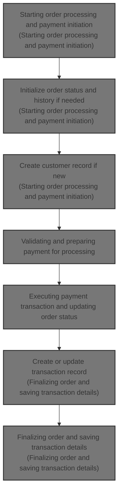
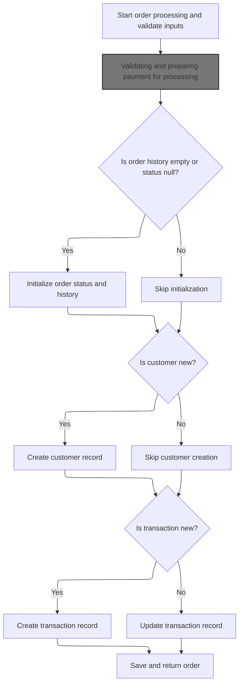
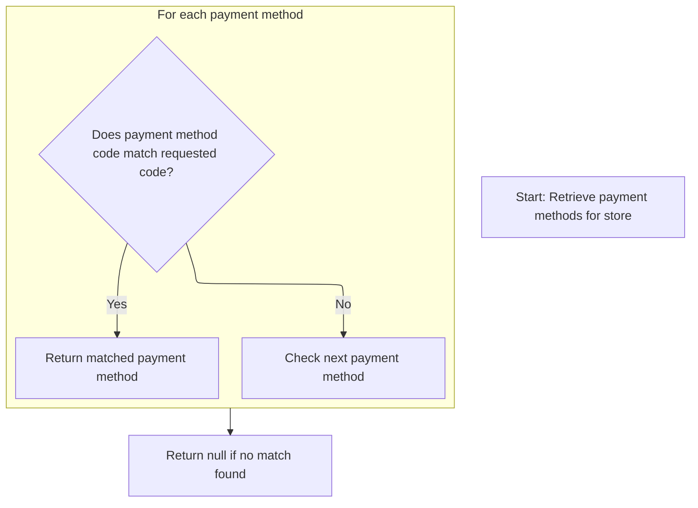

This document describes the flow of processing an order within the e-commerce platform. It starts with order initiation and input validation, continues with payment method selection and validation, executes the payment transaction, and finalizes the order by updating order status and transaction records.



# Starting order processing and payment initiation



This section handles the start of order processing and payment initiation, including input validation, order and customer record initialization, and transaction management.

| Category        | Rule Name                      | Description                                                                                                                                                             |
| --------------- | ------------------------------ | ----------------------------------------------------------------------------------------------------------------------------------------------------------------------- |
| Data validation | Mandatory input validation     | All inputs including order, customer, shopping cart items, payment, merchant store, and order total summary must be present and not null before processing can proceed. |
| Business logic  | Order history initialization   | If the order history is empty or the order status is null, the system must initialize the order status and history before proceeding.                                   |
| Business logic  | Customer record creation       | If the customer is identified as new, a new customer record must be created in the system before processing the order.                                                  |
| Business logic  | Transaction record management  | If the transaction is new, a new transaction record must be created; otherwise, the existing transaction record should be updated.                                      |
| Business logic  | Payment processing requirement | Payment must be processed through the payment service before the order can be finalized and saved.                                                                      |

<SwmSnippet path="/shopizer/sm-core/src/main/java/com/salesmanager/core/business/order/service/OrderServiceImpl.java" line="105">

---

We validate inputs and then call the payment service to process the payment

```java
    private Order process(Order order, Customer customer, List<ShoppingCartItem> items, OrderTotalSummary summary, Payment payment, Transaction transaction, MerchantStore store) throws ServiceException {
    	
    	
    	Validate.notNull(order, "Order cannot be null");
    	Validate.notNull(customer, "Customer cannot be null (even if anonymous order)");
    	Validate.notEmpty(items, "ShoppingCart items cannot be null");
    	Validate.notNull(payment, "Payment cannot be null");
    	Validate.notNull(store, "MerchantStore cannot be null");
    	Validate.notNull(summary, "Order total Summary cannot be null");
    	
    	//first process payment
    	Transaction processTransaction = paymentService.processPayment(customer, store, payment, items, order);
```

---

</SwmSnippet>

## Validating and preparing payment for processing

This section validates payment inputs, checks payment module configuration and status, sets transaction type, validates credit card details if applicable, and prepares the payment module for processing.

| Category        | Rule Name                             | Description                                                                                                                                    |
| --------------- | ------------------------------------- | ---------------------------------------------------------------------------------------------------------------------------------------------- |
| Data validation | Mandatory payment inputs              | All payment inputs including customer, store, payment, order, and order total must be present and not null before processing.                  |
| Data validation | Payment module configuration required | At least one payment module must be configured for the store; otherwise, payment processing cannot proceed.                                    |
| Data validation | Active payment module required        | The payment module specified in the payment details must be configured and active for the store.                                               |
| Data validation | Credit card validation                | If the payment is a credit card payment, the credit card number, card details, expiration month, and year must be validated before processing. |
| Data validation | Payment module existence              | The payment module instance must exist in the system before attempting to process the payment.                                                 |
| Business logic  | Currency alignment                    | The payment currency must be set to the store's currency before processing the payment.                                                        |
| Business logic  | Default transaction type              | If the payment module configuration does not specify a transaction type, the default transaction type is AUTHORIZECAPTURE.                     |
| Business logic  | Transaction type setting              | The transaction type for the payment must be set to either AUTHORIZE or AUTHORIZECAPTURE based on the payment module configuration.            |

<SwmSnippet path="/shopizer/sm-core/src/main/java/com/salesmanager/core/business/payments/service/PaymentServiceImpl.java" line="296">

---

In this part, we validate all inputs again and check that the payment module is configured and active for the store. We set the transaction type based on configuration and validate credit card details if applicable. Then, we prepare to get the payment module to actually process the payment.

```java
	public Transaction processPayment(Customer customer,
			MerchantStore store, Payment payment, List<ShoppingCartItem> items, Order order)
			throws ServiceException {


		Validate.notNull(customer);
		Validate.notNull(store);
		Validate.notNull(payment);
		Validate.notNull(order);
		Validate.notNull(order.getTotal());
		
		payment.setCurrency(store.getCurrency());
		
		BigDecimal amount = order.getTotal();

		//must have a shipping module configured
		Map<String, IntegrationConfiguration> modules = this.getPaymentModulesConfigured(store);
		if(modules==null){
			throw new ServiceException("No payment module configured");
		}
		
		IntegrationConfiguration configuration = modules.get(payment.getModuleName());
		
		if(configuration==null) {
			throw new ServiceException("Payment module " + payment.getModuleName() + " is not configured");
		}
		
		if(!configuration.isActive()) {
			throw new ServiceException("Payment module " + payment.getModuleName() + " is not active");
		}
		
		String sTransactionType = configuration.getIntegrationKeys().get("transaction");
		if(sTransactionType==null) {
			sTransactionType = TransactionType.AUTHORIZECAPTURE.name();
		}
		

		if(sTransactionType.equals(TransactionType.AUTHORIZE.name())) {
			payment.setTransactionType(TransactionType.AUTHORIZE);
		} else {
			payment.setTransactionType(TransactionType.AUTHORIZECAPTURE);
		} 
		

		PaymentModule module = this.paymentModules.get(payment.getModuleName());
		
		if(module==null) {
			throw new ServiceException("Payment module " + payment.getModuleName() + " does not exist");
		}
		
		if(payment instanceof CreditCardPayment) {
			CreditCardPayment creditCardPayment = (CreditCardPayment)payment;
			validateCreditCard(creditCardPayment.getCreditCardNumber(),creditCardPayment.getCreditCard(),creditCardPayment.getExpirationMonth(),creditCardPayment.getExpirationYear());
		}
		
		IntegrationModule integrationModule = getPaymentMethodByCode(store,payment.getModuleName());
```

---

</SwmSnippet>

### Retrieving the payment method details by code



This section describes the process of retrieving a payment method by its unique code from a list of payment methods available for a store.

| Category       | Rule Name                      | Description                                                                                                               |
| -------------- | ------------------------------ | ------------------------------------------------------------------------------------------------------------------------- |
| Business logic | Unique payment method code     | Each payment method is identified by a unique code within the context of a store.                                         |
| Business logic | Return matching payment method | When a payment method code matches the requested code, the corresponding payment method details are returned immediately. |
| Business logic | Return null if no match        | If no payment method matches the requested code, the system returns null indicating the payment method is not available.  |

<SwmSnippet path="/shopizer/sm-core/src/main/java/com/salesmanager/core/business/payments/service/PaymentServiceImpl.java" line="147">

---

We fetch all payment methods and pick the one matching the code or return null if not found.

```java
	public IntegrationModule getPaymentMethodByCode(MerchantStore store,
			String code) throws ServiceException {
		List<IntegrationModule> modules =  getPaymentMethods(store);

		for(IntegrationModule module : modules) {
			if(module.getCode().equals(code)) {
				
				return module;
			}
		}
		
		return null;
	}
```

---

</SwmSnippet>

### Listing all payment methods for the store

This section lists all available payment methods for the store, enabling customers to choose their preferred payment option during checkout.

| Category       | Rule Name                        | Description                                                                                                            |
| -------------- | -------------------------------- | ---------------------------------------------------------------------------------------------------------------------- |
| Business logic | Active payment methods only      | Only payment methods that are marked as active and enabled for the store should be listed to customers.                |
| Business logic | Store-specific payment methods   | Payment methods listed must be applicable to the specific store or sales channel the customer is shopping in.          |
| Business logic | Display payment method details   | Each payment method listed should display its name and a brief description to help customers understand their options. |
| Business logic | Exclude inactive payment methods | Payment methods that are inactive or disabled should not appear in the list to prevent customer selection errors.      |

See <SwmLink doc-title="Selecting payment methods by store region">[Selecting payment methods by store region](\.swm\selecting-payment-methods-by-store-region.mvvhaay2.sw.md)</SwmLink>

### Executing payment transaction and updating order status

```mermaid
%%{init: {"flowchart": {"defaultRenderer": "elk"}} }%%
flowchart TD
    node1["Start processPayment"] --> node2{"Is transaction type provided?"}
    click node1 openCode "shopizer/sm-core/src/main/java/com/salesmanager/core/business/payments/service/PaymentServiceImpl.java:352:353"
    node2 -->|"No"| node3["Use payment's transaction type"]
    click node2 openCode "shopizer/sm-core/src/main/java/com/salesmanager/core/business/payments/service/PaymentServiceImpl.java:353:355"
    node3 --> node4{"Is transaction type CAPTURE?"}
    click node3 openCode "shopizer/sm-core/src/main/java/com/salesmanager/core/business/payments/service/PaymentServiceImpl.java:355:357"
    node4 -->|"Yes"| node5["Reject capture transaction - use processCapturePayment"]
    click node4 openCode "shopizer/sm-core/src/main/java/com/salesmanager/core/business/payments/service/PaymentServiceImpl.java:356:357"
    node4 -->|"No"| node6["Perform payment operation based on transaction type"]
    node2 -->|"Yes"| node6
    
    node6 --> node7{"Transaction type?"}
    click node6 openCode "shopizer/sm-core/src/main/java/com/salesmanager/core/business/payments/service/PaymentServiceImpl.java:361:367"
    node7 -->|"AUTHORIZE"| node8["Authorize payment"]
    click node7 openCode "shopizer/sm-core/src/main/java/com/salesmanager/core/business/payments/service/PaymentServiceImpl.java:361:362"
    node7 -->|"AUTHORIZECAPTURE"| node9["Authorize and capture payment"]
    click node7 openCode "shopizer/sm-core/src/main/java/com/salesmanager/core/business/payments/service/PaymentServiceImpl.java:363:364"
    node7 -->|"INIT"| node10["Initialize transaction"]
    click node7 openCode "shopizer/sm-core/src/main/java/com/salesmanager/core/business/payments/service/PaymentServiceImpl.java:365:366"
    
    node8 --> node11["Save transaction"]
    click node8 openCode "shopizer/sm-core/src/main/java/com/salesmanager/core/business/payments/service/PaymentServiceImpl.java:361:362"
    node9 --> node11
    click node9 openCode "shopizer/sm-core/src/main/java/com/salesmanager/core/business/payments/service/PaymentServiceImpl.java:363:364"
    node10 --> node11
    click node10 openCode "shopizer/sm-core/src/main/java/com/salesmanager/core/business/payments/service/PaymentServiceImpl.java:365:366"
    
    node11 --> node12{"Is transaction type AUTHORIZECAPTURE?"}
    click node11 openCode "shopizer/sm-core/src/main/java/com/salesmanager/core/business/payments/service/PaymentServiceImpl.java:370:372"
    node12 -->|"Yes"| node13["Set order status to ORDERED"]
    click node12 openCode "shopizer/sm-core/src/main/java/com/salesmanager/core/business/payments/service/PaymentServiceImpl.java:374:375"
    node12 -->|"No"| node15["Return transaction"]
    
    node13 --> node14{"Is payment type MONEYORDER?"}
    click node13 openCode "shopizer/sm-core/src/main/java/com/salesmanager/core/business/payments/service/PaymentServiceImpl.java:376:378"
    node14 -->|"No"| node15["Set order status to PROCESSED"]
    node14 -->|"Yes"| node15
    node15 --> node16["Return transaction"]
    click node14 openCode "shopizer/sm-core/src/main/java/com/salesmanager/core/business/payments/service/PaymentServiceImpl.java:376:378"
    click node15 openCode "shopizer/sm-core/src/main/java/com/salesmanager/core/business/payments/service/PaymentServiceImpl.java:381:382"
    
    node5 --> node16
    click node5 openCode "shopizer/sm-core/src/main/java/com/salesmanager/core/business/payments/service/PaymentServiceImpl.java:356:357"
classDef HeadingStyle fill:#777777,stroke:#333,stroke-width:2px;
```



<SwmSnippet path="/shopizer/sm-core/src/main/java/com/salesmanager/core/business/payments/service/PaymentServiceImpl.java" line="352">

---

After getting the payment method, we determine the transaction type and call the appropriate payment module method to process the payment. We save the transaction unless it's an INIT type and update the order status based on the payment type and transaction outcome.

```java
		TransactionType transactionType = TransactionType.valueOf(sTransactionType);
		if(transactionType==null) {
			transactionType = payment.getTransactionType();
			if(transactionType.equals(TransactionType.CAPTURE.name())) {
				throw new ServiceException("This method does not allow to process capture transaction. Use processCapturePayment");
			}
		}
		
		Transaction transaction = null;
		if(transactionType == TransactionType.AUTHORIZE)  {
			transaction = module.authorize(store, customer, items, amount, payment, configuration, integrationModule);
		} else if(transactionType == TransactionType.AUTHORIZECAPTURE)  {
			transaction = module.authorizeAndCapture(store, customer, items, amount, payment, configuration, integrationModule);
		} else if(transactionType == TransactionType.INIT)  {
			transaction = module.initTransaction(store, customer, amount, payment, configuration, integrationModule);
		}


		if(transactionType != TransactionType.INIT) {
			transactionService.create(transaction);
		}
		
		if(transactionType == TransactionType.AUTHORIZECAPTURE)  {
			order.setStatus(OrderStatus.ORDERED);
			if(payment.getPaymentType().name()!=PaymentType.MONEYORDER.name()) {
				order.setStatus(OrderStatus.PROCESSED);
			}
		}

		return transaction;

		

	}
```

---

</SwmSnippet>

## Finalizing order and saving transaction details

```mermaid
%%{init: {"flowchart": {"defaultRenderer": "elk"}} }%%
flowchart TD
    node1["Start order processing"] --> node2{"Is order history empty or status null?"}
    click node1 openCode "shopizer/sm-core/src/main/java/com/salesmanager/core/business/order/service/OrderServiceImpl.java:117:118"
    node2 -->|"Yes"| node3["Initialize order status and history"]
    click node2 openCode "shopizer/sm-core/src/main/java/com/salesmanager/core/business/order/service/OrderServiceImpl.java:119:133"
    node2 -->|"No"| node4["Skip initialization"]
    click node4 openCode "shopizer/sm-core/src/main/java/com/salesmanager/core/business/order/service/OrderServiceImpl.java:134:134"
    node3 --> node4
    node4 --> node5{"Is customer new?"}
    click node5 openCode "shopizer/sm-core/src/main/java/com/salesmanager/core/business/order/service/OrderServiceImpl.java:135:137"
    node5 -->|"Yes"| node6["Create customer"]
    click node6 openCode "shopizer/sm-core/src/main/java/com/salesmanager/core/business/order/service/OrderServiceImpl.java:136:137"
    node5 -->|"No"| node7["Skip customer creation"]
    click node7 openCode "shopizer/sm-core/src/main/java/com/salesmanager/core/business/order/service/OrderServiceImpl.java:138:138"
    node6 --> node7
    node7 --> node8["Save order"]
    click node8 openCode "shopizer/sm-core/src/main/java/com/salesmanager/core/business/order/service/OrderServiceImpl.java:141:141"
    node8 --> node9{"Is transaction present?"}
    click node9 openCode "shopizer/sm-core/src/main/java/com/salesmanager/core/business/order/service/OrderServiceImpl.java:143:143"
    node9 -->|"Yes"| node10{"Is transaction new?"}
    click node10 openCode "shopizer/sm-core/src/main/java/com/salesmanager/core/business/order/service/OrderServiceImpl.java:144:149"
    node10 -->|"Yes"| node11["Create transaction"]
    click node11 openCode "shopizer/sm-core/src/main/java/com/salesmanager/core/business/order/service/OrderServiceImpl.java:146:146"
    node10 -->|"No"| node12["Update transaction"]
    click node12 openCode "shopizer/sm-core/src/main/java/com/salesmanager/core/business/order/service/OrderServiceImpl.java:148:149"
    node9 -->|"No"| node13["Skip transaction"]
    click node13 openCode "shopizer/sm-core/src/main/java/com/salesmanager/core/business/order/service/OrderServiceImpl.java:150:150"
    node11 --> node13
    node12 --> node13
    node13 --> node14{"Is processTransaction present?"}
    click node14 openCode "shopizer/sm-core/src/main/java/com/salesmanager/core/business/order/service/OrderServiceImpl.java:152:152"
    node14 -->|"Yes"| node15{"Is processTransaction new?"}
    click node15 openCode "shopizer/sm-core/src/main/java/com/salesmanager/core/business/order/service/OrderServiceImpl.java:153:158"
    node15 -->|"Yes"| node16["Create processTransaction"]
    click node16 openCode "shopizer/sm-core/src/main/java/com/salesmanager/core/business/order/service/OrderServiceImpl.java:155:155"
    node15 -->|"No"| node17["Update processTransaction"]
    click node17 openCode "shopizer/sm-core/src/main/java/com/salesmanager/core/business/order/service/OrderServiceImpl.java:157:158"
    node14 -->|"No"| node18["Skip processTransaction"]
    click node18 openCode "shopizer/sm-core/src/main/java/com/salesmanager/core/business/order/service/OrderServiceImpl.java:159:159"
    node16 --> node18
    node17 --> node18
    node18 --> node19["Return order"]
    click node19 openCode "shopizer/sm-core/src/main/java/com/salesmanager/core/business/order/service/OrderServiceImpl.java:161:161"
classDef HeadingStyle fill:#777777,stroke:#333,stroke-width:2px;
```



<SwmSnippet path="/shopizer/sm-core/src/main/java/com/salesmanager/core/business/order/service/OrderServiceImpl.java" line="117">

---

We update order history and status, create customer if needed, save order, and persist transactions.

```java
    	//transactionService.save(processTransaction);
    	
    	if(order.getOrderHistory()==null || order.getOrderHistory().size()==0 || order.getStatus()==null) {
    		OrderStatus status = order.getStatus();
    		if(status==null) {
    			status = OrderStatus.ORDERED;
    			order.setStatus(status);
    		}
    		Set<OrderStatusHistory> statusHistorySet = new HashSet<OrderStatusHistory>();
    		OrderStatusHistory statusHistory = new OrderStatusHistory();
    		statusHistory.setStatus(status);
    		statusHistory.setDateAdded(new Date());
    		statusHistory.setOrder(order);
    		statusHistorySet.add(statusHistory);
    		order.setOrderHistory(statusHistorySet);
    		
    	}
    	
    	if(customer.getId()==null || customer.getId()==0) {
    		customerService.create(customer);
    	}
    	
    	order.setCustomerId(customer.getId());
    	
    	this.create(order);

    	if(transaction!=null) {
    		transaction.setOrder(order);
    		if(transaction.getId()==null || transaction.getId()==0) {
    			transactionService.create(transaction);
    		} else {
    			transactionService.update(transaction);
    		}
    	}
    	
    	if(processTransaction!=null) {
    		processTransaction.setOrder(order);
    		if(processTransaction.getId()==null || processTransaction.getId()==0) {
    			transactionService.create(processTransaction);
    		} else {
    			transactionService.update(processTransaction);
    		}
    	}
    	
    	return order;
    	
    	
    }
```

---

</SwmSnippet>

&nbsp;

*This is an auto-generated document by Swimm 🌊 and has not yet been verified by a human*

<SwmMeta version="3.0.0" repo-id="Z2l0aHViJTNBJTNBU2hvcGl6ZXIlM0ElM0F1bWFsaW5nYXN3YW1p" repo-name="Shopizer"><sup>Powered by [Swimm](https://app.swimm.io/)</sup></SwmMeta>
