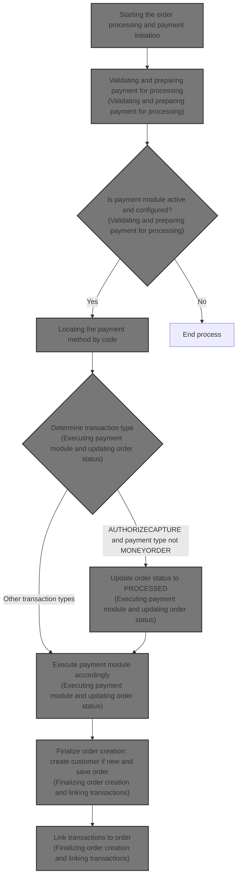
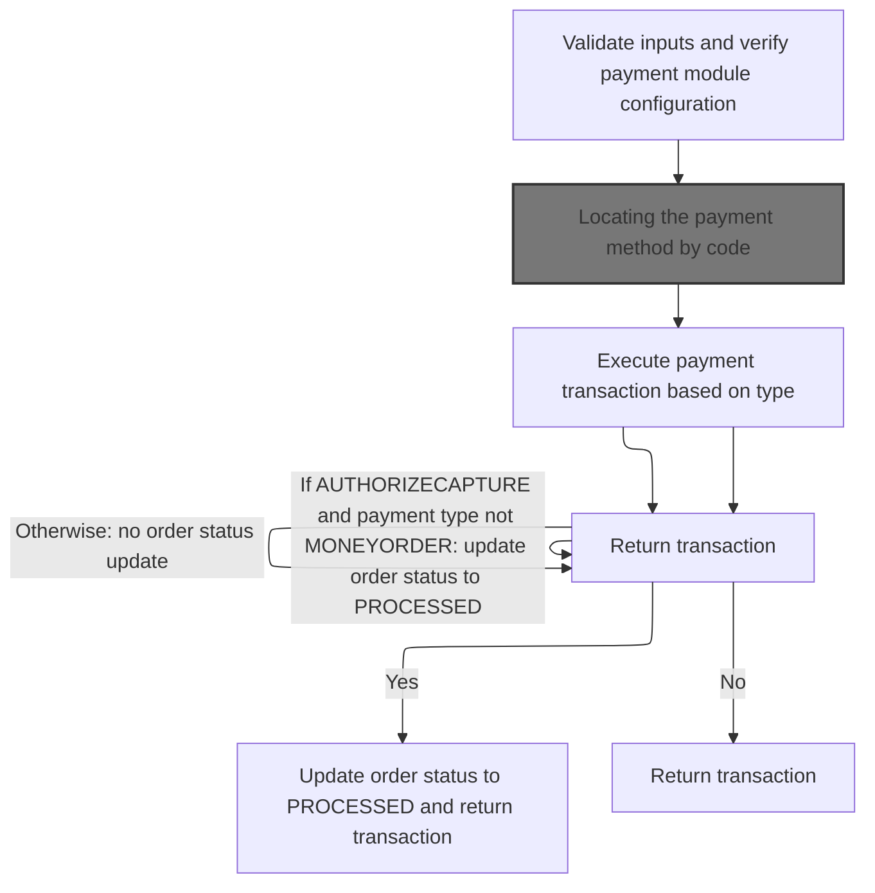
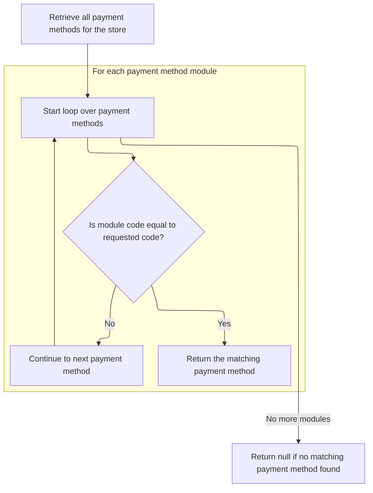

This document explains the flow of processing an order including validating inputs, processing payment through the configured payment module, updating order status based on payment transaction type, and finalizing the order by saving it and linking transactions. The flow receives order, customer, payment, and store data as input and outputs the finalized order with updated status and linked transactions.



# Starting the order processing and payment initiation

This section handles the start of order processing by validating inputs and initiating payment processing through the payment service.

| Category        | Rule Name                    | Description                                                                                   |
| --------------- | ---------------------------- | --------------------------------------------------------------------------------------------- |
| Data validation | Order must exist             | The order must not be null to proceed with processing.                                        |
| Data validation | Customer must exist          | The customer must not be null, even if the order is anonymous.                                |
| Data validation | Shopping cart items required | The shopping cart items list must not be empty or null.                                       |
| Data validation | Payment details required     | Payment details must be provided and not null.                                                |
| Data validation | Merchant store required      | Merchant store information must be provided and not null.                                     |
| Data validation | Order total summary required | Order total summary must be provided and not null.                                            |
| Business logic  | Initiate payment processing  | Payment processing must be initiated through the payment service before completing the order. |

<SwmSnippet path="/shopizer/sm-core/src/main/java/com/salesmanager/core/business/order/service/OrderServiceImpl.java" line="105">

---

We start by validating inputs and then call the payment service to handle payment processing

```java
    private Order process(Order order, Customer customer, List<ShoppingCartItem> items, OrderTotalSummary summary, Payment payment, Transaction transaction, MerchantStore store) throws ServiceException {
    	
    	
    	Validate.notNull(order, "Order cannot be null");
    	Validate.notNull(customer, "Customer cannot be null (even if anonymous order)");
    	Validate.notEmpty(items, "ShoppingCart items cannot be null");
    	Validate.notNull(payment, "Payment cannot be null");
    	Validate.notNull(store, "MerchantStore cannot be null");
    	Validate.notNull(summary, "Order total Summary cannot be null");
    	
    	//first process payment
    	Transaction processTransaction = paymentService.processPayment(customer, store, payment, items, order);
```

---

</SwmSnippet>

## Validating and preparing payment for processing



This section handles validating payment inputs and preparing the payment for processing by verifying the payment module configuration and executing the payment transaction.

| Category        | Rule Name                      | Description                                                                                                                                                 |
| --------------- | ------------------------------ | ----------------------------------------------------------------------------------------------------------------------------------------------------------- |
| Data validation | Mandatory payment inputs       | All payment inputs including customer, store, payment, order, and order total must be present and not null before processing.                               |
| Data validation | Active payment module required | The payment module specified in the payment details must be configured and active in the merchant store before processing.                                  |
| Data validation | Credit card validation         | For credit card payments, the credit card details must be validated before proceeding with the payment transaction.                                         |
| Business logic  | Default transaction type       | If the payment module configuration does not specify a transaction type, the default transaction type AUTHORIZECAPTURE is used.                             |
| Business logic  | Order status update on capture | If the transaction type is AUTHORIZECAPTURE and the payment type is not MONEYORDER, the order status must be updated to PROCESSED after successful payment. |

<SwmSnippet path="/shopizer/sm-core/src/main/java/com/salesmanager/core/business/payments/service/PaymentServiceImpl.java" line="296">

---

In `processPayment` we first validate inputs, then check the store's payment modules to find the one matching the payment's module name. We verify it's active and exists. We then determine the transaction type from the module config, defaulting to AUTHORIZECAPTURE if missing, and set it on the payment. If it's a credit card payment, we validate the card details here before proceeding.

```java
	public Transaction processPayment(Customer customer,
			MerchantStore store, Payment payment, List<ShoppingCartItem> items, Order order)
			throws ServiceException {


		Validate.notNull(customer);
		Validate.notNull(store);
		Validate.notNull(payment);
		Validate.notNull(order);
		Validate.notNull(order.getTotal());
		
		payment.setCurrency(store.getCurrency());
		
		BigDecimal amount = order.getTotal();

		//must have a shipping module configured
		Map<String, IntegrationConfiguration> modules = this.getPaymentModulesConfigured(store);
		if(modules==null){
			throw new ServiceException("No payment module configured");
		}
		
		IntegrationConfiguration configuration = modules.get(payment.getModuleName());
		
		if(configuration==null) {
			throw new ServiceException("Payment module " + payment.getModuleName() + " is not configured");
		}
		
		if(!configuration.isActive()) {
			throw new ServiceException("Payment module " + payment.getModuleName() + " is not active");
		}
		
		String sTransactionType = configuration.getIntegrationKeys().get("transaction");
		if(sTransactionType==null) {
			sTransactionType = TransactionType.AUTHORIZECAPTURE.name();
		}
		

		if(sTransactionType.equals(TransactionType.AUTHORIZE.name())) {
			payment.setTransactionType(TransactionType.AUTHORIZE);
		} else {
			payment.setTransactionType(TransactionType.AUTHORIZECAPTURE);
		} 
		

		PaymentModule module = this.paymentModules.get(payment.getModuleName());
		
		if(module==null) {
			throw new ServiceException("Payment module " + payment.getModuleName() + " does not exist");
		}
		
		if(payment instanceof CreditCardPayment) {
			CreditCardPayment creditCardPayment = (CreditCardPayment)payment;
			validateCreditCard(creditCardPayment.getCreditCardNumber(),creditCardPayment.getCreditCard(),creditCardPayment.getExpirationMonth(),creditCardPayment.getExpirationYear());
		}
		
		IntegrationModule integrationModule = getPaymentMethodByCode(store,payment.getModuleName());
```

---

</SwmSnippet>

### Locating the payment method by code



This section describes the process of locating and returning a payment method by its unique code from the store's list of payment methods.

| Category       | Rule Name                        | Description                                                                                                                       |
| -------------- | -------------------------------- | --------------------------------------------------------------------------------------------------------------------------------- |
| Business logic | Exact code match                 | The system must return the payment method that exactly matches the provided code from the store's list of payment methods.        |
| Business logic | Return null if no match          | If no payment method matches the provided code, the system must return null indicating no available payment method for that code. |
| Business logic | Search all store payment methods | The search for the payment method must be performed over all payment methods available for the given store.                       |

<SwmSnippet path="/shopizer/sm-core/src/main/java/com/salesmanager/core/business/payments/service/PaymentServiceImpl.java" line="147">

---

It finds and returns the payment method matching the code from the store's list.

```java
	public IntegrationModule getPaymentMethodByCode(MerchantStore store,
			String code) throws ServiceException {
		List<IntegrationModule> modules =  getPaymentMethods(store);

		for(IntegrationModule module : modules) {
			if(module.getCode().equals(code)) {
				
				return module;
			}
		}
		
		return null;
	}
```

---

</SwmSnippet>

### Retrieving all payment methods for the store

This section is responsible for retrieving all payment methods available for the store.

| Category       | Rule Name                           | Description                                                                                                                                      |
| -------------- | ----------------------------------- | ------------------------------------------------------------------------------------------------------------------------------------------------ |
| Business logic | Active payment methods only         | The system must retrieve all payment methods that are currently active and available for the store.                                              |
| Business logic | Payment method details completeness | Each payment method retrieved must include necessary details such as payment method name and identifier to be displayed or used in transactions. |

See <SwmLink doc-title="Retrieving payment methods by store region">[Retrieving payment methods by store region](\.swm\retrieving-payment-methods-by-store-region.nsl9zd7r.sw.md)</SwmLink>

### Executing payment module and updating order status

```mermaid
%%{init: {"flowchart": {"defaultRenderer": "elk"}} }%%
flowchart TD
    node1["Start processPayment"] --> node2{"Is transactionType null?"}
    node2 -->|"Yes"| node3["Set transactionType from payment"]
    node2 -->|"No"| node4{"Is transactionType CAPTURE?"}
    node3 --> node4
    node4 -->|"Yes"| node5["Throw exception: Use processCapturePayment"]
    node4 -->|"No"| node6{"Transaction type?"}
    node6 -->|"AUTHORIZE"| node7["Authorize payment"]
    node6 -->|"AUTHORIZECAPTURE"| node8["Authorize and capture payment"]
    node6 -->|"INIT"| node9["Init transaction"]
    node7 --> node10{"Is transactionType not INIT?"}
    node8 --> node10
    node9 --> node10
    node10 -->|"Yes"| node11["Record transaction"]
    node10 -->|"No"| node17["Return transaction"]
    node11 --> node13{"Is transactionType AUTHORIZECAPTURE?"}
    node13 -->|"Yes"| node14["Set order status to ORDERED"]
    node13 -->|"No"| node17
    node14 --> node16{"Is paymentType not MONEYORDER?"}
    node16 -->|"Yes"| node18["Set order status to PROCESSED"]
    node16 -->|"No"| node17
    node18 --> node17
    node5 --> node17

    click node1 openCode "shopizer/sm-core/src/main/java/com/salesmanager/core/business/payments/service/PaymentServiceImpl.java:352:353"
    click node2 openCode "shopizer/sm-core/src/main/java/com/salesmanager/core/business/payments/service/PaymentServiceImpl.java:352:354"
    click node3 openCode "shopizer/sm-core/src/main/java/com/salesmanager/core/business/payments/service/PaymentServiceImpl.java:353:355"
    click node4 openCode "shopizer/sm-core/src/main/java/com/salesmanager/core/business/payments/service/PaymentServiceImpl.java:354:357"
    click node5 openCode "shopizer/sm-core/src/main/java/com/salesmanager/core/business/payments/service/PaymentServiceImpl.java:356:357"
    click node6 openCode "shopizer/sm-core/src/main/java/com/salesmanager/core/business/payments/service/PaymentServiceImpl.java:361:367"
    click node7 openCode "shopizer/sm-core/src/main/java/com/salesmanager/core/business/payments/service/PaymentServiceImpl.java:362:363"
    click node8 openCode "shopizer/sm-core/src/main/java/com/salesmanager/core/business/payments/service/PaymentServiceImpl.java:364:365"
    click node9 openCode "shopizer/sm-core/src/main/java/com/salesmanager/core/business/payments/service/PaymentServiceImpl.java:366:367"
    click node10 openCode "shopizer/sm-core/src/main/java/com/salesmanager/core/business/payments/service/PaymentServiceImpl.java:370:372"
    click node11 openCode "shopizer/sm-core/src/main/java/com/salesmanager/core/business/payments/service/PaymentServiceImpl.java:371:372"
    click node13 openCode "shopizer/sm-core/src/main/java/com/salesmanager/core/business/payments/service/PaymentServiceImpl.java:374:379"
    click node14 openCode "shopizer/sm-core/src/main/java/com/salesmanager/core/business/payments/service/PaymentServiceImpl.java:375:376"
    click node16 openCode "shopizer/sm-core/src/main/java/com/salesmanager/core/business/payments/service/PaymentServiceImpl.java:376:378"
    click node18 openCode "shopizer/sm-core/src/main/java/com/salesmanager/core/business/payments/service/PaymentServiceImpl.java:377:378"
    click node17 openCode "shopizer/sm-core/src/main/java/com/salesmanager/core/business/payments/service/PaymentServiceImpl.java:381:382"
classDef HeadingStyle fill:#777777,stroke:#333,stroke-width:2px;
```



<SwmSnippet path="/shopizer/sm-core/src/main/java/com/salesmanager/core/business/payments/service/PaymentServiceImpl.java" line="352">

---

After getting the payment method by code, `processPayment` uses the transaction type to decide which payment module method to call: authorize, authorizeAndCapture, or initTransaction. It then saves the transaction if needed. If the transaction type is AUTHORIZECAPTURE, it updates the order status to ORDERED or PROCESSED depending on the payment type.

```java
		TransactionType transactionType = TransactionType.valueOf(sTransactionType);
		if(transactionType==null) {
			transactionType = payment.getTransactionType();
			if(transactionType.equals(TransactionType.CAPTURE.name())) {
				throw new ServiceException("This method does not allow to process capture transaction. Use processCapturePayment");
			}
		}
		
		Transaction transaction = null;
		if(transactionType == TransactionType.AUTHORIZE)  {
			transaction = module.authorize(store, customer, items, amount, payment, configuration, integrationModule);
		} else if(transactionType == TransactionType.AUTHORIZECAPTURE)  {
			transaction = module.authorizeAndCapture(store, customer, items, amount, payment, configuration, integrationModule);
		} else if(transactionType == TransactionType.INIT)  {
			transaction = module.initTransaction(store, customer, amount, payment, configuration, integrationModule);
		}


		if(transactionType != TransactionType.INIT) {
			transactionService.create(transaction);
		}
		
		if(transactionType == TransactionType.AUTHORIZECAPTURE)  {
			order.setStatus(OrderStatus.ORDERED);
			if(payment.getPaymentType().name()!=PaymentType.MONEYORDER.name()) {
				order.setStatus(OrderStatus.PROCESSED);
			}
		}

		return transaction;

		

	}
```

---

</SwmSnippet>

## Finalizing order creation and linking transactions

```mermaid
%%{init: {"flowchart": {"defaultRenderer": "elk"}} }%%
flowchart TD
    node1{"Order history empty or status null?"}
    node1 -->|"Yes"| node2["Initialize order status and history"]
    node1 -->|"No"| node3
    node2 --> node3
    node3 --> node4{"Is customer new?"}
    node4 -->|"Yes"| node5["Create customer"]
    node4 -->|"No"| node6
    node5 --> node6
    node6 --> node7["Save order"]
    node7 --> node8{"Transaction exists?"}
    node8 -->|"No"| node11
    node8 -->|"Yes"| node9{"Transaction is new?"}
    node9 -->|"Yes"| node10["Create transaction"]
    node9 -->|"No"| node12["Update transaction"]
    node10 --> node11
    node12 --> node11
    node11 --> node13{"ProcessTransaction exists?"}
    node13 -->|"No"| node16
    node13 -->|"Yes"| node14{"ProcessTransaction is new?"}
    node14 -->|"Yes"| node15["Create processTransaction"]
    node14 -->|"No"| node17["Update processTransaction"]
    node15 --> node16
    node17 --> node16
    node16 --> node18["Return order"]

click node1 openCode "shopizer/sm-core/src/main/java/com/salesmanager/core/business/order/service/OrderServiceImpl.java:119:133"
click node2 openCode "shopizer/sm-core/src/main/java/com/salesmanager.core/business/order/service/OrderServiceImpl.java:120:131"
click node3 openCode "shopizer/sm-core/src/main/java/com/salesmanager.core/business/order/service/OrderServiceImpl.java:133:134"
click node4 openCode "shopizer/sm-core/src/main/java/com/salesmanager.core/business/order/service/OrderServiceImpl.java:135:137"
click node5 openCode "shopizer/sm-core/src/main/java/com/salesmanager.core/business/order/service/OrderServiceImpl.java:136:137"
click node6 openCode "shopizer/sm-core/src/main/java/com/salesmanager.core/business/order/service/OrderServiceImpl.java:138:139"
click node7 openCode "shopizer/sm-core/src/main/java/com/salesmanager.core/business/order/service/OrderServiceImpl.java:141:142"
click node8 openCode "shopizer/sm-core/src/main/java/com/salesmanager.core/business/order/service/OrderServiceImpl.java:143:150"
click node9 openCode "shopizer/sm-core/src/main/java/com/salesmanager.core/business/order/service/OrderServiceImpl.java:144:149"
click node10 openCode "shopizer/sm-core/src/main/java/com/salesmanager.core/business/order/service/OrderServiceImpl.java:146:147"
click node11 openCode "shopizer/sm-core/src/main/java/com/salesmanager.core/business/order/service/OrderServiceImpl.java:150:151"
click node13 openCode "shopizer/sm-core/src/main/java/com/salesmanager.core/business/order/service/OrderServiceImpl.java:151:159"
click node14 openCode "shopizer/sm-core/src/main/java/com/salesmanager.core/business/order/service/OrderServiceImpl.java:152:159"
click node15 openCode "shopizer/sm-core/src/main/java/com/salesmanager.core/business/order/service/OrderServiceImpl.java:155:156"
click node16 openCode "shopizer/sm-core/src/main/java/com/salesmanager.core/business/order/service/OrderServiceImpl.java:159:160"
click node17 openCode "shopizer/sm-core/src/main/java/com/salesmanager.core/business/order/service/OrderServiceImpl.java:157:158"
click node18 openCode "shopizer/sm-core/src/main/java/com/salesmanager.core/business/order/service/OrderServiceImpl.java:161:162"
classDef HeadingStyle fill:#777777,stroke:#333,stroke-width:2px;
```



<SwmSnippet path="/shopizer/sm-core/src/main/java/com/salesmanager/core/business/order/service/OrderServiceImpl.java" line="117">

---

We finalize the order by setting status and history, create the customer if needed, save the order, and link transactions to it.

```java
    	//transactionService.save(processTransaction);
    	
    	if(order.getOrderHistory()==null || order.getOrderHistory().size()==0 || order.getStatus()==null) {
    		OrderStatus status = order.getStatus();
    		if(status==null) {
    			status = OrderStatus.ORDERED;
    			order.setStatus(status);
    		}
    		Set<OrderStatusHistory> statusHistorySet = new HashSet<OrderStatusHistory>();
    		OrderStatusHistory statusHistory = new OrderStatusHistory();
    		statusHistory.setStatus(status);
    		statusHistory.setDateAdded(new Date());
    		statusHistory.setOrder(order);
    		statusHistorySet.add(statusHistory);
    		order.setOrderHistory(statusHistorySet);
    		
    	}
    	
    	if(customer.getId()==null || customer.getId()==0) {
    		customerService.create(customer);
    	}
    	
    	order.setCustomerId(customer.getId());
    	
    	this.create(order);

    	if(transaction!=null) {
    		transaction.setOrder(order);
    		if(transaction.getId()==null || transaction.getId()==0) {
    			transactionService.create(transaction);
    		} else {
    			transactionService.update(transaction);
    		}
    	}
    	
    	if(processTransaction!=null) {
    		processTransaction.setOrder(order);
    		if(processTransaction.getId()==null || processTransaction.getId()==0) {
    			transactionService.create(processTransaction);
    		} else {
    			transactionService.update(processTransaction);
    		}
    	}
    	
    	return order;
    	
    	
    }
```

---

</SwmSnippet>

&nbsp;

*This is an auto-generated document by Swimm 🌊 and has not yet been verified by a human*

<SwmMeta version="3.0.0" repo-id="Z2l0aHViJTNBJTNBU2hvcGl6ZXIlM0ElM0F1bWFsaW5nYXN3YW1p" repo-name="Shopizer"><sup>Powered by [Swimm](https://app.swimm.io/)</sup></SwmMeta>
