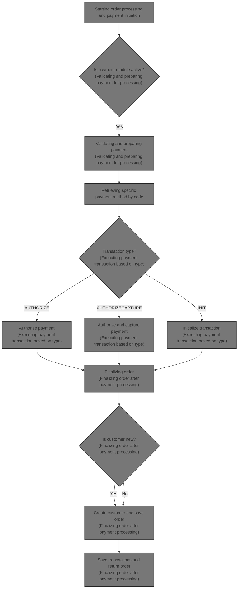
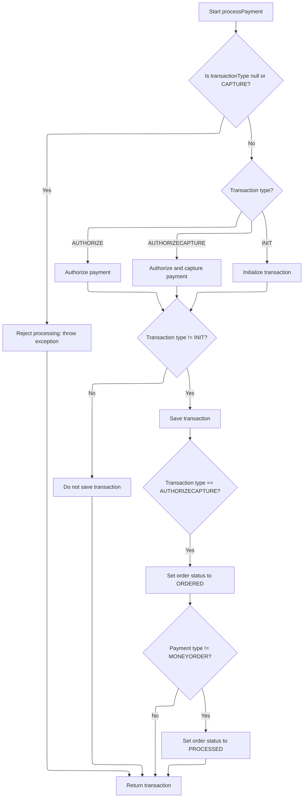

This document explains the flow of processing an order including payment initiation, validation, execution, and finalizing the order with updated status. It receives order details and returns the processed order with payment transaction and updated status. This flow manages the core business logic of order and payment handling in the e-commerce platform.



# Starting order processing and payment initiation

This section handles the starting of order processing and payment initiation by validating inputs and delegating payment processing to the PaymentServiceImpl.

| Category        | Rule Name                     | Description                                                                                                          |
| --------------- | ----------------------------- | -------------------------------------------------------------------------------------------------------------------- |
| Data validation | Order presence                | An order must be provided and cannot be null to proceed with processing.                                             |
| Data validation | Customer information required | Customer information must be present even for anonymous orders to ensure proper association with the order.          |
| Data validation | Non-empty shopping cart       | The shopping cart must contain at least one item; empty carts are not allowed for order processing.                  |
| Data validation | Payment information required  | Payment information must be provided and valid to initiate payment processing.                                       |
| Data validation | Merchant store association    | Merchant store information must be present to associate the order with the correct store.                            |
| Data validation | Order total summary required  | Order total summary must be provided to ensure accurate calculation and validation of order totals.                  |
| Business logic  | Delegated payment processing  | Payment processing must be delegated to a dedicated payment service to handle the transaction securely and reliably. |

<SwmSnippet path="/shopizer/sm-core/src/main/java/com/salesmanager/core/business/order/service/OrderServiceImpl.java" line="105">

---

We validate inputs and then delegate payment processing to PaymentServiceImpl.processPayment to handle the payment transaction.

```java
    private Order process(Order order, Customer customer, List<ShoppingCartItem> items, OrderTotalSummary summary, Payment payment, Transaction transaction, MerchantStore store) throws ServiceException {
    	
    	
    	Validate.notNull(order, "Order cannot be null");
    	Validate.notNull(customer, "Customer cannot be null (even if anonymous order)");
    	Validate.notEmpty(items, "ShoppingCart items cannot be null");
    	Validate.notNull(payment, "Payment cannot be null");
    	Validate.notNull(store, "MerchantStore cannot be null");
    	Validate.notNull(summary, "Order total Summary cannot be null");
    	
    	//first process payment
    	Transaction processTransaction = paymentService.processPayment(customer, store, payment, items, order);
```

---

</SwmSnippet>

## Validating and preparing payment for processing

This section handles the validation and preparation of payment data before processing a payment transaction in the e-commerce platform.

| Category        | Rule Name                      | Description                                                                                                                                   |
| --------------- | ------------------------------ | --------------------------------------------------------------------------------------------------------------------------------------------- |
| Data validation | Mandatory Input Validation     | All payment processing inputs including customer, store, payment, order, and order total must be present and not null before proceeding.      |
| Data validation | Active Payment Module Required | The payment module requested for processing must be configured for the store and must be active to be used for payment processing.            |
| Data validation | Credit Card Validation         | If the payment method is a credit card, the credit card number, card details, expiration month, and year must be validated before processing. |
| Data validation | Payment Module Existence       | The payment module requested must exist in the system's payment modules registry to proceed with payment processing.                          |
| Business logic  | Default Transaction Type       | If no transaction type is specified in the payment module configuration, the transaction type defaults to AUTHORIZECAPTURE.                   |

<SwmSnippet path="/shopizer/sm-core/src/main/java/com/salesmanager/core/business/payments/service/PaymentServiceImpl.java" line="296">

---

In PaymentServiceImpl.processPayment, we first validate all the inputs again to be sure everything needed for payment is present. Then, we check the payment modules configured for the store and confirm the requested payment module is active and valid. After that, we prepare the payment transaction type and validate credit card details if needed. Finally, we call getPaymentMethodByCode to fetch detailed info about the payment method, which is needed to proceed with the payment.

```java
	public Transaction processPayment(Customer customer,
			MerchantStore store, Payment payment, List<ShoppingCartItem> items, Order order)
			throws ServiceException {


		Validate.notNull(customer);
		Validate.notNull(store);
		Validate.notNull(payment);
		Validate.notNull(order);
		Validate.notNull(order.getTotal());
		
		payment.setCurrency(store.getCurrency());
		
		BigDecimal amount = order.getTotal();

		//must have a shipping module configured
		Map<String, IntegrationConfiguration> modules = this.getPaymentModulesConfigured(store);
		if(modules==null){
			throw new ServiceException("No payment module configured");
		}
		
		IntegrationConfiguration configuration = modules.get(payment.getModuleName());
		
		if(configuration==null) {
			throw new ServiceException("Payment module " + payment.getModuleName() + " is not configured");
		}
		
		if(!configuration.isActive()) {
			throw new ServiceException("Payment module " + payment.getModuleName() + " is not active");
		}
		
		String sTransactionType = configuration.getIntegrationKeys().get("transaction");
		if(sTransactionType==null) {
			sTransactionType = TransactionType.AUTHORIZECAPTURE.name();
		}
		

		if(sTransactionType.equals(TransactionType.AUTHORIZE.name())) {
			payment.setTransactionType(TransactionType.AUTHORIZE);
		} else {
			payment.setTransactionType(TransactionType.AUTHORIZECAPTURE);
		} 
		

		PaymentModule module = this.paymentModules.get(payment.getModuleName());
		
		if(module==null) {
			throw new ServiceException("Payment module " + payment.getModuleName() + " does not exist");
		}
		
		if(payment instanceof CreditCardPayment) {
			CreditCardPayment creditCardPayment = (CreditCardPayment)payment;
			validateCreditCard(creditCardPayment.getCreditCardNumber(),creditCardPayment.getCreditCard(),creditCardPayment.getExpirationMonth(),creditCardPayment.getExpirationYear());
		}
		
		IntegrationModule integrationModule = getPaymentMethodByCode(store,payment.getModuleName());
```

---

</SwmSnippet>

### Retrieving specific payment method by code

This section handles retrieving a specific payment method by its unique code from the list of all available payment methods for a given merchant store.

| Category       | Rule Name                      | Description                                                                                                                                     |
| -------------- | ------------------------------ | ----------------------------------------------------------------------------------------------------------------------------------------------- |
| Business logic | Unique payment method code     | Each payment method is identified by a unique code that distinguishes it from other payment methods.                                            |
| Business logic | Return matching payment method | When a payment method code is provided, the system returns the payment method that matches the code from the list of available payment methods. |
| Business logic | Return null if no match        | If no payment method matches the provided code, the system returns null to indicate the absence of a matching payment method.                   |

<SwmSnippet path="/shopizer/sm-core/src/main/java/com/salesmanager/core/business/payments/service/PaymentServiceImpl.java" line="147">

---

We get all payment methods and return the one matching the code or null if none matches.

```java
	public IntegrationModule getPaymentMethodByCode(MerchantStore store,
			String code) throws ServiceException {
		List<IntegrationModule> modules =  getPaymentMethods(store);

		for(IntegrationModule module : modules) {
			if(module.getCode().equals(code)) {
				
				return module;
			}
		}
		
		return null;
	}
```

---

</SwmSnippet>

### Executing payment transaction based on type

This section handles the execution of payment transactions based on the type of payment selected by the user.

| Category        | Rule Name                           | Description                                                                                                                                                   |
| --------------- | ----------------------------------- | ------------------------------------------------------------------------------------------------------------------------------------------------------------- |
| Data validation | Credit card validation              | If the payment type is credit card, the system must validate the card details before executing the transaction.                                               |
| Business logic  | Payment type identification         | The system must identify the payment type before processing the transaction to ensure the correct payment method is used.                                     |
| Business logic  | External authorization confirmation | For payment types that require external authorization (e.g., PayPal, bank transfer), the system must wait for confirmation before completing the transaction. |
| Technical step  | Payment transaction logging         | The system must log all payment transactions with details including payment type, amount, status, and timestamp for auditing and reconciliation purposes.     |

See <SwmLink doc-title="Selecting payment methods by store location">[Selecting payment methods by store location](\.swm\selecting-payment-methods-by-store-location.anm72q0d.sw.md)</SwmLink>

### Executing payment transaction based on type



<SwmSnippet path="/shopizer/sm-core/src/main/java/com/salesmanager/core/business/payments/service/PaymentServiceImpl.java" line="352">

---

After we get the payment method details from getPaymentMethodByCode, we determine the transaction type and call the appropriate method on the payment module to execute the transaction (authorize, authorize and capture, or init). Then, if the transaction is not just an init, we save it. Finally, we update the order status based on the payment type and return the transaction to the caller.

```java
		TransactionType transactionType = TransactionType.valueOf(sTransactionType);
		if(transactionType==null) {
			transactionType = payment.getTransactionType();
			if(transactionType.equals(TransactionType.CAPTURE.name())) {
				throw new ServiceException("This method does not allow to process capture transaction. Use processCapturePayment");
			}
		}
		
		Transaction transaction = null;
		if(transactionType == TransactionType.AUTHORIZE)  {
			transaction = module.authorize(store, customer, items, amount, payment, configuration, integrationModule);
		} else if(transactionType == TransactionType.AUTHORIZECAPTURE)  {
			transaction = module.authorizeAndCapture(store, customer, items, amount, payment, configuration, integrationModule);
		} else if(transactionType == TransactionType.INIT)  {
			transaction = module.initTransaction(store, customer, amount, payment, configuration, integrationModule);
		}


		if(transactionType != TransactionType.INIT) {
			transactionService.create(transaction);
		}
		
		if(transactionType == TransactionType.AUTHORIZECAPTURE)  {
			order.setStatus(OrderStatus.ORDERED);
			if(payment.getPaymentType().name()!=PaymentType.MONEYORDER.name()) {
				order.setStatus(OrderStatus.PROCESSED);
			}
		}

		return transaction;

		

	}
```

---

</SwmSnippet>

## Finalizing order after payment processing

```mermaid
%%{init: {"flowchart": {"defaultRenderer": "elk"}} }%%
flowchart TD
    node1["Start order processing"] --> node2{"Is order history empty or status null?"}
    click node1 openCode "shopizer/sm-core/src/main/java/com/salesmanager/core/business/order/service/OrderServiceImpl.java:117:118"
    node2 -->|"Yes"| node3["Initialize order status and history"]
    click node2 openCode "shopizer/sm-core/src/main/java/com/salesmanager/core/business/order/service/OrderServiceImpl.java:119:133"
    node2 -->|"No"| node4["Skip status initialization"]
    click node4 openCode "shopizer/sm-core/src/main/java/com/salesmanager/core/business/order/service/OrderServiceImpl.java:134:134"
    node3 --> node4
    node4 --> node5{"Is customer new (ID null or 0)?"}
    click node5 openCode "shopizer/sm-core/src/main/java/com/salesmanager/core/business/order/service/OrderServiceImpl.java:135:137"
    node5 -->|"Yes"| node6["Create new customer"]
    click node6 openCode "shopizer/sm-core/src/main/java/com/salesmanager/core/business/order/service/OrderServiceImpl.java:136:136"
    node5 -->|"No"| node7["Skip customer creation"]
    click node7 openCode "shopizer/sm-core/src/main/java/com/salesmanager/core/business/order/service/OrderServiceImpl.java:137:137"
    node6 --> node7
    node7 --> node8["Set customer ID on order"]
    click node8 openCode "shopizer/sm-core/src/main/java/com/salesmanager/core/business/order/service/OrderServiceImpl.java:139:140"
    node8 --> node9["Save order"]
    click node9 openCode "shopizer/sm-core/src/main/java/com/salesmanager/core/business/order/service/OrderServiceImpl.java:141:141"
    node9 --> node10{"Is transaction present?"}
    click node10 openCode "shopizer/sm-core/src/main/java/com/salesmanager/core/business/order/service/OrderServiceImpl.java:143:143"
    node10 -->|"No"| node13["Skip transaction handling"]
    click node13 openCode "shopizer/sm-core/src/main/java/com/salesmanager/core/business/order/service/OrderServiceImpl.java:150:150"
    node10 -->|"Yes"| node11{"Is transaction new (ID null or 0)?"}
    click node11 openCode "shopizer/sm-core/src/main/java/com/salesmanager/core/business/order/service/OrderServiceImpl.java:145:149"
    node11 -->|"Yes"| node12["Create transaction"]
    click node12 openCode "shopizer/sm-core/src/main/java/com/salesmanager/core/business/order/service/OrderServiceImpl.java:146:146"
    node11 -->|"No"| node13
    node12 --> node13
    node13 --> node14{"Is processTransaction present?"}
    click node14 openCode "shopizer/sm-core/src/main/java/com/salesmanager/core/business/order/service/OrderServiceImpl.java:152:152"
    node14 -->|"No"| node17["Skip processTransaction handling"]
    click node17 openCode "shopizer/sm-core/src/main/java/com/salesmanager/core/business/order/service/OrderServiceImpl.java:159:159"
    node14 -->|"Yes"| node15{"Is processTransaction new (ID null or 0)?"}
    click node15 openCode "shopizer/sm-core/src/main/java/com/salesmanager/core/business/order/service/OrderServiceImpl.java:154:158"
    node15 -->|"Yes"| node16["Create processTransaction"]
    click node16 openCode "shopizer/sm-core/src/main/java/com/salesmanager/core/business/order/service/OrderServiceImpl.java:155:155"
    node15 -->|"No"| node17
    node16 --> node17
    node17 --> node18["Return processed order"]
    click node18 openCode "shopizer/sm-core/src/main/java/com/salesmanager/core/business/order/service/OrderServiceImpl.java:161:161"
classDef HeadingStyle fill:#777777,stroke:#333,stroke-width:2px;
```



<SwmSnippet path="/shopizer/sm-core/src/main/java/com/salesmanager/core/business/order/service/OrderServiceImpl.java" line="117">

---

After payment processing returns, we check and set the order status and history if missing. Then, we create the customer if they don’t exist yet, link the customer to the order, and save the order. Next, we link and save or update both the original and processed transactions. Finally, we return the completed order.

```java
    	//transactionService.save(processTransaction);
    	
    	if(order.getOrderHistory()==null || order.getOrderHistory().size()==0 || order.getStatus()==null) {
    		OrderStatus status = order.getStatus();
    		if(status==null) {
    			status = OrderStatus.ORDERED;
    			order.setStatus(status);
    		}
    		Set<OrderStatusHistory> statusHistorySet = new HashSet<OrderStatusHistory>();
    		OrderStatusHistory statusHistory = new OrderStatusHistory();
    		statusHistory.setStatus(status);
    		statusHistory.setDateAdded(new Date());
    		statusHistory.setOrder(order);
    		statusHistorySet.add(statusHistory);
    		order.setOrderHistory(statusHistorySet);
    		
    	}
    	
    	if(customer.getId()==null || customer.getId()==0) {
    		customerService.create(customer);
    	}
    	
    	order.setCustomerId(customer.getId());
    	
    	this.create(order);

    	if(transaction!=null) {
    		transaction.setOrder(order);
    		if(transaction.getId()==null || transaction.getId()==0) {
    			transactionService.create(transaction);
    		} else {
    			transactionService.update(transaction);
    		}
    	}
    	
    	if(processTransaction!=null) {
    		processTransaction.setOrder(order);
    		if(processTransaction.getId()==null || processTransaction.getId()==0) {
    			transactionService.create(processTransaction);
    		} else {
    			transactionService.update(processTransaction);
    		}
    	}
    	
    	return order;
    	
    	
    }
```

---

</SwmSnippet>

&nbsp;

*This is an auto-generated document by Swimm 🌊 and has not yet been verified by a human*

<SwmMeta version="3.0.0" repo-id="Z2l0aHViJTNBJTNBU2hvcGl6ZXIlM0ElM0F1bWFsaW5nYXN3YW1p" repo-name="Shopizer"><sup>Powered by [Swimm](https://app.swimm.io/)</sup></SwmMeta>
