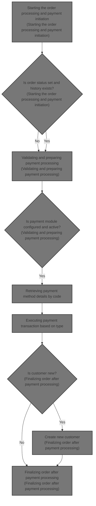
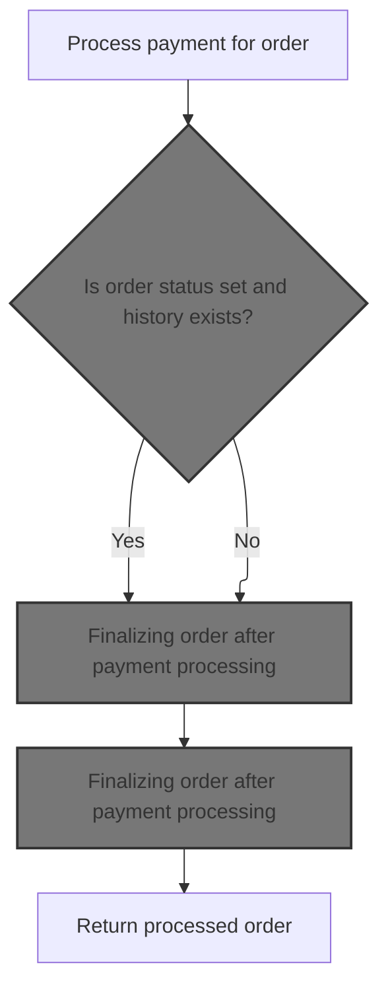
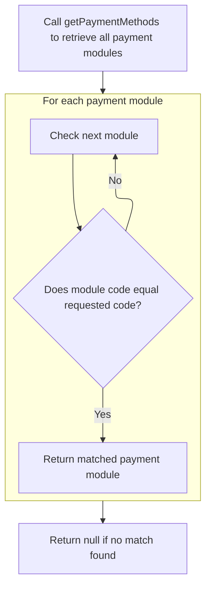

This document describes the flow of processing an order including payment initiation, payment processing, and order finalization. The flow receives order details including customer, payment, and shopping cart items as input and returns the processed order with updated status and payment transaction details. It manages the business process of validating inputs, selecting payment methods, executing payment transactions, and updating order status and history to complete the order processing.



# Starting the order processing and payment initiation



This section handles the starting of order processing and payment initiation, ensuring that all necessary inputs are validated before processing the payment and finalizing the order.

| Category        | Rule Name                           | Description                                                                                                                    |
| --------------- | ----------------------------------- | ------------------------------------------------------------------------------------------------------------------------------ |
| Data validation | Order must exist                    | The order must not be null before processing can begin.                                                                        |
| Data validation | Customer must exist                 | The customer must not be null, even if the order is anonymous.                                                                 |
| Data validation | Shopping cart items required        | The shopping cart items list must not be empty or null.                                                                        |
| Data validation | Payment details required            | Payment details must be provided and not null before processing payment.                                                       |
| Data validation | Merchant store required             | Merchant store information must be provided and not null.                                                                      |
| Data validation | Order total summary required        | Order total summary must be provided and not null to ensure accurate payment processing.                                       |
| Business logic  | Payment must succeed                | Payment must be processed successfully before finalizing the order.                                                            |
| Business logic  | Finalize order regardless of status | If the order status is not set or order history does not exist, the system still finalizes the order after payment processing. |

<SwmSnippet path="/shopizer/sm-core/src/main/java/com/salesmanager/core/business/order/service/OrderServiceImpl.java" line="105">

---

We validate inputs and then call the payment service to process the payment before continuing with the order.

```java
    private Order process(Order order, Customer customer, List<ShoppingCartItem> items, OrderTotalSummary summary, Payment payment, Transaction transaction, MerchantStore store) throws ServiceException {
    	
    	
    	Validate.notNull(order, "Order cannot be null");
    	Validate.notNull(customer, "Customer cannot be null (even if anonymous order)");
    	Validate.notEmpty(items, "ShoppingCart items cannot be null");
    	Validate.notNull(payment, "Payment cannot be null");
    	Validate.notNull(store, "MerchantStore cannot be null");
    	Validate.notNull(summary, "Order total Summary cannot be null");
    	
    	//first process payment
    	Transaction processTransaction = paymentService.processPayment(customer, store, payment, items, order);
```

---

</SwmSnippet>

## Validating and preparing payment processing

This section validates payment inputs, checks configured and active payment modules for the store, determines the transaction type, and validates credit card information if applicable before processing the payment.

| Category        | Rule Name                             | Description                                                                                                                        |
| --------------- | ------------------------------------- | ---------------------------------------------------------------------------------------------------------------------------------- |
| Data validation | Mandatory payment inputs              | All payment processing requires non-null customer, store, payment, order, and order total information to proceed.                  |
| Data validation | Payment module configuration required | At least one payment module must be configured for the store to process payments.                                                  |
| Data validation | Active payment module required        | The payment module specified in the payment details must be configured and active for the store.                                   |
| Data validation | Transaction type validation           | The transaction type must be either AUTHORIZE or AUTHORIZECAPTURE, based on the payment module configuration.                      |
| Data validation | Credit card validation                | Credit card payments require validation of credit card number, card type, expiration month, and expiration year before processing. |
| Business logic  | Currency consistency                  | The payment currency must match the merchant store's currency.                                                                     |
| Business logic  | Default transaction type              | If the payment module does not specify a transaction type, the default transaction type is AUTHORIZECAPTURE.                       |

<SwmSnippet path="/shopizer/sm-core/src/main/java/com/salesmanager/core/business/payments/service/PaymentServiceImpl.java" line="296">

---

In this part, we validate all inputs again to be safe, then check which payment modules are configured and active for the store. We also determine the transaction type and validate credit card info if needed before proceeding.

```java
	public Transaction processPayment(Customer customer,
			MerchantStore store, Payment payment, List<ShoppingCartItem> items, Order order)
			throws ServiceException {


		Validate.notNull(customer);
		Validate.notNull(store);
		Validate.notNull(payment);
		Validate.notNull(order);
		Validate.notNull(order.getTotal());
		
		payment.setCurrency(store.getCurrency());
		
		BigDecimal amount = order.getTotal();

		//must have a shipping module configured
		Map<String, IntegrationConfiguration> modules = this.getPaymentModulesConfigured(store);
		if(modules==null){
			throw new ServiceException("No payment module configured");
		}
		
		IntegrationConfiguration configuration = modules.get(payment.getModuleName());
		
		if(configuration==null) {
			throw new ServiceException("Payment module " + payment.getModuleName() + " is not configured");
		}
		
		if(!configuration.isActive()) {
			throw new ServiceException("Payment module " + payment.getModuleName() + " is not active");
		}
		
		String sTransactionType = configuration.getIntegrationKeys().get("transaction");
		if(sTransactionType==null) {
			sTransactionType = TransactionType.AUTHORIZECAPTURE.name();
		}
		

		if(sTransactionType.equals(TransactionType.AUTHORIZE.name())) {
			payment.setTransactionType(TransactionType.AUTHORIZE);
		} else {
			payment.setTransactionType(TransactionType.AUTHORIZECAPTURE);
		} 
		

		PaymentModule module = this.paymentModules.get(payment.getModuleName());
		
		if(module==null) {
			throw new ServiceException("Payment module " + payment.getModuleName() + " does not exist");
		}
		
		if(payment instanceof CreditCardPayment) {
			CreditCardPayment creditCardPayment = (CreditCardPayment)payment;
			validateCreditCard(creditCardPayment.getCreditCardNumber(),creditCardPayment.getCreditCard(),creditCardPayment.getExpirationMonth(),creditCardPayment.getExpirationYear());
		}
		
		IntegrationModule integrationModule = getPaymentMethodByCode(store,payment.getModuleName());
```

---

</SwmSnippet>

### Retrieving payment method details by code



This section describes the process of retrieving a payment method by its unique code from a list of available payment modules for a given merchant store.

| Category       | Rule Name                      | Description                                                                                                                               |
| -------------- | ------------------------------ | ----------------------------------------------------------------------------------------------------------------------------------------- |
| Business logic | Unique payment method code     | Each payment method is identified by a unique code that distinguishes it from other payment methods.                                      |
| Business logic | Return matching payment method | When a payment method code matches a code in the list of payment modules, the corresponding payment method module must be returned.       |
| Business logic | Return null if no match        | If no payment method module matches the provided code, the system must return null to indicate no available payment method for that code. |

<SwmSnippet path="/shopizer/sm-core/src/main/java/com/salesmanager/core/business/payments/service/PaymentServiceImpl.java" line="147">

---

We find and return the payment method that matches the code.

```java
	public IntegrationModule getPaymentMethodByCode(MerchantStore store,
			String code) throws ServiceException {
		List<IntegrationModule> modules =  getPaymentMethods(store);

		for(IntegrationModule module : modules) {
			if(module.getCode().equals(code)) {
				
				return module;
			}
		}
		
		return null;
	}
```

---

</SwmSnippet>

### Listing all payment methods for the store

This section lists all payment methods available for the store, allowing customers to choose their preferred payment option during checkout.

| Category       | Rule Name                       | Description                                                                                                                                |
| -------------- | ------------------------------- | ------------------------------------------------------------------------------------------------------------------------------------------ |
| Business logic | Clear payment method names      | Payment methods should be displayed with clear and user-friendly names to avoid customer confusion.                                        |
| Business logic | Consistent payment method order | Payment methods should be listed in a consistent order, such as by popularity or alphabetically, to provide a predictable user experience. |

See <SwmLink doc-title="Providing payment methods by store region">[Providing payment methods by store region](\.swm\providing-payment-methods-by-store-region.zkqfrb4b.sw.md)</SwmLink>

### Executing payment transaction based on type

```mermaid
%%{init: {"flowchart": {"defaultRenderer": "elk"}} }%%
flowchart TD
    node1["Start processPayment"] --> node2{"Is transactionType null?"}
    click node1 openCode "shopizer/sm-core/src/main/java/com/salesmanager/core/business/payments/service/PaymentServiceImpl.java:352:353"
    node2 -->|"Yes"| node3["Set transactionType from payment"]
    click node2 openCode "shopizer/sm-core/src/main/java/com/salesmanager/core/business/payments/service/PaymentServiceImpl.java:353:355"
    node3 --> node4{"Is transactionType CAPTURE?"}
    click node3 openCode "shopizer/sm-core/src/main/java/com/salesmanager/core/business/payments/service/PaymentServiceImpl.java:355:357"
    node4 -->|"Yes"| node5["Reject with exception: use processCapturePayment"]
    click node4 openCode "shopizer/sm-core/src/main/java/com/salesmanager/core/business/payments/service/PaymentServiceImpl.java:356:357"
    node4 -->|"No"| node6{"Transaction type?"}
    click node6 openCode "shopizer/sm-core/src/main/java/com/salesmanager/core/business/payments/service/PaymentServiceImpl.java:361:367"
    node6 -->|"AUTHORIZE"| node7["Authorize payment"]
    click node7 openCode "shopizer/sm-core/src/main/java/com/salesmanager/core/business/payments/service/PaymentServiceImpl.java:362:363"
    node6 -->|"AUTHORIZECAPTURE"| node8["Authorize and capture payment"]
    click node8 openCode "shopizer/sm-core/src/main/java/com/salesmanager/core/business/payments/service/PaymentServiceImpl.java:364:365"
    node6 -->|"INIT"| node9["Initialize transaction"]
    click node9 openCode "shopizer/sm-core/src/main/java/com/salesmanager/core/business/payments/service/PaymentServiceImpl.java:366:367"
    node7 --> node10{"Is transactionType INIT?"}
    node8 --> node10
    node9 --> node10
    node10 -->|"No"| node11["Save transaction"]
    click node11 openCode "shopizer/sm-core/src/main/java/com/salesmanager/core/business/payments/service/PaymentServiceImpl.java:371:372"
    node10 -->|"Yes"| node12["Skip saving transaction"]
    node11 --> node13{"Is transactionType AUTHORIZECAPTURE?"}
    node12 --> node13
    node13 -->|"Yes"| node14["Set order status to ORDERED"]
    click node14 openCode "shopizer/sm-core/src/main/java/com/salesmanager/core/business/payments/service/PaymentServiceImpl.java:375:376"
    node14 --> node15{"Is paymentType MONEYORDER?"}
    click node15 openCode "shopizer/sm-core/src/main/java/com/salesmanager/core/business/payments/service/PaymentServiceImpl.java:376:378"
    node15 -->|"No"| node16["Set order status to PROCESSED"]
    click node16 openCode "shopizer/sm-core/src/main/java/com/salesmanager/core/business/payments/service/PaymentServiceImpl.java:377:378"
    node15 -->|"Yes"| node17["Keep order status ORDERED"]
    node13 -->|"No"| node17
    node16 --> node17
    node17 --> node18["Return transaction"]
    click node18 openCode "shopizer/sm-core/src/main/java/com/salesmanager/core/business/payments/service/PaymentServiceImpl.java:381:382"
classDef HeadingStyle fill:#777777,stroke:#333,stroke-width:2px;
```



<SwmSnippet path="/shopizer/sm-core/src/main/java/com/salesmanager/core/business/payments/service/PaymentServiceImpl.java" line="352">

---

After getting the payment method, we decide which transaction type to use and call the corresponding payment module method. We save the transaction if needed and update the order status based on payment type before returning the transaction.

```java
		TransactionType transactionType = TransactionType.valueOf(sTransactionType);
		if(transactionType==null) {
			transactionType = payment.getTransactionType();
			if(transactionType.equals(TransactionType.CAPTURE.name())) {
				throw new ServiceException("This method does not allow to process capture transaction. Use processCapturePayment");
			}
		}
		
		Transaction transaction = null;
		if(transactionType == TransactionType.AUTHORIZE)  {
			transaction = module.authorize(store, customer, items, amount, payment, configuration, integrationModule);
		} else if(transactionType == TransactionType.AUTHORIZECAPTURE)  {
			transaction = module.authorizeAndCapture(store, customer, items, amount, payment, configuration, integrationModule);
		} else if(transactionType == TransactionType.INIT)  {
			transaction = module.initTransaction(store, customer, amount, payment, configuration, integrationModule);
		}


		if(transactionType != TransactionType.INIT) {
			transactionService.create(transaction);
		}
		
		if(transactionType == TransactionType.AUTHORIZECAPTURE)  {
			order.setStatus(OrderStatus.ORDERED);
			if(payment.getPaymentType().name()!=PaymentType.MONEYORDER.name()) {
				order.setStatus(OrderStatus.PROCESSED);
			}
		}

		return transaction;

		

	}
```

---

</SwmSnippet>

## Finalizing order after payment processing

```mermaid
%%{init: {"flowchart": {"defaultRenderer": "elk"}} }%%
flowchart TD
    node1["Start order processing"] --> node2{"Is order history empty or status null?"}
    click node1 openCode "shopizer/sm-core/src/main/java/com/salesmanager/core/business/order/service/OrderServiceImpl.java:117:118"
    node2 -->|"Yes"| node3["Initialize order status and history"]
    click node2 openCode "shopizer/sm-core/src/main/java/com/salesmanager/core/business/order/service/OrderServiceImpl.java:119:133"
    node2 -->|"No"| node4
    node3 --> node4
    node4 --> node5{"Is customer new? (ID null or 0)"}
    click node3 openCode "shopizer/sm-core/src/main/java/com/salesmanager/core/business/order/service/OrderServiceImpl.java:135:137"
    node5 -->|"Yes"| node6["Create new customer"]
    click node5 openCode "shopizer/sm-core/src/main/java/com/salesmanager/core/business/order/service/OrderServiceImpl.java:135:137"
    node5 -->|"No"| node7
    node6 --> node7
    node7 --> node8["Save order"]
    click node7 openCode "shopizer/sm-core/src/main/java/com/salesmanager/core/business/order/service/OrderServiceImpl.java:139:141"
    node8 --> node9{"Is transaction present?"}
    click node8 openCode "shopizer/sm-core/src/main/java/com/salesmanager/core/business/order/service/OrderServiceImpl.java:143:144"
    node9 -->|"Yes"| node10{"Is transaction new? (ID null or 0)"}
    click node9 openCode "shopizer/sm-core/src/main/java/com/salesmanager/core/business/order/service/OrderServiceImpl.java:143:144"
    node9 -->|"No"| node13
    node10 -->|"Yes"| node11["Create transaction"]
    click node10 openCode "shopizer/sm-core/src/main/java/com/salesmanager/core/business/order/service/OrderServiceImpl.java:145:146"
    node10 -->|"No"| node12["Update transaction"]
    click node11 openCode "shopizer/sm-core/src/main/java/com/salesmanager/core/business/order/service/OrderServiceImpl.java:145:146"
    click node12 openCode "shopizer/sm-core/src/main/java/com/salesmanager/core/business/order/service/OrderServiceImpl.java:147:148"
    node11 --> node13
    node12 --> node13
    node13 --> node14{"Is processTransaction present?"}
    click node13 openCode "shopizer/sm-core/src/main/java/com/salesmanager/core/business/order/service/OrderServiceImpl.java:152:153"
    node14 -->|"Yes"| node15{"Is processTransaction new? (ID null or 0)"}
    click node14 openCode "shopizer/sm-core/src/main/java/com/salesmanager/core/business/order/service/OrderServiceImpl.java:152:153"
    node14 -->|"No"| node18
    node15 -->|"Yes"| node16["Create processTransaction"]
    click node15 openCode "shopizer/sm-core/src/main/java/com/salesmanager/core/business/order/service/OrderServiceImpl.java:154:155"
    node15 -->|"No"| node17["Update processTransaction"]
    click node16 openCode "shopizer/sm-core/src/main/java/com/salesmanager/core/business/order/service/OrderServiceImpl.java:154:155"
    click node17 openCode "shopizer/sm-core/src/main/java/com/salesmanager/core/business/order/service/OrderServiceImpl.java:156:157"
    node16 --> node18
    node17 --> node18
    node18 --> node19["Return processed order"]
    click node18 openCode "shopizer/sm-core/src/main/java/com/salesmanager/core/business/order/service/OrderServiceImpl.java:159:160"
    click node19 openCode "shopizer/sm-core/src/main/java/com/salesmanager/core/business/order/service/OrderServiceImpl.java:161:162"
classDef HeadingStyle fill:#777777,stroke:#333,stroke-width:2px;
```



<SwmSnippet path="/shopizer/sm-core/src/main/java/com/salesmanager/core/business/order/service/OrderServiceImpl.java" line="117">

---

We finalize the order by setting status/history, creating customer if needed, saving order, and linking transactions.

```java
    	//transactionService.save(processTransaction);
    	
    	if(order.getOrderHistory()==null || order.getOrderHistory().size()==0 || order.getStatus()==null) {
    		OrderStatus status = order.getStatus();
    		if(status==null) {
    			status = OrderStatus.ORDERED;
    			order.setStatus(status);
    		}
    		Set<OrderStatusHistory> statusHistorySet = new HashSet<OrderStatusHistory>();
    		OrderStatusHistory statusHistory = new OrderStatusHistory();
    		statusHistory.setStatus(status);
    		statusHistory.setDateAdded(new Date());
    		statusHistory.setOrder(order);
    		statusHistorySet.add(statusHistory);
    		order.setOrderHistory(statusHistorySet);
    		
    	}
    	
    	if(customer.getId()==null || customer.getId()==0) {
    		customerService.create(customer);
    	}
    	
    	order.setCustomerId(customer.getId());
    	
    	this.create(order);

    	if(transaction!=null) {
    		transaction.setOrder(order);
    		if(transaction.getId()==null || transaction.getId()==0) {
    			transactionService.create(transaction);
    		} else {
    			transactionService.update(transaction);
    		}
    	}
    	
    	if(processTransaction!=null) {
    		processTransaction.setOrder(order);
    		if(processTransaction.getId()==null || processTransaction.getId()==0) {
    			transactionService.create(processTransaction);
    		} else {
    			transactionService.update(processTransaction);
    		}
    	}
    	
    	return order;
    	
    	
    }
```

---

</SwmSnippet>

&nbsp;

*This is an auto-generated document by Swimm 🌊 and has not yet been verified by a human*

<SwmMeta version="3.0.0" repo-id="Z2l0aHViJTNBJTNBU2hvcGl6ZXIlM0ElM0F1bWFsaW5nYXN3YW1p" repo-name="Shopizer"><sup>Powered by [Swimm](https://app.swimm.io/)</sup></SwmMeta>
