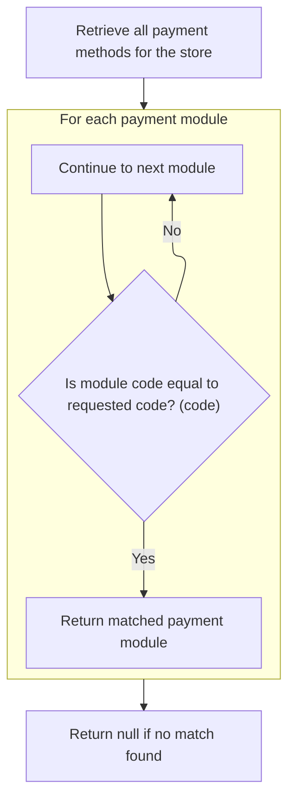
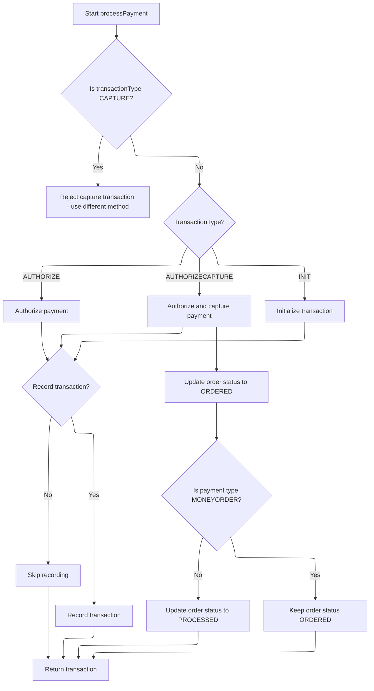

This document explains the flow of processing an order by validating payment details, confirming payment, executing the payment transaction, and finalizing the order status and transactions. The flow ensures that payments are confirmed before the order is finalized and that transactions are recorded to maintain order integrity.

```mermaid
flowchart TD
 node1["Starting the order processing"]:::HeadingStyle --> node2{"Is payment module configured and active?
(Handling payment processing)"}:::HeadingStyle
 node2 -->|"Yes"| node3["Handling payment processing
(Handling payment processing)"]:::HeadingStyle
 node2 -->|"No"| node4["Payment module not configured or inactive"]
 node3 --> node5{"Transaction type?
(Handling payment processing)"}:::HeadingStyle
 node5 -->|"AUTHORIZE"| node6["Authorize payment
(Executing payment transaction)"]:::HeadingStyle
 node5 -->|"AUTHORIZECAPTURE"| node7["Authorize and capture payment
(Executing payment transaction)"]:::HeadingStyle
 node5 -->|"INIT"| node8["Initialize transaction
(Executing payment transaction)"]:::HeadingStyle
 node6 --> node9["Finalizing order after payment
(Finalizing order after payment)"]:::HeadingStyle
 node7 --> node9
 node8 --> node9
 node9 --> node10{"Does order have status or history?
(Finalizing order after payment)"}:::HeadingStyle
 node10 -->|"No"| node11["Set order status to ORDERED and create history
(Finalizing order after payment)"]:::HeadingStyle
 node10 -->|"Yes"| node12["Proceed without status change
(Finalizing order after payment)"]:::HeadingStyle
 node11 --> node13{"Is customer new?
(Finalizing order after payment)"}:::HeadingStyle
 node12 --> node13
 node13 -->|"Yes"| node14["Create new customer
(Finalizing order after payment)"]:::HeadingStyle
 node13 -->|"No"| node15["Proceed with existing customer
(Finalizing order after payment)"]:::HeadingStyle
 node14 --> node16["Save order
(Finalizing order after payment)"]:::HeadingStyle
 node15 --> node16
 node16 --> node17{"Transaction exists and is new?
(Finalizing order after payment)"}:::HeadingStyle
 node17 -->|"Yes"| node18["Create transaction
(Finalizing order after payment)"]:::HeadingStyle
 node17 -->|"No"| node19["Update transaction
(Finalizing order after payment)"]:::HeadingStyle
 node18 --> node20["Save order
(Finalizing order after payment)"]:::HeadingStyle
 node19 --> node20
 node20 --> node21{"Process transaction exists and is new?
(Finalizing order after payment)"}:::HeadingStyle
 node21 -->|"Yes"| node22["Create process transaction
(Finalizing order after payment)"]:::HeadingStyle
 node21 -->|"No"| node23["Update process transaction
(Finalizing order after payment)"]:::HeadingStyle
 node22 --> node24["Return processed order
(Finalizing order after payment)"]:::HeadingStyle
 node23 --> node24
 node20 --> node24
 click node1 goToHeading "Starting the order processing"
 click node2 goToHeading "Handling payment processing"
 click node3 goToHeading "Handling payment processing"
 click node5 goToHeading "Handling payment processing"
 click node6 goToHeading "Executing payment transaction"
 click node7 goToHeading "Executing payment transaction"
 click node8 goToHeading "Executing payment transaction"
 click node9 goToHeading "Finalizing order after payment"
 click node10 goToHeading "Finalizing order after payment"
 click node11 goToHeading "Finalizing order after payment"
 click node12 goToHeading "Finalizing order after payment"
 click node13 goToHeading "Finalizing order after payment"
 click node14 goToHeading "Finalizing order after payment"
 click node15 goToHeading "Finalizing order after payment"
 click node16 goToHeading "Finalizing order after payment"
 click node17 goToHeading "Finalizing order after payment"
 click node18 goToHeading "Finalizing order after payment"
 click node19 goToHeading "Finalizing order after payment"
 click node20 goToHeading "Finalizing order after payment"
 click node21 goToHeading "Finalizing order after payment"
 click node22 goToHeading "Finalizing order after payment"
 click node23 goToHeading "Finalizing order after payment"
 click node24 goToHeading "Finalizing order after payment"
classDef HeadingStyle fill:#777777,stroke:#333,stroke-width:2px;
```



# Starting the order processing

This section handles the initial steps of order processing by validating inputs and processing payment to confirm funds before continuing with the order.

| Category       | Rule Name            | Description                                                                            |
| -------------- | -------------------- | -------------------------------------------------------------------------------------- |
| Business logic | Payment confirmation | Payment must be processed and confirmed successfully before continuing with the order. |

<SwmSnippet path="/shopizer/sm-core/src/main/java/com/salesmanager/core/business/order/service/OrderServiceImpl.java" line="105">

---

We validate inputs and process payment first to confirm funds before continuing with the order.

```java
    private Order process(Order order, Customer customer, List<ShoppingCartItem> items, OrderTotalSummary summary, Payment payment, Transaction transaction, MerchantStore store) throws ServiceException {
    	
    	
    	Validate.notNull(order, "Order cannot be null");
    	Validate.notNull(customer, "Customer cannot be null (even if anonymous order)");
    	Validate.notEmpty(items, "ShoppingCart items cannot be null");
    	Validate.notNull(payment, "Payment cannot be null");
    	Validate.notNull(store, "MerchantStore cannot be null");
    	Validate.notNull(summary, "Order total Summary cannot be null");
    	
    	//first process payment
    	Transaction processTransaction = paymentService.processPayment(customer, store, payment, items, order);
```

---

</SwmSnippet>

## Handling payment processing

This section handles payment processing by validating payment and order details, ensuring the payment module is configured and active, setting the transaction type, and validating credit card information if applicable.

| Category        | Rule Name                | Description                                                                                                          |
| --------------- | ------------------------ | -------------------------------------------------------------------------------------------------------------------- |
| Data validation | Credit card validation   | Credit card payments must have valid credit card number, card details, expiration month, and year before processing. |
| Business logic  | Default transaction type | If the payment module's transaction type is not specified, default to AUTHORIZECAPTURE transaction type.             |

<SwmSnippet path="/shopizer/sm-core/src/main/java/com/salesmanager/core/business/payments/service/PaymentServiceImpl.java" line="296">

---

In this part, we validate the payment and order details, then check if the payment module is configured and active. We set the transaction type based on configuration and validate credit card info if needed. This prepares the payment for actual processing by the right module.

```java
	public Transaction processPayment(Customer customer,
			MerchantStore store, Payment payment, List<ShoppingCartItem> items, Order order)
			throws ServiceException {


		Validate.notNull(customer);
		Validate.notNull(store);
		Validate.notNull(payment);
		Validate.notNull(order);
		Validate.notNull(order.getTotal());
		
		payment.setCurrency(store.getCurrency());
		
		BigDecimal amount = order.getTotal();

		//must have a shipping module configured
		Map<String, IntegrationConfiguration> modules = this.getPaymentModulesConfigured(store);
		if(modules==null){
			throw new ServiceException("No payment module configured");
		}
		
		IntegrationConfiguration configuration = modules.get(payment.getModuleName());
		
		if(configuration==null) {
			throw new ServiceException("Payment module " + payment.getModuleName() + " is not configured");
		}
		
		if(!configuration.isActive()) {
			throw new ServiceException("Payment module " + payment.getModuleName() + " is not active");
		}
		
		String sTransactionType = configuration.getIntegrationKeys().get("transaction");
		if(sTransactionType==null) {
			sTransactionType = TransactionType.AUTHORIZECAPTURE.name();
		}
		

		if(sTransactionType.equals(TransactionType.AUTHORIZE.name())) {
			payment.setTransactionType(TransactionType.AUTHORIZE);
		} else {
			payment.setTransactionType(TransactionType.AUTHORIZECAPTURE);
		} 
		

		PaymentModule module = this.paymentModules.get(payment.getModuleName());
		
		if(module==null) {
			throw new ServiceException("Payment module " + payment.getModuleName() + " does not exist");
		}
		
		if(payment instanceof CreditCardPayment) {
			CreditCardPayment creditCardPayment = (CreditCardPayment)payment;
			validateCreditCard(creditCardPayment.getCreditCardNumber(),creditCardPayment.getCreditCard(),creditCardPayment.getExpirationMonth(),creditCardPayment.getExpirationYear());
		}
		
		IntegrationModule integrationModule = getPaymentMethodByCode(store,payment.getModuleName());
```

---

</SwmSnippet>

### Retrieving payment method details



This section describes the process of retrieving payment method details by matching a given payment method code within the store's available payment methods.

| Category       | Rule Name                      | Description                                                                                         |
| -------------- | ------------------------------ | --------------------------------------------------------------------------------------------------- |
| Business logic | Store-specific payment methods | Only payment methods associated with the specified store are considered for retrieval.              |
| Business logic | Exact code match               | The payment method returned must have a code exactly matching the requested code.                   |
| Business logic | Null on no match               | If no payment method matches the requested code, the system returns null indicating no match found. |

<SwmSnippet path="/shopizer/sm-core/src/main/java/com/salesmanager/core/business/payments/service/PaymentServiceImpl.java" line="147">

---

It finds the payment method matching the given code.

```java
	public IntegrationModule getPaymentMethodByCode(MerchantStore store,
			String code) throws ServiceException {
		List<IntegrationModule> modules =  getPaymentMethods(store);

		for(IntegrationModule module : modules) {
			if(module.getCode().equals(code)) {
				
				return module;
			}
		}
		
		return null;
	}
```

---

</SwmSnippet>

### Listing available payment methods

This section lists the available payment methods for customers during the checkout process in the e-commerce platform.

| Category       | Rule Name                             | Description                                                                                                                      |
| -------------- | ------------------------------------- | -------------------------------------------------------------------------------------------------------------------------------- |
| Business logic | Active Payment Methods Only           | Only payment methods that are active and enabled in the system configuration should be listed as available.                      |
| Business logic | Consistent Payment Method Order       | Payment methods should be listed in a consistent order to provide a predictable user experience.                                 |
| Business logic | Prompt for Additional Payment Details | Payment methods that require additional user input (e.g., credit card details) should prompt the user accordingly when selected. |

See <SwmLink doc-title="Retrieving applicable payment methods">[Retrieving applicable payment methods](\.swm\retrieving-applicable-payment-methods.0tuid23w.sw.md)</SwmLink>

### Executing payment transaction



<SwmSnippet path="/shopizer/sm-core/src/main/java/com/salesmanager/core/business/payments/service/PaymentServiceImpl.java" line="352">

---

We pick the transaction method, execute it, save the transaction, and update order status.

```java
		TransactionType transactionType = TransactionType.valueOf(sTransactionType);
		if(transactionType==null) {
			transactionType = payment.getTransactionType();
			if(transactionType.equals(TransactionType.CAPTURE.name())) {
				throw new ServiceException("This method does not allow to process capture transaction. Use processCapturePayment");
			}
		}
		
		Transaction transaction = null;
		if(transactionType == TransactionType.AUTHORIZE)  {
			transaction = module.authorize(store, customer, items, amount, payment, configuration, integrationModule);
		} else if(transactionType == TransactionType.AUTHORIZECAPTURE)  {
			transaction = module.authorizeAndCapture(store, customer, items, amount, payment, configuration, integrationModule);
		} else if(transactionType == TransactionType.INIT)  {
			transaction = module.initTransaction(store, customer, amount, payment, configuration, integrationModule);
		}


		if(transactionType != TransactionType.INIT) {
			transactionService.create(transaction);
		}
		
		if(transactionType == TransactionType.AUTHORIZECAPTURE)  {
			order.setStatus(OrderStatus.ORDERED);
			if(payment.getPaymentType().name()!=PaymentType.MONEYORDER.name()) {
				order.setStatus(OrderStatus.PROCESSED);
			}
		}

		return transaction;

		

	}
```

---

</SwmSnippet>

## Finalizing order after payment

```mermaid
%%{init: {"flowchart": {"defaultRenderer": "elk"}} }%%
flowchart TD
    node1["Start order processing"] --> node2{"Order has no history or status?"}
    node2 -->|"Yes"| node3["Set order status to ORDERED and create status history"]
    node2 -->|"No"| node4["Proceed without status change"]
    node3 --> node4
    node4 --> node5{"Is customer new?"}
    node5 -->|"Yes"| node6["Create new customer"]
    node5 -->|"No"| node7["Proceed with existing customer"]
    node6 --> node7
    node7 --> node8["Save order"]
    node8 --> node9{"Transaction exists?"}
    node9 -->|"Yes"| node10{"Transaction is new?"}
    node9 -->|"No"| node13["Skip transaction"]
    node10 -->|"Yes"| node11["Create transaction"]
    node10 -->|"No"| node12["Update transaction"]
    node11 --> node13
    node12 --> node13
    node13 --> node14{"ProcessTransaction exists?"}
    node14 -->|"Yes"| node15{"ProcessTransaction is new?"}
    node14 -->|"No"| node18["Skip processTransaction"]
    node15 -->|"Yes"| node16["Create processTransaction"]
    node15 -->|"No"| node17["Update processTransaction"]
    node16 --> node18
    node17 --> node18
    node18 --> node19["Return processed order"]

    click node1 openCode "shopizer/sm-core/src/main/java/com/salesmanager/core/business/order/service/OrderServiceImpl.java:117:118"
    click node2 openCode "shopizer/sm-core/src/main/java/com/salesmanager/core/business/order/service/OrderServiceImpl.java:119:133"
    click node3 openCode "shopizer/sm-core/src/main/java/com/salesmanager/core/business/order/service/OrderServiceImpl.java:120:131"
    click node4 openCode "shopizer/sm-core/src/main/java/com/salesmanager/core/business/order/service/OrderServiceImpl.java:133:134"
    click node5 openCode "shopizer/sm-core/src/main/java/com/salesmanager/core/business/order/service/OrderServiceImpl.java:135:137"
    click node6 openCode "shopizer/sm-core/src/main/java/com/salesmanager/core/business/order/service/OrderServiceImpl.java:136:137"
    click node7 openCode "shopizer/sm-core/src/main/java/com/salesmanager/core/business/order/service/OrderServiceImpl.java:137:138"
    click node8 openCode "shopizer/sm-core/src/main/java/com/salesmanager/core/business/order/service/OrderServiceImpl.java:141:142"
    click node9 openCode "shopizer/sm-core/src/main/java/com/salesmanager/core/business/order/service/OrderServiceImpl.java:143:150"
    click node10 openCode "shopizer/sm-core/src/main/java/com/salesmanager/core/business/order/service/OrderServiceImpl.java:145:149"
    click node11 openCode "shopizer/sm-core/src/main/java/com/salesmanager/core/business/order/service/OrderServiceImpl.java:146:147"
    click node12 openCode "shopizer/sm-core/src/main/java/com/salesmanager/core/business/order/service/OrderServiceImpl.java:148:149"
    click node13 openCode "shopizer/sm-core/src/main/java/com/salesmanager/core/business/order/service/OrderServiceImpl.java:150:151"
    click node14 openCode "shopizer/sm-core/src/main/java/com/salesmanager/core/business/order/service/OrderServiceImpl.java:152:159"
    click node15 openCode "shopizer/sm-core/src/main/java/com/salesmanager/core/business/order/service/OrderServiceImpl.java:154:158"
    click node16 openCode "shopizer/sm-core/src/main/java/com/salesmanager/core/business/order/service/OrderServiceImpl.java:155:156"
    click node17 openCode "shopizer/sm-core/src/main/java/com/salesmanager/core/business/order/service/OrderServiceImpl.java:157:158"
    click node18 openCode "shopizer/sm-core/src/main/java/com/salesmanager/core/business/order/service/OrderServiceImpl.java:159:160"
    click node19 openCode "shopizer/sm-core/src/main/java/com/salesmanager/core/business/order/service/OrderServiceImpl.java:161:162"
classDef HeadingStyle fill:#777777,stroke:#333,stroke-width:2px;
```



<SwmSnippet path="/shopizer/sm-core/src/main/java/com/salesmanager/core/business/order/service/OrderServiceImpl.java" line="117">

---

We finalize order status, create customer if needed, link and save transactions, and save the order.

```java
    	//transactionService.save(processTransaction);
    	
    	if(order.getOrderHistory()==null || order.getOrderHistory().size()==0 || order.getStatus()==null) {
    		OrderStatus status = order.getStatus();
    		if(status==null) {
    			status = OrderStatus.ORDERED;
    			order.setStatus(status);
    		}
    		Set<OrderStatusHistory> statusHistorySet = new HashSet<OrderStatusHistory>();
    		OrderStatusHistory statusHistory = new OrderStatusHistory();
    		statusHistory.setStatus(status);
    		statusHistory.setDateAdded(new Date());
    		statusHistory.setOrder(order);
    		statusHistorySet.add(statusHistory);
    		order.setOrderHistory(statusHistorySet);
    		
    	}
    	
    	if(customer.getId()==null || customer.getId()==0) {
    		customerService.create(customer);
    	}
    	
    	order.setCustomerId(customer.getId());
    	
    	this.create(order);

    	if(transaction!=null) {
    		transaction.setOrder(order);
    		if(transaction.getId()==null || transaction.getId()==0) {
    			transactionService.create(transaction);
    		} else {
    			transactionService.update(transaction);
    		}
    	}
    	
    	if(processTransaction!=null) {
    		processTransaction.setOrder(order);
    		if(processTransaction.getId()==null || processTransaction.getId()==0) {
    			transactionService.create(processTransaction);
    		} else {
    			transactionService.update(processTransaction);
    		}
    	}
    	
    	return order;
    	
    	
    }
```

---

</SwmSnippet>

&nbsp;

*This is an auto-generated document by Swimm 🌊 and has not yet been verified by a human*

<SwmMeta version="3.0.0" repo-id="Z2l0aHViJTNBJTNBU2hvcGl6ZXIlM0ElM0F1bWFsaW5nYXN3YW1p" repo-name="Shopizer"><sup>Powered by [Swimm](https://app.swimm.io/)</sup></SwmMeta>
