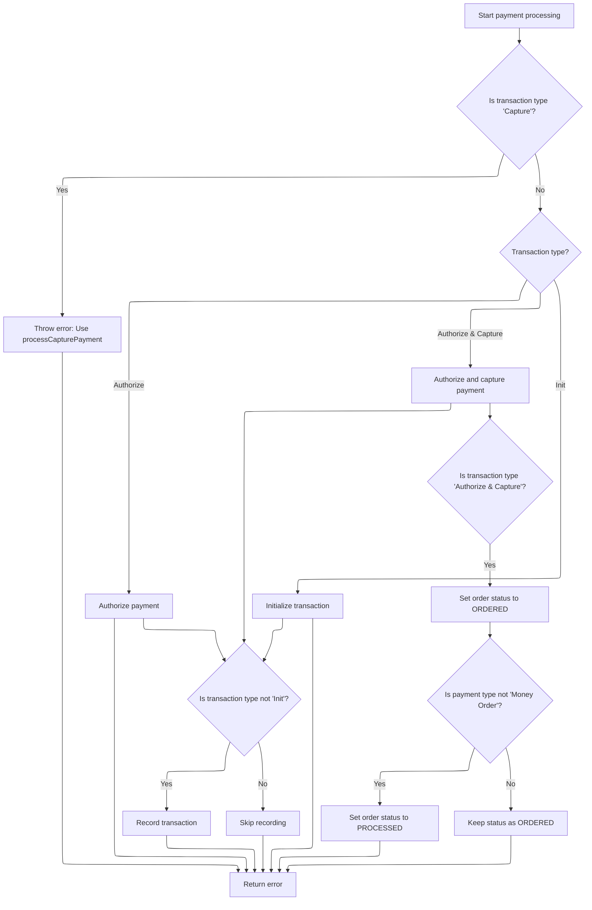

This document describes the flow for processing an order, ensuring all required data is present, handling payment through the appropriate payment module, and finalizing the order with updated status and transaction records. The flow receives order details, customer information, shopping cart items, payment details, merchant store, and order total summary as input, and produces a finalized order with payment processed and transaction recorded as output.

# Starting Order Processing

This section governs the initial steps of order processing, ensuring all required data is present and valid, and that payment processing is initiated before any further order actions are taken.

| Category        | Rule Name                          | Description                                                                                |
| --------------- | ---------------------------------- | ------------------------------------------------------------------------------------------ |
| Data validation | Order presence validation          | An order cannot be processed if the order object is missing.                               |
| Data validation | Customer presence validation       | An order cannot be processed if the customer object is missing, even for anonymous orders. |
| Data validation | Shopping cart items validation     | An order cannot be processed if the shopping cart items list is empty.                     |
| Data validation | Payment presence validation        | An order cannot be processed if the payment object is missing.                             |
| Data validation | Merchant store presence validation | An order cannot be processed if the merchant store object is missing.                      |
| Data validation | Order total summary validation     | An order cannot be processed if the order total summary object is missing.                 |
| Business logic  | Payment initiation precedence      | Payment processing must be initiated before any further order actions are taken.           |

<SwmSnippet path="/shopizer/sm-core/src/main/java/com/salesmanager/core/business/order/service/OrderServiceImpl.java" line="105">

---

In `process`, we validate inputs and kick off payment processing to get a transaction before doing anything else with the order.

```java
    private Order process(Order order, Customer customer, List<ShoppingCartItem> items, OrderTotalSummary summary, Payment payment, Transaction transaction, MerchantStore store) throws ServiceException {
    	
    	
    	Validate.notNull(order, "Order cannot be null");
    	Validate.notNull(customer, "Customer cannot be null (even if anonymous order)");
    	Validate.notEmpty(items, "ShoppingCart items cannot be null");
    	Validate.notNull(payment, "Payment cannot be null");
    	Validate.notNull(store, "MerchantStore cannot be null");
    	Validate.notNull(summary, "Order total Summary cannot be null");
    	
    	//first process payment
    	Transaction processTransaction = paymentService.processPayment(customer, store, payment, items, order);
```

---

</SwmSnippet>

## Validating and Preparing Payment

This section governs the rules for validating payment inputs, ensuring the store is properly configured for payments, and preparing the payment transaction for processing.

| Category        | Rule Name                             | Description                                                                                                                                                               |
| --------------- | ------------------------------------- | ------------------------------------------------------------------------------------------------------------------------------------------------------------------------- |
| Data validation | Mandatory payment inputs              | A payment transaction cannot proceed unless the customer, store, payment details, order, and order total are all provided and not null.                                   |
| Data validation | Payment module configuration required | A payment transaction cannot proceed unless the store has at least one payment module configured.                                                                         |
| Data validation | Active payment module required        | A payment transaction cannot proceed unless the selected payment module is both configured and active.                                                                    |
| Data validation | Payment module existence              | A payment transaction cannot proceed unless the payment module exists in the system.                                                                                      |
| Data validation | Credit card validation                | If the payment is made by credit card, the credit card number, type, expiration month, and expiration year must be valid.                                                 |
| Business logic  | Store currency enforcement            | The payment currency must match the store's configured currency for all transactions.                                                                                     |
| Business logic  | Default transaction type assignment   | If the payment module does not specify a transaction type, the default transaction type must be 'AUTHORIZECAPTURE'.                                                       |
| Business logic  | Transaction type enforcement          | If the payment module specifies 'AUTHORIZE' as the transaction type, the payment transaction must be set to 'AUTHORIZE'; otherwise, it must be set to 'AUTHORIZECAPTURE'. |

<SwmSnippet path="/shopizer/sm-core/src/main/java/com/salesmanager/core/business/payments/service/PaymentServiceImpl.java" line="296">

---

In `processPayment`, we validate all payment-related inputs, set the currency, and check that the store has the required payment modules configured and active. We also determine the transaction type and validate credit card details if needed. Next, we fetch the integration module for the payment method to proceed with the actual transaction.

```java
	public Transaction processPayment(Customer customer,
			MerchantStore store, Payment payment, List<ShoppingCartItem> items, Order order)
			throws ServiceException {


		Validate.notNull(customer);
		Validate.notNull(store);
		Validate.notNull(payment);
		Validate.notNull(order);
		Validate.notNull(order.getTotal());
		
		payment.setCurrency(store.getCurrency());
		
		BigDecimal amount = order.getTotal();

		//must have a shipping module configured
		Map<String, IntegrationConfiguration> modules = this.getPaymentModulesConfigured(store);
		if(modules==null){
			throw new ServiceException("No payment module configured");
		}
		
		IntegrationConfiguration configuration = modules.get(payment.getModuleName());
		
		if(configuration==null) {
			throw new ServiceException("Payment module " + payment.getModuleName() + " is not configured");
		}
		
		if(!configuration.isActive()) {
			throw new ServiceException("Payment module " + payment.getModuleName() + " is not active");
		}
		
		String sTransactionType = configuration.getIntegrationKeys().get("transaction");
		if(sTransactionType==null) {
			sTransactionType = TransactionType.AUTHORIZECAPTURE.name();
		}
		

		if(sTransactionType.equals(TransactionType.AUTHORIZE.name())) {
			payment.setTransactionType(TransactionType.AUTHORIZE);
		} else {
			payment.setTransactionType(TransactionType.AUTHORIZECAPTURE);
		} 
		

		PaymentModule module = this.paymentModules.get(payment.getModuleName());
		
		if(module==null) {
			throw new ServiceException("Payment module " + payment.getModuleName() + " does not exist");
		}
		
		if(payment instanceof CreditCardPayment) {
			CreditCardPayment creditCardPayment = (CreditCardPayment)payment;
			validateCreditCard(creditCardPayment.getCreditCardNumber(),creditCardPayment.getCreditCard(),creditCardPayment.getExpirationMonth(),creditCardPayment.getExpirationYear());
		}
		
		IntegrationModule integrationModule = getPaymentMethodByCode(store,payment.getModuleName());
```

---

</SwmSnippet>

### Selecting Payment Integration Module

This section governs how the system selects the appropriate payment integration module for a store based on a specific payment method code. It ensures that transactions are routed through the correct payment provider.

| Category        | Rule Name                       | Description                                                                                               |
| --------------- | ------------------------------- | --------------------------------------------------------------------------------------------------------- |
| Data validation | Exact code match requirement    | The payment integration module must have a code that exactly matches the provided payment method code.    |
| Business logic  | Store-specific module filtering | Only payment integration modules that are available for the specified store are considered for selection. |

<SwmSnippet path="/shopizer/sm-core/src/main/java/com/salesmanager/core/business/payments/service/PaymentServiceImpl.java" line="147">

---

`getPaymentMethodByCode` loops through available payment modules for the store and returns the one matching the given code. This is needed to get the correct integration module for the payment method before executing the transaction.

```java
	public IntegrationModule getPaymentMethodByCode(MerchantStore store,
			String code) throws ServiceException {
		List<IntegrationModule> modules =  getPaymentMethods(store);

		for(IntegrationModule module : modules) {
			if(module.getCode().equals(code)) {
				
				return module;
			}
		}
		
		return null;
	}
```

---

</SwmSnippet>

### Fetching Store Payment Methods

This section is responsible for retrieving the available payment methods for a specific store within the Shopizer e-commerce platform. It ensures that only valid and supported payment options are presented to customers during checkout.

| Category        | Rule Name                           | Description                                                                                                           |
| --------------- | ----------------------------------- | --------------------------------------------------------------------------------------------------------------------- |
| Data validation | Supported payment methods only      | Payment methods must be valid and supported by the Shopizer platform to be included in the output.                    |
| Business logic  | Enabled payment methods only        | Only payment methods that are enabled for the store are included in the output list.                                  |
| Business logic  | Store-specific payment restrictions | The list of payment methods must reflect any store-specific restrictions, such as geographic or currency limitations. |

See <SwmLink doc-title="Selecting Available Payment Methods">[Selecting Available Payment Methods](\.swm\selecting-available-payment-methods.6r486mti.sw.md)</SwmLink>

### Executing and Recording Payment Transaction



<SwmSnippet path="/shopizer/sm-core/src/main/java/com/salesmanager/core/business/payments/service/PaymentServiceImpl.java" line="352">

---

Back in `processPayment`, after getting the integration module, we use the transaction type to call the right method on the payment module (authorize, authorizeAndCapture, or initTransaction). We then create the transaction if needed and update the order status based on the payment result.

```java
		TransactionType transactionType = TransactionType.valueOf(sTransactionType);
		if(transactionType==null) {
			transactionType = payment.getTransactionType();
			if(transactionType.equals(TransactionType.CAPTURE.name())) {
				throw new ServiceException("This method does not allow to process capture transaction. Use processCapturePayment");
			}
		}
		
		Transaction transaction = null;
		if(transactionType == TransactionType.AUTHORIZE)  {
			transaction = module.authorize(store, customer, items, amount, payment, configuration, integrationModule);
		} else if(transactionType == TransactionType.AUTHORIZECAPTURE)  {
			transaction = module.authorizeAndCapture(store, customer, items, amount, payment, configuration, integrationModule);
		} else if(transactionType == TransactionType.INIT)  {
			transaction = module.initTransaction(store, customer, amount, payment, configuration, integrationModule);
		}


		if(transactionType != TransactionType.INIT) {
			transactionService.create(transaction);
		}
		
		if(transactionType == TransactionType.AUTHORIZECAPTURE)  {
			order.setStatus(OrderStatus.ORDERED);
			if(payment.getPaymentType().name()!=PaymentType.MONEYORDER.name()) {
				order.setStatus(OrderStatus.PROCESSED);
			}
		}

		return transaction;

		

	}
```

---

</SwmSnippet>

## Finalizing Order and Transaction

```mermaid
%%{init: {"flowchart": {"defaultRenderer": "elk"}} }%%
flowchart TD
    node1["Start order processing"] --> node2{"Is order status/history missing?"}
    node2 -->|"Yes"| node3["Set order status to ORDERED and create history"]
    click node3 openCode "shopizer/sm-core/src/main/java/com/salesmanager/core/business/order/service/OrderServiceImpl.java:119:133"
    node2 -->|"No"| node4["Proceed"]
    node3 --> node4
    node4 --> node5{"Is customer new (ID missing)?"}
    node5 -->|"Yes"| node6["Create customer (assign ID)"]
    click node6 openCode "shopizer/sm-core/src/main/java/com/salesmanager/core/business/order/service/OrderServiceImpl.java:135:137"
    node5 -->|"No"| node7["Proceed"]
    node6 --> node7
    node7 --> node8["Associate order with customer ID"]
    click node8 openCode "shopizer/sm-core/src/main/java/com/salesmanager/core/business/order/service/OrderServiceImpl.java:139:139"
    node8 --> node9["Save order"]
    click node9 openCode "shopizer/sm-core/src/main/java/com/salesmanager/core/business/order/service/OrderServiceImpl.java:141:141"
    node9 --> node10{"Is transaction present?"}
    node10 -->|"Yes"| node11{"Is transaction new (ID missing)?"}
    node11 -->|"Yes"| node12["Create transaction"]
    click node12 openCode "shopizer/sm-core/src/main/java/com/salesmanager/core/business/order/service/OrderServiceImpl.java:144:146"
    node11 -->|"No"| node13["Update transaction"]
    click node13 openCode "shopizer/sm-core/src/main/java/com/salesmanager/core/business/order/service/OrderServiceImpl.java:144:149"
    node12 --> node14["Proceed"]
    node13 --> node14["Proceed"]
    node10 -->|"No"| node14["Proceed"]
    node14 --> node15{"Is processTransaction present?"}
    node15 -->|"Yes"| node16{"Is processTransaction new (ID missing)?"}
    node16 -->|"Yes"| node17["Create processTransaction"]
    click node17 openCode "shopizer/sm-core/src/main/java/com/salesmanager/core/business/order/service/OrderServiceImpl.java:153:155"
    node16 -->|"No"| node18["Update processTransaction"]
    click node18 openCode "shopizer/sm-core/src/main/java/com/salesmanager/core/business/order/service/OrderServiceImpl.java:153:158"
    node17 --> node19["Return order"]
    node18 --> node19["Return order"]
    node15 -->|"No"| node19["Return order"]
    click node19 openCode "shopizer/sm-core/src/main/java/com/salesmanager/core/business/order/service/OrderServiceImpl.java:161:161"
classDef HeadingStyle fill:#777777,stroke:#333,stroke-width:2px;
```



<SwmSnippet path="/shopizer/sm-core/src/main/java/com/salesmanager/core/business/order/service/OrderServiceImpl.java" line="117">

---

Back in `OrderServiceImpl.process`, we update order history, link the transaction, and save the order and customer to wrap up the flow.

```java
    	//transactionService.save(processTransaction);
    	
    	if(order.getOrderHistory()==null || order.getOrderHistory().size()==0 || order.getStatus()==null) {
    		OrderStatus status = order.getStatus();
    		if(status==null) {
    			status = OrderStatus.ORDERED;
    			order.setStatus(status);
    		}
    		Set<OrderStatusHistory> statusHistorySet = new HashSet<OrderStatusHistory>();
    		OrderStatusHistory statusHistory = new OrderStatusHistory();
    		statusHistory.setStatus(status);
    		statusHistory.setDateAdded(new Date());
    		statusHistory.setOrder(order);
    		statusHistorySet.add(statusHistory);
    		order.setOrderHistory(statusHistorySet);
    		
    	}
    	
    	if(customer.getId()==null || customer.getId()==0) {
    		customerService.create(customer);
    	}
    	
    	order.setCustomerId(customer.getId());
    	
    	this.create(order);

    	if(transaction!=null) {
    		transaction.setOrder(order);
    		if(transaction.getId()==null || transaction.getId()==0) {
    			transactionService.create(transaction);
    		} else {
    			transactionService.update(transaction);
    		}
    	}
    	
    	if(processTransaction!=null) {
    		processTransaction.setOrder(order);
    		if(processTransaction.getId()==null || processTransaction.getId()==0) {
    			transactionService.create(processTransaction);
    		} else {
    			transactionService.update(processTransaction);
    		}
    	}
    	
    	return order;
    	
    	
    }
```

---

</SwmSnippet>

&nbsp;

*This is an auto-generated document by Swimm 🌊 and has not yet been verified by a human*

<SwmMeta version="3.0.0" repo-id="Z2l0aHViJTNBJTNBU2hvcGl6ZXIlM0ElM0F1bWFsaW5nYXN3YW1p" repo-name="Shopizer"><sup>Powered by [Swimm](https://app.swimm.io/)</sup></SwmMeta>
