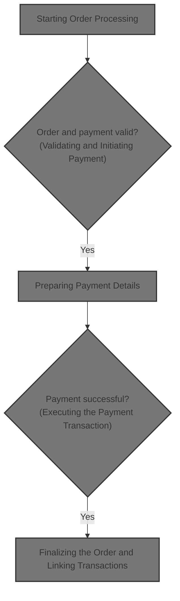
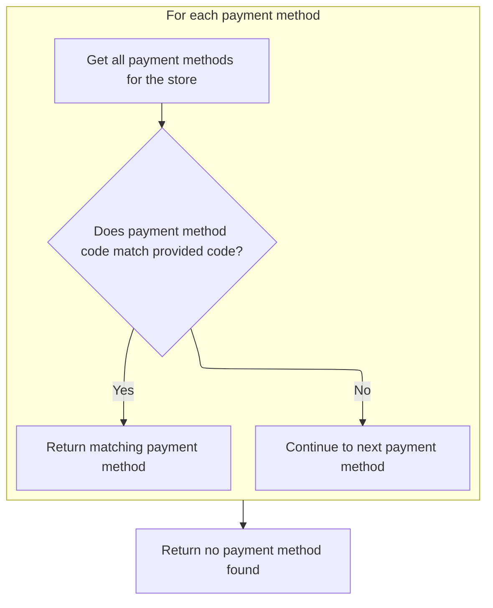

This document describes how a customer's order is processed, from validating order and payment information to completing payment and finalizing the order. The flow ensures payment is handled, order status is set, and the order is saved and linked to the customer and transactions. Input includes order, customer, items, summary, payment, and store details; output is a finalized order with payment and status recorded.



# Starting Order Processing

<SwmSnippet path="/shopizer/sm-core/src/main/java/com/salesmanager/core/business/order/service/OrderServiceImpl.java" line="94">

---

ProcessOrder is just the entry point for starting an order. It hands off all the details to process, passing along the parameters and setting transaction to null, so the actual work happens in the next method.

```java
    public Order processOrder(Order order, Customer customer, List<ShoppingCartItem> items, OrderTotalSummary summary, Payment payment, MerchantStore store) throws ServiceException {
    	
    	return this.process(order, customer, items, summary, payment, null, store);
    }
```

---

</SwmSnippet>

# Validating and Initiating Payment

<SwmSnippet path="/shopizer/sm-core/src/main/java/com/salesmanager/core/business/order/service/OrderServiceImpl.java" line="105">

---

In process, we check that all the required objects are present and valid. Then, we immediately process the payment, since there's no point in continuing if payment can't go through. That's why we call <SwmToken path="shopizer/sm-core/src/main/java/com/salesmanager/core/business/order/service/OrderServiceImpl.java" pos="116:7:9" line-data="    	Transaction processTransaction = paymentService.processPayment(customer, store, payment, items, order);">`paymentService.processPayment`</SwmToken> next.

```java
    private Order process(Order order, Customer customer, List<ShoppingCartItem> items, OrderTotalSummary summary, Payment payment, Transaction transaction, MerchantStore store) throws ServiceException {
    	
    	
    	Validate.notNull(order, "Order cannot be null");
    	Validate.notNull(customer, "Customer cannot be null (even if anonymous order)");
    	Validate.notEmpty(items, "ShoppingCart items cannot be null");
    	Validate.notNull(payment, "Payment cannot be null");
    	Validate.notNull(store, "MerchantStore cannot be null");
    	Validate.notNull(summary, "Order total Summary cannot be null");
    	
    	//first process payment
    	Transaction processTransaction = paymentService.processPayment(customer, store, payment, items, order);
```

---

</SwmSnippet>

## Preparing Payment Details

<SwmSnippet path="/shopizer/sm-core/src/main/java/com/salesmanager/core/business/payments/service/PaymentServiceImpl.java" line="296">

---

In <SwmToken path="shopizer/sm-core/src/main/java/com/salesmanager/core/business/payments/service/PaymentServiceImpl.java" pos="296:5:5" line-data="	public Transaction processPayment(Customer customer,">`processPayment`</SwmToken>, we validate all the payment and order details, set up the currency, and check that the right payment module is configured and active. Next, we fetch the integration module by code to get the right payment provider setup for this transaction.

```java
	public Transaction processPayment(Customer customer,
			MerchantStore store, Payment payment, List<ShoppingCartItem> items, Order order)
			throws ServiceException {


		Validate.notNull(customer);
		Validate.notNull(store);
		Validate.notNull(payment);
		Validate.notNull(order);
		Validate.notNull(order.getTotal());
		
		payment.setCurrency(store.getCurrency());
		
		BigDecimal amount = order.getTotal();

		//must have a shipping module configured
		Map<String, IntegrationConfiguration> modules = this.getPaymentModulesConfigured(store);
		if(modules==null){
			throw new ServiceException("No payment module configured");
		}
		
		IntegrationConfiguration configuration = modules.get(payment.getModuleName());
		
		if(configuration==null) {
			throw new ServiceException("Payment module " + payment.getModuleName() + " is not configured");
		}
		
		if(!configuration.isActive()) {
			throw new ServiceException("Payment module " + payment.getModuleName() + " is not active");
		}
		
		String sTransactionType = configuration.getIntegrationKeys().get("transaction");
		if(sTransactionType==null) {
			sTransactionType = TransactionType.AUTHORIZECAPTURE.name();
		}
		

		if(sTransactionType.equals(TransactionType.AUTHORIZE.name())) {
			payment.setTransactionType(TransactionType.AUTHORIZE);
		} else {
			payment.setTransactionType(TransactionType.AUTHORIZECAPTURE);
		} 
		

		PaymentModule module = this.paymentModules.get(payment.getModuleName());
		
		if(module==null) {
			throw new ServiceException("Payment module " + payment.getModuleName() + " does not exist");
		}
		
		if(payment instanceof CreditCardPayment) {
			CreditCardPayment creditCardPayment = (CreditCardPayment)payment;
			validateCreditCard(creditCardPayment.getCreditCardNumber(),creditCardPayment.getCreditCard(),creditCardPayment.getExpirationMonth(),creditCardPayment.getExpirationYear());
		}
		
		IntegrationModule integrationModule = getPaymentMethodByCode(store,payment.getModuleName());
```

---

</SwmSnippet>

### Locating the Payment Integration Module



<SwmSnippet path="/shopizer/sm-core/src/main/java/com/salesmanager/core/business/payments/service/PaymentServiceImpl.java" line="147">

---

GetPaymentMethodByCode loops through all available payment modules for the store and returns the one matching the requested code. If it doesn't find it, we return null, which will trigger an error upstream.

```java
	public IntegrationModule getPaymentMethodByCode(MerchantStore store,
			String code) throws ServiceException {
		List<IntegrationModule> modules =  getPaymentMethods(store);

		for(IntegrationModule module : modules) {
			if(module.getCode().equals(code)) {
				
				return module;
			}
		}
		
		return null;
	}
```

---

</SwmSnippet>

### Fetching Available Payment Methods

See <SwmLink doc-title="Getting available payment methods for a store">[Getting available payment methods for a store](.swm%5Cgetting-available-payment-methods-for-a-store.hhjbde0c.sw.md)</SwmLink>

### Executing the Payment Transaction

```mermaid
%%{init: {"flowchart": {"defaultRenderer": "elk"}} }%%
flowchart TD
    node1["Start payment processing"] --> node2{"Is transaction type CAPTURE?"}
    click node1 openCode "shopizer/sm-core/src/main/java/com/salesmanager/core/business/payments/service/PaymentServiceImpl.java:352:353"
    click node2 openCode "shopizer/sm-core/src/main/java/com/salesmanager/core/business/payments/service/PaymentServiceImpl.java:355:357"
    node2 -->|"Yes"| node3["Throw error: Use processCapturePayment"]
    click node3 openCode "shopizer/sm-core/src/main/java/com/salesmanager/core/business/payments/service/PaymentServiceImpl.java:356:357"
    node2 -->|"No"| node4{"Transaction type?"}
    click node4 openCode "shopizer/sm-core/src/main/java/com/salesmanager/core/business/payments/service/PaymentServiceImpl.java:361:367"
    node4 -->|"AUTHORIZE"| node5["Authorize payment"]
    click node5 openCode "shopizer/sm-core/src/main/java/com/salesmanager/core/business/payments/service/PaymentServiceImpl.java:362:363"
    node4 -->|"AUTHORIZECAPTURE"| node6["Authorize and capture payment"]
    click node6 openCode "shopizer/sm-core/src/main/java/com/salesmanager/core/business/payments/service/PaymentServiceImpl.java:364:365"
    node4 -->|"INIT"| node7["Initialize transaction"]
    click node7 openCode "shopizer/sm-core/src/main/java/com/salesmanager/core/business/payments/service/PaymentServiceImpl.java:366:367"
    node5 --> node8{"Is transaction type INIT?"}
    node6 --> node8
    node7 --> node8
    node8 -->|"No (AUTHORIZE/AUTHORIZECAPTURE)"| node9["Record transaction"]
    click node9 openCode "shopizer/sm-core/src/main/java/com/salesmanager/core/business/payments/service/PaymentServiceImpl.java:371:372"
    node8 -->|"Yes (INIT)"| node16["Return transaction"]
    click node16 openCode "shopizer/sm-core/src/main/java/com/salesmanager/core/business/payments/service/PaymentServiceImpl.java:381:381"
    node9 --> node11{"Is transaction type AUTHORIZECAPTURE?"}
    node11 -->|"Yes"| node12["Set order status to ORDERED"]
    click node12 openCode "shopizer/sm-core/src/main/java/com/salesmanager/core/business/payments/service/PaymentServiceImpl.java:375:376"
    node12 --> node13{"Is payment type MONEYORDER?"}
    click node13 openCode "shopizer/sm-core/src/main/java/com/salesmanager/core/business/payments/service/PaymentServiceImpl.java:376:378"
    node13 -->|"No"| node14["Set order status to PROCESSED"]
    click node14 openCode "shopizer/sm-core/src/main/java/com/salesmanager/core/business/payments/service/PaymentServiceImpl.java:377:378"
    node13 -->|"Yes"| node15["Keep status as ORDERED"]
    click node15 openCode "shopizer/sm-core/src/main/java/com/salesmanager/core/business/payments/service/PaymentServiceImpl.java:375:378"
    node14 --> node16
    node15 --> node16
    node11 -->|"No"| node16

classDef HeadingStyle fill:#777777,stroke:#333,stroke-width:2px;

%% Swimm:
%% %%{init: {"flowchart": {"defaultRenderer": "elk"}} }%%
%% flowchart TD
%%     node1["Start payment processing"] --> node2{"Is transaction type CAPTURE?"}
%%     click node1 openCode "<SwmPath>[shopizer/…/service/PaymentServiceImpl.java](shopizer/sm-core/src/main/java/com/salesmanager/core/business/payments/service/PaymentServiceImpl.java)</SwmPath>:352:353"
%%     click node2 openCode "<SwmPath>[shopizer/…/service/PaymentServiceImpl.java](shopizer/sm-core/src/main/java/com/salesmanager/core/business/payments/service/PaymentServiceImpl.java)</SwmPath>:355:357"
%%     node2 -->|"Yes"| node3["Throw error: Use <SwmToken path="shopizer/sm-core/src/main/java/com/salesmanager/core/business/payments/service/PaymentServiceImpl.java" pos="356:29:29" line-data="				throw new ServiceException(&quot;This method does not allow to process capture transaction. Use processCapturePayment&quot;);">`processCapturePayment`</SwmToken>"]
%%     click node3 openCode "<SwmPath>[shopizer/…/service/PaymentServiceImpl.java](shopizer/sm-core/src/main/java/com/salesmanager/core/business/payments/service/PaymentServiceImpl.java)</SwmPath>:356:357"
%%     node2 -->|"No"| node4{"Transaction type?"}
%%     click node4 openCode "<SwmPath>[shopizer/…/service/PaymentServiceImpl.java](shopizer/sm-core/src/main/java/com/salesmanager/core/business/payments/service/PaymentServiceImpl.java)</SwmPath>:361:367"
%%     node4 -->|"AUTHORIZE"| node5["Authorize payment"]
%%     click node5 openCode "<SwmPath>[shopizer/…/service/PaymentServiceImpl.java](shopizer/sm-core/src/main/java/com/salesmanager/core/business/payments/service/PaymentServiceImpl.java)</SwmPath>:362:363"
%%     node4 -->|"AUTHORIZECAPTURE"| node6["Authorize and capture payment"]
%%     click node6 openCode "<SwmPath>[shopizer/…/service/PaymentServiceImpl.java](shopizer/sm-core/src/main/java/com/salesmanager/core/business/payments/service/PaymentServiceImpl.java)</SwmPath>:364:365"
%%     node4 -->|"INIT"| node7["Initialize transaction"]
%%     click node7 openCode "<SwmPath>[shopizer/…/service/PaymentServiceImpl.java](shopizer/sm-core/src/main/java/com/salesmanager/core/business/payments/service/PaymentServiceImpl.java)</SwmPath>:366:367"
%%     node5 --> node8{"Is transaction type INIT?"}
%%     node6 --> node8
%%     node7 --> node8
%%     node8 -->|"No (AUTHORIZE/AUTHORIZECAPTURE)"| node9["Record transaction"]
%%     click node9 openCode "<SwmPath>[shopizer/…/service/PaymentServiceImpl.java](shopizer/sm-core/src/main/java/com/salesmanager/core/business/payments/service/PaymentServiceImpl.java)</SwmPath>:371:372"
%%     node8 -->|"Yes (INIT)"| node16["Return transaction"]
%%     click node16 openCode "<SwmPath>[shopizer/…/service/PaymentServiceImpl.java](shopizer/sm-core/src/main/java/com/salesmanager/core/business/payments/service/PaymentServiceImpl.java)</SwmPath>:381:381"
%%     node9 --> node11{"Is transaction type AUTHORIZECAPTURE?"}
%%     node11 -->|"Yes"| node12["Set order status to ORDERED"]
%%     click node12 openCode "<SwmPath>[shopizer/…/service/PaymentServiceImpl.java](shopizer/sm-core/src/main/java/com/salesmanager/core/business/payments/service/PaymentServiceImpl.java)</SwmPath>:375:376"
%%     node12 --> node13{"Is payment type MONEYORDER?"}
%%     click node13 openCode "<SwmPath>[shopizer/…/service/PaymentServiceImpl.java](shopizer/sm-core/src/main/java/com/salesmanager/core/business/payments/service/PaymentServiceImpl.java)</SwmPath>:376:378"
%%     node13 -->|"No"| node14["Set order status to PROCESSED"]
%%     click node14 openCode "<SwmPath>[shopizer/…/service/PaymentServiceImpl.java](shopizer/sm-core/src/main/java/com/salesmanager/core/business/payments/service/PaymentServiceImpl.java)</SwmPath>:377:378"
%%     node13 -->|"Yes"| node15["Keep status as ORDERED"]
%%     click node15 openCode "<SwmPath>[shopizer/…/service/PaymentServiceImpl.java](shopizer/sm-core/src/main/java/com/salesmanager/core/business/payments/service/PaymentServiceImpl.java)</SwmPath>:375:378"
%%     node14 --> node16
%%     node15 --> node16
%%     node11 -->|"No"| node16
%% 
%% classDef HeadingStyle fill:#777777,stroke:#333,stroke-width:2px;
```



<SwmSnippet path="/shopizer/sm-core/src/main/java/com/salesmanager/core/business/payments/service/PaymentServiceImpl.java" line="352">

---

Back in <SwmToken path="shopizer/sm-core/src/main/java/com/salesmanager/core/business/order/service/OrderServiceImpl.java" pos="116:9:9" line-data="    	Transaction processTransaction = paymentService.processPayment(customer, store, payment, items, order);">`processPayment`</SwmToken>, after getting the integration module, we figure out the transaction type and call the right method on the payment module (authorize, <SwmToken path="shopizer/sm-core/src/main/java/com/salesmanager/core/business/payments/service/PaymentServiceImpl.java" pos="364:7:7" line-data="			transaction = module.authorizeAndCapture(store, customer, items, amount, payment, configuration, integrationModule);">`authorizeAndCapture`</SwmToken>, or <SwmToken path="shopizer/sm-core/src/main/java/com/salesmanager/core/business/payments/service/PaymentServiceImpl.java" pos="366:7:7" line-data="			transaction = module.initTransaction(store, customer, amount, payment, configuration, integrationModule);">`initTransaction`</SwmToken>). We also update the order status and save the transaction if needed, then return the transaction object.

```java
		TransactionType transactionType = TransactionType.valueOf(sTransactionType);
		if(transactionType==null) {
			transactionType = payment.getTransactionType();
			if(transactionType.equals(TransactionType.CAPTURE.name())) {
				throw new ServiceException("This method does not allow to process capture transaction. Use processCapturePayment");
			}
		}
		
		Transaction transaction = null;
		if(transactionType == TransactionType.AUTHORIZE)  {
			transaction = module.authorize(store, customer, items, amount, payment, configuration, integrationModule);
		} else if(transactionType == TransactionType.AUTHORIZECAPTURE)  {
			transaction = module.authorizeAndCapture(store, customer, items, amount, payment, configuration, integrationModule);
		} else if(transactionType == TransactionType.INIT)  {
			transaction = module.initTransaction(store, customer, amount, payment, configuration, integrationModule);
		}


		if(transactionType != TransactionType.INIT) {
			transactionService.create(transaction);
		}
		
		if(transactionType == TransactionType.AUTHORIZECAPTURE)  {
			order.setStatus(OrderStatus.ORDERED);
			if(payment.getPaymentType().name()!=PaymentType.MONEYORDER.name()) {
				order.setStatus(OrderStatus.PROCESSED);
			}
		}

		return transaction;

		

	}
```

---

</SwmSnippet>

## Finalizing the Order and Linking Transactions

```mermaid
%%{init: {"flowchart": {"defaultRenderer": "elk"}} }%%
flowchart TD
    node1["Start order processing"] --> node2{"Order status/history missing?"}
    click node1 openCode "shopizer/sm-core/src/main/java/com/salesmanager/core/business/order/service/OrderServiceImpl.java:117:119"
    node2 -->|"Yes"| node3["Set order status to ORDERED and create history"]
    click node2 openCode "shopizer/sm-core/src/main/java/com/salesmanager/core/business/order/service/OrderServiceImpl.java:119:133"
    node2 -->|"No"| node4{"Customer is new (ID is null/0)?"}
    click node3 openCode "shopizer/sm-core/src/main/java/com/salesmanager/core/business/order/service/OrderServiceImpl.java:120:133"
    node3 --> node4
    node4 -->|"Yes"| node5["Create customer"]
    click node4 openCode "shopizer/sm-core/src/main/java/com/salesmanager/core/business/order/service/OrderServiceImpl.java:135:137"
    node4 -->|"No"| node6["Save order"]
    click node5 openCode "shopizer/sm-core/src/main/java/com/salesmanager/core/business/order/service/OrderServiceImpl.java:136:137"
    node5 --> node6
    node6["Save order"] --> node7{"Transaction exists?"}
    click node6 openCode "shopizer/sm-core/src/main/java/com/salesmanager/core/business/order/service/OrderServiceImpl.java:139:141"
    node7 -->|"Yes"| node8{"Transaction is new (ID is null/0)?"}
    click node7 openCode "shopizer/sm-core/src/main/java/com/salesmanager/core/business/order/service/OrderServiceImpl.java:143:145"
    node7 -->|"No"| node11{"ProcessTransaction exists?"}
    node8 -->|"Yes"| node9["Create transaction"]
    click node8 openCode "shopizer/sm-core/src/main/java/com/salesmanager/core/business/order/service/OrderServiceImpl.java:145:146"
    node8 -->|"No"| node10["Update transaction"]
    click node9 openCode "shopizer/sm-core/src/main/java/com/salesmanager/core/business/order/service/OrderServiceImpl.java:146:147"
    click node10 openCode "shopizer/sm-core/src/main/java/com/salesmanager/core/business/order/service/OrderServiceImpl.java:148:149"
    node9 --> node11
    node10 --> node11
    node11 -->|"Yes"| node12{"ProcessTransaction is new (ID is null/0)?"}
    click node11 openCode "shopizer/sm-core/src/main/java/com/salesmanager/core/business/order/service/OrderServiceImpl.java:152:154"
    node11 -->|"No"| node15["Return order"]
    node12 -->|"Yes"| node13["Create processTransaction"]
    click node12 openCode "shopizer/sm-core/src/main/java/com/salesmanager/core/business/order/service/OrderServiceImpl.java:154:155"
    node12 -->|"No"| node14["Update processTransaction"]
    click node13 openCode "shopizer/sm-core/src/main/java/com/salesmanager/core/business/order/service/OrderServiceImpl.java:155:156"
    click node14 openCode "shopizer/sm-core/src/main/java/com/salesmanager/core/business/order/service/OrderServiceImpl.java:157:158"
    node13 --> node15
    node14 --> node15
    node15["Return order"]
    click node15 openCode "shopizer/sm-core/src/main/java/com/salesmanager/core/business/order/service/OrderServiceImpl.java:161:161"
classDef HeadingStyle fill:#777777,stroke:#333,stroke-width:2px;

%% Swimm:
%% %%{init: {"flowchart": {"defaultRenderer": "elk"}} }%%
%% flowchart TD
%%     node1["Start order processing"] --> node2{"Order status/history missing?"}
%%     click node1 openCode "<SwmPath>[shopizer/…/service/OrderServiceImpl.java](shopizer/sm-core/src/main/java/com/salesmanager/core/business/order/service/OrderServiceImpl.java)</SwmPath>:117:119"
%%     node2 -->|"Yes"| node3["Set order status to ORDERED and create history"]
%%     click node2 openCode "<SwmPath>[shopizer/…/service/OrderServiceImpl.java](shopizer/sm-core/src/main/java/com/salesmanager/core/business/order/service/OrderServiceImpl.java)</SwmPath>:119:133"
%%     node2 -->|"No"| node4{"Customer is new (ID is null/0)?"}
%%     click node3 openCode "<SwmPath>[shopizer/…/service/OrderServiceImpl.java](shopizer/sm-core/src/main/java/com/salesmanager/core/business/order/service/OrderServiceImpl.java)</SwmPath>:120:133"
%%     node3 --> node4
%%     node4 -->|"Yes"| node5["Create customer"]
%%     click node4 openCode "<SwmPath>[shopizer/…/service/OrderServiceImpl.java](shopizer/sm-core/src/main/java/com/salesmanager/core/business/order/service/OrderServiceImpl.java)</SwmPath>:135:137"
%%     node4 -->|"No"| node6["Save order"]
%%     click node5 openCode "<SwmPath>[shopizer/…/service/OrderServiceImpl.java](shopizer/sm-core/src/main/java/com/salesmanager/core/business/order/service/OrderServiceImpl.java)</SwmPath>:136:137"
%%     node5 --> node6
%%     node6["Save order"] --> node7{"Transaction exists?"}
%%     click node6 openCode "<SwmPath>[shopizer/…/service/OrderServiceImpl.java](shopizer/sm-core/src/main/java/com/salesmanager/core/business/order/service/OrderServiceImpl.java)</SwmPath>:139:141"
%%     node7 -->|"Yes"| node8{"Transaction is new (ID is null/0)?"}
%%     click node7 openCode "<SwmPath>[shopizer/…/service/OrderServiceImpl.java](shopizer/sm-core/src/main/java/com/salesmanager/core/business/order/service/OrderServiceImpl.java)</SwmPath>:143:145"
%%     node7 -->|"No"| node11{"ProcessTransaction exists?"}
%%     node8 -->|"Yes"| node9["Create transaction"]
%%     click node8 openCode "<SwmPath>[shopizer/…/service/OrderServiceImpl.java](shopizer/sm-core/src/main/java/com/salesmanager/core/business/order/service/OrderServiceImpl.java)</SwmPath>:145:146"
%%     node8 -->|"No"| node10["Update transaction"]
%%     click node9 openCode "<SwmPath>[shopizer/…/service/OrderServiceImpl.java](shopizer/sm-core/src/main/java/com/salesmanager/core/business/order/service/OrderServiceImpl.java)</SwmPath>:146:147"
%%     click node10 openCode "<SwmPath>[shopizer/…/service/OrderServiceImpl.java](shopizer/sm-core/src/main/java/com/salesmanager/core/business/order/service/OrderServiceImpl.java)</SwmPath>:148:149"
%%     node9 --> node11
%%     node10 --> node11
%%     node11 -->|"Yes"| node12{"ProcessTransaction is new (ID is null/0)?"}
%%     click node11 openCode "<SwmPath>[shopizer/…/service/OrderServiceImpl.java](shopizer/sm-core/src/main/java/com/salesmanager/core/business/order/service/OrderServiceImpl.java)</SwmPath>:152:154"
%%     node11 -->|"No"| node15["Return order"]
%%     node12 -->|"Yes"| node13["Create <SwmToken path="shopizer/sm-core/src/main/java/com/salesmanager/core/business/order/service/OrderServiceImpl.java" pos="116:3:3" line-data="    	Transaction processTransaction = paymentService.processPayment(customer, store, payment, items, order);">`processTransaction`</SwmToken>"]
%%     click node12 openCode "<SwmPath>[shopizer/…/service/OrderServiceImpl.java](shopizer/sm-core/src/main/java/com/salesmanager/core/business/order/service/OrderServiceImpl.java)</SwmPath>:154:155"
%%     node12 -->|"No"| node14["Update <SwmToken path="shopizer/sm-core/src/main/java/com/salesmanager/core/business/order/service/OrderServiceImpl.java" pos="116:3:3" line-data="    	Transaction processTransaction = paymentService.processPayment(customer, store, payment, items, order);">`processTransaction`</SwmToken>"]
%%     click node13 openCode "<SwmPath>[shopizer/…/service/OrderServiceImpl.java](shopizer/sm-core/src/main/java/com/salesmanager/core/business/order/service/OrderServiceImpl.java)</SwmPath>:155:156"
%%     click node14 openCode "<SwmPath>[shopizer/…/service/OrderServiceImpl.java](shopizer/sm-core/src/main/java/com/salesmanager/core/business/order/service/OrderServiceImpl.java)</SwmPath>:157:158"
%%     node13 --> node15
%%     node14 --> node15
%%     node15["Return order"]
%%     click node15 openCode "<SwmPath>[shopizer/…/service/OrderServiceImpl.java](shopizer/sm-core/src/main/java/com/salesmanager/core/business/order/service/OrderServiceImpl.java)</SwmPath>:161:161"
%% classDef HeadingStyle fill:#777777,stroke:#333,stroke-width:2px;
```



<SwmSnippet path="/shopizer/sm-core/src/main/java/com/salesmanager/core/business/order/service/OrderServiceImpl.java" line="117">

---

Back in process, after payment is handled, we set up order history and status if needed, create the customer if they're new, save the order, and then link any transactions to the order, creating or updating them as necessary. This ties everything together before returning the order.

```java
    	//transactionService.save(processTransaction);
    	
    	if(order.getOrderHistory()==null || order.getOrderHistory().size()==0 || order.getStatus()==null) {
    		OrderStatus status = order.getStatus();
    		if(status==null) {
    			status = OrderStatus.ORDERED;
    			order.setStatus(status);
    		}
    		Set<OrderStatusHistory> statusHistorySet = new HashSet<OrderStatusHistory>();
    		OrderStatusHistory statusHistory = new OrderStatusHistory();
    		statusHistory.setStatus(status);
    		statusHistory.setDateAdded(new Date());
    		statusHistory.setOrder(order);
    		statusHistorySet.add(statusHistory);
    		order.setOrderHistory(statusHistorySet);
    		
    	}
    	
    	if(customer.getId()==null || customer.getId()==0) {
    		customerService.create(customer);
    	}
    	
    	order.setCustomerId(customer.getId());
    	
    	this.create(order);

    	if(transaction!=null) {
    		transaction.setOrder(order);
    		if(transaction.getId()==null || transaction.getId()==0) {
    			transactionService.create(transaction);
    		} else {
    			transactionService.update(transaction);
    		}
    	}
    	
    	if(processTransaction!=null) {
    		processTransaction.setOrder(order);
    		if(processTransaction.getId()==null || processTransaction.getId()==0) {
    			transactionService.create(processTransaction);
    		} else {
    			transactionService.update(processTransaction);
    		}
    	}
    	
    	return order;
    	
    	
    }
```

---

</SwmSnippet>

&nbsp;

*This is an auto-generated document by Swimm 🌊 and has not yet been verified by a human*

<SwmMeta version="3.0.0" repo-id="Z2l0aHViJTNBJTNBU2hvcGl6ZXIlM0ElM0F1bWFsaW5nYXN3YW1p" repo-name="Shopizer"><sup>Powered by [Swimm](https://app.swimm.io/)</sup></SwmMeta>
