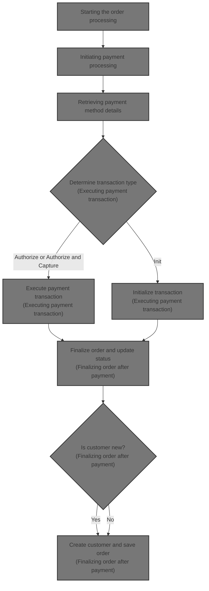
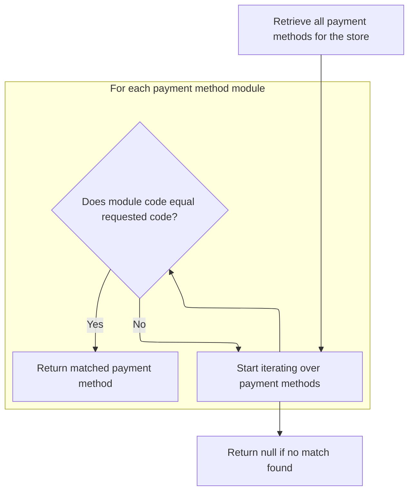
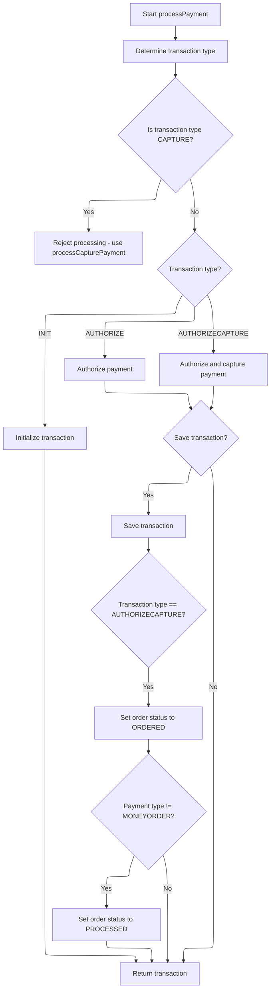

This document describes the flow of processing an order from initial validation through payment processing to final order finalization. It explains how customer and payment details are validated, payment modules are confirmed active, payment transactions are executed, and the order status is updated and saved.



# Starting the order processing

This section handles the initial steps of order processing by validating inputs and ensuring payment is processed before finalizing the order.

| Category        | Rule Name                              | Description                                                                                |
| --------------- | -------------------------------------- | ------------------------------------------------------------------------------------------ |
| Data validation | Customer information required          | The customer information must be provided, even if the order is anonymous.                 |
| Data validation | Non-empty shopping cart                | The shopping cart must contain at least one item to proceed with the order.                |
| Data validation | Payment required                       | Payment details must be provided and valid before processing the order.                    |
| Data validation | Merchant store association             | Merchant store information must be provided to associate the order with the correct store. |
| Data validation | Order total verification               | Order total summary must be provided to verify the financial details of the order.         |
| Business logic  | Payment processing before finalization | Payment must be processed successfully before the order can be finalized.                  |

<SwmSnippet path="/shopizer/sm-core/src/main/java/com/salesmanager/core/business/order/service/OrderServiceImpl.java" line="105">

---

We start by validating inputs and processing payment to ensure payment is handled before order finalization.

```java
    private Order process(Order order, Customer customer, List<ShoppingCartItem> items, OrderTotalSummary summary, Payment payment, Transaction transaction, MerchantStore store) throws ServiceException {
    	
    	
    	Validate.notNull(order, "Order cannot be null");
    	Validate.notNull(customer, "Customer cannot be null (even if anonymous order)");
    	Validate.notEmpty(items, "ShoppingCart items cannot be null");
    	Validate.notNull(payment, "Payment cannot be null");
    	Validate.notNull(store, "MerchantStore cannot be null");
    	Validate.notNull(summary, "Order total Summary cannot be null");
    	
    	//first process payment
    	Transaction processTransaction = paymentService.processPayment(customer, store, payment, items, order);
```

---

</SwmSnippet>

## Initiating payment processing

This section handles the initiation of payment processing by validating inputs, confirming payment module configuration and activation, and setting transaction types before processing the payment.

| Category        | Rule Name                             | Description                                                                                                                            |
| --------------- | ------------------------------------- | -------------------------------------------------------------------------------------------------------------------------------------- |
| Data validation | Mandatory input validation            | Customer, merchant store, payment, order, and order total must be present and not null before processing payment.                      |
| Data validation | Credit card validation                | If the payment is a credit card payment, the credit card number, type, expiration month, and year must be validated before processing. |
| Business logic  | Payment module configuration required | A payment module must be configured for the merchant store to process payments.                                                        |
| Business logic  | Active payment module enforcement     | The payment module specified in the payment details must be configured and active for the merchant store.                              |
| Business logic  | Default transaction type              | If the payment module does not specify a transaction type, default to AUTHORIZECAPTURE transaction type.                               |
| Business logic  | Transaction type assignment           | Payment transaction type must be set to AUTHORIZE if specified, otherwise set to AUTHORIZECAPTURE.                                     |

<SwmSnippet path="/shopizer/sm-core/src/main/java/com/salesmanager/core/business/payments/service/PaymentServiceImpl.java" line="296">

---

We validate inputs and confirm the payment module is configured and active before proceeding.

```java
	public Transaction processPayment(Customer customer,
			MerchantStore store, Payment payment, List<ShoppingCartItem> items, Order order)
			throws ServiceException {


		Validate.notNull(customer);
		Validate.notNull(store);
		Validate.notNull(payment);
		Validate.notNull(order);
		Validate.notNull(order.getTotal());
		
		payment.setCurrency(store.getCurrency());
		
		BigDecimal amount = order.getTotal();

		//must have a shipping module configured
		Map<String, IntegrationConfiguration> modules = this.getPaymentModulesConfigured(store);
		if(modules==null){
			throw new ServiceException("No payment module configured");
		}
		
		IntegrationConfiguration configuration = modules.get(payment.getModuleName());
		
		if(configuration==null) {
			throw new ServiceException("Payment module " + payment.getModuleName() + " is not configured");
		}
		
		if(!configuration.isActive()) {
			throw new ServiceException("Payment module " + payment.getModuleName() + " is not active");
		}
		
		String sTransactionType = configuration.getIntegrationKeys().get("transaction");
		if(sTransactionType==null) {
			sTransactionType = TransactionType.AUTHORIZECAPTURE.name();
		}
		

		if(sTransactionType.equals(TransactionType.AUTHORIZE.name())) {
			payment.setTransactionType(TransactionType.AUTHORIZE);
		} else {
			payment.setTransactionType(TransactionType.AUTHORIZECAPTURE);
		} 
		

		PaymentModule module = this.paymentModules.get(payment.getModuleName());
		
		if(module==null) {
			throw new ServiceException("Payment module " + payment.getModuleName() + " does not exist");
		}
		
		if(payment instanceof CreditCardPayment) {
			CreditCardPayment creditCardPayment = (CreditCardPayment)payment;
			validateCreditCard(creditCardPayment.getCreditCardNumber(),creditCardPayment.getCreditCard(),creditCardPayment.getExpirationMonth(),creditCardPayment.getExpirationYear());
		}
		
		IntegrationModule integrationModule = getPaymentMethodByCode(store,payment.getModuleName());
```

---

</SwmSnippet>

### Retrieving payment method details



This section describes the process of retrieving payment method details by matching a payment method code within a store's available payment methods.

| Category       | Rule Name                     | Description                                                                                                                           |
| -------------- | ----------------------------- | ------------------------------------------------------------------------------------------------------------------------------------- |
| Business logic | Retrieve all payment methods  | The system must retrieve all payment methods available for the given store before searching for a specific payment method.            |
| Business logic | Match payment method code     | The system must compare the requested payment method code with each payment method's code in the store's list to find an exact match. |
| Business logic | Return matched payment method | If a payment method with the requested code is found, the system must return the corresponding payment method integration details.    |
| Business logic | Return null if no match       | If no payment method matches the requested code, the system must return null to indicate no match was found.                          |

<SwmSnippet path="/shopizer/sm-core/src/main/java/com/salesmanager/core/business/payments/service/PaymentServiceImpl.java" line="147">

---

We find the payment method by code to get its integration details for processing.

```java
	public IntegrationModule getPaymentMethodByCode(MerchantStore store,
			String code) throws ServiceException {
		List<IntegrationModule> modules =  getPaymentMethods(store);

		for(IntegrationModule module : modules) {
			if(module.getCode().equals(code)) {
				
				return module;
			}
		}
		
		return null;
	}
```

---

</SwmSnippet>

### Listing available payment methods

This section lists the available payment methods for customers during the checkout process in the e-commerce platform.

| Category       | Rule Name                       | Description                                                                                         |
| -------------- | ------------------------------- | --------------------------------------------------------------------------------------------------- |
| Business logic | Consistent Payment Method Order | Payment methods should be displayed in a consistent order to provide a predictable user experience. |

See <SwmLink doc-title="Retrieving applicable payment methods">[Retrieving applicable payment methods](\.swm\retrieving-applicable-payment-methods.mpq2vdqh.sw.md)</SwmLink>

### Executing payment transaction



<SwmSnippet path="/shopizer/sm-core/src/main/java/com/salesmanager/core/business/payments/service/PaymentServiceImpl.java" line="352">

---

After returning from `getPaymentMethodByCode`, we determine the transaction type and call the appropriate payment module method to process the payment. Then we save the transaction and update order status based on payment type.

```java
		TransactionType transactionType = TransactionType.valueOf(sTransactionType);
		if(transactionType==null) {
			transactionType = payment.getTransactionType();
			if(transactionType.equals(TransactionType.CAPTURE.name())) {
				throw new ServiceException("This method does not allow to process capture transaction. Use processCapturePayment");
			}
		}
		
		Transaction transaction = null;
		if(transactionType == TransactionType.AUTHORIZE)  {
			transaction = module.authorize(store, customer, items, amount, payment, configuration, integrationModule);
		} else if(transactionType == TransactionType.AUTHORIZECAPTURE)  {
			transaction = module.authorizeAndCapture(store, customer, items, amount, payment, configuration, integrationModule);
		} else if(transactionType == TransactionType.INIT)  {
			transaction = module.initTransaction(store, customer, amount, payment, configuration, integrationModule);
		}


		if(transactionType != TransactionType.INIT) {
			transactionService.create(transaction);
		}
		
		if(transactionType == TransactionType.AUTHORIZECAPTURE)  {
			order.setStatus(OrderStatus.ORDERED);
			if(payment.getPaymentType().name()!=PaymentType.MONEYORDER.name()) {
				order.setStatus(OrderStatus.PROCESSED);
			}
		}

		return transaction;

		

	}
```

---

</SwmSnippet>

## Finalizing order after payment

```mermaid
%%{init: {"flowchart": {"defaultRenderer": "elk"}} }%%
flowchart TD
    node1["Start order processing"] --> node2{"Order history empty or status null?"}
    click node1 openCode "shopizer/sm-core/src/main/java/com/salesmanager/core/business/order/service/OrderServiceImpl.java:117:118"
    node2 -->|"Yes"| node3["Initialize order status and history"]
    click node2 openCode "shopizer/sm-core/src/main/java/com/salesmanager/core/business/order/service/OrderServiceImpl.java:119:133"
    node2 -->|"No"| node4["Skip initialization"]
    click node4 openCode "shopizer/sm-core/src/main/java/com/salesmanager/core/business/order/service/OrderServiceImpl.java:134:134"
    node3 --> node4
    node4 --> node5{"Is customer new?"}
    click node5 openCode "shopizer/sm-core/src/main/java/com/salesmanager/core/business/order/service/OrderServiceImpl.java:135:137"
    node5 -->|"Yes"| node6["Create customer"]
    click node6 openCode "shopizer/sm-core/src/main/java/com/salesmanager/core/business/order/service/OrderServiceImpl.java:136:136"
    node5 -->|"No"| node7["Skip customer creation"]
    click node7 openCode "shopizer/sm-core/src/main/java/com/salesmanager/core/business/order/service/OrderServiceImpl.java:137:137"
    node6 --> node7
    node7 --> node8["Save order"]
    click node8 openCode "shopizer/sm-core/src/main/java/com/salesmanager/core/business/order/service/OrderServiceImpl.java:141:141"
    node8 --> node9{"Transaction exists?"}
    click node9 openCode "shopizer/sm-core/src/main/java/com/salesmanager/core/business/order/service/OrderServiceImpl.java:143:150"
    node9 -->|"No"| node12["Skip transaction handling"]
    click node12 openCode "shopizer/sm-core/src/main/java/com/salesmanager/core/business/order/service/OrderServiceImpl.java:150:150"
    node9 -->|"Yes"| node10{"Transaction is new?"}
    click node10 openCode "shopizer/sm-core/src/main/java/com/salesmanager/core/business/order/service/OrderServiceImpl.java:145:149"
    node10 -->|"Yes"| node11["Create transaction"]
    click node11 openCode "shopizer/sm-core/src/main/java/com/salesmanager/core/business/order/service/OrderServiceImpl.java:146:146"
    node10 -->|"No"| node13["Update transaction"]
    click node13 openCode "shopizer/sm-core/src/main/java/com/salesmanager/core/business/order/service/OrderServiceImpl.java:148:149"
    node11 --> node12
    node13 --> node12
    node12 --> node14{"ProcessTransaction exists?"}
    click node14 openCode "shopizer/sm-core/src/main/java/com/salesmanager/core/business/order/service/OrderServiceImpl.java:152:159"
    node14 -->|"No"| node17["Skip processTransaction handling"]
    click node17 openCode "shopizer/sm-core/src/main/java/com/salesmanager/core/business/order/service/OrderServiceImpl.java:159:159"
    node14 -->|"Yes"| node15{"ProcessTransaction is new?"}
    click node15 openCode "shopizer/sm-core/src/main/java/com/salesmanager/core/business/order/service/OrderServiceImpl.java:154:158"
    node15 -->|"Yes"| node16["Create processTransaction"]
    click node16 openCode "shopizer/sm-core/src/main/java/com/salesmanager/core/business/order/service/OrderServiceImpl.java:155:155"
    node15 -->|"No"| node18["Update processTransaction"]
    click node18 openCode "shopizer/sm-core/src/main/java/com/salesmanager/core/business/order/service/OrderServiceImpl.java:157:158"
    node16 --> node17
    node18 --> node17
    node17 --> node19["Return processed order"]
    click node19 openCode "shopizer/sm-core/src/main/java/com/salesmanager/core/business/order/service/OrderServiceImpl.java:161:161"
classDef HeadingStyle fill:#777777,stroke:#333,stroke-width:2px;
```



<SwmSnippet path="/shopizer/sm-core/src/main/java/com/salesmanager/core/business/order/service/OrderServiceImpl.java" line="117">

---

After returning from `processPayment`, we update order status and history, create customer if needed, save the order, and link transactions to the order before saving them.

```java
    	//transactionService.save(processTransaction);
    	
    	if(order.getOrderHistory()==null || order.getOrderHistory().size()==0 || order.getStatus()==null) {
    		OrderStatus status = order.getStatus();
    		if(status==null) {
    			status = OrderStatus.ORDERED;
    			order.setStatus(status);
    		}
    		Set<OrderStatusHistory> statusHistorySet = new HashSet<OrderStatusHistory>();
    		OrderStatusHistory statusHistory = new OrderStatusHistory();
    		statusHistory.setStatus(status);
    		statusHistory.setDateAdded(new Date());
    		statusHistory.setOrder(order);
    		statusHistorySet.add(statusHistory);
    		order.setOrderHistory(statusHistorySet);
    		
    	}
    	
    	if(customer.getId()==null || customer.getId()==0) {
    		customerService.create(customer);
    	}
    	
    	order.setCustomerId(customer.getId());
    	
    	this.create(order);

    	if(transaction!=null) {
    		transaction.setOrder(order);
    		if(transaction.getId()==null || transaction.getId()==0) {
    			transactionService.create(transaction);
    		} else {
    			transactionService.update(transaction);
    		}
    	}
    	
    	if(processTransaction!=null) {
    		processTransaction.setOrder(order);
    		if(processTransaction.getId()==null || processTransaction.getId()==0) {
    			transactionService.create(processTransaction);
    		} else {
    			transactionService.update(processTransaction);
    		}
    	}
    	
    	return order;
    	
    	
    }
```

---

</SwmSnippet>

&nbsp;

*This is an auto-generated document by Swimm 🌊 and has not yet been verified by a human*

<SwmMeta version="3.0.0" repo-id="Z2l0aHViJTNBJTNBU2hvcGl6ZXIlM0ElM0F1bWFsaW5nYXN3YW1p" repo-name="Shopizer"><sup>Powered by [Swimm](https://app.swimm.io/)</sup></SwmMeta>
