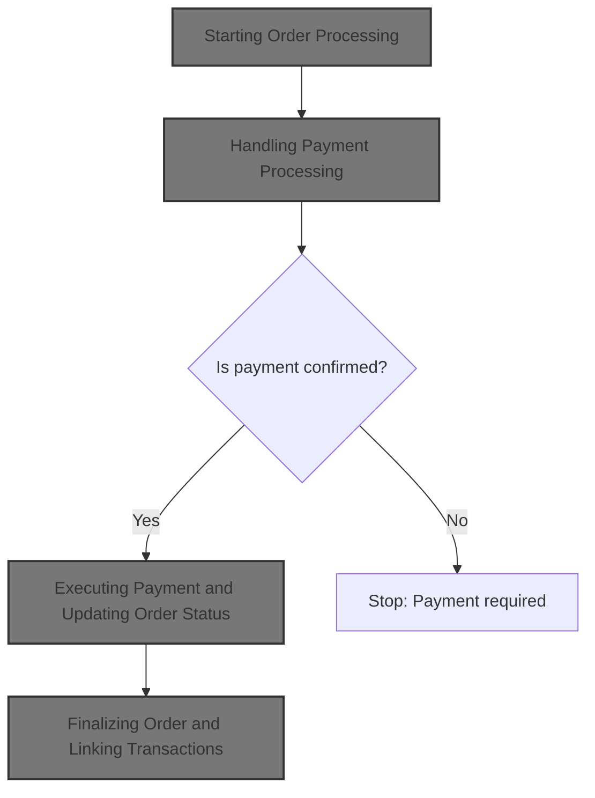
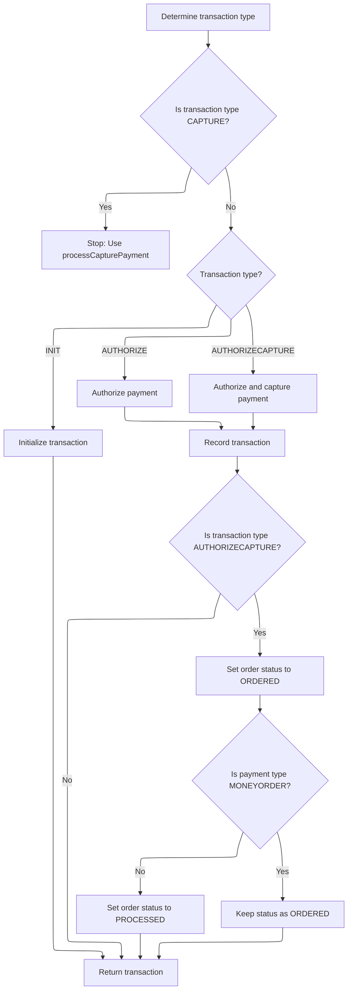

This document outlines the flow for processing a customer's order, from validating order and payment details to confirming payment, updating order status, and finalizing the order. The process ensures that all business rules are followed, resulting in a completed order with linked transactions and updated history.



# Starting Order Processing

This section ensures that all critical order data is present and valid before initiating payment processing. Payment must be confirmed before any order is created or updated, maintaining the integrity of the order workflow.

| Category        | Rule Name                        | Description                                                                                      |
| --------------- | -------------------------------- | ------------------------------------------------------------------------------------------------ |
| Data validation | Order Presence Validation        | An order cannot be processed unless the order object is present and valid.                       |
| Data validation | Customer Association Requirement | A customer must be associated with every order, even if the order is anonymous.                  |
| Data validation | Shopping Cart Item Requirement   | An order must include at least one shopping cart item to be processed.                           |
| Data validation | Payment Method Validation        | A valid payment method must be provided for every order.                                         |
| Data validation | Merchant Store Association       | Every order must be associated with a merchant store.                                            |
| Data validation | Order Total Summary Validation   | The order total summary must be present and valid before processing the order.                   |
| Business logic  | Payment Confirmation Precedence  | Payment must be successfully processed and confirmed before any order creation or update occurs. |

<SwmSnippet path="/shopizer/sm-core/src/main/java/com/salesmanager/core/business/order/service/OrderServiceImpl.java" line="105">

---

In `OrderServiceImpl.process`, we kick things off by validating all the required objects (order, customer, items, payment, store, summary). Right after that, we immediately delegate to `PaymentServiceImpl.processPayment` to handle the payment. This step is necessary because we need to confirm the payment before moving forward with any order creation or updates.

```java
    private Order process(Order order, Customer customer, List<ShoppingCartItem> items, OrderTotalSummary summary, Payment payment, Transaction transaction, MerchantStore store) throws ServiceException {
    	
    	
    	Validate.notNull(order, "Order cannot be null");
    	Validate.notNull(customer, "Customer cannot be null (even if anonymous order)");
    	Validate.notEmpty(items, "ShoppingCart items cannot be null");
    	Validate.notNull(payment, "Payment cannot be null");
    	Validate.notNull(store, "MerchantStore cannot be null");
    	Validate.notNull(summary, "Order total Summary cannot be null");
    	
    	//first process payment
    	Transaction processTransaction = paymentService.processPayment(customer, store, payment, items, order);
```

---

</SwmSnippet>

## Handling Payment Processing

This section governs the business rules for handling payment processing, ensuring that all required entities are validated, the correct payment module is used, and the transaction type is set according to store configuration.

| Category        | Rule Name                                | Description                                                                                                          |
| --------------- | ---------------------------------------- | -------------------------------------------------------------------------------------------------------------------- |
| Data validation | Required Entities Validation             | A payment cannot be processed unless the customer, store, payment, order, and order total are all present and valid. |
| Data validation | Payment Module Configuration Requirement | A payment module must be configured, present, and active for the store before processing any payment.                |
| Data validation | Credit Card Validation                   | If the payment is a credit card payment, the credit card details must be validated before processing.                |
| Business logic  | Store Currency Enforcement               | The payment currency must match the store's currency for every transaction.                                          |
| Business logic  | Default Transaction Type                 | If the transaction type is not specified in the payment module configuration, it defaults to AUTHORIZECAPTURE.       |

<SwmSnippet path="/shopizer/sm-core/src/main/java/com/salesmanager/core/business/payments/service/PaymentServiceImpl.java" line="296">

---

In `processPayment`, we validate all the main objects, set the payment currency, and fetch the payment module config for the store. We check if the module is present, configured, and active. Then, we figure out the transaction type from the config (defaulting to AUTHORIZECAPTURE if missing) and set it on the payment. Next, we grab the payment module instance and, if it's a credit card payment, validate the card details. Finally, we need to fetch the integration module by code, which is why we call `getPaymentMethodByCode` next.

```java
	public Transaction processPayment(Customer customer,
			MerchantStore store, Payment payment, List<ShoppingCartItem> items, Order order)
			throws ServiceException {


		Validate.notNull(customer);
		Validate.notNull(store);
		Validate.notNull(payment);
		Validate.notNull(order);
		Validate.notNull(order.getTotal());
		
		payment.setCurrency(store.getCurrency());
		
		BigDecimal amount = order.getTotal();

		//must have a shipping module configured
		Map<String, IntegrationConfiguration> modules = this.getPaymentModulesConfigured(store);
		if(modules==null){
			throw new ServiceException("No payment module configured");
		}
		
		IntegrationConfiguration configuration = modules.get(payment.getModuleName());
		
		if(configuration==null) {
			throw new ServiceException("Payment module " + payment.getModuleName() + " is not configured");
		}
		
		if(!configuration.isActive()) {
			throw new ServiceException("Payment module " + payment.getModuleName() + " is not active");
		}
		
		String sTransactionType = configuration.getIntegrationKeys().get("transaction");
		if(sTransactionType==null) {
			sTransactionType = TransactionType.AUTHORIZECAPTURE.name();
		}
		

		if(sTransactionType.equals(TransactionType.AUTHORIZE.name())) {
			payment.setTransactionType(TransactionType.AUTHORIZE);
		} else {
			payment.setTransactionType(TransactionType.AUTHORIZECAPTURE);
		} 
		

		PaymentModule module = this.paymentModules.get(payment.getModuleName());
		
		if(module==null) {
			throw new ServiceException("Payment module " + payment.getModuleName() + " does not exist");
		}
		
		if(payment instanceof CreditCardPayment) {
			CreditCardPayment creditCardPayment = (CreditCardPayment)payment;
			validateCreditCard(creditCardPayment.getCreditCardNumber(),creditCardPayment.getCreditCard(),creditCardPayment.getExpirationMonth(),creditCardPayment.getExpirationYear());
		}
		
		IntegrationModule integrationModule = getPaymentMethodByCode(store,payment.getModuleName());
```

---

</SwmSnippet>

### Looking Up Payment Integration Module

This section is responsible for retrieving the correct payment integration module based on a store's available payment methods and a specific code. This ensures that payment processing uses the appropriate integration for the selected method.

| Category        | Rule Name                           | Description                                                                                                               |
| --------------- | ----------------------------------- | ------------------------------------------------------------------------------------------------------------------------- |
| Data validation | Store-specific payment modules      | Only payment integration modules that are registered for the given store are considered when looking up a payment method. |
| Data validation | Exact code match for payment module | The payment integration module is selected based on an exact match between the provided code and the module's code.       |

<SwmSnippet path="/shopizer/sm-core/src/main/java/com/salesmanager/core/business/payments/service/PaymentServiceImpl.java" line="147">

---

`getPaymentMethodByCode` just loops through the store's payment methods and returns the one matching the given code. This gives us the integration module needed for the payment module to do its job.

```java
	public IntegrationModule getPaymentMethodByCode(MerchantStore store,
			String code) throws ServiceException {
		List<IntegrationModule> modules =  getPaymentMethods(store);

		for(IntegrationModule module : modules) {
			if(module.getCode().equals(code)) {
				
				return module;
			}
		}
		
		return null;
	}
```

---

</SwmSnippet>

### Fetching Store Payment Methods

This section is responsible for retrieving the available payment methods for a specific store. It ensures that only valid and enabled payment methods are presented to the user for selection during checkout.

| Category        | Rule Name                           | Description                                                                                                                         |
| --------------- | ----------------------------------- | ----------------------------------------------------------------------------------------------------------------------------------- |
| Data validation | Enabled payment methods only        | Only payment methods that are enabled for the store are included in the output.                                                     |
| Business logic  | Store-specific payment restrictions | The list of payment methods must reflect any store-specific restrictions, such as geographic limitations or accepted payment types. |
| Business logic  | Payment method display information  | Each payment method in the output must include a user-friendly name and description to help customers make informed choices.        |

See <SwmLink doc-title="Providing Available Payment Methods">[Providing Available Payment Methods](\.swm\providing-available-payment-methods.igo9clfj.sw.md)</SwmLink>

### Executing Payment and Updating Order Status



<SwmSnippet path="/shopizer/sm-core/src/main/java/com/salesmanager/core/business/payments/service/PaymentServiceImpl.java" line="352">

---

Back in `processPayment`, after getting the integration module, we pick the right payment module method based on the transaction type (authorize, authorizeAndCapture, or initTransaction). If it's not INIT, we save the transaction. For AUTHORIZECAPTURE, we update the order status to ORDERED, and if it's not a money order, bump it to PROCESSED. Then we return the transaction.

```java
		TransactionType transactionType = TransactionType.valueOf(sTransactionType);
		if(transactionType==null) {
			transactionType = payment.getTransactionType();
			if(transactionType.equals(TransactionType.CAPTURE.name())) {
				throw new ServiceException("This method does not allow to process capture transaction. Use processCapturePayment");
			}
		}
		
		Transaction transaction = null;
		if(transactionType == TransactionType.AUTHORIZE)  {
			transaction = module.authorize(store, customer, items, amount, payment, configuration, integrationModule);
		} else if(transactionType == TransactionType.AUTHORIZECAPTURE)  {
			transaction = module.authorizeAndCapture(store, customer, items, amount, payment, configuration, integrationModule);
		} else if(transactionType == TransactionType.INIT)  {
			transaction = module.initTransaction(store, customer, amount, payment, configuration, integrationModule);
		}


		if(transactionType != TransactionType.INIT) {
			transactionService.create(transaction);
		}
		
		if(transactionType == TransactionType.AUTHORIZECAPTURE)  {
			order.setStatus(OrderStatus.ORDERED);
			if(payment.getPaymentType().name()!=PaymentType.MONEYORDER.name()) {
				order.setStatus(OrderStatus.PROCESSED);
			}
		}

		return transaction;

		

	}
```

---

</SwmSnippet>

## Finalizing Order and Linking Transactions

```mermaid
%%{init: {"flowchart": {"defaultRenderer": "elk"}} }%%
flowchart TD
    node1["Start order processing"] --> node2{"Is order status/history missing?"}
    click node1 openCode "shopizer/sm-core/src/main/java/com/salesmanager/core/business/order/service/OrderServiceImpl.java:117:119"
    node2 -->|"Yes"| node3["Initialize order status and history"]
    click node2 openCode "shopizer/sm-core/src/main/java/com/salesmanager/core/business/order/service/OrderServiceImpl.java:119:133"
    node2 -->|"No"| node4{"Is customer new?"}
    click node3 openCode "shopizer/sm-core/src/main/java/com/salesmanager/core/business/order/service/OrderServiceImpl.java:120:132"
    node3 --> node4
    node4 -->|"Yes"| node5["Create customer"]
    click node4 openCode "shopizer/sm-core/src/main/java/com/salesmanager/core/business/order/service/OrderServiceImpl.java:135:137"
    node4 -->|"No"| node6["Save order"]
    click node5 openCode "shopizer/sm-core/src/main/java/com/salesmanager/core/business/order/service/OrderServiceImpl.java:136:137"
    node5 --> node6
    node6 --> node7{"Is there a transaction?"}
    click node6 openCode "shopizer/sm-core/src/main/java/com/salesmanager/core/business/order/service/OrderServiceImpl.java:139:141"
    node7 -->|"Yes"| node8{"Is transaction new?"}
    click node7 openCode "shopizer/sm-core/src/main/java/com/salesmanager/core/business/order/service/OrderServiceImpl.java:143:149"
    node7 -->|"No"| node9{"Is there a process transaction?"}
    node8 -->|"Yes"| node10["Link order and create transaction"]
    click node8 openCode "shopizer/sm-core/src/main/java/com/salesmanager/core/business/order/service/OrderServiceImpl.java:144:146"
    node8 -->|"No"| node11["Link order and update transaction"]
    click node10 openCode "shopizer/sm-core/src/main/java/com/salesmanager/core/business/order/service/OrderServiceImpl.java:144:146"
    click node11 openCode "shopizer/sm-core/src/main/java/com/salesmanager/core/business/order/service/OrderServiceImpl.java:144:149"
    node10 --> node9
    node11 --> node9
    node9 -->|"Yes"| node12{"Is process transaction new?"}
    click node9 openCode "shopizer/sm-core/src/main/java/com/salesmanager/core/business/order/service/OrderServiceImpl.java:152:158"
    node9 -->|"No"| node13["Return finalized order"]
    node12 -->|"Yes"| node14["Link order and create process transaction"]
    click node12 openCode "shopizer/sm-core/src/main/java/com/salesmanager/core/business/order/service/OrderServiceImpl.java:153:156"
    node12 -->|"No"| node15["Link order and update process transaction"]
    click node14 openCode "shopizer/sm-core/src/main/java/com/salesmanager/core/business/order/service/OrderServiceImpl.java:153:156"
    click node15 openCode "shopizer/sm-core/src/main/java/com/salesmanager/core/business/order/service/OrderServiceImpl.java:153:158"
    node14 --> node13
    node15 --> node13
    node13["Return finalized order"]
    click node13 openCode "shopizer/sm-core/src/main/java/com/salesmanager/core/business/order/service/OrderServiceImpl.java:161:161"
classDef HeadingStyle fill:#777777,stroke:#333,stroke-width:2px;
```



<SwmSnippet path="/shopizer/sm-core/src/main/java/com/salesmanager/core/business/order/service/OrderServiceImpl.java" line="117">

---

Back in `OrderServiceImpl.process`, we set up order history, handle new customers, link transactions to the order, and return the finished order.

```java
    	//transactionService.save(processTransaction);
    	
    	if(order.getOrderHistory()==null || order.getOrderHistory().size()==0 || order.getStatus()==null) {
    		OrderStatus status = order.getStatus();
    		if(status==null) {
    			status = OrderStatus.ORDERED;
    			order.setStatus(status);
    		}
    		Set<OrderStatusHistory> statusHistorySet = new HashSet<OrderStatusHistory>();
    		OrderStatusHistory statusHistory = new OrderStatusHistory();
    		statusHistory.setStatus(status);
    		statusHistory.setDateAdded(new Date());
    		statusHistory.setOrder(order);
    		statusHistorySet.add(statusHistory);
    		order.setOrderHistory(statusHistorySet);
    		
    	}
    	
    	if(customer.getId()==null || customer.getId()==0) {
    		customerService.create(customer);
    	}
    	
    	order.setCustomerId(customer.getId());
    	
    	this.create(order);

    	if(transaction!=null) {
    		transaction.setOrder(order);
    		if(transaction.getId()==null || transaction.getId()==0) {
    			transactionService.create(transaction);
    		} else {
    			transactionService.update(transaction);
    		}
    	}
    	
    	if(processTransaction!=null) {
    		processTransaction.setOrder(order);
    		if(processTransaction.getId()==null || processTransaction.getId()==0) {
    			transactionService.create(processTransaction);
    		} else {
    			transactionService.update(processTransaction);
    		}
    	}
    	
    	return order;
    	
    	
    }
```

---

</SwmSnippet>

&nbsp;

*This is an auto-generated document by Swimm 🌊 and has not yet been verified by a human*

<SwmMeta version="3.0.0" repo-id="Z2l0aHViJTNBJTNBU2hvcGl6ZXIlM0ElM0F1bWFsaW5nYXN3YW1p" repo-name="Shopizer"><sup>Powered by [Swimm](https://app.swimm.io/)</sup></SwmMeta>
