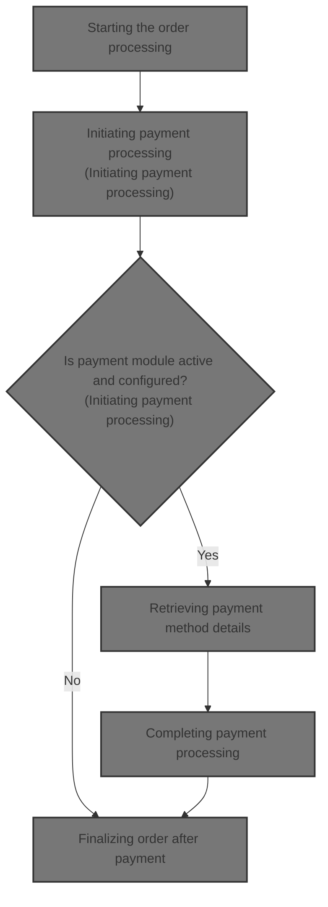
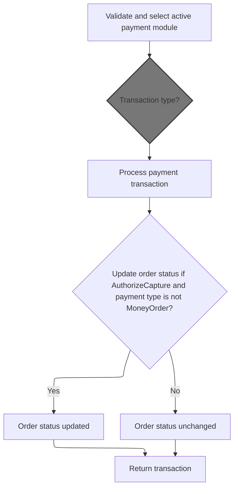
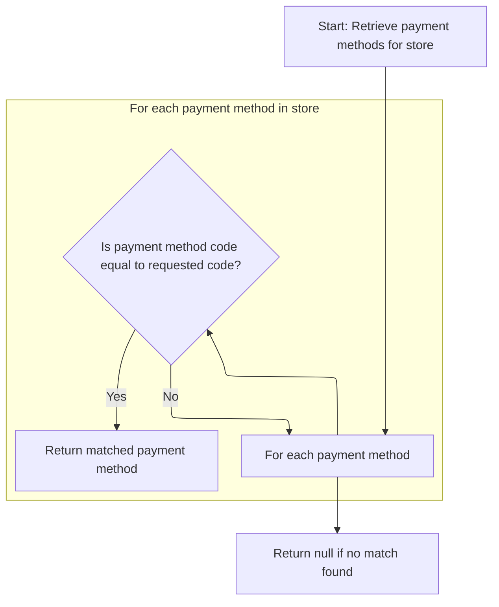
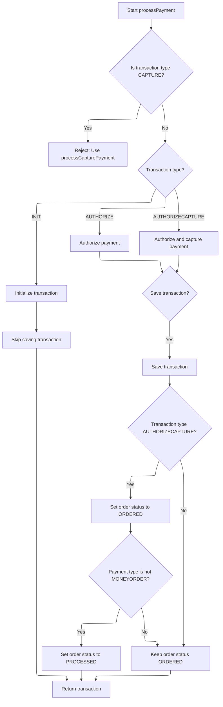

This document describes the flow of processing an order in the e-commerce platform. It starts with validating the order and customer information, then processes payment by selecting and validating payment methods. After payment authorization or capture, the order status is updated accordingly. Finally, the order is finalized by updating order history, associating the customer, and saving transaction records.



# Starting the order processing

This section handles the initial steps of order processing by validating inputs and processing the payment before proceeding with the order.

| Category        | Rule Name                         | Description                                                                                |
| --------------- | --------------------------------- | ------------------------------------------------------------------------------------------ |
| Data validation | Order must exist                  | The order object must not be null to proceed with processing.                              |
| Data validation | Customer information required     | The customer information must be provided, even if the order is anonymous.                 |
| Data validation | Non-empty shopping cart           | The shopping cart must contain at least one item to proceed with the order.                |
| Data validation | Payment details required          | Payment details must be provided and valid before processing the order.                    |
| Data validation | Merchant store required           | Merchant store information must be provided to associate the order with the correct store. |
| Data validation | Order total summary required      | Order total summary must be provided to ensure accurate order calculations.                |
| Business logic  | Payment confirmation before order | Payment must be processed and confirmed successfully before proceeding with the order.     |

<SwmSnippet path="/shopizer/sm-core/src/main/java/com/salesmanager/core/business/order/service/OrderServiceImpl.java" line="105">

---

We validate inputs and then process the payment first to confirm it before proceeding with the order.

```java
    private Order process(Order order, Customer customer, List<ShoppingCartItem> items, OrderTotalSummary summary, Payment payment, Transaction transaction, MerchantStore store) throws ServiceException {
    	
    	
    	Validate.notNull(order, "Order cannot be null");
    	Validate.notNull(customer, "Customer cannot be null (even if anonymous order)");
    	Validate.notEmpty(items, "ShoppingCart items cannot be null");
    	Validate.notNull(payment, "Payment cannot be null");
    	Validate.notNull(store, "MerchantStore cannot be null");
    	Validate.notNull(summary, "Order total Summary cannot be null");
    	
    	//first process payment
    	Transaction processTransaction = paymentService.processPayment(customer, store, payment, items, order);
```

---

</SwmSnippet>

## Initiating payment processing



This section handles the initiation of payment processing by validating inputs, selecting an active payment module, determining the transaction type, validating credit card details if applicable, and updating the order status based on the transaction outcome.

| Category        | Rule Name                       | Description                                                                                                                              |
| --------------- | ------------------------------- | ---------------------------------------------------------------------------------------------------------------------------------------- |
| Data validation | Input validation                | Payment processing must only proceed if all required inputs (customer, store, payment, order, and order total) are present and valid.    |
| Data validation | Active payment module required  | A payment module must be configured and active for the store to process payments; otherwise, payment processing is halted with an error. |
| Data validation | Credit card validation          | Credit card payments require validation of credit card number, card type, expiration month, and expiration year before processing.       |
| Business logic  | Default transaction type        | If the payment module's transaction type is not specified, default to AUTHORIZECAPTURE transaction type.                                 |
| Business logic  | Transaction type assignment     | If the transaction type is AUTHORIZE, set payment transaction type accordingly; otherwise, set it to AUTHORIZECAPTURE.                   |
| Business logic  | Conditional order status update | Order status should be updated only if the transaction type is AUTHORIZECAPTURE and the payment type is not MoneyOrder.                  |

<SwmSnippet path="/shopizer/sm-core/src/main/java/com/salesmanager/core/business/payments/service/PaymentServiceImpl.java" line="296">

---

In `processPayment` we start by validating inputs again, then check if payment modules are configured and active for the store. We determine the transaction type and validate credit card details if needed. Next, we get the payment module instance to proceed with the payment.

```java
	public Transaction processPayment(Customer customer,
			MerchantStore store, Payment payment, List<ShoppingCartItem> items, Order order)
			throws ServiceException {


		Validate.notNull(customer);
		Validate.notNull(store);
		Validate.notNull(payment);
		Validate.notNull(order);
		Validate.notNull(order.getTotal());
		
		payment.setCurrency(store.getCurrency());
		
		BigDecimal amount = order.getTotal();

		//must have a shipping module configured
		Map<String, IntegrationConfiguration> modules = this.getPaymentModulesConfigured(store);
		if(modules==null){
			throw new ServiceException("No payment module configured");
		}
		
		IntegrationConfiguration configuration = modules.get(payment.getModuleName());
		
		if(configuration==null) {
			throw new ServiceException("Payment module " + payment.getModuleName() + " is not configured");
		}
		
		if(!configuration.isActive()) {
			throw new ServiceException("Payment module " + payment.getModuleName() + " is not active");
		}
		
		String sTransactionType = configuration.getIntegrationKeys().get("transaction");
		if(sTransactionType==null) {
			sTransactionType = TransactionType.AUTHORIZECAPTURE.name();
		}
		

		if(sTransactionType.equals(TransactionType.AUTHORIZE.name())) {
			payment.setTransactionType(TransactionType.AUTHORIZE);
		} else {
			payment.setTransactionType(TransactionType.AUTHORIZECAPTURE);
		} 
		

		PaymentModule module = this.paymentModules.get(payment.getModuleName());
		
		if(module==null) {
			throw new ServiceException("Payment module " + payment.getModuleName() + " does not exist");
		}
		
		if(payment instanceof CreditCardPayment) {
			CreditCardPayment creditCardPayment = (CreditCardPayment)payment;
			validateCreditCard(creditCardPayment.getCreditCardNumber(),creditCardPayment.getCreditCard(),creditCardPayment.getExpirationMonth(),creditCardPayment.getExpirationYear());
		}
		
		IntegrationModule integrationModule = getPaymentMethodByCode(store,payment.getModuleName());
```

---

</SwmSnippet>

### Retrieving payment method details



This section describes the process of retrieving payment method details by matching a payment method code with the available payment methods for a store.

| Category        | Rule Name                     | Description                                                                                                                         |
| --------------- | ----------------------------- | ----------------------------------------------------------------------------------------------------------------------------------- |
| Data validation | Unique payment method code    | Each payment method must have a unique code within a store to ensure accurate retrieval.                                            |
| Business logic  | Return matched payment method | When a payment method code matches one of the store's payment methods, the system returns the corresponding payment method details. |

<SwmSnippet path="/shopizer/sm-core/src/main/java/com/salesmanager/core/business/payments/service/PaymentServiceImpl.java" line="147">

---

`getPaymentMethodByCode` looks up the payment method details by matching the code with available payment methods for the store. This info is needed to configure the payment module properly.

```java
	public IntegrationModule getPaymentMethodByCode(MerchantStore store,
			String code) throws ServiceException {
		List<IntegrationModule> modules =  getPaymentMethods(store);

		for(IntegrationModule module : modules) {
			if(module.getCode().equals(code)) {
				
				return module;
			}
		}
		
		return null;
	}
```

---

</SwmSnippet>

### Listing available payment methods

This section lists the available payment methods for customers during the checkout process in the e-commerce platform.

| Category       | Rule Name                       | Description                                                                                        |
| -------------- | ------------------------------- | -------------------------------------------------------------------------------------------------- |
| Business logic | Consistent Payment Method Order | The list of payment methods should be presented in a consistent order to avoid customer confusion. |

See <SwmLink doc-title="Retrieving payment methods by store region">[Retrieving payment methods by store region](\.swm\retrieving-payment-methods-by-store-region.ove2p80v.sw.md)</SwmLink>

### Completing payment processing



<SwmSnippet path="/shopizer/sm-core/src/main/java/com/salesmanager/core/business/payments/service/PaymentServiceImpl.java" line="352">

---

After returning from `getPaymentMethodByCode` in `processPayment`, we determine the transaction type and call the corresponding payment module method. We save the transaction unless it's an INIT type, and update order status based on payment type.

```java
		TransactionType transactionType = TransactionType.valueOf(sTransactionType);
		if(transactionType==null) {
			transactionType = payment.getTransactionType();
			if(transactionType.equals(TransactionType.CAPTURE.name())) {
				throw new ServiceException("This method does not allow to process capture transaction. Use processCapturePayment");
			}
		}
		
		Transaction transaction = null;
		if(transactionType == TransactionType.AUTHORIZE)  {
			transaction = module.authorize(store, customer, items, amount, payment, configuration, integrationModule);
		} else if(transactionType == TransactionType.AUTHORIZECAPTURE)  {
			transaction = module.authorizeAndCapture(store, customer, items, amount, payment, configuration, integrationModule);
		} else if(transactionType == TransactionType.INIT)  {
			transaction = module.initTransaction(store, customer, amount, payment, configuration, integrationModule);
		}


		if(transactionType != TransactionType.INIT) {
			transactionService.create(transaction);
		}
		
		if(transactionType == TransactionType.AUTHORIZECAPTURE)  {
			order.setStatus(OrderStatus.ORDERED);
			if(payment.getPaymentType().name()!=PaymentType.MONEYORDER.name()) {
				order.setStatus(OrderStatus.PROCESSED);
			}
		}

		return transaction;

		

	}
```

---

</SwmSnippet>

## Finalizing order after payment

```mermaid
%%{init: {"flowchart": {"defaultRenderer": "elk"}} }%%
flowchart TD
    node1["Start order processing"] --> node2{"Is order history empty or status null?"}
    click node1 openCode "shopizer/sm-core/src/main/java/com/salesmanager/core/business/order/service/OrderServiceImpl.java:117:118"
    node2 -->|"Yes"| node3["Initialize order status to ORDERED and create history"]
    click node2 openCode "shopizer/sm-core/src/main/java/com/salesmanager/core/business/order/service/OrderServiceImpl.java:119:133"
    node2 -->|"No"| node4["Check if customer is new"]
    click node3 openCode "shopizer/sm-core/src/main/java/com/salesmanager/core/business/order/service/OrderServiceImpl.java:119:133"
    node4 -->|"Yes"| node5["Create new customer"]
    click node4 openCode "shopizer/sm-core/src/main/java/com/salesmanager/core/business/order/service/OrderServiceImpl.java:135:137"
    node4 -->|"No"| node6["Associate customer with order"]
    click node5 openCode "shopizer/sm-core/src/main/java/com/salesmanager/core/business/order/service/OrderServiceImpl.java:135:137"
    node6 --> node7["Save order"]
    click node6 openCode "shopizer/sm-core/src/main/java/com/salesmanager/core/business/order/service/OrderServiceImpl.java:139:141"
    node7 --> node8{"Is transaction present?"}
    click node7 openCode "shopizer/sm-core/src/main/java/com/salesmanager/core/business/order/service/OrderServiceImpl.java:141:141"
    node8 -->|"No"| node11{"Is processTransaction present?"}
    click node8 openCode "shopizer/sm-core/src/main/java/com/salesmanager/core/business/order/service/OrderServiceImpl.java:143:143"
    node8 -->|"Yes"| node9{"Is transaction new?"}
    click node9 openCode "shopizer/sm-core/src/main/java/com/salesmanager/core/business/order/service/OrderServiceImpl.java:145:149"
    node9 -->|"Yes"| node10["Create transaction"]
    click node10 openCode "shopizer/sm-core/src/main/java/com/salesmanager/core/business/order/service/OrderServiceImpl.java:155:156"
    node9 -->|"No"| node12["Update transaction"]
    click node12 openCode "shopizer/sm-core/src/main/java/com/salesmanager/core/business/order/service/OrderServiceImpl.java:157:158"
    node10 --> node11
    node12 --> node11
    node11 -->|"No"| node14["Return order"]
    click node11 openCode "shopizer/sm-core/src/main/java/com/salesmanager/core/business/order/service/OrderServiceImpl.java:152:152"
    node11 -->|"Yes"| node13{"Is processTransaction new?"}
    click node13 openCode "shopizer/sm-core/src/main/java/com/salesmanager/core/business/order/service/OrderServiceImpl.java:154:158"
    node13 -->|"Yes"| node15["Create processTransaction"]
    click node15 openCode "shopizer/sm-core/src/main/java/com/salesmanager/core/business/order/service/OrderServiceImpl.java:155:156"
    node13 -->|"No"| node16["Update processTransaction"]
    click node16 openCode "shopizer/sm-core/src/main/java/com/salesmanager/core/business/order/service/OrderServiceImpl.java:157:158"
    node15 --> node14
    node16 --> node14
    node14["Return order"]
    click node14 openCode "shopizer/sm-core/src/main/java/com/salesmanager/core/business/order/service/OrderServiceImpl.java:161:161"
classDef HeadingStyle fill:#777777,stroke:#333,stroke-width:2px;
```



<SwmSnippet path="/shopizer/sm-core/src/main/java/com/salesmanager/core/business/order/service/OrderServiceImpl.java" line="117">

---

Back in `process` after returning from `processPayment`, we update order history if empty, create customer if new, link transactions to the order, and save everything. This finalizes the order with payment info attached.

```java
    	//transactionService.save(processTransaction);
    	
    	if(order.getOrderHistory()==null || order.getOrderHistory().size()==0 || order.getStatus()==null) {
    		OrderStatus status = order.getStatus();
    		if(status==null) {
    			status = OrderStatus.ORDERED;
    			order.setStatus(status);
    		}
    		Set<OrderStatusHistory> statusHistorySet = new HashSet<OrderStatusHistory>();
    		OrderStatusHistory statusHistory = new OrderStatusHistory();
    		statusHistory.setStatus(status);
    		statusHistory.setDateAdded(new Date());
    		statusHistory.setOrder(order);
    		statusHistorySet.add(statusHistory);
    		order.setOrderHistory(statusHistorySet);
    		
    	}
    	
    	if(customer.getId()==null || customer.getId()==0) {
    		customerService.create(customer);
    	}
    	
    	order.setCustomerId(customer.getId());
    	
    	this.create(order);

    	if(transaction!=null) {
    		transaction.setOrder(order);
    		if(transaction.getId()==null || transaction.getId()==0) {
    			transactionService.create(transaction);
    		} else {
    			transactionService.update(transaction);
    		}
    	}
    	
    	if(processTransaction!=null) {
    		processTransaction.setOrder(order);
    		if(processTransaction.getId()==null || processTransaction.getId()==0) {
    			transactionService.create(processTransaction);
    		} else {
    			transactionService.update(processTransaction);
    		}
    	}
    	
    	return order;
    	
    	
    }
```

---

</SwmSnippet>

&nbsp;

*This is an auto-generated document by Swimm 🌊 and has not yet been verified by a human*

<SwmMeta version="3.0.0" repo-id="Z2l0aHViJTNBJTNBU2hvcGl6ZXIlM0ElM0F1bWFsaW5nYXN3YW1p" repo-name="Shopizer"><sup>Powered by [Swimm](https://app.swimm.io/)</sup></SwmMeta>
