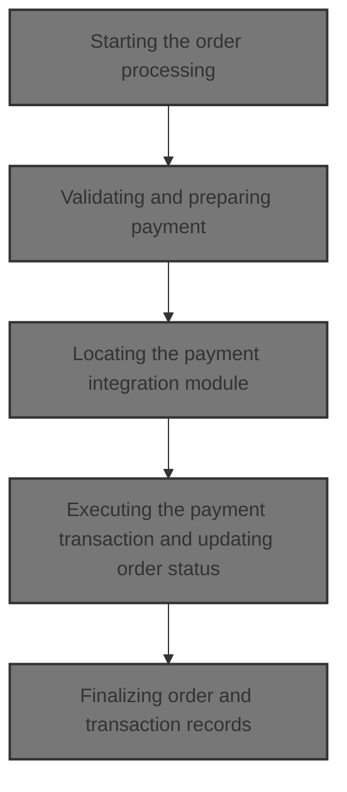
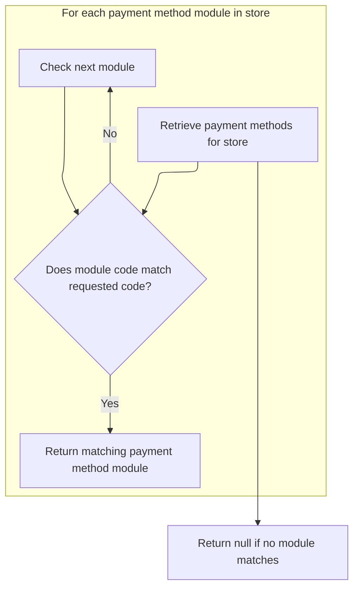
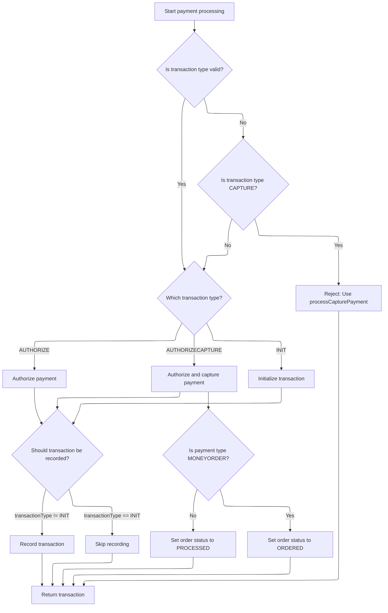

This document describes the flow for processing an order, ensuring all required data is present and valid, handling payment through the correct payment module, and finalizing the order with updated status and transaction records. The flow receives order details, customer information, cart items, payment information, and store details as input, and outputs a finalized order with updated records.



# Starting the order processing

This section is responsible for initiating the order processing workflow. It ensures all required data is present and valid, and that payment is successfully processed before proceeding with order creation.

| Category        | Rule Name                      | Description                                                                                |
| --------------- | ------------------------------ | ------------------------------------------------------------------------------------------ |
| Data validation | Order presence validation      | An order cannot be processed if the Order object is missing.                               |
| Data validation | Customer presence validation   | An order cannot be processed if the Customer object is missing, even for anonymous orders. |
| Data validation | Cart items validation          | An order cannot be processed if the list of ShoppingCartItem objects is empty.             |
| Data validation | Payment presence validation    | An order cannot be processed if the Payment object is missing.                             |
| Data validation | Store presence validation      | An order cannot be processed if the MerchantStore object is missing.                       |
| Data validation | Order summary validation       | An order cannot be processed if the OrderTotalSummary object is missing.                   |
| Business logic  | Payment processing requirement | Payment must be processed successfully before the order can be created.                    |

<SwmSnippet path="/shopizer/sm-core/src/main/java/com/salesmanager/core/business/order/service/OrderServiceImpl.java" line="105">

---

In `process`, we start by validating inputs and then call PaymentServiceImpl to handle payment before moving forward with order creation.

```java
    private Order process(Order order, Customer customer, List<ShoppingCartItem> items, OrderTotalSummary summary, Payment payment, Transaction transaction, MerchantStore store) throws ServiceException {
    	
    	
    	Validate.notNull(order, "Order cannot be null");
    	Validate.notNull(customer, "Customer cannot be null (even if anonymous order)");
    	Validate.notEmpty(items, "ShoppingCart items cannot be null");
    	Validate.notNull(payment, "Payment cannot be null");
    	Validate.notNull(store, "MerchantStore cannot be null");
    	Validate.notNull(summary, "Order total Summary cannot be null");
    	
    	//first process payment
    	Transaction processTransaction = paymentService.processPayment(customer, store, payment, items, order);
```

---

</SwmSnippet>

## Validating and preparing payment

This section is responsible for validating all payment-related data, ensuring the selected payment module is configured and active, setting up the transaction type, and handling credit card validation if applicable. It prepares the payment transaction for further processing.

| Category        | Rule Name                          | Description                                                                                                                                          |
| --------------- | ---------------------------------- | ---------------------------------------------------------------------------------------------------------------------------------------------------- |
| Data validation | Required payment data              | A payment transaction cannot be processed unless the customer, merchant store, payment object, order, and order total are all provided and not null. |
| Data validation | Configured payment module required | A payment transaction cannot be processed unless at least one payment module is configured for the merchant store.                                   |
| Data validation | Active payment module required     | The selected payment module must be both configured and active for the merchant store.                                                               |
| Data validation | Existing payment module required   | The selected payment module must exist in the system before processing the payment transaction.                                                      |
| Data validation | Credit card validation             | If the payment is made by credit card, the credit card number, type, expiration month, and expiration year must be validated before processing.      |
| Business logic  | Payment currency alignment         | The payment currency must match the merchant store's currency for all transactions.                                                                  |
| Business logic  | Default transaction type           | If the payment module does not specify a transaction type, the default transaction type must be AUTHORIZECAPTURE.                                    |
| Business logic  | Transaction type assignment        | If the transaction type is AUTHORIZE, the payment transaction must be set to AUTHORIZE; otherwise, it must be set to AUTHORIZECAPTURE.               |

<SwmSnippet path="/shopizer/sm-core/src/main/java/com/salesmanager/core/business/payments/service/PaymentServiceImpl.java" line="296">

---

In `processPayment`, we validate all payment-related data, check for configured and active payment modules, set up the transaction type, and handle credit card validation if needed. We fetch the payment method by code next to get the integration details for the selected payment module.

```java
	public Transaction processPayment(Customer customer,
			MerchantStore store, Payment payment, List<ShoppingCartItem> items, Order order)
			throws ServiceException {


		Validate.notNull(customer);
		Validate.notNull(store);
		Validate.notNull(payment);
		Validate.notNull(order);
		Validate.notNull(order.getTotal());
		
		payment.setCurrency(store.getCurrency());
		
		BigDecimal amount = order.getTotal();

		//must have a shipping module configured
		Map<String, IntegrationConfiguration> modules = this.getPaymentModulesConfigured(store);
		if(modules==null){
			throw new ServiceException("No payment module configured");
		}
		
		IntegrationConfiguration configuration = modules.get(payment.getModuleName());
		
		if(configuration==null) {
			throw new ServiceException("Payment module " + payment.getModuleName() + " is not configured");
		}
		
		if(!configuration.isActive()) {
			throw new ServiceException("Payment module " + payment.getModuleName() + " is not active");
		}
		
		String sTransactionType = configuration.getIntegrationKeys().get("transaction");
		if(sTransactionType==null) {
			sTransactionType = TransactionType.AUTHORIZECAPTURE.name();
		}
		

		if(sTransactionType.equals(TransactionType.AUTHORIZE.name())) {
			payment.setTransactionType(TransactionType.AUTHORIZE);
		} else {
			payment.setTransactionType(TransactionType.AUTHORIZECAPTURE);
		} 
		

		PaymentModule module = this.paymentModules.get(payment.getModuleName());
		
		if(module==null) {
			throw new ServiceException("Payment module " + payment.getModuleName() + " does not exist");
		}
		
		if(payment instanceof CreditCardPayment) {
			CreditCardPayment creditCardPayment = (CreditCardPayment)payment;
			validateCreditCard(creditCardPayment.getCreditCardNumber(),creditCardPayment.getCreditCard(),creditCardPayment.getExpirationMonth(),creditCardPayment.getExpirationYear());
		}
		
		IntegrationModule integrationModule = getPaymentMethodByCode(store,payment.getModuleName());
```

---

</SwmSnippet>

### Locating the payment integration module



This section is responsible for locating the correct payment integration module for a given payment method code within a merchant store. This enables the system to use the appropriate configuration for processing transactions.

| Category        | Rule Name                       | Description                                                                                                              |
| --------------- | ------------------------------- | ------------------------------------------------------------------------------------------------------------------------ |
| Data validation | Exact code match requirement    | The payment integration module must have a code that exactly matches the requested payment method code to be selected.   |
| Business logic  | Store-specific module filtering | Only payment integration modules associated with the specified merchant store are considered when searching for a match. |

<SwmSnippet path="/shopizer/sm-core/src/main/java/com/salesmanager/core/business/payments/service/PaymentServiceImpl.java" line="147">

---

`getPaymentMethodByCode` finds the integration module for the payment code so we can use its config for the transaction.

```java
	public IntegrationModule getPaymentMethodByCode(MerchantStore store,
			String code) throws ServiceException {
		List<IntegrationModule> modules =  getPaymentMethods(store);

		for(IntegrationModule module : modules) {
			if(module.getCode().equals(code)) {
				
				return module;
			}
		}
		
		return null;
	}
```

---

</SwmSnippet>

### Fetching available payment methods

This section is responsible for determining and presenting the list of payment methods that are available to a customer during checkout. The available payment methods may depend on factors such as the customer's location, the total order value, and the store's configuration.

| Category        | Rule Name                            | Description                                                                                                                                 |
| --------------- | ------------------------------------ | ------------------------------------------------------------------------------------------------------------------------------------------- |
| Data validation | Minimum order value for payment      | Payment methods that require a minimum order value should only be shown if the customer's order meets or exceeds that value.                |
| Business logic  | Enabled payment methods only         | Only payment methods that are enabled in the store configuration should be presented to the customer.                                       |
| Business logic  | Country-based payment filtering      | Payment methods must be filtered based on the customer's shipping country; only methods available for the selected country should be shown. |
| Business logic  | Unavailable payment method exclusion | If a payment method is temporarily unavailable due to maintenance or external service issues, it should not be presented to the customer.   |

See <SwmLink doc-title="Getting Available Payment Methods">[Getting Available Payment Methods](\.swm\getting-available-payment-methods.zlug9ufx.sw.md)</SwmLink>

### Executing the payment transaction and updating order status



<SwmSnippet path="/shopizer/sm-core/src/main/java/com/salesmanager/core/business/payments/service/PaymentServiceImpl.java" line="352">

---

We just returned from `getPaymentMethodByCode`, so now in `processPayment`, we use the integration module to process the transaction according to its type (authorize, capture, etc.), update the order status, and save the transaction if needed.

```java
		TransactionType transactionType = TransactionType.valueOf(sTransactionType);
		if(transactionType==null) {
			transactionType = payment.getTransactionType();
			if(transactionType.equals(TransactionType.CAPTURE.name())) {
				throw new ServiceException("This method does not allow to process capture transaction. Use processCapturePayment");
			}
		}
		
		Transaction transaction = null;
		if(transactionType == TransactionType.AUTHORIZE)  {
			transaction = module.authorize(store, customer, items, amount, payment, configuration, integrationModule);
		} else if(transactionType == TransactionType.AUTHORIZECAPTURE)  {
			transaction = module.authorizeAndCapture(store, customer, items, amount, payment, configuration, integrationModule);
		} else if(transactionType == TransactionType.INIT)  {
			transaction = module.initTransaction(store, customer, amount, payment, configuration, integrationModule);
		}


		if(transactionType != TransactionType.INIT) {
			transactionService.create(transaction);
		}
		
		if(transactionType == TransactionType.AUTHORIZECAPTURE)  {
			order.setStatus(OrderStatus.ORDERED);
			if(payment.getPaymentType().name()!=PaymentType.MONEYORDER.name()) {
				order.setStatus(OrderStatus.PROCESSED);
			}
		}

		return transaction;

		

	}
```

---

</SwmSnippet>

## Finalizing order and transaction records

```mermaid
%%{init: {"flowchart": {"defaultRenderer": "elk"}} }%%
flowchart TD
    node1["Start order processing"] --> node2{"Is order status/history missing?"}
    click node1 openCode "shopizer/sm-core/src/main/java/com/salesmanager/core/business/order/service/OrderServiceImpl.java:117:119"
    node2 -->|"Yes"| node3["Set order status to ORDERED and create order history"]
    click node2 openCode "shopizer/sm-core/src/main/java/com/salesmanager/core/business/order/service/OrderServiceImpl.java:119:133"
    node2 -->|"No"| node4{"Is customer new (ID is null or 0)?"}
    node3 --> node4
    node4 -->|"Yes"| node5["Create customer"]
    click node4 openCode "shopizer/sm-core/src/main/java/com/salesmanager/core/business/order/service/OrderServiceImpl.java:135:137"
    node4 -->|"No"| node6["Save order"]
    node5 --> node6
    click node5 openCode "shopizer/sm-core/src/main/java/com/salesmanager/core/business/order/service/OrderServiceImpl.java:137:141"
    node6 --> node7{"Is there a transaction?"}
    click node6 openCode "shopizer/sm-core/src/main/java/com/salesmanager/core/business/order/service/OrderServiceImpl.java:141:143"
    node7 -->|"Yes"| node8{"Is transaction new (ID is null or 0)?"}
    node7 -->|"No"| node11{"Is there a process transaction?"}
    click node7 openCode "shopizer/sm-core/src/main/java/com/salesmanager/core/business/order/service/OrderServiceImpl.java:143:150"
    node8 -->|"Yes"| node9["Create transaction"]
    click node8 openCode "shopizer/sm-core/src/main/java/com/salesmanager/core/business/order/service/OrderServiceImpl.java:145:147"
    node8 -->|"No"| node10["Update transaction"]
    click node10 openCode "shopizer/sm-core/src/main/java/com/salesmanager/core/business/order/service/OrderServiceImpl.java:147:149"
    node9 --> node11
    node10 --> node11
    node11 -->|"Yes"| node12{"Is process transaction new (ID is null or 0)?"}
    node11 -->|"No"| node15["Return order"]
    click node11 openCode "shopizer/sm-core/src/main/java/com/salesmanager/core/business/order/service/OrderServiceImpl.java:152:159"
    node12 -->|"Yes"| node13["Create process transaction"]
    click node12 openCode "shopizer/sm-core/src/main/java/com/salesmanager/core/business/order/service/OrderServiceImpl.java:154:156"
    node12 -->|"No"| node14["Update process transaction"]
    click node14 openCode "shopizer/sm-core/src/main/java/com/salesmanager/core/business/order/service/OrderServiceImpl.java:157:158"
    node13 --> node15
    node14 --> node15
    node15["Return order"]
    click node15 openCode "shopizer/sm-core/src/main/java/com/salesmanager/core/business/order/service/OrderServiceImpl.java:161:162"
classDef HeadingStyle fill:#777777,stroke:#333,stroke-width:2px;
```



<SwmSnippet path="/shopizer/sm-core/src/main/java/com/salesmanager/core/business/order/service/OrderServiceImpl.java" line="117">

---

We just returned from `processPayment` in PaymentServiceImpl, so now in `OrderServiceImpl.process`, we update order history and status, create the customer if needed, link transactions to the order, and save everything to the database.

```java
    	//transactionService.save(processTransaction);
    	
    	if(order.getOrderHistory()==null || order.getOrderHistory().size()==0 || order.getStatus()==null) {
    		OrderStatus status = order.getStatus();
    		if(status==null) {
    			status = OrderStatus.ORDERED;
    			order.setStatus(status);
    		}
    		Set<OrderStatusHistory> statusHistorySet = new HashSet<OrderStatusHistory>();
    		OrderStatusHistory statusHistory = new OrderStatusHistory();
    		statusHistory.setStatus(status);
    		statusHistory.setDateAdded(new Date());
    		statusHistory.setOrder(order);
    		statusHistorySet.add(statusHistory);
    		order.setOrderHistory(statusHistorySet);
    		
    	}
    	
    	if(customer.getId()==null || customer.getId()==0) {
    		customerService.create(customer);
    	}
    	
    	order.setCustomerId(customer.getId());
    	
    	this.create(order);

    	if(transaction!=null) {
    		transaction.setOrder(order);
    		if(transaction.getId()==null || transaction.getId()==0) {
    			transactionService.create(transaction);
    		} else {
    			transactionService.update(transaction);
    		}
    	}
    	
    	if(processTransaction!=null) {
    		processTransaction.setOrder(order);
    		if(processTransaction.getId()==null || processTransaction.getId()==0) {
    			transactionService.create(processTransaction);
    		} else {
    			transactionService.update(processTransaction);
    		}
    	}
    	
    	return order;
    	
    	
    }
```

---

</SwmSnippet>

&nbsp;

*This is an auto-generated document by Swimm 🌊 and has not yet been verified by a human*

<SwmMeta version="3.0.0" repo-id="Z2l0aHViJTNBJTNBU2hvcGl6ZXIlM0ElM0F1bWFsaW5nYXN3YW1p" repo-name="Shopizer"><sup>Powered by [Swimm](https://app.swimm.io/)</sup></SwmMeta>
