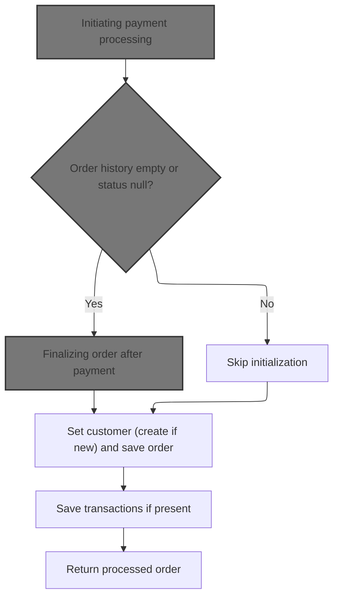
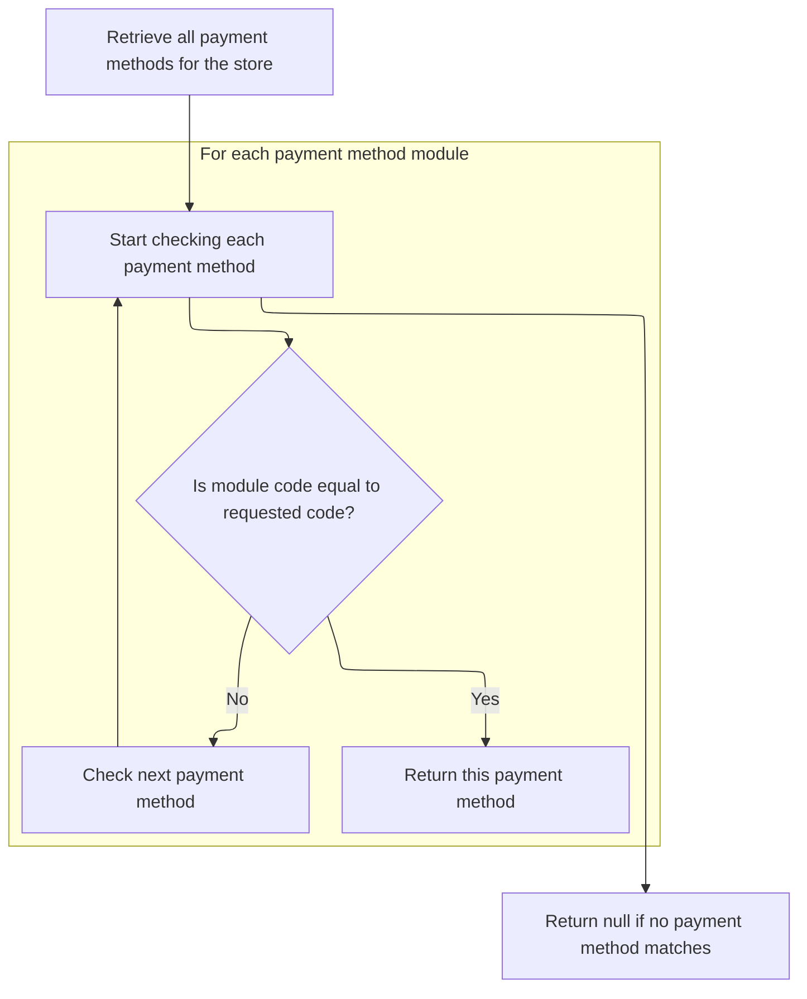
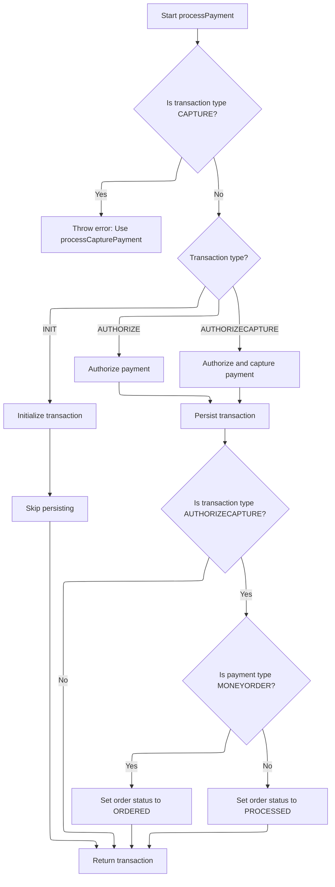

This document explains the flow of processing an order in the e-commerce platform. It covers validating order and payment details, processing payment through the selected payment method, updating order status, and saving customer and transaction information to finalize the order.

```mermaid
flowchart TD
  node1["Starting the order processing"]:::HeadingStyle --> node2["Initiating payment processing
(Initiating payment processing)"]:::HeadingStyle
  node2 --> node3{"Is payment module active and configured?
(Initiating payment processing)"}:::HeadingStyle
  node3 -->|"Yes"| node4{"Transaction type?
(Processing transaction and updating order status)"}:::HeadingStyle
  node4 -->|"AUTHORIZE or AUTHORIZECAPTURE"| node5["Authorize or capture payment
(Processing transaction and updating order status)"]:::HeadingStyle
  node4 -->|"INIT"| node6["Initialize transaction
(Processing transaction and updating order status)"]:::HeadingStyle
  node5 --> node7["Finalize order and update status
(Finalizing order after payment)"]:::HeadingStyle
  node6 --> node7
  node7 --> node8{"Is order history empty or status null?
(Finalizing order after payment)"}:::HeadingStyle
  node8 -->|"Yes"| node9["Set order status and create history
(Finalizing order after payment)"]:::HeadingStyle
  node8 -->|"No"| node10["Proceed without status initialization
(Finalizing order after payment)"]:::HeadingStyle
  node9 --> node11{"Is customer new?
(Finalizing order after payment)"}:::HeadingStyle
  node10 --> node11
  node11 -->|"Yes"| node12["Create customer
(Finalizing order after payment)"]:::HeadingStyle
  node11 -->|"No"| node13["Use existing customer
(Finalizing order after payment)"]:::HeadingStyle
  node12 --> node14["Save order and transactions
(Finalizing order after payment)"]:::HeadingStyle
  node13 --> node14
  node14 --> node15["Return processed order
(Finalizing order after payment)"]:::HeadingStyle

  click node1 goToHeading "Starting the order processing"
  click node2 goToHeading "Initiating payment processing"
  click node3 goToHeading "Initiating payment processing"
  click node4 goToHeading "Processing transaction and updating order status"
  click node5 goToHeading "Processing transaction and updating order status"
  click node6 goToHeading "Processing transaction and updating order status"
  click node7 goToHeading "Finalizing order after payment"
  click node8 goToHeading "Finalizing order after payment"
  click node9 goToHeading "Finalizing order after payment"
  click node10 goToHeading "Finalizing order after payment"
  click node11 goToHeading "Finalizing order after payment"
  click node12 goToHeading "Finalizing order after payment"
  click node13 goToHeading "Finalizing order after payment"
  click node14 goToHeading "Finalizing order after payment"
  click node15 goToHeading "Finalizing order after payment"
classDef HeadingStyle fill:#777777,stroke:#333,stroke-width:2px;
```



# Starting the order processing



This section handles the initiation of order processing by validating inputs, processing payment to confirm funds, and then finalizing the order by setting the customer, saving the order, and saving any transactions.

| Category        | Rule Name                               | Description                                                                                                                                               |
| --------------- | --------------------------------------- | --------------------------------------------------------------------------------------------------------------------------------------------------------- |
| Data validation | Order must exist                        | The order must not be null before processing begins.                                                                                                      |
| Data validation | Customer information required           | The customer information must be provided, even if the order is anonymous.                                                                                |
| Data validation | Non-empty shopping cart                 | The shopping cart must contain at least one item before processing the order.                                                                             |
| Data validation | Valid payment required                  | Payment details must be provided and valid before processing the order.                                                                                   |
| Data validation | Merchant store association              | The merchant store information must be present to associate the order with the correct store.                                                             |
| Data validation | Order total summary required            | The order total summary must be provided to validate the financial details of the order.                                                                  |
| Business logic  | Payment confirmation first              | Payment must be processed first to confirm funds before continuing with order finalization.                                                               |
| Business logic  | Finalize new orders                     | If the order history is empty or the order status is null, the system must finalize the order after payment by setting the customer and saving the order. |
| Business logic  | Skip initialization for existing orders | If the order history is not empty and the status is not null, the system skips initialization and proceeds with saving transactions if present.           |
| Business logic  | Save transactions                       | All transactions related to the order must be saved if present.                                                                                           |
| Business logic  | Return processed order                  | The processed order must be returned after all validations, payment processing, and saving operations are complete.                                       |

<SwmSnippet path="/shopizer/sm-core/src/main/java/com/salesmanager/core/business/order/service/OrderServiceImpl.java" line="105">

---

We validate inputs and then process payment first to confirm funds before continuing.

```java
    private Order process(Order order, Customer customer, List<ShoppingCartItem> items, OrderTotalSummary summary, Payment payment, Transaction transaction, MerchantStore store) throws ServiceException {
    	
    	
    	Validate.notNull(order, "Order cannot be null");
    	Validate.notNull(customer, "Customer cannot be null (even if anonymous order)");
    	Validate.notEmpty(items, "ShoppingCart items cannot be null");
    	Validate.notNull(payment, "Payment cannot be null");
    	Validate.notNull(store, "MerchantStore cannot be null");
    	Validate.notNull(summary, "Order total Summary cannot be null");
    	
    	//first process payment
    	Transaction processTransaction = paymentService.processPayment(customer, store, payment, items, order);
```

---

</SwmSnippet>

## Initiating payment processing

This section handles the initiation of payment processing by validating inputs, checking configured and active payment modules, setting currency and amount, validating credit card details if applicable, and preparing to call the payment module to process the transaction.

| Category        | Rule Name                             | Description                                                                                                                 |
| --------------- | ------------------------------------- | --------------------------------------------------------------------------------------------------------------------------- |
| Data validation | Mandatory payment inputs              | The payment must be associated with a valid customer, merchant store, payment details, and order with a total amount.       |
| Data validation | Payment module configuration required | At least one payment module must be configured for the merchant store to process payments.                                  |
| Data validation | Active payment module required        | The payment module specified in the payment details must be configured and active for the merchant store.                   |
| Data validation | Credit card validation                | If the payment is a credit card payment, the credit card details must be validated before processing.                       |
| Business logic  | Currency alignment                    | The payment currency must be set to the currency of the merchant store.                                                     |
| Business logic  | Default transaction type              | If the payment module does not specify a transaction type, the default transaction type is AUTHORIZECAPTURE.                |
| Business logic  | Transaction type setting              | The payment transaction type must be set to either AUTHORIZE or AUTHORIZECAPTURE based on the payment module configuration. |

<SwmSnippet path="/shopizer/sm-core/src/main/java/com/salesmanager/core/business/payments/service/PaymentServiceImpl.java" line="296">

---

In `processPayment` we validate inputs again, then check which payment modules are configured and active for the store. We set the currency and amount for the payment, validate credit card details if applicable, and prepare to call the actual payment module to process the transaction.

```java
	public Transaction processPayment(Customer customer,
			MerchantStore store, Payment payment, List<ShoppingCartItem> items, Order order)
			throws ServiceException {


		Validate.notNull(customer);
		Validate.notNull(store);
		Validate.notNull(payment);
		Validate.notNull(order);
		Validate.notNull(order.getTotal());
		
		payment.setCurrency(store.getCurrency());
		
		BigDecimal amount = order.getTotal();

		//must have a shipping module configured
		Map<String, IntegrationConfiguration> modules = this.getPaymentModulesConfigured(store);
		if(modules==null){
			throw new ServiceException("No payment module configured");
		}
		
		IntegrationConfiguration configuration = modules.get(payment.getModuleName());
		
		if(configuration==null) {
			throw new ServiceException("Payment module " + payment.getModuleName() + " is not configured");
		}
		
		if(!configuration.isActive()) {
			throw new ServiceException("Payment module " + payment.getModuleName() + " is not active");
		}
		
		String sTransactionType = configuration.getIntegrationKeys().get("transaction");
		if(sTransactionType==null) {
			sTransactionType = TransactionType.AUTHORIZECAPTURE.name();
		}
		

		if(sTransactionType.equals(TransactionType.AUTHORIZE.name())) {
			payment.setTransactionType(TransactionType.AUTHORIZE);
		} else {
			payment.setTransactionType(TransactionType.AUTHORIZECAPTURE);
		} 
		

		PaymentModule module = this.paymentModules.get(payment.getModuleName());
		
		if(module==null) {
			throw new ServiceException("Payment module " + payment.getModuleName() + " does not exist");
		}
		
		if(payment instanceof CreditCardPayment) {
			CreditCardPayment creditCardPayment = (CreditCardPayment)payment;
			validateCreditCard(creditCardPayment.getCreditCardNumber(),creditCardPayment.getCreditCard(),creditCardPayment.getExpirationMonth(),creditCardPayment.getExpirationYear());
		}
		
		IntegrationModule integrationModule = getPaymentMethodByCode(store,payment.getModuleName());
```

---

</SwmSnippet>

### Fetching payment method configuration



This section describes the process of fetching a payment method configuration by its unique code for a given merchant store.

| Category       | Rule Name                      | Description                                                                                                                                     |
| -------------- | ------------------------------ | ----------------------------------------------------------------------------------------------------------------------------------------------- |
| Business logic | Unique payment method code     | Each payment method configuration must have a unique code within the context of a merchant store to ensure correct identification.              |
| Business logic | Return matching payment method | If a payment method configuration with the requested code exists for the merchant store, it must be returned as the result.                     |
| Business logic | Return null if no match        | If no payment method configuration matches the requested code, the system must return null to indicate absence of the requested payment method. |

<SwmSnippet path="/shopizer/sm-core/src/main/java/com/salesmanager/core/business/payments/service/PaymentServiceImpl.java" line="147">

---

It finds the payment method config by code or returns null.

```java
	public IntegrationModule getPaymentMethodByCode(MerchantStore store,
			String code) throws ServiceException {
		List<IntegrationModule> modules =  getPaymentMethods(store);

		for(IntegrationModule module : modules) {
			if(module.getCode().equals(code)) {
				
				return module;
			}
		}
		
		return null;
	}
```

---

</SwmSnippet>

### Retrieving all payment methods for store

This section is responsible for retrieving all available payment methods for a specific store in the e-commerce platform.

| Category       | Rule Name                      | Description                                                                                                                |
| -------------- | ------------------------------ | -------------------------------------------------------------------------------------------------------------------------- |
| Business logic | Enabled payment methods only   | Only payment methods that are enabled for the store should be retrieved and presented to the user.                         |
| Business logic | Store-specific payment methods | Payment methods must be specific to the store context, ensuring that only methods configured for that store are retrieved. |

See <SwmLink doc-title="Providing payment methods by store region">[Providing payment methods by store region](\.swm\providing-payment-methods-by-store-region.tk8x9dhh.sw.md)</SwmLink>

### Processing transaction and updating order status



<SwmSnippet path="/shopizer/sm-core/src/main/java/com/salesmanager/core/business/payments/service/PaymentServiceImpl.java" line="352">

---

After returning from `getPaymentMethodByCode`, we determine the transaction type and call the corresponding payment module method (authorize, authorizeAndCapture, or initTransaction). We create a transaction record unless it's an INIT type, and update the order status if payment is captured.

```java
		TransactionType transactionType = TransactionType.valueOf(sTransactionType);
		if(transactionType==null) {
			transactionType = payment.getTransactionType();
			if(transactionType.equals(TransactionType.CAPTURE.name())) {
				throw new ServiceException("This method does not allow to process capture transaction. Use processCapturePayment");
			}
		}
		
		Transaction transaction = null;
		if(transactionType == TransactionType.AUTHORIZE)  {
			transaction = module.authorize(store, customer, items, amount, payment, configuration, integrationModule);
		} else if(transactionType == TransactionType.AUTHORIZECAPTURE)  {
			transaction = module.authorizeAndCapture(store, customer, items, amount, payment, configuration, integrationModule);
		} else if(transactionType == TransactionType.INIT)  {
			transaction = module.initTransaction(store, customer, amount, payment, configuration, integrationModule);
		}


		if(transactionType != TransactionType.INIT) {
			transactionService.create(transaction);
		}
		
		if(transactionType == TransactionType.AUTHORIZECAPTURE)  {
			order.setStatus(OrderStatus.ORDERED);
			if(payment.getPaymentType().name()!=PaymentType.MONEYORDER.name()) {
				order.setStatus(OrderStatus.PROCESSED);
			}
		}

		return transaction;

		

	}
```

---

</SwmSnippet>

## Finalizing order after payment

```mermaid
%%{init: {"flowchart": {"defaultRenderer": "elk"}} }%%
flowchart TD
    node1["Start order processing"] --> node2{"Is order history empty or status null?"}
    click node1 openCode "shopizer/sm-core/src/main/java/com/salesmanager/core/business/order/service/OrderServiceImpl.java:117:118"
    node2 -->|"Yes"| node3["Initialize order status to ORDERED and create order history"]
    click node2 openCode "shopizer/sm-core/src/main/java/com/salesmanager/core/business/order/service/OrderServiceImpl.java:119:133"
    node2 -->|"No"| node4["Proceed without status initialization"]
    click node4 openCode "shopizer/sm-core/src/main/java/com/salesmanager/core/business/order/service/OrderServiceImpl.java:134:134"
    node3 --> node4
    node4 --> node5{"Is customer new? (ID null or 0)"}
    click node5 openCode "shopizer/sm-core/src/main/java/com/salesmanager/core/business/order/service/OrderServiceImpl.java:135:137"
    node5 -->|"Yes"| node6["Create customer"]
    click node6 openCode "shopizer/sm-core/src/main/java/com/salesmanager/core/business/order/service/OrderServiceImpl.java:136:137"
    node5 -->|"No"| node7["Proceed with existing customer"]
    click node7 openCode "shopizer/sm-core/src/main/java/com/salesmanager/core/business/order/service/OrderServiceImpl.java:138:139"
    node6 --> node7
    node7 --> node8["Set customer ID on order"]
    click node8 openCode "shopizer/sm-core/src/main/java/com/salesmanager/core/business/order/service/OrderServiceImpl.java:139:140"
    node8 --> node9["Save order"]
    click node9 openCode "shopizer/sm-core/src/main/java/com/salesmanager/core/business/order/service/OrderServiceImpl.java:141:141"
    node9 --> node10{"Is transaction present?"}
    click node10 openCode "shopizer/sm-core/src/main/java/com/salesmanager/core/business/order/service/OrderServiceImpl.java:143:143"
    node10 -->|"Yes"| node11{"Is transaction new? (ID null or 0)"}
    click node11 openCode "shopizer/sm-core/src/main/java/com/salesmanager/core/business/order/service/OrderServiceImpl.java:145:149"
    node10 -->|"No"| node14["Skip transaction processing"]
    click node14 openCode "shopizer/sm-core/src/main/java/com/salesmanager/core/business/order/service/OrderServiceImpl.java:150:150"
    node11 -->|"Yes"| node12["Create transaction"]
    click node12 openCode "shopizer/sm-core/src/main/java/com/salesmanager/core/business/order/service/OrderServiceImpl.java:146:147"
    node11 -->|"No"| node13["Update transaction"]
    click node13 openCode "shopizer/sm-core/src/main/java/com/salesmanager/core/business/order/service/OrderServiceImpl.java:148:149"
    node12 --> node14
    node13 --> node14
    node14 --> node15{"Is processTransaction present?"}
    click node15 openCode "shopizer/sm-core/src/main/java/com/salesmanager/core/business/order/service/OrderServiceImpl.java:152:152"
    node15 -->|"Yes"| node16{"Is processTransaction new? (ID null or 0)"}
    click node16 openCode "shopizer/sm-core/src/main/java/com/salesmanager/core/business/order/service/OrderServiceImpl.java:154:158"
    node15 -->|"No"| node19["Skip processTransaction processing"]
    click node19 openCode "shopizer/sm-core/src/main/java/com/salesmanager/core/business/order/service/OrderServiceImpl.java:159:159"
    node16 -->|"Yes"| node17["Create processTransaction"]
    click node17 openCode "shopizer/sm-core/src/main/java/com/salesmanager/core/business/order/service/OrderServiceImpl.java:155:156"
    node16 -->|"No"| node18["Update processTransaction"]
    click node18 openCode "shopizer/sm-core/src/main/java/com/salesmanager/core/business/order/service/OrderServiceImpl.java:157:158"
    node17 --> node19
    node18 --> node19
    node19 --> node20["Return processed order"]
    click node20 openCode "shopizer/sm-core/src/main/java/com/salesmanager/core/business/order/service/OrderServiceImpl.java:161:161"
classDef HeadingStyle fill:#777777,stroke:#333,stroke-width:2px;
```



<SwmSnippet path="/shopizer/sm-core/src/main/java/com/salesmanager/core/business/order/service/OrderServiceImpl.java" line="117">

---

Back in `OrderServiceImpl.process`, after returning from `PaymentServiceImpl.processPayment`, we update order status and history if missing, create the customer if new, save the order, and create or update transaction records linked to the order.

```java
    	//transactionService.save(processTransaction);
    	
    	if(order.getOrderHistory()==null || order.getOrderHistory().size()==0 || order.getStatus()==null) {
    		OrderStatus status = order.getStatus();
    		if(status==null) {
    			status = OrderStatus.ORDERED;
    			order.setStatus(status);
    		}
    		Set<OrderStatusHistory> statusHistorySet = new HashSet<OrderStatusHistory>();
    		OrderStatusHistory statusHistory = new OrderStatusHistory();
    		statusHistory.setStatus(status);
    		statusHistory.setDateAdded(new Date());
    		statusHistory.setOrder(order);
    		statusHistorySet.add(statusHistory);
    		order.setOrderHistory(statusHistorySet);
    		
    	}
    	
    	if(customer.getId()==null || customer.getId()==0) {
    		customerService.create(customer);
    	}
    	
    	order.setCustomerId(customer.getId());
    	
    	this.create(order);

    	if(transaction!=null) {
    		transaction.setOrder(order);
    		if(transaction.getId()==null || transaction.getId()==0) {
    			transactionService.create(transaction);
    		} else {
    			transactionService.update(transaction);
    		}
    	}
    	
    	if(processTransaction!=null) {
    		processTransaction.setOrder(order);
    		if(processTransaction.getId()==null || processTransaction.getId()==0) {
    			transactionService.create(processTransaction);
    		} else {
    			transactionService.update(processTransaction);
    		}
    	}
    	
    	return order;
    	
    	
    }
```

---

</SwmSnippet>

&nbsp;

*This is an auto-generated document by Swimm 🌊 and has not yet been verified by a human*

<SwmMeta version="3.0.0" repo-id="Z2l0aHViJTNBJTNBU2hvcGl6ZXIlM0ElM0F1bWFsaW5nYXN3YW1p" repo-name="Shopizer"><sup>Powered by [Swimm](https://app.swimm.io/)</sup></SwmMeta>
