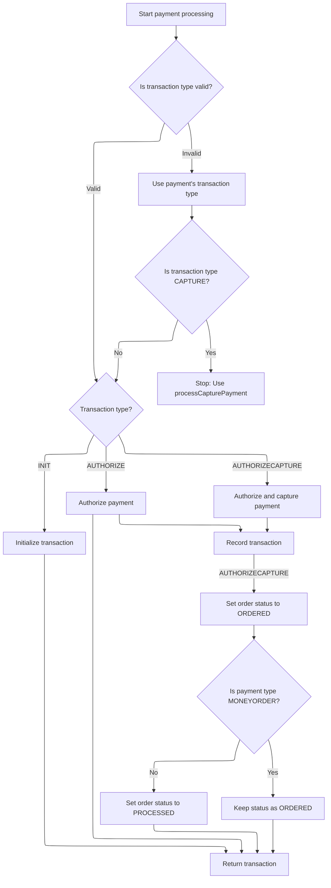

This document describes the flow for processing an order, ensuring all required details are validated, payment is handled, and the order is finalized. The process presents available payment methods to the customer, confirms payment, and updates the order status and history.

# Starting Order Processing

This section is responsible for starting the order processing workflow by validating all necessary inputs and ensuring payment is processed before proceeding with order fulfillment.

| Category        | Rule Name                 | Description                                                                                                                                                                |
| --------------- | ------------------------- | -------------------------------------------------------------------------------------------------------------------------------------------------------------------------- |
| Data validation | Required input validation | An order cannot be processed unless all required inputs (Order, Customer, ShoppingCartItems, Payment, MerchantStore, OrderTotalSummary) are present and not null or empty. |
| Business logic  | Payment-first processing  | Payment must be processed and confirmed before any further order processing steps are initiated.                                                                           |

<SwmSnippet path="/shopizer/sm-core/src/main/java/com/salesmanager/core/business/order/service/OrderServiceImpl.java" line="105">

---

In `process`, we start by validating inputs and immediately call `paymentService.processPayment` to make sure the payment is handled before doing anything else with the order.

```java
    private Order process(Order order, Customer customer, List<ShoppingCartItem> items, OrderTotalSummary summary, Payment payment, Transaction transaction, MerchantStore store) throws ServiceException {
    	
    	
    	Validate.notNull(order, "Order cannot be null");
    	Validate.notNull(customer, "Customer cannot be null (even if anonymous order)");
    	Validate.notEmpty(items, "ShoppingCart items cannot be null");
    	Validate.notNull(payment, "Payment cannot be null");
    	Validate.notNull(store, "MerchantStore cannot be null");
    	Validate.notNull(summary, "Order total Summary cannot be null");
    	
    	//first process payment
    	Transaction processTransaction = paymentService.processPayment(customer, store, payment, items, order);
```

---

</SwmSnippet>

## Validating and Routing Payment

This section is responsible for validating all payment-related inputs, ensuring the store has an active and configured payment module, setting the correct transaction type, validating credit card details if applicable, and routing the payment to the appropriate payment module.

| Category        | Rule Name                           | Description                                                                                                                                       |
| --------------- | ----------------------------------- | ------------------------------------------------------------------------------------------------------------------------------------------------- |
| Data validation | Mandatory Payment Inputs            | A payment transaction cannot be processed unless the customer, store, payment details, order, and order total are all provided and not null.      |
| Data validation | Configured Payment Module Required  | A payment transaction cannot proceed unless the store has at least one payment module configured.                                                 |
| Data validation | Active Payment Module Enforcement   | A payment transaction cannot proceed unless the selected payment module is both configured and active for the store.                              |
| Data validation | Credit Card Validation              | If the payment is a credit card payment, the credit card number, type, expiration month, and expiration year must be validated before processing. |
| Data validation | Existing Payment Module Requirement | If the specified payment module does not exist in the system, the payment transaction must not proceed.                                           |
| Business logic  | Default Transaction Type            | If the payment module does not specify a transaction type, the default transaction type must be set to 'AUTHORIZECAPTURE'.                        |

<SwmSnippet path="/shopizer/sm-core/src/main/java/com/salesmanager/core/business/payments/service/PaymentServiceImpl.java" line="296">

---

In `processPayment`, we validate all the payment-related inputs and check that the store has a configured and active payment module. We also set up the transaction type and validate credit card details if needed. Next, we fetch the payment method details using the module code to route the payment correctly.

```java
	public Transaction processPayment(Customer customer,
			MerchantStore store, Payment payment, List<ShoppingCartItem> items, Order order)
			throws ServiceException {


		Validate.notNull(customer);
		Validate.notNull(store);
		Validate.notNull(payment);
		Validate.notNull(order);
		Validate.notNull(order.getTotal());
		
		payment.setCurrency(store.getCurrency());
		
		BigDecimal amount = order.getTotal();

		//must have a shipping module configured
		Map<String, IntegrationConfiguration> modules = this.getPaymentModulesConfigured(store);
		if(modules==null){
			throw new ServiceException("No payment module configured");
		}
		
		IntegrationConfiguration configuration = modules.get(payment.getModuleName());
		
		if(configuration==null) {
			throw new ServiceException("Payment module " + payment.getModuleName() + " is not configured");
		}
		
		if(!configuration.isActive()) {
			throw new ServiceException("Payment module " + payment.getModuleName() + " is not active");
		}
		
		String sTransactionType = configuration.getIntegrationKeys().get("transaction");
		if(sTransactionType==null) {
			sTransactionType = TransactionType.AUTHORIZECAPTURE.name();
		}
		

		if(sTransactionType.equals(TransactionType.AUTHORIZE.name())) {
			payment.setTransactionType(TransactionType.AUTHORIZE);
		} else {
			payment.setTransactionType(TransactionType.AUTHORIZECAPTURE);
		} 
		

		PaymentModule module = this.paymentModules.get(payment.getModuleName());
		
		if(module==null) {
			throw new ServiceException("Payment module " + payment.getModuleName() + " does not exist");
		}
		
		if(payment instanceof CreditCardPayment) {
			CreditCardPayment creditCardPayment = (CreditCardPayment)payment;
			validateCreditCard(creditCardPayment.getCreditCardNumber(),creditCardPayment.getCreditCard(),creditCardPayment.getExpirationMonth(),creditCardPayment.getExpirationYear());
		}
		
		IntegrationModule integrationModule = getPaymentMethodByCode(store,payment.getModuleName());
```

---

</SwmSnippet>

### Locating the Payment Method

This section is responsible for locating and returning the payment method configuration (IntegrationModule) for a specific store, based on a unique payment method code. This enables the system to process payments using the correct provider configuration for each store.

| Category        | Rule Name                    | Description                                                                                                                                                   |
| --------------- | ---------------------------- | ------------------------------------------------------------------------------------------------------------------------------------------------------------- |
| Data validation | Unique Payment Method Code   | A payment method configuration must be uniquely identified by its code within the context of a store. Only one IntegrationModule per code per store is valid. |
| Data validation | Exact Code Match Requirement | The system must only return a payment method configuration if the code matches exactly (case-sensitive) with an existing IntegrationModule for the store.     |

<SwmSnippet path="/shopizer/sm-core/src/main/java/com/salesmanager/core/business/payments/service/PaymentServiceImpl.java" line="147">

---

`getPaymentMethodByCode` looks up the payment method configuration for the store using the provided code. This gives us the IntegrationModule needed to process the payment with the right provider.

```java
	public IntegrationModule getPaymentMethodByCode(MerchantStore store,
			String code) throws ServiceException {
		List<IntegrationModule> modules =  getPaymentMethods(store);

		for(IntegrationModule module : modules) {
			if(module.getCode().equals(code)) {
				
				return module;
			}
		}
		
		return null;
	}
```

---

</SwmSnippet>

### Fetching Available Payment Methods

This section determines which payment methods are available for a customer based on their current shopping context, including cart contents, location, and order value. The goal is to ensure that only valid and applicable payment options are presented to the customer.

| Category        | Rule Name                             | Description                                                                                                                                                     |
| --------------- | ------------------------------------- | --------------------------------------------------------------------------------------------------------------------------------------------------------------- |
| Data validation | Verification-required payment methods | Payment methods that require additional customer verification (e.g., age, identity) should only be shown if the required information is available and verified. |
| Business logic  | Store enabled payment methods         | Only payment methods that are enabled in the store configuration should be presented to the customer.                                                           |
| Business logic  | Location-based payment filtering      | Payment methods must be filtered based on the customer's location; for example, some methods may only be available in certain countries or regions.             |
| Business logic  | Order value payment eligibility       | If the order total is below or above certain thresholds, some payment methods may not be available (e.g., installment payments only for orders above $100).     |

See <SwmLink doc-title="Providing region-appropriate payment methods">[Providing region-appropriate payment methods](\.swm\providing-region-appropriate-payment-methods.j44y9ayy.sw.md)</SwmLink>

### Executing Payment Action and Recording Transaction



<SwmSnippet path="/shopizer/sm-core/src/main/java/com/salesmanager/core/business/payments/service/PaymentServiceImpl.java" line="352">

---

Back in `processPayment`, after getting the IntegrationModule, we pick the payment action (authorize, capture, init) and call the right method on the payment module. We update the order status depending on the payment result and type, and create the transaction record if needed.

```java
		TransactionType transactionType = TransactionType.valueOf(sTransactionType);
		if(transactionType==null) {
			transactionType = payment.getTransactionType();
			if(transactionType.equals(TransactionType.CAPTURE.name())) {
				throw new ServiceException("This method does not allow to process capture transaction. Use processCapturePayment");
			}
		}
		
		Transaction transaction = null;
		if(transactionType == TransactionType.AUTHORIZE)  {
			transaction = module.authorize(store, customer, items, amount, payment, configuration, integrationModule);
		} else if(transactionType == TransactionType.AUTHORIZECAPTURE)  {
			transaction = module.authorizeAndCapture(store, customer, items, amount, payment, configuration, integrationModule);
		} else if(transactionType == TransactionType.INIT)  {
			transaction = module.initTransaction(store, customer, amount, payment, configuration, integrationModule);
		}


		if(transactionType != TransactionType.INIT) {
			transactionService.create(transaction);
		}
		
		if(transactionType == TransactionType.AUTHORIZECAPTURE)  {
			order.setStatus(OrderStatus.ORDERED);
			if(payment.getPaymentType().name()!=PaymentType.MONEYORDER.name()) {
				order.setStatus(OrderStatus.PROCESSED);
			}
		}

		return transaction;

		

	}
```

---

</SwmSnippet>

## Finalizing Order and Transaction

```mermaid
%%{init: {"flowchart": {"defaultRenderer": "elk"}} }%%
flowchart TD
    node1["Start order processing"]
    click node1 openCode "shopizer/sm-core/src/main/java/com/salesmanager/core/business/order/service/OrderServiceImpl.java:117:119"
    node1 --> node2{"Order status/history missing?"}
    click node2 openCode "shopizer/sm-core/src/main/java/com/salesmanager/core/business/order/service/OrderServiceImpl.java:119:133"
    node2 -->|"Yes"| node3["Initialize order status and history"]
    click node3 openCode "shopizer/sm-core/src/main/java/com/salesmanager/core/business/order/service/OrderServiceImpl.java:119:133"
    node2 -->|"No"| node4{"Customer is new?"}
    node3 --> node4
    click node4 openCode "shopizer/sm-core/src/main/java/com/salesmanager/core/business/order/service/OrderServiceImpl.java:135:137"
    node4 -->|"Yes"| node5["Create customer"]
    click node5 openCode "shopizer/sm-core/src/main/java/com/salesmanager/core/business/order/service/OrderServiceImpl.java:135:137"
    node4 -->|"No"| node6["Persist order"]
    node5 --> node6
    click node6 openCode "shopizer/sm-core/src/main/java/com/salesmanager/core/business/order/service/OrderServiceImpl.java:139:141"
    node6 --> node7{"Transaction exists?"}
    click node7 openCode "shopizer/sm-core/src/main/java/com/salesmanager/core/business/order/service/OrderServiceImpl.java:143:150"
    node7 -->|"Yes"| node8{"Transaction is new?"}
    node7 -->|"No"| node10{"Process transaction exists?"}
    node8 -->|"Yes"| node9["Create transaction"]
    click node9 openCode "shopizer/sm-core/src/main/java/com/salesmanager/core/business/order/service/OrderServiceImpl.java:146:147"
    node8 -->|"No"| node11["Update transaction"]
    click node11 openCode "shopizer/sm-core/src/main/java/com/salesmanager/core/business/order/service/OrderServiceImpl.java:148:149"
    node9 --> node10
    node11 --> node10
    node7 -->|"No transaction"| node10
    node10 -->|"Yes"| node12{"Process transaction is new?"}
    node10 -->|"No process transaction"| node14["Return order"]
    click node14 openCode "shopizer/sm-core/src/main/java/com/salesmanager/core/business/order/service/OrderServiceImpl.java:161:161"
    node12 -->|"Yes"| node13["Create process transaction"]
    click node13 openCode "shopizer/sm-core/src/main/java/com/salesmanager/core/business/order/service/OrderServiceImpl.java:155:156"
    node12 -->|"No"| node15["Update process transaction"]
    click node15 openCode "shopizer/sm-core/src/main/java/com/salesmanager/core/business/order/service/OrderServiceImpl.java:157:158"
    node13 --> node14
    node15 --> node14
classDef HeadingStyle fill:#777777,stroke:#333,stroke-width:2px;
```



<SwmSnippet path="/shopizer/sm-core/src/main/java/com/salesmanager/core/business/order/service/OrderServiceImpl.java" line="117">

---

Back in `OrderServiceImpl.process`, after payment is handled, we set up order history and status, create the customer if needed, and link the transaction(s) to the order. This ties together the payment and order records for tracking.

```java
    	//transactionService.save(processTransaction);
    	
    	if(order.getOrderHistory()==null || order.getOrderHistory().size()==0 || order.getStatus()==null) {
    		OrderStatus status = order.getStatus();
    		if(status==null) {
    			status = OrderStatus.ORDERED;
    			order.setStatus(status);
    		}
    		Set<OrderStatusHistory> statusHistorySet = new HashSet<OrderStatusHistory>();
    		OrderStatusHistory statusHistory = new OrderStatusHistory();
    		statusHistory.setStatus(status);
    		statusHistory.setDateAdded(new Date());
    		statusHistory.setOrder(order);
    		statusHistorySet.add(statusHistory);
    		order.setOrderHistory(statusHistorySet);
    		
    	}
    	
    	if(customer.getId()==null || customer.getId()==0) {
    		customerService.create(customer);
    	}
    	
    	order.setCustomerId(customer.getId());
    	
    	this.create(order);

    	if(transaction!=null) {
    		transaction.setOrder(order);
    		if(transaction.getId()==null || transaction.getId()==0) {
    			transactionService.create(transaction);
    		} else {
    			transactionService.update(transaction);
    		}
    	}
    	
    	if(processTransaction!=null) {
    		processTransaction.setOrder(order);
    		if(processTransaction.getId()==null || processTransaction.getId()==0) {
    			transactionService.create(processTransaction);
    		} else {
    			transactionService.update(processTransaction);
    		}
    	}
    	
    	return order;
    	
    	
    }
```

---

</SwmSnippet>

&nbsp;

*This is an auto-generated document by Swimm 🌊 and has not yet been verified by a human*

<SwmMeta version="3.0.0" repo-id="Z2l0aHViJTNBJTNBU2hvcGl6ZXIlM0ElM0F1bWFsaW5nYXN3YW1p" repo-name="Shopizer"><sup>Powered by [Swimm](https://app.swimm.io/)</sup></SwmMeta>
