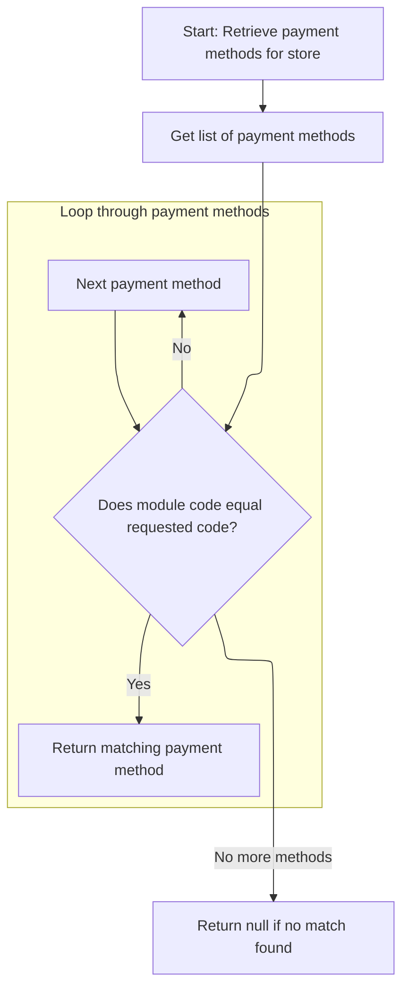
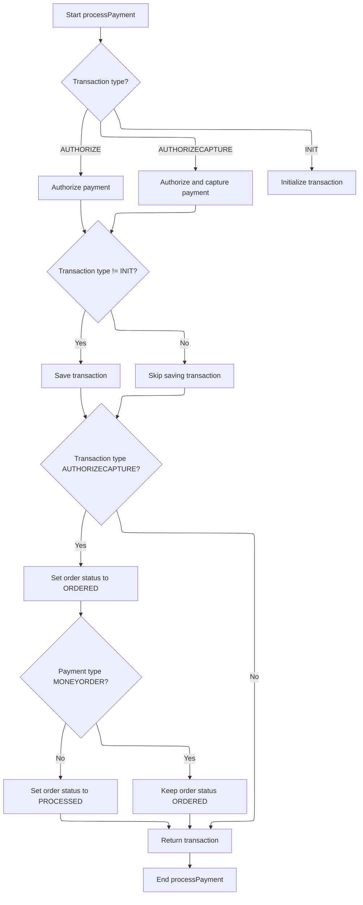

This document describes the process of handling an order from initial validation through payment authorization and capture to finalizing the order. It covers validating order and payment details, selecting and using the appropriate payment module, executing the payment transaction, updating the order status accordingly, and saving all transaction and order history data.

The flow receives order details including customer, items, payment, and store information as input, and outputs a finalized order with updated status and saved transaction records.

# Starting the order processing

This section handles the initial steps of order processing by validating inputs and confirming payment before proceeding.

| Category        | Rule Name                     | Description                                                                                |
| --------------- | ----------------------------- | ------------------------------------------------------------------------------------------ |
| Data validation | Order must exist              | The order must not be null to proceed with processing.                                     |
| Data validation | Customer information required | The customer information must be provided, even for anonymous orders.                      |
| Data validation | Non-empty shopping cart       | The shopping cart must contain at least one item to proceed.                               |
| Data validation | Payment required              | Payment information must be provided and valid before processing the order.                |
| Data validation | Merchant store required       | Merchant store information must be provided to associate the order with the correct store. |
| Data validation | Order total summary required  | Order total summary must be provided to verify the order's financial details.              |
| Business logic  | Payment confirmation required | Payment must be successfully processed and confirmed before the order can proceed.         |

<SwmSnippet path="/shopizer/sm-core/src/main/java/com/salesmanager/core/business/order/service/OrderServiceImpl.java" line="105">

---

We validate inputs and then call payment processing to confirm payment before moving on.

```java
    private Order process(Order order, Customer customer, List<ShoppingCartItem> items, OrderTotalSummary summary, Payment payment, Transaction transaction, MerchantStore store) throws ServiceException {
    	
    	
    	Validate.notNull(order, "Order cannot be null");
    	Validate.notNull(customer, "Customer cannot be null (even if anonymous order)");
    	Validate.notEmpty(items, "ShoppingCart items cannot be null");
    	Validate.notNull(payment, "Payment cannot be null");
    	Validate.notNull(store, "MerchantStore cannot be null");
    	Validate.notNull(summary, "Order total Summary cannot be null");
    	
    	//first process payment
    	Transaction processTransaction = paymentService.processPayment(customer, store, payment, items, order);
```

---

</SwmSnippet>

## Handling payment authorization and capture

This section handles payment authorization and capture by validating inputs, checking payment module configuration and status, setting transaction types, and validating credit card details if applicable.

| Category        | Rule Name                             | Description                                                                                                                  |
| --------------- | ------------------------------------- | ---------------------------------------------------------------------------------------------------------------------------- |
| Data validation | Input validation                      | The payment process must validate that customer, store, payment, order, and order total are not null before proceeding.      |
| Data validation | Payment module configuration required | A payment module must be configured for the store to process payments; if none are configured, the payment cannot proceed.   |
| Data validation | Active payment module required        | The requested payment module must exist and be active; inactive or non-existent modules prevent payment processing.          |
| Data validation | Credit card validation                | Credit card payments must have valid credit card number, card type, expiration month, and expiration year before processing. |
| Business logic  | Default transaction type              | If the transaction type is not specified in the payment module configuration, it defaults to AUTHORIZECAPTURE.               |
| Business logic  | Transaction type setting              | The transaction type must be set to either AUTHORIZE or AUTHORIZECAPTURE based on the payment module configuration.          |

<SwmSnippet path="/shopizer/sm-core/src/main/java/com/salesmanager/core/business/payments/service/PaymentServiceImpl.java" line="296">

---

In `processPayment`, we start by validating inputs again, then check if the store has payment modules configured. We verify the requested payment module exists and is active. We also set the transaction type based on configuration and validate credit card details if applicable. This sets up the payment module for the actual transaction.

```java
	public Transaction processPayment(Customer customer,
			MerchantStore store, Payment payment, List<ShoppingCartItem> items, Order order)
			throws ServiceException {


		Validate.notNull(customer);
		Validate.notNull(store);
		Validate.notNull(payment);
		Validate.notNull(order);
		Validate.notNull(order.getTotal());
		
		payment.setCurrency(store.getCurrency());
		
		BigDecimal amount = order.getTotal();

		//must have a shipping module configured
		Map<String, IntegrationConfiguration> modules = this.getPaymentModulesConfigured(store);
		if(modules==null){
			throw new ServiceException("No payment module configured");
		}
		
		IntegrationConfiguration configuration = modules.get(payment.getModuleName());
		
		if(configuration==null) {
			throw new ServiceException("Payment module " + payment.getModuleName() + " is not configured");
		}
		
		if(!configuration.isActive()) {
			throw new ServiceException("Payment module " + payment.getModuleName() + " is not active");
		}
		
		String sTransactionType = configuration.getIntegrationKeys().get("transaction");
		if(sTransactionType==null) {
			sTransactionType = TransactionType.AUTHORIZECAPTURE.name();
		}
		

		if(sTransactionType.equals(TransactionType.AUTHORIZE.name())) {
			payment.setTransactionType(TransactionType.AUTHORIZE);
		} else {
			payment.setTransactionType(TransactionType.AUTHORIZECAPTURE);
		} 
		

		PaymentModule module = this.paymentModules.get(payment.getModuleName());
		
		if(module==null) {
			throw new ServiceException("Payment module " + payment.getModuleName() + " does not exist");
		}
		
		if(payment instanceof CreditCardPayment) {
			CreditCardPayment creditCardPayment = (CreditCardPayment)payment;
			validateCreditCard(creditCardPayment.getCreditCardNumber(),creditCardPayment.getCreditCard(),creditCardPayment.getExpirationMonth(),creditCardPayment.getExpirationYear());
		}
		
		IntegrationModule integrationModule = getPaymentMethodByCode(store,payment.getModuleName());
```

---

</SwmSnippet>

### Retrieving payment method details by code



This section describes the process of retrieving a payment method by its unique code for a given store.

| Category       | Rule Name                      | Description                                                                                                                |
| -------------- | ------------------------------ | -------------------------------------------------------------------------------------------------------------------------- |
| Business logic | Store-specific payment methods | Only payment methods associated with the specified store are considered for retrieval.                                     |
| Business logic | Unique payment method code     | The payment method must be identified uniquely by its code within the store's payment methods.                             |
| Business logic | Null return for no match       | If no payment method matches the given code, the system returns null indicating no available payment method for that code. |

<SwmSnippet path="/shopizer/sm-core/src/main/java/com/salesmanager/core/business/payments/service/PaymentServiceImpl.java" line="147">

---

We find and return the payment method matching the code.

```java
	public IntegrationModule getPaymentMethodByCode(MerchantStore store,
			String code) throws ServiceException {
		List<IntegrationModule> modules =  getPaymentMethods(store);

		for(IntegrationModule module : modules) {
			if(module.getCode().equals(code)) {
				
				return module;
			}
		}
		
		return null;
	}
```

---

</SwmSnippet>

### Listing all payment methods for a store

This section lists all payment methods available for a store, allowing customers to select their preferred payment option during checkout.

| Category       | Rule Name                       | Description                                                                                                                 |
| -------------- | ------------------------------- | --------------------------------------------------------------------------------------------------------------------------- |
| Business logic | Enabled payment methods only    | Only payment methods that are enabled for the store should be listed to the customer.                                       |
| Business logic | Payment method display details  | Payment methods must be listed with their display names and any relevant details to help customers make an informed choice. |
| Business logic | Consistent payment method order | Payment methods should be listed in a consistent order to provide a predictable user experience.                            |

See <SwmLink doc-title="Retrieving applicable payment methods">[Retrieving applicable payment methods](\.swm\retrieving-applicable-payment-methods.ymmn89gr.sw.md)</SwmLink>

### Executing payment transaction and updating order status



<SwmSnippet path="/shopizer/sm-core/src/main/java/com/salesmanager/core/business/payments/service/PaymentServiceImpl.java" line="352">

---

After returning from `getPaymentMethodByCode`, we use the transaction type to decide which payment module method to call: authorize, authorizeAndCapture, or initTransaction. We save the transaction if it's not just an init. Then, we update the order status based on payment type and transaction outcome.

```java
		TransactionType transactionType = TransactionType.valueOf(sTransactionType);
		if(transactionType==null) {
			transactionType = payment.getTransactionType();
			if(transactionType.equals(TransactionType.CAPTURE.name())) {
				throw new ServiceException("This method does not allow to process capture transaction. Use processCapturePayment");
			}
		}
		
		Transaction transaction = null;
		if(transactionType == TransactionType.AUTHORIZE)  {
			transaction = module.authorize(store, customer, items, amount, payment, configuration, integrationModule);
		} else if(transactionType == TransactionType.AUTHORIZECAPTURE)  {
			transaction = module.authorizeAndCapture(store, customer, items, amount, payment, configuration, integrationModule);
		} else if(transactionType == TransactionType.INIT)  {
			transaction = module.initTransaction(store, customer, amount, payment, configuration, integrationModule);
		}


		if(transactionType != TransactionType.INIT) {
			transactionService.create(transaction);
		}
		
		if(transactionType == TransactionType.AUTHORIZECAPTURE)  {
			order.setStatus(OrderStatus.ORDERED);
			if(payment.getPaymentType().name()!=PaymentType.MONEYORDER.name()) {
				order.setStatus(OrderStatus.PROCESSED);
			}
		}

		return transaction;

		

	}
```

---

</SwmSnippet>

## Finalizing order and saving transaction details

```mermaid
%%{init: {"flowchart": {"defaultRenderer": "elk"}} }%%
flowchart TD
    node1{"Order history empty or status null?"}
    click node1 openCode "shopizer/sm-core/src/main/java/com/salesmanager/core/business/order/service/OrderServiceImpl.java:119:133"
    node1 -->|"Yes"| node2["Initialize order status and history"]
    click node2 openCode "shopizer/sm-core/src/main/java/com/salesmanager/core/business/order/service/OrderServiceImpl.java:120:131"
    node1 -->|"No"| node4{"Customer is new?"}
    click node4 openCode "shopizer/sm-core/src/main/java/com/salesmanager/core/business/order/service/OrderServiceImpl.java:135:137"
    node2 --> node4
    node4 -->|"Yes"| node5["Create customer"]
    click node5 openCode "shopizer/sm-core/src/main/java/com/salesmanager/core/business/order/service/OrderServiceImpl.java:136:136"
    node4 -->|"No"| node7["Set customer ID on order"]
    click node7 openCode "shopizer/sm-core/src/main/java/com/salesmanager/core/business/order/service/OrderServiceImpl.java:139:139"
    node5 --> node7
    node7 --> node8["Save order"]
    click node8 openCode "shopizer/sm-core/src/main/java/com/salesmanager/core/business/order/service/OrderServiceImpl.java:141:141"
    node8 --> node9{"Transaction exists?"}
    click node9 openCode "shopizer/sm-core/src/main/java/com/salesmanager/core/business/order/service/OrderServiceImpl.java:143:150"
    node9 -->|"Yes"| node10{"Transaction is new?"}
    click node10 openCode "shopizer/sm-core/src/main/java/com/salesmanager/core/business/order/service/OrderServiceImpl.java:145:149"
    node9 -->|"No"| node14{"ProcessTransaction exists?"}
    click node14 openCode "shopizer/sm-core/src/main/java/com/salesmanager/core/business/order/service/OrderServiceImpl.java:152:159"
    node10 -->|"Yes"| node11["Create transaction"]
    click node11 openCode "shopizer/sm-core/src/main/java/com/salesmanager/core/business/order/service/OrderServiceImpl.java:146:146"
    node10 -->|"No"| node12["Update transaction"]
    click node12 openCode "shopizer/sm-core/src/main/java/com/salesmanager/core/business/order/service/OrderServiceImpl.java:148:149"
    node11 --> node14
    node12 --> node14
    node14 -->|"Yes"| node15{"ProcessTransaction is new?"}
    click node15 openCode "shopizer/sm-core/src/main/java/com/salesmanager/core/business/order/service/OrderServiceImpl.java:154:158"
    node14 -->|"No"| node19["Return order"]
    click node19 openCode "shopizer/sm-core/src/main/java/com/salesmanager/core/business/order/service/OrderServiceImpl.java:161:161"
    node15 -->|"Yes"| node16["Create processTransaction"]
    click node16 openCode "shopizer/sm-core/src/main/java/com/salesmanager/core/business/order/service/OrderServiceImpl.java:155:155"
    node15 -->|"No"| node17["Update processTransaction"]
    click node17 openCode "shopizer/sm-core/src/main/java/com/salesmanager/core/business/order/service/OrderServiceImpl.java:157:158"
    node16 --> node19
    node17 --> node19
classDef HeadingStyle fill:#777777,stroke:#333,stroke-width:2px;
```



<SwmSnippet path="/shopizer/sm-core/src/main/java/com/salesmanager/core/business/order/service/OrderServiceImpl.java" line="117">

---

We create order history, save new customers, save the order, and persist transactions.

```java
    	//transactionService.save(processTransaction);
    	
    	if(order.getOrderHistory()==null || order.getOrderHistory().size()==0 || order.getStatus()==null) {
    		OrderStatus status = order.getStatus();
    		if(status==null) {
    			status = OrderStatus.ORDERED;
    			order.setStatus(status);
    		}
    		Set<OrderStatusHistory> statusHistorySet = new HashSet<OrderStatusHistory>();
    		OrderStatusHistory statusHistory = new OrderStatusHistory();
    		statusHistory.setStatus(status);
    		statusHistory.setDateAdded(new Date());
    		statusHistory.setOrder(order);
    		statusHistorySet.add(statusHistory);
    		order.setOrderHistory(statusHistorySet);
    		
    	}
    	
    	if(customer.getId()==null || customer.getId()==0) {
    		customerService.create(customer);
    	}
    	
    	order.setCustomerId(customer.getId());
    	
    	this.create(order);

    	if(transaction!=null) {
    		transaction.setOrder(order);
    		if(transaction.getId()==null || transaction.getId()==0) {
    			transactionService.create(transaction);
    		} else {
    			transactionService.update(transaction);
    		}
    	}
    	
    	if(processTransaction!=null) {
    		processTransaction.setOrder(order);
    		if(processTransaction.getId()==null || processTransaction.getId()==0) {
    			transactionService.create(processTransaction);
    		} else {
    			transactionService.update(processTransaction);
    		}
    	}
    	
    	return order;
    	
    	
    }
```

---

</SwmSnippet>

&nbsp;

*This is an auto-generated document by Swimm 🌊 and has not yet been verified by a human*

<SwmMeta version="3.0.0" repo-id="Z2l0aHViJTNBJTNBU2hvcGl6ZXIlM0ElM0F1bWFsaW5nYXN3YW1p" repo-name="Shopizer"><sup>Powered by [Swimm](https://app.swimm.io/)</sup></SwmMeta>
