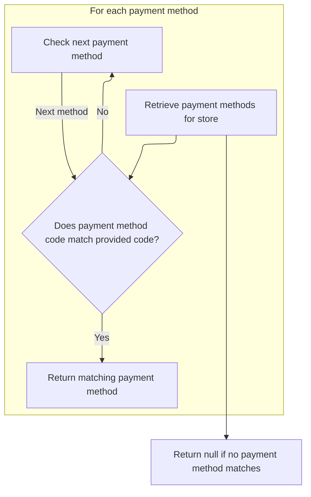

This document describes how a customer's order is processed from start to finish, supporting the core e-commerce checkout experience. The flow receives order details, customer information, cart items, payment, and store data, then validates and processes payment using the appropriate module. The order status is updated based on the payment outcome, and the finalized order is saved with its transaction linked.

# Starting Order Processing

<SwmSnippet path="/shopizer/sm-core/src/main/java/com/salesmanager/core/business/order/service/OrderServiceImpl.java" line="100">

---

<SwmToken path="shopizer/sm-core/src/main/java/com/salesmanager/core/business/order/service/OrderServiceImpl.java" pos="100:5:5" line-data="    public Order processOrder(Order order, Customer customer, List&lt;ShoppingCartItem&gt; items, OrderTotalSummary summary, Payment payment, Transaction transaction, MerchantStore store) throws ServiceException {">`processOrder`</SwmToken> just kicks off the flow by passing all the relevant objects (order, customer, cart items, summary, payment, transaction, store) straight to <SwmToken path="shopizer/sm-core/src/main/java/com/salesmanager/core/business/order/service/OrderServiceImpl.java" pos="102:5:5" line-data="    	return this.process(order, customer, items, summary, payment, transaction, store);">`process`</SwmToken>. There's no extra logic here—it's just a handoff. We need to call <SwmToken path="shopizer/sm-core/src/main/java/com/salesmanager/core/business/order/service/OrderServiceImpl.java" pos="102:5:5" line-data="    	return this.process(order, customer, items, summary, payment, transaction, store);">`process`</SwmToken> next because that's where all the actual order handling happens.

```java
    public Order processOrder(Order order, Customer customer, List<ShoppingCartItem> items, OrderTotalSummary summary, Payment payment, Transaction transaction, MerchantStore store) throws ServiceException {
    	
    	return this.process(order, customer, items, summary, payment, transaction, store);
    }
```

---

</SwmSnippet>

# Validating and Initiating Payment

<SwmSnippet path="/shopizer/sm-core/src/main/java/com/salesmanager/core/business/order/service/OrderServiceImpl.java" line="105">

---

<SwmToken path="shopizer/sm-core/src/main/java/com/salesmanager/core/business/order/service/OrderServiceImpl.java" pos="105:5:5" line-data="    private Order process(Order order, Customer customer, List&lt;ShoppingCartItem&gt; items, OrderTotalSummary summary, Payment payment, Transaction transaction, MerchantStore store) throws ServiceException {">`process`</SwmToken> checks all the inputs, then immediately starts payment processing to make sure the transaction is good before doing anything else.

```java
    private Order process(Order order, Customer customer, List<ShoppingCartItem> items, OrderTotalSummary summary, Payment payment, Transaction transaction, MerchantStore store) throws ServiceException {
    	
    	
    	Validate.notNull(order, "Order cannot be null");
    	Validate.notNull(customer, "Customer cannot be null (even if anonymous order)");
    	Validate.notEmpty(items, "ShoppingCart items cannot be null");
    	Validate.notNull(payment, "Payment cannot be null");
    	Validate.notNull(store, "MerchantStore cannot be null");
    	Validate.notNull(summary, "Order total Summary cannot be null");
    	
    	//first process payment
    	Transaction processTransaction = paymentService.processPayment(customer, store, payment, items, order);
```

---

</SwmSnippet>

## Preparing Payment Module

<SwmSnippet path="/shopizer/sm-core/src/main/java/com/salesmanager/core/business/payments/service/PaymentServiceImpl.java" line="296">

---

In <SwmToken path="shopizer/sm-core/src/main/java/com/salesmanager/core/business/payments/service/PaymentServiceImpl.java" pos="296:5:5" line-data="	public Transaction processPayment(Customer customer,">`processPayment`</SwmToken>, we validate all the payment-related inputs and make sure the payment module is set up and active. We figure out the transaction type and check credit card details if needed. Next, we call <SwmToken path="shopizer/sm-core/src/main/java/com/salesmanager/core/business/payments/service/PaymentServiceImpl.java" pos="351:7:7" line-data="		IntegrationModule integrationModule = getPaymentMethodByCode(store,payment.getModuleName());">`getPaymentMethodByCode`</SwmToken> to fetch the integration module for the payment method, which is needed to actually run the payment logic.

```java
	public Transaction processPayment(Customer customer,
			MerchantStore store, Payment payment, List<ShoppingCartItem> items, Order order)
			throws ServiceException {


		Validate.notNull(customer);
		Validate.notNull(store);
		Validate.notNull(payment);
		Validate.notNull(order);
		Validate.notNull(order.getTotal());
		
		payment.setCurrency(store.getCurrency());
		
		BigDecimal amount = order.getTotal();

		//must have a shipping module configured
		Map<String, IntegrationConfiguration> modules = this.getPaymentModulesConfigured(store);
		if(modules==null){
			throw new ServiceException("No payment module configured");
		}
		
		IntegrationConfiguration configuration = modules.get(payment.getModuleName());
		
		if(configuration==null) {
			throw new ServiceException("Payment module " + payment.getModuleName() + " is not configured");
		}
		
		if(!configuration.isActive()) {
			throw new ServiceException("Payment module " + payment.getModuleName() + " is not active");
		}
		
		String sTransactionType = configuration.getIntegrationKeys().get("transaction");
		if(sTransactionType==null) {
			sTransactionType = TransactionType.AUTHORIZECAPTURE.name();
		}
		

		if(sTransactionType.equals(TransactionType.AUTHORIZE.name())) {
			payment.setTransactionType(TransactionType.AUTHORIZE);
		} else {
			payment.setTransactionType(TransactionType.AUTHORIZECAPTURE);
		} 
		

		PaymentModule module = this.paymentModules.get(payment.getModuleName());
		
		if(module==null) {
			throw new ServiceException("Payment module " + payment.getModuleName() + " does not exist");
		}
		
		if(payment instanceof CreditCardPayment) {
			CreditCardPayment creditCardPayment = (CreditCardPayment)payment;
			validateCreditCard(creditCardPayment.getCreditCardNumber(),creditCardPayment.getCreditCard(),creditCardPayment.getExpirationMonth(),creditCardPayment.getExpirationYear());
		}
		
		IntegrationModule integrationModule = getPaymentMethodByCode(store,payment.getModuleName());
```

---

</SwmSnippet>

### Selecting Payment Integration



<SwmSnippet path="/shopizer/sm-core/src/main/java/com/salesmanager/core/business/payments/service/PaymentServiceImpl.java" line="147">

---

<SwmToken path="shopizer/sm-core/src/main/java/com/salesmanager/core/business/payments/service/PaymentServiceImpl.java" pos="147:5:5" line-data="	public IntegrationModule getPaymentMethodByCode(MerchantStore store,">`getPaymentMethodByCode`</SwmToken> finds the integration module for the payment method code so we know how to handle the payment.

```java
	public IntegrationModule getPaymentMethodByCode(MerchantStore store,
			String code) throws ServiceException {
		List<IntegrationModule> modules =  getPaymentMethods(store);

		for(IntegrationModule module : modules) {
			if(module.getCode().equals(code)) {
				
				return module;
			}
		}
		
		return null;
	}
```

---

</SwmSnippet>

### Fetching Store Payment Methods

See <SwmLink doc-title="Getting available payment methods for a store">[Getting available payment methods for a store](.swm%5Cgetting-available-payment-methods-for-a-store.rv40l0xf.sw.md)</SwmLink>

### Executing Payment and Updating Order

```mermaid
%%{init: {"flowchart": {"defaultRenderer": "elk"}} }%%
flowchart TD
    node1["Start payment processing"] --> node2{"Is transaction type valid?"}
    click node1 openCode "shopizer/sm-core/src/main/java/com/salesmanager/core/business/payments/service/PaymentServiceImpl.java:352:353"
    node2 -->|"Yes"| node3{"Transaction type?"}
    node2 -->|"No"| node4["Use payment's transaction type"]
    click node2 openCode "shopizer/sm-core/src/main/java/com/salesmanager/core/business/payments/service/PaymentServiceImpl.java:353:358"
    node4 --> node5{"Is transaction type CAPTURE?"}
    click node4 openCode "shopizer/sm-core/src/main/java/com/salesmanager/core/business/payments/service/PaymentServiceImpl.java:354:357"
    node5 -->|"Yes"| node6["Stop: Use capture payment method"]
    click node5 openCode "shopizer/sm-core/src/main/java/com/salesmanager/core/business/payments/service/PaymentServiceImpl.java:356:357"
    node5 -->|"No"| node3
    node3 -->|"AUTHORIZE"| node7["Authorize payment"]
    click node3 openCode "shopizer/sm-core/src/main/java/com/salesmanager/core/business/payments/service/PaymentServiceImpl.java:361:362"
    node3 -->|"AUTHORIZECAPTURE"| node8["Authorize and capture payment"]
    click node3 openCode "shopizer/sm-core/src/main/java/com/salesmanager/core/business/payments/service/PaymentServiceImpl.java:363:364"
    node3 -->|"INIT"| node9["Initialize transaction"]
    click node3 openCode "shopizer/sm-core/src/main/java/com/salesmanager/core/business/payments/service/PaymentServiceImpl.java:365:366"
    node7 --> node10["Record transaction"]
    click node7 openCode "shopizer/sm-core/src/main/java/com/salesmanager/core/business/payments/service/PaymentServiceImpl.java:371:372"
    node8 --> node10
    node10 --> node11{"Is transaction type AUTHORIZECAPTURE?"}
    click node10 openCode "shopizer/sm-core/src/main/java/com/salesmanager/core/business/payments/service/PaymentServiceImpl.java:374:379"
    node11 -->|"Yes"| node12["Set order status to ORDERED"]
    node12 --> node13{"Is payment type MONEYORDER?"}
    node13 -->|"No"| node14["Set order status to PROCESSED"]
    node13 -->|"Yes"| node15["Keep status as ORDERED"]
    node11 -->|"No"| node16["No order status change"]
    node9 --> node17["Return transaction"]
    click node9 openCode "shopizer/sm-core/src/main/java/com/salesmanager/core/business/payments/service/PaymentServiceImpl.java:381:381"
    node14 --> node17
    node15 --> node17
    node16 --> node17
    node10 --> node17
    node6 --> node17

classDef HeadingStyle fill:#777777,stroke:#333,stroke-width:2px;

%% Swimm:
%% %%{init: {"flowchart": {"defaultRenderer": "elk"}} }%%
%% flowchart TD
%%     node1["Start payment processing"] --> node2{"Is transaction type valid?"}
%%     click node1 openCode "<SwmPath>[shopizer/…/service/PaymentServiceImpl.java](shopizer/sm-core/src/main/java/com/salesmanager/core/business/payments/service/PaymentServiceImpl.java)</SwmPath>:352:353"
%%     node2 -->|"Yes"| node3{"Transaction type?"}
%%     node2 -->|"No"| node4["Use payment's transaction type"]
%%     click node2 openCode "<SwmPath>[shopizer/…/service/PaymentServiceImpl.java](shopizer/sm-core/src/main/java/com/salesmanager/core/business/payments/service/PaymentServiceImpl.java)</SwmPath>:353:358"
%%     node4 --> node5{"Is transaction type CAPTURE?"}
%%     click node4 openCode "<SwmPath>[shopizer/…/service/PaymentServiceImpl.java](shopizer/sm-core/src/main/java/com/salesmanager/core/business/payments/service/PaymentServiceImpl.java)</SwmPath>:354:357"
%%     node5 -->|"Yes"| node6["Stop: Use capture payment method"]
%%     click node5 openCode "<SwmPath>[shopizer/…/service/PaymentServiceImpl.java](shopizer/sm-core/src/main/java/com/salesmanager/core/business/payments/service/PaymentServiceImpl.java)</SwmPath>:356:357"
%%     node5 -->|"No"| node3
%%     node3 -->|"AUTHORIZE"| node7["Authorize payment"]
%%     click node3 openCode "<SwmPath>[shopizer/…/service/PaymentServiceImpl.java](shopizer/sm-core/src/main/java/com/salesmanager/core/business/payments/service/PaymentServiceImpl.java)</SwmPath>:361:362"
%%     node3 -->|"AUTHORIZECAPTURE"| node8["Authorize and capture payment"]
%%     click node3 openCode "<SwmPath>[shopizer/…/service/PaymentServiceImpl.java](shopizer/sm-core/src/main/java/com/salesmanager/core/business/payments/service/PaymentServiceImpl.java)</SwmPath>:363:364"
%%     node3 -->|"INIT"| node9["Initialize transaction"]
%%     click node3 openCode "<SwmPath>[shopizer/…/service/PaymentServiceImpl.java](shopizer/sm-core/src/main/java/com/salesmanager/core/business/payments/service/PaymentServiceImpl.java)</SwmPath>:365:366"
%%     node7 --> node10["Record transaction"]
%%     click node7 openCode "<SwmPath>[shopizer/…/service/PaymentServiceImpl.java](shopizer/sm-core/src/main/java/com/salesmanager/core/business/payments/service/PaymentServiceImpl.java)</SwmPath>:371:372"
%%     node8 --> node10
%%     node10 --> node11{"Is transaction type AUTHORIZECAPTURE?"}
%%     click node10 openCode "<SwmPath>[shopizer/…/service/PaymentServiceImpl.java](shopizer/sm-core/src/main/java/com/salesmanager/core/business/payments/service/PaymentServiceImpl.java)</SwmPath>:374:379"
%%     node11 -->|"Yes"| node12["Set order status to ORDERED"]
%%     node12 --> node13{"Is payment type MONEYORDER?"}
%%     node13 -->|"No"| node14["Set order status to PROCESSED"]
%%     node13 -->|"Yes"| node15["Keep status as ORDERED"]
%%     node11 -->|"No"| node16["No order status change"]
%%     node9 --> node17["Return transaction"]
%%     click node9 openCode "<SwmPath>[shopizer/…/service/PaymentServiceImpl.java](shopizer/sm-core/src/main/java/com/salesmanager/core/business/payments/service/PaymentServiceImpl.java)</SwmPath>:381:381"
%%     node14 --> node17
%%     node15 --> node17
%%     node16 --> node17
%%     node10 --> node17
%%     node6 --> node17
%% 
%% classDef HeadingStyle fill:#777777,stroke:#333,stroke-width:2px;
```



<SwmSnippet path="/shopizer/sm-core/src/main/java/com/salesmanager/core/business/payments/service/PaymentServiceImpl.java" line="352">

---

We just got the integration module from <SwmToken path="shopizer/sm-core/src/main/java/com/salesmanager/core/business/payments/service/PaymentServiceImpl.java" pos="147:5:5" line-data="	public IntegrationModule getPaymentMethodByCode(MerchantStore store,">`getPaymentMethodByCode`</SwmToken>, so now <SwmToken path="shopizer/sm-core/src/main/java/com/salesmanager/core/business/order/service/OrderServiceImpl.java" pos="116:9:9" line-data="    	Transaction processTransaction = paymentService.processPayment(customer, store, payment, items, order);">`processPayment`</SwmToken> uses it to run the right payment logic (authorize, capture, etc.). It updates the order status based on the transaction type and saves the transaction if needed before returning it.

```java
		TransactionType transactionType = TransactionType.valueOf(sTransactionType);
		if(transactionType==null) {
			transactionType = payment.getTransactionType();
			if(transactionType.equals(TransactionType.CAPTURE.name())) {
				throw new ServiceException("This method does not allow to process capture transaction. Use processCapturePayment");
			}
		}
		
		Transaction transaction = null;
		if(transactionType == TransactionType.AUTHORIZE)  {
			transaction = module.authorize(store, customer, items, amount, payment, configuration, integrationModule);
		} else if(transactionType == TransactionType.AUTHORIZECAPTURE)  {
			transaction = module.authorizeAndCapture(store, customer, items, amount, payment, configuration, integrationModule);
		} else if(transactionType == TransactionType.INIT)  {
			transaction = module.initTransaction(store, customer, amount, payment, configuration, integrationModule);
		}


		if(transactionType != TransactionType.INIT) {
			transactionService.create(transaction);
		}
		
		if(transactionType == TransactionType.AUTHORIZECAPTURE)  {
			order.setStatus(OrderStatus.ORDERED);
			if(payment.getPaymentType().name()!=PaymentType.MONEYORDER.name()) {
				order.setStatus(OrderStatus.PROCESSED);
			}
		}

		return transaction;

		

	}
```

---

</SwmSnippet>

## Finalizing Order and Linking Transaction

```mermaid
%%{init: {"flowchart": {"defaultRenderer": "elk"}} }%%
flowchart TD
    node1["Start order processing"] --> node2{"Is order status/history missing?"}
    click node1 openCode "shopizer/sm-core/src/main/java/com/salesmanager/core/business/order/service/OrderServiceImpl.java:117:119"
    node2 -->|"Yes"| node3["Set order status to ORDERED and create history"]
    click node2 openCode "shopizer/sm-core/src/main/java/com/salesmanager/core/business/order/service/OrderServiceImpl.java:119:133"
    node2 -->|"No"| node4
    node3 --> node4
    node4 --> node5{"Is customer new (ID is null or 0)?"}
    click node4 openCode "shopizer/sm-core/src/main/java/com/salesmanager/core/business/order/service/OrderServiceImpl.java:134:135"
    node5 -->|"Yes"| node6["Create customer"]
    click node5 openCode "shopizer/sm-core/src/main/java/com/salesmanager/core/business/order/service/OrderServiceImpl.java:135:137"
    node5 -->|"No"| node7
    node6 --> node7
    node7["Associate customer ID with order"] --> node8["Save order"]
    click node7 openCode "shopizer/sm-core/src/main/java/com/salesmanager/core/business/order/service/OrderServiceImpl.java:139:141"
    click node8 openCode "shopizer/sm-core/src/main/java/com/salesmanager/core/business/order/service/OrderServiceImpl.java:141:142"
    node8 --> node9{"Is there a transaction?"}
    click node9 openCode "shopizer/sm-core/src/main/java/com/salesmanager/core/business/order/service/OrderServiceImpl.java:143:145"
    node9 -->|"Yes"| node10{"Is transaction new?"}
    node10 -->|"Yes"| node11["Create transaction"]
    click node11 openCode "shopizer/sm-core/src/main/java/com/salesmanager/core/business/order/service/OrderServiceImpl.java:146:147"
    node10 -->|"No"| node12["Update transaction"]
    click node12 openCode "shopizer/sm-core/src/main/java/com/salesmanager/core/business/order/service/OrderServiceImpl.java:148:149"
    node11 --> node13
    node12 --> node13
    node9 -->|"No"| node13
    node13 --> node14{"Is there a process transaction?"}
    click node13 openCode "shopizer/sm-core/src/main/java/com/salesmanager/core/business/order/service/OrderServiceImpl.java:152:154"
    node14 -->|"Yes"| node15{"Is process transaction new?"}
    node15 -->|"Yes"| node16["Create process transaction"]
    click node16 openCode "shopizer/sm-core/src/main/java/com/salesmanager/core/business/order/service/OrderServiceImpl.java:155:156"
    node15 -->|"No"| node17["Update process transaction"]
    click node17 openCode "shopizer/sm-core/src/main/java/com/salesmanager/core/business/order/service/OrderServiceImpl.java:157:158"
    node16 --> node18["Return order"]
    node17 --> node18["Return order"]
    node14 -->|"No"| node18["Return order"]
    click node18 openCode "shopizer/sm-core/src/main/java/com/salesmanager/core/business/order/service/OrderServiceImpl.java:161:162"

classDef HeadingStyle fill:#777777,stroke:#333,stroke-width:2px;

%% Swimm:
%% %%{init: {"flowchart": {"defaultRenderer": "elk"}} }%%
%% flowchart TD
%%     node1["Start order processing"] --> node2{"Is order status/history missing?"}
%%     click node1 openCode "<SwmPath>[shopizer/…/service/OrderServiceImpl.java](shopizer/sm-core/src/main/java/com/salesmanager/core/business/order/service/OrderServiceImpl.java)</SwmPath>:117:119"
%%     node2 -->|"Yes"| node3["Set order status to ORDERED and create history"]
%%     click node2 openCode "<SwmPath>[shopizer/…/service/OrderServiceImpl.java](shopizer/sm-core/src/main/java/com/salesmanager/core/business/order/service/OrderServiceImpl.java)</SwmPath>:119:133"
%%     node2 -->|"No"| node4
%%     node3 --> node4
%%     node4 --> node5{"Is customer new (ID is null or 0)?"}
%%     click node4 openCode "<SwmPath>[shopizer/…/service/OrderServiceImpl.java](shopizer/sm-core/src/main/java/com/salesmanager/core/business/order/service/OrderServiceImpl.java)</SwmPath>:134:135"
%%     node5 -->|"Yes"| node6["Create customer"]
%%     click node5 openCode "<SwmPath>[shopizer/…/service/OrderServiceImpl.java](shopizer/sm-core/src/main/java/com/salesmanager/core/business/order/service/OrderServiceImpl.java)</SwmPath>:135:137"
%%     node5 -->|"No"| node7
%%     node6 --> node7
%%     node7["Associate customer ID with order"] --> node8["Save order"]
%%     click node7 openCode "<SwmPath>[shopizer/…/service/OrderServiceImpl.java](shopizer/sm-core/src/main/java/com/salesmanager/core/business/order/service/OrderServiceImpl.java)</SwmPath>:139:141"
%%     click node8 openCode "<SwmPath>[shopizer/…/service/OrderServiceImpl.java](shopizer/sm-core/src/main/java/com/salesmanager/core/business/order/service/OrderServiceImpl.java)</SwmPath>:141:142"
%%     node8 --> node9{"Is there a transaction?"}
%%     click node9 openCode "<SwmPath>[shopizer/…/service/OrderServiceImpl.java](shopizer/sm-core/src/main/java/com/salesmanager/core/business/order/service/OrderServiceImpl.java)</SwmPath>:143:145"
%%     node9 -->|"Yes"| node10{"Is transaction new?"}
%%     node10 -->|"Yes"| node11["Create transaction"]
%%     click node11 openCode "<SwmPath>[shopizer/…/service/OrderServiceImpl.java](shopizer/sm-core/src/main/java/com/salesmanager/core/business/order/service/OrderServiceImpl.java)</SwmPath>:146:147"
%%     node10 -->|"No"| node12["Update transaction"]
%%     click node12 openCode "<SwmPath>[shopizer/…/service/OrderServiceImpl.java](shopizer/sm-core/src/main/java/com/salesmanager/core/business/order/service/OrderServiceImpl.java)</SwmPath>:148:149"
%%     node11 --> node13
%%     node12 --> node13
%%     node9 -->|"No"| node13
%%     node13 --> node14{"Is there a process transaction?"}
%%     click node13 openCode "<SwmPath>[shopizer/…/service/OrderServiceImpl.java](shopizer/sm-core/src/main/java/com/salesmanager/core/business/order/service/OrderServiceImpl.java)</SwmPath>:152:154"
%%     node14 -->|"Yes"| node15{"Is process transaction new?"}
%%     node15 -->|"Yes"| node16["Create process transaction"]
%%     click node16 openCode "<SwmPath>[shopizer/…/service/OrderServiceImpl.java](shopizer/sm-core/src/main/java/com/salesmanager/core/business/order/service/OrderServiceImpl.java)</SwmPath>:155:156"
%%     node15 -->|"No"| node17["Update process transaction"]
%%     click node17 openCode "<SwmPath>[shopizer/…/service/OrderServiceImpl.java](shopizer/sm-core/src/main/java/com/salesmanager/core/business/order/service/OrderServiceImpl.java)</SwmPath>:157:158"
%%     node16 --> node18["Return order"]
%%     node17 --> node18["Return order"]
%%     node14 -->|"No"| node18["Return order"]
%%     click node18 openCode "<SwmPath>[shopizer/…/service/OrderServiceImpl.java](shopizer/sm-core/src/main/java/com/salesmanager/core/business/order/service/OrderServiceImpl.java)</SwmPath>:161:162"
%% 
%% classDef HeadingStyle fill:#777777,stroke:#333,stroke-width:2px;
```



<SwmSnippet path="/shopizer/sm-core/src/main/java/com/salesmanager/core/business/order/service/OrderServiceImpl.java" line="117">

---

We just got back from <SwmToken path="shopizer/sm-core/src/main/java/com/salesmanager/core/business/order/service/OrderServiceImpl.java" pos="116:9:9" line-data="    	Transaction processTransaction = paymentService.processPayment(customer, store, payment, items, order);">`processPayment`</SwmToken> in `OrderServiceImpl.process`, so now we update the order history, create the customer if needed, link the transaction to the order, and save everything. This ties the payment result directly to the order record.

```java
    	//transactionService.save(processTransaction);
    	
    	if(order.getOrderHistory()==null || order.getOrderHistory().size()==0 || order.getStatus()==null) {
    		OrderStatus status = order.getStatus();
    		if(status==null) {
    			status = OrderStatus.ORDERED;
    			order.setStatus(status);
    		}
    		Set<OrderStatusHistory> statusHistorySet = new HashSet<OrderStatusHistory>();
    		OrderStatusHistory statusHistory = new OrderStatusHistory();
    		statusHistory.setStatus(status);
    		statusHistory.setDateAdded(new Date());
    		statusHistory.setOrder(order);
    		statusHistorySet.add(statusHistory);
    		order.setOrderHistory(statusHistorySet);
    		
    	}
    	
    	if(customer.getId()==null || customer.getId()==0) {
    		customerService.create(customer);
    	}
    	
    	order.setCustomerId(customer.getId());
    	
    	this.create(order);

    	if(transaction!=null) {
    		transaction.setOrder(order);
    		if(transaction.getId()==null || transaction.getId()==0) {
    			transactionService.create(transaction);
    		} else {
    			transactionService.update(transaction);
    		}
    	}
    	
    	if(processTransaction!=null) {
    		processTransaction.setOrder(order);
    		if(processTransaction.getId()==null || processTransaction.getId()==0) {
    			transactionService.create(processTransaction);
    		} else {
    			transactionService.update(processTransaction);
    		}
    	}
    	
    	return order;
    	
    	
    }
```

---

</SwmSnippet>

&nbsp;

*This is an auto-generated document by Swimm 🌊 and has not yet been verified by a human*

<SwmMeta version="3.0.0" repo-id="Z2l0aHViJTNBJTNBU2hvcGl6ZXIlM0ElM0F1bWFsaW5nYXN3YW1p" repo-name="Shopizer"><sup>Powered by [Swimm](https://app.swimm.io/)</sup></SwmMeta>
