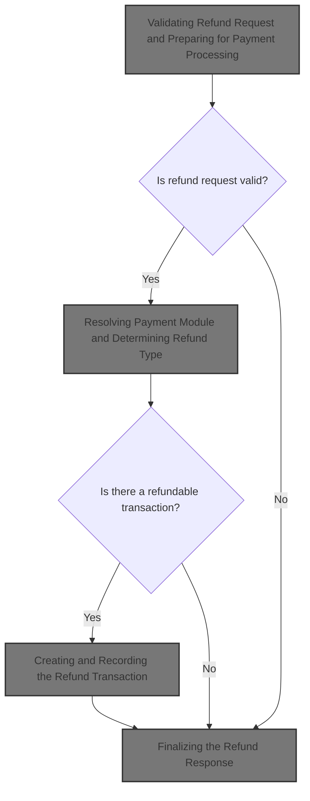
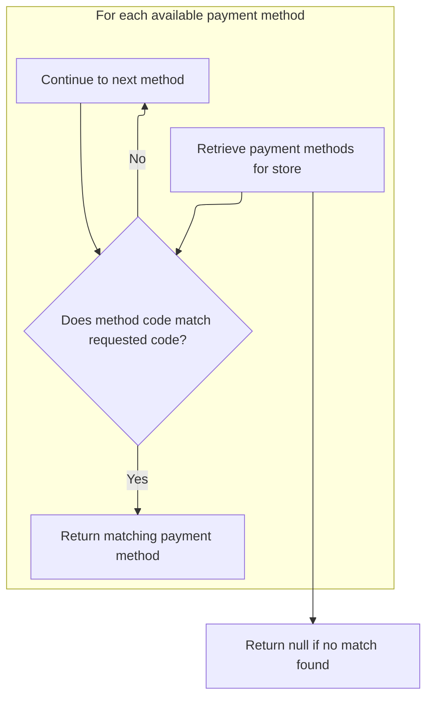
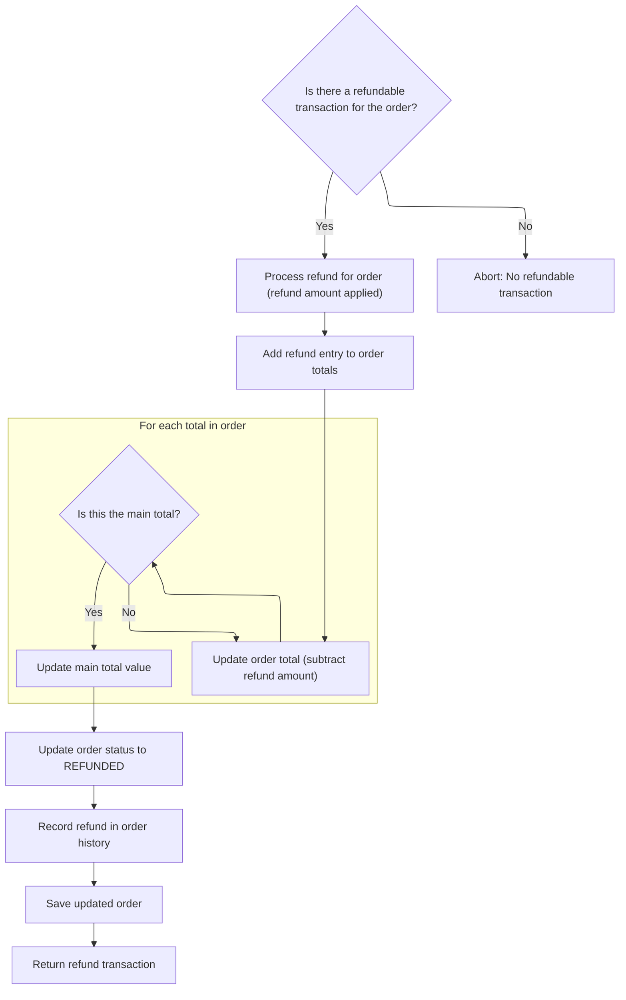
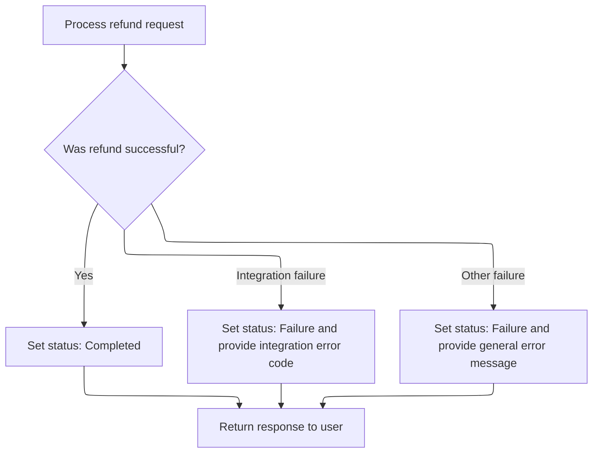

This document describes how a refund request for an order is processed. The flow validates the refund details, determines the correct payment integration, creates and records the refund transaction, updates the order, and communicates the result to the user. The input is a refund request with order and refund details, and the output is a response indicating the outcome and updated order information.



# Validating Refund Request and Preparing for Payment Processing

<SwmSnippet path="/shopizer/sm-shop/src/main/java/com/salesmanager/web/admin/controller/orders/OrderActionsControler.java" line="143">

---

In <SwmToken path="shopizer/sm-shop/src/main/java/com/salesmanager/web/admin/controller/orders/OrderActionsControler.java" pos="143:8:8" line-data="	public @ResponseBody String refundOrder(@RequestBody Refund refund, HttpServletRequest request, HttpServletResponse response, Locale locale) {">`refundOrder`</SwmToken>, we start by validating the order, merchant, refund amount, and customer. Only after all checks pass do we call <SwmToken path="shopizer/sm-shop/src/main/java/com/salesmanager/web/admin/controller/orders/OrderActionsControler.java" pos="209:1:3" line-data="				paymentService.processRefund(order, customer, store, submitedAmount);">`paymentService.processRefund`</SwmToken> to actually handle the refund logic, since that's where payment integration and transaction updates happen.

```java
	public @ResponseBody String refundOrder(@RequestBody Refund refund, HttpServletRequest request, HttpServletResponse response, Locale locale) {


		MerchantStore store = (MerchantStore)request.getAttribute(Constants.ADMIN_STORE);
		
		
		AjaxResponse resp = new AjaxResponse();

		BigDecimal submitedAmount = null;
		
		try {
			
			Order order = orderService.getById(refund.getOrderId());
			
			if(order==null) {
				
				LOGGER.error("Order {0} does not exists", refund.getOrderId());
				resp.setStatus(AjaxResponse.RESPONSE_STATUS_FAIURE);
				return resp.toJSONString();
			}
			
			if(order.getMerchant().getId().intValue()!=store.getId().intValue()) {
				
				LOGGER.error("Merchant store does not have order {0}",refund.getOrderId());
				resp.setStatus(AjaxResponse.RESPONSE_STATUS_FAIURE);
				return resp.toJSONString();
			}
		
			//parse amount
			try {
				submitedAmount = new BigDecimal(refund.getAmount());
				if(submitedAmount.doubleValue()==0) {
					resp.setStatus(AjaxResponse.RESPONSE_STATUS_FAIURE);
					resp.setStatusMessage(messages.getMessage("message.invalid.amount", locale));
					return resp.toJSONString();
				}
				
			} catch (Exception e) {
				LOGGER.equals("invalid refundAmount " + refund.getAmount());
				resp.setStatus(AjaxResponse.RESPONSE_STATUS_FAIURE);
				return resp.toJSONString();
			}
				
				
				BigDecimal orderTotal = order.getTotal();
				if(submitedAmount.doubleValue()>orderTotal.doubleValue()) {
					resp.setStatus(AjaxResponse.RESPONSE_STATUS_FAIURE);
					resp.setStatusMessage(messages.getMessage("message.invalid.amount", locale));
					return resp.toJSONString();
				}
				
				if(submitedAmount.doubleValue()<=0) {
					resp.setStatus(AjaxResponse.RESPONSE_STATUS_FAIURE);
					resp.setStatusMessage(messages.getMessage("message.invalid.amount", locale));
					return resp.toJSONString();
				}
				
				Customer customer = customerService.getById(order.getCustomerId());
				
				if(customer==null) {
					resp.setStatus(AjaxResponse.RESPONSE_STATUS_FAIURE);
					resp.setStatusMessage(messages.getMessage("message.notexist.customer", locale));
					return resp.toJSONString();
				}
				
	
				paymentService.processRefund(order, customer, store, submitedAmount);

```

---

</SwmSnippet>

## Resolving Payment Module and Determining Refund Type

<SwmSnippet path="/shopizer/sm-core/src/main/java/com/salesmanager/core/business/payments/service/PaymentServiceImpl.java" line="462">

---

In <SwmToken path="shopizer/sm-core/src/main/java/com/salesmanager/core/business/payments/service/PaymentServiceImpl.java" pos="462:5:5" line-data="	public Transaction processRefund(Order order, Customer customer,">`processRefund`</SwmToken>, we validate all inputs, fetch the payment module code from the order, get its configuration from the store, and retrieve the payment module instance. We also check if the refund is partial by comparing the amount to the order total. This sets up everything needed for the actual refund operation.

```java
	public Transaction processRefund(Order order, Customer customer,
			MerchantStore store, BigDecimal amount)
			throws ServiceException {
		
		
		Validate.notNull(customer);
		Validate.notNull(store);
		Validate.notNull(amount);
		Validate.notNull(order);
		Validate.notNull(order.getOrderTotal());
		
		
		BigDecimal orderTotal = order.getTotal();
		
		if(amount.doubleValue()>orderTotal.doubleValue()) {
			throw new ServiceException("Invalid amount, the refunded amount is greater than the total allowed");
		}

		
		String module = order.getPaymentModuleCode();
		Map<String, IntegrationConfiguration> modules = this.getPaymentModulesConfigured(store);
		if(modules==null){
			throw new ServiceException("No payment module configured");
		}
		
		IntegrationConfiguration configuration = modules.get(module);
		
		if(configuration==null) {
			throw new ServiceException("Payment module " + module + " is not configured");
		}
		
		PaymentModule paymentModule = this.paymentModules.get(module);
		
		if(paymentModule==null) {
			throw new ServiceException("Payment module " + paymentModule + " does not exist");
		}
		
		boolean partial = false;
		if(amount.doubleValue()!=order.getTotal().doubleValue()) {
			partial = true;
		}
		
		IntegrationModule integrationModule = getPaymentMethodByCode(store,module);
		
```

---

</SwmSnippet>

### Locating the Payment Integration Module



<SwmSnippet path="/shopizer/sm-core/src/main/java/com/salesmanager/core/business/payments/service/PaymentServiceImpl.java" line="147">

---

<SwmToken path="shopizer/sm-core/src/main/java/com/salesmanager/core/business/payments/service/PaymentServiceImpl.java" pos="147:5:5" line-data="	public IntegrationModule getPaymentMethodByCode(MerchantStore store,">`getPaymentMethodByCode`</SwmToken> looks up the integration module for the payment method code from the store's available modules. This is needed so we can use the right integration logic for the refund.

```java
	public IntegrationModule getPaymentMethodByCode(MerchantStore store,
			String code) throws ServiceException {
		List<IntegrationModule> modules =  getPaymentMethods(store);

		for(IntegrationModule module : modules) {
			if(module.getCode().equals(code)) {
				
				return module;
			}
		}
		
		return null;
	}
```

---

</SwmSnippet>

### Fetching Available Payment Methods for the Store

See <SwmLink doc-title="Selecting Payment Methods by Store Region">[Selecting Payment Methods by Store Region](.swm%5Cselecting-payment-methods-by-store-region.4bwspwbc.sw.md)</SwmLink>

### Creating and Recording the Refund Transaction



<SwmSnippet path="/shopizer/sm-core/src/main/java/com/salesmanager/core/business/payments/service/PaymentServiceImpl.java" line="506">

---

Back in <SwmToken path="shopizer/sm-shop/src/main/java/com/salesmanager/web/admin/controller/orders/OrderActionsControler.java" pos="209:3:3" line-data="				paymentService.processRefund(order, customer, store, submitedAmount);">`processRefund`</SwmToken>, after getting the integration module, we fetch the refundable transaction for the order, create the refund transaction using the payment module, and save it. We also update the order's totals and add a refund entry so the order reflects the refund.

```java
		//get the associated transaction
		Transaction refundable = transactionService.getRefundableTransaction(order);
		
		if(refundable==null) {
			throw new ServiceException("No refundable transaction for this order");
		}
		
		Transaction transaction = paymentModule.refund(partial, store, refundable, order, amount, configuration, integrationModule);
		transaction.setOrder(order);
		transactionService.create(transaction);
		
        OrderTotal refund = new OrderTotal();
        refund.setModule(Constants.OT_REFUND_MODULE_CODE);
        refund.setText(Constants.OT_REFUND_MODULE_CODE);
        refund.setTitle(Constants.OT_REFUND_MODULE_CODE);
        refund.setOrderTotalCode(Constants.OT_REFUND_MODULE_CODE);
        refund.setOrderTotalType(OrderTotalType.REFUND);
        refund.setValue(amount);
        refund.setSortOrder(100);
        refund.setOrder(order);
        
        order.getOrderTotal().add(refund);
        
		//update order total
		orderTotal = orderTotal.subtract(amount);
        
        //update ordertotal refund
        Set<OrderTotal> totals = order.getOrderTotal();
        for(OrderTotal total : totals) {
        	if(total.getModule().equals(Constants.OT_TOTAL_MODULE_CODE)) {
        		total.setValue(orderTotal);
        	}
        }
```

---

</SwmSnippet>

<SwmSnippet path="/shopizer/sm-core/src/main/java/com/salesmanager/core/business/payments/service/PaymentServiceImpl.java" line="542">

---

We mark the order as refunded, log the event in order history, and save everything.

```java
		order.setTotal(orderTotal);
		order.setStatus(OrderStatus.REFUNDED);
		
		
		
		OrderStatusHistory orderHistory = new OrderStatusHistory();
		orderHistory.setOrder(order);
		orderHistory.setStatus(OrderStatus.REFUNDED);
		orderHistory.setDateAdded(new Date());
        order.getOrderHistory().add(orderHistory);
        
        orderService.saveOrUpdate(order);

		return transaction;
	}
```

---

</SwmSnippet>

## Finalizing the Refund Response



<SwmSnippet path="/shopizer/sm-shop/src/main/java/com/salesmanager/web/admin/controller/orders/OrderActionsControler.java" line="211">

---

After returning from <SwmToken path="shopizer/sm-shop/src/main/java/com/salesmanager/web/admin/controller/orders/OrderActionsControler.java" pos="209:3:3" line-data="				paymentService.processRefund(order, customer, store, submitedAmount);">`processRefund`</SwmToken> in <SwmToken path="shopizer/sm-core/src/main/java/com/salesmanager/core/business/payments/service/PaymentServiceImpl.java" pos="49:4:4" line-data="public class PaymentServiceImpl implements PaymentService {">`PaymentServiceImpl`</SwmToken>, <SwmToken path="shopizer/sm-shop/src/main/java/com/salesmanager/web/admin/controller/orders/OrderActionsControler.java" pos="143:8:8" line-data="	public @ResponseBody String refundOrder(@RequestBody Refund refund, HttpServletRequest request, HttpServletResponse response, Locale locale) {">`refundOrder`</SwmToken> sets the response status based on the outcome and serializes it for the client. Errors are caught and reported in the response.

```java
				resp.setStatus(AjaxResponse.RESPONSE_OPERATION_COMPLETED);
		} catch (IntegrationException e) {
			LOGGER.error("Error while processing refund", e);
			resp.setStatus(AjaxResponse.RESPONSE_STATUS_FAIURE);
			resp.setErrorString(e.getMessageCode());
		} catch (Exception e) {
			LOGGER.error("Error while processing refund", e);
			resp.setStatus(AjaxResponse.RESPONSE_STATUS_FAIURE);
			resp.setErrorMessage(e);
		}
		
		String returnString = resp.toJSONString();
		
		return returnString;
	}
```

---

</SwmSnippet>

&nbsp;

*This is an auto-generated document by Swimm 🌊 and has not yet been verified by a human*

<SwmMeta version="3.0.0" repo-id="Z2l0aHViJTNBJTNBU2hvcGl6ZXIlM0ElM0F1bWFsaW5nYXN3YW1p" repo-name="Shopizer"><sup>Powered by [Swimm](https://app.swimm.io/)</sup></SwmMeta>
