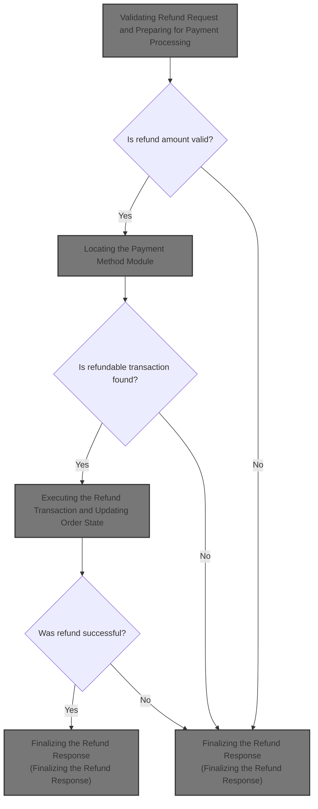
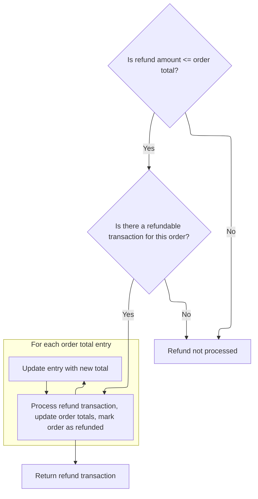
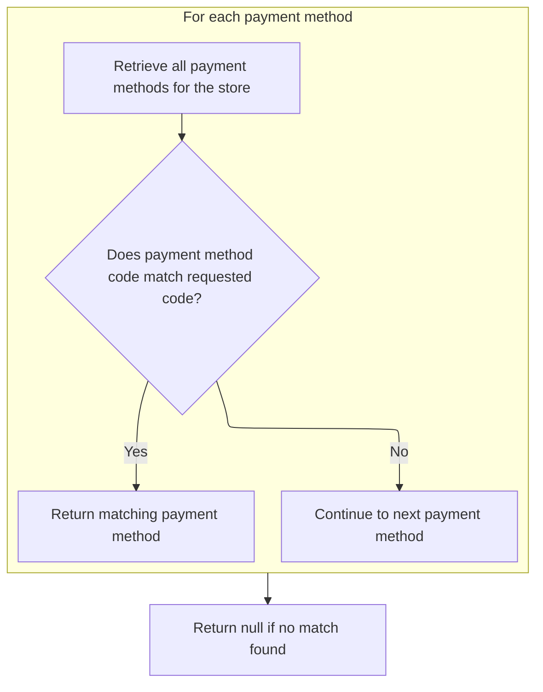
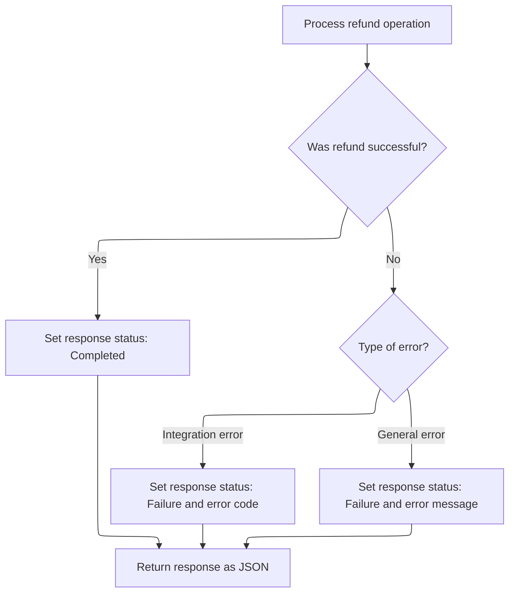

This document describes how merchants can initiate a refund for an order. The system validates the request, selects the appropriate payment provider, processes the refund, updates the order's records, and communicates the result.



# Validating Refund Request and Preparing for Payment Processing

<SwmSnippet path="/shopizer/sm-shop/src/main/java/com/salesmanager/web/admin/controller/orders/OrderActionsControler.java" line="143">

---

In <SwmToken path="shopizer/sm-shop/src/main/java/com/salesmanager/web/admin/controller/orders/OrderActionsControler.java" pos="143:8:8" line-data="	public @ResponseBody String refundOrder(@RequestBody Refund refund, HttpServletRequest request, HttpServletResponse response, Locale locale) {">`refundOrder`</SwmToken>, we validate the refund request and bail out early if anything's off. Once everything checks out, we hand off to <SwmToken path="shopizer/sm-core/src/main/java/com/salesmanager/core/business/payments/service/PaymentServiceImpl.java" pos="49:4:4" line-data="public class PaymentServiceImpl implements PaymentService {">`PaymentServiceImpl`</SwmToken> to actually process the refund.

```java
	public @ResponseBody String refundOrder(@RequestBody Refund refund, HttpServletRequest request, HttpServletResponse response, Locale locale) {


		MerchantStore store = (MerchantStore)request.getAttribute(Constants.ADMIN_STORE);
		
		
		AjaxResponse resp = new AjaxResponse();

		BigDecimal submitedAmount = null;
		
		try {
			
			Order order = orderService.getById(refund.getOrderId());
			
			if(order==null) {
				
				LOGGER.error("Order {0} does not exists", refund.getOrderId());
				resp.setStatus(AjaxResponse.RESPONSE_STATUS_FAIURE);
				return resp.toJSONString();
			}
			
			if(order.getMerchant().getId().intValue()!=store.getId().intValue()) {
				
				LOGGER.error("Merchant store does not have order {0}",refund.getOrderId());
				resp.setStatus(AjaxResponse.RESPONSE_STATUS_FAIURE);
				return resp.toJSONString();
			}
		
			//parse amount
			try {
				submitedAmount = new BigDecimal(refund.getAmount());
				if(submitedAmount.doubleValue()==0) {
					resp.setStatus(AjaxResponse.RESPONSE_STATUS_FAIURE);
					resp.setStatusMessage(messages.getMessage("message.invalid.amount", locale));
					return resp.toJSONString();
				}
				
			} catch (Exception e) {
				LOGGER.equals("invalid refundAmount " + refund.getAmount());
				resp.setStatus(AjaxResponse.RESPONSE_STATUS_FAIURE);
				return resp.toJSONString();
			}
				
				
				BigDecimal orderTotal = order.getTotal();
				if(submitedAmount.doubleValue()>orderTotal.doubleValue()) {
					resp.setStatus(AjaxResponse.RESPONSE_STATUS_FAIURE);
					resp.setStatusMessage(messages.getMessage("message.invalid.amount", locale));
					return resp.toJSONString();
				}
				
				if(submitedAmount.doubleValue()<=0) {
					resp.setStatus(AjaxResponse.RESPONSE_STATUS_FAIURE);
					resp.setStatusMessage(messages.getMessage("message.invalid.amount", locale));
					return resp.toJSONString();
				}
				
				Customer customer = customerService.getById(order.getCustomerId());
				
				if(customer==null) {
					resp.setStatus(AjaxResponse.RESPONSE_STATUS_FAIURE);
					resp.setStatusMessage(messages.getMessage("message.notexist.customer", locale));
					return resp.toJSONString();
				}
				
	
				paymentService.processRefund(order, customer, store, submitedAmount);

```

---

</SwmSnippet>

## Executing the Refund Transaction and Updating Order State



<SwmSnippet path="/shopizer/sm-core/src/main/java/com/salesmanager/core/business/payments/service/PaymentServiceImpl.java" line="462">

---

In <SwmToken path="shopizer/sm-core/src/main/java/com/salesmanager/core/business/payments/service/PaymentServiceImpl.java" pos="462:5:5" line-data="	public Transaction processRefund(Order order, Customer customer,">`processRefund`</SwmToken>, we validate all the inputs, check that the refund amount doesn't exceed the order total, and make sure the payment module is configured for the store and order. We also figure out if this is a partial refund. After these checks, we need to fetch the payment method details using <SwmToken path="shopizer/sm-core/src/main/java/com/salesmanager/core/business/payments/service/PaymentServiceImpl.java" pos="504:7:7" line-data="		IntegrationModule integrationModule = getPaymentMethodByCode(store,module);">`getPaymentMethodByCode`</SwmToken> to proceed with the actual refund logic.

```java
	public Transaction processRefund(Order order, Customer customer,
			MerchantStore store, BigDecimal amount)
			throws ServiceException {
		
		
		Validate.notNull(customer);
		Validate.notNull(store);
		Validate.notNull(amount);
		Validate.notNull(order);
		Validate.notNull(order.getOrderTotal());
		
		
		BigDecimal orderTotal = order.getTotal();
		
		if(amount.doubleValue()>orderTotal.doubleValue()) {
			throw new ServiceException("Invalid amount, the refunded amount is greater than the total allowed");
		}

		
		String module = order.getPaymentModuleCode();
		Map<String, IntegrationConfiguration> modules = this.getPaymentModulesConfigured(store);
		if(modules==null){
			throw new ServiceException("No payment module configured");
		}
		
		IntegrationConfiguration configuration = modules.get(module);
		
		if(configuration==null) {
			throw new ServiceException("Payment module " + module + " is not configured");
		}
		
		PaymentModule paymentModule = this.paymentModules.get(module);
		
		if(paymentModule==null) {
			throw new ServiceException("Payment module " + paymentModule + " does not exist");
		}
		
		boolean partial = false;
		if(amount.doubleValue()!=order.getTotal().doubleValue()) {
			partial = true;
		}
		
		IntegrationModule integrationModule = getPaymentMethodByCode(store,module);
		
```

---

</SwmSnippet>

### Locating the Payment Method Module



<SwmSnippet path="/shopizer/sm-core/src/main/java/com/salesmanager/core/business/payments/service/PaymentServiceImpl.java" line="147">

---

<SwmToken path="shopizer/sm-core/src/main/java/com/salesmanager/core/business/payments/service/PaymentServiceImpl.java" pos="147:5:5" line-data="	public IntegrationModule getPaymentMethodByCode(MerchantStore store,">`getPaymentMethodByCode`</SwmToken> loops through the store's payment modules and returns the one matching the given code. This is needed so we know which payment provider to use for the refund.

```java
	public IntegrationModule getPaymentMethodByCode(MerchantStore store,
			String code) throws ServiceException {
		List<IntegrationModule> modules =  getPaymentMethods(store);

		for(IntegrationModule module : modules) {
			if(module.getCode().equals(code)) {
				
				return module;
			}
		}
		
		return null;
	}
```

---

</SwmSnippet>

### Fetching Available Payment Modules

See <SwmLink doc-title="Selecting payment methods for a merchant store">[Selecting payment methods for a merchant store](.swm%5Cselecting-payment-methods-for-a-merchant-store.973egbmb.sw.md)</SwmLink>

### Processing the Refund and Updating Order Totals

```mermaid
%%{init: {"flowchart": {"defaultRenderer": "elk"}} }%%
flowchart TD
    node1["Identify refundable transaction for order"] --> node2{"Is refundable transaction found?"}
    click node1 openCode "shopizer/sm-core/src/main/java/com/salesmanager/core/business/payments/service/PaymentServiceImpl.java:507:508"
    click node2 openCode "shopizer/sm-core/src/main/java/com/salesmanager/core/business/payments/service/PaymentServiceImpl.java:509:511"
    node2 -->|"Yes"| node3["Process refund for specified amount"]
    click node3 openCode "shopizer/sm-core/src/main/java/com/salesmanager/core/business/payments/service/PaymentServiceImpl.java:513:515"
    node2 -->|"No"| node4["Refund not possible"]
    click node4 openCode "shopizer/sm-core/src/main/java/com/salesmanager/core/business/payments/service/PaymentServiceImpl.java:509:511"
    node3 --> node5["Add refund record to order and update order total"]
    click node5 openCode "shopizer/sm-core/src/main/java/com/salesmanager/core/business/payments/service/PaymentServiceImpl.java:517:527"
    
    subgraph loop1["For each order total"]
        node5 --> node6["Update main total after refund"]
        click node6 openCode "shopizer/sm-core/src/main/java/com/salesmanager/core/business/payments/service/PaymentServiceImpl.java:533:538"
    end
    node6 --> node7["Set order status to REFUNDED"]
    click node7 openCode "shopizer/sm-core/src/main/java/com/salesmanager/core/business/payments/service/PaymentServiceImpl.java:542:543"
    node7 --> node8["Record refund in order history"]
    click node8 openCode "shopizer/sm-core/src/main/java/com/salesmanager/core/business/payments/service/PaymentServiceImpl.java:547:551"
    node8 --> node9["Save updated order"]
    click node9 openCode "shopizer/sm-core/src/main/java/com/salesmanager/core/business/payments/service/PaymentServiceImpl.java:553:553"
    node9 --> node10["Return refund transaction"]
    click node10 openCode "shopizer/sm-core/src/main/java/com/salesmanager/core/business/payments/service/PaymentServiceImpl.java:555:555"

classDef HeadingStyle fill:#777777,stroke:#333,stroke-width:2px;

%% Swimm:
%% %%{init: {"flowchart": {"defaultRenderer": "elk"}} }%%
%% flowchart TD
%%     node1["Identify refundable transaction for order"] --> node2{"Is refundable transaction found?"}
%%     click node1 openCode "<SwmPath>[shopizer/…/service/PaymentServiceImpl.java](shopizer/sm-core/src/main/java/com/salesmanager/core/business/payments/service/PaymentServiceImpl.java)</SwmPath>:507:508"
%%     click node2 openCode "<SwmPath>[shopizer/…/service/PaymentServiceImpl.java](shopizer/sm-core/src/main/java/com/salesmanager/core/business/payments/service/PaymentServiceImpl.java)</SwmPath>:509:511"
%%     node2 -->|"Yes"| node3["Process refund for specified amount"]
%%     click node3 openCode "<SwmPath>[shopizer/…/service/PaymentServiceImpl.java](shopizer/sm-core/src/main/java/com/salesmanager/core/business/payments/service/PaymentServiceImpl.java)</SwmPath>:513:515"
%%     node2 -->|"No"| node4["Refund not possible"]
%%     click node4 openCode "<SwmPath>[shopizer/…/service/PaymentServiceImpl.java](shopizer/sm-core/src/main/java/com/salesmanager/core/business/payments/service/PaymentServiceImpl.java)</SwmPath>:509:511"
%%     node3 --> node5["Add refund record to order and update order total"]
%%     click node5 openCode "<SwmPath>[shopizer/…/service/PaymentServiceImpl.java](shopizer/sm-core/src/main/java/com/salesmanager/core/business/payments/service/PaymentServiceImpl.java)</SwmPath>:517:527"
%%     
%%     subgraph loop1["For each order total"]
%%         node5 --> node6["Update main total after refund"]
%%         click node6 openCode "<SwmPath>[shopizer/…/service/PaymentServiceImpl.java](shopizer/sm-core/src/main/java/com/salesmanager/core/business/payments/service/PaymentServiceImpl.java)</SwmPath>:533:538"
%%     end
%%     node6 --> node7["Set order status to REFUNDED"]
%%     click node7 openCode "<SwmPath>[shopizer/…/service/PaymentServiceImpl.java](shopizer/sm-core/src/main/java/com/salesmanager/core/business/payments/service/PaymentServiceImpl.java)</SwmPath>:542:543"
%%     node7 --> node8["Record refund in order history"]
%%     click node8 openCode "<SwmPath>[shopizer/…/service/PaymentServiceImpl.java](shopizer/sm-core/src/main/java/com/salesmanager/core/business/payments/service/PaymentServiceImpl.java)</SwmPath>:547:551"
%%     node8 --> node9["Save updated order"]
%%     click node9 openCode "<SwmPath>[shopizer/…/service/PaymentServiceImpl.java](shopizer/sm-core/src/main/java/com/salesmanager/core/business/payments/service/PaymentServiceImpl.java)</SwmPath>:553:553"
%%     node9 --> node10["Return refund transaction"]
%%     click node10 openCode "<SwmPath>[shopizer/…/service/PaymentServiceImpl.java](shopizer/sm-core/src/main/java/com/salesmanager/core/business/payments/service/PaymentServiceImpl.java)</SwmPath>:555:555"
%% 
%% classDef HeadingStyle fill:#777777,stroke:#333,stroke-width:2px;
```



<SwmSnippet path="/shopizer/sm-core/src/main/java/com/salesmanager/core/business/payments/service/PaymentServiceImpl.java" line="506">

---

Back in <SwmToken path="shopizer/sm-shop/src/main/java/com/salesmanager/web/admin/controller/orders/OrderActionsControler.java" pos="209:3:3" line-data="				paymentService.processRefund(order, customer, store, submitedAmount);">`processRefund`</SwmToken>, after getting the payment method, we fetch the refundable transaction for the order. If it's missing, we bail out. Otherwise, we call the payment module's refund method, record the transaction, and add a refund entry to the order totals. We also update the order's total to reflect the refund.

```java
		//get the associated transaction
		Transaction refundable = transactionService.getRefundableTransaction(order);
		
		if(refundable==null) {
			throw new ServiceException("No refundable transaction for this order");
		}
		
		Transaction transaction = paymentModule.refund(partial, store, refundable, order, amount, configuration, integrationModule);
		transaction.setOrder(order);
		transactionService.create(transaction);
		
        OrderTotal refund = new OrderTotal();
        refund.setModule(Constants.OT_REFUND_MODULE_CODE);
        refund.setText(Constants.OT_REFUND_MODULE_CODE);
        refund.setTitle(Constants.OT_REFUND_MODULE_CODE);
        refund.setOrderTotalCode(Constants.OT_REFUND_MODULE_CODE);
        refund.setOrderTotalType(OrderTotalType.REFUND);
        refund.setValue(amount);
        refund.setSortOrder(100);
        refund.setOrder(order);
        
        order.getOrderTotal().add(refund);
        
		//update order total
		orderTotal = orderTotal.subtract(amount);
        
        //update ordertotal refund
        Set<OrderTotal> totals = order.getOrderTotal();
        for(OrderTotal total : totals) {
        	if(total.getModule().equals(Constants.OT_TOTAL_MODULE_CODE)) {
        		total.setValue(orderTotal);
        	}
        }
```

---

</SwmSnippet>

<SwmSnippet path="/shopizer/sm-core/src/main/java/com/salesmanager/core/business/payments/service/PaymentServiceImpl.java" line="542">

---

Finally in <SwmToken path="shopizer/sm-shop/src/main/java/com/salesmanager/web/admin/controller/orders/OrderActionsControler.java" pos="209:3:3" line-data="				paymentService.processRefund(order, customer, store, submitedAmount);">`processRefund`</SwmToken>, we set the order status to REFUNDED, add a history entry, save the order, and return the refund transaction. This wraps up the refund logic and hands control back to the caller.

```java
		order.setTotal(orderTotal);
		order.setStatus(OrderStatus.REFUNDED);
		
		
		
		OrderStatusHistory orderHistory = new OrderStatusHistory();
		orderHistory.setOrder(order);
		orderHistory.setStatus(OrderStatus.REFUNDED);
		orderHistory.setDateAdded(new Date());
        order.getOrderHistory().add(orderHistory);
        
        orderService.saveOrUpdate(order);

		return transaction;
	}
```

---

</SwmSnippet>

## Finalizing the Refund Response



<SwmSnippet path="/shopizer/sm-shop/src/main/java/com/salesmanager/web/admin/controller/orders/OrderActionsControler.java" line="211">

---

Back in <SwmToken path="shopizer/sm-shop/src/main/java/com/salesmanager/web/admin/controller/orders/OrderActionsControler.java" pos="143:8:8" line-data="	public @ResponseBody String refundOrder(@RequestBody Refund refund, HttpServletRequest request, HttpServletResponse response, Locale locale) {">`refundOrder`</SwmToken>, after returning from <SwmToken path="shopizer/sm-shop/src/main/java/com/salesmanager/web/admin/controller/orders/OrderActionsControler.java" pos="209:3:3" line-data="				paymentService.processRefund(order, customer, store, submitedAmount);">`processRefund`</SwmToken>, we set the response status based on whether the refund went through or an exception was thrown. The response is then serialized to JSON and sent back to the client.

```java
				resp.setStatus(AjaxResponse.RESPONSE_OPERATION_COMPLETED);
		} catch (IntegrationException e) {
			LOGGER.error("Error while processing refund", e);
			resp.setStatus(AjaxResponse.RESPONSE_STATUS_FAIURE);
			resp.setErrorString(e.getMessageCode());
		} catch (Exception e) {
			LOGGER.error("Error while processing refund", e);
			resp.setStatus(AjaxResponse.RESPONSE_STATUS_FAIURE);
			resp.setErrorMessage(e);
		}
		
		String returnString = resp.toJSONString();
		
		return returnString;
	}
```

---

</SwmSnippet>

&nbsp;

*This is an auto-generated document by Swimm 🌊 and has not yet been verified by a human*

<SwmMeta version="3.0.0" repo-id="Z2l0aHViJTNBJTNBU2hvcGl6ZXIlM0ElM0F1bWFsaW5nYXN3YW1p" repo-name="Shopizer"><sup>Powered by [Swimm](https://app.swimm.io/)</sup></SwmMeta>
