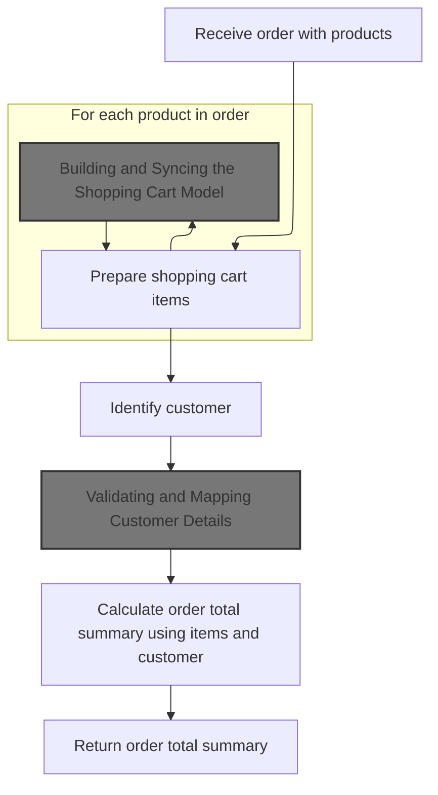

This document describes the process of calculating the total cost for an order. The flow receives an order with products and customer details, prepares the shopping cart, validates customer information, and calculates the final order total summary with all pricing rules, taxes, and discounts applied.

# Preparing Cart Items for Order Calculation



This section is responsible for preparing shopping cart items from the incoming order, building a normalized shopping cart model, and calculating the order total summary using both the cart items and customer details.

| Category        | Rule Name                       | Description                                                                                                                                                                                                                                                                                                                                                                                                           |
| --------------- | ------------------------------- | --------------------------------------------------------------------------------------------------------------------------------------------------------------------------------------------------------------------------------------------------------------------------------------------------------------------------------------------------------------------------------------------------------------------- |
| Data validation | Product Conversion Requirement  | Each product in the incoming order must be converted into a <SwmToken path="shopizer/sm-shop/src/main/java/com/salesmanager/web/shop/controller/order/facade/OrderFacadeImpl.java" pos="176:3:3" line-data="		List&lt;ShoppingCartItem&gt; items = new ArrayList&lt;ShoppingCartItem&gt;();">`ShoppingCartItem`</SwmToken> with all relevant product and attribute data populated before order calculation can proceed. |
| Data validation | Customer Validation and Mapping | Customer details must be validated and mapped to the domain model before they are used in order total calculation.                                                                                                                                                                                                                                                                                                    |
| Business logic  | Cart Model Normalization        | All shopping cart items must be normalized and synced into a complete shopping cart model before calculating the order total.                                                                                                                                                                                                                                                                                         |
| Business logic  | Order Total Calculation         | The order total summary must be calculated using both the prepared shopping cart items and the validated customer details, ensuring all applicable pricing rules, taxes, and discounts are applied.                                                                                                                                                                                                                   |

<SwmSnippet path="/shopizer/sm-shop/src/main/java/com/salesmanager/web/shop/controller/order/facade/OrderFacadeImpl.java" line="166">

---

In <SwmToken path="shopizer/sm-shop/src/main/java/com/salesmanager/web/shop/controller/order/facade/OrderFacadeImpl.java" pos="166:5:5" line-data="	public OrderTotalSummary calculateOrderTotal(MerchantStore store,">`calculateOrderTotal`</SwmToken>, we start by converting each <SwmToken path="shopizer/sm-shop/src/main/java/com/salesmanager/web/shop/controller/order/facade/OrderFacadeImpl.java" pos="169:3:3" line-data="		List&lt;PersistableOrderProduct&gt; orderProducts = order.getOrderProductItems();">`PersistableOrderProduct`</SwmToken> from the incoming order into <SwmToken path="shopizer/sm-shop/src/main/java/com/salesmanager/web/shop/controller/order/facade/OrderFacadeImpl.java" pos="176:3:3" line-data="		List&lt;ShoppingCartItem&gt; items = new ArrayList&lt;ShoppingCartItem&gt;();">`ShoppingCartItem`</SwmToken> objects using <SwmToken path="shopizer/sm-shop/src/main/java/com/salesmanager/web/shop/controller/order/facade/OrderFacadeImpl.java" pos="171:1:1" line-data="		ShoppingCartItemPopulator populator = new ShoppingCartItemPopulator();">`ShoppingCartItemPopulator`</SwmToken>. This sets up the cart items with all necessary product and attribute data. Next, we need to call <SwmToken path="shopizer/sm-shop/src/main/java/com/salesmanager/web/populator/shoppingCart/ShoppingCartModelPopulator.java" pos="37:4:4" line-data="public class ShoppingCartModelPopulator">`ShoppingCartModelPopulator`</SwmToken> to handle the actual shopping cart model, including persistence and further normalization, so the rest of the flow can work with a complete cart.

```java
	public OrderTotalSummary calculateOrderTotal(MerchantStore store,
			PersistableOrder order, Language language) throws Exception {
	
		List<PersistableOrderProduct> orderProducts = order.getOrderProductItems();
		
		ShoppingCartItemPopulator populator = new ShoppingCartItemPopulator();
		populator.setProductAttributeService(productAttributeService);
		populator.setProductService(productService);
		populator.setShoppingCartService(shoppingCartService);
		
		List<ShoppingCartItem> items = new ArrayList<ShoppingCartItem>();
		for(PersistableOrderProduct orderProduct : orderProducts) {
			ShoppingCartItem item = populator.populate(orderProduct, new ShoppingCartItem(), store, language);
			items.add(item);
		}
		

```

---

</SwmSnippet>

## Building and Syncing the Shopping Cart Model

```mermaid
%%{init: {"flowchart": {"defaultRenderer": "elk"}} }%%
flowchart TD
    node1["Start cart population"] --> node2{"Is cart already in database?"}
    click node1 openCode "shopizer/sm-shop/src/main/java/com/salesmanager/web/populator/shoppingCart/ShoppingCartModelPopulator.java:85:90"
    node2 -->|"Yes"| node3["Load cart from database"]
    click node2 openCode "shopizer/sm-shop/src/main/java/com/salesmanager/web/populator/shoppingCart/ShoppingCartModelPopulator.java:91:104"
    node2 -->|"No"| node4["Create new cart in database"]
    click node4 openCode "shopizer/sm-shop/src/main/java/com/salesmanager/web/populator/shoppingCart/ShoppingCartModelPopulator.java:105:114"
    node3 --> node5["Assign customer id if present"]
    click node3 openCode "shopizer/sm-shop/src/main/java/com/salesmanager/web/populator/shoppingCart/ShoppingCartModelPopulator.java:98:101"
    node4 --> node5
    node5 --> node6["Process cart items"]
    click node5 openCode "shopizer/sm-shop/src/main/java/com/salesmanager/web/populator/shoppingCart/ShoppingCartModelPopulator.java:116:120"
    subgraph loop1["For each item in cart data"]
        node6 --> node7{"Does item exist in cart model?"}
        click node7 openCode "shopizer/sm-shop/src/main/java/com/salesmanager/web/populator/shoppingCart/ShoppingCartModelPopulator.java:124:130"
        node7 -->|"Yes"| node8["Update item quantity"]
        click node8 openCode "shopizer/sm-shop/src/main/java/com/salesmanager/web/populator/shoppingCart/ShoppingCartModelPopulator.java:132:133"
        node8 --> node9{"Does item have attributes?"}
        click node9 openCode "shopizer/sm-shop/src/main/java/com/salesmanager/web/populator/shoppingCart/ShoppingCartModelPopulator.java:138:140"
        node9 -->|"Yes"| node10["Update item attributes"]
        click node10 openCode "shopizer/sm-shop/src/main/java/com/salesmanager/web/populator/shoppingCart/ShoppingCartModelPopulator.java:141:152"
        node9 -->|"No"| node11["Remove all item attributes"]
        click node11 openCode "shopizer/sm-shop/src/main/java/com/salesmanager/web/populator/shoppingCart/ShoppingCartModelPopulator.java:156:157"
        node10 --> node12["Next item"]
        node11 --> node12
        node7 -->|"No"| node13["Create new cart item"]
        click node13 openCode "shopizer/sm-shop/src/main/java/com/salesmanager/web/populator/shoppingCart/ShoppingCartModelPopulator.java:163:165"
        node13 --> node14["Add new item to cart model"]
        click node14 openCode "shopizer/sm-shop/src/main/java/com/salesmanager/web/populator/shoppingCart/ShoppingCartModelPopulator.java:166:173"
        node14 --> node15["Update cart in database"]
        click node15 openCode "shopizer/sm-shop/src/main/java/com/salesmanager/web/populator/shoppingCart/ShoppingCartModelPopulator.java:174:174"
        node15 --> node12
    end
    node12 --> node16["Return updated cart model"]
    click node16 openCode "shopizer/sm-shop/src/main/java/com/salesmanager/web/populator/shoppingCart/ShoppingCartModelPopulator.java:187:188"
classDef HeadingStyle fill:#777777,stroke:#333,stroke-width:2px;

%% Swimm:
%% %%{init: {"flowchart": {"defaultRenderer": "elk"}} }%%
%% flowchart TD
%%     node1["Start cart population"] --> node2{"Is cart already in database?"}
%%     click node1 openCode "<SwmPath>[shopizer/…/shoppingCart/ShoppingCartModelPopulator.java](shopizer/sm-shop/src/main/java/com/salesmanager/web/populator/shoppingCart/ShoppingCartModelPopulator.java)</SwmPath>:85:90"
%%     node2 -->|"Yes"| node3["Load cart from database"]
%%     click node2 openCode "<SwmPath>[shopizer/…/shoppingCart/ShoppingCartModelPopulator.java](shopizer/sm-shop/src/main/java/com/salesmanager/web/populator/shoppingCart/ShoppingCartModelPopulator.java)</SwmPath>:91:104"
%%     node2 -->|"No"| node4["Create new cart in database"]
%%     click node4 openCode "<SwmPath>[shopizer/…/shoppingCart/ShoppingCartModelPopulator.java](shopizer/sm-shop/src/main/java/com/salesmanager/web/populator/shoppingCart/ShoppingCartModelPopulator.java)</SwmPath>:105:114"
%%     node3 --> node5["Assign customer id if present"]
%%     click node3 openCode "<SwmPath>[shopizer/…/shoppingCart/ShoppingCartModelPopulator.java](shopizer/sm-shop/src/main/java/com/salesmanager/web/populator/shoppingCart/ShoppingCartModelPopulator.java)</SwmPath>:98:101"
%%     node4 --> node5
%%     node5 --> node6["Process cart items"]
%%     click node5 openCode "<SwmPath>[shopizer/…/shoppingCart/ShoppingCartModelPopulator.java](shopizer/sm-shop/src/main/java/com/salesmanager/web/populator/shoppingCart/ShoppingCartModelPopulator.java)</SwmPath>:116:120"
%%     subgraph loop1["For each item in cart data"]
%%         node6 --> node7{"Does item exist in cart model?"}
%%         click node7 openCode "<SwmPath>[shopizer/…/shoppingCart/ShoppingCartModelPopulator.java](shopizer/sm-shop/src/main/java/com/salesmanager/web/populator/shoppingCart/ShoppingCartModelPopulator.java)</SwmPath>:124:130"
%%         node7 -->|"Yes"| node8["Update item quantity"]
%%         click node8 openCode "<SwmPath>[shopizer/…/shoppingCart/ShoppingCartModelPopulator.java](shopizer/sm-shop/src/main/java/com/salesmanager/web/populator/shoppingCart/ShoppingCartModelPopulator.java)</SwmPath>:132:133"
%%         node8 --> node9{"Does item have attributes?"}
%%         click node9 openCode "<SwmPath>[shopizer/…/shoppingCart/ShoppingCartModelPopulator.java](shopizer/sm-shop/src/main/java/com/salesmanager/web/populator/shoppingCart/ShoppingCartModelPopulator.java)</SwmPath>:138:140"
%%         node9 -->|"Yes"| node10["Update item attributes"]
%%         click node10 openCode "<SwmPath>[shopizer/…/shoppingCart/ShoppingCartModelPopulator.java](shopizer/sm-shop/src/main/java/com/salesmanager/web/populator/shoppingCart/ShoppingCartModelPopulator.java)</SwmPath>:141:152"
%%         node9 -->|"No"| node11["Remove all item attributes"]
%%         click node11 openCode "<SwmPath>[shopizer/…/shoppingCart/ShoppingCartModelPopulator.java](shopizer/sm-shop/src/main/java/com/salesmanager/web/populator/shoppingCart/ShoppingCartModelPopulator.java)</SwmPath>:156:157"
%%         node10 --> node12["Next item"]
%%         node11 --> node12
%%         node7 -->|"No"| node13["Create new cart item"]
%%         click node13 openCode "<SwmPath>[shopizer/…/shoppingCart/ShoppingCartModelPopulator.java](shopizer/sm-shop/src/main/java/com/salesmanager/web/populator/shoppingCart/ShoppingCartModelPopulator.java)</SwmPath>:163:165"
%%         node13 --> node14["Add new item to cart model"]
%%         click node14 openCode "<SwmPath>[shopizer/…/shoppingCart/ShoppingCartModelPopulator.java](shopizer/sm-shop/src/main/java/com/salesmanager/web/populator/shoppingCart/ShoppingCartModelPopulator.java)</SwmPath>:166:173"
%%         node14 --> node15["Update cart in database"]
%%         click node15 openCode "<SwmPath>[shopizer/…/shoppingCart/ShoppingCartModelPopulator.java](shopizer/sm-shop/src/main/java/com/salesmanager/web/populator/shoppingCart/ShoppingCartModelPopulator.java)</SwmPath>:174:174"
%%         node15 --> node12
%%     end
%%     node12 --> node16["Return updated cart model"]
%%     click node16 openCode "<SwmPath>[shopizer/…/shoppingCart/ShoppingCartModelPopulator.java](shopizer/sm-shop/src/main/java/com/salesmanager/web/populator/shoppingCart/ShoppingCartModelPopulator.java)</SwmPath>:187:188"
%% classDef HeadingStyle fill:#777777,stroke:#333,stroke-width:2px;
```



This section is responsible for building and syncing the <SwmToken path="shopizer/sm-shop/src/main/java/com/salesmanager/web/populator/shoppingCart/ShoppingCartModelPopulator.java" pos="85:3:3" line-data="    public ShoppingCart populate(ShoppingCartData shoppingCart,ShoppingCart cartMdel,final MerchantStore store, Language language)">`ShoppingCart`</SwmToken> model with incoming cart data. It ensures the cart is up to date by fetching or creating the cart, updating items and attributes, validating products and attributes, and persisting changes.

| Category        | Rule Name                 | Description                                                                                                                                                                                   |
| --------------- | ------------------------- | --------------------------------------------------------------------------------------------------------------------------------------------------------------------------------------------- |
| Data validation | Product validation        | When creating a new cart item, the product must exist and belong to the current merchant store. If not, an error must be raised and the item must not be added.                               |
| Data validation | Attribute validation      | When adding attributes to a cart item, each attribute must be validated to ensure it exists and belongs to the product being added. Only valid attributes are linked to the cart item.        |
| Business logic  | Cart existence check      | If the incoming cart data contains a valid cart ID and code, the cart must be loaded from the database. If not found, a new cart is created with the provided code and store information.     |
| Business logic  | Customer association      | If a customer is present, the cart must be associated with the customer's ID to enable personalized cart management.                                                                          |
| Business logic  | Item quantity sync        | For each item in the incoming cart data, if the item already exists in the cart model, its quantity must be updated to match the incoming data.                                               |
| Business logic  | Attribute synchronization | If an existing cart item has attributes in the incoming data, only those attributes must be retained and updated; if no attributes are present, all attributes must be removed from the item. |
| Business logic  | New item addition         | If an item in the incoming cart data does not exist in the cart model, a new cart item must be created and added to the cart.                                                                 |
| Business logic  | Cart persistence          | After all items and attributes are processed, the cart model must be updated in the database to persist all changes.                                                                          |

<SwmSnippet path="/shopizer/sm-shop/src/main/java/com/salesmanager/web/populator/shoppingCart/ShoppingCartModelPopulator.java" line="85">

---

In <SwmToken path="shopizer/sm-shop/src/main/java/com/salesmanager/web/populator/shoppingCart/ShoppingCartModelPopulator.java" pos="85:5:5" line-data="    public ShoppingCart populate(ShoppingCartData shoppingCart,ShoppingCart cartMdel,final MerchantStore store, Language language)">`populate`</SwmToken>, we fetch or create the <SwmToken path="shopizer/sm-shop/src/main/java/com/salesmanager/web/populator/shoppingCart/ShoppingCartModelPopulator.java" pos="85:3:3" line-data="    public ShoppingCart populate(ShoppingCartData shoppingCart,ShoppingCart cartMdel,final MerchantStore store, Language language)">`ShoppingCart`</SwmToken> from the database using the cart code and ID, then sync its items and attributes with the incoming data. This means we handle both mapping and persistence here, so the cart model is always up to date. Next, we need to handle new items that aren't already in the cart, which is why we call <SwmToken path="shopizer/sm-shop/src/main/java/com/salesmanager/web/populator/shoppingCart/ShoppingCartModelPopulator.java" pos="165:1:1" line-data="                        createCartItem( cartMdel, item, store );">`createCartItem`</SwmToken>.

```java
    public ShoppingCart populate(ShoppingCartData shoppingCart,ShoppingCart cartMdel,final MerchantStore store, Language language)
    {


        // if id >0 get the original from the database, override products
       try{
        if ( shoppingCart.getId() > 0  && StringUtils.isNotBlank( shoppingCart.getCode()))
        {
            cartMdel = shoppingCartService.getByCode( shoppingCart.getCode(), store );
            if(cartMdel==null){
                cartMdel=new ShoppingCart();
                cartMdel.setShoppingCartCode( shoppingCart.getCode() );
                cartMdel.setMerchantStore( store );
                if ( customer != null )
                {
                    cartMdel.setCustomerId( customer.getId() );
                }
                shoppingCartService.create( cartMdel );
            }
        }
        else
        {
            cartMdel.setShoppingCartCode( shoppingCart.getCode() );
            cartMdel.setMerchantStore( store );
            if ( customer != null )
            {
                cartMdel.setCustomerId( customer.getId() );
            }
            shoppingCartService.create( cartMdel );
        }

        List<ShoppingCartItem> items = shoppingCart.getShoppingCartItems();
        Set<com.salesmanager.core.business.shoppingcart.model.ShoppingCartItem> newItems =
            new HashSet<com.salesmanager.core.business.shoppingcart.model.ShoppingCartItem>();
        if ( items != null && items.size() > 0 )
        {
            for ( ShoppingCartItem item : items )
            {

                Set<com.salesmanager.core.business.shoppingcart.model.ShoppingCartItem> cartItems = cartMdel.getLineItems();
                if ( cartItems != null && cartItems.size() > 0 )
                {

                    for ( com.salesmanager.core.business.shoppingcart.model.ShoppingCartItem dbItem : cartItems )
                    {
                        if ( dbItem.getId().longValue() == item.getId() )
                        {
                            dbItem.setQuantity( item.getQuantity() );
                            // compare attributes
                            Set<com.salesmanager.core.business.shoppingcart.model.ShoppingCartAttributeItem> attributes =
                                dbItem.getAttributes();
                            Set<com.salesmanager.core.business.shoppingcart.model.ShoppingCartAttributeItem> newAttributes =
                                new HashSet<com.salesmanager.core.business.shoppingcart.model.ShoppingCartAttributeItem>();
                            List<ShoppingCartAttribute> cartAttributes = item.getShoppingCartAttributes();
                            if ( !CollectionUtils.isEmpty( cartAttributes ) )
                            {
                                for ( ShoppingCartAttribute attribute : cartAttributes )
                                {
                                    for ( com.salesmanager.core.business.shoppingcart.model.ShoppingCartAttributeItem dbAttribute : attributes )
                                    {
                                        if ( dbAttribute.getId().longValue() == attribute.getId() )
                                        {
                                            newAttributes.add( dbAttribute );
                                        }
                                    }
                                }
                                
                                dbItem.setAttributes( newAttributes );
                            }
                            else
                            {
                                dbItem.removeAllAttributes();
                            }
                            newItems.add( dbItem );
                        }
                    }
```

---

</SwmSnippet>

<SwmSnippet path="/shopizer/sm-shop/src/main/java/com/salesmanager/web/populator/shoppingCart/ShoppingCartModelPopulator.java" line="163">

---

Here we handle new items that aren't already in the cart by calling <SwmToken path="shopizer/sm-shop/src/main/java/com/salesmanager/web/populator/shoppingCart/ShoppingCartModelPopulator.java" pos="165:1:1" line-data="                        createCartItem( cartMdel, item, store );">`createCartItem`</SwmToken>. This step validates and builds each new <SwmToken path="shopizer/sm-shop/src/main/java/com/salesmanager/web/populator/shoppingCart/ShoppingCartModelPopulator.java" pos="164:13:13" line-data="                    com.salesmanager.core.business.shoppingcart.model.ShoppingCartItem cartItem =">`ShoppingCartItem`</SwmToken> before adding it to the cart, making sure all items are properly set up.

```java
                {// create new item
                    com.salesmanager.core.business.shoppingcart.model.ShoppingCartItem cartItem =
                        createCartItem( cartMdel, item, store );
```

---

</SwmSnippet>

<SwmSnippet path="/shopizer/sm-shop/src/main/java/com/salesmanager/web/populator/shoppingCart/ShoppingCartModelPopulator.java" line="191">

---

<SwmToken path="shopizer/sm-shop/src/main/java/com/salesmanager/web/populator/shoppingCart/ShoppingCartModelPopulator.java" pos="191:17:17" line-data="    private com.salesmanager.core.business.shoppingcart.model.ShoppingCartItem createCartItem( com.salesmanager.core.business.shoppingcart.model.ShoppingCart cart,">`createCartItem`</SwmToken> validates the product and store ownership, then builds a <SwmToken path="shopizer/sm-shop/src/main/java/com/salesmanager/web/populator/shoppingCart/ShoppingCartModelPopulator.java" pos="191:15:15" line-data="    private com.salesmanager.core.business.shoppingcart.model.ShoppingCartItem createCartItem( com.salesmanager.core.business.shoppingcart.model.ShoppingCart cart,">`ShoppingCartItem`</SwmToken> with quantity, price, and attributes. Attributes are checked for validity and linked to the item, so only valid data gets added to the cart.

```java
    private com.salesmanager.core.business.shoppingcart.model.ShoppingCartItem createCartItem( com.salesmanager.core.business.shoppingcart.model.ShoppingCart cart,
                                                                                               ShoppingCartItem shoppingCartItem,
                                                                                               MerchantStore store )
        throws Exception
    {

        Product product = productService.getById( shoppingCartItem.getProductId() );

        if ( product == null )
        {
            throw new Exception( "Item with id " + shoppingCartItem.getProductId() + " does not exist" );
        }

        if ( product.getMerchantStore().getId().intValue() != store.getId().intValue() )
        {
            throw new Exception( "Item with id " + shoppingCartItem.getProductId() + " does not belong to merchant "
                + store.getId() );
        }

        com.salesmanager.core.business.shoppingcart.model.ShoppingCartItem item =
            new com.salesmanager.core.business.shoppingcart.model.ShoppingCartItem( cart, product );
        item.setQuantity( shoppingCartItem.getQuantity() );
        item.setItemPrice( shoppingCartItem.getProductPrice() );
        item.setShoppingCart( cart );

        // attributes
        List<ShoppingCartAttribute> cartAttributes = shoppingCartItem.getShoppingCartAttributes();
        if ( !CollectionUtils.isEmpty( cartAttributes ) )
        {
            Set<com.salesmanager.core.business.shoppingcart.model.ShoppingCartAttributeItem> newAttributes =
                new HashSet<com.salesmanager.core.business.shoppingcart.model.ShoppingCartAttributeItem>();
            for ( ShoppingCartAttribute attribute : cartAttributes )
            {
                ProductAttribute productAttribute = productAttributeService.getById( attribute.getAttributeId() );
                if ( productAttribute != null
                    && productAttribute.getProduct().getId().longValue() == product.getId().longValue() )
                {
                    com.salesmanager.core.business.shoppingcart.model.ShoppingCartAttributeItem attributeItem =
                        new com.salesmanager.core.business.shoppingcart.model.ShoppingCartAttributeItem( item,
                                                                                                         productAttribute );
                    if ( attribute.getAttributeId() > 0 )
                    {
                        attributeItem.setId( attribute.getId() );
                    }
                    item.addAttributes( attributeItem );
                    //newAttributes.add( attributeItem );
                }

            }
```

---

</SwmSnippet>

<SwmSnippet path="/shopizer/sm-shop/src/main/java/com/salesmanager/web/populator/shoppingCart/ShoppingCartModelPopulator.java" line="166">

---

We just returned from ShoppingCartModelPopulator.populate, so here we finalize the cart by adding any new items and updating the database. This keeps the cart model and database in sync, handling both updates and new additions in one go.

```java
                    Set<com.salesmanager.core.business.shoppingcart.model.ShoppingCartItem> lineItems =
                        cartMdel.getLineItems();
                    if ( lineItems == null )
                    {
                        lineItems = new HashSet<com.salesmanager.core.business.shoppingcart.model.ShoppingCartItem>();
                        cartMdel.setLineItems( lineItems );
                    }
                    lineItems.add( cartItem );
                    shoppingCartService.update( cartMdel );
                }
            }// end for
        }// end if
       }catch(ServiceException se){
           LOG.error( "Error while converting cart data to cart model.."+se );
           throw new ConversionException( "Unable to create cart model", se ); 
       }
       catch (Exception ex){
           LOG.error( "Error while converting cart data to cart model.."+ex );
           throw new ConversionException( "Unable to create cart model", ex );  
       }

        return cartMdel;
    }
```

---

</SwmSnippet>

## Resolving Customer Data for Order

<SwmSnippet path="/shopizer/sm-shop/src/main/java/com/salesmanager/web/shop/controller/order/facade/OrderFacadeImpl.java" line="183">

---

After returning from ShoppingCartModelPopulator.populate in OrderFacadeImpl.calculateOrderTotal, we resolve the customer data next. This step is needed to make sure all customer info is available for pricing, tax, and discount logic.

```java
		Customer customer = customer(order.getCustomer(), store, language);
		
```

---

</SwmSnippet>

## Populating Customer Domain Model

This section is responsible for transforming and validating incoming customer data into a domain model that can be used throughout the Shopizer platform. It ensures that all required customer information is present, correctly formatted, and mapped to the internal Customer object.

| Category        | Rule Name                      | Description                                                                                                                                                                                                                                                                                                                                                 |
| --------------- | ------------------------------ | ----------------------------------------------------------------------------------------------------------------------------------------------------------------------------------------------------------------------------------------------------------------------------------------------------------------------------------------------------------- |
| Data validation | Mandatory customer fields      | All mandatory customer fields (such as first name, last name, and email) must be present in the incoming data before the domain Customer object can be created.                                                                                                                                                                                             |
| Data validation | Valid email format             | The email address provided for the customer must be in a valid email format.                                                                                                                                                                                                                                                                                |
| Data validation | Address completeness           | If the incoming customer data includes an address, all required address fields (street, city, postal code, country) must be present and valid.                                                                                                                                                                                                              |
| Business logic  | Store and language association | The Customer domain object must be associated with the correct <SwmToken path="shopizer/sm-shop/src/main/java/com/salesmanager/web/shop/controller/order/facade/OrderFacadeImpl.java" pos="166:7:7" line-data="	public OrderTotalSummary calculateOrderTotal(MerchantStore store,">`MerchantStore`</SwmToken> and Language context as provided in the input. |

<SwmSnippet path="/shopizer/sm-shop/src/main/java/com/salesmanager/web/shop/controller/order/facade/OrderFacadeImpl.java" line="224">

---

<SwmToken path="shopizer/sm-shop/src/main/java/com/salesmanager/web/shop/controller/order/facade/OrderFacadeImpl.java" pos="224:5:5" line-data="	private Customer customer(PersistableCustomer customer, MerchantStore store, Language language) throws Exception {">`customer`</SwmToken> sets up the <SwmToken path="shopizer/sm-shop/src/main/java/com/salesmanager/web/shop/controller/order/facade/OrderFacadeImpl.java" pos="225:1:1" line-data="		CustomerPopulator customerPopulator = new CustomerPopulator();">`CustomerPopulator`</SwmToken> and uses it to map and validate the incoming <SwmToken path="shopizer/sm-shop/src/main/java/com/salesmanager/web/shop/controller/order/facade/OrderFacadeImpl.java" pos="224:7:7" line-data="	private Customer customer(PersistableCustomer customer, MerchantStore store, Language language) throws Exception {">`PersistableCustomer`</SwmToken> into a domain Customer object. Next, we call CustomerPopulator.populate to handle all the details and checks.

```java
	private Customer customer(PersistableCustomer customer, MerchantStore store, Language language) throws Exception {
		CustomerPopulator customerPopulator = new CustomerPopulator();
		Customer cust = customerPopulator.populate(customer, new Customer(), store, language);
		return cust;
		
	}
```

---

</SwmSnippet>

## Validating and Mapping Customer Details

```mermaid
%%{init: {"flowchart": {"defaultRenderer": "elk"}} }%%
flowchart TD
    node1["Start customer population"] --> node2{"Is source ID present and valid?"}
    click node1 openCode "shopizer/sm-shop/src/main/java/com/salesmanager/web/populator/customer/CustomerPopulator.java:47:58"
    node2 -->|"Yes"| node3["Set customer ID"]
    click node2 openCode "shopizer/sm-shop/src/main/java/com/salesmanager/web/populator/customer/CustomerPopulator.java:58:60"
    node2 -->|"No"| node4
    node3 --> node4
    node4 --> node5{"Is encoded password present?"}
    click node5 openCode "shopizer/sm-shop/src/main/java/com/salesmanager/web/populator/customer/CustomerPopulator.java:63:66"
    node5 -->|"Yes"| node6["Set password and mark as not anonymous"]
    node5 -->|"No"| node7
    node6 --> node7
    node7 --> node8["Set email and username"]
    click node8 openCode "shopizer/sm-shop/src/main/java/com/salesmanager/web/populator/customer/CustomerPopulator.java:68:69"
    node8 --> node9{"Is gender present in source and missing in target?"}
    click node9 openCode "shopizer/sm-shop/src/main/java/com/salesmanager/web/populator/customer/CustomerPopulator.java:70:75"
    node9 -->|"Yes"| node10["Set gender from source"]
    node9 -->|"No"| node11{"Is gender missing in target?"}
    node10 --> node12["Assign merchant store"]
    node11 -->|"Yes"| node13["Set default gender"]
    node11 -->|"No"| node12
    node13 --> node12
    node12 --> node14["Assign merchant store"]
    click node14 openCode "shopizer/sm-shop/src/main/java/com/salesmanager/web/populator/customer/CustomerPopulator.java:79:79"
    node14 --> node15{"Is billing address present in source?"}
    click node15 openCode "shopizer/sm-shop/src/main/java/com/salesmanager/web/populator/customer/CustomerPopulator.java:81:111"
    node15 -->|"Yes"| node16["Create and assign billing address, validate shopizer/…/reference/zone"]
    node15 -->|"No"| node17
    node16 --> node17
    node17 --> node18{"Is delivery address present in source?"}
    click node18 openCode "shopizer/sm-shop/src/main/java/com/salesmanager/web/populator/customer/CustomerPopulator.java:125:156"
    node18 -->|"Yes"| node19["Create and assign delivery address, validate shopizer/…/reference/zone"]
    node18 -->|"No"| node20
    node19 --> node20
    node20 --> node21{"Are customer attributes present in source?"}
    click node21 openCode "shopizer/sm-shop/src/main/java/com/salesmanager/web/populator/customer/CustomerPopulator.java:172:201"
    node21 -->|"Yes"| node22["Process customer attributes"]
    node21 -->|"No"| node23
    subgraph loop1["For each customer attribute"]
        node22 --> node24["Validate option and value, add attribute to customer"]
        click node24 openCode "shopizer/sm-shop/src/main/java/com/salesmanager/web/populator/customer/CustomerPopulator.java:173:201"
        node24 --> node22
    end
    node22 --> node23
    node23 --> node25{"Is default language missing in target?"}
    click node25 openCode "shopizer/sm-shop/src/main/java/com/salesmanager/web/populator/customer/CustomerPopulator.java:204:211"
    node25 -->|"Yes"| node26["Set default language from source or store"]
    node25 -->|"No"| node27["Finish and return populated customer"]
    node26 --> node27
    click node27 openCode "shopizer/sm-shop/src/main/java/com/salesmanager/web/populator/customer/CustomerPopulator.java:221:222"

classDef HeadingStyle fill:#777777,stroke:#333,stroke-width:2px;

%% Swimm:
%% %%{init: {"flowchart": {"defaultRenderer": "elk"}} }%%
%% flowchart TD
%%     node1["Start customer population"] --> node2{"Is source ID present and valid?"}
%%     click node1 openCode "<SwmPath>[shopizer/…/customer/CustomerPopulator.java](shopizer/sm-shop/src/main/java/com/salesmanager/web/populator/customer/CustomerPopulator.java)</SwmPath>:47:58"
%%     node2 -->|"Yes"| node3["Set customer ID"]
%%     click node2 openCode "<SwmPath>[shopizer/…/customer/CustomerPopulator.java](shopizer/sm-shop/src/main/java/com/salesmanager/web/populator/customer/CustomerPopulator.java)</SwmPath>:58:60"
%%     node2 -->|"No"| node4
%%     node3 --> node4
%%     node4 --> node5{"Is encoded password present?"}
%%     click node5 openCode "<SwmPath>[shopizer/…/customer/CustomerPopulator.java](shopizer/sm-shop/src/main/java/com/salesmanager/web/populator/customer/CustomerPopulator.java)</SwmPath>:63:66"
%%     node5 -->|"Yes"| node6["Set password and mark as not anonymous"]
%%     node5 -->|"No"| node7
%%     node6 --> node7
%%     node7 --> node8["Set email and username"]
%%     click node8 openCode "<SwmPath>[shopizer/…/customer/CustomerPopulator.java](shopizer/sm-shop/src/main/java/com/salesmanager/web/populator/customer/CustomerPopulator.java)</SwmPath>:68:69"
%%     node8 --> node9{"Is gender present in source and missing in target?"}
%%     click node9 openCode "<SwmPath>[shopizer/…/customer/CustomerPopulator.java](shopizer/sm-shop/src/main/java/com/salesmanager/web/populator/customer/CustomerPopulator.java)</SwmPath>:70:75"
%%     node9 -->|"Yes"| node10["Set gender from source"]
%%     node9 -->|"No"| node11{"Is gender missing in target?"}
%%     node10 --> node12["Assign merchant store"]
%%     node11 -->|"Yes"| node13["Set default gender"]
%%     node11 -->|"No"| node12
%%     node13 --> node12
%%     node12 --> node14["Assign merchant store"]
%%     click node14 openCode "<SwmPath>[shopizer/…/customer/CustomerPopulator.java](shopizer/sm-shop/src/main/java/com/salesmanager/web/populator/customer/CustomerPopulator.java)</SwmPath>:79:79"
%%     node14 --> node15{"Is billing address present in source?"}
%%     click node15 openCode "<SwmPath>[shopizer/…/customer/CustomerPopulator.java](shopizer/sm-shop/src/main/java/com/salesmanager/web/populator/customer/CustomerPopulator.java)</SwmPath>:81:111"
%%     node15 -->|"Yes"| node16["Create and assign billing address, validate <SwmPath>[shopizer/…/reference/zone/](shopizer/sm-core-model/src/main/java/com/salesmanager/core/business/reference/zone/)</SwmPath>"]
%%     node15 -->|"No"| node17
%%     node16 --> node17
%%     node17 --> node18{"Is delivery address present in source?"}
%%     click node18 openCode "<SwmPath>[shopizer/…/customer/CustomerPopulator.java](shopizer/sm-shop/src/main/java/com/salesmanager/web/populator/customer/CustomerPopulator.java)</SwmPath>:125:156"
%%     node18 -->|"Yes"| node19["Create and assign delivery address, validate <SwmPath>[shopizer/…/reference/zone/](shopizer/sm-core-model/src/main/java/com/salesmanager/core/business/reference/zone/)</SwmPath>"]
%%     node18 -->|"No"| node20
%%     node19 --> node20
%%     node20 --> node21{"Are customer attributes present in source?"}
%%     click node21 openCode "<SwmPath>[shopizer/…/customer/CustomerPopulator.java](shopizer/sm-shop/src/main/java/com/salesmanager/web/populator/customer/CustomerPopulator.java)</SwmPath>:172:201"
%%     node21 -->|"Yes"| node22["Process customer attributes"]
%%     node21 -->|"No"| node23
%%     subgraph loop1["For each customer attribute"]
%%         node22 --> node24["Validate option and value, add attribute to customer"]
%%         click node24 openCode "<SwmPath>[shopizer/…/customer/CustomerPopulator.java](shopizer/sm-shop/src/main/java/com/salesmanager/web/populator/customer/CustomerPopulator.java)</SwmPath>:173:201"
%%         node24 --> node22
%%     end
%%     node22 --> node23
%%     node23 --> node25{"Is default language missing in target?"}
%%     click node25 openCode "<SwmPath>[shopizer/…/customer/CustomerPopulator.java](shopizer/sm-shop/src/main/java/com/salesmanager/web/populator/customer/CustomerPopulator.java)</SwmPath>:204:211"
%%     node25 -->|"Yes"| node26["Set default language from source or store"]
%%     node25 -->|"No"| node27["Finish and return populated customer"]
%%     node26 --> node27
%%     click node27 openCode "<SwmPath>[shopizer/…/customer/CustomerPopulator.java](shopizer/sm-shop/src/main/java/com/salesmanager/web/populator/customer/CustomerPopulator.java)</SwmPath>:221:222"
%% 
%% classDef HeadingStyle fill:#777777,stroke:#333,stroke-width:2px;
```



This section is responsible for validating and mapping all customer details from a source object to a target customer model. It ensures that all required fields are present and valid, and that addresses and attributes are correctly assigned and verified against external services. The result is a consistent, validated customer record ready for use in the system.

| Category        | Rule Name                      | Description                                                                                                                                                                                 |
| --------------- | ------------------------------ | ------------------------------------------------------------------------------------------------------------------------------------------------------------------------------------------- |
| Data validation | Email and Username Requirement | The target customer must always have an email address and username set from the source.                                                                                                     |
| Data validation | Billing Address Validation     | If a billing address is present in the source, it must be mapped to the target and validated for country and zone codes. Unsupported country or zone codes must result in an error.         |
| Data validation | Delivery Address Validation    | If a delivery address is present in the source, it must be mapped to the target and validated for country and zone codes. Unsupported country or zone codes must result in an error.        |
| Data validation | Customer Attribute Validation  | If customer attributes are present in the source, each attribute must be validated for option and value existence and store association. Invalid options or values must result in an error. |
| Business logic  | Source ID Mapping              | If the source customer ID is present and valid (greater than 0), it must be set on the target customer.                                                                                     |
| Business logic  | Password Assignment            | If the source contains an encoded password, it must be set on the target and the customer must be marked as not anonymous.                                                                  |
| Business logic  | Gender Defaulting              | If gender is present in the source and missing in the target, set the gender from the source. If gender is still missing, set the default gender to 'M'.                                    |
| Business logic  | Merchant Store Assignment      | The merchant store must always be assigned to the customer.                                                                                                                                 |
| Business logic  | Default Language Assignment    | If the target customer does not have a default language, set it from the source's language code or fall back to the store's default language if the code is invalid.                        |

<SwmSnippet path="/shopizer/sm-shop/src/main/java/com/salesmanager/web/populator/customer/CustomerPopulator.java" line="47">

---

In <SwmToken path="shopizer/sm-shop/src/main/java/com/salesmanager/web/populator/customer/CustomerPopulator.java" pos="47:5:5" line-data="	public Customer populate(PersistableCustomer source, Customer target,">`populate`</SwmToken>, we validate and map all customer details, including billing, delivery, and attributes. External services are used to check countries, zones, and customer options, and any invalid data throws an exception. This keeps the customer model clean and consistent.

```java
	public Customer populate(PersistableCustomer source, Customer target,
			MerchantStore store, Language language) throws ConversionException {

		Validate.notNull(customerOptionService, "Requires to set CustomerOptionService");
		Validate.notNull(customerOptionValueService, "Requires to set CustomerOptionValueService");
		Validate.notNull(zoneService, "Requires to set ZoneService");
		Validate.notNull(countryService, "Requires to set CountryService");
		Validate.notNull(languageService, "Requires to set LanguageService");

		try {
			
			if(source.getId() !=null && source.getId()>0){
			    target.setId( source.getId() );
			}
		    
		    
		    if(!StringUtils.isBlank(source.getEncodedPassword())) {
				target.setPassword(source.getEncodedPassword());
				target.setAnonymous(false);
			}

			target.setEmailAddress(source.getEmailAddress());
			target.setNick(source.getUserName());
			if(source.getGender()!=null && target.getGender()==null) {
				target.setGender( com.salesmanager.core.business.customer.model.CustomerGender.valueOf( source.getGender() ) );
			}
			if(target.getGender()==null) {
				target.setGender( com.salesmanager.core.business.customer.model.CustomerGender.M);
			}

			Map<String,Country> countries = countryService.getCountriesMap(language);
			
			target.setMerchantStore( store );

			Address sourceBilling = source.getBilling();
			if(sourceBilling!=null) {
				Billing billing = new Billing();
				billing.setAddress(sourceBilling.getAddress());
				billing.setCity(sourceBilling.getCity());
				billing.setCompany(sourceBilling.getCompany());
				//billing.setCountry(country);
				billing.setFirstName(sourceBilling.getFirstName());
				billing.setLastName(sourceBilling.getLastName());
				billing.setTelephone(sourceBilling.getPhone());
				billing.setPostalCode(sourceBilling.getPostalCode());
				billing.setState(sourceBilling.getStateProvince());
				Country billingCountry = null;
				if(!StringUtils.isBlank(sourceBilling.getCountry())) {
					billingCountry = countries.get(sourceBilling.getCountry());
					if(billingCountry==null) {
						throw new ConversionException("Unsuported country code " + sourceBilling.getCountry());
					}
					billing.setCountry(billingCountry);
				}
				
				if(billingCountry!=null && !StringUtils.isBlank(sourceBilling.getZone())) {
					Zone zone = zoneService.getByCode(sourceBilling.getZone());
					if(zone==null) {
						throw new ConversionException("Unsuported zone code " + sourceBilling.getZone());
					}
					billing.setZone(zone);
				}
				target.setBilling(billing);

			}
			if(target.getBilling() ==null && source.getBilling()!=null){
			    LOG.info( "Setting default values for billing" );
			    Billing billing = new Billing();
			    Country billingCountry = null;
			    if(StringUtils.isNotBlank( source.getBilling().getCountry() )) {
                    billingCountry = countries.get(source.getBilling().getCountry());
                    if(billingCountry==null) {
                        throw new ConversionException("Unsuported country code " + sourceBilling.getCountry());
                    }
                    billing.setCountry(billingCountry);
                    target.setBilling( billing );
                }
			}
			Address sourceShipping = source.getDelivery();
			if(sourceShipping!=null) {
				Delivery delivery = new Delivery();
				delivery.setAddress(sourceShipping.getAddress());
				delivery.setCity(sourceShipping.getCity());
				delivery.setCompany(sourceShipping.getCompany());
				delivery.setFirstName(sourceShipping.getFirstName());
				delivery.setLastName(sourceShipping.getLastName());
				delivery.setTelephone(sourceShipping.getPhone());
				delivery.setPostalCode(sourceShipping.getPostalCode());
				delivery.setState(sourceShipping.getStateProvince());
				Country deliveryCountry = null;
				
				
				
				if(!StringUtils.isBlank(sourceShipping.getCountry())) {
					deliveryCountry = countries.get(sourceShipping.getCountry());
					if(deliveryCountry==null) {
						throw new ConversionException("Unsuported country code " + sourceShipping.getCountry());
					}
					delivery.setCountry(deliveryCountry);
				}
				
				if(deliveryCountry!=null && !StringUtils.isBlank(sourceShipping.getZone())) {
					Zone zone = zoneService.getByCode(sourceShipping.getZone());
					if(zone==null) {
						throw new ConversionException("Unsuported zone code " + sourceShipping.getZone());
					}
					delivery.setZone(zone);
				}
				target.setDelivery(delivery);
			}
			
			if(target.getDelivery() ==null && source.getDelivery()!=null){
			    LOG.info( "Setting default value for delivery" );
			    Delivery delivery = new Delivery();
			    Country deliveryCountry = null;
                if(StringUtils.isNotBlank( source.getDelivery().getCountry() )) {
                    deliveryCountry = countries.get(source.getDelivery().getCountry());
                    if(deliveryCountry==null) {
                        throw new ConversionException("Unsuported country code " + sourceShipping.getCountry());
                    }
                    delivery.setCountry(deliveryCountry);
                    target.setDelivery( delivery );
                }
			}
			
			if(source.getAttributes()!=null) {
				for(PersistableCustomerAttribute attr : source.getAttributes()) {

					CustomerOption customerOption = customerOptionService.getById(attr.getCustomerOption().getId());
					if(customerOption==null) {
						throw new ConversionException("Customer option id " + attr.getCustomerOption().getId() + " does not exist");
					}
					
					CustomerOptionValue customerOptionValue = customerOptionValueService.getById(attr.getCustomerOptionValue().getId());
					if(customerOptionValue==null) {
						throw new ConversionException("Customer option value id " + attr.getCustomerOptionValue().getId() + " does not exist");
					}
					
					if(customerOption.getMerchantStore().getId().intValue()!=store.getId().intValue()) {
						throw new ConversionException("Invalid customer option id ");
					}
					
					if(customerOptionValue.getMerchantStore().getId().intValue()!=store.getId().intValue()) {
						throw new ConversionException("Invalid customer option value id ");
					}
					
					CustomerAttribute attribute = new CustomerAttribute();
					attribute.setCustomer(target);
					attribute.setCustomerOption(customerOption);
					attribute.setCustomerOptionValue(customerOptionValue);
					attribute.setTextValue(attr.getTextValue());
					
					target.getAttributes().add(attribute);
					
				}
```

---

</SwmSnippet>

<SwmSnippet path="/shopizer/sm-shop/src/main/java/com/salesmanager/web/populator/customer/CustomerPopulator.java" line="204">

---

After mapping and validating all customer data, we set the default language using the source's language code or fall back to the store's default. The fully populated customer is then returned.

```java
			if(target.getDefaultLanguage()==null) {
				Language lang = languageService.getByCode(source.getLanguage());
				if(lang==null) {
					lang = store.getDefaultLanguage();
				}
				
				target.setDefaultLanguage(lang);
			}

		
		} catch (Exception e) {
			throw new ConversionException(e);
		}
		
		
		
		
		return target;
	}
```

---

</SwmSnippet>

## Finalizing Order Total Calculation

<SwmSnippet path="/shopizer/sm-shop/src/main/java/com/salesmanager/web/shop/controller/order/facade/OrderFacadeImpl.java" line="185">

---

We just returned from OrderFacadeImpl.customer, so now we have a fully mapped customer. Here, we call <SwmToken path="shopizer/sm-shop/src/main/java/com/salesmanager/web/shop/controller/order/facade/OrderFacadeImpl.java" pos="185:9:9" line-data="		OrderTotalSummary summary = this.calculateOrderTotal(store, customer, order, language);">`calculateOrderTotal`</SwmToken> again with all the resolved data to get the final order summary.

```java
		OrderTotalSummary summary = this.calculateOrderTotal(store, customer, order, language);

		return summary;
	}
```

---

</SwmSnippet>

&nbsp;

*This is an auto-generated document by Swimm 🌊 and has not yet been verified by a human*

<SwmMeta version="3.0.0" repo-id="Z2l0aHViJTNBJTNBU2hvcGl6ZXIlM0ElM0F1bWFsaW5nYXN3YW1p" repo-name="Shopizer"><sup>Powered by [Swimm](https://app.swimm.io/)</sup></SwmMeta>
