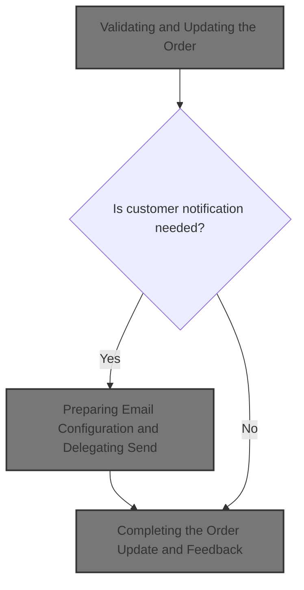
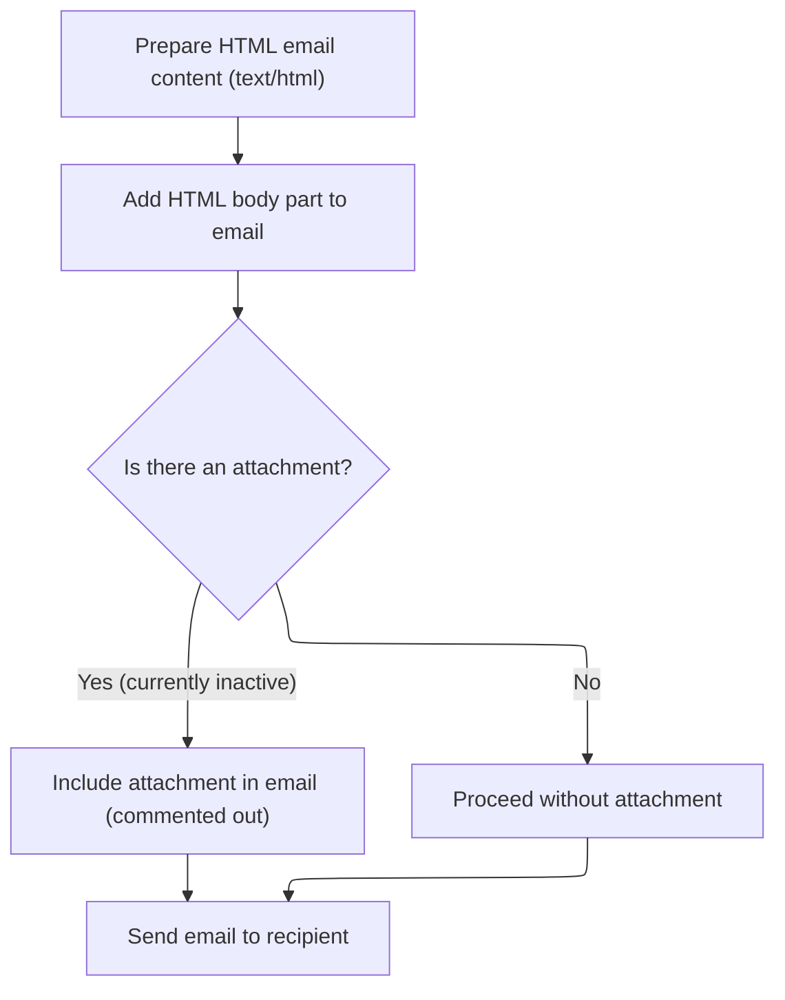

This document describes how an admin updates order details and notifies the customer about changes. The process includes validating and updating the order, preparing and sending a notification email if needed, and confirming the update to the admin.



# Validating and Updating the Order

<SwmSnippet path="/shopizer/sm-shop/src/main/java/com/salesmanager/web/admin/controller/orders/OrderControler.java" line="212">

---

In <SwmToken path="shopizer/sm-shop/src/main/java/com/salesmanager/web/admin/controller/orders/OrderControler.java" pos="212:5:5" line-data="	public String saveOrder(@Valid @ModelAttribute(&quot;order&quot;) com.salesmanager.web.admin.entity.orders.Order entityOrder, BindingResult result, Model model, HttpServletRequest request, Locale locale) throws Exception {">`saveOrder`</SwmToken>, we start by validating all the key order fields—purchase date, customer email, and billing address details. If anything's off, we bail early and show errors. For non-MONEYORDER payments, we check for transactions that can be captured or refunded and add them to the model so the admin UI can show relevant actions. We update the order entity with new info, handle nested entities, and save everything. If the admin leaves a comment, we prep an email notification for the customer, which is why the next step is calling the email service to actually send that out.

```java
	public String saveOrder(@Valid @ModelAttribute("order") com.salesmanager.web.admin.entity.orders.Order entityOrder, BindingResult result, Model model, HttpServletRequest request, Locale locale) throws Exception {
		
		String email_regEx = "\\b[A-Za-z0-9._%+-]+@[A-Za-z0-9.-]+\\.[A-Za-z]{2,4}\\b";
		Pattern pattern = Pattern.compile(email_regEx);
		
		Language language = (Language)request.getAttribute("LANGUAGE");
		List<Country> countries = countryService.getCountries(language);
		model.addAttribute("countries", countries);
		
		MerchantStore store = (MerchantStore)request.getAttribute(Constants.ADMIN_STORE);
		
		//set the id if fails
		entityOrder.setId(entityOrder.getOrder().getId());
		
		model.addAttribute("order", entityOrder);
		
		Set<OrderProduct> orderProducts = new HashSet<OrderProduct>();
		Set<OrderTotal> orderTotal = new HashSet<OrderTotal>();
		Set<OrderStatusHistory> orderHistory = new HashSet<OrderStatusHistory>();
		
		Date date = new Date();
		if(!StringUtils.isBlank(entityOrder.getDatePurchased() ) ){
			try {
				date = DateUtil.getDate(entityOrder.getDatePurchased());
			} catch (Exception e) {
				ObjectError error = new ObjectError("datePurchased",messages.getMessage("message.invalid.date", locale));
				result.addError(error);
			}
			
		} else{
			date = null;
		}
		 

		if(!StringUtils.isBlank(entityOrder.getOrder().getCustomerEmailAddress() ) ){
			 java.util.regex.Matcher matcher = pattern.matcher(entityOrder.getOrder().getCustomerEmailAddress());
			 
			 if(!matcher.find()) {
				ObjectError error = new ObjectError("customerEmailAddress",messages.getMessage("Email.order.customerEmailAddress", locale));
				result.addError(error);
			 }
		}else{
			ObjectError error = new ObjectError("customerEmailAddress",messages.getMessage("NotEmpty.order.customerEmailAddress", locale));
			result.addError(error);
		}

		 
		if( StringUtils.isBlank(entityOrder.getOrder().getBilling().getFirstName() ) ){
			 ObjectError error = new ObjectError("billingFirstName", messages.getMessage("NotEmpty.order.billingFirstName", locale));
			 result.addError(error);
		}
		
		if( StringUtils.isBlank(entityOrder.getOrder().getBilling().getFirstName() ) ){
			 ObjectError error = new ObjectError("billingLastName", messages.getMessage("NotEmpty.order.billingLastName", locale));
			 result.addError(error);
		}
		 
		if( StringUtils.isBlank(entityOrder.getOrder().getBilling().getAddress() ) ){
			 ObjectError error = new ObjectError("billingAddress", messages.getMessage("NotEmpty.order.billingStreetAddress", locale));
			 result.addError(error);
		}
		 
		if( StringUtils.isBlank(entityOrder.getOrder().getBilling().getCity() ) ){
			 ObjectError error = new ObjectError("billingCity",messages.getMessage("NotEmpty.order.billingCity", locale));
			 result.addError(error);
		}
		 
		if( entityOrder.getOrder().getBilling().getZone()==null){
			if( StringUtils.isBlank(entityOrder.getOrder().getBilling().getState())){
				 ObjectError error = new ObjectError("billingState",messages.getMessage("NotEmpty.order.billingState", locale));
				 result.addError(error);
			}
		}
		 
		if( StringUtils.isBlank(entityOrder.getOrder().getBilling().getPostalCode() ) ){
			 ObjectError error = new ObjectError("billingPostalCode", messages.getMessage("NotEmpty.order.billingPostCode", locale));
			 result.addError(error);
		}
		
		com.salesmanager.core.business.order.model.Order newOrder = orderService.getById(entityOrder.getOrder().getId() );
		
		
		//get capturable
		if(newOrder.getPaymentType().name() != PaymentType.MONEYORDER.name()) {
			Transaction capturableTransaction = transactionService.getCapturableTransaction(newOrder);
			if(capturableTransaction!=null) {
				model.addAttribute("capturableTransaction",capturableTransaction);
			}
		}
		
		
		//get refundable
		if(newOrder.getPaymentType().name() != PaymentType.MONEYORDER.name()) {
			Transaction refundableTransaction = transactionService.getRefundableTransaction(newOrder);
			if(refundableTransaction!=null) {
					model.addAttribute("capturableTransaction",null);//remove capturable
					model.addAttribute("refundableTransaction",refundableTransaction);
			}
		}
	
	
		if (result.hasErrors()) {
			//  somehow we lose data, so reset Order detail info.
			entityOrder.getOrder().setOrderProducts( orderProducts);
			entityOrder.getOrder().setOrderTotal(orderTotal);
			entityOrder.getOrder().setOrderHistory(orderHistory);
			
			return ControllerConstants.Tiles.Order.ordersEdit;
		/*	"admin-orders-edit";  */
		}
		
		OrderStatusHistory orderStatusHistory = new OrderStatusHistory();		


		
		Country deliveryCountry = countryService.getByCode( entityOrder.getOrder().getDelivery().getCountry().getIsoCode()); 
		Country billingCountry  = countryService.getByCode( entityOrder.getOrder().getBilling().getCountry().getIsoCode()) ;
		Zone billingZone = null;
		Zone deliveryZone = null;
		if(entityOrder.getOrder().getBilling().getZone()!=null) {
			billingZone = zoneService.getByCode(entityOrder.getOrder().getBilling().getZone().getCode());
		}
		
		if(entityOrder.getOrder().getDelivery().getZone()!=null) {
			deliveryZone = zoneService.getByCode(entityOrder.getOrder().getDelivery().getZone().getCode());
		}

		newOrder.setCustomerEmailAddress(entityOrder.getOrder().getCustomerEmailAddress() );
		newOrder.setStatus(entityOrder.getOrder().getStatus() );		
		
		newOrder.setDatePurchased(date);
		newOrder.setLastModified( new Date() );
		
		if(!StringUtils.isBlank(entityOrder.getOrderHistoryComment() ) ) {
			orderStatusHistory.setComments( entityOrder.getOrderHistoryComment() );
			orderStatusHistory.setCustomerNotified(1);
			orderStatusHistory.setStatus(entityOrder.getOrder().getStatus());
			orderStatusHistory.setDateAdded(new Date() );
			orderStatusHistory.setOrder(newOrder);
			newOrder.getOrderHistory().add( orderStatusHistory );
			entityOrder.setOrderHistoryComment( "" );
		}		
		
		newOrder.setDelivery( entityOrder.getOrder().getDelivery() );
		newOrder.setBilling( entityOrder.getOrder().getBilling() );
		
		newOrder.getDelivery().setCountry(deliveryCountry );
		newOrder.getBilling().setCountry(billingCountry );	
		
		if(billingZone!=null) {
			newOrder.getBilling().setZone(billingZone);
		}
		
		if(deliveryZone!=null) {
			newOrder.getDelivery().setZone(deliveryZone);
		}
		
		orderService.saveOrUpdate(newOrder);
		entityOrder.setOrder(newOrder);
		entityOrder.setBilling(newOrder.getBilling());
		entityOrder.setDelivery(newOrder.getDelivery());
		model.addAttribute("order", entityOrder);
		
		Long customerId = newOrder.getCustomerId();
		
		if(customerId!=null && customerId>0) {
		
			try {
				
				Customer customer = customerService.getById(customerId);
				if(customer!=null) {
					model.addAttribute("customer",customer);
				}
				
				
			} catch(Exception e) {
				LOGGER.error("Error while getting customer for customerId " + customerId, e);
			}
		
		}

		List<OrderProductDownload> orderProductDownloads = orderProdctDownloadService.getByOrderId(newOrder.getId());
		if(CollectionUtils.isNotEmpty(orderProductDownloads)) {
			model.addAttribute("downloads",orderProductDownloads);
		}
		
		
		/** 
		 * send email if admin posted orderHistoryComment
		 * 
		 * **/
		
		if(StringUtils.isBlank(entityOrder.getOrderHistoryComment())) {
		
			try {
				
				Customer customer = customerService.getById(newOrder.getCustomerId());
				Language lang = store.getDefaultLanguage();
				if(customer!=null) {
					lang = customer.getDefaultLanguage();
				}
				
				Locale customerLocale = LocaleUtils.getLocale(lang);

				StringBuilder customerName = new StringBuilder();
				customerName.append(newOrder.getBilling().getFirstName()).append(" ").append(newOrder.getBilling().getLastName());
				
				
				Map<String, String> templateTokens = EmailUtils.createEmailObjectsMap(request.getContextPath(), store, messages, customerLocale);
				templateTokens.put(EmailConstants.EMAIL_CUSTOMER_NAME, customerName.toString());
				templateTokens.put(EmailConstants.EMAIL_TEXT_ORDER_NUMBER, messages.getMessage("email.order.confirmation", new String[]{String.valueOf(newOrder.getId())}, customerLocale));
				templateTokens.put(EmailConstants.EMAIL_TEXT_DATE_ORDERED, messages.getMessage("email.order.ordered", new String[]{entityOrder.getDatePurchased()}, customerLocale));
				templateTokens.put(EmailConstants.EMAIL_TEXT_STATUS_COMMENTS, messages.getMessage("email.order.comments", new String[]{entityOrder.getOrderHistoryComment()}, customerLocale));
				templateTokens.put(EmailConstants.EMAIL_TEXT_DATE_UPDATED, messages.getMessage("email.order.updated", new String[]{DateUtils.formatDate(new Date())}, customerLocale));

				
				Email email = new Email();
				email.setFrom(store.getStorename());
				email.setFromEmail(store.getStoreEmailAddress());
				email.setSubject(messages.getMessage("email.order.status.title",new String[]{String.valueOf(newOrder.getId())},customerLocale));
				email.setTo(entityOrder.getOrder().getCustomerEmailAddress());
				email.setTemplateName(ORDER_STATUS_TMPL);
				email.setTemplateTokens(templateTokens);
	
	
				
				emailService.sendHtmlEmail(store, email);
			
			} catch (Exception e) {
				LOGGER.error("Cannot send email to customer",e);
			}
			
		}
		
```

---

</SwmSnippet>

## Preparing Email Configuration and Delegating Send

<SwmSnippet path="/shopizer/sm-core/src/main/java/com/salesmanager/core/business/system/service/EmailServiceImpl.java" line="25">

---

<SwmToken path="shopizer/sm-core/src/main/java/com/salesmanager/core/business/system/service/EmailServiceImpl.java" pos="25:5:5" line-data="	public void sendHtmlEmail(MerchantStore store, Email email) throws ServiceException, Exception {">`sendHtmlEmail`</SwmToken> grabs the store's email config, sets it on the sender, and hands off the email to the sender for delivery. We call the next function in <SwmToken path="shopizer/sm-core/src/main/java/com/salesmanager/core/modules/email/HtmlEmailSenderImpl.java" pos="83:5:5" line-data="				freemarkerMailConfiguration.setClassForTemplateLoading(HtmlEmailSenderImpl.class, &quot;/&quot;);">`HtmlEmailSenderImpl`</SwmToken> because that's where the actual email construction and sending happens, keeping the business logic separate from the transport details.

```java
	public void sendHtmlEmail(MerchantStore store, Email email) throws ServiceException, Exception {

		EmailConfig emailConfig = getEmailConfiguration(store);
		
		sender.setEmailConfig(emailConfig);
		sender.send(email);
	}
```

---

</SwmSnippet>

## Building and Sending the Email Message

<SwmSnippet path="/shopizer/sm-core/src/main/java/com/salesmanager/core/modules/email/HtmlEmailSenderImpl.java" line="40">

---

In <SwmToken path="shopizer/sm-core/src/main/java/com/salesmanager/core/modules/email/HtmlEmailSenderImpl.java" pos="40:5:5" line-data="	public void send(Email email)">`send`</SwmToken>, we build the email message using both text and HTML templates, filling them with order and customer data via template tokens. The next call to OrderServiceImpl is needed if we want to fetch or update order-related info for the email, like status or downloadable products, before finalizing the message.

```java
	public void send(Email email)
			throws Exception {
		
		final String eml = email.getFrom();
		final String from = email.getFromEmail();
		final String to = email.getTo();
		final String subject = email.getSubject();
		final String tmpl = email.getTemplateName();
		final Map<String,String> templateTokens = email.getTemplateTokens();

		MimeMessagePreparator preparator = new MimeMessagePreparator() {
			public void prepare(MimeMessage mimeMessage)
					throws MessagingException, IOException {
				
				JavaMailSenderImpl impl = (JavaMailSenderImpl)mailSender;
				// if email configuration is present in Database, use the same
				if(emailConfig != null) {
					impl.setProtocol(emailConfig.getProtocol());
					impl.setHost(emailConfig.getHost());
					impl.setPort(Integer.parseInt(emailConfig.getPort()));
					impl.setUsername(emailConfig.getUsername());
					impl.setPassword(emailConfig.getPassword());
					
					Properties prop = new Properties();
					prop.put("mail.smtp.auth", emailConfig.isSmtpAuth());
					prop.put("mail.smtp.starttls.enable", emailConfig.isStarttls());
					impl.setJavaMailProperties(prop);
				}
				
				mimeMessage.setRecipient(Message.RecipientType.TO, new InternetAddress(to));

				InternetAddress inetAddress = new InternetAddress();

				inetAddress.setPersonal(eml);
				inetAddress.setAddress(from);

				mimeMessage.setFrom(inetAddress);
				mimeMessage.setSubject(subject);

				Multipart mp = new MimeMultipart("alternative");

				// Create a "text" Multipart message
				BodyPart textPart = new MimeBodyPart();
				freemarkerMailConfiguration.setClassForTemplateLoading(HtmlEmailSenderImpl.class, "/");
				Template textTemplate = freemarkerMailConfiguration.getTemplate(new StringBuilder(TEMPLATE_PATH).append("").append("/").append(tmpl).toString());
				final StringWriter textWriter = new StringWriter();
				try {
					textTemplate.process(templateTokens, textWriter);
				} catch (TemplateException e) {
					throw new MailPreparationException(
							"Can't generate text mail", e);
				}
				textPart.setDataHandler(new javax.activation.DataHandler(
						new javax.activation.DataSource() {
							public InputStream getInputStream()
									throws IOException {
								//return new StringBufferInputStream(textWriter
								//		.toString());
								return new ByteArrayInputStream(textWriter
										.toString().getBytes(CHARSET));
							}

							public OutputStream getOutputStream()
									throws IOException {
								throw new IOException("Read-only data");
							}

							public String getContentType() {
								return "text/plain";
							}

							public String getName() {
								return "main";
							}
						}));
				mp.addBodyPart(textPart);

				// Create a "HTML" Multipart message
				Multipart htmlContent = new MimeMultipart("related");
				BodyPart htmlPage = new MimeBodyPart();
				freemarkerMailConfiguration.setClassForTemplateLoading(HtmlEmailSenderImpl.class, "/");
				Template htmlTemplate = freemarkerMailConfiguration.getTemplate(new StringBuilder(TEMPLATE_PATH).append("").append("/").append(tmpl).toString());
				final StringWriter htmlWriter = new StringWriter();
				try {
					htmlTemplate.process(templateTokens, htmlWriter);
				} catch (TemplateException e) {
					throw new MailPreparationException(
							"Can't generate HTML mail", e);
				}
```

---

</SwmSnippet>

### Processing Order Data for Email

See <SwmLink doc-title="Order Processing Flow">[Order Processing Flow](.swm%5Corder-processing-flow.p26bpmku.sw.md)</SwmLink>

### Finalizing and Dispatching the Email



<SwmSnippet path="/shopizer/sm-core/src/main/java/com/salesmanager/core/modules/email/HtmlEmailSenderImpl.java" line="129">

---

After getting order data, we finalize the email with both formats and send it out, making sure the info matches the latest order state.

```java
				htmlPage.setDataHandler(new javax.activation.DataHandler(
						new javax.activation.DataSource() {
							public InputStream getInputStream()
									throws IOException {
								//return new StringBufferInputStream(htmlWriter
								//		.toString());
								return new ByteArrayInputStream(textWriter
										.toString().getBytes(CHARSET));
							}

							public OutputStream getOutputStream()
									throws IOException {
								throw new IOException("Read-only data");
							}

							public String getContentType() {
								return "text/html";
							}

							public String getName() {
								return "main";
							}
						}));
				htmlContent.addBodyPart(htmlPage);
				BodyPart htmlPart = new MimeBodyPart();
				htmlPart.setContent(htmlContent);
				mp.addBodyPart(htmlPart);

				mimeMessage.setContent(mp);

				// if(attachment!=null) {
				// MimeMessageHelper messageHelper = new
				// MimeMessageHelper(mimeMessage, true);
				// messageHelper.addAttachment(attachmentFileName, attachment);
				// }

			}
		};

		mailSender.send(preparator);
	}
```

---

</SwmSnippet>

## Completing the Order Update and Feedback

<SwmSnippet path="/shopizer/sm-shop/src/main/java/com/salesmanager/web/admin/controller/orders/OrderControler.java" line="447">

---

Back in `OrderControler.saveOrder`, after sending the email, we mark the operation as successful by setting a flag in the model and return the edit view. This lets the admin know everything went through. The function still relies on the order entity and request attributes being structured as expected, which isn't obvious from the method signature.

```java
		model.addAttribute("success","success");

		
		return  ControllerConstants.Tiles.Order.ordersEdit;
	    /*	"admin-orders-edit";  */
	}
```

---

</SwmSnippet>

&nbsp;

*This is an auto-generated document by Swimm 🌊 and has not yet been verified by a human*

<SwmMeta version="3.0.0" repo-id="Z2l0aHViJTNBJTNBU2hvcGl6ZXIlM0ElM0F1bWFsaW5nYXN3YW1p" repo-name="Shopizer"><sup>Powered by [Swimm](https://app.swimm.io/)</sup></SwmMeta>
