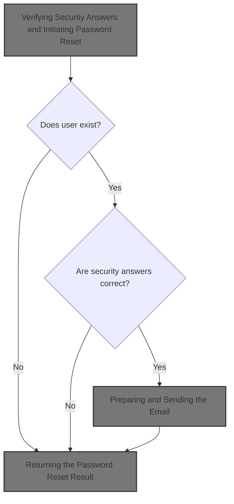
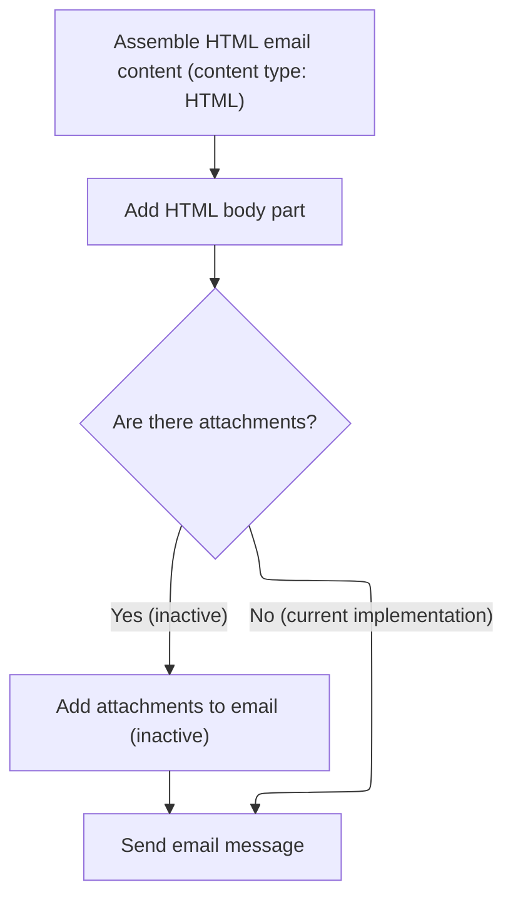
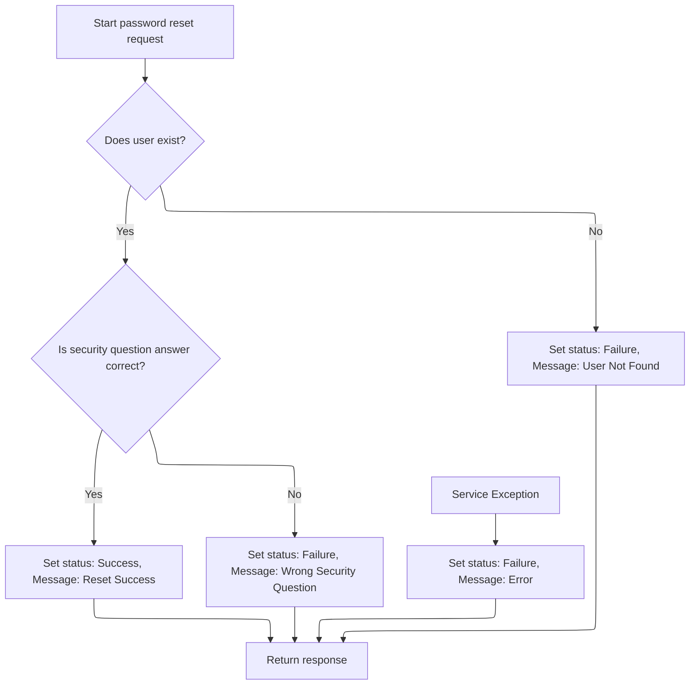

This document describes the process for users to reset their password by answering security questions. If the answers are correct, a temporary password is generated, updated for the user, and sent to the user's email. The client receives a JSON response indicating the result.



# Verifying Security Answers and Initiating Password Reset

<SwmSnippet path="/shopizer/sm-shop/src/main/java/com/salesmanager/web/admin/controller/user/UserController.java" line="781">

---

In <SwmToken path="shopizer/sm-shop/src/main/java/com/salesmanager/web/admin/controller/user/UserController.java" pos="781:8:8" line-data="	public @ResponseBody String resetPasswordSecurityQtn(@ModelAttribute(value=&quot;userReset&quot;) UserReset userReset,HttpServletRequest request, HttpServletResponse response, Locale locale) {">`resetPasswordSecurityQtn`</SwmToken>, we start by pulling the store and locale info, then grab the security question answers from the request. The username is fetched from the session attribute <SwmToken path="shopizer/sm-shop/src/main/java/com/salesmanager/web/admin/controller/user/UserController.java" pos="799:20:20" line-data="			User dbUser = userService.getByUserName((String) session.getAttribute(&quot;username_reset&quot;));">`username_reset`</SwmToken>, which is a hidden dependency—if it's not set, nothing works. The user is loaded from the DB, answers are checked, and if they match, a new password is generated, encoded, and saved. Next, we need to call <SwmToken path="shopizer/sm-core/src/main/java/com/salesmanager/core/business/system/service/EmailServiceImpl.java" pos="16:4:4" line-data="public class EmailServiceImpl implements EmailService {">`EmailServiceImpl`</SwmToken> to actually notify the user with their new password, otherwise they wouldn't know what it is.

```java
	public @ResponseBody String resetPasswordSecurityQtn(@ModelAttribute(value="userReset") UserReset userReset,HttpServletRequest request, HttpServletResponse response, Locale locale) {
		
		MerchantStore store = (MerchantStore)request.getAttribute(Constants.ADMIN_STORE);
		Language userLanguage = null; 
		Locale userLocale =  null; 
		AjaxResponse resp = new AjaxResponse();
		
		//String question1 = request.getParameter("question1");
		//String question2 = request.getParameter("question2");
		//String question3 = request.getParameter("question3");

		String answer1 = request.getParameter("answer1");
		String answer2 = request.getParameter("answer2");
		String answer3 = request.getParameter("answer3");
		
		try {
			
			HttpSession session = request.getSession();
			User dbUser = userService.getByUserName((String) session.getAttribute("username_reset"));
			
			if(dbUser!= null){
				
				if(dbUser.getAnswer1().equals(answer1.trim()) && dbUser.getAnswer2().equals(answer2.trim()) && dbUser.getAnswer3().equals(answer3.trim())){
					userLanguage = dbUser.getDefaultLanguage();	
					userLocale =  LocaleUtils.getLocale(userLanguage);
					
					String tempPass = userReset.generateRandomString();
					String pass = passwordEncoder.encodePassword(tempPass, null);
					
					dbUser.setAdminPassword(pass);
					userService.update(dbUser);
					
					//send email
					
					try {
						String[] storeEmail = {store.getStoreEmailAddress()};						
						
						Map<String, String> templateTokens = EmailUtils.createEmailObjectsMap(request.getContextPath(), store, messages, userLocale);
						templateTokens.put(EmailConstants.EMAIL_RESET_PASSWORD_TXT, messages.getMessage("email.user.resetpassword.text", userLocale));
						templateTokens.put(EmailConstants.EMAIL_CONTACT_OWNER, messages.getMessage("email.contactowner", storeEmail, userLocale));
						templateTokens.put(EmailConstants.EMAIL_PASSWORD_LABEL, messages.getMessage("label.generic.password",userLocale));
						templateTokens.put(EmailConstants.EMAIL_USER_PASSWORD, tempPass);

						Email email = new Email();
						email.setFrom(store.getStorename());
						email.setFromEmail(store.getStoreEmailAddress());
						email.setSubject(messages.getMessage("label.generic.changepassword",userLocale));
						email.setTo(dbUser.getAdminEmail() );
						email.setTemplateName(RESET_PASSWORD_TPL);
						email.setTemplateTokens(templateTokens);
						
						emailService.sendHtmlEmail(store, email);
					
					} catch (Exception e) {
						LOGGER.error("Cannot send email to user",e);
					}
					
```

---

</SwmSnippet>

## Preparing and Sending the Email

<SwmSnippet path="/shopizer/sm-core/src/main/java/com/salesmanager/core/business/system/service/EmailServiceImpl.java" line="25">

---

<SwmToken path="shopizer/sm-core/src/main/java/com/salesmanager/core/business/system/service/EmailServiceImpl.java" pos="25:5:5" line-data="	public void sendHtmlEmail(MerchantStore store, Email email) throws ServiceException, Exception {">`sendHtmlEmail`</SwmToken> grabs the store's email config, sets it on the sender, and hands off the email object. We need to call <SwmToken path="shopizer/sm-core/src/main/java/com/salesmanager/core/modules/email/HtmlEmailSenderImpl.java" pos="83:5:5" line-data="				freemarkerMailConfiguration.setClassForTemplateLoading(HtmlEmailSenderImpl.class, &quot;/&quot;);">`HtmlEmailSenderImpl`</SwmToken> next because that's where the actual email gets built and sent out.

```java
	public void sendHtmlEmail(MerchantStore store, Email email) throws ServiceException, Exception {

		EmailConfig emailConfig = getEmailConfiguration(store);
		
		sender.setEmailConfig(emailConfig);
		sender.send(email);
	}
```

---

</SwmSnippet>

## Building the Email Content and Dispatch

<SwmSnippet path="/shopizer/sm-core/src/main/java/com/salesmanager/core/modules/email/HtmlEmailSenderImpl.java" line="40">

---

In <SwmToken path="shopizer/sm-core/src/main/java/com/salesmanager/core/modules/email/HtmlEmailSenderImpl.java" pos="40:5:5" line-data="	public void send(Email email)">`send`</SwmToken>, we prep the email fields, load and process the templates for both text and HTML, and set up the message. We need to call OrderServiceImpl next if we want to pull in order data for the email content.

```java
	public void send(Email email)
			throws Exception {
		
		final String eml = email.getFrom();
		final String from = email.getFromEmail();
		final String to = email.getTo();
		final String subject = email.getSubject();
		final String tmpl = email.getTemplateName();
		final Map<String,String> templateTokens = email.getTemplateTokens();

		MimeMessagePreparator preparator = new MimeMessagePreparator() {
			public void prepare(MimeMessage mimeMessage)
					throws MessagingException, IOException {
				
				JavaMailSenderImpl impl = (JavaMailSenderImpl)mailSender;
				// if email configuration is present in Database, use the same
				if(emailConfig != null) {
					impl.setProtocol(emailConfig.getProtocol());
					impl.setHost(emailConfig.getHost());
					impl.setPort(Integer.parseInt(emailConfig.getPort()));
					impl.setUsername(emailConfig.getUsername());
					impl.setPassword(emailConfig.getPassword());
					
					Properties prop = new Properties();
					prop.put("mail.smtp.auth", emailConfig.isSmtpAuth());
					prop.put("mail.smtp.starttls.enable", emailConfig.isStarttls());
					impl.setJavaMailProperties(prop);
				}
				
				mimeMessage.setRecipient(Message.RecipientType.TO, new InternetAddress(to));

				InternetAddress inetAddress = new InternetAddress();

				inetAddress.setPersonal(eml);
				inetAddress.setAddress(from);

				mimeMessage.setFrom(inetAddress);
				mimeMessage.setSubject(subject);

				Multipart mp = new MimeMultipart("alternative");

				// Create a "text" Multipart message
				BodyPart textPart = new MimeBodyPart();
				freemarkerMailConfiguration.setClassForTemplateLoading(HtmlEmailSenderImpl.class, "/");
				Template textTemplate = freemarkerMailConfiguration.getTemplate(new StringBuilder(TEMPLATE_PATH).append("").append("/").append(tmpl).toString());
				final StringWriter textWriter = new StringWriter();
				try {
					textTemplate.process(templateTokens, textWriter);
				} catch (TemplateException e) {
					throw new MailPreparationException(
							"Can't generate text mail", e);
				}
				textPart.setDataHandler(new javax.activation.DataHandler(
						new javax.activation.DataSource() {
							public InputStream getInputStream()
									throws IOException {
								//return new StringBufferInputStream(textWriter
								//		.toString());
								return new ByteArrayInputStream(textWriter
										.toString().getBytes(CHARSET));
							}

							public OutputStream getOutputStream()
									throws IOException {
								throw new IOException("Read-only data");
							}

							public String getContentType() {
								return "text/plain";
							}

							public String getName() {
								return "main";
							}
						}));
				mp.addBodyPart(textPart);

				// Create a "HTML" Multipart message
				Multipart htmlContent = new MimeMultipart("related");
				BodyPart htmlPage = new MimeBodyPart();
				freemarkerMailConfiguration.setClassForTemplateLoading(HtmlEmailSenderImpl.class, "/");
				Template htmlTemplate = freemarkerMailConfiguration.getTemplate(new StringBuilder(TEMPLATE_PATH).append("").append("/").append(tmpl).toString());
				final StringWriter htmlWriter = new StringWriter();
				try {
					htmlTemplate.process(templateTokens, htmlWriter);
				} catch (TemplateException e) {
					throw new MailPreparationException(
							"Can't generate HTML mail", e);
				}
```

---

</SwmSnippet>

### Fetching Order Data for Email Context

See <SwmLink doc-title="Order Processing Flow">[Order Processing Flow](.swm%5Corder-processing-flow.6tpvkjha.sw.md)</SwmLink>

### Finalizing and Sending the Email



<SwmSnippet path="/shopizer/sm-core/src/main/java/com/salesmanager/core/modules/email/HtmlEmailSenderImpl.java" line="129">

---

Back in `HtmlEmailSenderImpl.send`, after getting any needed order data, we finish building the HTML part, add it to the message, and send it out. The order info (if any) is already baked into the template tokens at this point.

```java
				htmlPage.setDataHandler(new javax.activation.DataHandler(
						new javax.activation.DataSource() {
							public InputStream getInputStream()
									throws IOException {
								//return new StringBufferInputStream(htmlWriter
								//		.toString());
								return new ByteArrayInputStream(textWriter
										.toString().getBytes(CHARSET));
							}

							public OutputStream getOutputStream()
									throws IOException {
								throw new IOException("Read-only data");
							}

							public String getContentType() {
								return "text/html";
							}

							public String getName() {
								return "main";
							}
						}));
				htmlContent.addBodyPart(htmlPage);
				BodyPart htmlPart = new MimeBodyPart();
				htmlPart.setContent(htmlContent);
				mp.addBodyPart(htmlPart);

				mimeMessage.setContent(mp);

				// if(attachment!=null) {
				// MimeMessageHelper messageHelper = new
				// MimeMessageHelper(mimeMessage, true);
				// messageHelper.addAttachment(attachmentFileName, attachment);
				// }

			}
		};

		mailSender.send(preparator);
	}
```

---

</SwmSnippet>

## Returning the Password Reset Result



<SwmSnippet path="/shopizer/sm-shop/src/main/java/com/salesmanager/web/admin/controller/user/UserController.java" line="838">

---

Back in <SwmToken path="shopizer/sm-shop/src/main/java/com/salesmanager/web/admin/controller/user/UserController.java" pos="781:8:8" line-data="	public @ResponseBody String resetPasswordSecurityQtn(@ModelAttribute(value=&quot;userReset&quot;) UserReset userReset,HttpServletRequest request, HttpServletResponse response, Locale locale) {">`resetPasswordSecurityQtn`</SwmToken>, after sending the email, we set the <SwmToken path="shopizer/sm-shop/src/main/java/com/salesmanager/web/admin/controller/user/UserController.java" pos="838:5:5" line-data="					resp.setStatus(AjaxResponse.RESPONSE_OPERATION_COMPLETED);">`AjaxResponse`</SwmToken> status and message based on whether the reset worked, answers matched, or the user was found. The response is returned as JSON for the client to handle.

```java
					resp.setStatus(AjaxResponse.RESPONSE_OPERATION_COMPLETED);
					resp.setStatusMessage(messages.getMessage("User.resetPassword.resetSuccess", locale));
				}
				else{
					  resp.setStatus(AjaxResponse.RESPONSE_STATUS_FAIURE);
					  resp.setStatusMessage(messages.getMessage("User.resetPassword.wrongSecurityQtn", locale));
					  
				  }
			  }else{
				  resp.setStatus(AjaxResponse.RESPONSE_STATUS_FAIURE);
				  resp.setStatusMessage(messages.getMessage("User.resetPassword.userNotFound", locale));
				  
			  }
			
		} catch (ServiceException e) {
			e.printStackTrace();
			resp.setStatus(AjaxResponse.RESPONSE_STATUS_FAIURE);
			resp.setStatusMessage(messages.getMessage("User.resetPassword.Error", locale));
		}
		
		String returnString = resp.toJSONString();
		return returnString;
	}
```

---

</SwmSnippet>

&nbsp;

*This is an auto-generated document by Swimm 🌊 and has not yet been verified by a human*

<SwmMeta version="3.0.0" repo-id="Z2l0aHViJTNBJTNBU2hvcGl6ZXIlM0ElM0F1bWFsaW5nYXN3YW1p" repo-name="Shopizer"><sup>Powered by [Swimm](https://app.swimm.io/)</sup></SwmMeta>
