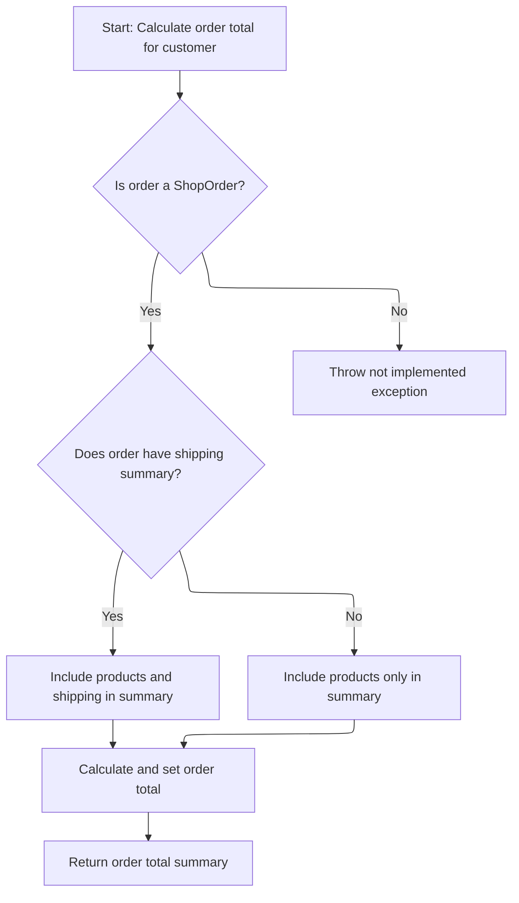

This document outlines the flow for handling a payment action during checkout. The process validates the order, prepares customer and order data for accurate total calculation, and, if PayPal is selected, initializes the payment and redirects the user to the appropriate PayPal page based on their device and environment.

# Starting Payment and Order Validation

This section ensures that before starting the payment process, the order is validated and the order total summary is available in the session to avoid redundant calculations during the payment flow.

| Category        | Rule Name                   | Description                                                                                                                                                       |
| --------------- | --------------------------- | ----------------------------------------------------------------------------------------------------------------------------------------------------------------- |
| Data validation | Order validation required   | The order must be validated before any payment processing can begin. If validation fails, the process is halted and validation messages are returned to the user. |
| Business logic  | Order total summary caching | If the order total summary is not present in the session, it must be calculated and stored in the session before proceeding with payment.                         |

<SwmSnippet path="/shopizer/sm-shop/src/main/java/com/salesmanager/web/shop/controller/order/ShoppingOrderPaymentController.java" line="124">

---

Next, after validating the order, we check if the order total summary is already in the session. If not, we call <SwmToken path="shopizer/sm-shop/src/main/java/com/salesmanager/web/shop/controller/order/ShoppingOrderPaymentController.java" pos="145:1:1" line-data="			orderFacade.validateOrder(order, new BeanPropertyBindingResult(order,&quot;order&quot;), messages, store, locale);">`orderFacade`</SwmToken> to calculate it and then store it in the session. This prevents recalculating the totals every time the user interacts with the payment flow, which is especially useful for multi-step or redirect-based payments.

```java
	public @ResponseBody String paymentAction(@Valid @ModelAttribute(value="order") ShopOrder order, @PathVariable String action, @PathVariable String paymentmethod, Device device, HttpServletRequest request, HttpServletResponse response, Locale locale) throws Exception {
		
		
		
		Language language = (Language)request.getAttribute("LANGUAGE");
		MerchantStore store = (MerchantStore)request.getAttribute(Constants.MERCHANT_STORE);
		String shoppingCartCode  = getSessionAttribute(Constants.SHOPPING_CART, request);
		
		Validate.notNull(shoppingCartCode,"shoppingCartCode does not exist in the session");
		AjaxResponse ajaxResponse = new AjaxResponse();

		try {
			
			com.salesmanager.core.business.shoppingcart.model.ShoppingCart cart = shoppingCartFacade.getShoppingCartModel(shoppingCartCode, store);
			
			Set<ShoppingCartItem> items = cart.getLineItems();
			List<ShoppingCartItem> cartItems = new ArrayList<ShoppingCartItem>(items);
			order.setShoppingCartItems(cartItems);
			
			//validate order first
			Map<String,String> messages = new TreeMap<String,String>();
			orderFacade.validateOrder(order, new BeanPropertyBindingResult(order,"order"), messages, store, locale);
			
			if(CollectionUtils.isNotEmpty(messages.values())) {
				for(String key : messages.keySet()) {
					String value = messages.get(key);
					ajaxResponse.addValidationMessage(key, value);
				}
```

---

</SwmSnippet>

<SwmSnippet path="/shopizer/sm-shop/src/main/java/com/salesmanager/web/shop/controller/order/ShoppingOrderPaymentController.java" line="152">

---

Next, after validating the order, we check if the order total summary is already in the session. If not, we call <SwmToken path="shopizer/sm-shop/src/main/java/com/salesmanager/web/shop/controller/order/ShoppingOrderPaymentController.java" pos="161:8:8" line-data="			//OrderTotalSummary orderTotalSummary = orderFacade.calculateOrderTotal(store, order, language);">`orderFacade`</SwmToken> to calculate it and then store it in the session. This prevents recalculating the totals every time the user interacts with the payment flow, which is especially useful for multi-step or redirect-based payments.

```java
				ajaxResponse.setStatus(AjaxResponse.RESPONSE_STATUS_VALIDATION_FAILED);
				return ajaxResponse.toJSONString();
			}
			
			
			IntegrationConfiguration config = paymentService.getPaymentConfiguration(order.getPaymentModule(), store);
			IntegrationModule integrationModule = paymentService.getPaymentMethodByCode(store, order.getPaymentModule());

			
			//OrderTotalSummary orderTotalSummary = orderFacade.calculateOrderTotal(store, order, language);
			OrderTotalSummary orderTotalSummary = super.getSessionAttribute(Constants.ORDER_SUMMARY, request);
			if(orderTotalSummary==null) {
				orderTotalSummary = orderFacade.calculateOrderTotal(store, order, language);
				super.setSessionAttribute(Constants.ORDER_SUMMARY, orderTotalSummary, request);
			}
			
```

---

</SwmSnippet>

## Preparing Customer Data for Order Calculation



This section prepares customer and order data for total calculation. It ensures only supported order types are processed, gathers all necessary details, and produces a summary of the order total for further use.

| Category        | Rule Name                    | Description                                                                                                                                                                                                                                                                                                                                                                                                                                                                                                                                                                                                                                        |
| --------------- | ---------------------------- | -------------------------------------------------------------------------------------------------------------------------------------------------------------------------------------------------------------------------------------------------------------------------------------------------------------------------------------------------------------------------------------------------------------------------------------------------------------------------------------------------------------------------------------------------------------------------------------------------------------------------------------------------- |
| Data validation | Supported order type only    | Only orders of type <SwmToken path="shopizer/sm-shop/src/main/java/com/salesmanager/web/shop/controller/order/ShoppingOrderPaymentController.java" pos="124:23:23" line-data="	public @ResponseBody String paymentAction(@Valid @ModelAttribute(value=&quot;order&quot;) ShopOrder order, @PathVariable String action, @PathVariable String paymentmethod, Device device, HttpServletRequest request, HttpServletResponse response, Locale locale) throws Exception {">`ShopOrder`</SwmToken> are eligible for order total calculation. Any other order type will not be processed and will result in an error.                                     |
| Business logic  | Shipping cost inclusion      | If a <SwmToken path="shopizer/sm-shop/src/main/java/com/salesmanager/web/shop/controller/order/ShoppingOrderPaymentController.java" pos="124:23:23" line-data="	public @ResponseBody String paymentAction(@Valid @ModelAttribute(value=&quot;order&quot;) ShopOrder order, @PathVariable String action, @PathVariable String paymentmethod, Device device, HttpServletRequest request, HttpServletResponse response, Locale locale) throws Exception {">`ShopOrder`</SwmToken> contains a shipping summary, the shipping costs must be included in the order total calculation. If no shipping summary is present, only product costs are included. |
| Business logic  | Customer model required      | The customer model must be retrieved and used in the calculation to ensure customer-specific pricing, discounts, or rules are applied to the order total.                                                                                                                                                                                                                                                                                                                                                                                                                                                                                          |
| Business logic  | Order totals synchronization | After calculation, the order must be updated with the latest totals before returning the summary, ensuring data consistency between the order and its calculated summary.                                                                                                                                                                                                                                                                                                                                                                                                                                                                          |

<SwmSnippet path="/shopizer/sm-shop/src/main/java/com/salesmanager/web/shop/controller/order/facade/OrderFacadeImpl.java" line="155">

---

The previous attempt was a bit much, so here’s the gist - we get the full customer model from the reference in the order, then pass it along with the order to the next calculation step.

```java
	public OrderTotalSummary calculateOrderTotal(MerchantStore store,
			ShopOrder order, Language language) throws Exception {
		

		Customer customer = customerFacade.getCustomerModel(order.getCustomer(), store, language);
		OrderTotalSummary summary = this.calculateOrderTotal(store, customer, order, language);
```

---

</SwmSnippet>

<SwmSnippet path="/shopizer/sm-shop/src/main/java/com/salesmanager/web/shop/controller/order/facade/OrderFacadeImpl.java" line="190">

---

<SwmToken path="shopizer/sm-shop/src/main/java/com/salesmanager/web/shop/controller/order/facade/OrderFacadeImpl.java" pos="190:5:5" line-data="	private OrderTotalSummary calculateOrderTotal(MerchantStore store, Customer customer, PersistableOrder order, Language language) throws Exception {">`calculateOrderTotal`</SwmToken> checks if the order is a <SwmToken path="shopizer/sm-shop/src/main/java/com/salesmanager/web/shop/controller/order/facade/OrderFacadeImpl.java" pos="197:7:7" line-data="		if(order instanceof ShopOrder) {">`ShopOrder`</SwmToken>. If so, it extracts the cart items and shipping summary, puts them into an <SwmToken path="shopizer/sm-shop/src/main/java/com/salesmanager/web/shop/controller/order/facade/OrderFacadeImpl.java" pos="194:1:1" line-data="		OrderSummary summary = new OrderSummary();">`OrderSummary`</SwmToken>, and delegates the calculation to <SwmToken path="shopizer/sm-shop/src/main/java/com/salesmanager/web/shop/controller/order/facade/OrderFacadeImpl.java" pos="204:5:5" line-data="			orderTotalSummary = orderService.caculateOrderTotal(summary, customer, store, language);">`orderService`</SwmToken>. If the order isn't a <SwmToken path="shopizer/sm-shop/src/main/java/com/salesmanager/web/shop/controller/order/facade/OrderFacadeImpl.java" pos="197:7:7" line-data="		if(order instanceof ShopOrder) {">`ShopOrder`</SwmToken>, it throws an exception since other types aren't supported yet.

```java
	private OrderTotalSummary calculateOrderTotal(MerchantStore store, Customer customer, PersistableOrder order, Language language) throws Exception {
		
		OrderTotalSummary orderTotalSummary = null;
		
		OrderSummary summary = new OrderSummary();
		
		
		if(order instanceof ShopOrder) {
			ShopOrder o = (ShopOrder)order;
			summary.setProducts(o.getShoppingCartItems());
			
			if(o.getShippingSummary()!=null) {
				summary.setShippingSummary(o.getShippingSummary());
			}
			orderTotalSummary = orderService.caculateOrderTotal(summary, customer, store, language);
		} else {
			//need Set of ShoppingCartItem
			//PersistableOrder not implemented
			throw new Exception("calculateOrderTotal not yet implemented for PersistableOrder");
		}

		return orderTotalSummary;
		
	}
```

---

</SwmSnippet>

<SwmSnippet path="/shopizer/sm-shop/src/main/java/com/salesmanager/web/shop/controller/order/facade/OrderFacadeImpl.java" line="161">

---

Back in <SwmToken path="shopizer/sm-shop/src/main/java/com/salesmanager/web/shop/controller/order/ShoppingOrderPaymentController.java" pos="161:10:10" line-data="			//OrderTotalSummary orderTotalSummary = orderFacade.calculateOrderTotal(store, order, language);">`calculateOrderTotal`</SwmToken>, after getting the summary from <SwmToken path="shopizer/sm-shop/src/main/java/com/salesmanager/web/shop/controller/order/facade/OrderFacadeImpl.java" pos="204:5:5" line-data="			orderTotalSummary = orderService.caculateOrderTotal(summary, customer, store, language);">`orderService`</SwmToken>, we update the order with the new totals using <SwmToken path="shopizer/sm-shop/src/main/java/com/salesmanager/web/shop/controller/order/facade/OrderFacadeImpl.java" pos="161:3:3" line-data="		this.setOrderTotals(order, summary);">`setOrderTotals`</SwmToken>. This keeps the order in sync with the latest calculation before returning the summary.

```java
		this.setOrderTotals(order, summary);
		return summary;
	}
```

---

</SwmSnippet>

## Initializing PayPal Payment and Redirect

```mermaid
%%{init: {"flowchart": {"defaultRenderer": "elk"}} }%%
flowchart TD
  node1["Start payment action"] --> node2{"Shipping summary exists?"}
  click node1 openCode "shopizer/sm-shop/src/main/java/com/salesmanager/web/shop/controller/order/ShoppingOrderPaymentController.java:168:169"
  node2 -->|"Yes"| node3["Attach shipping summary to order"]
  click node2 openCode "shopizer/sm-shop/src/main/java/com/salesmanager/web/shop/controller/order/ShoppingOrderPaymentController.java:170:172"
  node2 -->|"No"| node4{"Is action INIT_ACTION?"}
  click node3 openCode "shopizer/sm-shop/src/main/java/com/salesmanager/web/shop/controller/order/ShoppingOrderPaymentController.java:171:172"
  node3 --> node4
  node4 -->|"Yes"| node5{"Payment method is PayPal?"}
  click node4 openCode "shopizer/sm-shop/src/main/java/com/salesmanager/web/shop/controller/order/ShoppingOrderPaymentController.java:176:177"
  node4 -->|"No"| node12["Return Ajax response"]
  node5 -->|"Yes"| node6["Initialize PayPal transaction and create record"]
  click node5 openCode "shopizer/sm-shop/src/main/java/com/salesmanager/web/shop/controller/order/ShoppingOrderPaymentController.java:177:187"
  node5 -->|"No"| node12
  node6 --> node7{"Device type?"}
  click node6 openCode "shopizer/sm-shop/src/main/java/com/salesmanager/web/shop/controller/order/ShoppingOrderPaymentController.java:187:211"
  node7 -->|"Desktop"| node8["Build regular PayPal URL"]
  node7 -->|"Tablet"| node8
  node7 -->|"Mobile"| node9["Build mobile PayPal URL"]
  click node7 openCode "shopizer/sm-shop/src/main/java/com/salesmanager/web/shop/controller/order/ShoppingOrderPaymentController.java:197:206"
  node8 --> node10{"Environment?"}
  node9 --> node10
  click node8 openCode "shopizer/sm-shop/src/main/java/com/salesmanager/web/shop/controller/order/ShoppingOrderPaymentController.java:199:203"
  click node9 openCode "shopizer/sm-shop/src/main/java/com/salesmanager/web/shop/controller/order/ShoppingOrderPaymentController.java:205:206"
  node10 -->|"Production"| node11["Return Ajax response with production URL"]
  node10 -->|"Sandbox"| node13["Return Ajax response with sandbox URL"]
  click node10 openCode "shopizer/sm-shop/src/main/java/com/salesmanager/web/shop/controller/order/ShoppingOrderPaymentController.java:215:221"
  click node11 openCode "shopizer/sm-shop/src/main/java/com/salesmanager/web/shop/controller/order/ShoppingOrderPaymentController.java:216:217"
  click node13 openCode "shopizer/sm-shop/src/main/java/com/salesmanager/web/shop/controller/order/ShoppingOrderPaymentController.java:219:220"
  node11 --> node14["Set session attributes and status"]
  node13 --> node14
  click node14 openCode "shopizer/sm-shop/src/main/java/com/salesmanager/web/shop/controller/order/ShoppingOrderPaymentController.java:224:225"
  node14 --> node12["Return Ajax response"]
  click node12 openCode "shopizer/sm-shop/src/main/java/com/salesmanager/web/shop/controller/order/ShoppingOrderPaymentController.java:242:243"
classDef HeadingStyle fill:#777777,stroke:#333,stroke-width:2px;

%% Swimm:
%% %%{init: {"flowchart": {"defaultRenderer": "elk"}} }%%
%% flowchart TD
%%   node1["Start payment action"] --> node2{"Shipping summary exists?"}
%%   click node1 openCode "<SwmPath>[shopizer/…/order/ShoppingOrderPaymentController.java](shopizer/sm-shop/src/main/java/com/salesmanager/web/shop/controller/order/ShoppingOrderPaymentController.java)</SwmPath>:168:169"
%%   node2 -->|"Yes"| node3["Attach shipping summary to order"]
%%   click node2 openCode "<SwmPath>[shopizer/…/order/ShoppingOrderPaymentController.java](shopizer/sm-shop/src/main/java/com/salesmanager/web/shop/controller/order/ShoppingOrderPaymentController.java)</SwmPath>:170:172"
%%   node2 -->|"No"| node4{"Is action <SwmToken path="shopizer/sm-shop/src/main/java/com/salesmanager/web/shop/controller/order/ShoppingOrderPaymentController.java" pos="176:7:7" line-data="			if(action.equals(INIT_ACTION)) {">`INIT_ACTION`</SwmToken>?"}
%%   click node3 openCode "<SwmPath>[shopizer/…/order/ShoppingOrderPaymentController.java](shopizer/sm-shop/src/main/java/com/salesmanager/web/shop/controller/order/ShoppingOrderPaymentController.java)</SwmPath>:171:172"
%%   node3 --> node4
%%   node4 -->|"Yes"| node5{"Payment method is PayPal?"}
%%   click node4 openCode "<SwmPath>[shopizer/…/order/ShoppingOrderPaymentController.java](shopizer/sm-shop/src/main/java/com/salesmanager/web/shop/controller/order/ShoppingOrderPaymentController.java)</SwmPath>:176:177"
%%   node4 -->|"No"| node12["Return Ajax response"]
%%   node5 -->|"Yes"| node6["Initialize PayPal transaction and create record"]
%%   click node5 openCode "<SwmPath>[shopizer/…/order/ShoppingOrderPaymentController.java](shopizer/sm-shop/src/main/java/com/salesmanager/web/shop/controller/order/ShoppingOrderPaymentController.java)</SwmPath>:177:187"
%%   node5 -->|"No"| node12
%%   node6 --> node7{"Device type?"}
%%   click node6 openCode "<SwmPath>[shopizer/…/order/ShoppingOrderPaymentController.java](shopizer/sm-shop/src/main/java/com/salesmanager/web/shop/controller/order/ShoppingOrderPaymentController.java)</SwmPath>:187:211"
%%   node7 -->|"Desktop"| node8["Build regular PayPal URL"]
%%   node7 -->|"Tablet"| node8
%%   node7 -->|"Mobile"| node9["Build mobile PayPal URL"]
%%   click node7 openCode "<SwmPath>[shopizer/…/order/ShoppingOrderPaymentController.java](shopizer/sm-shop/src/main/java/com/salesmanager/web/shop/controller/order/ShoppingOrderPaymentController.java)</SwmPath>:197:206"
%%   node8 --> node10{"Environment?"}
%%   node9 --> node10
%%   click node8 openCode "<SwmPath>[shopizer/…/order/ShoppingOrderPaymentController.java](shopizer/sm-shop/src/main/java/com/salesmanager/web/shop/controller/order/ShoppingOrderPaymentController.java)</SwmPath>:199:203"
%%   click node9 openCode "<SwmPath>[shopizer/…/order/ShoppingOrderPaymentController.java](shopizer/sm-shop/src/main/java/com/salesmanager/web/shop/controller/order/ShoppingOrderPaymentController.java)</SwmPath>:205:206"
%%   node10 -->|"Production"| node11["Return Ajax response with production URL"]
%%   node10 -->|"Sandbox"| node13["Return Ajax response with sandbox URL"]
%%   click node10 openCode "<SwmPath>[shopizer/…/order/ShoppingOrderPaymentController.java](shopizer/sm-shop/src/main/java/com/salesmanager/web/shop/controller/order/ShoppingOrderPaymentController.java)</SwmPath>:215:221"
%%   click node11 openCode "<SwmPath>[shopizer/…/order/ShoppingOrderPaymentController.java](shopizer/sm-shop/src/main/java/com/salesmanager/web/shop/controller/order/ShoppingOrderPaymentController.java)</SwmPath>:216:217"
%%   click node13 openCode "<SwmPath>[shopizer/…/order/ShoppingOrderPaymentController.java](shopizer/sm-shop/src/main/java/com/salesmanager/web/shop/controller/order/ShoppingOrderPaymentController.java)</SwmPath>:219:220"
%%   node11 --> node14["Set session attributes and status"]
%%   node13 --> node14
%%   click node14 openCode "<SwmPath>[shopizer/…/order/ShoppingOrderPaymentController.java](shopizer/sm-shop/src/main/java/com/salesmanager/web/shop/controller/order/ShoppingOrderPaymentController.java)</SwmPath>:224:225"
%%   node14 --> node12["Return Ajax response"]
%%   click node12 openCode "<SwmPath>[shopizer/…/order/ShoppingOrderPaymentController.java](shopizer/sm-shop/src/main/java/com/salesmanager/web/shop/controller/order/ShoppingOrderPaymentController.java)</SwmPath>:242:243"
%% classDef HeadingStyle fill:#777777,stroke:#333,stroke-width:2px;
```



<SwmSnippet path="/shopizer/sm-shop/src/main/java/com/salesmanager/web/shop/controller/order/ShoppingOrderPaymentController.java" line="168">

---

Finally, back in <SwmToken path="shopizer/sm-shop/src/main/java/com/salesmanager/web/shop/controller/order/ShoppingOrderPaymentController.java" pos="124:8:8" line-data="	public @ResponseBody String paymentAction(@Valid @ModelAttribute(value=&quot;order&quot;) ShopOrder order, @PathVariable String action, @PathVariable String paymentmethod, Device device, HttpServletRequest request, HttpServletResponse response, Locale locale) throws Exception {">`paymentAction`</SwmToken>, after calculating the order total, we check if the action is <SwmToken path="shopizer/sm-shop/src/main/java/com/salesmanager/web/shop/controller/order/ShoppingOrderPaymentController.java" pos="176:7:7" line-data="			if(action.equals(INIT_ACTION)) {">`INIT_ACTION`</SwmToken> and the payment method is PAYPAL. If so, we initialize a PayPal Express Checkout transaction, save it, and build the correct redirect URL for the user’s device and environment. We update the session with the transaction and order, then return the redirect URL in the <SwmToken path="shopizer/sm-shop/src/main/java/com/salesmanager/web/shop/controller/order/ShoppingOrderPaymentController.java" pos="225:5:5" line-data="						ajaxResponse.setStatus(AjaxResponse.RESPONSE_OPERATION_COMPLETED);">`AjaxResponse`</SwmToken>. If anything fails, we set an error status.

```java
			ShippingSummary summary = (ShippingSummary)request.getSession().getAttribute("SHIPPING_SUMMARY");

			if(summary!=null) {
				order.setShippingSummary(summary);
			}


			
			if(action.equals(INIT_ACTION)) {
				if(paymentmethod.equals("PAYPAL")) {
					try {
						

					
						PaymentModule module = paymentService.getPaymentModule("paypal-express-checkout");
						PayPalExpressCheckoutPayment p = (PayPalExpressCheckoutPayment)module;
						PaypalPayment payment = new PaypalPayment();
						payment.setCurrency(store.getCurrency());
						Transaction transaction = p.initPaypalTransaction(store, cartItems, orderTotalSummary, payment, config, integrationModule);
						transactionService.create(transaction);
						
						super.setSessionAttribute(Constants.INIT_TRANSACTION_KEY, transaction, request);
						
						//https://www.paypal.com/cgi-bin/webscr?cmd=_express-checkout-mobile&token=tokenValueReturnedFromSetExpressCheckoutCall
						//For Desktop use
						//https://www.paypal.com/cgi-bin/webscr?cmd=_express-checkout&token=tokenValueReturnedFromSetExpressCheckoutCall
						
						StringBuilder urlAppender = new StringBuilder();
						
						if(device!=null) {
							if(device.isNormal()) {
								urlAppender.append(coreConfiguration.getProperty("PAYPAL_EXPRESSCHECKOUT_REGULAR"));
							}
							if(device.isTablet()) {
								urlAppender.append(coreConfiguration.getProperty("PAYPAL_EXPRESSCHECKOUT_REGULAR"));
							}
							if(device.isMobile()) {
								urlAppender.append(coreConfiguration.getProperty("PAYPAL_EXPRESSCHECKOUT_MOBILE"));
							}
						} else {
							urlAppender.append(coreConfiguration.getProperty("PAYPAL_EXPRESSCHECKOUT_REGULAR"));
						}
						
						urlAppender.append(transaction.getTransactionDetails().get("TOKEN"));
						
						
						
						if(config.getEnvironment().equals(com.salesmanager.core.constants.Constants.PRODUCTION_ENVIRONMENT)) {
							StringBuilder url = new StringBuilder().append(coreConfiguration.getProperty("PAYPAL_EXPRESSCHECKOUT_PRODUCTION")).append(urlAppender.toString());
							ajaxResponse.addEntry("url", url.toString());
						} else {
							StringBuilder url = new StringBuilder().append(coreConfiguration.getProperty("PAYPAL_EXPRESSCHECKOUT_SANDBOX")).append(urlAppender.toString());
							ajaxResponse.addEntry("url", url.toString());
						}

						//keep order in session when user comes back from pp
						super.setSessionAttribute(Constants.ORDER, order, request);
						ajaxResponse.setStatus(AjaxResponse.RESPONSE_OPERATION_COMPLETED);
					
					} catch(Exception e) {
						ajaxResponse.setStatus(AjaxResponse.RESPONSE_STATUS_FAIURE);
					}
							
					
				}
			}
		
		} catch(Exception e) {
			LOGGER.error("Error while performing payment action " + action + " for payment method " + paymentmethod ,e);
			ajaxResponse.setErrorMessage(e);
			ajaxResponse.setStatus(AjaxResponse.RESPONSE_STATUS_FAIURE);

		}
		
		return ajaxResponse.toJSONString();
	}
```

---

</SwmSnippet>

&nbsp;

*This is an auto-generated document by Swimm 🌊 and has not yet been verified by a human*

<SwmMeta version="3.0.0" repo-id="Z2l0aHViJTNBJTNBU2hvcGl6ZXIlM0ElM0F1bWFsaW5nYXN3YW1p" repo-name="Shopizer"><sup>Powered by [Swimm](https://app.swimm.io/)</sup></SwmMeta>
