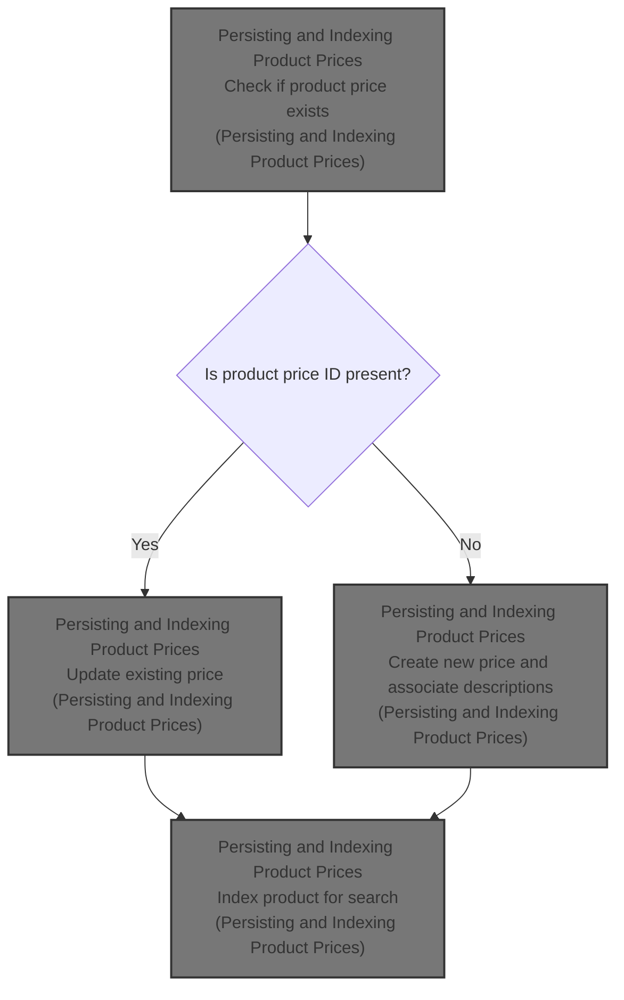

This document describes how product price information is saved or updated in the catalog. The system determines whether to update an existing price or create a new one, associates descriptions with the price, and indexes the product for search. This supports catalog management and product discoverability.



# Persisting and Indexing Product Prices

```mermaid
%%{init: {"flowchart": {"defaultRenderer": "elk"}} }%%
flowchart TD
    node1["Start save or update product price"] --> node2{"Is product price ID present and > 0?"}
    click node1 openCode "shopizer/sm-core/src/main/java/com/salesmanager/core/business/catalog/product/service/price/ProductPriceServiceImpl.java:34:35"
    node2 -->|"Yes"| node3["Update existing price"]
    click node2 openCode "shopizer/sm-core/src/main/java/com/salesmanager/core/business/catalog/product/service/price/ProductPriceServiceImpl.java:36:36"
    click node3 openCode "shopizer/sm-core/src/main/java/com/salesmanager/core/business/catalog/product/service/price/ProductPriceServiceImpl.java:37:38"
    node2 -->|"No"| node4["Create new price"]
    click node4 openCode "shopizer/sm-core/src/main/java/com/salesmanager/core/business/catalog/product/service/price/ProductPriceServiceImpl.java:41:42"
    
    subgraph loop1["For each description"]
        node4 --> node5["Associate description with price"]
        click node5 openCode "shopizer/sm-core/src/main/java/com/salesmanager/core/business/catalog/product/service/price/ProductPriceServiceImpl.java:44:44"
        node5 --> node6["Save description"]
        click node6 openCode "shopizer/sm-core/src/main/java/com/salesmanager/core/business/catalog/product/service/price/ProductPriceServiceImpl.java:45:45"
        node6 --> node7{"More descriptions?"}
        node7 -->|"Yes"| node5
        node7 -->|"No"| node8["Finish"]
        click node8 openCode "shopizer/sm-core/src/main/java/com/salesmanager/core/business/catalog/product/service/price/ProductPriceServiceImpl.java:47:52"
    end
    node3 --> node8

classDef HeadingStyle fill:#777777,stroke:#333,stroke-width:2px;

%% Swimm:
%% %%{init: {"flowchart": {"defaultRenderer": "elk"}} }%%
%% flowchart TD
%%     node1["Start save or update product price"] --> node2{"Is product price ID present and > 0?"}
%%     click node1 openCode "<SwmPath>[shopizer/…/price/ProductPriceServiceImpl.java](shopizer/sm-core/src/main/java/com/salesmanager/core/business/catalog/product/service/price/ProductPriceServiceImpl.java)</SwmPath>:34:35"
%%     node2 -->|"Yes"| node3["Update existing price"]
%%     click node2 openCode "<SwmPath>[shopizer/…/price/ProductPriceServiceImpl.java](shopizer/sm-core/src/main/java/com/salesmanager/core/business/catalog/product/service/price/ProductPriceServiceImpl.java)</SwmPath>:36:36"
%%     click node3 openCode "<SwmPath>[shopizer/…/price/ProductPriceServiceImpl.java](shopizer/sm-core/src/main/java/com/salesmanager/core/business/catalog/product/service/price/ProductPriceServiceImpl.java)</SwmPath>:37:38"
%%     node2 -->|"No"| node4["Create new price"]
%%     click node4 openCode "<SwmPath>[shopizer/…/price/ProductPriceServiceImpl.java](shopizer/sm-core/src/main/java/com/salesmanager/core/business/catalog/product/service/price/ProductPriceServiceImpl.java)</SwmPath>:41:42"
%%     
%%     subgraph loop1["For each description"]
%%         node4 --> node5["Associate description with price"]
%%         click node5 openCode "<SwmPath>[shopizer/…/price/ProductPriceServiceImpl.java](shopizer/sm-core/src/main/java/com/salesmanager/core/business/catalog/product/service/price/ProductPriceServiceImpl.java)</SwmPath>:44:44"
%%         node5 --> node6["Save description"]
%%         click node6 openCode "<SwmPath>[shopizer/…/price/ProductPriceServiceImpl.java](shopizer/sm-core/src/main/java/com/salesmanager/core/business/catalog/product/service/price/ProductPriceServiceImpl.java)</SwmPath>:45:45"
%%         node6 --> node7{"More descriptions?"}
%%         node7 -->|"Yes"| node5
%%         node7 -->|"No"| node8["Finish"]
%%         click node8 openCode "<SwmPath>[shopizer/…/price/ProductPriceServiceImpl.java](shopizer/sm-core/src/main/java/com/salesmanager/core/business/catalog/product/service/price/ProductPriceServiceImpl.java)</SwmPath>:47:52"
%%     end
%%     node3 --> node8
%% 
%% classDef HeadingStyle fill:#777777,stroke:#333,stroke-width:2px;
```



<SwmSnippet path="/shopizer/sm-core/src/main/java/com/salesmanager/core/business/catalog/product/service/price/ProductPriceServiceImpl.java" line="34">

---

SaveOrUpdate decides if we're updating or creating a <SwmToken path="shopizer/sm-core/src/main/java/com/salesmanager/core/business/catalog/product/service/price/ProductPriceServiceImpl.java" pos="34:7:7" line-data="	public void saveOrUpdate(ProductPrice price) throws ServiceException {">`ProductPrice`</SwmToken>. For new ones, it resets descriptions, creates the price, and re-links descriptions to the new price. Next, we move to product creation and indexing.

```java
	public void saveOrUpdate(ProductPrice price) throws ServiceException {
		
		if(price.getId()!=null && price.getId()>0) {
			this.update(price);
		} else {
			
			Set<ProductPriceDescription> descriptions = price.getDescriptions();
			price.setDescriptions(new HashSet<ProductPriceDescription>());
			this.create(price);
			for(ProductPriceDescription description : descriptions) {
				description.setProductPrice(price);
				this.addDescription(price, description);
			}
			
		}
		
		
		
	}
```

---

</SwmSnippet>

<SwmSnippet path="/shopizer/sm-core/src/main/java/com/salesmanager/core/business/catalog/product/service/ProductServiceImpl.java" line="233">

---

Create handles the actual product creation and immediately updates the search index so the product is discoverable. It assumes the product and its merchant store are valid and doesn't check for nulls, so if those are missing, things break.

```java
	public void create(Product product) throws ServiceException {
		super.create(product);
		searchService.index(product.getMerchantStore(), product);
	}
```

---

</SwmSnippet>

&nbsp;

*This is an auto-generated document by Swimm 🌊 and has not yet been verified by a human*

<SwmMeta version="3.0.0" repo-id="Z2l0aHViJTNBJTNBU2hvcGl6ZXIlM0ElM0F1bWFsaW5nYXN3YW1p" repo-name="Shopizer"><sup>Powered by [Swimm](https://app.swimm.io/)</sup></SwmMeta>
