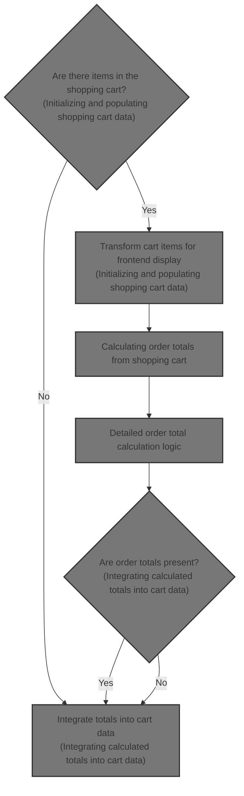
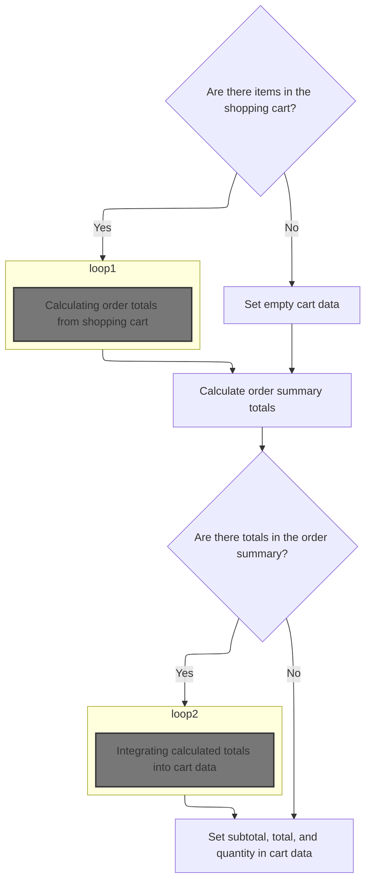
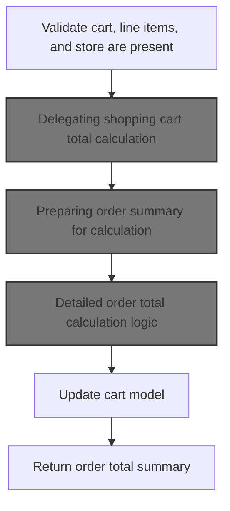
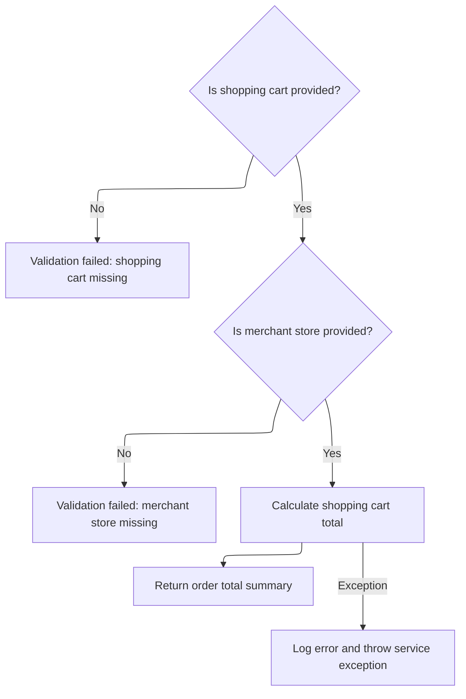
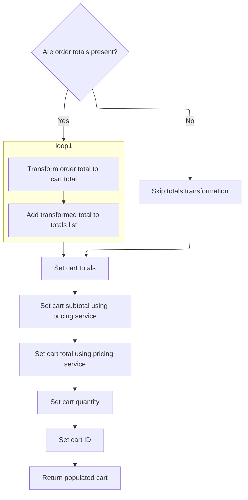

This document explains the flow of populating a shopping cart with detailed item information and calculating accurate order totals for display in an e-commerce frontend. It transforms internal cart items into detailed data objects, calculates subtotals, taxes, shipping, handling fees, and grand totals, and integrates these totals into the cart data to ensure completeness and accuracy.



# Initializing and populating shopping cart data



This section initializes and populates shopping cart data by transforming internal cart items into a web-friendly format and calculating order totals for display.

| Category       | Rule Name                        | Description                                                                                                                                                                               |
| -------------- | -------------------------------- | ----------------------------------------------------------------------------------------------------------------------------------------------------------------------------------------- |
| Business logic | Item transformation for frontend | If the shopping cart contains items, each item must be transformed into a detailed data object including product code, name, price, quantity, image, and attributes for frontend display. |
| Business logic | Empty cart handling              | If the shopping cart is empty, the cart data must be set to an empty state with no items and zero totals.                                                                                 |
| Business logic | Total quantity calculation       | The total quantity in the cart must be the sum of quantities of all individual items.                                                                                                     |
| Business logic | Order totals calculation         | Order totals such as subtotal, taxes, and grand total must be calculated from the shopping cart items and integrated into the cart data for display.                                      |
| Business logic | Fallback totals setting          | If no order totals are calculated, the cart data must still include subtotal, total, and quantity fields set appropriately to avoid missing information in the frontend.                  |

<SwmSnippet path="/shopizer/sm-shop/src/main/java/com/salesmanager/web/populator/shoppingCart/ShoppingCartDataPopulator.java" line="73">

---

Here we start by transforming the internal shopping cart model into a web-friendly data object. We copy product codes, names, prices, quantities, images, and attributes from each cart item to the DTO list. This sets up the detailed cart content for the frontend.

```java
    public ShoppingCartData populate(final ShoppingCart shoppingCart,
                                     final ShoppingCartData cart, final MerchantStore store, final Language language) {

    	int cartQuantity = 0;
        cart.setCode(shoppingCart.getShoppingCartCode());
        Set<com.salesmanager.core.business.shoppingcart.model.ShoppingCartItem> items = shoppingCart.getLineItems();
        List<ShoppingCartItem> shoppingCartItemsList=Collections.emptyList();
        try{
            if(items!=null) {
                shoppingCartItemsList=new ArrayList<ShoppingCartItem>();
                for(com.salesmanager.core.business.shoppingcart.model.ShoppingCartItem item : items) {

                    ShoppingCartItem shoppingCartItem = new ShoppingCartItem();
                    shoppingCartItem.setCode(cart.getCode());
                    shoppingCartItem.setProductCode(item.getProduct().getSku());
                    shoppingCartItem.setProductVirtual(item.isProductVirtual());

                    shoppingCartItem.setProductId(item.getProductId());
                    shoppingCartItem.setId(item.getId());
                    shoppingCartItem.setName(item.getProduct().getProductDescription().getName());

                    shoppingCartItem.setPrice(pricingService.getDisplayAmount(item.getItemPrice(),store));
                    shoppingCartItem.setQuantity(item.getQuantity());
                    
                    
                    cartQuantity = cartQuantity + item.getQuantity();
                    
                    shoppingCartItem.setProductPrice(item.getItemPrice());
                    shoppingCartItem.setSubTotal(pricingService.getDisplayAmount(item.getSubTotal(), store));
                    ProductImage image = item.getProduct().getProductImage();
                    if(image!=null) {
                        String imagePath = ImageFilePathUtils.buildProductImageFilePath(store, item.getProduct().getSku(), image.getProductImage());
                        shoppingCartItem.setImage(imagePath);
                    }
                    Set<com.salesmanager.core.business.shoppingcart.model.ShoppingCartAttributeItem> attributes = item.getAttributes();
                    if(attributes!=null) {
                        List<ShoppingCartAttribute> cartAttributes = new ArrayList<ShoppingCartAttribute>();
                        for(com.salesmanager.core.business.shoppingcart.model.ShoppingCartAttributeItem attribute : attributes) {
                            ShoppingCartAttribute cartAttribute = new ShoppingCartAttribute();
                            cartAttribute.setId(attribute.getId());
                            cartAttribute.setAttributeId(attribute.getProductAttributeId());
                            cartAttribute.setOptionId(attribute.getProductAttribute().getProductOption().getId());
                            cartAttribute.setOptionValueId(attribute.getProductAttribute().getProductOptionValue().getId());
                            List<ProductOptionDescription> optionDescriptions = attribute.getProductAttribute().getProductOption().getDescriptionsSettoList();
                            List<ProductOptionValueDescription> optionValueDescriptions = attribute.getProductAttribute().getProductOptionValue().getDescriptionsSettoList();
                            if(!CollectionUtils.isEmpty(optionDescriptions) && !CollectionUtils.isEmpty(optionValueDescriptions)) {
                            	cartAttribute.setOptionName(optionDescriptions.get(0).getName());
                            	cartAttribute.setOptionValue(optionValueDescriptions.get(0).getName());
                            	cartAttributes.add(cartAttribute);
                            }
                        }
                        shoppingCartItem.setShoppingCartAttributes(cartAttributes);
                    }
                    shoppingCartItemsList.add(shoppingCartItem);
                }
```

---

</SwmSnippet>

<SwmSnippet path="/shopizer/sm-shop/src/main/java/com/salesmanager/web/populator/shoppingCart/ShoppingCartDataPopulator.java" line="129">

---

Next we prepare an OrderSummary from the cart items and call the calculation service to get pricing totals. This adds the computed totals like subtotal, taxes, and grand total to the cart data.

```java
            if(CollectionUtils.isNotEmpty(shoppingCartItemsList)){
                cart.setShoppingCartItems(shoppingCartItemsList);
            }

            OrderSummary summary = new OrderSummary();
            List<com.salesmanager.core.business.shoppingcart.model.ShoppingCartItem> productsList = new ArrayList<com.salesmanager.core.business.shoppingcart.model.ShoppingCartItem>();
            productsList.addAll(shoppingCart.getLineItems());
            summary.setProducts(productsList);
            OrderTotalSummary orderSummary = shoppingCartCalculationService.calculate(shoppingCart,store, language );

```

---

</SwmSnippet>

## Calculating order totals from shopping cart



This section handles the calculation of order totals from the shopping cart, ensuring the cart and its contents are valid before delegating the calculation to a centralized order service.

| Category        | Rule Name                     | Description                                                                                                          |
| --------------- | ----------------------------- | -------------------------------------------------------------------------------------------------------------------- |
| Data validation | Cart presence validation      | The shopping cart must be present and not null to proceed with order total calculation.                              |
| Data validation | Line items validation         | The shopping cart must contain line items; an empty or null line item list is not allowed for total calculation.     |
| Data validation | Store presence validation     | The merchant store information must be present and valid to calculate order totals.                                  |
| Business logic  | Centralized total calculation | All order total calculations are delegated to a centralized order service to ensure consistency and maintainability. |
| Business logic  | Order total summary output    | The output of the calculation is an order total summary that aggregates all relevant totals for the shopping cart.   |

<SwmSnippet path="/shopizer/sm-core/src/main/java/com/salesmanager/core/business/shoppingcart/service/ShoppingCartCalculationServiceImpl.java" line="95">

---

In `calculate` we first validate inputs then delegate to orderService to compute all order totals. This keeps the calculation logic centralized.

```java
    public OrderTotalSummary calculate( final ShoppingCart cartModel , final MerchantStore store, final Language language ) throws ServiceException
    {

        Validate.notNull(cartModel,"cart cannot be null");
        Validate.notNull(cartModel.getLineItems(),"Cart should have line items.");
        Validate.notNull(store,"MerchantStore cannot be null");
        OrderTotalSummary orderTotalSummary=orderService.calculateShoppingCartTotal( cartModel, store, language );
```

---

</SwmSnippet>

### Delegating shopping cart total calculation



This section handles the delegation of shopping cart total calculation by validating inputs and invoking the calculation method, while managing exceptions.

| Category        | Rule Name                     | Description                                                                                                                        |
| --------------- | ----------------------------- | ---------------------------------------------------------------------------------------------------------------------------------- |
| Data validation | Shopping cart presence        | The shopping cart must be provided to proceed with the total calculation.                                                          |
| Data validation | Merchant store presence       | The merchant store must be provided to proceed with the total calculation.                                                         |
| Data validation | Input validation failure      | If either the shopping cart or merchant store is missing, the calculation process is halted and a validation failure is indicated. |
| Business logic  | Conditional total calculation | The shopping cart total is calculated only when both the shopping cart and merchant store are provided.                            |

<SwmSnippet path="/shopizer/sm-core/src/main/java/com/salesmanager/core/business/order/service/OrderServiceImpl.java" line="423">

---

Here we just validate inputs and call `caculateShoppingCart` to do the detailed work, catching exceptions to log and rethrow.

```java
    public OrderTotalSummary calculateShoppingCartTotal(
                                                        final ShoppingCart shoppingCart, final MerchantStore store, final Language language)
                                                                        throws ServiceException {
        Validate.notNull(shoppingCart,"Order summary cannot be null");
        Validate.notNull(store,"MerchantStore cannot be null");

        try {
            return caculateShoppingCart(shoppingCart, null, store, language);
        } catch (Exception e) {
            LOGGER.error( "Error while calculating shopping cart total" +e );
            throw new ServiceException(e);
        }
    }
```

---

</SwmSnippet>

### Preparing order summary for calculation

This section prepares an order summary from the shopping cart items and then calculates the full order total.

| Category       | Rule Name                 | Description                                                                                                                          |
| -------------- | ------------------------- | ------------------------------------------------------------------------------------------------------------------------------------ |
| Business logic | Include all cart items    | All items in the shopping cart must be included in the order summary for calculation.                                                |
| Business logic | Context-aware calculation | The order total calculation must consider the customer, store, and language context to apply relevant pricing, taxes, and discounts. |
| Business logic | Complete order summary    | The calculation process must produce a complete summary including all applicable charges, discounts, and taxes.                      |

<SwmSnippet path="/shopizer/sm-core/src/main/java/com/salesmanager/core/business/order/service/OrderServiceImpl.java" line="363">

---

Here we convert cart items into an OrderSummary and then call `caculateOrder` to do the full calculation.

```java
    private OrderTotalSummary caculateShoppingCart( final ShoppingCart shoppingCart, final Customer customer, final MerchantStore store, final Language language) throws Exception {

        
    	
    	
    	
    	OrderSummary orderSummary = new OrderSummary();
    	
    	List<ShoppingCartItem> itemsSet = new ArrayList<ShoppingCartItem>(shoppingCart.getLineItems());
    	orderSummary.setProducts(itemsSet);
    	
    	
    	return this.caculateOrder(orderSummary, customer, store, language);

    }
```

---

</SwmSnippet>

### Detailed order total calculation logic

```mermaid
%%{init: {"flowchart": {"defaultRenderer": "elk"}} }%%
flowchart TD
    node1["Start order calculation"] --> loop1start
    subgraph loop1["For each product in order"]
        loop1start --> node2["Calculate item subtotal (qty * price)"]
        node2 --> node3["Add additional non-default prices"]
        node3 --> loop1end
    end
    loop1end --> node4{"Is shipping free?"}
    node4 -->|"No"| node5["Add shipping cost"]
    node4 -->|"Yes"| node6["Apply free shipping"]
    node5 --> node7{"Are handling fees applicable?"}
    node6 --> node7
    node7 -->|"Yes"| node8["Add handling fees"]
    node7 -->|"No"| node9["Skip handling fees"]
    node8 --> loop2start
    node9 --> loop2start
    subgraph loop2["For each tax item"]
        loop2start --> node10["Add tax line to order totals"]
        node10 --> node11["Sum tax item prices"]
        node11 --> loop2end
    end
    loop2end --> node12["Calculate grand total (subtotal + shipping + handling + taxes)"]
    node12 --> node13["Return order summary"]

    click node1 openCode "shopizer/sm-core/src/main/java/com/salesmanager/core/business/order/service/OrderServiceImpl.java:166:167"
    click node2 openCode "shopizer/sm-core/src/main/java/com/salesmanager/core/business/order/service/OrderServiceImpl.java:184:188"
    click node3 openCode "shopizer/sm-core/src/main/java/com/salesmanager/core/business/order/service/OrderServiceImpl.java:189:221"
    click node4 openCode "shopizer/sm-core/src/main/java/com/salesmanager/core/business/order/service/OrderServiceImpl.java:247:266"
    click node5 openCode "shopizer/sm-core/src/main/java/com/salesmanager/core/business/order/service/OrderServiceImpl.java:261:262"
    click node6 openCode "shopizer/sm-core/src/main/java/com/salesmanager/core/business/order/service/OrderServiceImpl.java:264:265"
    click node7 openCode "shopizer/sm-core/src/main/java/com/salesmanager/core/business/order/service/OrderServiceImpl.java:269:283"
    click node8 openCode "shopizer/sm-core/src/main/java/com/salesmanager/core/business/order/service/OrderServiceImpl.java:272:281"
    click node9 openCode "shopizer/sm-core/src/main/java/com/salesmanager/core/business/order/service/OrderServiceImpl.java:284:284"
    click node10 openCode "shopizer/sm-core/src/main/java/com/salesmanager/core/business/order/service/OrderServiceImpl.java:292:304"
    click node11 openCode "shopizer/sm-core/src/main/java/com/salesmanager/core/business/order/service/OrderServiceImpl.java:303:307"
    click node12 openCode "shopizer/sm-core/src/main/java/com/salesmanager/core/business/order/service/OrderServiceImpl.java:314:322"
    click node13 openCode "shopizer/sm-core/src/main/java/com/salesmanager/core/business/order/service/OrderServiceImpl.java:326:327"
classDef HeadingStyle fill:#777777,stroke:#333,stroke-width:2px;
```



This section calculates the detailed order total for an e-commerce order, including item subtotals, additional prices, shipping, handling fees, taxes, and the grand total.

| Category       | Rule Name                       | Description                                                                                                                                                   |
| -------------- | ------------------------------- | ------------------------------------------------------------------------------------------------------------------------------------------------------------- |
| Business logic | Item subtotal calculation       | Calculate the subtotal for each product by multiplying the quantity by the item price and summing these values for all products.                              |
| Business logic | Additional one-time prices      | Add any additional non-default one-time prices associated with products to the subtotal.                                                                      |
| Business logic | Shipping cost application       | Add shipping cost to the order total unless free shipping is applicable, in which case shipping cost is zero.                                                 |
| Business logic | Handling fees inclusion         | Include handling fees in the order total only if handling fees are applicable and greater than zero according to shipping configuration and shipping summary. |
| Business logic | Tax calculation and addition    | Calculate taxes for the order and add each tax item as a separate line to the order totals, summing all tax amounts to the grand total.                       |
| Business logic | Grand total calculation         | Calculate the grand total as the sum of subtotal, shipping cost, handling fees, and taxes.                                                                    |
| Business logic | Order total summary composition | Return an order summary object containing subtotal, tax total, grand total, and detailed order total entries for each cost component.                         |

<SwmSnippet path="/shopizer/sm-core/src/main/java/com/salesmanager/core/business/order/service/OrderServiceImpl.java" line="166">

---

Here we calculate the subtotal by summing item prices times quantities and add any additional one-time prices to the subtotal.

```java
    private OrderTotalSummary caculateOrder(final OrderSummary summary, final Customer customer, final MerchantStore store, final Language language) throws Exception {

        OrderTotalSummary totalSummary = new OrderTotalSummary();
        List<OrderTotal> orderTotals = new ArrayList<OrderTotal>();
        Map<String,OrderTotal> otherPricesTotals = new HashMap<String,OrderTotal>();

        ShippingConfiguration shippingConfiguration = null;

        BigDecimal grandTotal = new BigDecimal(0);
        grandTotal.setScale(2, RoundingMode.HALF_UP);

        //price by item
        /**
         * qty * price
         * subtotal
         */
        BigDecimal subTotal = new BigDecimal(0);
        subTotal.setScale(2, RoundingMode.HALF_UP);
        for(ShoppingCartItem item : summary.getProducts()) {

            BigDecimal st = item.getItemPrice().multiply(new BigDecimal(item.getQuantity()));
            item.setSubTotal(st);
            subTotal = subTotal.add(st);
            //Other prices
            FinalPrice finalPrice = item.getFinalPrice();
            if(finalPrice!=null) {
                List<FinalPrice> otherPrices = finalPrice.getAdditionalPrices();
                if(otherPrices!=null) {
                    for(FinalPrice price : otherPrices) {
                        if(!price.isDefaultPrice()) {
                            OrderTotal itemSubTotal = otherPricesTotals.get(price.getProductPrice().getCode());

                            if(itemSubTotal==null) {
                                itemSubTotal = new OrderTotal();
                                itemSubTotal.setModule(Constants.OT_ITEM_PRICE_MODULE_CODE);
                                itemSubTotal.setText(Constants.OT_ITEM_PRICE_MODULE_CODE);
                                itemSubTotal.setTitle(Constants.OT_ITEM_PRICE_MODULE_CODE);
                                itemSubTotal.setOrderTotalCode(price.getProductPrice().getCode());
                                itemSubTotal.setOrderTotalType(OrderTotalType.PRODUCT);
                                itemSubTotal.setSortOrder(0);
                                otherPricesTotals.put(price.getProductPrice().getCode(), itemSubTotal);
                            }

                            BigDecimal orderTotalValue = itemSubTotal.getValue();
                            if(orderTotalValue==null) {
                                orderTotalValue = new BigDecimal(0);
                                orderTotalValue.setScale(2, RoundingMode.HALF_UP);
                            }

                            orderTotalValue = orderTotalValue.add(price.getFinalPrice());
                            itemSubTotal.setValue(orderTotalValue);
                            if(price.getProductPrice().getProductPriceType().name().equals(OrderValueType.ONE_TIME)) {
                                subTotal = subTotal.add(price.getFinalPrice());
                            }
                        }
                    }
                }
            }

        }
```

---

</SwmSnippet>

<SwmSnippet path="/shopizer/sm-core/src/main/java/com/salesmanager/core/business/order/service/OrderServiceImpl.java" line="228">

---

This snippet adds shipping and handling fees to the total if applicable, calculates taxes via taxService, and creates OrderTotal objects for each cost component.

```java
        totalSummary.setSubTotal(subTotal);
        grandTotal=grandTotal.add(subTotal);

        OrderTotal orderTotalSubTotal = new OrderTotal();
        orderTotalSubTotal.setModule(Constants.OT_SUBTOTAL_MODULE_CODE);
        orderTotalSubTotal.setOrderTotalType(OrderTotalType.SUBTOTAL);
        orderTotalSubTotal.setOrderTotalCode("order.total.subtotal");
        orderTotalSubTotal.setTitle(Constants.OT_SUBTOTAL_MODULE_CODE);
        orderTotalSubTotal.setText("order.total.subtotal");
        orderTotalSubTotal.setSortOrder(5);
        orderTotalSubTotal.setValue(subTotal);

        //TODO autowire a list of post processing modules for price calculation - drools, custom modules
        //may affect the sub total

        orderTotals.add(orderTotalSubTotal);


        //shipping
        if(summary.getShippingSummary()!=null) {


	            OrderTotal shippingSubTotal = new OrderTotal();
	            shippingSubTotal.setModule(Constants.OT_SHIPPING_MODULE_CODE);
	            shippingSubTotal.setOrderTotalType(OrderTotalType.SHIPPING);
	            shippingSubTotal.setOrderTotalCode("order.total.shipping");
	            shippingSubTotal.setTitle(Constants.OT_SHIPPING_MODULE_CODE);
	            shippingSubTotal.setText("order.total.shipping");
	            shippingSubTotal.setSortOrder(10);
	
	            orderTotals.add(shippingSubTotal);

            if(!summary.getShippingSummary().isFreeShipping()) {
                shippingSubTotal.setValue(summary.getShippingSummary().getShipping());
                grandTotal=grandTotal.add(summary.getShippingSummary().getShipping());
            } else {
                shippingSubTotal.setValue(new BigDecimal(0));
                grandTotal=grandTotal.add(new BigDecimal(0));
            }

            //check handling fees
            shippingConfiguration = shippingService.getShippingConfiguration(store);
            if(summary.getShippingSummary().getHandling()!=null && summary.getShippingSummary().getHandling().doubleValue()>0) {
                if(shippingConfiguration.getHandlingFees()!=null && shippingConfiguration.getHandlingFees().doubleValue()>0) {
                    OrderTotal handlingubTotal = new OrderTotal();
                    handlingubTotal.setModule(Constants.OT_HANDLING_MODULE_CODE);
                    handlingubTotal.setOrderTotalType(OrderTotalType.HANDLING);
                    handlingubTotal.setOrderTotalCode("order.total.handling");
                    handlingubTotal.setTitle(Constants.OT_HANDLING_MODULE_CODE);
                    handlingubTotal.setText("order.total.handling");
                    handlingubTotal.setSortOrder(12);
                    handlingubTotal.setValue(summary.getShippingSummary().getHandling());
                    orderTotals.add(handlingubTotal);
                    grandTotal=grandTotal.add(summary.getShippingSummary().getHandling());
                }
            }
        }

        //tax
        List<TaxItem> taxes = taxService.calculateTax(summary, customer, store, language);
        if(taxes!=null && taxes.size()>0) {
        	BigDecimal totalTaxes = new BigDecimal(0);
        	totalTaxes.setScale(2, RoundingMode.HALF_UP);
            int taxCount = 20;
            for(TaxItem tax : taxes) {

                OrderTotal taxLine = new OrderTotal();
                taxLine.setModule(Constants.OT_TAX_MODULE_CODE);
                taxLine.setOrderTotalType(OrderTotalType.TAX);
                taxLine.setOrderTotalCode(tax.getLabel());
                taxLine.setSortOrder(taxCount);
                taxLine.setTitle(Constants.OT_TAX_MODULE_CODE);
                taxLine.setText(tax.getLabel());
                taxLine.setValue(tax.getItemPrice());

                totalTaxes = totalTaxes.add(tax.getItemPrice());
                orderTotals.add(taxLine);
                //grandTotal=grandTotal.add(tax.getItemPrice());

                taxCount ++;

            }
```

---

</SwmSnippet>

<SwmSnippet path="/shopizer/sm-core/src/main/java/com/salesmanager/core/business/order/service/OrderServiceImpl.java" line="310">

---

Finally we set subtotal, tax total, grand total, and all OrderTotal entries in the summary and return it.

```java
            grandTotal = grandTotal.add(totalTaxes);
            totalSummary.setTaxTotal(totalTaxes);
        }

        // grand total
        OrderTotal orderTotal = new OrderTotal();
        orderTotal.setModule(Constants.OT_TOTAL_MODULE_CODE);
        orderTotal.setOrderTotalType(OrderTotalType.TOTAL);
        orderTotal.setOrderTotalCode("order.total.total");
        orderTotal.setTitle(Constants.OT_TOTAL_MODULE_CODE);
        orderTotal.setText("order.total.total");
        orderTotal.setSortOrder(300);
        orderTotal.setValue(grandTotal);
        orderTotals.add(orderTotal);

        totalSummary.setTotal(grandTotal);
        totalSummary.setTotals(orderTotals);
        return totalSummary;

    }
```

---

</SwmSnippet>

### Finalizing shopping cart calculation

<SwmSnippet path="/shopizer/sm-core/src/main/java/com/salesmanager/core/business/shoppingcart/service/ShoppingCartCalculationServiceImpl.java" line="102">

---

After getting the totals from orderService, we update the cart model accordingly and return the summary.

```java
        updateCartModel(cartModel);
        return orderTotalSummary;


    }
```

---

</SwmSnippet>

## Integrating calculated totals into cart data



<SwmSnippet path="/shopizer/sm-shop/src/main/java/com/salesmanager/web/populator/shoppingCart/ShoppingCartDataPopulator.java" line="139">

---

After calculation returns, we map the core totals to the web DTO and set subtotal, total, and quantity in the cart data.

```java
            if(CollectionUtils.isNotEmpty(orderSummary.getTotals())) {
            	List<OrderTotal> totals = new ArrayList<OrderTotal>();
            	for(com.salesmanager.core.business.order.model.OrderTotal t : orderSummary.getTotals()) {
            		OrderTotal total = new OrderTotal();
            		total.setCode(t.getOrderTotalCode());
            		total.setValue(t.getValue());
            		totals.add(total);
            	}
```

---

</SwmSnippet>

<SwmSnippet path="/shopizer/sm-shop/src/main/java/com/salesmanager/web/populator/shoppingCart/ShoppingCartDataPopulator.java" line="147">

---

Finally we return the fully populated ShoppingCartData with all items and calculated totals ready for frontend use.

```java
            	cart.setTotals(totals);
            }
            
            cart.setSubTotal(pricingService.getDisplayAmount(orderSummary.getSubTotal(), store));
            cart.setTotal(pricingService.getDisplayAmount(orderSummary.getTotal(), store));
            cart.setQuantity(cartQuantity);
            cart.setId(shoppingCart.getId());
        }
        catch(ServiceException ex){
            LOG.error( "Error while converting cart Model to cart Data.."+ex );
            throw new ConversionException( "Unable to create cart data", ex );
        }
        return cart;


    };
```

---

</SwmSnippet>

&nbsp;

*This is an auto-generated document by Swimm 🌊 and has not yet been verified by a human*

<SwmMeta version="3.0.0" repo-id="Z2l0aHViJTNBJTNBU2hvcGl6ZXIlM0ElM0F1bWFsaW5nYXN3YW1p" repo-name="Shopizer"><sup>Powered by [Swimm](https://app.swimm.io/)</sup></SwmMeta>
