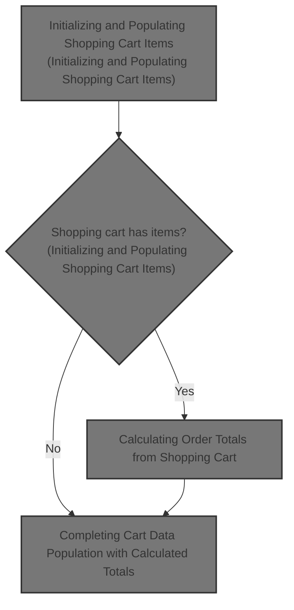
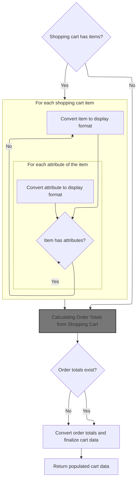
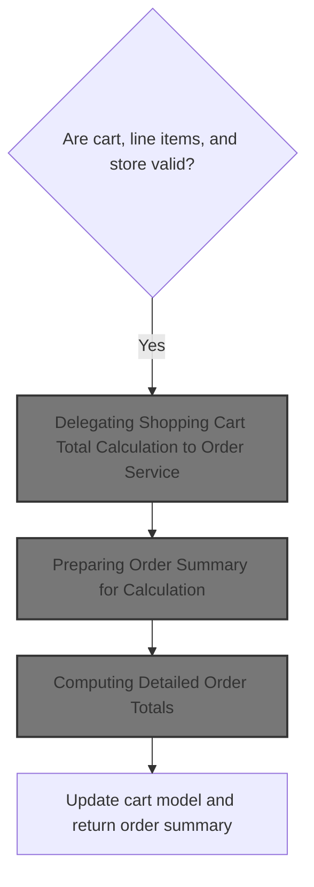

This document describes the flow of populating shopping cart data by converting raw cart items into detailed objects with product information and attributes, then calculating order totals to provide accurate pricing and totals. This ensures the shopping cart data is complete and ready for user interaction and checkout.



# Initializing and Populating Shopping Cart Items



This section initializes and populates shopping cart items by converting raw cart data into detailed objects with product information and attributes for frontend use, and then calculates order totals to enrich the cart data with financial details.

| Category        | Rule Name                 | Description                                                                                                                                        |
| --------------- | ------------------------- | -------------------------------------------------------------------------------------------------------------------------------------------------- |
| Data validation | Cart item presence        | If the shopping cart contains no items, the cart data returned should reflect an empty or zero state with no items listed.                         |
| Business logic  | Item detail completeness  | Each shopping cart item must include product code, name, quantity, price, subtotal, and image if available to provide a complete view to the user. |
| Business logic  | Attribute inclusion       | If a cart item has attributes, these must be included with option names and values to accurately represent product variations.                     |
| Business logic  | Order totals calculation  | Order totals must be calculated from the shopping cart items and included in the cart data to provide accurate pricing information.                |
| Business logic  | Cart quantity aggregation | The total quantity of items in the cart must be aggregated and reflected in the cart data to summarize the cart contents.                          |

<SwmSnippet path="/shopizer/sm-shop/src/main/java/com/salesmanager/web/populator/shoppingCart/ShoppingCartDataPopulator.java" line="73">

---

We convert raw cart items into detailed objects with product info and attributes for frontend use.

```java
    public ShoppingCartData populate(final ShoppingCart shoppingCart,
                                     final ShoppingCartData cart, final MerchantStore store, final Language language) {

    	int cartQuantity = 0;
        cart.setCode(shoppingCart.getShoppingCartCode());
        Set<com.salesmanager.core.business.shoppingcart.model.ShoppingCartItem> items = shoppingCart.getLineItems();
        List<ShoppingCartItem> shoppingCartItemsList=Collections.emptyList();
        try{
            if(items!=null) {
                shoppingCartItemsList=new ArrayList<ShoppingCartItem>();
                for(com.salesmanager.core.business.shoppingcart.model.ShoppingCartItem item : items) {

                    ShoppingCartItem shoppingCartItem = new ShoppingCartItem();
                    shoppingCartItem.setCode(cart.getCode());
                    shoppingCartItem.setProductCode(item.getProduct().getSku());
                    shoppingCartItem.setProductVirtual(item.isProductVirtual());

                    shoppingCartItem.setProductId(item.getProductId());
                    shoppingCartItem.setId(item.getId());
                    shoppingCartItem.setName(item.getProduct().getProductDescription().getName());

                    shoppingCartItem.setPrice(pricingService.getDisplayAmount(item.getItemPrice(),store));
                    shoppingCartItem.setQuantity(item.getQuantity());
                    
                    
                    cartQuantity = cartQuantity + item.getQuantity();
                    
                    shoppingCartItem.setProductPrice(item.getItemPrice());
                    shoppingCartItem.setSubTotal(pricingService.getDisplayAmount(item.getSubTotal(), store));
                    ProductImage image = item.getProduct().getProductImage();
                    if(image!=null) {
                        String imagePath = ImageFilePathUtils.buildProductImageFilePath(store, item.getProduct().getSku(), image.getProductImage());
                        shoppingCartItem.setImage(imagePath);
                    }
                    Set<com.salesmanager.core.business.shoppingcart.model.ShoppingCartAttributeItem> attributes = item.getAttributes();
                    if(attributes!=null) {
                        List<ShoppingCartAttribute> cartAttributes = new ArrayList<ShoppingCartAttribute>();
                        for(com.salesmanager.core.business.shoppingcart.model.ShoppingCartAttributeItem attribute : attributes) {
                            ShoppingCartAttribute cartAttribute = new ShoppingCartAttribute();
                            cartAttribute.setId(attribute.getId());
                            cartAttribute.setAttributeId(attribute.getProductAttributeId());
                            cartAttribute.setOptionId(attribute.getProductAttribute().getProductOption().getId());
                            cartAttribute.setOptionValueId(attribute.getProductAttribute().getProductOptionValue().getId());
                            List<ProductOptionDescription> optionDescriptions = attribute.getProductAttribute().getProductOption().getDescriptionsSettoList();
                            List<ProductOptionValueDescription> optionValueDescriptions = attribute.getProductAttribute().getProductOptionValue().getDescriptionsSettoList();
                            if(!CollectionUtils.isEmpty(optionDescriptions) && !CollectionUtils.isEmpty(optionValueDescriptions)) {
                            	cartAttribute.setOptionName(optionDescriptions.get(0).getName());
                            	cartAttribute.setOptionValue(optionValueDescriptions.get(0).getName());
                            	cartAttributes.add(cartAttribute);
                            }
                        }
                        shoppingCartItem.setShoppingCartAttributes(cartAttributes);
                    }
                    shoppingCartItemsList.add(shoppingCartItem);
                }
```

---

</SwmSnippet>

<SwmSnippet path="/shopizer/sm-shop/src/main/java/com/salesmanager/web/populator/shoppingCart/ShoppingCartDataPopulator.java" line="129">

---

Next we prepare an OrderSummary from the cart items and call the calculation service to get detailed pricing and totals. This enriches the cart data with computed financial info.

```java
            if(CollectionUtils.isNotEmpty(shoppingCartItemsList)){
                cart.setShoppingCartItems(shoppingCartItemsList);
            }

            OrderSummary summary = new OrderSummary();
            List<com.salesmanager.core.business.shoppingcart.model.ShoppingCartItem> productsList = new ArrayList<com.salesmanager.core.business.shoppingcart.model.ShoppingCartItem>();
            productsList.addAll(shoppingCart.getLineItems());
            summary.setProducts(productsList);
            OrderTotalSummary orderSummary = shoppingCartCalculationService.calculate(shoppingCart,store, language );

```

---

</SwmSnippet>

## Calculating Order Totals from Shopping Cart



This section handles the calculation of order totals from the shopping cart by validating inputs and delegating the calculation to the order service.

| Category        | Rule Name                          | Description                                                                                                                                               |
| --------------- | ---------------------------------- | --------------------------------------------------------------------------------------------------------------------------------------------------------- |
| Data validation | Input Validation                   | The shopping cart, its line items, and the merchant store must be valid and not null before any calculation is performed.                                 |
| Business logic  | Centralized Calculation Delegation | All order total calculations are delegated to a centralized order service to ensure consistency and reusability of calculation logic across the platform. |
| Business logic  | Comprehensive Order Summary        | The order total summary returned must include detailed totals and fees computed for the shopping cart, reflecting all applicable charges.                 |

<SwmSnippet path="/shopizer/sm-core/src/main/java/com/salesmanager/core/business/shoppingcart/service/ShoppingCartCalculationServiceImpl.java" line="95">

---

In `calculate` we first validate inputs then delegate to the order service to compute all totals and fees for the cart. This keeps calculation logic modular and reusable.

```java
    public OrderTotalSummary calculate( final ShoppingCart cartModel , final MerchantStore store, final Language language ) throws ServiceException
    {

        Validate.notNull(cartModel,"cart cannot be null");
        Validate.notNull(cartModel.getLineItems(),"Cart should have line items.");
        Validate.notNull(store,"MerchantStore cannot be null");
        OrderTotalSummary orderTotalSummary=orderService.calculateShoppingCartTotal( cartModel, store, language );
```

---

</SwmSnippet>

### Delegating Shopping Cart Total Calculation to Order Service

This section describes the process of delegating the calculation of the shopping cart total to the Order Service in Shopizer.

<SwmSnippet path="/shopizer/sm-core/src/main/java/com/salesmanager/core/business/order/service/OrderServiceImpl.java" line="423">

---

`calculateShoppingCartTotal` validates inputs then calls `caculateShoppingCart` inside a try-catch to handle errors gracefully.

```java
    public OrderTotalSummary calculateShoppingCartTotal(
                                                        final ShoppingCart shoppingCart, final MerchantStore store, final Language language)
                                                                        throws ServiceException {
        Validate.notNull(shoppingCart,"Order summary cannot be null");
        Validate.notNull(store,"MerchantStore cannot be null");

        try {
            return caculateShoppingCart(shoppingCart, null, store, language);
        } catch (Exception e) {
            LOGGER.error( "Error while calculating shopping cart total" +e );
            throw new ServiceException(e);
        }
    }
```

---

</SwmSnippet>

### Preparing Order Summary for Calculation

This section prepares an order summary from the shopping cart items and then calculates the detailed totals for the order.

| Category       | Rule Name                    | Description                                                                                                                                   |
| -------------- | ---------------------------- | --------------------------------------------------------------------------------------------------------------------------------------------- |
| Business logic | Complete cart inclusion      | The order summary must include all items present in the shopping cart at the time of calculation.                                             |
| Business logic | Contextual pricing and taxes | The order total calculation must consider the customer, merchant store, and language context to apply relevant pricing, taxes, and discounts. |
| Business logic | Pre-checkout calculation     | The order summary preparation and calculation must be completed before proceeding to checkout or payment processing.                          |

<SwmSnippet path="/shopizer/sm-core/src/main/java/com/salesmanager/core/business/order/service/OrderServiceImpl.java" line="363">

---

`caculateShoppingCart` builds an order summary from cart items then calls `caculateOrder` to perform the detailed total calculations.

```java
    private OrderTotalSummary caculateShoppingCart( final ShoppingCart shoppingCart, final Customer customer, final MerchantStore store, final Language language) throws Exception {

        
    	
    	
    	
    	OrderSummary orderSummary = new OrderSummary();
    	
    	List<ShoppingCartItem> itemsSet = new ArrayList<ShoppingCartItem>(shoppingCart.getLineItems());
    	orderSummary.setProducts(itemsSet);
    	
    	
    	return this.caculateOrder(orderSummary, customer, store, language);

    }
```

---

</SwmSnippet>

### Computing Detailed Order Totals

```mermaid
%%{init: {"flowchart": {"defaultRenderer": "elk"}} }%%
flowchart TD
    node1["Start order calculation"] --> subgraph loop1["For each product in order"]
        node2["Calculate item subtotal and additional prices"]
        node2 --> node3["Add to subtotal"]
        node3 --> loop1
    end
    loop1 --> node4["Add subtotal to grand total"]
    node4 --> node5{"Is shipping free?"}
    node5 -->|"No"| node6["Add shipping cost to grand total"]
    node5 -->|"Yes"| node7["Add zero shipping cost"]
    node6 --> node8{"Are handling fees applicable?"}
    node7 --> node8
    node8 -->|"Yes"| node9["Add handling fees to grand total"]
    node8 -->|"No"| node10["Skip handling fees"]
    node9 --> node11["Calculate taxes"]
    node10 --> node11
    node11 --> subgraph loop2["For each tax item"]
        node12["Add tax to total taxes"]
        node12 --> node13["Add tax line to order totals"]
        node13 --> loop2
    end
    loop2 --> node14["Add total taxes to grand total"]
    node14 --> node15["Set totals and return order summary"]

    click node1 openCode "shopizer/sm-core/src/main/java/com/salesmanager/core/business/order/service/OrderServiceImpl.java:166:170"
    click node2 openCode "shopizer/sm-core/src/main/java/com/salesmanager/core/business/order/service/OrderServiceImpl.java:184:221"
    click node3 openCode "shopizer/sm-core/src/main/java/com/salesmanager/core/business/order/service/OrderServiceImpl.java:182:188"
    click node4 openCode "shopizer/sm-core/src/main/java/com/salesmanager/core/business/order/service/OrderServiceImpl.java:228:230"
    click node5 openCode "shopizer/sm-core/src/main/java/com/salesmanager/core/business/order/service/OrderServiceImpl.java:247:266"
    click node6 openCode "shopizer/sm-core/src/main/java/com/salesmanager/core/business/order/service/OrderServiceImpl.java:261:262"
    click node7 openCode "shopizer/sm-core/src/main/java/com/salesmanager/core/business/order/service/OrderServiceImpl.java:264:265"
    click node8 openCode "shopizer/sm-core/src/main/java/com/salesmanager/core/business/order/service/OrderServiceImpl.java:269:283"
    click node9 openCode "shopizer/sm-core/src/main/java/com/salesmanager/core/business/order/service/OrderServiceImpl.java:279:281"
    click node10 openCode "shopizer/sm-core/src/main/java/com/salesmanager/core/business/order/service/OrderServiceImpl.java:282:283"
    click node11 openCode "shopizer/sm-core/src/main/java/com/salesmanager/core/business/order/service/OrderServiceImpl.java:287:312"
    click node12 openCode "shopizer/sm-core/src/main/java/com/salesmanager/core/business/order/service/OrderServiceImpl.java:292:304"
    click node13 openCode "shopizer/sm-core/src/main/java/com/salesmanager/core/business/order/service/OrderServiceImpl.java:294:304"
    click node14 openCode "shopizer/sm-core/src/main/java/com/salesmanager/core/business/order/service/OrderServiceImpl.java:310:311"
    click node15 openCode "shopizer/sm-core/src/main/java/com/salesmanager/core/business/order/service/OrderServiceImpl.java:325:327"
classDef HeadingStyle fill:#777777,stroke:#333,stroke-width:2px;
```

This section computes detailed order totals by calculating subtotals for each product, adding shipping and handling fees, calculating taxes, and summing all components into a grand total.

| Category       | Rule Name                    | Description                                                                                                                                                       |
| -------------- | ---------------------------- | ----------------------------------------------------------------------------------------------------------------------------------------------------------------- |
| Business logic | Item subtotal calculation    | Calculate the subtotal for each product by multiplying the item price by the quantity and adding any applicable additional prices that are one-time charges.      |
| Business logic | Subtotal aggregation         | Sum all product subtotals and applicable additional prices to form the order subtotal before adding shipping, handling, and taxes.                                |
| Business logic | Shipping cost inclusion      | Add shipping cost to the grand total only if shipping is not free; otherwise, add zero shipping cost.                                                             |
| Business logic | Handling fees application    | Include handling fees in the grand total only if handling fees are applicable and greater than zero according to the shipping configuration and shipping summary. |
| Business logic | Tax calculation and addition | Calculate taxes for the order and add each tax item to the order totals and sum total taxes to the grand total.                                                   |
| Business logic | Grand total computation      | Sum all components including subtotal, shipping, handling fees, and taxes to compute the grand total for the order.                                               |
| Business logic | Order total labeling         | Label each component of the order total (subtotal, shipping, handling, taxes, grand total) with standardized codes and titles for clear identification.           |

<SwmSnippet path="/shopizer/sm-core/src/main/java/com/salesmanager/core/business/order/service/OrderServiceImpl.java" line="166">

---

In `caculateOrder` we use constants to label order total components and calculate subtotals by multiplying item prices and quantities, including additional prices.

```java
    private OrderTotalSummary caculateOrder(final OrderSummary summary, final Customer customer, final MerchantStore store, final Language language) throws Exception {

        OrderTotalSummary totalSummary = new OrderTotalSummary();
        List<OrderTotal> orderTotals = new ArrayList<OrderTotal>();
        Map<String,OrderTotal> otherPricesTotals = new HashMap<String,OrderTotal>();

        ShippingConfiguration shippingConfiguration = null;

        BigDecimal grandTotal = new BigDecimal(0);
        grandTotal.setScale(2, RoundingMode.HALF_UP);

        //price by item
        /**
         * qty * price
         * subtotal
         */
        BigDecimal subTotal = new BigDecimal(0);
        subTotal.setScale(2, RoundingMode.HALF_UP);
        for(ShoppingCartItem item : summary.getProducts()) {

            BigDecimal st = item.getItemPrice().multiply(new BigDecimal(item.getQuantity()));
            item.setSubTotal(st);
            subTotal = subTotal.add(st);
            //Other prices
            FinalPrice finalPrice = item.getFinalPrice();
            if(finalPrice!=null) {
                List<FinalPrice> otherPrices = finalPrice.getAdditionalPrices();
                if(otherPrices!=null) {
                    for(FinalPrice price : otherPrices) {
                        if(!price.isDefaultPrice()) {
                            OrderTotal itemSubTotal = otherPricesTotals.get(price.getProductPrice().getCode());

                            if(itemSubTotal==null) {
                                itemSubTotal = new OrderTotal();
                                itemSubTotal.setModule(Constants.OT_ITEM_PRICE_MODULE_CODE);
                                itemSubTotal.setText(Constants.OT_ITEM_PRICE_MODULE_CODE);
                                itemSubTotal.setTitle(Constants.OT_ITEM_PRICE_MODULE_CODE);
                                itemSubTotal.setOrderTotalCode(price.getProductPrice().getCode());
                                itemSubTotal.setOrderTotalType(OrderTotalType.PRODUCT);
                                itemSubTotal.setSortOrder(0);
                                otherPricesTotals.put(price.getProductPrice().getCode(), itemSubTotal);
                            }

                            BigDecimal orderTotalValue = itemSubTotal.getValue();
                            if(orderTotalValue==null) {
                                orderTotalValue = new BigDecimal(0);
                                orderTotalValue.setScale(2, RoundingMode.HALF_UP);
                            }

                            orderTotalValue = orderTotalValue.add(price.getFinalPrice());
                            itemSubTotal.setValue(orderTotalValue);
                            if(price.getProductPrice().getProductPriceType().name().equals(OrderValueType.ONE_TIME)) {
                                subTotal = subTotal.add(price.getFinalPrice());
                            }
                        }
                    }
                }
            }

        }
```

---

</SwmSnippet>

<SwmSnippet path="/shopizer/sm-core/src/main/java/com/salesmanager/core/business/order/service/OrderServiceImpl.java" line="228">

---

After calculating item subtotals, we add shipping and handling fees using shippingService, then calculate taxes with taxService and add them to the totals.

```java
        totalSummary.setSubTotal(subTotal);
        grandTotal=grandTotal.add(subTotal);

        OrderTotal orderTotalSubTotal = new OrderTotal();
        orderTotalSubTotal.setModule(Constants.OT_SUBTOTAL_MODULE_CODE);
        orderTotalSubTotal.setOrderTotalType(OrderTotalType.SUBTOTAL);
        orderTotalSubTotal.setOrderTotalCode("order.total.subtotal");
        orderTotalSubTotal.setTitle(Constants.OT_SUBTOTAL_MODULE_CODE);
        orderTotalSubTotal.setText("order.total.subtotal");
        orderTotalSubTotal.setSortOrder(5);
        orderTotalSubTotal.setValue(subTotal);

        //TODO autowire a list of post processing modules for price calculation - drools, custom modules
        //may affect the sub total

        orderTotals.add(orderTotalSubTotal);


        //shipping
        if(summary.getShippingSummary()!=null) {


	            OrderTotal shippingSubTotal = new OrderTotal();
	            shippingSubTotal.setModule(Constants.OT_SHIPPING_MODULE_CODE);
	            shippingSubTotal.setOrderTotalType(OrderTotalType.SHIPPING);
	            shippingSubTotal.setOrderTotalCode("order.total.shipping");
	            shippingSubTotal.setTitle(Constants.OT_SHIPPING_MODULE_CODE);
	            shippingSubTotal.setText("order.total.shipping");
	            shippingSubTotal.setSortOrder(10);
	
	            orderTotals.add(shippingSubTotal);

            if(!summary.getShippingSummary().isFreeShipping()) {
                shippingSubTotal.setValue(summary.getShippingSummary().getShipping());
                grandTotal=grandTotal.add(summary.getShippingSummary().getShipping());
            } else {
                shippingSubTotal.setValue(new BigDecimal(0));
                grandTotal=grandTotal.add(new BigDecimal(0));
            }

            //check handling fees
            shippingConfiguration = shippingService.getShippingConfiguration(store);
            if(summary.getShippingSummary().getHandling()!=null && summary.getShippingSummary().getHandling().doubleValue()>0) {
                if(shippingConfiguration.getHandlingFees()!=null && shippingConfiguration.getHandlingFees().doubleValue()>0) {
                    OrderTotal handlingubTotal = new OrderTotal();
                    handlingubTotal.setModule(Constants.OT_HANDLING_MODULE_CODE);
                    handlingubTotal.setOrderTotalType(OrderTotalType.HANDLING);
                    handlingubTotal.setOrderTotalCode("order.total.handling");
                    handlingubTotal.setTitle(Constants.OT_HANDLING_MODULE_CODE);
                    handlingubTotal.setText("order.total.handling");
                    handlingubTotal.setSortOrder(12);
                    handlingubTotal.setValue(summary.getShippingSummary().getHandling());
                    orderTotals.add(handlingubTotal);
                    grandTotal=grandTotal.add(summary.getShippingSummary().getHandling());
                }
            }
        }

        //tax
        List<TaxItem> taxes = taxService.calculateTax(summary, customer, store, language);
        if(taxes!=null && taxes.size()>0) {
        	BigDecimal totalTaxes = new BigDecimal(0);
        	totalTaxes.setScale(2, RoundingMode.HALF_UP);
            int taxCount = 20;
            for(TaxItem tax : taxes) {

                OrderTotal taxLine = new OrderTotal();
                taxLine.setModule(Constants.OT_TAX_MODULE_CODE);
                taxLine.setOrderTotalType(OrderTotalType.TAX);
                taxLine.setOrderTotalCode(tax.getLabel());
                taxLine.setSortOrder(taxCount);
                taxLine.setTitle(Constants.OT_TAX_MODULE_CODE);
                taxLine.setText(tax.getLabel());
                taxLine.setValue(tax.getItemPrice());

                totalTaxes = totalTaxes.add(tax.getItemPrice());
                orderTotals.add(taxLine);
                //grandTotal=grandTotal.add(tax.getItemPrice());

                taxCount ++;

            }
```

---

</SwmSnippet>

<SwmSnippet path="/shopizer/sm-core/src/main/java/com/salesmanager/core/business/order/service/OrderServiceImpl.java" line="310">

---

Finally we sum all totals into a grand total, create labeled OrderTotal objects for each component, add them to the summary, and return the complete OrderTotalSummary.

```java
            grandTotal = grandTotal.add(totalTaxes);
            totalSummary.setTaxTotal(totalTaxes);
        }

        // grand total
        OrderTotal orderTotal = new OrderTotal();
        orderTotal.setModule(Constants.OT_TOTAL_MODULE_CODE);
        orderTotal.setOrderTotalType(OrderTotalType.TOTAL);
        orderTotal.setOrderTotalCode("order.total.total");
        orderTotal.setTitle(Constants.OT_TOTAL_MODULE_CODE);
        orderTotal.setText("order.total.total");
        orderTotal.setSortOrder(300);
        orderTotal.setValue(grandTotal);
        orderTotals.add(orderTotal);

        totalSummary.setTotal(grandTotal);
        totalSummary.setTotals(orderTotals);
        return totalSummary;

    }
```

---

</SwmSnippet>

### Finalizing Cart Calculation After Order Totals

<SwmSnippet path="/shopizer/sm-core/src/main/java/com/salesmanager/core/business/shoppingcart/service/ShoppingCartCalculationServiceImpl.java" line="102">

---

After getting the order totals from the order service, `calculate` calls `updateCartModel` to sync the cart model with the new totals before returning.

```java
        updateCartModel(cartModel);
        return orderTotalSummary;


    }
```

---

</SwmSnippet>

## Completing Cart Data Population with Calculated Totals

```mermaid
%%{init: {"flowchart": {"defaultRenderer": "elk"}} }%%
flowchart TD
    node1{"Are order totals present?"}
    click node1 openCode "shopizer/sm-shop/src/main/java/com/salesmanager/web/populator/shoppingCart/ShoppingCartDataPopulator.java:139:140"
    node1 -->|"Yes"| subgraph loop1["For each order total in order summary"]
        node2["Transform and add order total to cart totals"]
        click node2 openCode "shopizer/sm-shop/src/main/java/com/salesmanager/web/populator/shoppingCart/ShoppingCartDataPopulator.java:141:146"
    end
    node1 -->|"No"| node8["Return populated cart data"]
    click node8 openCode "shopizer/sm-shop/src/main/java/com/salesmanager/web/populator/shoppingCart/ShoppingCartDataPopulator.java:147:160"
    loop1 --> node3["Set cart totals"]
    click node3 openCode "shopizer/sm-shop/src/main/java/com/salesmanager/web/populator/shoppingCart/ShoppingCartDataPopulator.java:147:148"
    node3 --> node4["Set cart subtotal"]
    click node4 openCode "shopizer/sm-shop/src/main/java/com/salesmanager/web/populator/shoppingCart/ShoppingCartDataPopulator.java:150:151"
    node4 --> node5["Set cart total"]
    click node5 openCode "shopizer/sm-shop/src/main/java/com/salesmanager/web/populator/shoppingCart/ShoppingCartDataPopulator.java:151:152"
    node5 --> node6["Set cart quantity"]
    click node6 openCode "shopizer/sm-shop/src/main/java/com/salesmanager/web/populator/shoppingCart/ShoppingCartDataPopulator.java:152:153"
    node6 --> node7["Set cart ID"]
    click node7 openCode "shopizer/sm-shop/src/main/java/com/salesmanager/web/populator/shoppingCart/ShoppingCartDataPopulator.java:153:154"
    node7 --> node8

classDef HeadingStyle fill:#777777,stroke:#333,stroke-width:2px;
```

<SwmSnippet path="/shopizer/sm-shop/src/main/java/com/salesmanager/web/populator/shoppingCart/ShoppingCartDataPopulator.java" line="139">

---

After returning from calculation, `populate` converts detailed totals into simpler objects, sets subtotal, total, and quantity on the cart data, finalizing it for frontend use.

```java
            if(CollectionUtils.isNotEmpty(orderSummary.getTotals())) {
            	List<OrderTotal> totals = new ArrayList<OrderTotal>();
            	for(com.salesmanager.core.business.order.model.OrderTotal t : orderSummary.getTotals()) {
            		OrderTotal total = new OrderTotal();
            		total.setCode(t.getOrderTotalCode());
            		total.setValue(t.getValue());
            		totals.add(total);
            	}
```

---

</SwmSnippet>

<SwmSnippet path="/shopizer/sm-shop/src/main/java/com/salesmanager/web/populator/shoppingCart/ShoppingCartDataPopulator.java" line="147">

---

`populate` returns the fully built ShoppingCartData object containing all cart items, attributes, images, and calculated totals for use in the UI.

```java
            	cart.setTotals(totals);
            }
            
            cart.setSubTotal(pricingService.getDisplayAmount(orderSummary.getSubTotal(), store));
            cart.setTotal(pricingService.getDisplayAmount(orderSummary.getTotal(), store));
            cart.setQuantity(cartQuantity);
            cart.setId(shoppingCart.getId());
        }
        catch(ServiceException ex){
            LOG.error( "Error while converting cart Model to cart Data.."+ex );
            throw new ConversionException( "Unable to create cart data", ex );
        }
        return cart;


    };
```

---

</SwmSnippet>

&nbsp;

*This is an auto-generated document by Swimm 🌊 and has not yet been verified by a human*

<SwmMeta version="3.0.0" repo-id="Z2l0aHViJTNBJTNBU2hvcGl6ZXIlM0ElM0F1bWFsaW5nYXN3YW1p" repo-name="Shopizer"><sup>Powered by [Swimm](https://app.swimm.io/)</sup></SwmMeta>
