This document describes how the system prepares and finalizes email messages for delivery, ensuring that only successfully processed and paid orders result in an email being sent to the customer. The process includes validating order and payment information, persisting the order, and assembling the email content in both text and HTML formats for delivery.

# Setting Up Email Delivery

This section is responsible for preparing email messages for delivery, ensuring that the correct configuration, content, and formatting are applied before the message is sent to the recipient.

| Category        | Rule Name                                                                                                                                                                                                                                | Description                                                                                                                                                                                                                                                                                                                                            |
| --------------- | ---------------------------------------------------------------------------------------------------------------------------------------------------------------------------------------------------------------------------------------- | ------------------------------------------------------------------------------------------------------------------------------------------------------------------------------------------------------------------------------------------------------------------------------------------------------------------------------------------------------ |
| Data validation | Recipient and Sender Enforcement                                                                                                                                                                                                         | The email must be sent to the recipient specified in the 'to' field, and must be sent from the address specified in the 'from' field, with the sender's personal name set if provided.                                                                                                                                                                 |
| Data validation | Subject Line Enforcement                                                                                                                                                                                                                 | The email subject must be set to the value provided in the 'subject' field, ensuring that the recipient receives a clear and relevant message.                                                                                                                                                                                                         |
| Business logic  | Database Email Configuration Priority                                                                                                                                                                                                    | If an email configuration is present in the database, the system must use the protocol, host, port, username, and password from that configuration for sending the email.                                                                                                                                                                              |
| Business logic  | Dual Format Email Generation                                                                                                                                                                                                             | Both text and HTML versions of the email body must be generated using the specified FreeMarker template and provided template tokens, ensuring consistent content across formats.                                                                                                                                                                      |
| Business logic  | <SwmToken path="shopizer/sm-core/src/main/java/com/salesmanager/core/modules/email/HtmlEmailSenderImpl.java" pos="32:14:16" line-data="	private static final String CHARSET = &quot;UTF-8&quot;;">`UTF-8`</SwmToken> Encoding Requirement | The email must use <SwmToken path="shopizer/sm-core/src/main/java/com/salesmanager/core/modules/email/HtmlEmailSenderImpl.java" pos="32:14:16" line-data="	private static final String CHARSET = &quot;UTF-8&quot;;">`UTF-8`</SwmToken> character encoding for both text and HTML bodies to support internationalization and proper display of content. |

<SwmSnippet path="/shopizer/sm-core/src/main/java/com/salesmanager/core/modules/email/HtmlEmailSenderImpl.java" line="51">

---

In <SwmToken path="shopizer/sm-core/src/main/java/com/salesmanager/core/modules/email/HtmlEmailSenderImpl.java" pos="51:5:5" line-data="			public void prepare(MimeMessage mimeMessage)">`prepare`</SwmToken>, we configure the mail sender and generate both text and HTML email bodies using FreeMarker. Next, we need to process the order, which is why we call into <SwmToken path="shopizer/sm-core/src/main/java/com/salesmanager/core/business/order/service/OrderServiceImpl.java" pos="56:4:4" line-data="public class OrderServiceImpl  extends SalesManagerEntityServiceImpl&lt;Long, Order&gt; implements OrderService {">`OrderServiceImpl`</SwmToken>.

```java
			public void prepare(MimeMessage mimeMessage)
					throws MessagingException, IOException {
				
				JavaMailSenderImpl impl = (JavaMailSenderImpl)mailSender;
				// if email configuration is present in Database, use the same
				if(emailConfig != null) {
					impl.setProtocol(emailConfig.getProtocol());
					impl.setHost(emailConfig.getHost());
					impl.setPort(Integer.parseInt(emailConfig.getPort()));
					impl.setUsername(emailConfig.getUsername());
					impl.setPassword(emailConfig.getPassword());
					
					Properties prop = new Properties();
					prop.put("mail.smtp.auth", emailConfig.isSmtpAuth());
					prop.put("mail.smtp.starttls.enable", emailConfig.isStarttls());
					impl.setJavaMailProperties(prop);
				}
				
				mimeMessage.setRecipient(Message.RecipientType.TO, new InternetAddress(to));

				InternetAddress inetAddress = new InternetAddress();

				inetAddress.setPersonal(eml);
				inetAddress.setAddress(from);

				mimeMessage.setFrom(inetAddress);
				mimeMessage.setSubject(subject);

				Multipart mp = new MimeMultipart("alternative");

				// Create a "text" Multipart message
				BodyPart textPart = new MimeBodyPart();
				freemarkerMailConfiguration.setClassForTemplateLoading(HtmlEmailSenderImpl.class, "/");
				Template textTemplate = freemarkerMailConfiguration.getTemplate(new StringBuilder(TEMPLATE_PATH).append("").append("/").append(tmpl).toString());
				final StringWriter textWriter = new StringWriter();
				try {
					textTemplate.process(templateTokens, textWriter);
				} catch (TemplateException e) {
					throw new MailPreparationException(
							"Can't generate text mail", e);
				}
				textPart.setDataHandler(new javax.activation.DataHandler(
						new javax.activation.DataSource() {
							public InputStream getInputStream()
									throws IOException {
								//return new StringBufferInputStream(textWriter
								//		.toString());
								return new ByteArrayInputStream(textWriter
										.toString().getBytes(CHARSET));
							}

							public OutputStream getOutputStream()
									throws IOException {
								throw new IOException("Read-only data");
							}

							public String getContentType() {
								return "text/plain";
							}

							public String getName() {
								return "main";
							}
						}));
				mp.addBodyPart(textPart);

				// Create a "HTML" Multipart message
				Multipart htmlContent = new MimeMultipart("related");
				BodyPart htmlPage = new MimeBodyPart();
				freemarkerMailConfiguration.setClassForTemplateLoading(HtmlEmailSenderImpl.class, "/");
				Template htmlTemplate = freemarkerMailConfiguration.getTemplate(new StringBuilder(TEMPLATE_PATH).append("").append("/").append(tmpl).toString());
				final StringWriter htmlWriter = new StringWriter();
				try {
					htmlTemplate.process(templateTokens, htmlWriter);
				} catch (TemplateException e) {
					throw new MailPreparationException(
							"Can't generate HTML mail", e);
				}
```

---

</SwmSnippet>

## Order Validation and Payment Trigger

This section is responsible for validating all necessary order inputs and immediately triggering payment processing. If any required input is missing or payment fails, the order process is halted.

| Category        | Rule Name                 | Description                                                                                                                                                                          |
| --------------- | ------------------------- | ------------------------------------------------------------------------------------------------------------------------------------------------------------------------------------ |
| Data validation | Mandatory order fields    | An order cannot be processed unless all required fields (order, customer, shopping cart items, payment, merchant store, and order total summary) are provided and not null or empty. |
| Business logic  | Immediate payment trigger | Payment processing must be triggered as soon as all order validations are successful, before any further order processing occurs.                                                    |

<SwmSnippet path="/shopizer/sm-core/src/main/java/com/salesmanager/core/business/order/service/OrderServiceImpl.java" line="105">

---

In <SwmToken path="shopizer/sm-core/src/main/java/com/salesmanager/core/business/order/service/OrderServiceImpl.java" pos="105:5:5" line-data="    private Order process(Order order, Customer customer, List&lt;ShoppingCartItem&gt; items, OrderTotalSummary summary, Payment payment, Transaction transaction, MerchantStore store) throws ServiceException {">`process`</SwmToken>, we validate all inputs and then call payment processing right away. If payment fails, we stop here. That's why we go to `PaymentServiceImpl` next.

```java
    private Order process(Order order, Customer customer, List<ShoppingCartItem> items, OrderTotalSummary summary, Payment payment, Transaction transaction, MerchantStore store) throws ServiceException {
    	
    	
    	Validate.notNull(order, "Order cannot be null");
    	Validate.notNull(customer, "Customer cannot be null (even if anonymous order)");
    	Validate.notEmpty(items, "ShoppingCart items cannot be null");
    	Validate.notNull(payment, "Payment cannot be null");
    	Validate.notNull(store, "MerchantStore cannot be null");
    	Validate.notNull(summary, "Order total Summary cannot be null");
    	
    	//first process payment
    	Transaction processTransaction = paymentService.processPayment(customer, store, payment, items, order);
```

---

</SwmSnippet>

### Payment Handling

The Payment Handling section manages the process of accepting, validating, and processing payments for customer orders in Shopizer. It ensures that payments are correctly recorded, validated, and any errors or exceptions are handled according to business requirements.

| Category        | Rule Name                     | Description                                                                                                                    |
| --------------- | ----------------------------- | ------------------------------------------------------------------------------------------------------------------------------ |
| Data validation | Order association required    | All payments must be associated with a valid customer order before processing can begin.                                       |
| Data validation | Payment validation            | Payments must be validated for amount, currency, and payment method before approval.                                           |
| Business logic  | Successful payment processing | Successful payments must trigger an update to the order status to 'Paid' and generate a payment confirmation for the customer. |
| Business logic  | Full payment required         | Partial payments are not accepted; the full order amount must be paid in a single transaction.                                 |

See <SwmLink doc-title="Processing a payment for an order">[Processing a payment for an order](.swm%5Cprocessing-a-payment-for-an-order.dts5exph.sw.md)</SwmLink>

### Order Persistence and Transaction Linking

```mermaid
%%{init: {"flowchart": {"defaultRenderer": "elk"}} }%%
flowchart TD
    node1["Start order processing"]
    click node1 openCode "shopizer/sm-core/src/main/java/com/salesmanager/core/business/order/service/OrderServiceImpl.java:117:119"
    node1 --> node2{"Order status/history missing?"}
    click node2 openCode "shopizer/sm-core/src/main/java/com/salesmanager/core/business/order/service/OrderServiceImpl.java:119:133"
    node2 -->|"Yes"| node3["Initialize order status/history"]
    click node3 openCode "shopizer/sm-core/src/main/java/com/salesmanager/core/business/order/service/OrderServiceImpl.java:119:133"
    node2 -->|"No"| node4{"Customer ID is null or 0?"}
    click node4 openCode "shopizer/sm-core/src/main/java/com/salesmanager/core/business/order/service/OrderServiceImpl.java:135:137"
    node3 --> node4
    node4 -->|"Yes"| node5["Create customer"]
    click node5 openCode "shopizer/sm-core/src/main/java/com/salesmanager/core/business/order/service/OrderServiceImpl.java:135:137"
    node4 -->|"No"| node6["Save order"]
    click node6 openCode "shopizer/sm-core/src/main/java/com/salesmanager/core/business/order/service/OrderServiceImpl.java:139:141"
    node5 --> node6
    node6 --> node7{"Transaction exists?"}
    click node7 openCode "shopizer/sm-core/src/main/java/com/salesmanager/core/business/order/service/OrderServiceImpl.java:143:150"
    node7 -->|"Yes"| node8{"Transaction ID is null or 0?"}
    node7 -->|"No"| node11{"Process transaction exists?"}
    click node11 openCode "shopizer/sm-core/src/main/java/com/salesmanager/core/business/order/service/OrderServiceImpl.java:152:159"
    node8 -->|"Yes"| node9["Create transaction"]
    click node9 openCode "shopizer/sm-core/src/main/java/com/salesmanager/core/business/order/service/OrderServiceImpl.java:146:147"
    node8 -->|"No"| node10["Update transaction"]
    click node10 openCode "shopizer/sm-core/src/main/java/com/salesmanager/core/business/order/service/OrderServiceImpl.java:148:149"
    node9 --> node11
    node10 --> node11
    node11 -->|"Yes"| node12{"Process transaction ID is null or 0?"}
    node11 -->|"No"| node15["Return order"]
    click node15 openCode "shopizer/sm-core/src/main/java/com/salesmanager/core/business/order/service/OrderServiceImpl.java:161:161"
    node12 -->|"Yes"| node13["Create process transaction"]
    click node13 openCode "shopizer/sm-core/src/main/java/com/salesmanager/core/business/order/service/OrderServiceImpl.java:155:156"
    node12 -->|"No"| node14["Update process transaction"]
    click node14 openCode "shopizer/sm-core/src/main/java/com/salesmanager/core/business/order/service/OrderServiceImpl.java:157:158"
    node13 --> node15
    node14 --> node15

classDef HeadingStyle fill:#777777,stroke:#333,stroke-width:2px;

%% Swimm:
%% %%{init: {"flowchart": {"defaultRenderer": "elk"}} }%%
%% flowchart TD
%%     node1["Start order processing"]
%%     click node1 openCode "<SwmPath>[shopizer/…/service/OrderServiceImpl.java](shopizer/sm-core/src/main/java/com/salesmanager/core/business/order/service/OrderServiceImpl.java)</SwmPath>:117:119"
%%     node1 --> node2{"Order status/history missing?"}
%%     click node2 openCode "<SwmPath>[shopizer/…/service/OrderServiceImpl.java](shopizer/sm-core/src/main/java/com/salesmanager/core/business/order/service/OrderServiceImpl.java)</SwmPath>:119:133"
%%     node2 -->|"Yes"| node3["Initialize order status/history"]
%%     click node3 openCode "<SwmPath>[shopizer/…/service/OrderServiceImpl.java](shopizer/sm-core/src/main/java/com/salesmanager/core/business/order/service/OrderServiceImpl.java)</SwmPath>:119:133"
%%     node2 -->|"No"| node4{"Customer ID is null or 0?"}
%%     click node4 openCode "<SwmPath>[shopizer/…/service/OrderServiceImpl.java](shopizer/sm-core/src/main/java/com/salesmanager/core/business/order/service/OrderServiceImpl.java)</SwmPath>:135:137"
%%     node3 --> node4
%%     node4 -->|"Yes"| node5["Create customer"]
%%     click node5 openCode "<SwmPath>[shopizer/…/service/OrderServiceImpl.java](shopizer/sm-core/src/main/java/com/salesmanager/core/business/order/service/OrderServiceImpl.java)</SwmPath>:135:137"
%%     node4 -->|"No"| node6["Save order"]
%%     click node6 openCode "<SwmPath>[shopizer/…/service/OrderServiceImpl.java](shopizer/sm-core/src/main/java/com/salesmanager/core/business/order/service/OrderServiceImpl.java)</SwmPath>:139:141"
%%     node5 --> node6
%%     node6 --> node7{"Transaction exists?"}
%%     click node7 openCode "<SwmPath>[shopizer/…/service/OrderServiceImpl.java](shopizer/sm-core/src/main/java/com/salesmanager/core/business/order/service/OrderServiceImpl.java)</SwmPath>:143:150"
%%     node7 -->|"Yes"| node8{"Transaction ID is null or 0?"}
%%     node7 -->|"No"| node11{"Process transaction exists?"}
%%     click node11 openCode "<SwmPath>[shopizer/…/service/OrderServiceImpl.java](shopizer/sm-core/src/main/java/com/salesmanager/core/business/order/service/OrderServiceImpl.java)</SwmPath>:152:159"
%%     node8 -->|"Yes"| node9["Create transaction"]
%%     click node9 openCode "<SwmPath>[shopizer/…/service/OrderServiceImpl.java](shopizer/sm-core/src/main/java/com/salesmanager/core/business/order/service/OrderServiceImpl.java)</SwmPath>:146:147"
%%     node8 -->|"No"| node10["Update transaction"]
%%     click node10 openCode "<SwmPath>[shopizer/…/service/OrderServiceImpl.java](shopizer/sm-core/src/main/java/com/salesmanager/core/business/order/service/OrderServiceImpl.java)</SwmPath>:148:149"
%%     node9 --> node11
%%     node10 --> node11
%%     node11 -->|"Yes"| node12{"Process transaction ID is null or 0?"}
%%     node11 -->|"No"| node15["Return order"]
%%     click node15 openCode "<SwmPath>[shopizer/…/service/OrderServiceImpl.java](shopizer/sm-core/src/main/java/com/salesmanager/core/business/order/service/OrderServiceImpl.java)</SwmPath>:161:161"
%%     node12 -->|"Yes"| node13["Create process transaction"]
%%     click node13 openCode "<SwmPath>[shopizer/…/service/OrderServiceImpl.java](shopizer/sm-core/src/main/java/com/salesmanager/core/business/order/service/OrderServiceImpl.java)</SwmPath>:155:156"
%%     node12 -->|"No"| node14["Update process transaction"]
%%     click node14 openCode "<SwmPath>[shopizer/…/service/OrderServiceImpl.java](shopizer/sm-core/src/main/java/com/salesmanager/core/business/order/service/OrderServiceImpl.java)</SwmPath>:157:158"
%%     node13 --> node15
%%     node14 --> node15
%% 
%% classDef HeadingStyle fill:#777777,stroke:#333,stroke-width:2px;
```



<SwmSnippet path="/shopizer/sm-core/src/main/java/com/salesmanager/core/business/order/service/OrderServiceImpl.java" line="117">

---

After payment, we finish up in `OrderServiceImpl.process` by saving the order, linking transactions, and making sure everything is persisted.

```java
    	//transactionService.save(processTransaction);
    	
    	if(order.getOrderHistory()==null || order.getOrderHistory().size()==0 || order.getStatus()==null) {
    		OrderStatus status = order.getStatus();
    		if(status==null) {
    			status = OrderStatus.ORDERED;
    			order.setStatus(status);
    		}
    		Set<OrderStatusHistory> statusHistorySet = new HashSet<OrderStatusHistory>();
    		OrderStatusHistory statusHistory = new OrderStatusHistory();
    		statusHistory.setStatus(status);
    		statusHistory.setDateAdded(new Date());
    		statusHistory.setOrder(order);
    		statusHistorySet.add(statusHistory);
    		order.setOrderHistory(statusHistorySet);
    		
    	}
    	
    	if(customer.getId()==null || customer.getId()==0) {
    		customerService.create(customer);
    	}
    	
    	order.setCustomerId(customer.getId());
    	
    	this.create(order);

    	if(transaction!=null) {
    		transaction.setOrder(order);
    		if(transaction.getId()==null || transaction.getId()==0) {
    			transactionService.create(transaction);
    		} else {
    			transactionService.update(transaction);
    		}
    	}
    	
    	if(processTransaction!=null) {
    		processTransaction.setOrder(order);
    		if(processTransaction.getId()==null || processTransaction.getId()==0) {
    			transactionService.create(processTransaction);
    		} else {
    			transactionService.update(processTransaction);
    		}
    	}
    	
    	return order;
    	
    	
    }
```

---

</SwmSnippet>

## Finalizing Email Content

<SwmSnippet path="/shopizer/sm-core/src/main/java/com/salesmanager/core/modules/email/HtmlEmailSenderImpl.java" line="129">

---

After coming back from `OrderServiceImpl.process`, in <SwmToken path="shopizer/sm-core/src/main/java/com/salesmanager/core/modules/email/HtmlEmailSenderImpl.java" pos="51:5:5" line-data="			public void prepare(MimeMessage mimeMessage)">`prepare`</SwmToken> we finish building the email by adding the HTML part as a nested multipart, so clients can pick the best format. The email is only finalized after the order is processed, so we don't send out anything for failed orders. Assumes all required fields and arguments are set up correctly.

```java
				htmlPage.setDataHandler(new javax.activation.DataHandler(
						new javax.activation.DataSource() {
							public InputStream getInputStream()
									throws IOException {
								//return new StringBufferInputStream(htmlWriter
								//		.toString());
								return new ByteArrayInputStream(textWriter
										.toString().getBytes(CHARSET));
							}

							public OutputStream getOutputStream()
									throws IOException {
								throw new IOException("Read-only data");
							}

							public String getContentType() {
								return "text/html";
							}

							public String getName() {
								return "main";
							}
						}));
				htmlContent.addBodyPart(htmlPage);
				BodyPart htmlPart = new MimeBodyPart();
				htmlPart.setContent(htmlContent);
				mp.addBodyPart(htmlPart);

				mimeMessage.setContent(mp);

				// if(attachment!=null) {
				// MimeMessageHelper messageHelper = new
				// MimeMessageHelper(mimeMessage, true);
				// messageHelper.addAttachment(attachmentFileName, attachment);
				// }

			}
```

---

</SwmSnippet>

&nbsp;

*This is an auto-generated document by Swimm 🌊 and has not yet been verified by a human*

<SwmMeta version="3.0.0" repo-id="Z2l0aHViJTNBJTNBU2hvcGl6ZXIlM0ElM0F1bWFsaW5nYXN3YW1p" repo-name="Shopizer"><sup>Powered by [Swimm](https://app.swimm.io/)</sup></SwmMeta>
