This document describes how a user is guided from their shopping cart to the checkout page. The flow validates cart and customer information, initializes the order, prepares shipping and payment options, and presents the checkout page with all necessary details for completing the purchase.

# Preparing Checkout Context

This section ensures that all required information for checkout is present and valid, including the shopping cart, customer, and order details. It handles validation, context setup, and redirects users if any critical information is missing or invalid.

| Category        | Rule Name                                | Description                                                                                                                                                                                                                                                                                                                         |
| --------------- | ---------------------------------------- | ----------------------------------------------------------------------------------------------------------------------------------------------------------------------------------------------------------------------------------------------------------------------------------------------------------------------------------- |
| Data validation | Cart Code Retrieval and Store Validation | If the shopping cart code is missing from the session, attempt to retrieve it from the cookie. The cookie must contain both the merchant store code and the shopping cart code, separated by an underscore. If the merchant store code in the cookie does not match the current store, redirect the user to the shopping cart page. |
| Data validation | Mandatory Cart Presence                  | If neither a valid shopping cart code nor a valid cart model can be retrieved, the user must be redirected to the shopping cart page and cannot proceed to checkout.                                                                                                                                                                |
| Data validation | Customer Ownership Validation            | If a customer is present, the customer ID associated with the cart must match the current customer. If there is a mismatch, redirect the user to the shopping cart page.                                                                                                                                                            |
| Data validation | Cart Item Requirement                    | If the shopping cart contains no items, redirect the user to the shopping cart page and do not allow checkout to proceed.                                                                                                                                                                                                           |
| Business logic  | Anonymous Customer Billing Setup         | If no customer is present, initialize an anonymous customer and populate billing information from the anonymous customer context if available.                                                                                                                                                                                      |
| Business logic  | Order Initialization                     | If no order exists for the current session, initialize a new order using the current store, customer, cart, and language context.                                                                                                                                                                                                   |

<SwmSnippet path="/shopizer/sm-shop/src/main/java/com/salesmanager/web/shop/controller/order/ShoppingOrderController.java" line="136">

---

In <SwmToken path="shopizer/sm-shop/src/main/java/com/salesmanager/web/shop/controller/order/ShoppingOrderController.java" pos="136:5:5" line-data="	public String displayCheckout(@CookieValue(&quot;cart&quot;) String cookie, Model model, HttpServletRequest request, HttpServletResponse response, Locale locale) throws Exception {">`displayCheckout`</SwmToken>, we start by pulling language, store, and customer info from the request/session. The function checks for an existing order and tries to get the shopping cart code from the session. If it's missing, it parses the cookie (expects 'merchantStoreCode_shoppingCartCode') to validate the store and extract the cart code. If all else fails, it redirects to the cart page. Next, it retrieves the cart model via the facade, validates customer ownership, and falls back to anonymous customer billing if needed. If the cart is empty or missing, it redirects. If no order exists, it calls the facade to initialize one. This sets up all context needed for checkout and hands off to the order facade for order creation.

```java
	public String displayCheckout(@CookieValue("cart") String cookie, Model model, HttpServletRequest request, HttpServletResponse response, Locale locale) throws Exception {

		Language language = (Language)request.getAttribute("LANGUAGE");
		MerchantStore store = (MerchantStore)request.getAttribute(Constants.MERCHANT_STORE);
		Customer customer = (Customer)request.getSession().getAttribute(Constants.CUSTOMER);

		
		/**
		 * Shopping cart
		 * 
		 * ShoppingCart should be in the HttpSession
		 * Otherwise the cart id is in the cookie
		 * Otherwise the customer is in the session and a cart exist in the DB
		 * Else -> Nothing to display
		 */
		
		//check if an existing order exist
		ShopOrder order = null;
		order = super.getSessionAttribute(Constants.ORDER, request);
	
		//Get the cart from the DB
		String shoppingCartCode  = (String)request.getSession().getAttribute(Constants.SHOPPING_CART);
		com.salesmanager.core.business.shoppingcart.model.ShoppingCart cart = null;
	
	    if(StringUtils.isBlank(shoppingCartCode)) {
				
			if(cookie==null) {//session expired and cookie null, nothing to do
				return "redirect:/shop/cart/shoppingCart.html";
			}
			String merchantCookie[] = cookie.split("_");
			String merchantStoreCode = merchantCookie[0];
			if(!merchantStoreCode.equals(store.getCode())) {
				return "redirect:/shop/cart/shoppingCart.html";
			}
			shoppingCartCode = merchantCookie[1];
	    	
	    } 
	    
	    cart = shoppingCartFacade.getShoppingCartModel(shoppingCartCode, store);
	
	    if(cart==null && customer!=null) {
				cart=shoppingCartFacade.getShoppingCartModel(customer, store);
	    }
	    
	    super.setSessionAttribute(Constants.SHOPPING_CART, cart.getShoppingCartCode(), request);
	
	    if(shoppingCartCode==null && cart==null) {//error
				return "redirect:/shop/cart/shoppingCart.html";
	    }
			
	
	    if(customer!=null) {
			if(cart.getCustomerId()!=customer.getId().longValue()) {
					return "redirect:/shop/shoppingCart.html";
			}
	     } else {
				customer = orderFacade.initEmptyCustomer(store);
				AnonymousCustomer anonymousCustomer = (AnonymousCustomer)request.getAttribute(Constants.ANONYMOUS_CUSTOMER);
				if(anonymousCustomer!=null && anonymousCustomer.getBilling()!=null) {
					Billing billing = customer.getBilling();
					billing.setCity(anonymousCustomer.getBilling().getCity());
					Map<String,Country> countriesMap = countryService.getCountriesMap(language);
					Country anonymousCountry = countriesMap.get(anonymousCustomer.getBilling().getCountry());
					if(anonymousCountry!=null) {
						billing.setCountry(anonymousCountry);
					}
					Map<String,Zone> zonesMap = zoneService.getZones(language);
					Zone anonymousZone = zonesMap.get(anonymousCustomer.getBilling().getZone());
					if(anonymousZone!=null) {
						billing.setZone(anonymousZone);
					}
					if(anonymousCustomer.getBilling().getPostalCode()!=null) {
						billing.setPostalCode(anonymousCustomer.getBilling().getPostalCode());
					}
					customer.setBilling(billing);
				}
	     }
	
	     Set<ShoppingCartItem> items = cart.getLineItems();
	     if(CollectionUtils.isEmpty(items)) {
				return "redirect:/shop/shoppingCart.html";
	     }
		
	     if(order==null) {
			order = orderFacade.initializeOrder(store, customer, cart, language);
		  }

```

---

</SwmSnippet>

## Order Object Creation

This section governs the creation of a new order object, ensuring that all required data is present and that the order is initialized with the correct status and customer information.

| Category        | Rule Name                       | Description                                                                                                                       |
| --------------- | ------------------------------- | --------------------------------------------------------------------------------------------------------------------------------- |
| Data validation | Shopping cart item requirement  | If the shopping cart does not contain any items, the order cannot be initialized and the process must not proceed.                |
| Business logic  | Customer presence enforcement   | If the customer information is missing, an empty customer profile must be initialized to ensure the order contains customer data. |
| Business logic  | Default order status assignment | Every new order must be assigned the status 'ORDERED' upon creation.                                                              |
| Business logic  | Persistable customer conversion | Customer data must be converted to a persistable format before being attached to the order.                                       |

<SwmSnippet path="/shopizer/sm-shop/src/main/java/com/salesmanager/web/shop/controller/order/facade/OrderFacadeImpl.java" line="128">

---

In <SwmToken path="shopizer/sm-shop/src/main/java/com/salesmanager/web/shop/controller/order/facade/OrderFacadeImpl.java" pos="128:5:5" line-data="	public ShopOrder initializeOrder(MerchantStore store, Customer customer,">`initializeOrder`</SwmToken>, we create the order, set its status, and convert the customer to a persistable format before moving on to customer population.

```java
	public ShopOrder initializeOrder(MerchantStore store, Customer customer,
			ShoppingCart shoppingCart, Language language) throws Exception {

		//assert not null shopping cart items
		
		ShopOrder order = new ShopOrder();
		
		OrderStatus orderStatus = OrderStatus.ORDERED;
		order.setOrderStatus(orderStatus);
		
		if(customer==null) {
				customer = this.initEmptyCustomer(store);
		}
		
		PersistableCustomer persistableCustomer = persistableCustomer(customer, store, language);
```

---

</SwmSnippet>

### Customer Data Conversion

This section is responsible for converting customer data from its source format into a persistable format, ensuring that the data is validated and correctly populated according to the store and language context.

| Category        | Rule Name                           | Description                                                                                                                                                                                                                                                                                                                                                                                                                |
| --------------- | ----------------------------------- | -------------------------------------------------------------------------------------------------------------------------------------------------------------------------------------------------------------------------------------------------------------------------------------------------------------------------------------------------------------------------------------------------------------------------- |
| Data validation | Required customer fields validation | All required customer fields (such as name, email, and address) must be present and non-empty in the converted <SwmToken path="shopizer/sm-shop/src/main/java/com/salesmanager/web/shop/controller/order/facade/OrderFacadeImpl.java" pos="142:1:1" line-data="		PersistableCustomer persistableCustomer = persistableCustomer(customer, store, language);">`PersistableCustomer`</SwmToken> object.                         |
| Business logic  | Localization of customer data       | Customer data must be converted according to the language and store context, ensuring that localized information (such as address formats or language-specific fields) is correctly populated.                                                                                                                                                                                                                             |
| Business logic  | Optional fields inclusion           | Optional customer fields (such as secondary phone number or company name) should be included in the <SwmToken path="shopizer/sm-shop/src/main/java/com/salesmanager/web/shop/controller/order/facade/OrderFacadeImpl.java" pos="142:1:1" line-data="		PersistableCustomer persistableCustomer = persistableCustomer(customer, store, language);">`PersistableCustomer`</SwmToken> object only if present in the source data. |

<SwmSnippet path="/shopizer/sm-shop/src/main/java/com/salesmanager/web/shop/controller/order/facade/OrderFacadeImpl.java" line="216">

---

<SwmToken path="shopizer/sm-shop/src/main/java/com/salesmanager/web/shop/controller/order/facade/OrderFacadeImpl.java" pos="216:5:5" line-data="	private PersistableCustomer persistableCustomer(Customer customer, MerchantStore store, Language language) throws Exception {">`persistableCustomer`</SwmToken> delegates to the populator to build and validate the persistable customer from the source data.

```java
	private PersistableCustomer persistableCustomer(Customer customer, MerchantStore store, Language language) throws Exception {
		
		PersistableCustomerPopulator customerPopulator = new PersistableCustomerPopulator();
		PersistableCustomer persistableCustomer = customerPopulator.populate(customer, new PersistableCustomer(), store, language);
		return persistableCustomer;
		
	}
```

---

</SwmSnippet>

### Validating and Mapping Customer Info

```mermaid
%%{init: {"flowchart": {"defaultRenderer": "elk"}} }%%
flowchart TD
  node1["Start populating customer entity"]
  click node1 openCode "shopizer/sm-shop/src/main/java/com/salesmanager/web/populator/customer/CustomerPopulator.java:47:56"
  node1 --> node2{"Does source have ID?"}
  click node2 openCode "shopizer/sm-shop/src/main/java/com/salesmanager/web/populator/customer/CustomerPopulator.java:58:60"
  node2 -->|"Yes"| node3["Set customer ID"]
  click node3 openCode "shopizer/sm-shop/src/main/java/com/salesmanager/web/populator/customer/CustomerPopulator.java:59:59"
  node2 -->|"No"| node4["Continue"]
  click node4 openCode "shopizer/sm-shop/src/main/java/com/salesmanager/web/populator/customer/CustomerPopulator.java:60:63"
  node3 --> node5{"Has encoded password?"}
  node4 --> node5
  click node5 openCode "shopizer/sm-shop/src/main/java/com/salesmanager/web/populator/customer/CustomerPopulator.java:63:66"
  node5 -->|"Yes"| node6["Set password and mark as not anonymous"]
  click node6 openCode "shopizer/sm-shop/src/main/java/com/salesmanager/web/populator/customer/CustomerPopulator.java:64:65"
  node5 -->|"No"| node7["Continue"]
  click node7 openCode "shopizer/sm-shop/src/main/java/com/salesmanager/web/populator/customer/CustomerPopulator.java:66:68"
  node6 --> node8["Set email, username, assign merchant store"]
  node7 --> node8
  click node8 openCode "shopizer/sm-shop/src/main/java/com/salesmanager/web/populator/customer/CustomerPopulator.java:68:79"
  node8 --> node9{"Is gender specified?"}
  click node9 openCode "shopizer/sm-shop/src/main/java/com/salesmanager/web/populator/customer/CustomerPopulator.java:70:75"
  node9 -->|"Yes"| node10["Set gender"]
  click node10 openCode "shopizer/sm-shop/src/main/java/com/salesmanager/web/populator/customer/CustomerPopulator.java:71:71"
  node9 -->|"No"| node11["Set default gender (male)"]
  click node11 openCode "shopizer/sm-shop/src/main/java/com/salesmanager/web/populator/customer/CustomerPopulator.java:74:75"
  node10 --> node12{"Billing address present?"}
  node11 --> node12
  click node12 openCode "shopizer/sm-shop/src/main/java/com/salesmanager/web/populator/customer/CustomerPopulator.java:81:111"
  node12 -->|"Yes"| node13["Map and validate billing address"]
  click node13 openCode "shopizer/sm-shop/src/main/java/com/salesmanager/web/populator/customer/CustomerPopulator.java:83:110"
  node12 -->|"No"| node14["Continue"]
  click node14 openCode "shopizer/sm-shop/src/main/java/com/salesmanager/web/populator/customer/CustomerPopulator.java:111:124"
  node13 --> node15{"Shipping address present?"}
  node14 --> node15
  click node15 openCode "shopizer/sm-shop/src/main/java/com/salesmanager/web/populator/customer/CustomerPopulator.java:125:156"
  node15 -->|"Yes"| node16["Map and validate shipping address"]
  click node16 openCode "shopizer/sm-shop/src/main/java/com/salesmanager/web/populator/customer/CustomerPopulator.java:127:155"
  node15 -->|"No"| node17["Continue"]
  click node17 openCode "shopizer/sm-shop/src/main/java/com/salesmanager/web/populator/customer/CustomerPopulator.java:156:170"
  node16 --> node18{"Customer attributes present?"}
  node17 --> node18
  click node18 openCode "shopizer/sm-shop/src/main/java/com/salesmanager/web/populator/customer/CustomerPopulator.java:172:201"
  node18 -->|"Yes"| subgraph loop1["For each attribute: validate and add"]
    node19["Validate option and value, check store, add to customer"]
    click node19 openCode "shopizer/sm-shop/src/main/java/com/salesmanager/web/populator/customer/CustomerPopulator.java:173:201"
  end
  node18 -->|"No"| node20{"Is default language set?"}
  loop1 --> node20
  click node20 openCode "shopizer/sm-shop/src/main/java/com/salesmanager/web/populator/customer/CustomerPopulator.java:204:211"
  node20 -->|"No"| node21["Set default language (from source or store)"]
  click node21 openCode "shopizer/sm-shop/src/main/java/com/salesmanager/web/populator/customer/CustomerPopulator.java:205:210"
  node20 -->|"Yes"| node22["Return populated customer"]
  click node22 openCode "shopizer/sm-shop/src/main/java/com/salesmanager/web/populator/customer/CustomerPopulator.java:221:222"
  node21 --> node22

classDef HeadingStyle fill:#777777,stroke:#333,stroke-width:2px;

%% Swimm:
%% %%{init: {"flowchart": {"defaultRenderer": "elk"}} }%%
%% flowchart TD
%%   node1["Start populating customer entity"]
%%   click node1 openCode "<SwmPath>[shopizer/…/customer/CustomerPopulator.java](shopizer/sm-shop/src/main/java/com/salesmanager/web/populator/customer/CustomerPopulator.java)</SwmPath>:47:56"
%%   node1 --> node2{"Does source have ID?"}
%%   click node2 openCode "<SwmPath>[shopizer/…/customer/CustomerPopulator.java](shopizer/sm-shop/src/main/java/com/salesmanager/web/populator/customer/CustomerPopulator.java)</SwmPath>:58:60"
%%   node2 -->|"Yes"| node3["Set customer ID"]
%%   click node3 openCode "<SwmPath>[shopizer/…/customer/CustomerPopulator.java](shopizer/sm-shop/src/main/java/com/salesmanager/web/populator/customer/CustomerPopulator.java)</SwmPath>:59:59"
%%   node2 -->|"No"| node4["Continue"]
%%   click node4 openCode "<SwmPath>[shopizer/…/customer/CustomerPopulator.java](shopizer/sm-shop/src/main/java/com/salesmanager/web/populator/customer/CustomerPopulator.java)</SwmPath>:60:63"
%%   node3 --> node5{"Has encoded password?"}
%%   node4 --> node5
%%   click node5 openCode "<SwmPath>[shopizer/…/customer/CustomerPopulator.java](shopizer/sm-shop/src/main/java/com/salesmanager/web/populator/customer/CustomerPopulator.java)</SwmPath>:63:66"
%%   node5 -->|"Yes"| node6["Set password and mark as not anonymous"]
%%   click node6 openCode "<SwmPath>[shopizer/…/customer/CustomerPopulator.java](shopizer/sm-shop/src/main/java/com/salesmanager/web/populator/customer/CustomerPopulator.java)</SwmPath>:64:65"
%%   node5 -->|"No"| node7["Continue"]
%%   click node7 openCode "<SwmPath>[shopizer/…/customer/CustomerPopulator.java](shopizer/sm-shop/src/main/java/com/salesmanager/web/populator/customer/CustomerPopulator.java)</SwmPath>:66:68"
%%   node6 --> node8["Set email, username, assign merchant store"]
%%   node7 --> node8
%%   click node8 openCode "<SwmPath>[shopizer/…/customer/CustomerPopulator.java](shopizer/sm-shop/src/main/java/com/salesmanager/web/populator/customer/CustomerPopulator.java)</SwmPath>:68:79"
%%   node8 --> node9{"Is gender specified?"}
%%   click node9 openCode "<SwmPath>[shopizer/…/customer/CustomerPopulator.java](shopizer/sm-shop/src/main/java/com/salesmanager/web/populator/customer/CustomerPopulator.java)</SwmPath>:70:75"
%%   node9 -->|"Yes"| node10["Set gender"]
%%   click node10 openCode "<SwmPath>[shopizer/…/customer/CustomerPopulator.java](shopizer/sm-shop/src/main/java/com/salesmanager/web/populator/customer/CustomerPopulator.java)</SwmPath>:71:71"
%%   node9 -->|"No"| node11["Set default gender (male)"]
%%   click node11 openCode "<SwmPath>[shopizer/…/customer/CustomerPopulator.java](shopizer/sm-shop/src/main/java/com/salesmanager/web/populator/customer/CustomerPopulator.java)</SwmPath>:74:75"
%%   node10 --> node12{"Billing address present?"}
%%   node11 --> node12
%%   click node12 openCode "<SwmPath>[shopizer/…/customer/CustomerPopulator.java](shopizer/sm-shop/src/main/java/com/salesmanager/web/populator/customer/CustomerPopulator.java)</SwmPath>:81:111"
%%   node12 -->|"Yes"| node13["Map and validate billing address"]
%%   click node13 openCode "<SwmPath>[shopizer/…/customer/CustomerPopulator.java](shopizer/sm-shop/src/main/java/com/salesmanager/web/populator/customer/CustomerPopulator.java)</SwmPath>:83:110"
%%   node12 -->|"No"| node14["Continue"]
%%   click node14 openCode "<SwmPath>[shopizer/…/customer/CustomerPopulator.java](shopizer/sm-shop/src/main/java/com/salesmanager/web/populator/customer/CustomerPopulator.java)</SwmPath>:111:124"
%%   node13 --> node15{"Shipping address present?"}
%%   node14 --> node15
%%   click node15 openCode "<SwmPath>[shopizer/…/customer/CustomerPopulator.java](shopizer/sm-shop/src/main/java/com/salesmanager/web/populator/customer/CustomerPopulator.java)</SwmPath>:125:156"
%%   node15 -->|"Yes"| node16["Map and validate shipping address"]
%%   click node16 openCode "<SwmPath>[shopizer/…/customer/CustomerPopulator.java](shopizer/sm-shop/src/main/java/com/salesmanager/web/populator/customer/CustomerPopulator.java)</SwmPath>:127:155"
%%   node15 -->|"No"| node17["Continue"]
%%   click node17 openCode "<SwmPath>[shopizer/…/customer/CustomerPopulator.java](shopizer/sm-shop/src/main/java/com/salesmanager/web/populator/customer/CustomerPopulator.java)</SwmPath>:156:170"
%%   node16 --> node18{"Customer attributes present?"}
%%   node17 --> node18
%%   click node18 openCode "<SwmPath>[shopizer/…/customer/CustomerPopulator.java](shopizer/sm-shop/src/main/java/com/salesmanager/web/populator/customer/CustomerPopulator.java)</SwmPath>:172:201"
%%   node18 -->|"Yes"| subgraph loop1["For each attribute: validate and add"]
%%     node19["Validate option and value, check store, add to customer"]
%%     click node19 openCode "<SwmPath>[shopizer/…/customer/CustomerPopulator.java](shopizer/sm-shop/src/main/java/com/salesmanager/web/populator/customer/CustomerPopulator.java)</SwmPath>:173:201"
%%   end
%%   node18 -->|"No"| node20{"Is default language set?"}
%%   loop1 --> node20
%%   click node20 openCode "<SwmPath>[shopizer/…/customer/CustomerPopulator.java](shopizer/sm-shop/src/main/java/com/salesmanager/web/populator/customer/CustomerPopulator.java)</SwmPath>:204:211"
%%   node20 -->|"No"| node21["Set default language (from source or store)"]
%%   click node21 openCode "<SwmPath>[shopizer/…/customer/CustomerPopulator.java](shopizer/sm-shop/src/main/java/com/salesmanager/web/populator/customer/CustomerPopulator.java)</SwmPath>:205:210"
%%   node20 -->|"Yes"| node22["Return populated customer"]
%%   click node22 openCode "<SwmPath>[shopizer/…/customer/CustomerPopulator.java](shopizer/sm-shop/src/main/java/com/salesmanager/web/populator/customer/CustomerPopulator.java)</SwmPath>:221:222"
%%   node21 --> node22
%% 
%% classDef HeadingStyle fill:#777777,stroke:#333,stroke-width:2px;
```

This section is responsible for validating and mapping customer information from a source object to a target entity, ensuring all references and codes are valid for the store, and setting defaults where required. The result is a complete, validated customer record ready for use in the system.

| Category        | Rule Name                     | Description                                                                                                                                         |
| --------------- | ----------------------------- | --------------------------------------------------------------------------------------------------------------------------------------------------- |
| Data validation | Billing Address Validation    | Billing address must be mapped and validated; if the country code or zone code is not supported, the process fails with an error.                   |
| Data validation | Shipping Address Validation   | Shipping address must be mapped and validated; if the country code or zone code is not supported, the process fails with an error.                  |
| Data validation | Customer Attribute Validation | For each customer attribute, the option and value IDs must exist and belong to the current store; otherwise, the process fails with an error.       |
| Business logic  | Customer ID Mapping           | If the source customer has a valid ID (greater than 0), set this ID on the target customer entity.                                                  |
| Business logic  | Password Assignment           | If the source customer provides an encoded password, set this password on the target and mark the customer as not anonymous.                        |
| Business logic  | Contact Info Mapping          | Always set the email address and username from the source to the target customer entity.                                                            |
| Business logic  | Gender Defaulting             | If gender is specified in the source and not already set in the target, set the gender; otherwise, default to male.                                 |
| Business logic  | Default Language Assignment   | If no default language is set for the customer, use the source's language code if available and valid; otherwise, use the store's default language. |

<SwmSnippet path="/shopizer/sm-shop/src/main/java/com/salesmanager/web/populator/customer/CustomerPopulator.java" line="47">

---

In <SwmToken path="shopizer/sm-shop/src/main/java/com/salesmanager/web/populator/customer/CustomerPopulator.java" pos="47:5:5" line-data="	public Customer populate(PersistableCustomer source, Customer target,">`populate`</SwmToken>, we validate and map billing/delivery addresses and customer attributes, making sure all codes and references are valid for the store.

```java
	public Customer populate(PersistableCustomer source, Customer target,
			MerchantStore store, Language language) throws ConversionException {

		Validate.notNull(customerOptionService, "Requires to set CustomerOptionService");
		Validate.notNull(customerOptionValueService, "Requires to set CustomerOptionValueService");
		Validate.notNull(zoneService, "Requires to set ZoneService");
		Validate.notNull(countryService, "Requires to set CountryService");
		Validate.notNull(languageService, "Requires to set LanguageService");

		try {
			
			if(source.getId() !=null && source.getId()>0){
			    target.setId( source.getId() );
			}
		    
		    
		    if(!StringUtils.isBlank(source.getEncodedPassword())) {
				target.setPassword(source.getEncodedPassword());
				target.setAnonymous(false);
			}

			target.setEmailAddress(source.getEmailAddress());
			target.setNick(source.getUserName());
			if(source.getGender()!=null && target.getGender()==null) {
				target.setGender( com.salesmanager.core.business.customer.model.CustomerGender.valueOf( source.getGender() ) );
			}
			if(target.getGender()==null) {
				target.setGender( com.salesmanager.core.business.customer.model.CustomerGender.M);
			}

			Map<String,Country> countries = countryService.getCountriesMap(language);
			
			target.setMerchantStore( store );

			Address sourceBilling = source.getBilling();
			if(sourceBilling!=null) {
				Billing billing = new Billing();
				billing.setAddress(sourceBilling.getAddress());
				billing.setCity(sourceBilling.getCity());
				billing.setCompany(sourceBilling.getCompany());
				//billing.setCountry(country);
				billing.setFirstName(sourceBilling.getFirstName());
				billing.setLastName(sourceBilling.getLastName());
				billing.setTelephone(sourceBilling.getPhone());
				billing.setPostalCode(sourceBilling.getPostalCode());
				billing.setState(sourceBilling.getStateProvince());
				Country billingCountry = null;
				if(!StringUtils.isBlank(sourceBilling.getCountry())) {
					billingCountry = countries.get(sourceBilling.getCountry());
					if(billingCountry==null) {
						throw new ConversionException("Unsuported country code " + sourceBilling.getCountry());
					}
					billing.setCountry(billingCountry);
				}
				
				if(billingCountry!=null && !StringUtils.isBlank(sourceBilling.getZone())) {
					Zone zone = zoneService.getByCode(sourceBilling.getZone());
					if(zone==null) {
						throw new ConversionException("Unsuported zone code " + sourceBilling.getZone());
					}
					billing.setZone(zone);
				}
				target.setBilling(billing);

			}
			if(target.getBilling() ==null && source.getBilling()!=null){
			    LOG.info( "Setting default values for billing" );
			    Billing billing = new Billing();
			    Country billingCountry = null;
			    if(StringUtils.isNotBlank( source.getBilling().getCountry() )) {
                    billingCountry = countries.get(source.getBilling().getCountry());
                    if(billingCountry==null) {
                        throw new ConversionException("Unsuported country code " + sourceBilling.getCountry());
                    }
                    billing.setCountry(billingCountry);
                    target.setBilling( billing );
                }
			}
			Address sourceShipping = source.getDelivery();
			if(sourceShipping!=null) {
				Delivery delivery = new Delivery();
				delivery.setAddress(sourceShipping.getAddress());
				delivery.setCity(sourceShipping.getCity());
				delivery.setCompany(sourceShipping.getCompany());
				delivery.setFirstName(sourceShipping.getFirstName());
				delivery.setLastName(sourceShipping.getLastName());
				delivery.setTelephone(sourceShipping.getPhone());
				delivery.setPostalCode(sourceShipping.getPostalCode());
				delivery.setState(sourceShipping.getStateProvince());
				Country deliveryCountry = null;
				
				
				
				if(!StringUtils.isBlank(sourceShipping.getCountry())) {
					deliveryCountry = countries.get(sourceShipping.getCountry());
					if(deliveryCountry==null) {
						throw new ConversionException("Unsuported country code " + sourceShipping.getCountry());
					}
					delivery.setCountry(deliveryCountry);
				}
				
				if(deliveryCountry!=null && !StringUtils.isBlank(sourceShipping.getZone())) {
					Zone zone = zoneService.getByCode(sourceShipping.getZone());
					if(zone==null) {
						throw new ConversionException("Unsuported zone code " + sourceShipping.getZone());
					}
					delivery.setZone(zone);
				}
				target.setDelivery(delivery);
			}
			
			if(target.getDelivery() ==null && source.getDelivery()!=null){
			    LOG.info( "Setting default value for delivery" );
			    Delivery delivery = new Delivery();
			    Country deliveryCountry = null;
                if(StringUtils.isNotBlank( source.getDelivery().getCountry() )) {
                    deliveryCountry = countries.get(source.getDelivery().getCountry());
                    if(deliveryCountry==null) {
                        throw new ConversionException("Unsuported country code " + sourceShipping.getCountry());
                    }
                    delivery.setCountry(deliveryCountry);
                    target.setDelivery( delivery );
                }
			}
			
			if(source.getAttributes()!=null) {
				for(PersistableCustomerAttribute attr : source.getAttributes()) {

					CustomerOption customerOption = customerOptionService.getById(attr.getCustomerOption().getId());
					if(customerOption==null) {
						throw new ConversionException("Customer option id " + attr.getCustomerOption().getId() + " does not exist");
					}
					
					CustomerOptionValue customerOptionValue = customerOptionValueService.getById(attr.getCustomerOptionValue().getId());
					if(customerOptionValue==null) {
						throw new ConversionException("Customer option value id " + attr.getCustomerOptionValue().getId() + " does not exist");
					}
					
					if(customerOption.getMerchantStore().getId().intValue()!=store.getId().intValue()) {
						throw new ConversionException("Invalid customer option id ");
					}
					
					if(customerOptionValue.getMerchantStore().getId().intValue()!=store.getId().intValue()) {
						throw new ConversionException("Invalid customer option value id ");
					}
					
					CustomerAttribute attribute = new CustomerAttribute();
					attribute.setCustomer(target);
					attribute.setCustomerOption(customerOption);
					attribute.setCustomerOptionValue(customerOptionValue);
					attribute.setTextValue(attr.getTextValue());
					
					target.getAttributes().add(attribute);
					
				}
```

---

</SwmSnippet>

<SwmSnippet path="/shopizer/sm-shop/src/main/java/com/salesmanager/web/populator/customer/CustomerPopulator.java" line="204">

---

After mapping and validating all customer info, we set the default language for the customer—using the source's language code if possible, or falling back to the store's default. The fully populated and validated customer is then returned.

```java
			if(target.getDefaultLanguage()==null) {
				Language lang = languageService.getByCode(source.getLanguage());
				if(lang==null) {
					lang = store.getDefaultLanguage();
				}
				
				target.setDefaultLanguage(lang);
			}

		
		} catch (Exception e) {
			throw new ConversionException(e);
		}
		
		
		
		
		return target;
	}
```

---

</SwmSnippet>

### Finalizing Order Details

<SwmSnippet path="/shopizer/sm-shop/src/main/java/com/salesmanager/web/shop/controller/order/facade/OrderFacadeImpl.java" line="143">

---

Back in <SwmToken path="shopizer/sm-shop/src/main/java/com/salesmanager/web/shop/controller/order/ShoppingOrderController.java" pos="220:7:7" line-data="			order = orderFacade.initializeOrder(store, customer, cart, language);">`initializeOrder`</SwmToken>, we take the validated persistable customer and attach it to the order. We also copy the shopping cart items into the order for price calculations and summaries, then return the completed order object.

```java
		order.setCustomer(persistableCustomer);

		//keep list of shopping cart items for core price calculation
		List<ShoppingCartItem> items = new ArrayList<ShoppingCartItem>(shoppingCart.getLineItems());
		order.setShoppingCartItems(items);
		
		return order;
	}
```

---

</SwmSnippet>

## Shipping and Payment Preparation

```mermaid
%%{init: {"flowchart": {"defaultRenderer": "elk"}} }%%
flowchart TD
    node1["Start checkout preparation"]
    click node1 openCode "shopizer/sm-shop/src/main/java/com/salesmanager/web/shop/controller/order/ShoppingOrderController.java:223:324"
    node1 --> node2{"Does cart require shipping?"}
    click node2 openCode "shopizer/sm-shop/src/main/java/com/salesmanager/web/shop/controller/order/ShoppingOrderController.java:224:225"
    node2 -->|"No"| node3["Get all countries for billing"]
    click node3 openCode "shopizer/sm-shop/src/main/java/com/salesmanager/web/shop/controller/order/ShoppingOrderController.java:258:259"
    node2 -->|"Yes"| node4["Get shipping quote"]
    click node4 openCode "shopizer/sm-shop/src/main/java/com/salesmanager/web/shop/controller/order/ShoppingOrderController.java:229:231"
    node4 --> node5{"Is shipping quote valid?"}
    click node5 openCode "shopizer/sm-shop/src/main/java/com/salesmanager/web/shop/controller/order/ShoppingOrderController.java:233:250"
    node5 -->|"No"| node6["Show shipping error"]
    click node6 openCode "shopizer/sm-shop/src/main/java/com/salesmanager/web/shop/controller/order/ShoppingOrderController.java:262:275"
    node5 -->|"Yes"| node7["Prepare shipping summary and options"]
    click node7 openCode "shopizer/sm-shop/src/main/java/com/salesmanager/web/shop/controller/order/ShoppingOrderController.java:237:249"
    node3 --> node8["Get payment methods"]
    click node8 openCode "shopizer/sm-shop/src/main/java/com/salesmanager/web/shop/controller/order/ShoppingOrderController.java:279:280"
    node6 --> node8
    node7 --> node8
    node8 --> node9{"Are payment methods available or cart is free?"}
    click node9 openCode "shopizer/sm-shop/src/main/java/com/salesmanager/web/shop/controller/order/ShoppingOrderController.java:282:285"
    node9 -->|"No"| node10["Show payment error"]
    click node10 openCode "shopizer/sm-shop/src/main/java/com/salesmanager/web/shop/controller/order/ShoppingOrderController.java:283:284"
    node9 -->|"Yes"| node11["Select default payment method"]
    click node11 openCode "shopizer/sm-shop/src/main/java/com/salesmanager/web/shop/controller/order/ShoppingOrderController.java:288:299"
    node11 --> node12["Prepare order summary"]
    click node12 openCode "shopizer/sm-shop/src/main/java/com/salesmanager/web/shop/controller/order/ShoppingOrderController.java:305:316"
    node10 --> node12
    node12 --> node13["Show checkout page"]
    click node13 openCode "shopizer/sm-shop/src/main/java/com/salesmanager/web/shop/controller/order/ShoppingOrderController.java:320:321"
classDef HeadingStyle fill:#777777,stroke:#333,stroke-width:2px;

%% Swimm:
%% %%{init: {"flowchart": {"defaultRenderer": "elk"}} }%%
%% flowchart TD
%%     node1["Start checkout preparation"]
%%     click node1 openCode "<SwmPath>[shopizer/…/order/ShoppingOrderController.java](shopizer/sm-shop/src/main/java/com/salesmanager/web/shop/controller/order/ShoppingOrderController.java)</SwmPath>:223:324"
%%     node1 --> node2{"Does cart require shipping?"}
%%     click node2 openCode "<SwmPath>[shopizer/…/order/ShoppingOrderController.java](shopizer/sm-shop/src/main/java/com/salesmanager/web/shop/controller/order/ShoppingOrderController.java)</SwmPath>:224:225"
%%     node2 -->|"No"| node3["Get all countries for billing"]
%%     click node3 openCode "<SwmPath>[shopizer/…/order/ShoppingOrderController.java](shopizer/sm-shop/src/main/java/com/salesmanager/web/shop/controller/order/ShoppingOrderController.java)</SwmPath>:258:259"
%%     node2 -->|"Yes"| node4["Get shipping quote"]
%%     click node4 openCode "<SwmPath>[shopizer/…/order/ShoppingOrderController.java](shopizer/sm-shop/src/main/java/com/salesmanager/web/shop/controller/order/ShoppingOrderController.java)</SwmPath>:229:231"
%%     node4 --> node5{"Is shipping quote valid?"}
%%     click node5 openCode "<SwmPath>[shopizer/…/order/ShoppingOrderController.java](shopizer/sm-shop/src/main/java/com/salesmanager/web/shop/controller/order/ShoppingOrderController.java)</SwmPath>:233:250"
%%     node5 -->|"No"| node6["Show shipping error"]
%%     click node6 openCode "<SwmPath>[shopizer/…/order/ShoppingOrderController.java](shopizer/sm-shop/src/main/java/com/salesmanager/web/shop/controller/order/ShoppingOrderController.java)</SwmPath>:262:275"
%%     node5 -->|"Yes"| node7["Prepare shipping summary and options"]
%%     click node7 openCode "<SwmPath>[shopizer/…/order/ShoppingOrderController.java](shopizer/sm-shop/src/main/java/com/salesmanager/web/shop/controller/order/ShoppingOrderController.java)</SwmPath>:237:249"
%%     node3 --> node8["Get payment methods"]
%%     click node8 openCode "<SwmPath>[shopizer/…/order/ShoppingOrderController.java](shopizer/sm-shop/src/main/java/com/salesmanager/web/shop/controller/order/ShoppingOrderController.java)</SwmPath>:279:280"
%%     node6 --> node8
%%     node7 --> node8
%%     node8 --> node9{"Are payment methods available or cart is free?"}
%%     click node9 openCode "<SwmPath>[shopizer/…/order/ShoppingOrderController.java](shopizer/sm-shop/src/main/java/com/salesmanager/web/shop/controller/order/ShoppingOrderController.java)</SwmPath>:282:285"
%%     node9 -->|"No"| node10["Show payment error"]
%%     click node10 openCode "<SwmPath>[shopizer/…/order/ShoppingOrderController.java](shopizer/sm-shop/src/main/java/com/salesmanager/web/shop/controller/order/ShoppingOrderController.java)</SwmPath>:283:284"
%%     node9 -->|"Yes"| node11["Select default payment method"]
%%     click node11 openCode "<SwmPath>[shopizer/…/order/ShoppingOrderController.java](shopizer/sm-shop/src/main/java/com/salesmanager/web/shop/controller/order/ShoppingOrderController.java)</SwmPath>:288:299"
%%     node11 --> node12["Prepare order summary"]
%%     click node12 openCode "<SwmPath>[shopizer/…/order/ShoppingOrderController.java](shopizer/sm-shop/src/main/java/com/salesmanager/web/shop/controller/order/ShoppingOrderController.java)</SwmPath>:305:316"
%%     node10 --> node12
%%     node12 --> node13["Show checkout page"]
%%     click node13 openCode "<SwmPath>[shopizer/…/order/ShoppingOrderController.java](shopizer/sm-shop/src/main/java/com/salesmanager/web/shop/controller/order/ShoppingOrderController.java)</SwmPath>:320:321"
%% classDef HeadingStyle fill:#777777,stroke:#333,stroke-width:2px;
```



<SwmSnippet path="/shopizer/sm-shop/src/main/java/com/salesmanager/web/shop/controller/order/ShoppingOrderController.java" line="223">

---

After getting the order, we prep shipping (quote, options, countries) and payment methods, handling errors and making sure a default payment method is set.

```java
		boolean freeShoppingCart = shoppingCartService.isFreeShoppingCart(cart);
		boolean requiresShipping = shoppingCartService.requiresShipping(cart);
		
		/** shipping **/
		ShippingQuote quote = null;
		if(requiresShipping) {
			quote = orderFacade.getShippingQuote(customer, cart, order, store, language);
			model.addAttribute("shippingQuote", quote);
		}

		if(quote!=null) {

			if(StringUtils.isBlank(quote.getShippingReturnCode())) {
			
				if(order.getShippingSummary()==null) {
					ShippingSummary summary = orderFacade.getShippingSummary(quote, store, language);
					order.setShippingSummary(summary);
					request.getSession().setAttribute(Constants.SHIPPING_SUMMARY, summary);
				}
				if(order.getSelectedShippingOption()==null) {
					order.setSelectedShippingOption(quote.getSelectedShippingOption());
				}
				
				//save quotes in HttpSession
				List<ShippingOption> options = quote.getShippingOptions();
				request.getSession().setAttribute(Constants.SHIPPING_OPTIONS, options);
			
			}
			
			
			//get shipping countries
			List<Country> shippingCountriesList = orderFacade.getShipToCountry(store, language);
			model.addAttribute("countries", shippingCountriesList);
		} else {
			//get all countries
			List<Country> countries = countryService.getCountries(language);
			model.addAttribute("countries", countries);
		}
		
		if(quote!=null && quote.getShippingReturnCode()!=null && quote.getShippingReturnCode().equals(ShippingQuote.NO_SHIPPING_MODULE_CONFIGURED)) {
			LOGGER.error("Shipping quote error " + quote.getShippingReturnCode());
			model.addAttribute("errorMessages", quote.getShippingReturnCode());
		}
		
		if(quote!=null && !StringUtils.isBlank(quote.getQuoteError())) {
			LOGGER.error("Shipping quote error " + quote.getQuoteError());
			model.addAttribute("errorMessages", quote.getQuoteError());
		}
		
		if(quote!=null && quote.getShippingReturnCode()!=null && quote.getShippingReturnCode().equals(ShippingQuote.NO_SHIPPING_TO_SELECTED_COUNTRY)) {
			LOGGER.error("Shipping quote error " + quote.getShippingReturnCode());
			model.addAttribute("errorMessages", quote.getShippingReturnCode());
		}
		/** end shipping **/

		//get payment methods
		List<PaymentMethod> paymentMethods = paymentService.getAcceptedPaymentMethods(store);

		//not free and no payment methods
		if(CollectionUtils.isEmpty(paymentMethods) && !freeShoppingCart) {
			LOGGER.error("No payment method configured");
			model.addAttribute("errorMessages", "No payments configured");
		}
		
		if(!CollectionUtils.isEmpty(paymentMethods)) {//select default payment method
			PaymentMethod defaultPaymentSelected = null;
			for(PaymentMethod paymentMethod : paymentMethods) {
				if(paymentMethod.isDefaultSelected()) {
					defaultPaymentSelected = paymentMethod;
					break;
				}
			}
```

---

</SwmSnippet>

<SwmSnippet path="/shopizer/sm-shop/src/main/java/com/salesmanager/web/shop/controller/order/ShoppingOrderController.java" line="296">

---

Before returning, we add the order, payment methods, cart summary, and shipping countries to the model. The order total is calculated and stored in the session for reuse. The function then returns the template string for rendering the checkout page.

```java
			if(defaultPaymentSelected==null) {//forced default selection
				defaultPaymentSelected = paymentMethods.get(0);
				defaultPaymentSelected.setDefaultSelected(true);
			}
			
			
		}
		
		//readable shopping cart items for order summary box
        ShoppingCartData shoppingCart = shoppingCartFacade.getShoppingCartData(cart);
        model.addAttribute( "cart", shoppingCart );
		


		//order total
		OrderTotalSummary orderTotalSummary = orderFacade.calculateOrderTotal(store, order, language);
		order.setOrderTotalSummary(orderTotalSummary);
		//if order summary has to be re-used
		super.setSessionAttribute(Constants.ORDER_SUMMARY, orderTotalSummary, request);

		model.addAttribute("order",order);
		model.addAttribute("paymentMethods", paymentMethods);
		
		/** template **/
		StringBuilder template = new StringBuilder().append(ControllerConstants.Tiles.Checkout.checkout).append(".").append(store.getStoreTemplate());
		return template.toString();

		
	}
```

---

</SwmSnippet>

&nbsp;

*This is an auto-generated document by Swimm 🌊 and has not yet been verified by a human*

<SwmMeta version="3.0.0" repo-id="Z2l0aHViJTNBJTNBU2hvcGl6ZXIlM0ElM0F1bWFsaW5nYXN3YW1p" repo-name="Shopizer"><sup>Powered by [Swimm](https://app.swimm.io/)</sup></SwmMeta>
