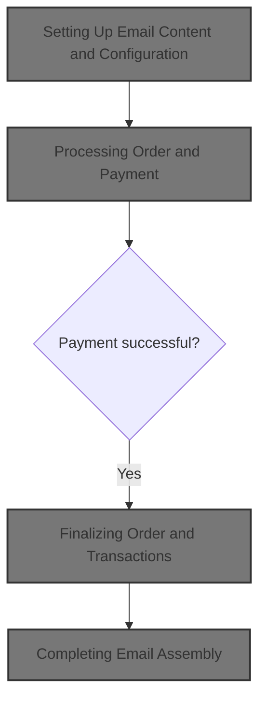

This document describes how an order notification email is prepared and assembled. Payment is processed and the order is finalized before generating the email, ensuring customers receive accurate and complete order information. The flow receives order and customer details, shopping cart items, payment information, and store configuration as input, and produces a finalized order and a fully prepared email notification as output.



# Setting Up Email Content and Configuration

This section governs how email content and configuration are set up for order-related notifications, ensuring that emails are generated with accurate information and appropriate formatting before being sent.

| Category       | Rule Name                               | Description                                                                                                                                        |
| -------------- | --------------------------------------- | -------------------------------------------------------------------------------------------------------------------------------------------------- |
| Business logic | Database Email Configuration Preference | If a custom email configuration is available in the database, it must be used for sending the email; otherwise, the default configuration is used. |
| Business logic | Recipient Assignment                    | The email must be addressed to the intended recipient(s) as specified by the order or notification context.                                        |
| Business logic | Sender Identity                         | The sender's email address and display name must be set according to the store or system configuration.                                            |
| Business logic | Subject Clarity                         | The email subject must clearly indicate the purpose of the email, such as order confirmation or status update.                                     |
| Business logic | Multi-format Email Body                 | Both plain text and HTML versions of the email body must be generated using the appropriate templates and order data.                              |
| Business logic | Order Finalization Before Email         | Order details and status must be finalized before generating email content, to ensure accuracy of the information sent.                            |

<SwmSnippet path="/shopizer/sm-core/src/main/java/com/salesmanager/core/modules/email/HtmlEmailSenderImpl.java" line="51">

---

In <SwmToken path="shopizer/sm-core/src/main/java/com/salesmanager/core/modules/email/HtmlEmailSenderImpl.java" pos="51:5:5" line-data="			public void prepare(MimeMessage mimeMessage)">`prepare`</SwmToken>, we set up the email sender with config from the database if available, assign recipients, sender, and subject, and generate both text and HTML email bodies using templates. Next, we need to call <SwmToken path="shopizer/sm-core/src/main/java/com/salesmanager/core/business/order/service/OrderServiceImpl.java" pos="56:4:4" line-data="public class OrderServiceImpl  extends SalesManagerEntityServiceImpl&lt;Long, Order&gt; implements OrderService {">`OrderServiceImpl`</SwmToken> to process the order, since the email content often depends on order details and status, which are finalized there.

```java
			public void prepare(MimeMessage mimeMessage)
					throws MessagingException, IOException {
				
				JavaMailSenderImpl impl = (JavaMailSenderImpl)mailSender;
				// if email configuration is present in Database, use the same
				if(emailConfig != null) {
					impl.setProtocol(emailConfig.getProtocol());
					impl.setHost(emailConfig.getHost());
					impl.setPort(Integer.parseInt(emailConfig.getPort()));
					impl.setUsername(emailConfig.getUsername());
					impl.setPassword(emailConfig.getPassword());
					
					Properties prop = new Properties();
					prop.put("mail.smtp.auth", emailConfig.isSmtpAuth());
					prop.put("mail.smtp.starttls.enable", emailConfig.isStarttls());
					impl.setJavaMailProperties(prop);
				}
				
				mimeMessage.setRecipient(Message.RecipientType.TO, new InternetAddress(to));

				InternetAddress inetAddress = new InternetAddress();

				inetAddress.setPersonal(eml);
				inetAddress.setAddress(from);

				mimeMessage.setFrom(inetAddress);
				mimeMessage.setSubject(subject);

				Multipart mp = new MimeMultipart("alternative");

				// Create a "text" Multipart message
				BodyPart textPart = new MimeBodyPart();
				freemarkerMailConfiguration.setClassForTemplateLoading(HtmlEmailSenderImpl.class, "/");
				Template textTemplate = freemarkerMailConfiguration.getTemplate(new StringBuilder(TEMPLATE_PATH).append("").append("/").append(tmpl).toString());
				final StringWriter textWriter = new StringWriter();
				try {
					textTemplate.process(templateTokens, textWriter);
				} catch (TemplateException e) {
					throw new MailPreparationException(
							"Can't generate text mail", e);
				}
				textPart.setDataHandler(new javax.activation.DataHandler(
						new javax.activation.DataSource() {
							public InputStream getInputStream()
									throws IOException {
								//return new StringBufferInputStream(textWriter
								//		.toString());
								return new ByteArrayInputStream(textWriter
										.toString().getBytes(CHARSET));
							}

							public OutputStream getOutputStream()
									throws IOException {
								throw new IOException("Read-only data");
							}

							public String getContentType() {
								return "text/plain";
							}

							public String getName() {
								return "main";
							}
						}));
				mp.addBodyPart(textPart);

				// Create a "HTML" Multipart message
				Multipart htmlContent = new MimeMultipart("related");
				BodyPart htmlPage = new MimeBodyPart();
				freemarkerMailConfiguration.setClassForTemplateLoading(HtmlEmailSenderImpl.class, "/");
				Template htmlTemplate = freemarkerMailConfiguration.getTemplate(new StringBuilder(TEMPLATE_PATH).append("").append("/").append(tmpl).toString());
				final StringWriter htmlWriter = new StringWriter();
				try {
					htmlTemplate.process(templateTokens, htmlWriter);
				} catch (TemplateException e) {
					throw new MailPreparationException(
							"Can't generate HTML mail", e);
				}
```

---

</SwmSnippet>

## Processing Order and Payment

This section governs the rules for processing an order and its payment, ensuring all necessary information is present and that payment is handled before finalizing the order.

| Category        | Rule Name                         | Description                                                                                                                                                                  |
| --------------- | --------------------------------- | ---------------------------------------------------------------------------------------------------------------------------------------------------------------------------- |
| Data validation | Required objects validation       | An order cannot be processed unless all required objects (order, customer, shopping cart items, payment, merchant store, and order total summary) are provided and not null. |
| Business logic  | Payment before order finalization | Payment must be processed before the order can be finalized. The outcome of the payment determines whether the order proceeds or fails.                                      |

<SwmSnippet path="/shopizer/sm-core/src/main/java/com/salesmanager/core/business/order/service/OrderServiceImpl.java" line="105">

---

In <SwmToken path="shopizer/sm-core/src/main/java/com/salesmanager/core/business/order/service/OrderServiceImpl.java" pos="105:5:5" line-data="    private Order process(Order order, Customer customer, List&lt;ShoppingCartItem&gt; items, OrderTotalSummary summary, Payment payment, Transaction transaction, MerchantStore store) throws ServiceException {">`process`</SwmToken>, we validate all required objects and immediately delegate payment handling to the payment service. We need to call `PaymentServiceImpl` next to actually process the payment, since the outcome determines how we proceed with the order.

```java
    private Order process(Order order, Customer customer, List<ShoppingCartItem> items, OrderTotalSummary summary, Payment payment, Transaction transaction, MerchantStore store) throws ServiceException {
    	
    	
    	Validate.notNull(order, "Order cannot be null");
    	Validate.notNull(customer, "Customer cannot be null (even if anonymous order)");
    	Validate.notEmpty(items, "ShoppingCart items cannot be null");
    	Validate.notNull(payment, "Payment cannot be null");
    	Validate.notNull(store, "MerchantStore cannot be null");
    	Validate.notNull(summary, "Order total Summary cannot be null");
    	
    	//first process payment
    	Transaction processTransaction = paymentService.processPayment(customer, store, payment, items, order);
```

---

</SwmSnippet>

### Handling Payment Processing

This section governs how customer payments are processed during checkout in the Shopizer e-commerce platform. It ensures that payments are validated, authorized, and recorded according to business requirements, supporting a seamless and secure transaction experience for both customers and merchants.

| Category        | Rule Name                      | Description                                                                                                                                        |
| --------------- | ------------------------------ | -------------------------------------------------------------------------------------------------------------------------------------------------- |
| Data validation | Supported payment methods      | Only supported payment methods (such as credit card, PayPal, or other configured gateways) can be used to complete a purchase.                     |
| Business logic  | Payment authorization required | A payment transaction must be authorized and confirmed before an order is marked as paid and processed for fulfillment.                            |
| Business logic  | Payment transaction logging    | All payment transactions must be logged with a unique transaction ID, payment amount, date, and status for auditing and customer service purposes. |
| Business logic  | Refund eligibility and method  | Refunds can only be issued for orders that have a completed payment status and must be processed through the original payment method.              |

See <SwmLink doc-title="Processing a Customer Payment">[Processing a Customer Payment](.swm%5Cprocessing-a-customer-payment.pu5vupwr.sw.md)</SwmLink>

### Finalizing Order and Transactions

```mermaid
%%{init: {"flowchart": {"defaultRenderer": "elk"}} }%%
flowchart TD
    node1["Check if order status/history is missing"]
    click node1 openCode "shopizer/sm-core/src/main/java/com/salesmanager/core/business/order/service/OrderServiceImpl.java:119:133"
    node1 --> node2{"Order status/history missing?"}
    click node2 openCode "shopizer/sm-core/src/main/java/com/salesmanager/core/business/order/service/OrderServiceImpl.java:119:133"
    node2 -->|"Yes"| node3["Initialize order status/history"]
    click node3 openCode "shopizer/sm-core/src/main/java/com/salesmanager/core/business/order/service/OrderServiceImpl.java:120:132"
    node2 -->|"No"| node4["Check if customer is new"]
    node3 --> node4
    node4{"Customer ID missing?"}
    click node4 openCode "shopizer/sm-core/src/main/java/com/salesmanager/core/business/order/service/OrderServiceImpl.java:135:137"
    node4 -->|"Yes"| node5["Create customer"]
    click node5 openCode "shopizer/sm-core/src/main/java/com/salesmanager/core/business/order/service/OrderServiceImpl.java:136:137"
    node4 -->|"No"| node6["Save order"]
    node5 --> node6["Save order"]
    click node6 openCode "shopizer/sm-core/src/main/java/com/salesmanager/core/business/order/service/OrderServiceImpl.java:139:141"
    node6 --> node7["Handle transaction and processTransaction"]
    click node7 openCode "shopizer/sm-core/src/main/java/com/salesmanager/core/business/order/service/OrderServiceImpl.java:143:159"
    node7 --> node8["Return order"]
    click node8 openCode "shopizer/sm-core/src/main/java/com/salesmanager/core/business/order/service/OrderServiceImpl.java:161:161"
classDef HeadingStyle fill:#777777,stroke:#333,stroke-width:2px;

%% Swimm:
%% %%{init: {"flowchart": {"defaultRenderer": "elk"}} }%%
%% flowchart TD
%%     node1["Check if order status/history is missing"]
%%     click node1 openCode "<SwmPath>[shopizer/…/service/OrderServiceImpl.java](shopizer/sm-core/src/main/java/com/salesmanager/core/business/order/service/OrderServiceImpl.java)</SwmPath>:119:133"
%%     node1 --> node2{"Order status/history missing?"}
%%     click node2 openCode "<SwmPath>[shopizer/…/service/OrderServiceImpl.java](shopizer/sm-core/src/main/java/com/salesmanager/core/business/order/service/OrderServiceImpl.java)</SwmPath>:119:133"
%%     node2 -->|"Yes"| node3["Initialize order status/history"]
%%     click node3 openCode "<SwmPath>[shopizer/…/service/OrderServiceImpl.java](shopizer/sm-core/src/main/java/com/salesmanager/core/business/order/service/OrderServiceImpl.java)</SwmPath>:120:132"
%%     node2 -->|"No"| node4["Check if customer is new"]
%%     node3 --> node4
%%     node4{"Customer ID missing?"}
%%     click node4 openCode "<SwmPath>[shopizer/…/service/OrderServiceImpl.java](shopizer/sm-core/src/main/java/com/salesmanager/core/business/order/service/OrderServiceImpl.java)</SwmPath>:135:137"
%%     node4 -->|"Yes"| node5["Create customer"]
%%     click node5 openCode "<SwmPath>[shopizer/…/service/OrderServiceImpl.java](shopizer/sm-core/src/main/java/com/salesmanager/core/business/order/service/OrderServiceImpl.java)</SwmPath>:136:137"
%%     node4 -->|"No"| node6["Save order"]
%%     node5 --> node6["Save order"]
%%     click node6 openCode "<SwmPath>[shopizer/…/service/OrderServiceImpl.java](shopizer/sm-core/src/main/java/com/salesmanager/core/business/order/service/OrderServiceImpl.java)</SwmPath>:139:141"
%%     node6 --> node7["Handle transaction and <SwmToken path="shopizer/sm-core/src/main/java/com/salesmanager/core/business/order/service/OrderServiceImpl.java" pos="116:3:3" line-data="    	Transaction processTransaction = paymentService.processPayment(customer, store, payment, items, order);">`processTransaction`</SwmToken>"]
%%     click node7 openCode "<SwmPath>[shopizer/…/service/OrderServiceImpl.java](shopizer/sm-core/src/main/java/com/salesmanager/core/business/order/service/OrderServiceImpl.java)</SwmPath>:143:159"
%%     node7 --> node8["Return order"]
%%     click node8 openCode "<SwmPath>[shopizer/…/service/OrderServiceImpl.java](shopizer/sm-core/src/main/java/com/salesmanager/core/business/order/service/OrderServiceImpl.java)</SwmPath>:161:161"
%% classDef HeadingStyle fill:#777777,stroke:#333,stroke-width:2px;
```



<SwmSnippet path="/shopizer/sm-core/src/main/java/com/salesmanager/core/business/order/service/OrderServiceImpl.java" line="117">

---

After payment, we update order status/history, make sure the customer exists, and link transactions to the order.

```java
    	//transactionService.save(processTransaction);
    	
    	if(order.getOrderHistory()==null || order.getOrderHistory().size()==0 || order.getStatus()==null) {
    		OrderStatus status = order.getStatus();
    		if(status==null) {
    			status = OrderStatus.ORDERED;
    			order.setStatus(status);
    		}
    		Set<OrderStatusHistory> statusHistorySet = new HashSet<OrderStatusHistory>();
    		OrderStatusHistory statusHistory = new OrderStatusHistory();
    		statusHistory.setStatus(status);
    		statusHistory.setDateAdded(new Date());
    		statusHistory.setOrder(order);
    		statusHistorySet.add(statusHistory);
    		order.setOrderHistory(statusHistorySet);
    		
    	}
    	
    	if(customer.getId()==null || customer.getId()==0) {
    		customerService.create(customer);
    	}
    	
    	order.setCustomerId(customer.getId());
    	
    	this.create(order);

    	if(transaction!=null) {
    		transaction.setOrder(order);
    		if(transaction.getId()==null || transaction.getId()==0) {
    			transactionService.create(transaction);
    		} else {
    			transactionService.update(transaction);
    		}
    	}
    	
    	if(processTransaction!=null) {
    		processTransaction.setOrder(order);
    		if(processTransaction.getId()==null || processTransaction.getId()==0) {
    			transactionService.create(processTransaction);
    		} else {
    			transactionService.update(processTransaction);
    		}
    	}
    	
    	return order;
    	
    	
    }
```

---

</SwmSnippet>

## Completing Email Assembly

<SwmSnippet path="/shopizer/sm-core/src/main/java/com/salesmanager/core/modules/email/HtmlEmailSenderImpl.java" line="129">

---

Back in <SwmToken path="shopizer/sm-core/src/main/java/com/salesmanager/core/modules/email/HtmlEmailSenderImpl.java" pos="51:5:5" line-data="			public void prepare(MimeMessage mimeMessage)">`prepare`</SwmToken>, after getting the finalized order info from <SwmToken path="shopizer/sm-core/src/main/java/com/salesmanager/core/business/order/service/OrderServiceImpl.java" pos="56:4:4" line-data="public class OrderServiceImpl  extends SalesManagerEntityServiceImpl&lt;Long, Order&gt; implements OrderService {">`OrderServiceImpl`</SwmToken>, we finish assembling the email by adding both text and HTML parts, set the content, and optionally handle attachments. The order details from the previous step are now reflected in the email.

```java
				htmlPage.setDataHandler(new javax.activation.DataHandler(
						new javax.activation.DataSource() {
							public InputStream getInputStream()
									throws IOException {
								//return new StringBufferInputStream(htmlWriter
								//		.toString());
								return new ByteArrayInputStream(textWriter
										.toString().getBytes(CHARSET));
							}

							public OutputStream getOutputStream()
									throws IOException {
								throw new IOException("Read-only data");
							}

							public String getContentType() {
								return "text/html";
							}

							public String getName() {
								return "main";
							}
						}));
				htmlContent.addBodyPart(htmlPage);
				BodyPart htmlPart = new MimeBodyPart();
				htmlPart.setContent(htmlContent);
				mp.addBodyPart(htmlPart);

				mimeMessage.setContent(mp);

				// if(attachment!=null) {
				// MimeMessageHelper messageHelper = new
				// MimeMessageHelper(mimeMessage, true);
				// messageHelper.addAttachment(attachmentFileName, attachment);
				// }

			}
```

---

</SwmSnippet>

&nbsp;

*This is an auto-generated document by Swimm 🌊 and has not yet been verified by a human*

<SwmMeta version="3.0.0" repo-id="Z2l0aHViJTNBJTNBU2hvcGl6ZXIlM0ElM0F1bWFsaW5nYXN3YW1p" repo-name="Shopizer"><sup>Powered by [Swimm](https://app.swimm.io/)</sup></SwmMeta>
