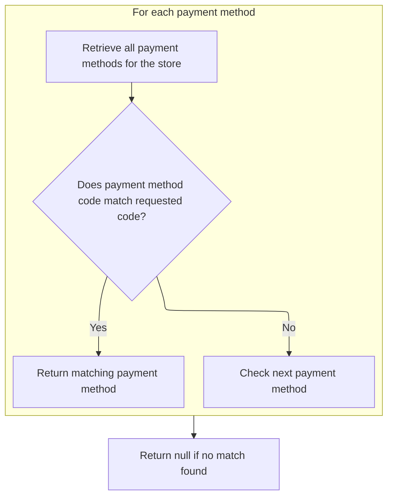
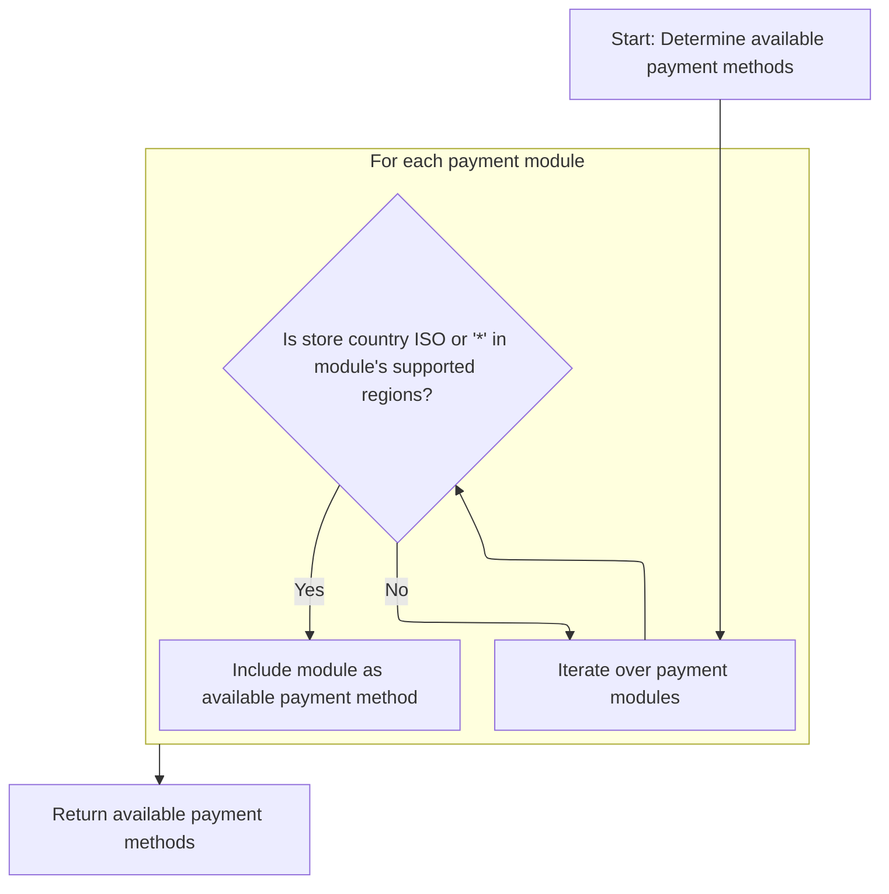
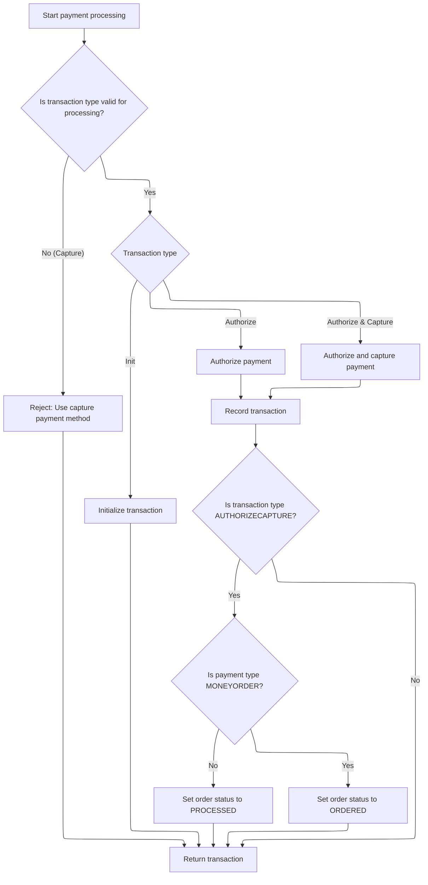

This document describes the flow for processing a payment for a customer order. The process validates payment information and configurations, selects an eligible payment provider based on store region, and executes the transaction according to business rules. The flow receives customer, store, payment, cart items, and order details as input, and outputs a processed transaction and updated order status.

# Starting the payment processing

This section governs the initiation of payment processing for customer orders. It ensures that all necessary validations and configurations are in place before routing the payment to the appropriate payment provider integration module. The section is responsible for validating input data, confirming payment module readiness, determining transaction type, and ensuring credit card details are valid when required.

| Category        | Rule Name                             | Description                                                                                                                                                                                         |
| --------------- | ------------------------------------- | --------------------------------------------------------------------------------------------------------------------------------------------------------------------------------------------------- |
| Data validation | Mandatory payment inputs              | A payment cannot be processed unless a customer, merchant store, payment information, order, and order total are all provided and valid.                                                            |
| Data validation | Payment module configuration required | A payment cannot be processed unless a payment module is configured for the merchant store.                                                                                                         |
| Data validation | Active payment module required        | A payment cannot be processed unless the selected payment module is both configured and active for the merchant store.                                                                              |
| Data validation | Existing payment module required      | A payment cannot be processed unless the selected payment module exists in the system.                                                                                                              |
| Data validation | Credit card validation                | If the payment method is a credit card, the credit card number, type, expiration month, and expiration year must all be valid before processing can continue.                                       |
| Business logic  | Payment currency alignment            | The payment currency must always match the currency of the merchant store where the order is placed.                                                                                                |
| Business logic  | Default transaction type              | If the payment module does not specify a transaction type, the default transaction type must be AUTHORIZECAPTURE.                                                                                   |
| Business logic  | Transaction type enforcement          | If the payment module specifies the transaction type as AUTHORIZE, the payment must be processed as an authorization only; otherwise, it must be processed as an authorize and capture transaction. |
| Business logic  | Integration module retrieval          | The system must retrieve the integration module for the selected payment provider to ensure the payment is routed to the correct handler.                                                           |

<SwmSnippet path="/shopizer/sm-core/src/main/java/com/salesmanager/core/business/payments/service/PaymentServiceImpl.java" line="296">

---

In `processPayment`, we validate all inputs, set up the payment currency, and check that the payment module is configured and active. We also determine the transaction type and validate credit card details if needed. Next, we call `getPaymentMethodByCode` to fetch the integration module for the selected payment provider, which is necessary to route the payment to the correct handler.

```java
	public Transaction processPayment(Customer customer,
			MerchantStore store, Payment payment, List<ShoppingCartItem> items, Order order)
			throws ServiceException {


		Validate.notNull(customer);
		Validate.notNull(store);
		Validate.notNull(payment);
		Validate.notNull(order);
		Validate.notNull(order.getTotal());
		
		payment.setCurrency(store.getCurrency());
		
		BigDecimal amount = order.getTotal();

		//must have a shipping module configured
		Map<String, IntegrationConfiguration> modules = this.getPaymentModulesConfigured(store);
		if(modules==null){
			throw new ServiceException("No payment module configured");
		}
		
		IntegrationConfiguration configuration = modules.get(payment.getModuleName());
		
		if(configuration==null) {
			throw new ServiceException("Payment module " + payment.getModuleName() + " is not configured");
		}
		
		if(!configuration.isActive()) {
			throw new ServiceException("Payment module " + payment.getModuleName() + " is not active");
		}
		
		String sTransactionType = configuration.getIntegrationKeys().get("transaction");
		if(sTransactionType==null) {
			sTransactionType = TransactionType.AUTHORIZECAPTURE.name();
		}
		

		if(sTransactionType.equals(TransactionType.AUTHORIZE.name())) {
			payment.setTransactionType(TransactionType.AUTHORIZE);
		} else {
			payment.setTransactionType(TransactionType.AUTHORIZECAPTURE);
		} 
		

		PaymentModule module = this.paymentModules.get(payment.getModuleName());
		
		if(module==null) {
			throw new ServiceException("Payment module " + payment.getModuleName() + " does not exist");
		}
		
		if(payment instanceof CreditCardPayment) {
			CreditCardPayment creditCardPayment = (CreditCardPayment)payment;
			validateCreditCard(creditCardPayment.getCreditCardNumber(),creditCardPayment.getCreditCard(),creditCardPayment.getExpirationMonth(),creditCardPayment.getExpirationYear());
		}
		
		IntegrationModule integrationModule = getPaymentMethodByCode(store,payment.getModuleName());
```

---

</SwmSnippet>

## Locating the payment integration module



This section is responsible for locating and returning the payment integration module that matches a specific code for a given store. It ensures that only valid payment modules for the store's configuration are considered.

| Category       | Rule Name                               | Description                                                                                                                                 |
| -------------- | --------------------------------------- | ------------------------------------------------------------------------------------------------------------------------------------------- |
| Business logic | Store-specific payment module filtering | Only payment integration modules that are valid for the store's region and configuration are considered when searching for a matching code. |
| Business logic | Return matching payment module          | If a payment integration module with the requested code exists among the valid modules, it is returned as the result.                       |

<SwmSnippet path="/shopizer/sm-core/src/main/java/com/salesmanager/core/business/payments/service/PaymentServiceImpl.java" line="147">

---

`getPaymentMethodByCode` grabs all payment modules for the store, then loops through them to find the one matching the given code. We call `getPaymentMethods` first to get the filtered list of modules that are valid for the store's region and configuration.

```java
	public IntegrationModule getPaymentMethodByCode(MerchantStore store,
			String code) throws ServiceException {
		List<IntegrationModule> modules =  getPaymentMethods(store);

		for(IntegrationModule module : modules) {
			if(module.getCode().equals(code)) {
				
				return module;
			}
		}
		
		return null;
	}
```

---

</SwmSnippet>

## Filtering payment modules by store region

This section governs how payment modules are filtered and presented to a merchant store based on the store's region. Only payment modules that are relevant to the store's country or are globally available should be shown to the merchant for configuration or use.

| Category        | Rule Name                               | Description                                                                                                                                             |
| --------------- | --------------------------------------- | ------------------------------------------------------------------------------------------------------------------------------------------------------- |
| Data validation | Country code filtering requirement      | The filtering of payment modules must be based on the store's country ISO code as configured in the merchant store profile.                             |
| Business logic  | Region-based payment module eligibility | Only payment modules that match the store's country ISO code or are marked as globally available ('\*') are eligible to be shown to the merchant store. |

<SwmSnippet path="/shopizer/sm-core/src/main/java/com/salesmanager/core/business/payments/service/PaymentServiceImpl.java" line="75">

---

In `getPaymentMethods`, we start by calling the module configuration service to get all payment modules. This is needed so we can filter them by region, only keeping those that match the store's country ISO code or are globally available ('\*').

```java
	public List<IntegrationModule> getPaymentMethods(MerchantStore store) throws ServiceException {
		
		List<IntegrationModule> modules =  moduleConfigurationService.getIntegrationModules(PAYMENT_MODULES);
```

---

</SwmSnippet>

### Loading and parsing payment module configurations

```mermaid
%%{init: {"flowchart": {"defaultRenderer": "elk"}} }%%
flowchart TD
  node1["Request integration modules for a given module"]
  click node1 openCode "shopizer/sm-core/src/main/java/com/salesmanager/core/business/system/service/ModuleConfigurationServiceImpl.java:50:53"
  node1 --> node2{"Is configuration in cache?"}
  click node2 openCode "shopizer/sm-core/src/main/java/com/salesmanager/core/business/system/service/ModuleConfigurationServiceImpl.java:57:58"
  node2 -->|"Yes"| node3["Return cached modules"]
  click node3 openCode "shopizer/sm-core/src/main/java/com/salesmanager/core/business/system/service/ModuleConfigurationServiceImpl.java:57:58"
  node2 -->|"No"| node4["Retrieve modules from database"]
  click node4 openCode "shopizer/sm-core/src/main/java/com/salesmanager/core/business/system/service/ModuleConfigurationServiceImpl.java:59:59"
  node4 --> node5["Transform each module"]
  click node5 openCode "shopizer/sm-core/src/main/java/com/salesmanager/core/business/system/service/ModuleConfigurationServiceImpl.java:61:126"
  subgraph loop1["For each module"]
    node5 --> node6{"Has regions data?"}
    click node6 openCode "shopizer/sm-core/src/main/java/com/salesmanager/core/business/system/service/ModuleConfigurationServiceImpl.java:63:64"
    node6 -->|"Yes"| node7["Parse and add regions"]
    click node7 openCode "shopizer/sm-core/src/main/java/com/salesmanager/core/business/system/service/ModuleConfigurationServiceImpl.java:65:70"
    subgraph loop2["For each region"]
      node7 --> node71["Add region to module"]
      click node71 openCode "shopizer/sm-core/src/main/java/com/salesmanager/core/business/system/service/ModuleConfigurationServiceImpl.java:69:70"
      node71 --> node7
    end
    node6 -->|"No"| node8["Skip regions"]
    click node8 openCode "shopizer/sm-core/src/main/java/com/salesmanager/core/business/system/service/ModuleConfigurationServiceImpl.java:71:71"
    node7 --> node9{"Has details data?"}
    node8 --> node9
    click node9 openCode "shopizer/sm-core/src/main/java/com/salesmanager/core/business/system/service/ModuleConfigurationServiceImpl.java:74:75"
    node9 -->|"Yes"| node10["Parse and add details"]
    click node10 openCode "shopizer/sm-core/src/main/java/com/salesmanager/core/business/system/service/ModuleConfigurationServiceImpl.java:79:80"
    node9 -->|"No"| node11["Skip details"]
    click node11 openCode "shopizer/sm-core/src/main/java/com/salesmanager/core/business/system/service/ModuleConfigurationServiceImpl.java:83:83"
    node10 --> node12{"Has configuration data?"}
    node11 --> node12
    click node12 openCode "shopizer/sm-core/src/main/java/com/salesmanager/core/business/system/service/ModuleConfigurationServiceImpl.java:86:87"
    node12 -->|"Yes"| node13["Parse and transform configuration"]
    click node13 openCode "shopizer/sm-core/src/main/java/com/salesmanager/core/business/system/service/ModuleConfigurationServiceImpl.java:91:120"
    subgraph loop3["For each configuration entry"]
      node13 --> node131["Build structured configuration object"]
      click node131 openCode "shopizer/sm-core/src/main/java/com/salesmanager/core/business/system/service/ModuleConfigurationServiceImpl.java:99:114"
      node131 --> node13
    end
    node12 -->|"No"| node14["Skip configuration"]
    click node14 openCode "shopizer/sm-core/src/main/java/com/salesmanager/core/business/system/service/ModuleConfigurationServiceImpl.java:123:123"
    node13 --> node15["Add structured configuration to module"]
    node14 --> node15
    click node15 openCode "shopizer/sm-core/src/main/java/com/salesmanager/core/business/system/service/ModuleConfigurationServiceImpl.java:120:121"
    node15 --> node5
  end
  node5 --> node16["Store modules in cache"]
  click node16 openCode "shopizer/sm-core/src/main/java/com/salesmanager/core/business/system/service/ModuleConfigurationServiceImpl.java:127:127"
  node16 --> node3
  node3 --> node17["Return modules"]
  click node17 openCode "shopizer/sm-core/src/main/java/com/salesmanager/core/business/system/service/ModuleConfigurationServiceImpl.java:133:133"

classDef HeadingStyle fill:#777777,stroke:#333,stroke-width:2px;
```



This section governs how payment module configurations are loaded, parsed, and structured for use in Shopizer. It ensures that modules are efficiently retrieved, either from cache or database, and that all relevant configuration data is correctly parsed and attached to each module.

| Category       | Rule Name                         | Description                                                                                                                                                                           |
| -------------- | --------------------------------- | ------------------------------------------------------------------------------------------------------------------------------------------------------------------------------------- |
| Business logic | Cache-first retrieval             | If a payment module configuration is available in cache for the requested module identifier, it must be returned directly without querying the database.                              |
| Business logic | Database fallback                 | If no cached configuration is found, the system must retrieve the payment module configuration from the database using the provided module identifier.                                |
| Business logic | Regions parsing                   | Each IntegrationModule must have its regions field parsed from JSON, and all regions must be added to the module's regions set if regions data is present.                            |
| Business logic | Details parsing                   | If configuration details are present in the module, they must be parsed from JSON and attached to the module as key-value pairs.                                                      |
| Business logic | Environment configuration mapping | If environment-specific configuration data is present, each entry must be parsed and transformed into a structured configuration object, with all entries mapped by environment name. |
| Business logic | Cache population                  | After parsing and structuring, the list of IntegrationModule objects must be stored in cache for future requests using the module identifier as the cache key.                        |

<SwmSnippet path="/shopizer/sm-core/src/main/java/com/salesmanager/core/business/system/service/ModuleConfigurationServiceImpl.java" line="50">

---

In `getIntegrationModules`, we first try to load payment modules from cache. If not found, we fetch from the database and parse JSON fields in each module to populate regions, config details, and environment-specific configs. This setup is needed for later filtering and usage.

```java
	public List<IntegrationModule> getIntegrationModules(String module) {
		
		
		List<IntegrationModule> modules = null;
		try {
			
			//CacheUtils cacheUtils = CacheUtils.getInstance();
			modules = (List<IntegrationModule>) cache.getFromCache("INTEGRATION_M)" + module);
			if(modules==null) {
				modules = integrationModuleDao.getModulesConfiguration(module);
				//set json objects
				for(IntegrationModule mod : modules) {
					
					String regions = mod.getRegions();
					if(regions!=null) {
						Object objRegions=JSONValue.parse(regions); 
						JSONArray arrayRegions=(JSONArray)objRegions;
						Iterator i = arrayRegions.iterator();
						while(i.hasNext()) {
							mod.getRegionsSet().add((String)i.next());
						}
					}
					
					
					String details = mod.getConfigDetails();
					if(details!=null) {
						
						//Map objects = mapper.readValue(config, Map.class);

						Map<String,String> objDetails= (Map<String, String>) JSONValue.parse(details); 
						mod.setDetails(objDetails);

						
					}
					
					
					String configs = mod.getConfiguration();
					if(configs!=null) {
						
						//Map objects = mapper.readValue(config, Map.class);

						Object objConfigs=JSONValue.parse(configs); 
						JSONArray arrayConfigs=(JSONArray)objConfigs;
						
						Map<String,ModuleConfig> moduleConfigs = new HashMap<String,ModuleConfig>();
						
						Iterator i = arrayConfigs.iterator();
						while(i.hasNext()) {
							
							Map values = (Map)i.next();
							String env = (String)values.get("env");
		            		ModuleConfig config = new ModuleConfig();
		            		config.setScheme((String)values.get("scheme"));
		            		config.setHost((String)values.get("host"));
		            		config.setPort((String)values.get("port"));
		            		config.setUri((String)values.get("uri"));
		            		config.setEnv((String)values.get("env"));
		            		if((String)values.get("config1")!=null) {
		            			config.setConfig1((String)values.get("config1"));
		            		}
		            		if((String)values.get("config2")!=null) {
		            			config.setConfig1((String)values.get("config2"));
		            		}
		            		
		            		moduleConfigs.put(env, config);
		            		
		            		
							
						}
						
						mod.setModuleConfigs(moduleConfigs);
						

					}


				}
```

---

</SwmSnippet>

<SwmSnippet path="/shopizer/sm-core/src/main/java/com/salesmanager/core/business/system/service/ModuleConfigurationServiceImpl.java" line="127">

---

We get back a list of IntegrationModule objects with all their regions and configs parsed and set up, assuming the input module string and JSON are valid.

```java
				cache.putInCache(modules, "INTEGRATION_M)" + module);
			}

		} catch (Exception e) {
			LOGGER.error("getIntegrationModules()", e);
		}
		return modules;
		
		
	}
```

---

</SwmSnippet>

### Filtering modules by region and wildcard



<SwmSnippet path="/shopizer/sm-core/src/main/java/com/salesmanager/core/business/payments/service/PaymentServiceImpl.java" line="78">

---

Back in `processPayment`, after getting the integration module, we use it to process the transaction based on its type (authorize, capture, etc.). The module handles the actual payment logic, and we update the order status and persist the transaction as needed.

```java
		List<IntegrationModule> returnModules = new ArrayList<IntegrationModule>();
		
		for(IntegrationModule module : modules) {
			if(module.getRegionsSet().contains(store.getCountry().getIsoCode())
					|| module.getRegionsSet().contains("*")) {
				
				returnModules.add(module);
			}
		}
```

---

</SwmSnippet>

## Executing the payment transaction



<SwmSnippet path="/shopizer/sm-core/src/main/java/com/salesmanager/core/business/payments/service/PaymentServiceImpl.java" line="352">

---

Back in `processPayment`, after getting the integration module, we use it to process the transaction based on its type (authorize, capture, etc.). The module handles the actual payment logic, and we update the order status and persist the transaction as needed.

```java
		TransactionType transactionType = TransactionType.valueOf(sTransactionType);
		if(transactionType==null) {
			transactionType = payment.getTransactionType();
			if(transactionType.equals(TransactionType.CAPTURE.name())) {
				throw new ServiceException("This method does not allow to process capture transaction. Use processCapturePayment");
			}
		}
		
		Transaction transaction = null;
		if(transactionType == TransactionType.AUTHORIZE)  {
			transaction = module.authorize(store, customer, items, amount, payment, configuration, integrationModule);
		} else if(transactionType == TransactionType.AUTHORIZECAPTURE)  {
			transaction = module.authorizeAndCapture(store, customer, items, amount, payment, configuration, integrationModule);
		} else if(transactionType == TransactionType.INIT)  {
			transaction = module.initTransaction(store, customer, amount, payment, configuration, integrationModule);
		}


		if(transactionType != TransactionType.INIT) {
			transactionService.create(transaction);
		}
		
		if(transactionType == TransactionType.AUTHORIZECAPTURE)  {
			order.setStatus(OrderStatus.ORDERED);
			if(payment.getPaymentType().name()!=PaymentType.MONEYORDER.name()) {
				order.setStatus(OrderStatus.PROCESSED);
			}
		}

		return transaction;

		

	}
```

---

</SwmSnippet>

&nbsp;

*This is an auto-generated document by Swimm 🌊 and has not yet been verified by a human*

<SwmMeta version="3.0.0" repo-id="Z2l0aHViJTNBJTNBU2hvcGl6ZXIlM0ElM0F1bWFsaW5nYXN3YW1p" repo-name="Shopizer"><sup>Powered by [Swimm](https://app.swimm.io/)</sup></SwmMeta>
