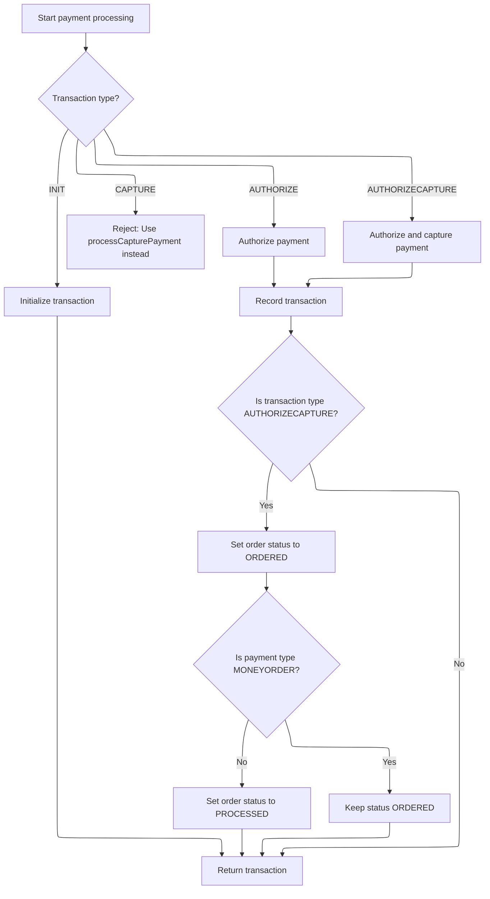

This document describes how a customer's payment for an order is processed. The flow ensures all required payment and order information is present, selects a valid payment module for the store, and executes the payment transaction. The order status is updated based on the transaction result.

# Starting the payment processing logic

This section governs the initial steps of payment processing, ensuring all necessary conditions are met before interacting with the payment provider. It validates inputs, configures payment settings, and checks the readiness and configuration of payment modules.

| Category        | Rule Name                             | Description                                                                                                                               |
| --------------- | ------------------------------------- | ----------------------------------------------------------------------------------------------------------------------------------------- |
| Data validation | Required payment inputs               | A payment cannot be processed unless the customer, merchant store, payment details, order, and order total are all provided and not null. |
| Data validation | Payment module configuration required | A payment cannot be processed unless a payment module is configured for the merchant store.                                               |
| Data validation | Active payment module required        | A payment cannot be processed unless the selected payment module is both configured and active.                                           |
| Data validation | Credit card validation                | If the payment is a credit card payment, the credit card details must be validated before processing.                                     |
| Data validation | Payment module existence              | A payment cannot be processed unless the payment module exists in the system.                                                             |
| Business logic  | Payment currency alignment            | The payment currency must match the merchant store's currency for every transaction.                                                      |
| Business logic  | Default transaction type              | If the payment module does not specify a transaction type, the default transaction type is AUTHORIZECAPTURE.                              |

<SwmSnippet path="/shopizer/sm-core/src/main/java/com/salesmanager/core/business/payments/service/PaymentServiceImpl.java" line="296">

---

In `processPayment` we kick off by validating all required inputs, setting up the payment currency, and checking that the payment module is configured, active, and present. We also figure out the transaction type and validate credit card details if needed. Next, we call `getPaymentMethodByCode` to fetch the IntegrationModule, which gives us the metadata and configuration needed to interact with the payment provider.

```java
	public Transaction processPayment(Customer customer,
			MerchantStore store, Payment payment, List<ShoppingCartItem> items, Order order)
			throws ServiceException {


		Validate.notNull(customer);
		Validate.notNull(store);
		Validate.notNull(payment);
		Validate.notNull(order);
		Validate.notNull(order.getTotal());
		
		payment.setCurrency(store.getCurrency());
		
		BigDecimal amount = order.getTotal();

		//must have a shipping module configured
		Map<String, IntegrationConfiguration> modules = this.getPaymentModulesConfigured(store);
		if(modules==null){
			throw new ServiceException("No payment module configured");
		}
		
		IntegrationConfiguration configuration = modules.get(payment.getModuleName());
		
		if(configuration==null) {
			throw new ServiceException("Payment module " + payment.getModuleName() + " is not configured");
		}
		
		if(!configuration.isActive()) {
			throw new ServiceException("Payment module " + payment.getModuleName() + " is not active");
		}
		
		String sTransactionType = configuration.getIntegrationKeys().get("transaction");
		if(sTransactionType==null) {
			sTransactionType = TransactionType.AUTHORIZECAPTURE.name();
		}
		

		if(sTransactionType.equals(TransactionType.AUTHORIZE.name())) {
			payment.setTransactionType(TransactionType.AUTHORIZE);
		} else {
			payment.setTransactionType(TransactionType.AUTHORIZECAPTURE);
		} 
		

		PaymentModule module = this.paymentModules.get(payment.getModuleName());
		
		if(module==null) {
			throw new ServiceException("Payment module " + payment.getModuleName() + " does not exist");
		}
		
		if(payment instanceof CreditCardPayment) {
			CreditCardPayment creditCardPayment = (CreditCardPayment)payment;
			validateCreditCard(creditCardPayment.getCreditCardNumber(),creditCardPayment.getCreditCard(),creditCardPayment.getExpirationMonth(),creditCardPayment.getExpirationYear());
		}
		
		IntegrationModule integrationModule = getPaymentMethodByCode(store,payment.getModuleName());
```

---

</SwmSnippet>

## Locating the payment module by code

This section is responsible for locating and returning the payment module associated with a specific code for a merchant store. It ensures that only valid and available payment modules are selected for further payment processing.

| Category        | Rule Name                       | Description                                                                                                  |
| --------------- | ------------------------------- | ------------------------------------------------------------------------------------------------------------ |
| Data validation | Unique code matching            | The payment module is identified by a unique code, and only the module with an exact code match is selected. |
| Business logic  | Store-specific module filtering | Only payment modules that are available for the given merchant store are considered for selection.           |

<SwmSnippet path="/shopizer/sm-core/src/main/java/com/salesmanager/core/business/payments/service/PaymentServiceImpl.java" line="147">

---

`getPaymentMethodByCode` fetches all modules and finds the one with the matching code by calling `getPaymentMethods`.

```java
	public IntegrationModule getPaymentMethodByCode(MerchantStore store,
			String code) throws ServiceException {
		List<IntegrationModule> modules =  getPaymentMethods(store);

		for(IntegrationModule module : modules) {
			if(module.getCode().equals(code)) {
				
				return module;
			}
		}
		
		return null;
	}
```

---

</SwmSnippet>

## Fetching available payment modules for the store

This section is responsible for providing the store with a list of payment modules that are available and properly configured, ensuring that only valid and usable payment options are presented to customers.

| Category        | Rule Name                           | Description                                                                                                                                 |
| --------------- | ----------------------------------- | ------------------------------------------------------------------------------------------------------------------------------------------- |
| Data validation | Configured and Enabled Modules Only | Only payment modules that are configured and enabled for the store are included in the list of available payment modules.                   |
| Data validation | Complete Module Configuration       | Each payment module returned must include all necessary configuration data required for its operation (e.g., API keys, merchant IDs, etc.). |
| Data validation | Payment Module Type Filtering       | Only modules categorized as 'payment' are included; modules of other types (e.g., shipping, tax) are excluded from the list.                |

<SwmSnippet path="/shopizer/sm-core/src/main/java/com/salesmanager/core/business/payments/service/PaymentServiceImpl.java" line="75">

---

In `getPaymentMethods` we call `moduleConfigurationService.getIntegrationModules` to pull the list of payment modules configured for the store. This gives us the actual module objects with all their config data, which we need to filter and use.

```java
	public List<IntegrationModule> getPaymentMethods(MerchantStore store) throws ServiceException {
		
		List<IntegrationModule> modules =  moduleConfigurationService.getIntegrationModules(PAYMENT_MODULES);
```

---

</SwmSnippet>

### Loading and parsing payment module configurations

```mermaid
%%{init: {"flowchart": {"defaultRenderer": "elk"}} }%%
flowchart TD
    node1["Request integration modules for a module"]
    click node1 openCode "shopizer/sm-core/src/main/java/com/salesmanager/core/business/system/service/ModuleConfigurationServiceImpl.java:50:53"
    node1 --> node2{"Is configuration in cache?"}
    click node2 openCode "shopizer/sm-core/src/main/java/com/salesmanager/core/business/system/service/ModuleConfigurationServiceImpl.java:57:58"
    node2 -->|"Yes"| node3["Return cached modules"]
    click node3 openCode "shopizer/sm-core/src/main/java/com/salesmanager/core/business/system/service/ModuleConfigurationServiceImpl.java:133:134"
    node2 -->|"No"| node4["Retrieve modules from database"]
    click node4 openCode "shopizer/sm-core/src/main/java/com/salesmanager/core/business/system/service/ModuleConfigurationServiceImpl.java:59:59"
    node4 --> node5["Enrich modules data"]
    click node5 openCode "shopizer/sm-core/src/main/java/com/salesmanager/core/business/system/service/ModuleConfigurationServiceImpl.java:61:126"
    
    subgraph loop1["For each integration module"]
      node5 --> node6{"Has regions data?"}
      click node6 openCode "shopizer/sm-core/src/main/java/com/salesmanager/core/business/system/service/ModuleConfigurationServiceImpl.java:63:65"
      node6 -->|"Yes"| node7["Parse and set regions"]
      click node7 openCode "shopizer/sm-core/src/main/java/com/salesmanager/core/business/system/service/ModuleConfigurationServiceImpl.java:66:70"
      node6 -->|"No"| node8
      node7 --> node8{"Has details data?"}
      click node8 openCode "shopizer/sm-core/src/main/java/com/salesmanager/core/business/system/service/ModuleConfigurationServiceImpl.java:74:75"
      node8 -->|"Yes"| node9["Parse and set details"]
      click node9 openCode "shopizer/sm-core/src/main/java/com/salesmanager/core/business/system/service/ModuleConfigurationServiceImpl.java:79:80"
      node8 -->|"No"| node10
      node9 --> node10{"Has configuration data?"}
      click node10 openCode "shopizer/sm-core/src/main/java/com/salesmanager/core/business/system/service/ModuleConfigurationServiceImpl.java:86:87"
      node10 -->|"Yes"| node11["Parse and set configuration"]
      click node11 openCode "shopizer/sm-core/src/main/java/com/salesmanager/core/business/system/service/ModuleConfigurationServiceImpl.java:91:120"
      node10 -->|"No"| node12["Module enrichment complete"]
      node11 --> node12
      node12 --> node5
    end
    node5 --> node13["Cache enriched modules"]
    click node13 openCode "shopizer/sm-core/src/main/java/com/salesmanager/core/business/system/service/ModuleConfigurationServiceImpl.java:127:127"
    node13 --> node3
classDef HeadingStyle fill:#777777,stroke:#333,stroke-width:2px;
```



This section governs how payment integration module configurations are loaded, parsed, and made available for use in the system. It ensures that modules are efficiently retrieved, enriched with necessary configuration data, and cached for performance.

<SwmSnippet path="/shopizer/sm-core/src/main/java/com/salesmanager/core/business/system/service/ModuleConfigurationServiceImpl.java" line="50">

---

In `getIntegrationModules`, we first try to get the modules from cache using a key based on the module name. If not cached, we fetch from the DB and parse JSON fields for regions, config details, and module configs, populating the module's internal structures. Then we cache the processed list for next time.

```java
	public List<IntegrationModule> getIntegrationModules(String module) {
		
		
		List<IntegrationModule> modules = null;
		try {
			
			//CacheUtils cacheUtils = CacheUtils.getInstance();
			modules = (List<IntegrationModule>) cache.getFromCache("INTEGRATION_M)" + module);
			if(modules==null) {
				modules = integrationModuleDao.getModulesConfiguration(module);
				//set json objects
				for(IntegrationModule mod : modules) {
					
					String regions = mod.getRegions();
					if(regions!=null) {
						Object objRegions=JSONValue.parse(regions); 
						JSONArray arrayRegions=(JSONArray)objRegions;
						Iterator i = arrayRegions.iterator();
						while(i.hasNext()) {
							mod.getRegionsSet().add((String)i.next());
						}
					}
					
					
					String details = mod.getConfigDetails();
					if(details!=null) {
						
						//Map objects = mapper.readValue(config, Map.class);

						Map<String,String> objDetails= (Map<String, String>) JSONValue.parse(details); 
						mod.setDetails(objDetails);

						
					}
					
					
					String configs = mod.getConfiguration();
					if(configs!=null) {
						
						//Map objects = mapper.readValue(config, Map.class);

						Object objConfigs=JSONValue.parse(configs); 
						JSONArray arrayConfigs=(JSONArray)objConfigs;
						
						Map<String,ModuleConfig> moduleConfigs = new HashMap<String,ModuleConfig>();
						
						Iterator i = arrayConfigs.iterator();
						while(i.hasNext()) {
							
							Map values = (Map)i.next();
							String env = (String)values.get("env");
		            		ModuleConfig config = new ModuleConfig();
		            		config.setScheme((String)values.get("scheme"));
		            		config.setHost((String)values.get("host"));
		            		config.setPort((String)values.get("port"));
		            		config.setUri((String)values.get("uri"));
		            		config.setEnv((String)values.get("env"));
		            		if((String)values.get("config1")!=null) {
		            			config.setConfig1((String)values.get("config1"));
		            		}
		            		if((String)values.get("config2")!=null) {
		            			config.setConfig1((String)values.get("config2"));
		            		}
		            		
		            		moduleConfigs.put(env, config);
		            		
		            		
							
						}
						
						mod.setModuleConfigs(moduleConfigs);
						

					}


				}
```

---

</SwmSnippet>

<SwmSnippet path="/shopizer/sm-core/src/main/java/com/salesmanager/core/business/system/service/ModuleConfigurationServiceImpl.java" line="127">

---

After parsing and caching, `getIntegrationModules` returns a list of IntegrationModule objects with all their config fields (regions, details, moduleConfigs) populated and ready for filtering or use.

```java
				cache.putInCache(modules, "INTEGRATION_M)" + module);
			}

		} catch (Exception e) {
			LOGGER.error("getIntegrationModules()", e);
		}
		return modules;
		
		
	}
```

---

</SwmSnippet>

### Filtering modules by store region

<SwmSnippet path="/shopizer/sm-core/src/main/java/com/salesmanager/core/business/payments/service/PaymentServiceImpl.java" line="78">

---

Back in `getPaymentMethods`, after getting the modules with their regions populated, we filter them to include only those that match the store's country or have a wildcard region. This determines which payment options are actually available for the store.

```java
		List<IntegrationModule> returnModules = new ArrayList<IntegrationModule>();
		
		for(IntegrationModule module : modules) {
			if(module.getRegionsSet().contains(store.getCountry().getIsoCode())
					|| module.getRegionsSet().contains("*")) {
				
				returnModules.add(module);
			}
		}
```

---

</SwmSnippet>

## Executing the payment transaction and updating order



<SwmSnippet path="/shopizer/sm-core/src/main/java/com/salesmanager/core/business/payments/service/PaymentServiceImpl.java" line="352">

---

After getting the IntegrationModule from `getPaymentMethodByCode`, `processPayment` figures out the transaction type and calls the right method on the payment module. It creates a transaction record if needed and updates the order status based on the transaction type.

```java
		TransactionType transactionType = TransactionType.valueOf(sTransactionType);
		if(transactionType==null) {
			transactionType = payment.getTransactionType();
			if(transactionType.equals(TransactionType.CAPTURE.name())) {
				throw new ServiceException("This method does not allow to process capture transaction. Use processCapturePayment");
			}
		}
		
		Transaction transaction = null;
		if(transactionType == TransactionType.AUTHORIZE)  {
			transaction = module.authorize(store, customer, items, amount, payment, configuration, integrationModule);
		} else if(transactionType == TransactionType.AUTHORIZECAPTURE)  {
			transaction = module.authorizeAndCapture(store, customer, items, amount, payment, configuration, integrationModule);
		} else if(transactionType == TransactionType.INIT)  {
			transaction = module.initTransaction(store, customer, amount, payment, configuration, integrationModule);
		}


		if(transactionType != TransactionType.INIT) {
			transactionService.create(transaction);
		}
		
		if(transactionType == TransactionType.AUTHORIZECAPTURE)  {
			order.setStatus(OrderStatus.ORDERED);
			if(payment.getPaymentType().name()!=PaymentType.MONEYORDER.name()) {
				order.setStatus(OrderStatus.PROCESSED);
			}
		}

		return transaction;

		

	}
```

---

</SwmSnippet>

&nbsp;

*This is an auto-generated document by Swimm 🌊 and has not yet been verified by a human*

<SwmMeta version="3.0.0" repo-id="Z2l0aHViJTNBJTNBU2hvcGl6ZXIlM0ElM0F1bWFsaW5nYXN3YW1p" repo-name="Shopizer"><sup>Powered by [Swimm](https://app.swimm.io/)</sup></SwmMeta>
