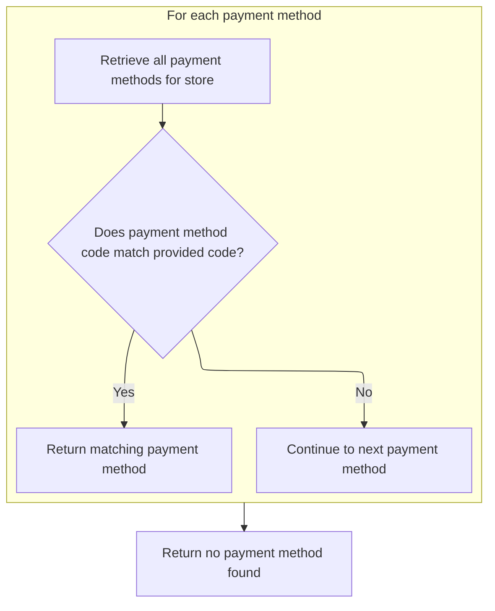
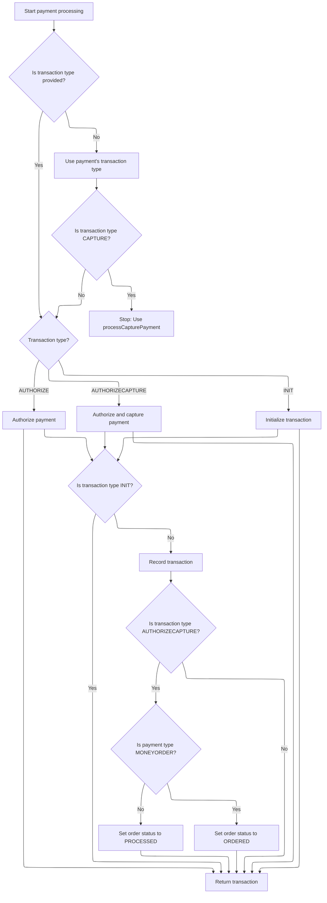

This document describes the flow for processing a payment for an order. Only payment modules configured and active for the merchant store and region are considered. The process validates all required payment and order information, including credit card details when necessary, and determines the transaction type to guide payment execution and order status updates. The flow receives customer, store, payment, cart items, and order details as input, and outputs a transaction record and updated order status.

# Validating and Preparing Payment Module

This section ensures that all prerequisites for processing a payment are met, including validating the payment module configuration and status, setting the correct transaction type, and verifying credit card details when necessary.

| Category        | Rule Name                             | Description                                                                                                                                            |
| --------------- | ------------------------------------- | ------------------------------------------------------------------------------------------------------------------------------------------------------ |
| Data validation | Mandatory input validation            | All required inputs (Customer, MerchantStore, Payment, Order, and Order Total) must be present and not null before proceeding with payment processing. |
| Data validation | Payment module configuration required | A payment module must be configured for the merchant store before any payment can be processed.                                                        |
| Data validation | Active payment module required        | The selected payment module must exist and be active for the payment to proceed.                                                                       |
| Data validation | Payment module existence check        | The payment module referenced by the payment must exist in the system.                                                                                 |
| Data validation | Credit card validation                | If the payment is a credit card payment, the credit card number, type, expiration month, and expiration year must be validated before proceeding.      |
| Business logic  | Default transaction type assignment   | If the payment module does not specify a transaction type, the default transaction type must be set to AUTHORIZECAPTURE.                               |
| Business logic  | Transaction type enforcement          | If the transaction type is AUTHORIZE, the payment must be set to AUTHORIZE; otherwise, it must be set to AUTHORIZECAPTURE.                             |
| Business logic  | Integration module retrieval          | The IntegrationModule for the payment method must be fetched to proceed with payment processing.                                                       |

<SwmSnippet path="/shopizer/sm-core/src/main/java/com/salesmanager/core/business/payments/service/PaymentServiceImpl.java" line="296">

---

We validate the payment setup, check the payment module's existence and status, set the transaction type, and validate credit card info if needed. Then we fetch the IntegrationModule for the payment method to proceed.

```java
	public Transaction processPayment(Customer customer,
			MerchantStore store, Payment payment, List<ShoppingCartItem> items, Order order)
			throws ServiceException {


		Validate.notNull(customer);
		Validate.notNull(store);
		Validate.notNull(payment);
		Validate.notNull(order);
		Validate.notNull(order.getTotal());
		
		payment.setCurrency(store.getCurrency());
		
		BigDecimal amount = order.getTotal();

		//must have a shipping module configured
		Map<String, IntegrationConfiguration> modules = this.getPaymentModulesConfigured(store);
		if(modules==null){
			throw new ServiceException("No payment module configured");
		}
		
		IntegrationConfiguration configuration = modules.get(payment.getModuleName());
		
		if(configuration==null) {
			throw new ServiceException("Payment module " + payment.getModuleName() + " is not configured");
		}
		
		if(!configuration.isActive()) {
			throw new ServiceException("Payment module " + payment.getModuleName() + " is not active");
		}
		
		String sTransactionType = configuration.getIntegrationKeys().get("transaction");
		if(sTransactionType==null) {
			sTransactionType = TransactionType.AUTHORIZECAPTURE.name();
		}
		

		if(sTransactionType.equals(TransactionType.AUTHORIZE.name())) {
			payment.setTransactionType(TransactionType.AUTHORIZE);
		} else {
			payment.setTransactionType(TransactionType.AUTHORIZECAPTURE);
		} 
		

		PaymentModule module = this.paymentModules.get(payment.getModuleName());
		
		if(module==null) {
			throw new ServiceException("Payment module " + payment.getModuleName() + " does not exist");
		}
		
		if(payment instanceof CreditCardPayment) {
			CreditCardPayment creditCardPayment = (CreditCardPayment)payment;
			validateCreditCard(creditCardPayment.getCreditCardNumber(),creditCardPayment.getCreditCard(),creditCardPayment.getExpirationMonth(),creditCardPayment.getExpirationYear());
		}
		
		IntegrationModule integrationModule = getPaymentMethodByCode(store,payment.getModuleName());
```

---

</SwmSnippet>

## Locating the Payment Method Module



This section ensures that only payment methods available to a specific store can be located by their unique code. It prevents selection of payment methods not configured for the store and returns the appropriate module or a null result if not found.

| Category        | Rule Name                      | Description                                                                                                                      |
| --------------- | ------------------------------ | -------------------------------------------------------------------------------------------------------------------------------- |
| Data validation | Store-specific payment methods | Only payment methods that are available to the specified store are considered when searching for a matching payment method code. |
| Business logic  | Return matching payment method | If a payment method with the provided code exists for the store, it is returned as the result.                                   |

<SwmSnippet path="/shopizer/sm-core/src/main/java/com/salesmanager/core/business/payments/service/PaymentServiceImpl.java" line="147">

---

`getPaymentMethodByCode` grabs all payment modules for the store and scans for the one matching the given code. We call `getPaymentMethods` first to get the relevant modules for this store, so we don't accidentally pick up a module that's not available.

```java
	public IntegrationModule getPaymentMethodByCode(MerchantStore store,
			String code) throws ServiceException {
		List<IntegrationModule> modules =  getPaymentMethods(store);

		for(IntegrationModule module : modules) {
			if(module.getCode().equals(code)) {
				
				return module;
			}
		}
		
		return null;
	}
```

---

</SwmSnippet>

## Filtering Store-Specific Payment Modules

This section is responsible for ensuring that only payment modules relevant to a specific store are available for selection and use, based on store attributes such as region.

| Category        | Rule Name                             | Description                                                                                                      |
| --------------- | ------------------------------------- | ---------------------------------------------------------------------------------------------------------------- |
| Data validation | Active module enforcement             | Payment modules that are not active or have been disabled for the store must be excluded from the filtered list. |
| Data validation | Configuration freshness requirement   | The filtering process must always use the latest configuration data for payment modules to ensure accuracy.      |
| Business logic  | Region-based payment module filtering | Only payment modules that are enabled for the store's region must be included in the filtered list.              |

<SwmSnippet path="/shopizer/sm-core/src/main/java/com/salesmanager/core/business/payments/service/PaymentServiceImpl.java" line="75">

---

In `getPaymentMethods`, we start by calling `getIntegrationModules` to get all payment modules from the repository. This gives us the raw list that we'll filter by region to find which modules are valid for the store.

```java
	public List<IntegrationModule> getPaymentMethods(MerchantStore store) throws ServiceException {
		
		List<IntegrationModule> modules =  moduleConfigurationService.getIntegrationModules(PAYMENT_MODULES);
```

---

</SwmSnippet>

### Loading and Enriching Payment Module Data

```mermaid
%%{init: {"flowchart": {"defaultRenderer": "elk"}} }%%
flowchart TD
    node1["Check cache for module configuration"]
    click node1 openCode "shopizer/sm-core/src/main/java/com/salesmanager/core/business/system/service/ModuleConfigurationServiceImpl.java:57:58"
    node1 --> node2{"Is configuration in cache?"}
    click node2 openCode "shopizer/sm-core/src/main/java/com/salesmanager/core/business/system/service/ModuleConfigurationServiceImpl.java:58:58"
    node2 -->|"Yes"| node3["Return cached configuration"]
    click node3 openCode "shopizer/sm-core/src/main/java/com/salesmanager/core/business/system/service/ModuleConfigurationServiceImpl.java:133:134"
    node2 -->|"No"| node4["Load configuration from database"]
    click node4 openCode "shopizer/sm-core/src/main/java/com/salesmanager/core/business/system/service/ModuleConfigurationServiceImpl.java:59:59"
    node4 --> node5["Process modules"]
    click node5 openCode "shopizer/sm-core/src/main/java/com/salesmanager/core/business/system/service/ModuleConfigurationServiceImpl.java:61:126"
    subgraph loop1["For each module"]
        node5 --> node6{"Does module have regions?"}
        click node6 openCode "shopizer/sm-core/src/main/java/com/salesmanager/core/business/system/service/ModuleConfigurationServiceImpl.java:64:71"
        node6 -->|"Yes"| node7["Parse regions"]
        click node7 openCode "shopizer/sm-core/src/main/java/com/salesmanager/core/business/system/service/ModuleConfigurationServiceImpl.java:65:70"
        subgraph loop2["For each region"]
            node7 --> node71["Add region to module's region set"]
            click node71 openCode "shopizer/sm-core/src/main/java/com/salesmanager/core/business/system/service/ModuleConfigurationServiceImpl.java:69:70"
        end
        node6 -->|"No"| node8["Skip regions"]
        click node8 openCode "shopizer/sm-core/src/main/java/com/salesmanager/core/business/system/service/ModuleConfigurationServiceImpl.java:71:71"
        node7 --> node9{"Does module have details?"}
        node8 --> node9
        click node9 openCode "shopizer/sm-core/src/main/java/com/salesmanager/core/business/system/service/ModuleConfigurationServiceImpl.java:75:83"
        node9 -->|"Yes"| node10["Parse and set details"]
        click node10 openCode "shopizer/sm-core/src/main/java/com/salesmanager/core/business/system/service/ModuleConfigurationServiceImpl.java:79:80"
        node9 -->|"No"| node11["Skip details"]
        click node11 openCode "shopizer/sm-core/src/main/java/com/salesmanager/core/business/system/service/ModuleConfigurationServiceImpl.java:83:83"
        node10 --> node12{"Does module have configuration?"}
        node11 --> node12
        click node12 openCode "shopizer/sm-core/src/main/java/com/salesmanager/core/business/system/service/ModuleConfigurationServiceImpl.java:87:123"
        node12 -->|"Yes"| node13["Parse configuration"]
        click node13 openCode "shopizer/sm-core/src/main/java/com/salesmanager/core/business/system/service/ModuleConfigurationServiceImpl.java:91:120"
        subgraph loop3["For each configuration object"]
            node13 --> node131["Map configuration fields (env, scheme, host, etc.)"]
            click node131 openCode "shopizer/sm-core/src/main/java/com/salesmanager/core/business/system/service/ModuleConfigurationServiceImpl.java:99:114"
        end
        node12 -->|"No"| node14["Skip configuration"]
        click node14 openCode "shopizer/sm-core/src/main/java/com/salesmanager/core/business/system/service/ModuleConfigurationServiceImpl.java:123:123"
        node13 --> node15["Continue to next module"]
        node14 --> node15
        click node15 openCode "shopizer/sm-core/src/main/java/com/salesmanager/core/business/system/service/ModuleConfigurationServiceImpl.java:126:126"
    end
    node5 --> node16["Store processed configuration in cache"]
    click node16 openCode "shopizer/sm-core/src/main/java/com/salesmanager/core/business/system/service/ModuleConfigurationServiceImpl.java:127:127"
    node16 --> node17["Return processed configuration"]
    click node17 openCode "shopizer/sm-core/src/main/java/com/salesmanager/core/business/system/service/ModuleConfigurationServiceImpl.java:133:134"
classDef HeadingStyle fill:#777777,stroke:#333,stroke-width:2px;
```



This section is responsible for loading payment module configuration data, enriching it by parsing JSON fields into structured objects, and ensuring the data is cached for efficient future access. The enriched data is used throughout the platform for payment integration and configuration management.

| Category       | Rule Name                | Description                                                                                                                                                      |
| -------------- | ------------------------ | ---------------------------------------------------------------------------------------------------------------------------------------------------------------- |
| Business logic | Region enrichment        | Each module must have its 'regions' field parsed from a JSON string into a set of region identifiers, if the field is present.                                   |
| Business logic | Details enrichment       | Each module must have its 'configDetails' field parsed from a JSON string into a key-value map, if the field is present.                                         |
| Business logic | Configuration enrichment | Each module must have its 'configuration' field parsed from a JSON array into a map of environment identifiers to ModuleConfig objects, if the field is present. |

<SwmSnippet path="/shopizer/sm-core/src/main/java/com/salesmanager/core/business/system/service/ModuleConfigurationServiceImpl.java" line="50">

---

In `getIntegrationModules`, we first try to get the modules from cache. If not found, we fetch them from the DAO and parse the JSON fields ('regions', 'configDetails', 'configuration') into Java collections and objects. This step is needed because the repository stores these fields as JSON strings, not as structured data.

```java
	public List<IntegrationModule> getIntegrationModules(String module) {
		
		
		List<IntegrationModule> modules = null;
		try {
			
			//CacheUtils cacheUtils = CacheUtils.getInstance();
			modules = (List<IntegrationModule>) cache.getFromCache("INTEGRATION_M)" + module);
			if(modules==null) {
				modules = integrationModuleDao.getModulesConfiguration(module);
				//set json objects
				for(IntegrationModule mod : modules) {
					
					String regions = mod.getRegions();
					if(regions!=null) {
						Object objRegions=JSONValue.parse(regions); 
						JSONArray arrayRegions=(JSONArray)objRegions;
						Iterator i = arrayRegions.iterator();
						while(i.hasNext()) {
							mod.getRegionsSet().add((String)i.next());
						}
					}
					
					
					String details = mod.getConfigDetails();
					if(details!=null) {
						
						//Map objects = mapper.readValue(config, Map.class);

						Map<String,String> objDetails= (Map<String, String>) JSONValue.parse(details); 
						mod.setDetails(objDetails);

						
					}
					
					
					String configs = mod.getConfiguration();
					if(configs!=null) {
						
						//Map objects = mapper.readValue(config, Map.class);

						Object objConfigs=JSONValue.parse(configs); 
						JSONArray arrayConfigs=(JSONArray)objConfigs;
						
						Map<String,ModuleConfig> moduleConfigs = new HashMap<String,ModuleConfig>();
						
						Iterator i = arrayConfigs.iterator();
						while(i.hasNext()) {
							
							Map values = (Map)i.next();
							String env = (String)values.get("env");
		            		ModuleConfig config = new ModuleConfig();
		            		config.setScheme((String)values.get("scheme"));
		            		config.setHost((String)values.get("host"));
		            		config.setPort((String)values.get("port"));
		            		config.setUri((String)values.get("uri"));
		            		config.setEnv((String)values.get("env"));
		            		if((String)values.get("config1")!=null) {
		            			config.setConfig1((String)values.get("config1"));
		            		}
		            		if((String)values.get("config2")!=null) {
		            			config.setConfig1((String)values.get("config2"));
		            		}
		            		
		            		moduleConfigs.put(env, config);
		            		
		            		
							
						}
						
						mod.setModuleConfigs(moduleConfigs);
						

					}


				}
```

---

</SwmSnippet>

<SwmSnippet path="/shopizer/sm-core/src/main/java/com/salesmanager/core/business/system/service/ModuleConfigurationServiceImpl.java" line="127">

---

After parsing and enriching the modules, we cache the result using a specific key format and return the list of IntegrationModule objects, ready for filtering and use elsewhere.

```java
				cache.putInCache(modules, "INTEGRATION_M)" + module);
			}

		} catch (Exception e) {
			LOGGER.error("getIntegrationModules()", e);
		}
		return modules;
		
		
	}
```

---

</SwmSnippet>

### Filtering Modules by Store Region

<SwmSnippet path="/shopizer/sm-core/src/main/java/com/salesmanager/core/business/payments/service/PaymentServiceImpl.java" line="78">

---

Back in `getPaymentMethods`, after getting the enriched modules, we filter them by checking if the store's country ISO code or the wildcard '\*' is in the module's regions set. Only those modules are added to the return list, so we only offer payment methods valid for the store's region.

```java
		List<IntegrationModule> returnModules = new ArrayList<IntegrationModule>();
		
		for(IntegrationModule module : modules) {
			if(module.getRegionsSet().contains(store.getCountry().getIsoCode())
					|| module.getRegionsSet().contains("*")) {
				
				returnModules.add(module);
			}
		}
```

---

</SwmSnippet>

## Executing Payment and Updating Order



<SwmSnippet path="/shopizer/sm-core/src/main/java/com/salesmanager/core/business/payments/service/PaymentServiceImpl.java" line="352">

---

After getting the IntegrationModule from `getPaymentMethodByCode`, `processPayment` decides which payment module method to call based on the transaction type. It creates a transaction record unless it's an INIT type, and updates the order status for AUTHORIZECAPTURE payments, reflecting the payment's effect on the order.

```java
		TransactionType transactionType = TransactionType.valueOf(sTransactionType);
		if(transactionType==null) {
			transactionType = payment.getTransactionType();
			if(transactionType.equals(TransactionType.CAPTURE.name())) {
				throw new ServiceException("This method does not allow to process capture transaction. Use processCapturePayment");
			}
		}
		
		Transaction transaction = null;
		if(transactionType == TransactionType.AUTHORIZE)  {
			transaction = module.authorize(store, customer, items, amount, payment, configuration, integrationModule);
		} else if(transactionType == TransactionType.AUTHORIZECAPTURE)  {
			transaction = module.authorizeAndCapture(store, customer, items, amount, payment, configuration, integrationModule);
		} else if(transactionType == TransactionType.INIT)  {
			transaction = module.initTransaction(store, customer, amount, payment, configuration, integrationModule);
		}


		if(transactionType != TransactionType.INIT) {
			transactionService.create(transaction);
		}
		
		if(transactionType == TransactionType.AUTHORIZECAPTURE)  {
			order.setStatus(OrderStatus.ORDERED);
			if(payment.getPaymentType().name()!=PaymentType.MONEYORDER.name()) {
				order.setStatus(OrderStatus.PROCESSED);
			}
		}

		return transaction;

		

	}
```

---

</SwmSnippet>

&nbsp;

*This is an auto-generated document by Swimm 🌊 and has not yet been verified by a human*

<SwmMeta version="3.0.0" repo-id="Z2l0aHViJTNBJTNBU2hvcGl6ZXIlM0ElM0F1bWFsaW5nYXN3YW1p" repo-name="Shopizer"><sup>Powered by [Swimm](https://app.swimm.io/)</sup></SwmMeta>
