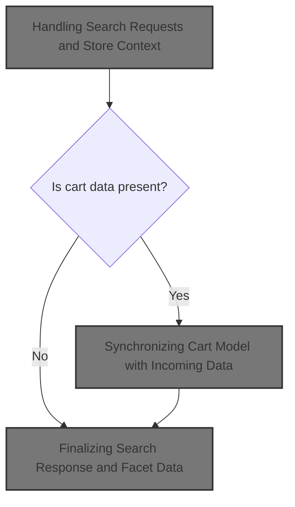

This document outlines the flow for handling search requests, enabling users to find products and categories in the catalogue. The process validates store and language, retrieves available products, compiles detailed product and category information, and synchronizes the cart model if needed. The response includes product count and category facets for efficient catalogue exploration.



# Handling Search Requests and Store Context

This section governs how search requests are processed, ensuring that only valid merchant stores and languages are used, and that the search results include detailed product and category information suitable for client consumption.

| Category        | Rule Name                     | Description                                                                                                                                                                                 |
| --------------- | ----------------------------- | ------------------------------------------------------------------------------------------------------------------------------------------------------------------------------------------- |
| Data validation | Valid Merchant Store Required | A search request must specify a valid merchant store code. If the store code is missing or does not correspond to an existing store, the search request is rejected with an error response. |
| Data validation | Language Fallback             | A search request must specify a valid language code. If the language code is not recognized, the system defaults to the platform's default language.                                        |
| Business logic  | Available Products Only       | Only products that are marked as available are included in the search results returned to the client.                                                                                       |
| Business logic  | Product Count in Response     | The search response must include a count of the products returned in the current result set.                                                                                                |
| Business logic  | Category Facet Reporting      | The search response must include category facet information, listing each category code and the number of products found in that category for the current search.                           |

<SwmSnippet path="/shopizer/sm-shop/src/main/java/com/salesmanager/web/shop/controller/search/SearchController.java" line="138">

---

In <SwmToken path="shopizer/sm-shop/src/main/java/com/salesmanager/web/shop/controller/search/SearchController.java" pos="138:5:5" line-data="	public SearchProductList search(@RequestBody String json, @PathVariable String store, @PathVariable final String language, @PathVariable int start, @PathVariable int max, Model model, HttpServletRequest request, HttpServletResponse response) {">`search`</SwmToken>, we start by validating the merchant store and language context, fetching them from the request or services. If the store isn't found, we bail out with an error response. This sets up the context for the rest of the search flow.

```java
	public SearchProductList search(@RequestBody String json, @PathVariable String store, @PathVariable final String language, @PathVariable int start, @PathVariable int max, Model model, HttpServletRequest request, HttpServletResponse response) {
	
		SearchProductList returnList = new SearchProductList();
		MerchantStore merchantStore = (MerchantStore)request.getAttribute(Constants.MERCHANT_STORE);
		
		try {
			
			Map<String,Language> langs = languageService.getLanguagesMap();
			
			if(merchantStore!=null) {
				if(!merchantStore.getCode().equals(store)) {
					merchantStore = null; //reset for the current request
				}
			}
			
			if(merchantStore== null) {
				merchantStore = merchantStoreService.getByCode(store);
			}
			
			if(merchantStore==null) {
				LOGGER.error("Merchant store is null for code " + store);
				response.sendError(503, "Merchant store is null for code " + store);//TODO localized message
				return null;
			}
			
			Language l = langs.get(language);
			if(l==null) {
				l = languageService.getByCode(Constants.DEFAULT_LANGUAGE);
			}

			SearchResponse resp = searchService.search(merchantStore, language, json, max, start);
			
			List<SearchEntry> entries = resp.getEntries();
			
			if(!CollectionUtils.isEmpty(entries)) {
				List<Long> ids = new ArrayList<Long>();
				for(SearchEntry entry : entries) {
					IndexProduct indexedProduct = entry.getIndexProduct();
					Long id = Long.parseLong(indexedProduct.getId());
					
					//No highlights	
					ids.add(id);
				}
```

---

</SwmSnippet>

<SwmSnippet path="/shopizer/sm-shop/src/main/java/com/salesmanager/web/shop/controller/search/SearchController.java" line="182">

---

After getting search results, we extract product IDs and build a <SwmToken path="shopizer/sm-shop/src/main/java/com/salesmanager/web/shop/controller/search/SearchController.java" pos="182:1:1" line-data="				ProductCriteria searchCriteria = new ProductCriteria();">`ProductCriteria`</SwmToken> to fetch full product details. Then, we use a populator to convert these products into readable objects for the response.

```java
				ProductCriteria searchCriteria = new ProductCriteria();
				searchCriteria.setMaxCount(max);
				searchCriteria.setStartIndex(start);
				searchCriteria.setProductIds(ids);
				searchCriteria.setAvailable(true);
				
				ProductList productList = productService.listByStore(merchantStore, l, searchCriteria);
				
				ReadableProductPopulator populator = new ReadableProductPopulator();
				populator.setPricingService(pricingService);
				
				for(Product product : productList.getProducts()) {
					//create new proxy product
					ReadableProduct p = populator.populate(product, new ReadableProduct(), merchantStore, l);
					
					//com.salesmanager.web.entity.catalog.Product p = catalogUtils.buildProxyProduct(product,merchantStore,LocaleUtils.getLocale(l));
					returnList.getProducts().add(p);
		
				}
```

---

</SwmSnippet>

<SwmSnippet path="/shopizer/sm-shop/src/main/java/com/salesmanager/web/shop/controller/search/SearchController.java" line="201">

---

We tally up products and start extracting facet info for filters.

```java
				returnList.setProductCount(productList.getProducts().size());
			}
			
			//Facets
			Map<String,List<SearchFacet>> facets = resp.getFacets();
			List<SearchFacet> categoriesFacets = null;
			List<SearchFacet> manufacturersFacets = null;
			if(facets!=null) {
				for(String key : facets.keySet()) {
					//supports category and manufacturer
					if(CATEGORY_FACET_NAME.equals(key)) {
						categoriesFacets = facets.get(key);
					}
					
					if(MANUFACTURER_FACET_NAME.equals(key)) {
						manufacturersFacets = facets.get(key);
					}
				}
```

---

</SwmSnippet>

<SwmSnippet path="/shopizer/sm-shop/src/main/java/com/salesmanager/web/shop/controller/search/SearchController.java" line="221">

---

We pull out category codes and product counts from the facet data, setting up for fetching category details next.

```java
				if(categoriesFacets!=null) {
					List<String> categoryCodes = new ArrayList<String>();
					Map<String,Long> productCategoryCount = new HashMap<String,Long>();
					for(SearchFacet facet : categoriesFacets) {
						categoryCodes.add(facet.getName());
						productCategoryCount.put(facet.getKey(), facet.getCount());
					}
```

---

</SwmSnippet>

<SwmSnippet path="/shopizer/sm-shop/src/main/java/com/salesmanager/web/shop/controller/search/SearchController.java" line="229">

---

We fetch category details using the codes, convert them to readable objects, and attach product counts. This prepares category data for the client, right before we move on to cart population.

```java
					List<Category> categories = categoryService.listByCodes(merchantStore, categoryCodes, l);
					List<ReadableCategory> categoryProxies = new ArrayList<ReadableCategory>();
					ReadableCategoryPopulator populator = new ReadableCategoryPopulator();
					
					for(Category category : categories) {
						//com.salesmanager.web.entity.catalog.Category categoryProxy = catalogUtils.buildProxyCategory(category, merchantStore, LocaleUtils.getLocale(l));
						ReadableCategory categoryProxy = populator.populate(category, new ReadableCategory(), merchantStore, l);
						Long total = productCategoryCount.get(categoryProxy.getCode());
						if(total!=null) {
							categoryProxy.setProductCount(total.intValue());
						}
						categoryProxies.add(categoryProxy);
					}
```

---

</SwmSnippet>

## Synchronizing Cart Model with Incoming Data

```mermaid
%%{init: {"flowchart": {"defaultRenderer": "elk"}} }%%
flowchart TD
    node1["Receive cart data"] --> node2{"Is cart ID > 0 and code present?"}
    click node1 openCode "shopizer/sm-shop/src/main/java/com/salesmanager/web/populator/shoppingCart/ShoppingCartModelPopulator.java:85:91"
    node2 -->|"Yes"| node3["Retrieve existing cart"]
    click node2 openCode "shopizer/sm-shop/src/main/java/com/salesmanager/web/populator/shoppingCart/ShoppingCartModelPopulator.java:91:104"
    node2 -->|"No"| node4["Create new cart"]
    click node3 openCode "shopizer/sm-shop/src/main/java/com/salesmanager/web/populator/shoppingCart/ShoppingCartModelPopulator.java:93:104"
    click node4 openCode "shopizer/sm-shop/src/main/java/com/salesmanager/web/populator/shoppingCart/ShoppingCartModelPopulator.java:107:114"
    node3 --> node5["Set cart code, store, customer"]
    node4 --> node5
    click node5 openCode "shopizer/sm-shop/src/main/java/com/salesmanager/web/populator/shoppingCart/ShoppingCartModelPopulator.java:96:112"
    node5 --> node6["Process cart items"]
    click node6 openCode "shopizer/sm-shop/src/main/java/com/salesmanager/web/populator/shoppingCart/ShoppingCartModelPopulator.java:116:176"
    
    subgraph loop1["For each item in cart"]
        node6 --> node7{"Does item exist in cart model?"}
        click node7 openCode "shopizer/sm-shop/src/main/java/com/salesmanager/web/populator/shoppingCart/ShoppingCartModelPopulator.java:124:161"
        node7 -->|"Yes"| node8{"Does item have attributes?"}
        click node8 openCode "shopizer/sm-shop/src/main/java/com/salesmanager/web/populator/shoppingCart/ShoppingCartModelPopulator.java:138:153"
        node8 -->|"Yes"| node9["Update item attributes"]
        click node9 openCode "shopizer/sm-shop/src/main/java/com/salesmanager/web/populator/shoppingCart/ShoppingCartModelPopulator.java:141:152"
        node8 -->|"No"| node10["Remove all item attributes"]
        click node10 openCode "shopizer/sm-shop/src/main/java/com/salesmanager/web/populator/shoppingCart/ShoppingCartModelPopulator.java:156:157"
        node9 --> node11["Update item quantity"]
        node10 --> node11
        click node11 openCode "shopizer/sm-shop/src/main/java/com/salesmanager/web/populator/shoppingCart/ShoppingCartModelPopulator.java:132:133"
        node11 --> node13["Continue"]
        node7 -->|"No"| node12["Create new item and update cart model"]
        click node12 openCode "shopizer/sm-shop/src/main/java/com/salesmanager/web/populator/shoppingCart/ShoppingCartModelPopulator.java:164:174"
        node12 --> node13
    end
    node6 --> node14["Return updated cart model"]
    click node14 openCode "shopizer/sm-shop/src/main/java/com/salesmanager/web/populator/shoppingCart/ShoppingCartModelPopulator.java:187:188"

classDef HeadingStyle fill:#777777,stroke:#333,stroke-width:2px;

%% Swimm:
%% %%{init: {"flowchart": {"defaultRenderer": "elk"}} }%%
%% flowchart TD
%%     node1["Receive cart data"] --> node2{"Is cart ID > 0 and code present?"}
%%     click node1 openCode "<SwmPath>[shopizer/…/shoppingCart/ShoppingCartModelPopulator.java](shopizer/sm-shop/src/main/java/com/salesmanager/web/populator/shoppingCart/ShoppingCartModelPopulator.java)</SwmPath>:85:91"
%%     node2 -->|"Yes"| node3["Retrieve existing cart"]
%%     click node2 openCode "<SwmPath>[shopizer/…/shoppingCart/ShoppingCartModelPopulator.java](shopizer/sm-shop/src/main/java/com/salesmanager/web/populator/shoppingCart/ShoppingCartModelPopulator.java)</SwmPath>:91:104"
%%     node2 -->|"No"| node4["Create new cart"]
%%     click node3 openCode "<SwmPath>[shopizer/…/shoppingCart/ShoppingCartModelPopulator.java](shopizer/sm-shop/src/main/java/com/salesmanager/web/populator/shoppingCart/ShoppingCartModelPopulator.java)</SwmPath>:93:104"
%%     click node4 openCode "<SwmPath>[shopizer/…/shoppingCart/ShoppingCartModelPopulator.java](shopizer/sm-shop/src/main/java/com/salesmanager/web/populator/shoppingCart/ShoppingCartModelPopulator.java)</SwmPath>:107:114"
%%     node3 --> node5["Set cart code, store, customer"]
%%     node4 --> node5
%%     click node5 openCode "<SwmPath>[shopizer/…/shoppingCart/ShoppingCartModelPopulator.java](shopizer/sm-shop/src/main/java/com/salesmanager/web/populator/shoppingCart/ShoppingCartModelPopulator.java)</SwmPath>:96:112"
%%     node5 --> node6["Process cart items"]
%%     click node6 openCode "<SwmPath>[shopizer/…/shoppingCart/ShoppingCartModelPopulator.java](shopizer/sm-shop/src/main/java/com/salesmanager/web/populator/shoppingCart/ShoppingCartModelPopulator.java)</SwmPath>:116:176"
%%     
%%     subgraph loop1["For each item in cart"]
%%         node6 --> node7{"Does item exist in cart model?"}
%%         click node7 openCode "<SwmPath>[shopizer/…/shoppingCart/ShoppingCartModelPopulator.java](shopizer/sm-shop/src/main/java/com/salesmanager/web/populator/shoppingCart/ShoppingCartModelPopulator.java)</SwmPath>:124:161"
%%         node7 -->|"Yes"| node8{"Does item have attributes?"}
%%         click node8 openCode "<SwmPath>[shopizer/…/shoppingCart/ShoppingCartModelPopulator.java](shopizer/sm-shop/src/main/java/com/salesmanager/web/populator/shoppingCart/ShoppingCartModelPopulator.java)</SwmPath>:138:153"
%%         node8 -->|"Yes"| node9["Update item attributes"]
%%         click node9 openCode "<SwmPath>[shopizer/…/shoppingCart/ShoppingCartModelPopulator.java](shopizer/sm-shop/src/main/java/com/salesmanager/web/populator/shoppingCart/ShoppingCartModelPopulator.java)</SwmPath>:141:152"
%%         node8 -->|"No"| node10["Remove all item attributes"]
%%         click node10 openCode "<SwmPath>[shopizer/…/shoppingCart/ShoppingCartModelPopulator.java](shopizer/sm-shop/src/main/java/com/salesmanager/web/populator/shoppingCart/ShoppingCartModelPopulator.java)</SwmPath>:156:157"
%%         node9 --> node11["Update item quantity"]
%%         node10 --> node11
%%         click node11 openCode "<SwmPath>[shopizer/…/shoppingCart/ShoppingCartModelPopulator.java](shopizer/sm-shop/src/main/java/com/salesmanager/web/populator/shoppingCart/ShoppingCartModelPopulator.java)</SwmPath>:132:133"
%%         node11 --> node13["Continue"]
%%         node7 -->|"No"| node12["Create new item and update cart model"]
%%         click node12 openCode "<SwmPath>[shopizer/…/shoppingCart/ShoppingCartModelPopulator.java](shopizer/sm-shop/src/main/java/com/salesmanager/web/populator/shoppingCart/ShoppingCartModelPopulator.java)</SwmPath>:164:174"
%%         node12 --> node13
%%     end
%%     node6 --> node14["Return updated cart model"]
%%     click node14 openCode "<SwmPath>[shopizer/…/shoppingCart/ShoppingCartModelPopulator.java](shopizer/sm-shop/src/main/java/com/salesmanager/web/populator/shoppingCart/ShoppingCartModelPopulator.java)</SwmPath>:187:188"
%% 
%% classDef HeadingStyle fill:#777777,stroke:#333,stroke-width:2px;
```



This section ensures that the <SwmToken path="shopizer/sm-shop/src/main/java/com/salesmanager/web/populator/shoppingCart/ShoppingCartModelPopulator.java" pos="85:3:3" line-data="    public ShoppingCart populate(ShoppingCartData shoppingCart,ShoppingCart cartMdel,final MerchantStore store, Language language)">`ShoppingCart`</SwmToken> model in the system accurately reflects the incoming cart data, either by updating an existing cart or creating a new one, and synchronizing all line items and their attributes.

| Category       | Rule Name               | Description                                                                                                                                                                         |
| -------------- | ----------------------- | ----------------------------------------------------------------------------------------------------------------------------------------------------------------------------------- |
| Business logic | Existing cart retrieval | If the incoming cart data contains a cart ID greater than zero and a non-blank cart code, the system must attempt to retrieve the existing cart using the provided code and store.  |
| Business logic | New cart creation       | If the incoming cart data does not contain a valid cart ID and code, a new cart must be created using the provided code, store, and customer information.                           |
| Business logic | Item synchronization    | For each item in the incoming cart data, if the item exists in the current cart model (matched by item ID), its quantity and attributes must be updated to match the incoming data. |
| Business logic | Attribute removal       | If an existing cart item has no attributes in the incoming data, all attributes for that item must be removed from the cart model.                                                  |
| Business logic | New item addition       | If an item in the incoming cart data does not exist in the current cart model, a new item must be created and added to the cart model.                                              |

<SwmSnippet path="/shopizer/sm-shop/src/main/java/com/salesmanager/web/populator/shoppingCart/ShoppingCartModelPopulator.java" line="85">

---

In <SwmToken path="shopizer/sm-shop/src/main/java/com/salesmanager/web/populator/shoppingCart/ShoppingCartModelPopulator.java" pos="85:5:5" line-data="    public ShoppingCart populate(ShoppingCartData shoppingCart,ShoppingCart cartMdel,final MerchantStore store, Language language)">`populate`</SwmToken>, we either fetch or create a <SwmToken path="shopizer/sm-shop/src/main/java/com/salesmanager/web/populator/shoppingCart/ShoppingCartModelPopulator.java" pos="85:3:3" line-data="    public ShoppingCart populate(ShoppingCartData shoppingCart,ShoppingCart cartMdel,final MerchantStore store, Language language)">`ShoppingCart`</SwmToken> model based on the incoming data's id and code, then sync line items and their attributes by matching IDs or creating new entries as needed.

```java
    public ShoppingCart populate(ShoppingCartData shoppingCart,ShoppingCart cartMdel,final MerchantStore store, Language language)
    {


        // if id >0 get the original from the database, override products
       try{
        if ( shoppingCart.getId() > 0  && StringUtils.isNotBlank( shoppingCart.getCode()))
        {
            cartMdel = shoppingCartService.getByCode( shoppingCart.getCode(), store );
            if(cartMdel==null){
                cartMdel=new ShoppingCart();
                cartMdel.setShoppingCartCode( shoppingCart.getCode() );
                cartMdel.setMerchantStore( store );
                if ( customer != null )
                {
                    cartMdel.setCustomerId( customer.getId() );
                }
                shoppingCartService.create( cartMdel );
            }
        }
        else
        {
            cartMdel.setShoppingCartCode( shoppingCart.getCode() );
            cartMdel.setMerchantStore( store );
            if ( customer != null )
            {
                cartMdel.setCustomerId( customer.getId() );
            }
            shoppingCartService.create( cartMdel );
        }

        List<ShoppingCartItem> items = shoppingCart.getShoppingCartItems();
        Set<com.salesmanager.core.business.shoppingcart.model.ShoppingCartItem> newItems =
            new HashSet<com.salesmanager.core.business.shoppingcart.model.ShoppingCartItem>();
        if ( items != null && items.size() > 0 )
        {
            for ( ShoppingCartItem item : items )
            {

                Set<com.salesmanager.core.business.shoppingcart.model.ShoppingCartItem> cartItems = cartMdel.getLineItems();
                if ( cartItems != null && cartItems.size() > 0 )
                {

                    for ( com.salesmanager.core.business.shoppingcart.model.ShoppingCartItem dbItem : cartItems )
                    {
                        if ( dbItem.getId().longValue() == item.getId() )
                        {
                            dbItem.setQuantity( item.getQuantity() );
                            // compare attributes
                            Set<com.salesmanager.core.business.shoppingcart.model.ShoppingCartAttributeItem> attributes =
                                dbItem.getAttributes();
                            Set<com.salesmanager.core.business.shoppingcart.model.ShoppingCartAttributeItem> newAttributes =
                                new HashSet<com.salesmanager.core.business.shoppingcart.model.ShoppingCartAttributeItem>();
                            List<ShoppingCartAttribute> cartAttributes = item.getShoppingCartAttributes();
                            if ( !CollectionUtils.isEmpty( cartAttributes ) )
                            {
                                for ( ShoppingCartAttribute attribute : cartAttributes )
                                {
                                    for ( com.salesmanager.core.business.shoppingcart.model.ShoppingCartAttributeItem dbAttribute : attributes )
                                    {
                                        if ( dbAttribute.getId().longValue() == attribute.getId() )
                                        {
                                            newAttributes.add( dbAttribute );
                                        }
                                    }
                                }
                                
                                dbItem.setAttributes( newAttributes );
                            }
                            else
                            {
                                dbItem.removeAllAttributes();
                            }
                            newItems.add( dbItem );
                        }
                    }
                }
                else
                {// create new item
                    com.salesmanager.core.business.shoppingcart.model.ShoppingCartItem cartItem =
                        createCartItem( cartMdel, item, store );
                    Set<com.salesmanager.core.business.shoppingcart.model.ShoppingCartItem> lineItems =
                        cartMdel.getLineItems();
                    if ( lineItems == null )
                    {
                        lineItems = new HashSet<com.salesmanager.core.business.shoppingcart.model.ShoppingCartItem>();
                        cartMdel.setLineItems( lineItems );
                    }
                    lineItems.add( cartItem );
                    shoppingCartService.update( cartMdel );
                }
            }// end for
```

---

</SwmSnippet>

<SwmSnippet path="/shopizer/sm-shop/src/main/java/com/salesmanager/web/populator/shoppingCart/ShoppingCartModelPopulator.java" line="176">

---

We return the updated <SwmToken path="shopizer/sm-shop/src/main/java/com/salesmanager/web/populator/shoppingCart/ShoppingCartModelPopulator.java" pos="85:3:3" line-data="    public ShoppingCart populate(ShoppingCartData shoppingCart,ShoppingCart cartMdel,final MerchantStore store, Language language)">`ShoppingCart`</SwmToken> model, or throw an exception if something goes wrong during conversion.

```java
            }// end for
        }// end if
       }catch(ServiceException se){
           LOG.error( "Error while converting cart data to cart model.."+se );
           throw new ConversionException( "Unable to create cart model", se ); 
       }
       catch (Exception ex){
           LOG.error( "Error while converting cart data to cart model.."+ex );
           throw new ConversionException( "Unable to create cart model", ex );  
       }

        return cartMdel;
    }
```

---

</SwmSnippet>

## Finalizing Search Response and Facet Data

<SwmSnippet path="/shopizer/sm-shop/src/main/java/com/salesmanager/web/shop/controller/search/SearchController.java" line="242">

---

Back in `SearchController.search`, after cart population, we attach category facets and finalize the response object for the client.

```java
					returnList.setCategoryFacets(categoryProxies);
				}
				
				//todo manufacturer facets
				if(manufacturersFacets!=null) {
					
				}
				
				
			}
		} catch (Exception e) {
			LOGGER.error("Exception occured while querying " + json,e);
		}
		

		
		return returnList;
		
	}
```

---

</SwmSnippet>

&nbsp;

*This is an auto-generated document by Swimm 🌊 and has not yet been verified by a human*

<SwmMeta version="3.0.0" repo-id="Z2l0aHViJTNBJTNBU2hvcGl6ZXIlM0ElM0F1bWFsaW5nYXN3YW1p" repo-name="Shopizer"><sup>Powered by [Swimm](https://app.swimm.io/)</sup></SwmMeta>
