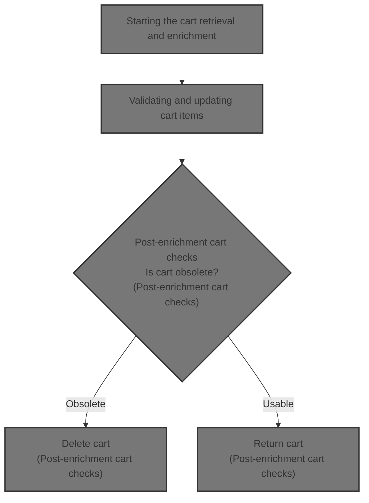
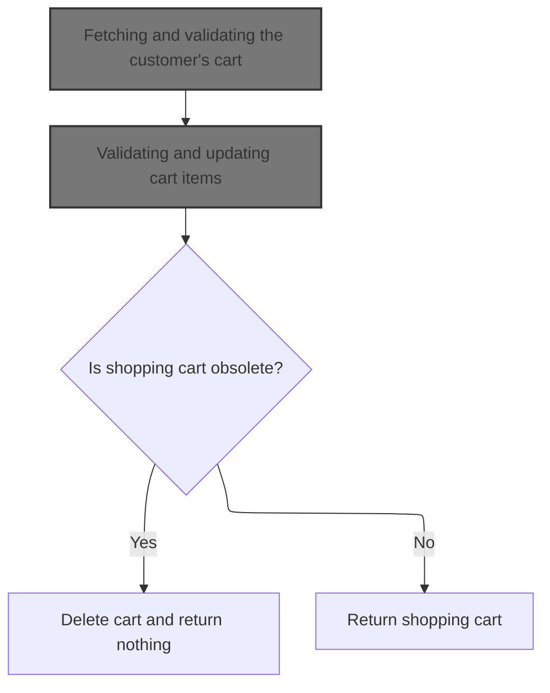
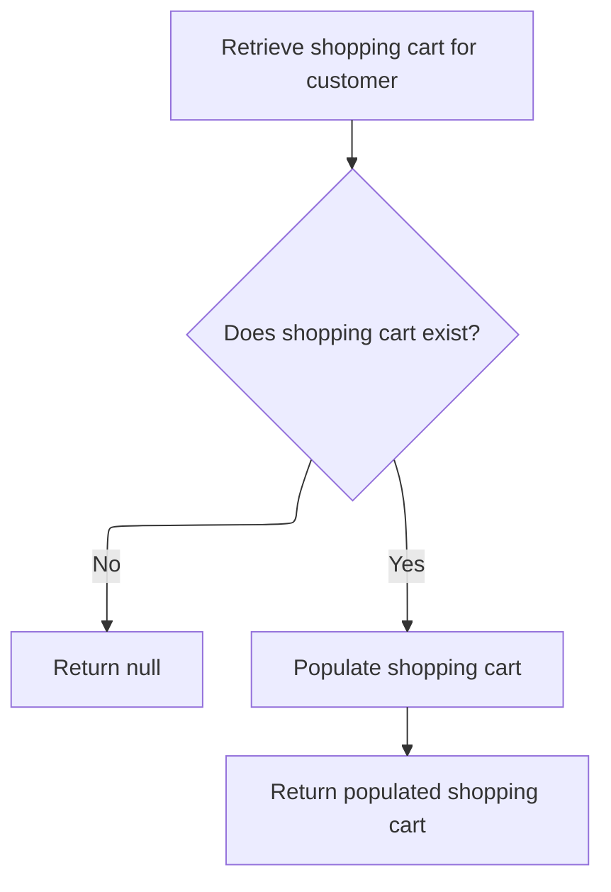
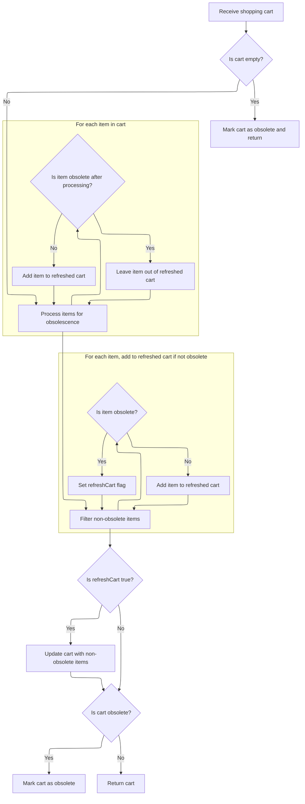
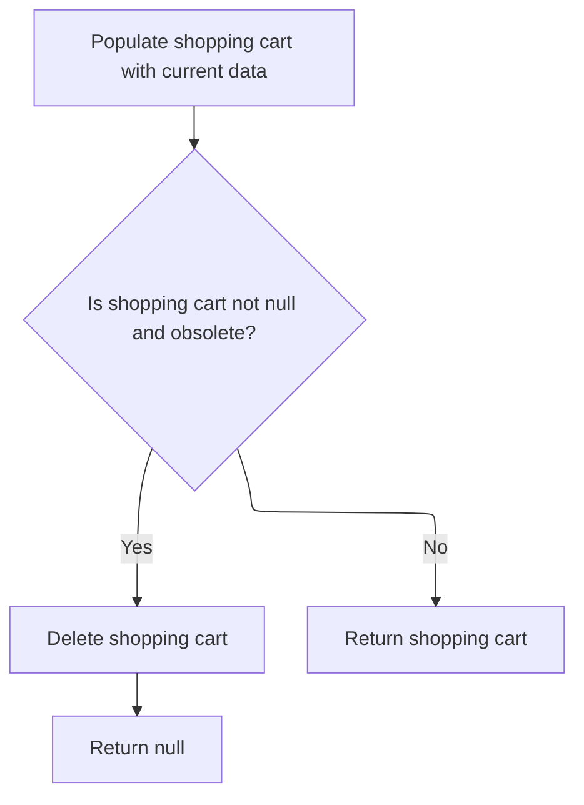

This document outlines the process of providing a customer with their current shopping cart. When a cart is requested, it is retrieved, validated, and updated to ensure only usable carts are returned. If the cart is obsolete, it is deleted and not returned.



# Starting the cart retrieval and enrichment



<SwmSnippet path="/shopizer/sm-core/src/main/java/com/salesmanager/core/business/shoppingcart/service/ShoppingCartServiceImpl.java" line="68">

---

In `getShoppingCart`, we kick off by grabbing the cart for a customer using the DAO. This only gets us the basic cart, so next we call `getByCustomer` to fetch and then enrich the cart with domain-specific details. That enrichment step is needed because the raw cart isn't ready for use yet.

```java
	public ShoppingCart getShoppingCart(final Customer customer) throws ServiceException {

		try {

			ShoppingCart shoppingCart = shoppingCartDao.getByCustomer(customer);
```

---

</SwmSnippet>

## Fetching and validating the customer's cart



<SwmSnippet path="/shopizer/sm-core/src/main/java/com/salesmanager/core/business/shoppingcart/service/ShoppingCartServiceImpl.java" line="209">

---

`getByCustomer` grabs the cart for a customer from the DAO. If the cart exists, it immediately passes it to `populateShoppingCart` to update and validate the cart and its items. If there's no cart, it just returns null.

```java
	public ShoppingCart getByCustomer(final Customer customer) throws ServiceException {

		try {
			ShoppingCart shoppingCart = shoppingCartDao.getByCustomer(customer);
			if(shoppingCart==null) {
				return null;
			}
			return populateShoppingCart(shoppingCart);


		} catch (Exception e) {
			throw new ServiceException(e);
		}
	}
```

---

</SwmSnippet>

## Validating and updating cart items



<SwmSnippet path="/shopizer/sm-core/src/main/java/com/salesmanager/core/business/shoppingcart/service/ShoppingCartServiceImpl.java" line="225">

---

In `populateShoppingCart`, we check if the cart or its items are missing. If so, we mark the cart as obsolete and bail out. Otherwise, we loop through each item, update it, and check if it's obsolete. This sets up the next step where we clean up obsolete items and possibly refresh the cart.

```java
	private ShoppingCart populateShoppingCart(final ShoppingCart shoppingCart) throws Exception {

		try {

			boolean cartIsObsolete = true;
			if(shoppingCart!=null) {

				Set<ShoppingCartItem> items = shoppingCart.getLineItems();
				if(items==null || items.size()==0) {
					shoppingCart.setObsolete(true);
					return shoppingCart;

				}

				//Set<ShoppingCartItem> shoppingCartItems = new HashSet<ShoppingCartItem>();
				for(ShoppingCartItem item : items) {
					LOGGER.debug("Populate item " + item.getId());
					populateItem(item);
					LOGGER.debug("Obsolete item ? " + item.isObsolete());
					if(item.isObsolete()) {
					} else {
						cartIsObsolete = false;
					}
				}
```

---

</SwmSnippet>

<SwmSnippet path="/shopizer/sm-core/src/main/java/com/salesmanager/core/business/shoppingcart/service/ShoppingCartServiceImpl.java" line="250">

---

After checking and updating each item, we build a new set of non-obsolete items. If any items were removed, we flag the cart for refresh. This sets up the final step where we update the cart and handle obsolescence.

```java
				//shoppingCart.setLineItems(shoppingCartItems);
				boolean refreshCart = false;
                Set<ShoppingCartItem> refreshedItems = new HashSet<ShoppingCartItem>();
                for(ShoppingCartItem item : items) {
                	if(!item.isObsolete()) {
                		refreshedItems.add(item);
                	} else {
                		refreshCart = true;
                	}
                }
```

---

</SwmSnippet>

<SwmSnippet path="/shopizer/sm-core/src/main/java/com/salesmanager/core/business/shoppingcart/service/ShoppingCartServiceImpl.java" line="261">

---

Finally, we update the cart if items were removed, mark it obsolete if needed, and return the updated cart. This wraps up the validation and cleanup so the caller gets a cart that's either usable or flagged obsolete.

```java
                if(refreshCart) {
                	shoppingCart.setLineItems(refreshedItems);
                	update(shoppingCart);
                }

				if(cartIsObsolete) {
					shoppingCart.setObsolete(true);
				}
				return shoppingCart;
			}

		} catch (Exception e) {
			throw new ServiceException(e);
		}

		return shoppingCart;

	}
```

---

</SwmSnippet>

## Post-enrichment cart checks



<SwmSnippet path="/shopizer/sm-core/src/main/java/com/salesmanager/core/business/shoppingcart/service/ShoppingCartServiceImpl.java" line="73">

---

Back in `getShoppingCart`, after getting the cart from `getByCustomer`, we run `populateShoppingCart` to make sure the cart is fully enriched and validated before returning it.

```java
			populateShoppingCart(shoppingCart);
```

---

</SwmSnippet>

<SwmSnippet path="/shopizer/sm-core/src/main/java/com/salesmanager/core/business/shoppingcart/service/ShoppingCartServiceImpl.java" line="74">

---

We delete and return null if the cart is obsolete, otherwise we return the cart.

```java
			if(shoppingCart!=null && shoppingCart.isObsolete()) {
				delete(shoppingCart);
				return null;
			} else {
				return shoppingCart;
			}


		} catch (Exception e) {
			throw new ServiceException(e);
		}

	}
```

---

</SwmSnippet>

&nbsp;

*This is an auto-generated document by Swimm 🌊 and has not yet been verified by a human*

<SwmMeta version="3.0.0" repo-id="Z2l0aHViJTNBJTNBU2hvcGl6ZXIlM0ElM0F1bWFsaW5nYXN3YW1p" repo-name="Shopizer"><sup>Powered by [Swimm](https://app.swimm.io/)</sup></SwmMeta>
