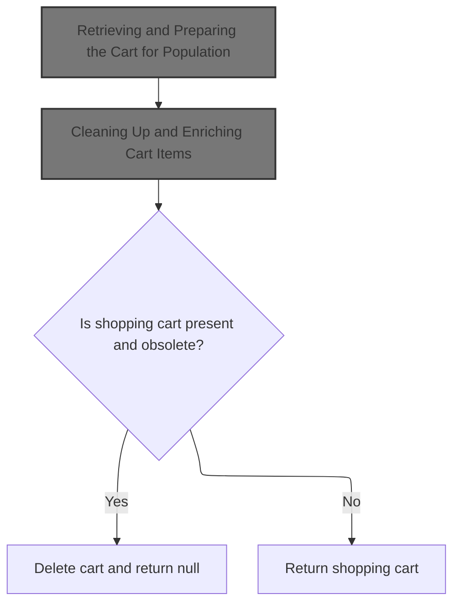
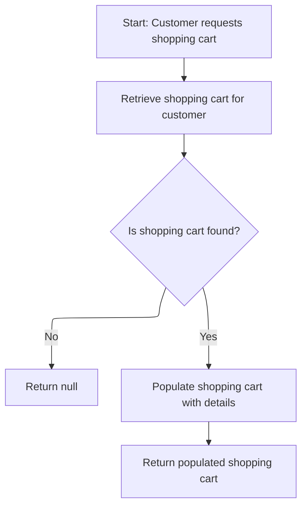
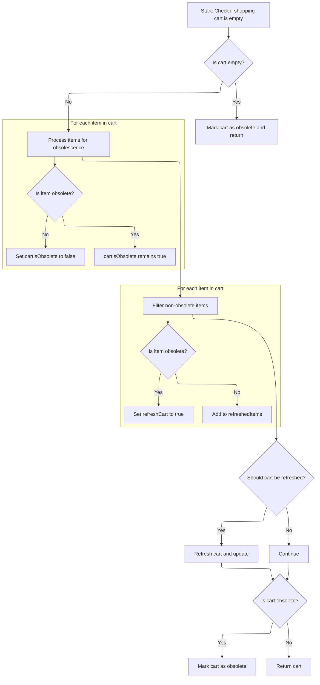
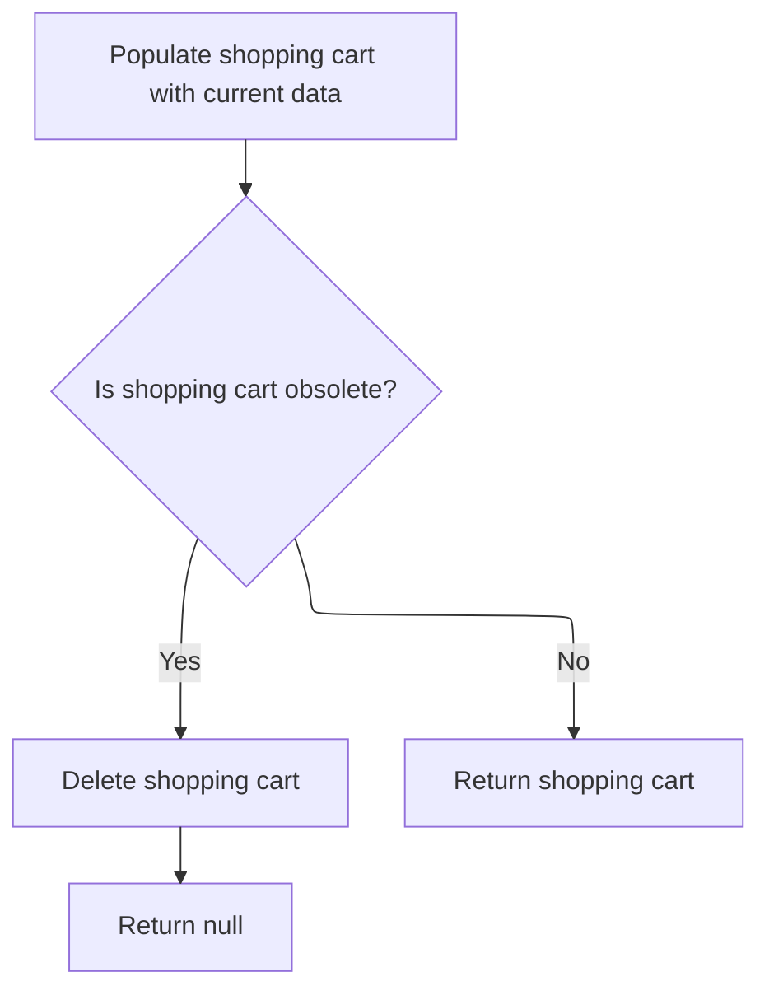

This document outlines the process of providing customers with a validated shopping cart. When a customer requests their cart, the system retrieves it, removes obsolete items, enriches valid items, and ensures only current carts are returned. If the cart is obsolete, it is deleted and not shown to the customer.

# Fetching and Validating the Customer's Cart



<SwmSnippet path="/shopizer/sm-core/src/main/java/com/salesmanager/core/business/shoppingcart/service/ShoppingCartServiceImpl.java" line="68">

---

In `getShoppingCart`, we start by grabbing the cart for the customer using the DAO. This isn't just a fetch—next, we need to call `getByCustomer` to get a cart that's already checked for existence and ready for population. The flow expects the customer to be valid, so no null checks here. The next step is to enrich the cart and clean up any obsolete items, which is why we don't just return the raw cart.

```java
	public ShoppingCart getShoppingCart(final Customer customer) throws ServiceException {

		try {

			ShoppingCart shoppingCart = shoppingCartDao.getByCustomer(customer);
```

---

</SwmSnippet>

## Retrieving and Preparing the Cart for Population



<SwmSnippet path="/shopizer/sm-core/src/main/java/com/salesmanager/core/business/shoppingcart/service/ShoppingCartServiceImpl.java" line="209">

---

`getByCustomer` checks if the cart exists for the customer, returns null if not, and otherwise passes the cart to `populateShoppingCart`. This means any cart returned is already processed for obsolete items and enriched with details, so the next step always gets a usable cart.

```java
	public ShoppingCart getByCustomer(final Customer customer) throws ServiceException {

		try {
			ShoppingCart shoppingCart = shoppingCartDao.getByCustomer(customer);
			if(shoppingCart==null) {
				return null;
			}
			return populateShoppingCart(shoppingCart);


		} catch (Exception e) {
			throw new ServiceException(e);
		}
	}
```

---

</SwmSnippet>

## Cleaning Up and Enriching Cart Items



<SwmSnippet path="/shopizer/sm-core/src/main/java/com/salesmanager/core/business/shoppingcart/service/ShoppingCartServiceImpl.java" line="225">

---

In `populateShoppingCart`, we check if the cart or its items are empty, and if so, mark the cart as obsolete. Then we loop through each item, enrich it, and flag the cart as not obsolete if any item is valid. This sets up the next step, where we clean out obsolete items and possibly update the cart.

```java
	private ShoppingCart populateShoppingCart(final ShoppingCart shoppingCart) throws Exception {

		try {

			boolean cartIsObsolete = true;
			if(shoppingCart!=null) {

				Set<ShoppingCartItem> items = shoppingCart.getLineItems();
				if(items==null || items.size()==0) {
					shoppingCart.setObsolete(true);
					return shoppingCart;

				}

				//Set<ShoppingCartItem> shoppingCartItems = new HashSet<ShoppingCartItem>();
				for(ShoppingCartItem item : items) {
					LOGGER.debug("Populate item " + item.getId());
					populateItem(item);
					LOGGER.debug("Obsolete item ? " + item.isObsolete());
					if(item.isObsolete()) {
					} else {
						cartIsObsolete = false;
					}
				}
```

---

</SwmSnippet>

<SwmSnippet path="/shopizer/sm-core/src/main/java/com/salesmanager/core/business/shoppingcart/service/ShoppingCartServiceImpl.java" line="250">

---

After checking each item's obsolescence, we build a new set of valid items and flag if any cleanup is needed. This sets up the next step, where we update the cart if changes were made.

```java
				//shoppingCart.setLineItems(shoppingCartItems);
				boolean refreshCart = false;
                Set<ShoppingCartItem> refreshedItems = new HashSet<ShoppingCartItem>();
                for(ShoppingCartItem item : items) {
                	if(!item.isObsolete()) {
                		refreshedItems.add(item);
                	} else {
                		refreshCart = true;
                	}
                }
```

---

</SwmSnippet>

<SwmSnippet path="/shopizer/sm-core/src/main/java/com/salesmanager/core/business/shoppingcart/service/ShoppingCartServiceImpl.java" line="261">

---

After cleaning up obsolete items, we update the cart if needed and mark it obsolete if nothing valid remains. The function returns the cart in its final state, ready for the next step or deletion.

```java
                if(refreshCart) {
                	shoppingCart.setLineItems(refreshedItems);
                	update(shoppingCart);
                }

				if(cartIsObsolete) {
					shoppingCart.setObsolete(true);
				}
				return shoppingCart;
			}

		} catch (Exception e) {
			throw new ServiceException(e);
		}

		return shoppingCart;

	}
```

---

</SwmSnippet>

## Final Cart Validation and Cleanup



<SwmSnippet path="/shopizer/sm-core/src/main/java/com/salesmanager/core/business/shoppingcart/service/ShoppingCartServiceImpl.java" line="73">

---

After getting the cart, we run another population step to make sure it's fully up to date.

```java
			populateShoppingCart(shoppingCart);
```

---

</SwmSnippet>

<SwmSnippet path="/shopizer/sm-core/src/main/java/com/salesmanager/core/business/shoppingcart/service/ShoppingCartServiceImpl.java" line="74">

---

After running `populateShoppingCart`, we check if the cart is obsolete. If it is, we delete it and return null; otherwise, we return the cleaned-up cart. This enforces the rule that only valid carts are kept.

```java
			if(shoppingCart!=null && shoppingCart.isObsolete()) {
				delete(shoppingCart);
				return null;
			} else {
				return shoppingCart;
			}


		} catch (Exception e) {
			throw new ServiceException(e);
		}

	}
```

---

</SwmSnippet>

&nbsp;

*This is an auto-generated document by Swimm 🌊 and has not yet been verified by a human*

<SwmMeta version="3.0.0" repo-id="Z2l0aHViJTNBJTNBU2hvcGl6ZXIlM0ElM0F1bWFsaW5nYXN3YW1p" repo-name="Shopizer"><sup>Powered by [Swimm](https://app.swimm.io/)</sup></SwmMeta>
