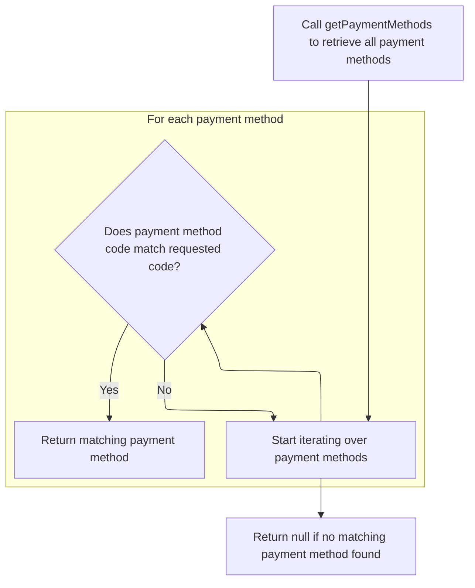
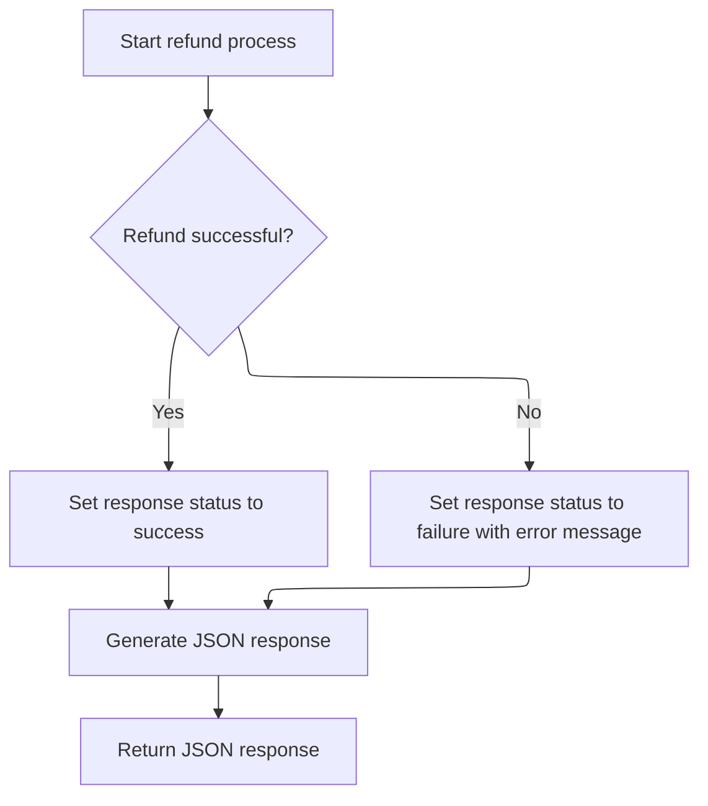

This document describes the refund order flow, which handles refund requests by validating order and customer data, verifying payment module configuration, executing the refund transaction, and updating order totals and status. The flow receives refund request details as input and returns a confirmation or failure response, ensuring accurate refund handling and order state management.

# Starting the refund validation and setup

This section handles the validation and setup process for refund requests in the e-commerce platform.

| Category        | Rule Name                     | Description                                                                                       |
| --------------- | ----------------------------- | ------------------------------------------------------------------------------------------------- |
| Data validation | Order existence validation    | The refund request must reference an existing order in the system.                                |
| Data validation | Merchant ownership validation | The order must belong to the merchant store processing the refund.                                |
| Data validation | Refund amount validation      | The refund amount must be a valid number greater than zero and not exceed the total order amount. |
| Data validation | Customer existence validation | The customer associated with the order must exist in the system.                                  |
| Business logic  | Refund transaction processing | Upon successful validation, the refund transaction is processed through the payment service.      |

<SwmSnippet path="/shopizer/sm-shop/src/main/java/com/salesmanager/web/admin/controller/orders/OrderActionsControler.java" line="143">

---

Here we start by validating the refund request: checking the order exists, belongs to the right merchant, and the refund amount is valid and within limits. We also verify the customer exists. Once these checks pass, we call the payment service to handle the actual refund transaction.

```java
	public @ResponseBody String refundOrder(@RequestBody Refund refund, HttpServletRequest request, HttpServletResponse response, Locale locale) {


		MerchantStore store = (MerchantStore)request.getAttribute(Constants.ADMIN_STORE);
		
		
		AjaxResponse resp = new AjaxResponse();

		BigDecimal submitedAmount = null;
		
		try {
			
			Order order = orderService.getById(refund.getOrderId());
			
			if(order==null) {
				
				LOGGER.error("Order {0} does not exists", refund.getOrderId());
				resp.setStatus(AjaxResponse.RESPONSE_STATUS_FAIURE);
				return resp.toJSONString();
			}
			
			if(order.getMerchant().getId().intValue()!=store.getId().intValue()) {
				
				LOGGER.error("Merchant store does not have order {0}",refund.getOrderId());
				resp.setStatus(AjaxResponse.RESPONSE_STATUS_FAIURE);
				return resp.toJSONString();
			}
		
			//parse amount
			try {
				submitedAmount = new BigDecimal(refund.getAmount());
				if(submitedAmount.doubleValue()==0) {
					resp.setStatus(AjaxResponse.RESPONSE_STATUS_FAIURE);
					resp.setStatusMessage(messages.getMessage("message.invalid.amount", locale));
					return resp.toJSONString();
				}
				
			} catch (Exception e) {
				LOGGER.equals("invalid refundAmount " + refund.getAmount());
				resp.setStatus(AjaxResponse.RESPONSE_STATUS_FAIURE);
				return resp.toJSONString();
			}
				
				
				BigDecimal orderTotal = order.getTotal();
				if(submitedAmount.doubleValue()>orderTotal.doubleValue()) {
					resp.setStatus(AjaxResponse.RESPONSE_STATUS_FAIURE);
					resp.setStatusMessage(messages.getMessage("message.invalid.amount", locale));
					return resp.toJSONString();
				}
				
				if(submitedAmount.doubleValue()<=0) {
					resp.setStatus(AjaxResponse.RESPONSE_STATUS_FAIURE);
					resp.setStatusMessage(messages.getMessage("message.invalid.amount", locale));
					return resp.toJSONString();
				}
				
				Customer customer = customerService.getById(order.getCustomerId());
				
				if(customer==null) {
					resp.setStatus(AjaxResponse.RESPONSE_STATUS_FAIURE);
					resp.setStatusMessage(messages.getMessage("message.notexist.customer", locale));
					return resp.toJSONString();
				}
				
	
				paymentService.processRefund(order, customer, store, submitedAmount);

```

---

</SwmSnippet>

## Validating refund parameters and payment module

This section validates refund parameters and ensures the payment module used for the order is properly configured before processing a refund.

| Category        | Rule Name                          | Description                                                                                                                        |
| --------------- | ---------------------------------- | ---------------------------------------------------------------------------------------------------------------------------------- |
| Data validation | Refund parameter validation        | All refund parameters including customer, store, amount, and order must be present and not null to proceed with refund processing. |
| Data validation | Payment module configuration check | The payment module used for the order must be configured in the store's payment modules to allow refund processing.                |
| Data validation | Payment module existence           | The payment module instance must exist in the system to proceed with refund processing.                                            |
| Business logic  | Refund amount limit                | The refund amount must not exceed the total amount of the order to prevent over-refunding.                                         |
| Business logic  | Partial refund identification      | If the refund amount is less than the order total, the refund is considered partial.                                               |

<SwmSnippet path="/shopizer/sm-core/src/main/java/com/salesmanager/core/business/payments/service/PaymentServiceImpl.java" line="462">

---

Here we validate all inputs to avoid errors later. We check the refund amount against the order total to prevent over-refunding. Then, we fetch the payment modules configured for the store and find the one matching the order's payment module code. This sets us up to call the payment method retrieval next.

```java
	public Transaction processRefund(Order order, Customer customer,
			MerchantStore store, BigDecimal amount)
			throws ServiceException {
		
		
		Validate.notNull(customer);
		Validate.notNull(store);
		Validate.notNull(amount);
		Validate.notNull(order);
		Validate.notNull(order.getOrderTotal());
		
		
		BigDecimal orderTotal = order.getTotal();
		
		if(amount.doubleValue()>orderTotal.doubleValue()) {
			throw new ServiceException("Invalid amount, the refunded amount is greater than the total allowed");
		}

		
		String module = order.getPaymentModuleCode();
		Map<String, IntegrationConfiguration> modules = this.getPaymentModulesConfigured(store);
		if(modules==null){
			throw new ServiceException("No payment module configured");
		}
		
		IntegrationConfiguration configuration = modules.get(module);
		
		if(configuration==null) {
			throw new ServiceException("Payment module " + module + " is not configured");
		}
		
		PaymentModule paymentModule = this.paymentModules.get(module);
		
		if(paymentModule==null) {
			throw new ServiceException("Payment module " + paymentModule + " does not exist");
		}
		
		boolean partial = false;
		if(amount.doubleValue()!=order.getTotal().doubleValue()) {
			partial = true;
		}
		
		IntegrationModule integrationModule = getPaymentMethodByCode(store,module);
		
```

---

</SwmSnippet>

### Locating the payment method by code



This section describes the process of locating a payment method by its unique code within the store's available payment methods.

| Category        | Rule Name                  | Description                                                                                                     |
| --------------- | -------------------------- | --------------------------------------------------------------------------------------------------------------- |
| Data validation | Unique payment method code | Each payment method must have a unique code within the store to ensure accurate identification.                 |
| Business logic  | Exact code match required  | The payment method is selected only if its code exactly matches the requested code, including case sensitivity. |
| Business logic  | Return null if no match    | If no payment method matches the requested code, the system returns null indicating no available method.        |

<SwmSnippet path="/shopizer/sm-core/src/main/java/com/salesmanager/core/business/payments/service/PaymentServiceImpl.java" line="147">

---

This function searches through the store's payment methods to find one matching the given code. It returns the matching method or null if none is found. It assumes codes aren't null to avoid errors during comparison.

```java
	public IntegrationModule getPaymentMethodByCode(MerchantStore store,
			String code) throws ServiceException {
		List<IntegrationModule> modules =  getPaymentMethods(store);

		for(IntegrationModule module : modules) {
			if(module.getCode().equals(code)) {
				
				return module;
			}
		}
		
		return null;
	}
```

---

</SwmSnippet>

### Retrieving available payment methods for the store

This section describes the process of retrieving available payment methods for the store, which are options customers can use to pay for their purchases.

| Category       | Rule Name                        | Description                                                                                                         |
| -------------- | -------------------------------- | ------------------------------------------------------------------------------------------------------------------- |
| Business logic | Enabled payment methods only     | Only payment methods that are enabled in the store configuration should be retrieved and presented to the customer. |
| Business logic | Location-based payment filtering | Payment methods must be applicable to the customer's location or store locale if such restrictions exist.           |

See <SwmLink doc-title="Filtering payment methods by store region">[Filtering payment methods by store region](.swm%5Cfiltering-payment-methods-by-store-region.nb8grvx2.sw.md)</SwmLink>

### Executing refund transaction and updating order totals

```mermaid
%%{init: {"flowchart": {"defaultRenderer": "elk"}} }%%
flowchart TD
    node1["Start refund process"] --> node2{"Is refundable transaction available?"}
    click node1 openCode "shopizer/sm-core/src/main/java/com/salesmanager/core/business/payments/service/PaymentServiceImpl.java:506:507"
    node2 -->|"No"| node3["Stop process: Refund not possible"]
    click node2 openCode "shopizer/sm-core/src/main/java/com/salesmanager/core/business/payments/service/PaymentServiceImpl.java:509:511"
    node2 -->|"Yes"| node4["Perform refund transaction"]
    click node4 openCode "shopizer/sm-core/src/main/java/com/salesmanager/core/business/payments/service/PaymentServiceImpl.java:513:515"
    node4 --> node5["Add refund record to order totals with refund amount"]
    click node5 openCode "shopizer/sm-core/src/main/java/com/salesmanager/core/business/payments/service/PaymentServiceImpl.java:517:527"
    node5 --> node6["Subtract refund amount from order total"]
    click node6 openCode "shopizer/sm-core/src/main/java/com/salesmanager/core/business/payments/service/PaymentServiceImpl.java:530:531"
    node6 --> subgraph loop1["Update order total value in order totals"]
        node7["Find total module and update its value"]
        click node7 openCode "shopizer/sm-core/src/main/java/com/salesmanager/core/business/payments/service/PaymentServiceImpl.java:533:538"
    end
    node7 --> node8["Set order total and order status to REFUNDED"]
    click node8 openCode "shopizer/sm-core/src/main/java/com/salesmanager/core/business/payments/service/PaymentServiceImpl.java:542:544"
    node8 --> node9["Add refund entry to order history"]
    click node9 openCode "shopizer/sm-core/src/main/java/com/salesmanager/core/business/payments/service/PaymentServiceImpl.java:547:551"
    node9 --> node10["Save updated order"]
    click node10 openCode "shopizer/sm-core/src/main/java/com/salesmanager/core/business/payments/service/PaymentServiceImpl.java:553:553"
    node10 --> node11["Return refund transaction"]
    click node11 openCode "shopizer/sm-core/src/main/java/com/salesmanager/core/business/payments/service/PaymentServiceImpl.java:555:555"
classDef HeadingStyle fill:#777777,stroke:#333,stroke-width:2px;

%% Swimm:
%% %%{init: {"flowchart": {"defaultRenderer": "elk"}} }%%
%% flowchart TD
%%     node1["Start refund process"] --> node2{"Is refundable transaction available?"}
%%     click node1 openCode "<SwmPath>[shopizer/…/service/PaymentServiceImpl.java](shopizer/sm-core/src/main/java/com/salesmanager/core/business/payments/service/PaymentServiceImpl.java)</SwmPath>:506:507"
%%     node2 -->|"No"| node3["Stop process: Refund not possible"]
%%     click node2 openCode "<SwmPath>[shopizer/…/service/PaymentServiceImpl.java](shopizer/sm-core/src/main/java/com/salesmanager/core/business/payments/service/PaymentServiceImpl.java)</SwmPath>:509:511"
%%     node2 -->|"Yes"| node4["Perform refund transaction"]
%%     click node4 openCode "<SwmPath>[shopizer/…/service/PaymentServiceImpl.java](shopizer/sm-core/src/main/java/com/salesmanager/core/business/payments/service/PaymentServiceImpl.java)</SwmPath>:513:515"
%%     node4 --> node5["Add refund record to order totals with refund amount"]
%%     click node5 openCode "<SwmPath>[shopizer/…/service/PaymentServiceImpl.java](shopizer/sm-core/src/main/java/com/salesmanager/core/business/payments/service/PaymentServiceImpl.java)</SwmPath>:517:527"
%%     node5 --> node6["Subtract refund amount from order total"]
%%     click node6 openCode "<SwmPath>[shopizer/…/service/PaymentServiceImpl.java](shopizer/sm-core/src/main/java/com/salesmanager/core/business/payments/service/PaymentServiceImpl.java)</SwmPath>:530:531"
%%     node6 --> subgraph loop1["Update order total value in order totals"]
%%         node7["Find total module and update its value"]
%%         click node7 openCode "<SwmPath>[shopizer/…/service/PaymentServiceImpl.java](shopizer/sm-core/src/main/java/com/salesmanager/core/business/payments/service/PaymentServiceImpl.java)</SwmPath>:533:538"
%%     end
%%     node7 --> node8["Set order total and order status to REFUNDED"]
%%     click node8 openCode "<SwmPath>[shopizer/…/service/PaymentServiceImpl.java](shopizer/sm-core/src/main/java/com/salesmanager/core/business/payments/service/PaymentServiceImpl.java)</SwmPath>:542:544"
%%     node8 --> node9["Add refund entry to order history"]
%%     click node9 openCode "<SwmPath>[shopizer/…/service/PaymentServiceImpl.java](shopizer/sm-core/src/main/java/com/salesmanager/core/business/payments/service/PaymentServiceImpl.java)</SwmPath>:547:551"
%%     node9 --> node10["Save updated order"]
%%     click node10 openCode "<SwmPath>[shopizer/…/service/PaymentServiceImpl.java](shopizer/sm-core/src/main/java/com/salesmanager/core/business/payments/service/PaymentServiceImpl.java)</SwmPath>:553:553"
%%     node10 --> node11["Return refund transaction"]
%%     click node11 openCode "<SwmPath>[shopizer/…/service/PaymentServiceImpl.java](shopizer/sm-core/src/main/java/com/salesmanager/core/business/payments/service/PaymentServiceImpl.java)</SwmPath>:555:555"
%% classDef HeadingStyle fill:#777777,stroke:#333,stroke-width:2px;
```

<SwmSnippet path="/shopizer/sm-core/src/main/java/com/salesmanager/core/business/payments/service/PaymentServiceImpl.java" line="506">

---

After getting the payment method, we find the refundable transaction and call the payment module's refund method. Then we update the order totals by adding a refund entry and adjusting the total value accordingly.

```java
		//get the associated transaction
		Transaction refundable = transactionService.getRefundableTransaction(order);
		
		if(refundable==null) {
			throw new ServiceException("No refundable transaction for this order");
		}
		
		Transaction transaction = paymentModule.refund(partial, store, refundable, order, amount, configuration, integrationModule);
		transaction.setOrder(order);
		transactionService.create(transaction);
		
        OrderTotal refund = new OrderTotal();
        refund.setModule(Constants.OT_REFUND_MODULE_CODE);
        refund.setText(Constants.OT_REFUND_MODULE_CODE);
        refund.setTitle(Constants.OT_REFUND_MODULE_CODE);
        refund.setOrderTotalCode(Constants.OT_REFUND_MODULE_CODE);
        refund.setOrderTotalType(OrderTotalType.REFUND);
        refund.setValue(amount);
        refund.setSortOrder(100);
        refund.setOrder(order);
        
        order.getOrderTotal().add(refund);
        
		//update order total
		orderTotal = orderTotal.subtract(amount);
        
        //update ordertotal refund
        Set<OrderTotal> totals = order.getOrderTotal();
        for(OrderTotal total : totals) {
        	if(total.getModule().equals(Constants.OT_TOTAL_MODULE_CODE)) {
        		total.setValue(orderTotal);
        	}
        }
```

---

</SwmSnippet>

<SwmSnippet path="/shopizer/sm-core/src/main/java/com/salesmanager/core/business/payments/service/PaymentServiceImpl.java" line="542">

---

Here we finalize by updating the order status to refunded, adding a history record, saving the order, and returning the refund transaction created earlier.

```java
		order.setTotal(orderTotal);
		order.setStatus(OrderStatus.REFUNDED);
		
		
		
		OrderStatusHistory orderHistory = new OrderStatusHistory();
		orderHistory.setOrder(order);
		orderHistory.setStatus(OrderStatus.REFUNDED);
		orderHistory.setDateAdded(new Date());
        order.getOrderHistory().add(orderHistory);
        
        orderService.saveOrUpdate(order);

		return transaction;
	}
```

---

</SwmSnippet>

## Completing refund response and error handling



<SwmSnippet path="/shopizer/sm-shop/src/main/java/com/salesmanager/web/admin/controller/orders/OrderActionsControler.java" line="211">

---

We set response status based on success or caught exceptions and return the JSON response.

```java
				resp.setStatus(AjaxResponse.RESPONSE_OPERATION_COMPLETED);
		} catch (IntegrationException e) {
			LOGGER.error("Error while processing refund", e);
			resp.setStatus(AjaxResponse.RESPONSE_STATUS_FAIURE);
			resp.setErrorString(e.getMessageCode());
		} catch (Exception e) {
			LOGGER.error("Error while processing refund", e);
			resp.setStatus(AjaxResponse.RESPONSE_STATUS_FAIURE);
			resp.setErrorMessage(e);
		}
		
		String returnString = resp.toJSONString();
		
		return returnString;
	}
```

---

</SwmSnippet>

&nbsp;

*This is an auto-generated document by Swimm 🌊 and has not yet been verified by a human*

<SwmMeta version="3.0.0" repo-id="Z2l0aHViJTNBJTNBU2hvcGl6ZXIlM0ElM0F1bWFsaW5nYXN3YW1p" repo-name="Shopizer"><sup>Powered by [Swimm](https://app.swimm.io/)</sup></SwmMeta>
