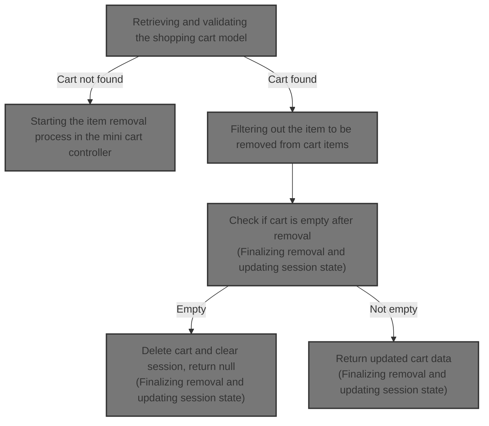
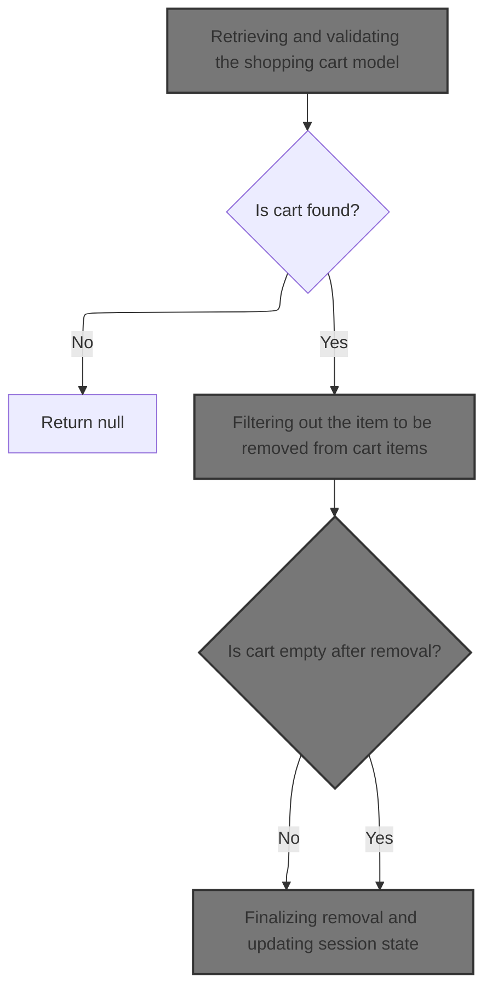

This document describes the flow for removing an item from the shopping cart. It receives a request with the item ID and cart code, retrieves and validates the cart, removes the item, updates the cart, and manages the session state. If the cart is empty after removal, it deletes the cart and clears the session. The output is the updated cart data or null.



# Starting the item removal process in the mini cart controller



This section handles the removal of an item from the mini shopping cart, ensuring the cart is valid, the item is removed, and the cart state is updated accordingly.

| Category        | Rule Name                 | Description                                                                                                                                   |
| --------------- | ------------------------- | --------------------------------------------------------------------------------------------------------------------------------------------- |
| Data validation | Cart existence validation | If the shopping cart cannot be found using the provided cart code and merchant store, the removal process should return null and not proceed. |
| Business logic  | Item removal from cart    | The specified line item must be removed from the cart's list of items if it exists.                                                           |
| Business logic  | Empty cart handling       | If the cart becomes empty after item removal, the cart state must be finalized and updated accordingly.                                       |
| Business logic  | Session state update      | After item removal, the shopping cart session state must be updated to reflect the current cart contents.                                     |

<SwmSnippet path="/shopizer/sm-shop/src/main/java/com/salesmanager/web/shop/controller/shoppingCart/MiniCartController.java" line="68">

---

In <SwmToken path="shopizer/sm-shop/src/main/java/com/salesmanager/web/shop/controller/shoppingCart/MiniCartController.java" pos="68:8:8" line-data="	public @ResponseBody ShoppingCartData removeShoppingCartItem(Long lineItemId, final String shoppingCartCode, HttpServletRequest request, Model model) throws Exception {">`removeShoppingCartItem`</SwmToken>, we first grab the language and merchant store from the request, then get the shopping cart data using the facade. Calling the facade next lets us retrieve the full cart details needed to proceed with item removal.

```java
	public @ResponseBody ShoppingCartData removeShoppingCartItem(Long lineItemId, final String shoppingCartCode, HttpServletRequest request, Model model) throws Exception {
		Language language = (Language)request.getAttribute(Constants.LANGUAGE);
		MerchantStore merchantStore = (MerchantStore)request.getAttribute(Constants.MERCHANT_STORE);
		ShoppingCartData cart =  shoppingCartFacade.getShoppingCartData(null, merchantStore, shoppingCartCode);
		if(cart==null) {
			return null;
		}
```

---

</SwmSnippet>

## Retrieving and validating the shopping cart model

```mermaid
%%{init: {"flowchart": {"defaultRenderer": "elk"}} }%%
flowchart TD
    node1["Start getShoppingCartData"] --> node2{"Is customer provided?"}
    click node1 openCode "shopizer/sm-shop/src/main/java/com/salesmanager/web/shop/controller/shoppingCart/facade/ShoppingCartFacadeImpl.java:260:308"
    node2 -->|"Yes"| node3["Retrieve cart by customer"]
    click node2 openCode "shopizer/sm-shop/src/main/java/com/salesmanager/web/shop/controller/shoppingCart/facade/ShoppingCartFacadeImpl.java:268:274"
    node2 -->|"No"| node4{"Is shoppingCartId provided and cart is null?"}
    click node4 openCode "shopizer/sm-shop/src/main/java/com/salesmanager/web/shop/controller/shoppingCart/facade/ShoppingCartFacadeImpl.java:278:281"
    node4 -->|"Yes"| node5["Retrieve cart by shoppingCartId"]
    click node5 openCode "shopizer/sm-shop/src/main/java/com/salesmanager/web/shop/controller/shoppingCart/facade/ShoppingCartFacadeImpl.java:278:281"
    node4 -->|"No"| node6["Proceed"]
    node3 --> node6
    node5 --> node6
    node6 --> node7{"Is cart found?"}
    node7 -->|"No"| node8["Return null"]
    click node7 openCode "shopizer/sm-shop/src/main/java/com/salesmanager/web/shop/controller/shoppingCart/facade/ShoppingCartFacadeImpl.java:293:296"
    node7 -->|"Yes"| node9["Populate shopping cart data"]
    click node9 openCode "shopizer/sm-shop/src/main/java/com/salesmanager/web/shop/controller/shoppingCart/facade/ShoppingCartFacadeImpl.java:300:306"
    node9 --> node10["Return populated shopping cart data"]
    click node10 openCode "shopizer/sm-shop/src/main/java/com/salesmanager/web/shop/controller/shoppingCart/facade/ShoppingCartFacadeImpl.java:306:308"
classDef HeadingStyle fill:#777777,stroke:#333,stroke-width:2px;

%% Swimm:
%% %%{init: {"flowchart": {"defaultRenderer": "elk"}} }%%
%% flowchart TD
%%     node1["Start <SwmToken path="shopizer/sm-shop/src/main/java/com/salesmanager/web/shop/controller/shoppingCart/MiniCartController.java" pos="71:9:9" line-data="		ShoppingCartData cart =  shoppingCartFacade.getShoppingCartData(null, merchantStore, shoppingCartCode);">`getShoppingCartData`</SwmToken>"] --> node2{"Is customer provided?"}
%%     click node1 openCode "<SwmPath>[shopizer/…/facade/ShoppingCartFacadeImpl.java](shopizer/sm-shop/src/main/java/com/salesmanager/web/shop/controller/shoppingCart/facade/ShoppingCartFacadeImpl.java)</SwmPath>:260:308"
%%     node2 -->|"Yes"| node3["Retrieve cart by customer"]
%%     click node2 openCode "<SwmPath>[shopizer/…/facade/ShoppingCartFacadeImpl.java](shopizer/sm-shop/src/main/java/com/salesmanager/web/shop/controller/shoppingCart/facade/ShoppingCartFacadeImpl.java)</SwmPath>:268:274"
%%     node2 -->|"No"| node4{"Is <SwmToken path="shopizer/sm-shop/src/main/java/com/salesmanager/web/shop/controller/shoppingCart/facade/ShoppingCartFacadeImpl.java" pos="261:5:5" line-data="                                                 final String shoppingCartId )">`shoppingCartId`</SwmToken> provided and cart is null?"}
%%     click node4 openCode "<SwmPath>[shopizer/…/facade/ShoppingCartFacadeImpl.java](shopizer/sm-shop/src/main/java/com/salesmanager/web/shop/controller/shoppingCart/facade/ShoppingCartFacadeImpl.java)</SwmPath>:278:281"
%%     node4 -->|"Yes"| node5["Retrieve cart by <SwmToken path="shopizer/sm-shop/src/main/java/com/salesmanager/web/shop/controller/shoppingCart/facade/ShoppingCartFacadeImpl.java" pos="261:5:5" line-data="                                                 final String shoppingCartId )">`shoppingCartId`</SwmToken>"]
%%     click node5 openCode "<SwmPath>[shopizer/…/facade/ShoppingCartFacadeImpl.java](shopizer/sm-shop/src/main/java/com/salesmanager/web/shop/controller/shoppingCart/facade/ShoppingCartFacadeImpl.java)</SwmPath>:278:281"
%%     node4 -->|"No"| node6["Proceed"]
%%     node3 --> node6
%%     node5 --> node6
%%     node6 --> node7{"Is cart found?"}
%%     node7 -->|"No"| node8["Return null"]
%%     click node7 openCode "<SwmPath>[shopizer/…/facade/ShoppingCartFacadeImpl.java](shopizer/sm-shop/src/main/java/com/salesmanager/web/shop/controller/shoppingCart/facade/ShoppingCartFacadeImpl.java)</SwmPath>:293:296"
%%     node7 -->|"Yes"| node9["Populate shopping cart data"]
%%     click node9 openCode "<SwmPath>[shopizer/…/facade/ShoppingCartFacadeImpl.java](shopizer/sm-shop/src/main/java/com/salesmanager/web/shop/controller/shoppingCart/facade/ShoppingCartFacadeImpl.java)</SwmPath>:300:306"
%%     node9 --> node10["Return populated shopping cart data"]
%%     click node10 openCode "<SwmPath>[shopizer/…/facade/ShoppingCartFacadeImpl.java](shopizer/sm-shop/src/main/java/com/salesmanager/web/shop/controller/shoppingCart/facade/ShoppingCartFacadeImpl.java)</SwmPath>:306:308"
%% classDef HeadingStyle fill:#777777,stroke:#333,stroke-width:2px;
```



This section handles retrieving and validating the shopping cart model for a customer or by shopping cart ID, ensuring the cart is current and populated with necessary data for further processing.

| Category       | Rule Name                     | Description                                                                                                                                     |
| -------------- | ----------------------------- | ----------------------------------------------------------------------------------------------------------------------------------------------- |
| Business logic | Customer cart retrieval       | If a customer is provided, retrieve the shopping cart associated with that customer.                                                            |
| Business logic | Fallback cart retrieval by ID | If no customer is provided or no cart is found for the customer, and a shopping cart ID is provided, retrieve the cart by the shopping cart ID. |
| Business logic | Cart validity enforcement     | If the retrieved cart is marked as obsolete, delete the cart and return null to prevent use of outdated cart data.                              |
| Business logic | Cart data population          | Populate the shopping cart data with pricing, calculation, and localization details before returning it for use in the web layer.               |

<SwmSnippet path="/shopizer/sm-shop/src/main/java/com/salesmanager/web/shop/controller/shoppingCart/facade/ShoppingCartFacadeImpl.java" line="260">

---

In <SwmToken path="shopizer/sm-shop/src/main/java/com/salesmanager/web/shop/controller/shoppingCart/facade/ShoppingCartFacadeImpl.java" pos="260:5:5" line-data="    public ShoppingCartData getShoppingCartData( final Customer customer, final MerchantStore store,">`getShoppingCartData`</SwmToken>, we check if a customer is present and then call the service layer to get the cart model. Calling the service helps us get the raw cart data from the database or cache, which we then process further.

```java
    public ShoppingCartData getShoppingCartData( final Customer customer, final MerchantStore store,
                                                 final String shoppingCartId )
        throws Exception
    {

        ShoppingCart cart = null;
        try
        {
            if ( customer != null )
            {
                LOG.info( "Reteriving customer shopping cart..." );

                cart = shoppingCartService.getShoppingCart( customer );

            }

            else
            {
```

---

</SwmSnippet>

<SwmSnippet path="/shopizer/sm-core/src/main/java/com/salesmanager/core/business/shoppingcart/service/ShoppingCartServiceImpl.java" line="68">

---

<SwmToken path="shopizer/sm-core/src/main/java/com/salesmanager/core/business/shoppingcart/service/ShoppingCartServiceImpl.java" pos="68:5:5" line-data="	public ShoppingCart getShoppingCart(final Customer customer) throws ServiceException {">`getShoppingCart`</SwmToken> does more than just fetch the cart. It gets the cart from the DAO, populates it with extra data, then checks if it's obsolete. If obsolete, it deletes the cart and returns null, enforcing business rules about cart validity.

```java
	public ShoppingCart getShoppingCart(final Customer customer) throws ServiceException {

		try {

			ShoppingCart shoppingCart = shoppingCartDao.getByCustomer(customer);
			populateShoppingCart(shoppingCart);
			if(shoppingCart!=null && shoppingCart.isObsolete()) {
				delete(shoppingCart);
				return null;
			} else {
				return shoppingCart;
			}


		} catch (Exception e) {
			throw new ServiceException(e);
		}

	}
```

---

</SwmSnippet>

<SwmSnippet path="/shopizer/sm-shop/src/main/java/com/salesmanager/web/shop/controller/shoppingCart/facade/ShoppingCartFacadeImpl.java" line="278">

---

After getting the cart model from the service, <SwmToken path="shopizer/sm-shop/src/main/java/com/salesmanager/web/shop/controller/shoppingCart/MiniCartController.java" pos="71:9:9" line-data="		ShoppingCartData cart =  shoppingCartFacade.getShoppingCartData(null, merchantStore, shoppingCartCode);">`getShoppingCartData`</SwmToken> checks if the cart is null or tries to get it by code. Then it uses ShoppingCartDataPopulator.populate to convert the model into a data object with pricing and calculation details for the web layer.

```java
                if ( StringUtils.isNotBlank( shoppingCartId ) && cart == null )
                {
                    cart = shoppingCartService.getByCode( shoppingCartId, store );
                }

            }
        }
        catch ( ServiceException ex )
        {
            LOG.error( "Error while retriving cart from customer", ex );
        }
        catch( NoResultException nre) {
        	//nothing
        }

        if ( cart == null )
        {
            return null;
        }

        LOG.info( "Cart model found." );

        ShoppingCartDataPopulator shoppingCartDataPopulator = new ShoppingCartDataPopulator();
        shoppingCartDataPopulator.setShoppingCartCalculationService( shoppingCartCalculationService );
        shoppingCartDataPopulator.setPricingService( pricingService );

        Language language = (Language) getKeyValue( Constants.LANGUAGE );
        MerchantStore merchantStore = (MerchantStore) getKeyValue( Constants.MERCHANT_STORE );
        return shoppingCartDataPopulator.populate( cart, merchantStore, language );

    }
```

---

</SwmSnippet>

## Mapping shopping cart items to data objects

```mermaid
%%{init: {"flowchart": {"defaultRenderer": "elk"}} }%%
flowchart TD
    node1["Start populating cart data"] --> node2{"Shopping cart has items?"}
    click node1 openCode "shopizer/sm-shop/src/main/java/com/salesmanager/web/populator/shoppingCart/ShoppingCartDataPopulator.java:73:75"
    click node2 openCode "shopizer/sm-shop/src/main/java/com/salesmanager/web/populator/shoppingCart/ShoppingCartDataPopulator.java:81:82"
    node2 -->|"No"| node20["Return cart data"]
    click node20 openCode "shopizer/sm-shop/src/main/java/com/salesmanager/web/populator/shoppingCart/ShoppingCartDataPopulator.java:159:160"
    node2 -->|"Yes"| loop1["For each item in shopping cart"]
    
    subgraph loop1["For each item in shopping cart"]
        node3["Create ShoppingCartItem with product details"]
        click node3 openCode "shopizer/sm-shop/src/main/java/com/salesmanager/web/populator/shoppingCart/ShoppingCartDataPopulator.java:85:126"
        node4{"Product has image?"}
        click node4 openCode "shopizer/sm-shop/src/main/java/com/salesmanager/web/populator/shoppingCart/ShoppingCartDataPopulator.java:102:106"
        node4 -->|"Yes"| node5["Set product image path"]
        click node5 openCode "shopizer/sm-shop/src/main/java/com/salesmanager/web/populator/shoppingCart/ShoppingCartDataPopulator.java:104:105"
        node4 -->|"No"| node6["Continue without image"]
        node6 --> node7{"Item has attributes?"}
        click node7 openCode "shopizer/sm-shop/src/main/java/com/salesmanager/web/populator/shoppingCart/ShoppingCartDataPopulator.java:107:125"
        node7 -->|"Yes"| loop2["For each attribute in item"]
        node7 -->|"No"| node12["Continue without attributes"]
        
        subgraph loop2["For each attribute in item"]
            node8["Create ShoppingCartAttribute"]
            click node8 openCode "shopizer/sm-shop/src/main/java/com/salesmanager/web/populator/shoppingCart/ShoppingCartDataPopulator.java:110:121"
            node9["Set attribute details"]
            node10["Add attribute to attribute list"]
        end
        node11["Add ShoppingCartItem to cart items list"]
        click node11 openCode "shopizer/sm-shop/src/main/java/com/salesmanager/web/populator/shoppingCart/ShoppingCartDataPopulator.java:126:127"
        node12 --> node11
        node10 --> node11
        loop2 --> node11
    end
    loop1 --> node13["Set cart shoppingCartItems list"]
    click node13 openCode "shopizer/sm-shop/src/main/java/com/salesmanager/web/populator/shoppingCart/ShoppingCartDataPopulator.java:129:131"
    node13 --> node14["Calculate order summary"]
    click node14 openCode "shopizer/sm-shop/src/main/java/com/salesmanager/web/populator/shoppingCart/ShoppingCartDataPopulator.java:133:137"
    node14 --> node15{"Order totals available?"}
    click node15 openCode "shopizer/sm-shop/src/main/java/com/salesmanager/web/populator/shoppingCart/ShoppingCartDataPopulator.java:139:140"
    
    subgraph loop3["For each order total"]
        node16["Create OrderTotal"]
        click node16 openCode "shopizer/sm-shop/src/main/java/com/salesmanager/web/populator/shoppingCart/ShoppingCartDataPopulator.java:141:145"
        node17["Set order total details"]
        node18["Add to totals list"]
    end
    node15 -->|"Yes"| loop3
    node15 -->|"No"| node19["Set cart subtotal, total, quantity, and id"]
    loop3 --> node19
    click node19 openCode "shopizer/sm-shop/src/main/java/com/salesmanager/web/populator/shoppingCart/ShoppingCartDataPopulator.java:147:153"
    node19 --> node20

classDef HeadingStyle fill:#777777,stroke:#333,stroke-width:2px;

%% Swimm:
%% %%{init: {"flowchart": {"defaultRenderer": "elk"}} }%%
%% flowchart TD
%%     node1["Start populating cart data"] --> node2{"Shopping cart has items?"}
%%     click node1 openCode "<SwmPath>[shopizer/…/shoppingCart/ShoppingCartDataPopulator.java](shopizer/sm-shop/src/main/java/com/salesmanager/web/populator/shoppingCart/ShoppingCartDataPopulator.java)</SwmPath>:73:75"
%%     click node2 openCode "<SwmPath>[shopizer/…/shoppingCart/ShoppingCartDataPopulator.java](shopizer/sm-shop/src/main/java/com/salesmanager/web/populator/shoppingCart/ShoppingCartDataPopulator.java)</SwmPath>:81:82"
%%     node2 -->|"No"| node20["Return cart data"]
%%     click node20 openCode "<SwmPath>[shopizer/…/shoppingCart/ShoppingCartDataPopulator.java](shopizer/sm-shop/src/main/java/com/salesmanager/web/populator/shoppingCart/ShoppingCartDataPopulator.java)</SwmPath>:159:160"
%%     node2 -->|"Yes"| loop1["For each item in shopping cart"]
%%     
%%     subgraph loop1["For each item in shopping cart"]
%%         node3["Create <SwmToken path="shopizer/sm-shop/src/main/java/com/salesmanager/web/shop/controller/shoppingCart/facade/ShoppingCartFacadeImpl.java" pos="335:15:15" line-data="                    Set&lt;com.salesmanager.core.business.shoppingcart.model.ShoppingCartItem&gt; shoppingCartItemSet =">`ShoppingCartItem`</SwmToken> with product details"]
%%         click node3 openCode "<SwmPath>[shopizer/…/shoppingCart/ShoppingCartDataPopulator.java](shopizer/sm-shop/src/main/java/com/salesmanager/web/populator/shoppingCart/ShoppingCartDataPopulator.java)</SwmPath>:85:126"
%%         node4{"Product has image?"}
%%         click node4 openCode "<SwmPath>[shopizer/…/shoppingCart/ShoppingCartDataPopulator.java](shopizer/sm-shop/src/main/java/com/salesmanager/web/populator/shoppingCart/ShoppingCartDataPopulator.java)</SwmPath>:102:106"
%%         node4 -->|"Yes"| node5["Set product image path"]
%%         click node5 openCode "<SwmPath>[shopizer/…/shoppingCart/ShoppingCartDataPopulator.java](shopizer/sm-shop/src/main/java/com/salesmanager/web/populator/shoppingCart/ShoppingCartDataPopulator.java)</SwmPath>:104:105"
%%         node4 -->|"No"| node6["Continue without image"]
%%         node6 --> node7{"Item has attributes?"}
%%         click node7 openCode "<SwmPath>[shopizer/…/shoppingCart/ShoppingCartDataPopulator.java](shopizer/sm-shop/src/main/java/com/salesmanager/web/populator/shoppingCart/ShoppingCartDataPopulator.java)</SwmPath>:107:125"
%%         node7 -->|"Yes"| loop2["For each attribute in item"]
%%         node7 -->|"No"| node12["Continue without attributes"]
%%         
%%         subgraph loop2["For each attribute in item"]
%%             node8["Create <SwmToken path="shopizer/sm-shop/src/main/java/com/salesmanager/web/populator/shoppingCart/ShoppingCartDataPopulator.java" pos="109:3:3" line-data="                        List&lt;ShoppingCartAttribute&gt; cartAttributes = new ArrayList&lt;ShoppingCartAttribute&gt;();">`ShoppingCartAttribute`</SwmToken>"]
%%             click node8 openCode "<SwmPath>[shopizer/…/shoppingCart/ShoppingCartDataPopulator.java](shopizer/sm-shop/src/main/java/com/salesmanager/web/populator/shoppingCart/ShoppingCartDataPopulator.java)</SwmPath>:110:121"
%%             node9["Set attribute details"]
%%             node10["Add attribute to attribute list"]
%%         end
%%         node11["Add <SwmToken path="shopizer/sm-shop/src/main/java/com/salesmanager/web/shop/controller/shoppingCart/facade/ShoppingCartFacadeImpl.java" pos="335:15:15" line-data="                    Set&lt;com.salesmanager.core.business.shoppingcart.model.ShoppingCartItem&gt; shoppingCartItemSet =">`ShoppingCartItem`</SwmToken> to cart items list"]
%%         click node11 openCode "<SwmPath>[shopizer/…/shoppingCart/ShoppingCartDataPopulator.java](shopizer/sm-shop/src/main/java/com/salesmanager/web/populator/shoppingCart/ShoppingCartDataPopulator.java)</SwmPath>:126:127"
%%         node12 --> node11
%%         node10 --> node11
%%         loop2 --> node11
%%     end
%%     loop1 --> node13["Set cart <SwmToken path="shopizer/sm-shop/src/main/java/com/salesmanager/web/shop/controller/shoppingCart/facade/ShoppingCartFacadeImpl.java" pos="404:15:15" line-data="    public ShoppingCartData updateCartItems( final List&lt;ShoppingCartItem&gt; shoppingCartItems, final MerchantStore store, final Language language )">`shoppingCartItems`</SwmToken> list"]
%%     click node13 openCode "<SwmPath>[shopizer/…/shoppingCart/ShoppingCartDataPopulator.java](shopizer/sm-shop/src/main/java/com/salesmanager/web/populator/shoppingCart/ShoppingCartDataPopulator.java)</SwmPath>:129:131"
%%     node13 --> node14["Calculate order summary"]
%%     click node14 openCode "<SwmPath>[shopizer/…/shoppingCart/ShoppingCartDataPopulator.java](shopizer/sm-shop/src/main/java/com/salesmanager/web/populator/shoppingCart/ShoppingCartDataPopulator.java)</SwmPath>:133:137"
%%     node14 --> node15{"Order totals available?"}
%%     click node15 openCode "<SwmPath>[shopizer/…/shoppingCart/ShoppingCartDataPopulator.java](shopizer/sm-shop/src/main/java/com/salesmanager/web/populator/shoppingCart/ShoppingCartDataPopulator.java)</SwmPath>:139:140"
%%     
%%     subgraph loop3["For each order total"]
%%         node16["Create <SwmToken path="shopizer/sm-shop/src/main/java/com/salesmanager/web/populator/shoppingCart/ShoppingCartDataPopulator.java" pos="140:3:3" line-data="            	List&lt;OrderTotal&gt; totals = new ArrayList&lt;OrderTotal&gt;();">`OrderTotal`</SwmToken>"]
%%         click node16 openCode "<SwmPath>[shopizer/…/shoppingCart/ShoppingCartDataPopulator.java](shopizer/sm-shop/src/main/java/com/salesmanager/web/populator/shoppingCart/ShoppingCartDataPopulator.java)</SwmPath>:141:145"
%%         node17["Set order total details"]
%%         node18["Add to totals list"]
%%     end
%%     node15 -->|"Yes"| loop3
%%     node15 -->|"No"| node19["Set cart subtotal, total, quantity, and id"]
%%     loop3 --> node19
%%     click node19 openCode "<SwmPath>[shopizer/…/shoppingCart/ShoppingCartDataPopulator.java](shopizer/sm-shop/src/main/java/com/salesmanager/web/populator/shoppingCart/ShoppingCartDataPopulator.java)</SwmPath>:147:153"
%%     node19 --> node20
%% 
%% classDef HeadingStyle fill:#777777,stroke:#333,stroke-width:2px;
```



This section describes the business rules for mapping shopping cart items to data objects, transforming raw cart model data into client-ready shopping cart data including items, attributes, images, and order totals.

| Category       | Rule Name                             | Description                                                                                                                                                                                                                                                                                                                                                                                                                                                                                          |
| -------------- | ------------------------------------- | ---------------------------------------------------------------------------------------------------------------------------------------------------------------------------------------------------------------------------------------------------------------------------------------------------------------------------------------------------------------------------------------------------------------------------------------------------------------------------------------------------- |
| Business logic | Empty cart returns empty data         | If the shopping cart has no items, the system returns an empty <SwmToken path="shopizer/sm-shop/src/main/java/com/salesmanager/web/shop/controller/shoppingCart/MiniCartController.java" pos="68:6:6" line-data="	public @ResponseBody ShoppingCartData removeShoppingCartItem(Long lineItemId, final String shoppingCartCode, HttpServletRequest request, Model model) throws Exception {">`ShoppingCartData`</SwmToken> object without any shopping cart items or totals.                           |
| Business logic | Include product details in cart items | Each shopping cart item must include product SKU, name, price, quantity, and product ID to provide complete product information to the client.                                                                                                                                                                                                                                                                                                                                                       |
| Business logic | Include product image if available    | If a product image exists for a cart item, the image path must be included in the <SwmToken path="shopizer/sm-shop/src/main/java/com/salesmanager/web/shop/controller/shoppingCart/facade/ShoppingCartFacadeImpl.java" pos="335:15:15" line-data="                    Set&lt;com.salesmanager.core.business.shoppingcart.model.ShoppingCartItem&gt; shoppingCartItemSet =">`ShoppingCartItem`</SwmToken> data to enhance the user experience.                                                        |
| Business logic | Include item attributes if present    | If a cart item has attributes (such as size or color), these must be included in the <SwmToken path="shopizer/sm-shop/src/main/java/com/salesmanager/web/shop/controller/shoppingCart/facade/ShoppingCartFacadeImpl.java" pos="335:15:15" line-data="                    Set&lt;com.salesmanager.core.business.shoppingcart.model.ShoppingCartItem&gt; shoppingCartItemSet =">`ShoppingCartItem`</SwmToken> data with attribute names and values.                                                    |
| Business logic | Calculate and include order totals    | The system must calculate order totals including subtotal, total, and other applicable totals, and include them in the <SwmToken path="shopizer/sm-shop/src/main/java/com/salesmanager/web/shop/controller/shoppingCart/MiniCartController.java" pos="68:6:6" line-data="	public @ResponseBody ShoppingCartData removeShoppingCartItem(Long lineItemId, final String shoppingCartCode, HttpServletRequest request, Model model) throws Exception {">`ShoppingCartData`</SwmToken> for client display. |
| Business logic | Set cart quantity and identifiers     | The total quantity of items in the cart and the cart's unique identifier must be set on the <SwmToken path="shopizer/sm-shop/src/main/java/com/salesmanager/web/shop/controller/shoppingCart/MiniCartController.java" pos="68:6:6" line-data="	public @ResponseBody ShoppingCartData removeShoppingCartItem(Long lineItemId, final String shoppingCartCode, HttpServletRequest request, Model model) throws Exception {">`ShoppingCartData`</SwmToken> object for tracking and display.               |

<SwmSnippet path="/shopizer/sm-shop/src/main/java/com/salesmanager/web/populator/shoppingCart/ShoppingCartDataPopulator.java" line="73">

---

Next in <SwmToken path="shopizer/sm-shop/src/main/java/com/salesmanager/web/populator/shoppingCart/ShoppingCartDataPopulator.java" pos="73:5:5" line-data="    public ShoppingCartData populate(final ShoppingCart shoppingCart,">`populate`</SwmToken>, we set the list of ShoppingCartItems on the cart if not empty, prepare an order summary, and call the calculation service to get totals. Then we map those totals into the data object for the client.

```java
    public ShoppingCartData populate(final ShoppingCart shoppingCart,
                                     final ShoppingCartData cart, final MerchantStore store, final Language language) {

    	int cartQuantity = 0;
        cart.setCode(shoppingCart.getShoppingCartCode());
        Set<com.salesmanager.core.business.shoppingcart.model.ShoppingCartItem> items = shoppingCart.getLineItems();
        List<ShoppingCartItem> shoppingCartItemsList=Collections.emptyList();
        try{
            if(items!=null) {
                shoppingCartItemsList=new ArrayList<ShoppingCartItem>();
                for(com.salesmanager.core.business.shoppingcart.model.ShoppingCartItem item : items) {

                    ShoppingCartItem shoppingCartItem = new ShoppingCartItem();
                    shoppingCartItem.setCode(cart.getCode());
                    shoppingCartItem.setProductCode(item.getProduct().getSku());
                    shoppingCartItem.setProductVirtual(item.isProductVirtual());

                    shoppingCartItem.setProductId(item.getProductId());
                    shoppingCartItem.setId(item.getId());
                    shoppingCartItem.setName(item.getProduct().getProductDescription().getName());

                    shoppingCartItem.setPrice(pricingService.getDisplayAmount(item.getItemPrice(),store));
                    shoppingCartItem.setQuantity(item.getQuantity());
                    
                    
                    cartQuantity = cartQuantity + item.getQuantity();
                    
                    shoppingCartItem.setProductPrice(item.getItemPrice());
                    shoppingCartItem.setSubTotal(pricingService.getDisplayAmount(item.getSubTotal(), store));
                    ProductImage image = item.getProduct().getProductImage();
                    if(image!=null) {
                        String imagePath = ImageFilePathUtils.buildProductImageFilePath(store, item.getProduct().getSku(), image.getProductImage());
                        shoppingCartItem.setImage(imagePath);
                    }
                    Set<com.salesmanager.core.business.shoppingcart.model.ShoppingCartAttributeItem> attributes = item.getAttributes();
                    if(attributes!=null) {
                        List<ShoppingCartAttribute> cartAttributes = new ArrayList<ShoppingCartAttribute>();
                        for(com.salesmanager.core.business.shoppingcart.model.ShoppingCartAttributeItem attribute : attributes) {
                            ShoppingCartAttribute cartAttribute = new ShoppingCartAttribute();
                            cartAttribute.setId(attribute.getId());
                            cartAttribute.setAttributeId(attribute.getProductAttributeId());
                            cartAttribute.setOptionId(attribute.getProductAttribute().getProductOption().getId());
                            cartAttribute.setOptionValueId(attribute.getProductAttribute().getProductOptionValue().getId());
                            List<ProductOptionDescription> optionDescriptions = attribute.getProductAttribute().getProductOption().getDescriptionsSettoList();
                            List<ProductOptionValueDescription> optionValueDescriptions = attribute.getProductAttribute().getProductOptionValue().getDescriptionsSettoList();
                            if(!CollectionUtils.isEmpty(optionDescriptions) && !CollectionUtils.isEmpty(optionValueDescriptions)) {
                            	cartAttribute.setOptionName(optionDescriptions.get(0).getName());
                            	cartAttribute.setOptionValue(optionValueDescriptions.get(0).getName());
                            	cartAttributes.add(cartAttribute);
                            }
                        }
                        shoppingCartItem.setShoppingCartAttributes(cartAttributes);
                    }
                    shoppingCartItemsList.add(shoppingCartItem);
                }
```

---

</SwmSnippet>

<SwmSnippet path="/shopizer/sm-shop/src/main/java/com/salesmanager/web/populator/shoppingCart/ShoppingCartDataPopulator.java" line="129">

---

Finally, <SwmToken path="shopizer/sm-shop/src/main/java/com/salesmanager/web/shop/controller/shoppingCart/facade/ShoppingCartFacadeImpl.java" pos="306:5:5" line-data="        return shoppingCartDataPopulator.populate( cart, merchantStore, language );">`populate`</SwmToken> sets totals, subtotal, total, quantity, and ID on the <SwmToken path="shopizer/sm-shop/src/main/java/com/salesmanager/web/shop/controller/shoppingCart/MiniCartController.java" pos="68:6:6" line-data="	public @ResponseBody ShoppingCartData removeShoppingCartItem(Long lineItemId, final String shoppingCartCode, HttpServletRequest request, Model model) throws Exception {">`ShoppingCartData`</SwmToken>, then returns it. This completes the transformation from raw cart model to client-ready data.

```java
            if(CollectionUtils.isNotEmpty(shoppingCartItemsList)){
                cart.setShoppingCartItems(shoppingCartItemsList);
            }

            OrderSummary summary = new OrderSummary();
            List<com.salesmanager.core.business.shoppingcart.model.ShoppingCartItem> productsList = new ArrayList<com.salesmanager.core.business.shoppingcart.model.ShoppingCartItem>();
            productsList.addAll(shoppingCart.getLineItems());
            summary.setProducts(productsList);
            OrderTotalSummary orderSummary = shoppingCartCalculationService.calculate(shoppingCart,store, language );

            if(CollectionUtils.isNotEmpty(orderSummary.getTotals())) {
            	List<OrderTotal> totals = new ArrayList<OrderTotal>();
            	for(com.salesmanager.core.business.order.model.OrderTotal t : orderSummary.getTotals()) {
            		OrderTotal total = new OrderTotal();
            		total.setCode(t.getOrderTotalCode());
            		total.setValue(t.getValue());
            		totals.add(total);
            	}
```

---

</SwmSnippet>

<SwmSnippet path="/shopizer/sm-shop/src/main/java/com/salesmanager/web/populator/shoppingCart/ShoppingCartDataPopulator.java" line="147">

---

Finally, <SwmToken path="shopizer/sm-shop/src/main/java/com/salesmanager/web/shop/controller/shoppingCart/facade/ShoppingCartFacadeImpl.java" pos="306:5:5" line-data="        return shoppingCartDataPopulator.populate( cart, merchantStore, language );">`populate`</SwmToken> sets totals, subtotal, total, quantity, and ID on the <SwmToken path="shopizer/sm-shop/src/main/java/com/salesmanager/web/shop/controller/shoppingCart/MiniCartController.java" pos="68:6:6" line-data="	public @ResponseBody ShoppingCartData removeShoppingCartItem(Long lineItemId, final String shoppingCartCode, HttpServletRequest request, Model model) throws Exception {">`ShoppingCartData`</SwmToken>, then returns it. This completes the transformation from raw cart model to client-ready data.

```java
            	cart.setTotals(totals);
            }
            
            cart.setSubTotal(pricingService.getDisplayAmount(orderSummary.getSubTotal(), store));
            cart.setTotal(pricingService.getDisplayAmount(orderSummary.getTotal(), store));
            cart.setQuantity(cartQuantity);
            cart.setId(shoppingCart.getId());
        }
        catch(ServiceException ex){
            LOG.error( "Error while converting cart Model to cart Data.."+ex );
            throw new ConversionException( "Unable to create cart data", ex );
        }
        return cart;


    };
```

---

</SwmSnippet>

## Removing the item from the cart via facade

<SwmSnippet path="/shopizer/sm-shop/src/main/java/com/salesmanager/web/shop/controller/shoppingCart/MiniCartController.java" line="75">

---

We remove the item via the facade and get the updated cart data.

```java
		ShoppingCartData shoppingCartData=shoppingCartFacade.removeCartItem(lineItemId, cart.getCode(), merchantStore,language);
		
		
```

---

</SwmSnippet>

## Filtering out the item to be removed from cart items

```mermaid
%%{init: {"flowchart": {"defaultRenderer": "elk"}} }%%
flowchart TD
    node1{"Is cart ID provided?"}
    click node1 openCode "shopizer/sm-shop/src/main/java/com/salesmanager/web/shop/controller/shoppingCart/facade/ShoppingCartFacadeImpl.java:327:328"
    node1 -->|"No"| node2["Return null"]
    click node2 openCode "shopizer/sm-shop/src/main/java/com/salesmanager/web/shop/controller/shoppingCart/facade/ShoppingCartFacadeImpl.java:357:358"
    node1 -->|"Yes"| node3{"Does cart exist for given cart ID and store?"}
    click node3 openCode "shopizer/sm-shop/src/main/java/com/salesmanager/web/shop/controller/shoppingCart/facade/ShoppingCartFacadeImpl.java:330:332"
    node3 -->|"No"| node2
    node3 -->|"Yes"| node4{"Does cart have any items?"}
    click node4 openCode "shopizer/sm-shop/src/main/java/com/salesmanager/web/shop/controller/shoppingCart/facade/ShoppingCartFacadeImpl.java:333:335"
    node4 -->|"No"| node2
    node4 -->|"Yes"| loop1["For each item in cart"]

    subgraph loop1["For each item in cart"]
        node5{"Is item the one to remove (itemID)?"}
        click node5 openCode "shopizer/sm-shop/src/main/java/com/salesmanager/web/shop/controller/shoppingCart/facade/ShoppingCartFacadeImpl.java:337:343"
        node5 -->|"Yes"| node5b["Exclude item from new cart"]
        node5 -->|"No"| node6["Include item in new cart"]
    end

    loop1 --> node7["Update cart with new items"]
    click node7 openCode "shopizer/sm-shop/src/main/java/com/salesmanager/web/shop/controller/shoppingCart/facade/ShoppingCartFacadeImpl.java:344:345"
    node7 --> node8["Save updated cart"]
    click node8 openCode "shopizer/sm-shop/src/main/java/com/salesmanager/web/shop/controller/shoppingCart/facade/ShoppingCartFacadeImpl.java:345:346"
    node8 --> node9["Return updated cart data for UI display"]
    click node9 openCode "shopizer/sm-shop/src/main/java/com/salesmanager/web/shop/controller/shoppingCart/facade/ShoppingCartFacadeImpl.java:350:353"
classDef HeadingStyle fill:#777777,stroke:#333,stroke-width:2px;

%% Swimm:
%% %%{init: {"flowchart": {"defaultRenderer": "elk"}} }%%
%% flowchart TD
%%     node1{"Is cart ID provided?"}
%%     click node1 openCode "<SwmPath>[shopizer/…/facade/ShoppingCartFacadeImpl.java](shopizer/sm-shop/src/main/java/com/salesmanager/web/shop/controller/shoppingCart/facade/ShoppingCartFacadeImpl.java)</SwmPath>:327:328"
%%     node1 -->|"No"| node2["Return null"]
%%     click node2 openCode "<SwmPath>[shopizer/…/facade/ShoppingCartFacadeImpl.java](shopizer/sm-shop/src/main/java/com/salesmanager/web/shop/controller/shoppingCart/facade/ShoppingCartFacadeImpl.java)</SwmPath>:357:358"
%%     node1 -->|"Yes"| node3{"Does cart exist for given cart ID and store?"}
%%     click node3 openCode "<SwmPath>[shopizer/…/facade/ShoppingCartFacadeImpl.java](shopizer/sm-shop/src/main/java/com/salesmanager/web/shop/controller/shoppingCart/facade/ShoppingCartFacadeImpl.java)</SwmPath>:330:332"
%%     node3 -->|"No"| node2
%%     node3 -->|"Yes"| node4{"Does cart have any items?"}
%%     click node4 openCode "<SwmPath>[shopizer/…/facade/ShoppingCartFacadeImpl.java](shopizer/sm-shop/src/main/java/com/salesmanager/web/shop/controller/shoppingCart/facade/ShoppingCartFacadeImpl.java)</SwmPath>:333:335"
%%     node4 -->|"No"| node2
%%     node4 -->|"Yes"| loop1["For each item in cart"]
%% 
%%     subgraph loop1["For each item in cart"]
%%         node5{"Is item the one to remove (<SwmToken path="shopizer/sm-shop/src/main/java/com/salesmanager/web/shop/controller/shoppingCart/facade/ShoppingCartFacadeImpl.java" pos="324:12:12" line-data="    public ShoppingCartData removeCartItem( final Long itemID, final String cartId ,final MerchantStore store,final Language language )">`itemID`</SwmToken>)?"}
%%         click node5 openCode "<SwmPath>[shopizer/…/facade/ShoppingCartFacadeImpl.java](shopizer/sm-shop/src/main/java/com/salesmanager/web/shop/controller/shoppingCart/facade/ShoppingCartFacadeImpl.java)</SwmPath>:337:343"
%%         node5 -->|"Yes"| node5b["Exclude item from new cart"]
%%         node5 -->|"No"| node6["Include item in new cart"]
%%     end
%% 
%%     loop1 --> node7["Update cart with new items"]
%%     click node7 openCode "<SwmPath>[shopizer/…/facade/ShoppingCartFacadeImpl.java](shopizer/sm-shop/src/main/java/com/salesmanager/web/shop/controller/shoppingCart/facade/ShoppingCartFacadeImpl.java)</SwmPath>:344:345"
%%     node7 --> node8["Save updated cart"]
%%     click node8 openCode "<SwmPath>[shopizer/…/facade/ShoppingCartFacadeImpl.java](shopizer/sm-shop/src/main/java/com/salesmanager/web/shop/controller/shoppingCart/facade/ShoppingCartFacadeImpl.java)</SwmPath>:345:346"
%%     node8 --> node9["Return updated cart data for UI display"]
%%     click node9 openCode "<SwmPath>[shopizer/…/facade/ShoppingCartFacadeImpl.java](shopizer/sm-shop/src/main/java/com/salesmanager/web/shop/controller/shoppingCart/facade/ShoppingCartFacadeImpl.java)</SwmPath>:350:353"
%% classDef HeadingStyle fill:#777777,stroke:#333,stroke-width:2px;
```



This section handles the removal of an item from a shopping cart by filtering out the specified item and updating the cart accordingly.

| Category       | Rule Name                 | Description                                                                                                             |
| -------------- | ------------------------- | ----------------------------------------------------------------------------------------------------------------------- |
| Business logic | Item removal by ID        | Only the item matching the specified item ID is removed from the cart; all other items remain.                          |
| Business logic | Cart update after removal | After removing the specified item, the cart is updated with the new set of items and saved.                             |
| Business logic | Return updated cart data  | The system returns the updated cart data with recalculated totals for display in the user interface after item removal. |

<SwmSnippet path="/shopizer/sm-shop/src/main/java/com/salesmanager/web/shop/controller/shoppingCart/facade/ShoppingCartFacadeImpl.java" line="324">

---

In <SwmToken path="shopizer/sm-shop/src/main/java/com/salesmanager/web/shop/controller/shoppingCart/facade/ShoppingCartFacadeImpl.java" pos="324:5:5" line-data="    public ShoppingCartData removeCartItem( final Long itemID, final String cartId ,final MerchantStore store,final Language language )">`removeCartItem`</SwmToken>, we get the cart model by ID, then create a new set of line items excluding the one with the given item ID. This effectively removes the item from the cart's collection.

```java
    public ShoppingCartData removeCartItem( final Long itemID, final String cartId ,final MerchantStore store,final Language language )
        throws Exception
    {
        if ( StringUtils.isNotBlank( cartId ) )
        {

            ShoppingCart cartModel = getCartModel( cartId,store );
            if ( cartModel != null )
            {
                if ( CollectionUtils.isNotEmpty( cartModel.getLineItems() ) )
                {
                    Set<com.salesmanager.core.business.shoppingcart.model.ShoppingCartItem> shoppingCartItemSet =
                        new HashSet<com.salesmanager.core.business.shoppingcart.model.ShoppingCartItem>();
                    for ( com.salesmanager.core.business.shoppingcart.model.ShoppingCartItem shoppingCartItem : cartModel.getLineItems() )
                    {
                        if ( shoppingCartItem.getId().longValue() != itemID.longValue() )
                        {
                            shoppingCartItemSet.add( shoppingCartItem );
                        }
                    }
```

---

</SwmSnippet>

<SwmSnippet path="/shopizer/sm-shop/src/main/java/com/salesmanager/web/shop/controller/shoppingCart/facade/ShoppingCartFacadeImpl.java" line="344">

---

After filtering items, we update the cart model's line items and save it. Then we use ShoppingCartDataPopulator.populate to convert the updated model into a data object with recalculated totals for the client.

```java
                    cartModel.setLineItems( shoppingCartItemSet );
                    shoppingCartService.saveOrUpdate( cartModel );


                    ShoppingCartDataPopulator shoppingCartDataPopulator = new ShoppingCartDataPopulator();
                    shoppingCartDataPopulator.setShoppingCartCalculationService( shoppingCartCalculationService );
                    shoppingCartDataPopulator.setPricingService( pricingService );
                    return shoppingCartDataPopulator.populate( cartModel, store, language );
                }
            }
        }
        return null;
    }
```

---

</SwmSnippet>

## Finalizing removal and updating session state

<SwmSnippet path="/shopizer/sm-shop/src/main/java/com/salesmanager/web/shop/controller/shoppingCart/MiniCartController.java" line="78">

---

Back in <SwmToken path="shopizer/sm-shop/src/main/java/com/salesmanager/web/shop/controller/shoppingCart/MiniCartController.java" pos="68:8:8" line-data="	public @ResponseBody ShoppingCartData removeShoppingCartItem(Long lineItemId, final String shoppingCartCode, HttpServletRequest request, Model model) throws Exception {">`removeShoppingCartItem`</SwmToken>, after removing the item via the facade, we check if the cart is empty. If empty, we delete the cart and clear the session attribute. Otherwise, we update the session with the cart code and return the updated cart data.

```java
		if(CollectionUtils.isEmpty(shoppingCartData.getShoppingCartItems())) {
			shoppingCartFacade.deleteShoppingCart(shoppingCartData.getId(), merchantStore);
			request.getSession().removeAttribute(Constants.SHOPPING_CART);
			return null;
		}
		
		
		request.getSession().setAttribute(Constants.SHOPPING_CART, cart.getCode());
		
		LOG.debug("removed item" + lineItemId + "from cart");
		return shoppingCartData;
	}
```

---

</SwmSnippet>

&nbsp;

*This is an auto-generated document by Swimm 🌊 and has not yet been verified by a human*

<SwmMeta version="3.0.0" repo-id="Z2l0aHViJTNBJTNBU2hvcGl6ZXIlM0ElM0F1bWFsaW5nYXN3YW1p" repo-name="Shopizer"><sup>Powered by [Swimm](https://app.swimm.io/)</sup></SwmMeta>
