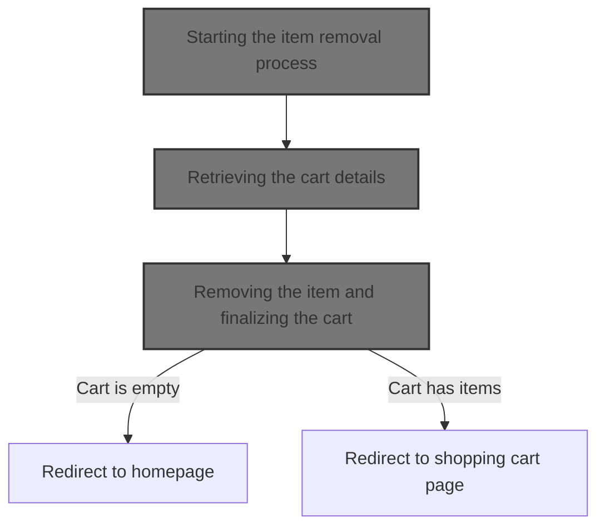
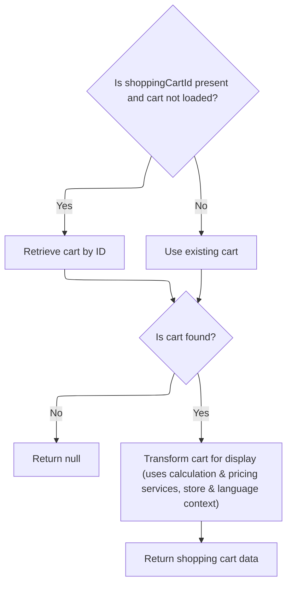
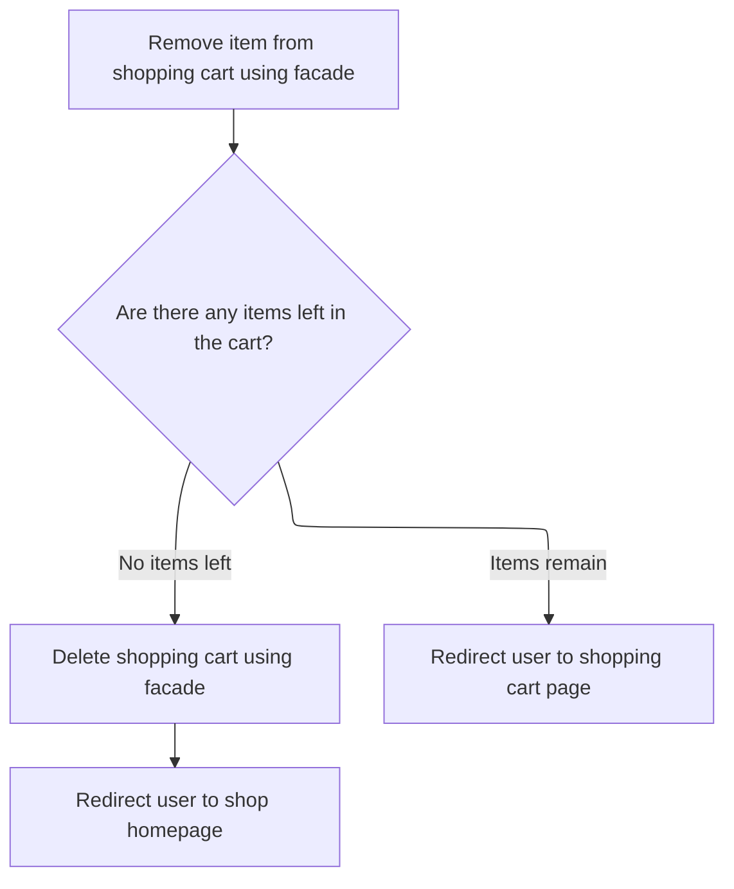

This document describes how users can remove items from their shopping cart. The flow validates user and cart data, retrieves the appropriate cart for both registered and guest users, and removes the selected item. After removal, the cart is updated and either deleted if empty or presented to the user for further review.



# Starting the item removal process

This section ensures that all necessary session and request data are present and valid before proceeding with the removal of an item from the shopping cart. It validates the user's session, checks for a valid cart, and retrieves the current cart data to enable accurate item identification and removal.

| Category        | Rule Name                  | Description                                                                                                                                                                 |
| --------------- | -------------------------- | --------------------------------------------------------------------------------------------------------------------------------------------------------------------------- |
| Data validation | Missing cart code redirect | If the shopping cart code is not present in the user's session, the user must be redirected to the shop homepage and the item removal process must not proceed.             |
| Data validation | Session data validation    | The system must validate that the customer and store information are present in the session before proceeding with cart operations.                                         |
| Business logic  | Retrieve current cart data | The system must retrieve the current shopping cart data for the user and store before attempting to remove any item, ensuring that the correct cart and items are targeted. |

<SwmSnippet path="/shopizer/sm-shop/src/main/java/com/salesmanager/web/shop/controller/shoppingCart/ShoppingCartController.java" line="309">

---

In <SwmToken path="shopizer/sm-shop/src/main/java/com/salesmanager/web/shop/controller/shoppingCart/ShoppingCartController.java" pos="309:3:3" line-data="	String removeShoppingCartItem(final Long lineItemId, final HttpServletRequest request, final HttpServletResponse response) throws Exception {">`removeShoppingCartItem`</SwmToken>, we start by grabbing the store, language, and customer from the session and request. We check if there's a cart code in the session—if not, we bail out and redirect. Next, we call the facade to get the current cart data for this user and store, which sets us up to identify and remove the right item. The facade abstracts away the details of fetching and assembling the cart, so we don't have to deal with service calls directly here.

```java
	String removeShoppingCartItem(final Long lineItemId, final HttpServletRequest request, final HttpServletResponse response) throws Exception {


		//Looks in the HttpSession to see if a customer is logged in

		//get any shopping cart for this user

		//** need to check if the item has property, similar items may exist but with different properties
		//String attributes = request.getParameter("attribute");//attributes id are sent as 1|2|5|
		//this will help with hte removal of the appropriate item

		//remove the item shoppingCartService.create

		//create JSON representation of the shopping cart

		//return the JSON structure in AjaxResponse

		//store the shopping cart in the http session

	    MerchantStore store = getSessionAttribute(Constants.MERCHANT_STORE, request);
	    Language language = (Language)request.getAttribute(Constants.LANGUAGE);
	    Customer customer = getSessionAttribute(  Constants.CUSTOMER, request );
        
        /** there must be a cart in the session **/
        String cartCode = (String)request.getSession().getAttribute(Constants.SHOPPING_CART);
        
        if(StringUtils.isBlank(cartCode)) {
        	return "redirect:/shop";
        }
                
        ShoppingCartData shoppingCart = shoppingCartFacade.getShoppingCartData(customer, store, cartCode);
                
```

---

</SwmSnippet>

## Retrieving the cart details

This section is responsible for retrieving the shopping cart details for a given customer or cart identifier. It ensures that the correct cart is fetched based on the user's session and context.

| Category        | Rule Name                 | Description                                                                                                                                                                                                                                                                                                                                                                                    |
| --------------- | ------------------------- | ---------------------------------------------------------------------------------------------------------------------------------------------------------------------------------------------------------------------------------------------------------------------------------------------------------------------------------------------------------------------------------------------- |
| Data validation | Store cart isolation      | The shopping cart returned must belong to the specified merchant store, ensuring that cart data is not mixed between stores.                                                                                                                                                                                                                                                                   |
| Business logic  | Customer cart association | If a customer is provided, the shopping cart must be retrieved using the customer's information to ensure the cart is associated with the correct user.                                                                                                                                                                                                                                        |
| Business logic  | Guest cart access         | If no customer is provided, the cart retrieval must be handled using the <SwmToken path="shopizer/sm-shop/src/main/java/com/salesmanager/web/shop/controller/shoppingCart/facade/ShoppingCartFacadeImpl.java" pos="261:5:5" line-data="                                                 final String shoppingCartId )">`shoppingCartId`</SwmToken>, allowing guest users to access their cart. |

<SwmSnippet path="/shopizer/sm-shop/src/main/java/com/salesmanager/web/shop/controller/shoppingCart/facade/ShoppingCartFacadeImpl.java" line="260">

---

In <SwmToken path="shopizer/sm-shop/src/main/java/com/salesmanager/web/shop/controller/shoppingCart/facade/ShoppingCartFacadeImpl.java" pos="260:5:5" line-data="    public ShoppingCartData getShoppingCartData( final Customer customer, final MerchantStore store,">`getShoppingCartData`</SwmToken>, we check if there's a customer and try to fetch their cart using the shopping cart service. If there's no customer, we'll handle it later. We call the service here because it encapsulates the logic for retrieving carts, whether by customer or by cart code, and handles all the persistence details.

```java
    public ShoppingCartData getShoppingCartData( final Customer customer, final MerchantStore store,
                                                 final String shoppingCartId )
        throws Exception
    {

        ShoppingCart cart = null;
        try
        {
            if ( customer != null )
            {
                LOG.info( "Reteriving customer shopping cart..." );

                cart = shoppingCartService.getShoppingCart( customer );

            }

            else
            {
```

---

</SwmSnippet>

### Fetching the cart from storage

This section ensures that a user's shopping cart is accurately retrieved from storage so that the user can view, modify, or proceed to checkout with their selected items.

| Category        | Rule Name                    | Description                                                                                                       |
| --------------- | ---------------------------- | ----------------------------------------------------------------------------------------------------------------- |
| Data validation | User identification required | A cart must be fetched for the currently identified user. If no user is identified, the cart cannot be retrieved. |
| Business logic  | Cart item accuracy           | The cart must include all items previously added by the user, with correct quantities and product details.        |

See <SwmLink doc-title="Retrieving the Customer&#39;s Shopping Cart">[Retrieving the Customer's Shopping Cart](.swm%5Cretrieving-the-customers-shopping-cart.jt15u5jr.sw.md)</SwmLink>

### Handling cart retrieval fallback and preparing data



<SwmSnippet path="/shopizer/sm-shop/src/main/java/com/salesmanager/web/shop/controller/shoppingCart/facade/ShoppingCartFacadeImpl.java" line="278">

---

Back in <SwmToken path="shopizer/sm-shop/src/main/java/com/salesmanager/web/shop/controller/shoppingCart/ShoppingCartController.java" pos="340:9:9" line-data="        ShoppingCartData shoppingCart = shoppingCartFacade.getShoppingCartData(customer, store, cartCode);">`getShoppingCartData`</SwmToken>, after trying to fetch the cart by customer, if it's still missing and we have a cart code, we try again by code. If we get a cart, we use the populator to build a <SwmToken path="shopizer/sm-shop/src/main/java/com/salesmanager/web/shop/controller/shoppingCart/ShoppingCartController.java" pos="340:1:1" line-data="        ShoppingCartData shoppingCart = shoppingCartFacade.getShoppingCartData(customer, store, cartCode);">`ShoppingCartData`</SwmToken> object, injecting calculation and pricing services so the result is ready for the UI. If no cart is found, we return null.

```java
                if ( StringUtils.isNotBlank( shoppingCartId ) && cart == null )
                {
                    cart = shoppingCartService.getByCode( shoppingCartId, store );
                }

            }
        }
        catch ( ServiceException ex )
        {
            LOG.error( "Error while retriving cart from customer", ex );
        }
        catch( NoResultException nre) {
        	//nothing
        }

        if ( cart == null )
        {
            return null;
        }

        LOG.info( "Cart model found." );

        ShoppingCartDataPopulator shoppingCartDataPopulator = new ShoppingCartDataPopulator();
        shoppingCartDataPopulator.setShoppingCartCalculationService( shoppingCartCalculationService );
        shoppingCartDataPopulator.setPricingService( pricingService );

        Language language = (Language) getKeyValue( Constants.LANGUAGE );
        MerchantStore merchantStore = (MerchantStore) getKeyValue( Constants.MERCHANT_STORE );
        return shoppingCartDataPopulator.populate( cart, merchantStore, language );

    }
```

---

</SwmSnippet>

## Removing the item and finalizing the cart



<SwmSnippet path="/shopizer/sm-shop/src/main/java/com/salesmanager/web/shop/controller/shoppingCart/ShoppingCartController.java" line="342">

---

Back in <SwmToken path="shopizer/sm-shop/src/main/java/com/salesmanager/web/shop/controller/shoppingCart/ShoppingCartController.java" pos="309:3:3" line-data="	String removeShoppingCartItem(final Long lineItemId, final HttpServletRequest request, final HttpServletResponse response) throws Exception {">`removeShoppingCartItem`</SwmToken>, after getting the cart data from the facade, we call another facade method to remove the item. If the cart is now empty, we delete it and redirect the user. Otherwise, we send them back to the cart page. The facade handles the removal and cleanup so the controller stays simple.

```java
		ShoppingCartData shoppingCartData=shoppingCartFacade.removeCartItem(lineItemId, shoppingCart.getCode(),store,language);

		
		if(CollectionUtils.isEmpty(shoppingCartData.getShoppingCartItems())) {
			shoppingCartFacade.deleteShoppingCart(shoppingCartData.getId(), store);
			return "redirect:/shop";
		}
		
		
		
		return Constants.REDIRECT_PREFIX + "/shop/shoppingCart.html";


	}
```

---

</SwmSnippet>

&nbsp;

*This is an auto-generated document by Swimm 🌊 and has not yet been verified by a human*

<SwmMeta version="3.0.0" repo-id="Z2l0aHViJTNBJTNBU2hvcGl6ZXIlM0ElM0F1bWFsaW5nYXN3YW1p" repo-name="Shopizer"><sup>Powered by [Swimm](https://app.swimm.io/)</sup></SwmMeta>
