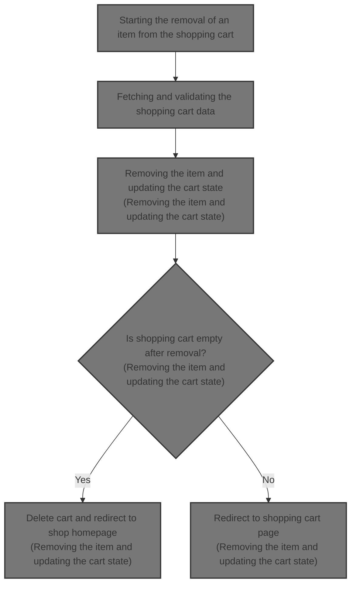
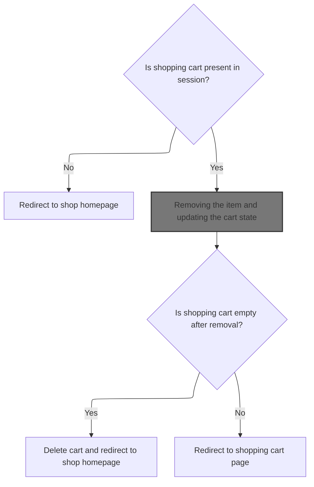
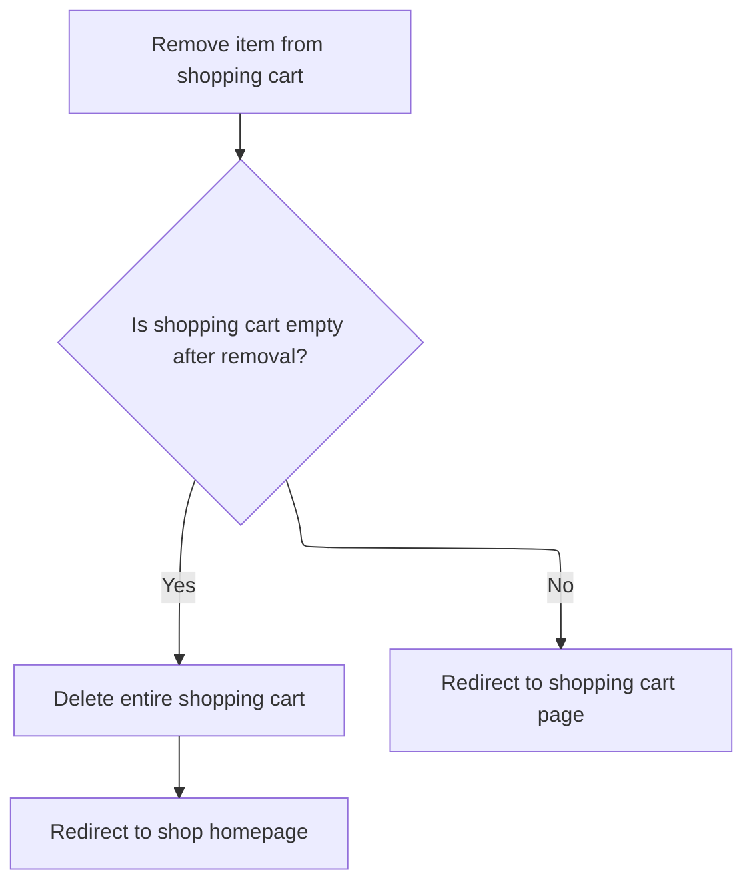

This document describes the flow of removing an item from the shopping cart. When a user requests to remove an item, the system checks for the cart in the session, retrieves and validates the cart data, removes the item considering its properties, and updates the cart state. If the cart is empty after removal, it is deleted and the user is redirected to the shop homepage; otherwise, the user is redirected to the updated cart page.



# Starting the removal of an item from the shopping cart



This section describes the process of removing an item from the shopping cart in the Shopizer e-commerce platform.

| Category       | Rule Name                   | Description                                                                                                                                  |
| -------------- | --------------------------- | -------------------------------------------------------------------------------------------------------------------------------------------- |
| Business logic | Cart session presence       | If there is no shopping cart present in the user's session, the user must be redirected to the shop homepage.                                |
| Business logic | Item property consideration | When removing an item, the system must consider item properties to correctly identify and remove the exact item variant from the cart.       |
| Business logic | Empty cart handling         | After an item is removed, if the shopping cart becomes empty, the cart must be deleted and the user redirected to the shop homepage.         |
| Business logic | Non-empty cart redirection  | If the shopping cart still contains items after removal, the user should be redirected to the shopping cart page to review the updated cart. |

<SwmSnippet path="/shopizer/sm-shop/src/main/java/com/salesmanager/web/shop/controller/shoppingCart/ShoppingCartController.java" line="309">

---

We get the current cart info from the session and then fetch the full cart data through the facade to make sure we remove the right item, considering item properties.

```java
	String removeShoppingCartItem(final Long lineItemId, final HttpServletRequest request, final HttpServletResponse response) throws Exception {


		//Looks in the HttpSession to see if a customer is logged in

		//get any shopping cart for this user

		//** need to check if the item has property, similar items may exist but with different properties
		//String attributes = request.getParameter("attribute");//attributes id are sent as 1|2|5|
		//this will help with hte removal of the appropriate item

		//remove the item shoppingCartService.create

		//create JSON representation of the shopping cart

		//return the JSON structure in AjaxResponse

		//store the shopping cart in the http session

	    MerchantStore store = getSessionAttribute(Constants.MERCHANT_STORE, request);
	    Language language = (Language)request.getAttribute(Constants.LANGUAGE);
	    Customer customer = getSessionAttribute(  Constants.CUSTOMER, request );
        
        /** there must be a cart in the session **/
        String cartCode = (String)request.getSession().getAttribute(Constants.SHOPPING_CART);
        
        if(StringUtils.isBlank(cartCode)) {
        	return "redirect:/shop";
        }
                
        ShoppingCartData shoppingCart = shoppingCartFacade.getShoppingCartData(customer, store, cartCode);
                
```

---

</SwmSnippet>

## Fetching and validating the shopping cart data

```mermaid
%%{init: {"flowchart": {"defaultRenderer": "elk"}} }%%
flowchart TD
    node1["Start getShoppingCartData"]
    click node1 openCode "shopizer/sm-shop/src/main/java/com/salesmanager/web/shop/controller/shoppingCart/facade/ShoppingCartFacadeImpl.java:260:261"
    node1 --> node2{"Is customer provided?"}
    click node2 openCode "shopizer/sm-shop/src/main/java/com/salesmanager/web/shop/controller/shoppingCart/facade/ShoppingCartFacadeImpl.java:268:270"
    node2 -->|"Yes"| node3["Retrieve cart by customer"]
    click node3 openCode "shopizer/sm-core/src/main/java/com/salesmanager/core/business/shoppingcart/service/ShoppingCartServiceImpl.java:68:86"
    node2 -->|"No"| node4{"Is shoppingCartId provided?"}
    click node4 openCode "shopizer/sm-shop/src/main/java/com/salesmanager/web/shop/controller/shoppingCart/facade/ShoppingCartFacadeImpl.java:278:280"
    node3 --> node5{"Is cart found after customer retrieval?"}
    click node5 openCode "shopizer/sm-shop/src/main/java/com/salesmanager/web/shop/controller/shoppingCart/facade/ShoppingCartFacadeImpl.java:293:295"
    node5 -->|"No"| node4
    node5 -->|"Yes"| node6["Populate and calculate cart data"]
    click node6 openCode "shopizer/sm-shop/src/main/java/com/salesmanager/web/shop/controller/shoppingCart/facade/ShoppingCartFacadeImpl.java:300:307"
    node4 -->|"Yes"| node7["Retrieve cart by shoppingCartId and store"]
    click node7 openCode "shopizer/sm-shop/src/main/java/com/salesmanager/web/shop/controller/shoppingCart/facade/ShoppingCartFacadeImpl.java:280:281"
    node4 -->|"No"| node8["Return null"]
    click node8 openCode "shopizer/sm-shop/src/main/java/com/salesmanager/web/shop/controller/shoppingCart/facade/ShoppingCartFacadeImpl.java:293:295"
    node7 --> node9{"Is cart found after shoppingCartId retrieval?"}
    click node9 openCode "shopizer/sm-shop/src/main/java/com/salesmanager/web/shop/controller/shoppingCart/facade/ShoppingCartFacadeImpl.java:293:295"
    node9 -->|"No"| node8
    node9 -->|"Yes"| node6
    node6 --> node10["Return populated cart data"]
    click node10 openCode "shopizer/sm-shop/src/main/java/com/salesmanager/web/shop/controller/shoppingCart/facade/ShoppingCartFacadeImpl.java:306:307"
classDef HeadingStyle fill:#777777,stroke:#333,stroke-width:2px;

%% Swimm:
%% %%{init: {"flowchart": {"defaultRenderer": "elk"}} }%%
%% flowchart TD
%%     node1["Start <SwmToken path="shopizer/sm-shop/src/main/java/com/salesmanager/web/shop/controller/shoppingCart/ShoppingCartController.java" pos="340:9:9" line-data="        ShoppingCartData shoppingCart = shoppingCartFacade.getShoppingCartData(customer, store, cartCode);">`getShoppingCartData`</SwmToken>"]
%%     click node1 openCode "<SwmPath>[shopizer/…/facade/ShoppingCartFacadeImpl.java](shopizer/sm-shop/src/main/java/com/salesmanager/web/shop/controller/shoppingCart/facade/ShoppingCartFacadeImpl.java)</SwmPath>:260:261"
%%     node1 --> node2{"Is customer provided?"}
%%     click node2 openCode "<SwmPath>[shopizer/…/facade/ShoppingCartFacadeImpl.java](shopizer/sm-shop/src/main/java/com/salesmanager/web/shop/controller/shoppingCart/facade/ShoppingCartFacadeImpl.java)</SwmPath>:268:270"
%%     node2 -->|"Yes"| node3["Retrieve cart by customer"]
%%     click node3 openCode "<SwmPath>[shopizer/…/service/ShoppingCartServiceImpl.java](shopizer/sm-core/src/main/java/com/salesmanager/core/business/shoppingcart/service/ShoppingCartServiceImpl.java)</SwmPath>:68:86"
%%     node2 -->|"No"| node4{"Is <SwmToken path="shopizer/sm-shop/src/main/java/com/salesmanager/web/shop/controller/shoppingCart/facade/ShoppingCartFacadeImpl.java" pos="261:5:5" line-data="                                                 final String shoppingCartId )">`shoppingCartId`</SwmToken> provided?"}
%%     click node4 openCode "<SwmPath>[shopizer/…/facade/ShoppingCartFacadeImpl.java](shopizer/sm-shop/src/main/java/com/salesmanager/web/shop/controller/shoppingCart/facade/ShoppingCartFacadeImpl.java)</SwmPath>:278:280"
%%     node3 --> node5{"Is cart found after customer retrieval?"}
%%     click node5 openCode "<SwmPath>[shopizer/…/facade/ShoppingCartFacadeImpl.java](shopizer/sm-shop/src/main/java/com/salesmanager/web/shop/controller/shoppingCart/facade/ShoppingCartFacadeImpl.java)</SwmPath>:293:295"
%%     node5 -->|"No"| node4
%%     node5 -->|"Yes"| node6["Populate and calculate cart data"]
%%     click node6 openCode "<SwmPath>[shopizer/…/facade/ShoppingCartFacadeImpl.java](shopizer/sm-shop/src/main/java/com/salesmanager/web/shop/controller/shoppingCart/facade/ShoppingCartFacadeImpl.java)</SwmPath>:300:307"
%%     node4 -->|"Yes"| node7["Retrieve cart by <SwmToken path="shopizer/sm-shop/src/main/java/com/salesmanager/web/shop/controller/shoppingCart/facade/ShoppingCartFacadeImpl.java" pos="261:5:5" line-data="                                                 final String shoppingCartId )">`shoppingCartId`</SwmToken> and store"]
%%     click node7 openCode "<SwmPath>[shopizer/…/facade/ShoppingCartFacadeImpl.java](shopizer/sm-shop/src/main/java/com/salesmanager/web/shop/controller/shoppingCart/facade/ShoppingCartFacadeImpl.java)</SwmPath>:280:281"
%%     node4 -->|"No"| node8["Return null"]
%%     click node8 openCode "<SwmPath>[shopizer/…/facade/ShoppingCartFacadeImpl.java](shopizer/sm-shop/src/main/java/com/salesmanager/web/shop/controller/shoppingCart/facade/ShoppingCartFacadeImpl.java)</SwmPath>:293:295"
%%     node7 --> node9{"Is cart found after <SwmToken path="shopizer/sm-shop/src/main/java/com/salesmanager/web/shop/controller/shoppingCart/facade/ShoppingCartFacadeImpl.java" pos="261:5:5" line-data="                                                 final String shoppingCartId )">`shoppingCartId`</SwmToken> retrieval?"}
%%     click node9 openCode "<SwmPath>[shopizer/…/facade/ShoppingCartFacadeImpl.java](shopizer/sm-shop/src/main/java/com/salesmanager/web/shop/controller/shoppingCart/facade/ShoppingCartFacadeImpl.java)</SwmPath>:293:295"
%%     node9 -->|"No"| node8
%%     node9 -->|"Yes"| node6
%%     node6 --> node10["Return populated cart data"]
%%     click node10 openCode "<SwmPath>[shopizer/…/facade/ShoppingCartFacadeImpl.java](shopizer/sm-shop/src/main/java/com/salesmanager/web/shop/controller/shoppingCart/facade/ShoppingCartFacadeImpl.java)</SwmPath>:306:307"
%% classDef HeadingStyle fill:#777777,stroke:#333,stroke-width:2px;
```



This section handles fetching and validating the shopping cart data for a customer or by shopping cart ID, ensuring the cart is current and enriched with pricing and calculation details before returning.

| Category       | Rule Name               | Description                                                                                                                                                                                                                                                                                                                                                                                                        |
| -------------- | ----------------------- | ------------------------------------------------------------------------------------------------------------------------------------------------------------------------------------------------------------------------------------------------------------------------------------------------------------------------------------------------------------------------------------------------------------------ |
| Business logic | Customer cart priority  | If a customer is provided, the system must first attempt to retrieve the shopping cart associated with that customer before any other retrieval method.                                                                                                                                                                                                                                                            |
| Business logic | Fallback cart retrieval | If no cart is found by customer or if no customer is provided, the system should attempt to retrieve the cart by the provided <SwmToken path="shopizer/sm-shop/src/main/java/com/salesmanager/web/shop/controller/shoppingCart/facade/ShoppingCartFacadeImpl.java" pos="261:5:5" line-data="                                                 final String shoppingCartId )">`shoppingCartId`</SwmToken> and store. |
| Business logic | Obsolete cart removal   | If a retrieved shopping cart is marked as obsolete, it must be deleted and treated as non-existent, returning null instead of the cart data.                                                                                                                                                                                                                                                                       |
| Business logic | Cart data enrichment    | Before returning, the shopping cart data must be populated with pricing, calculation, and language-specific details to provide a complete and accurate cart representation.                                                                                                                                                                                                                                        |

<SwmSnippet path="/shopizer/sm-shop/src/main/java/com/salesmanager/web/shop/controller/shoppingCart/facade/ShoppingCartFacadeImpl.java" line="260">

---

We try to get the cart by customer first for accuracy, then fallback to cart code if needed.

```java
    public ShoppingCartData getShoppingCartData( final Customer customer, final MerchantStore store,
                                                 final String shoppingCartId )
        throws Exception
    {

        ShoppingCart cart = null;
        try
        {
            if ( customer != null )
            {
                LOG.info( "Reteriving customer shopping cart..." );

                cart = shoppingCartService.getShoppingCart( customer );

            }

            else
            {
```

---

</SwmSnippet>

<SwmSnippet path="/shopizer/sm-core/src/main/java/com/salesmanager/core/business/shoppingcart/service/ShoppingCartServiceImpl.java" line="68">

---

In <SwmToken path="shopizer/sm-core/src/main/java/com/salesmanager/core/business/shoppingcart/service/ShoppingCartServiceImpl.java" pos="68:5:5" line-data="	public ShoppingCart getShoppingCart(final Customer customer) throws ServiceException {">`getShoppingCart`</SwmToken> we get the cart from the DAO, then call <SwmToken path="shopizer/sm-core/src/main/java/com/salesmanager/core/business/shoppingcart/service/ShoppingCartServiceImpl.java" pos="73:1:1" line-data="			populateShoppingCart(shoppingCart);">`populateShoppingCart`</SwmToken> to add extra details. We check if the cart is obsolete; if yes, we delete it and return null. Otherwise, we return the valid cart. This manages cart lifecycle beyond just fetching data.

```java
	public ShoppingCart getShoppingCart(final Customer customer) throws ServiceException {

		try {

			ShoppingCart shoppingCart = shoppingCartDao.getByCustomer(customer);
			populateShoppingCart(shoppingCart);
			if(shoppingCart!=null && shoppingCart.isObsolete()) {
				delete(shoppingCart);
				return null;
			} else {
				return shoppingCart;
			}


		} catch (Exception e) {
			throw new ServiceException(e);
		}

	}
```

---

</SwmSnippet>

<SwmSnippet path="/shopizer/sm-shop/src/main/java/com/salesmanager/web/shop/controller/shoppingCart/facade/ShoppingCartFacadeImpl.java" line="278">

---

After returning from <SwmToken path="shopizer/sm-shop/src/main/java/com/salesmanager/web/shop/controller/shoppingCart/facade/ShoppingCartFacadeImpl.java" pos="272:7:7" line-data="                cart = shoppingCartService.getShoppingCart( customer );">`getShoppingCart`</SwmToken> in the service, <SwmToken path="shopizer/sm-shop/src/main/java/com/salesmanager/web/shop/controller/shoppingCart/ShoppingCartController.java" pos="340:9:9" line-data="        ShoppingCartData shoppingCart = shoppingCartFacade.getShoppingCartData(customer, store, cartCode);">`getShoppingCartData`</SwmToken> checks if the cart is null. If not, it uses <SwmToken path="shopizer/sm-shop/src/main/java/com/salesmanager/web/shop/controller/shoppingCart/facade/ShoppingCartFacadeImpl.java" pos="300:1:1" line-data="        ShoppingCartDataPopulator shoppingCartDataPopulator = new ShoppingCartDataPopulator();">`ShoppingCartDataPopulator`</SwmToken> to add pricing and calculation details, then returns the enriched <SwmToken path="shopizer/sm-shop/src/main/java/com/salesmanager/web/shop/controller/shoppingCart/ShoppingCartController.java" pos="340:1:1" line-data="        ShoppingCartData shoppingCart = shoppingCartFacade.getShoppingCartData(customer, store, cartCode);">`ShoppingCartData`</SwmToken> for the controller to use.

```java
                if ( StringUtils.isNotBlank( shoppingCartId ) && cart == null )
                {
                    cart = shoppingCartService.getByCode( shoppingCartId, store );
                }

            }
        }
        catch ( ServiceException ex )
        {
            LOG.error( "Error while retriving cart from customer", ex );
        }
        catch( NoResultException nre) {
        	//nothing
        }

        if ( cart == null )
        {
            return null;
        }

        LOG.info( "Cart model found." );

        ShoppingCartDataPopulator shoppingCartDataPopulator = new ShoppingCartDataPopulator();
        shoppingCartDataPopulator.setShoppingCartCalculationService( shoppingCartCalculationService );
        shoppingCartDataPopulator.setPricingService( pricingService );

        Language language = (Language) getKeyValue( Constants.LANGUAGE );
        MerchantStore merchantStore = (MerchantStore) getKeyValue( Constants.MERCHANT_STORE );
        return shoppingCartDataPopulator.populate( cart, merchantStore, language );

    }
```

---

</SwmSnippet>

## Removing the item and updating the cart state



<SwmSnippet path="/shopizer/sm-shop/src/main/java/com/salesmanager/web/shop/controller/shoppingCart/ShoppingCartController.java" line="342">

---

After getting the updated <SwmToken path="shopizer/sm-shop/src/main/java/com/salesmanager/web/shop/controller/shoppingCart/ShoppingCartController.java" pos="342:1:1" line-data="		ShoppingCartData shoppingCartData=shoppingCartFacade.removeCartItem(lineItemId, shoppingCart.getCode(),store,language);">`ShoppingCartData`</SwmToken> in <SwmToken path="shopizer/sm-shop/src/main/java/com/salesmanager/web/shop/controller/shoppingCart/ShoppingCartController.java" pos="309:3:3" line-data="	String removeShoppingCartItem(final Long lineItemId, final HttpServletRequest request, final HttpServletResponse response) throws Exception {">`removeShoppingCartItem`</SwmToken>, we call <SwmToken path="shopizer/sm-shop/src/main/java/com/salesmanager/web/shop/controller/shoppingCart/ShoppingCartController.java" pos="342:7:7" line-data="		ShoppingCartData shoppingCartData=shoppingCartFacade.removeCartItem(lineItemId, shoppingCart.getCode(),store,language);">`removeCartItem`</SwmToken> on the facade. If the cart ends up empty, we delete it and redirect to the shop. Otherwise, we redirect to the cart page to show the updated state.

```java
		ShoppingCartData shoppingCartData=shoppingCartFacade.removeCartItem(lineItemId, shoppingCart.getCode(),store,language);

		
		if(CollectionUtils.isEmpty(shoppingCartData.getShoppingCartItems())) {
			shoppingCartFacade.deleteShoppingCart(shoppingCartData.getId(), store);
			return "redirect:/shop";
		}
		
		
		
		return Constants.REDIRECT_PREFIX + "/shop/shoppingCart.html";


	}
```

---

</SwmSnippet>

&nbsp;

*This is an auto-generated document by Swimm 🌊 and has not yet been verified by a human*

<SwmMeta version="3.0.0" repo-id="Z2l0aHViJTNBJTNBU2hvcGl6ZXIlM0ElM0F1bWFsaW5nYXN3YW1p" repo-name="Shopizer"><sup>Powered by [Swimm](https://app.swimm.io/)</sup></SwmMeta>
