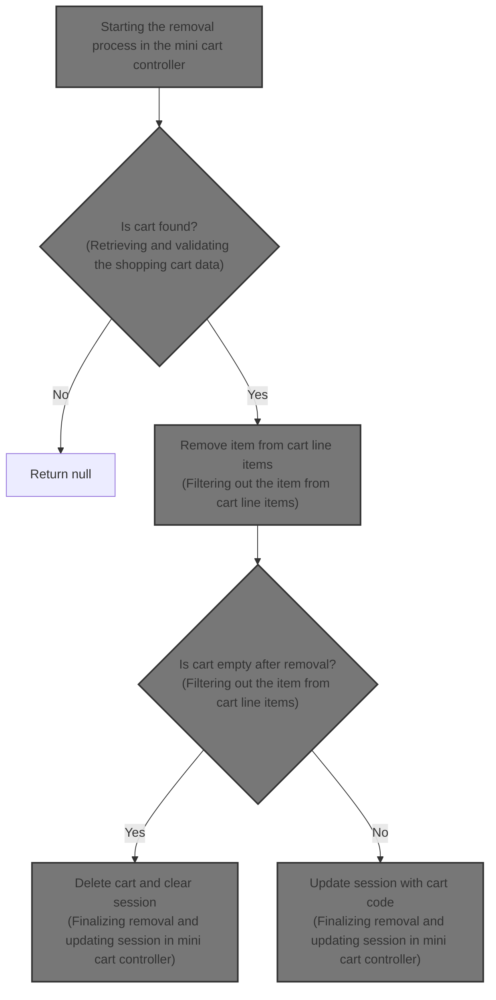
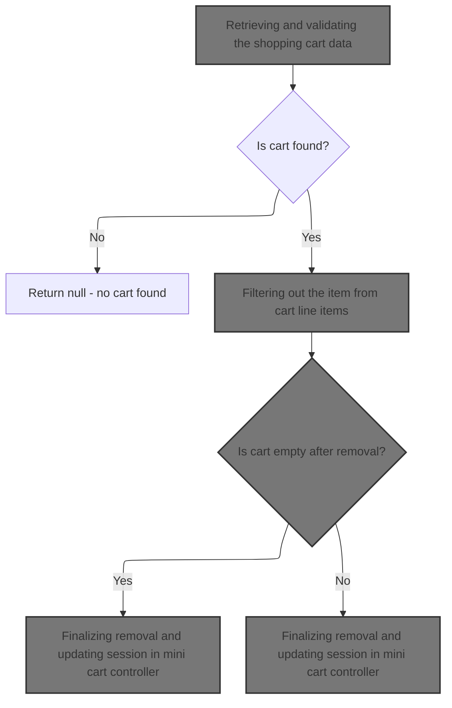
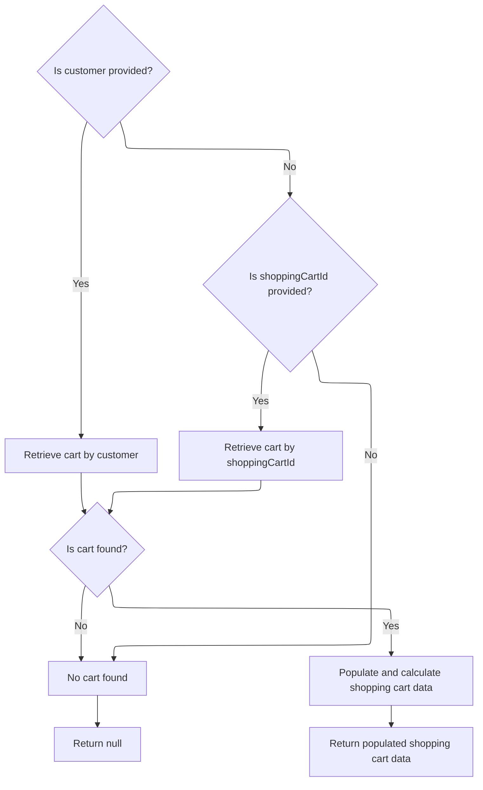
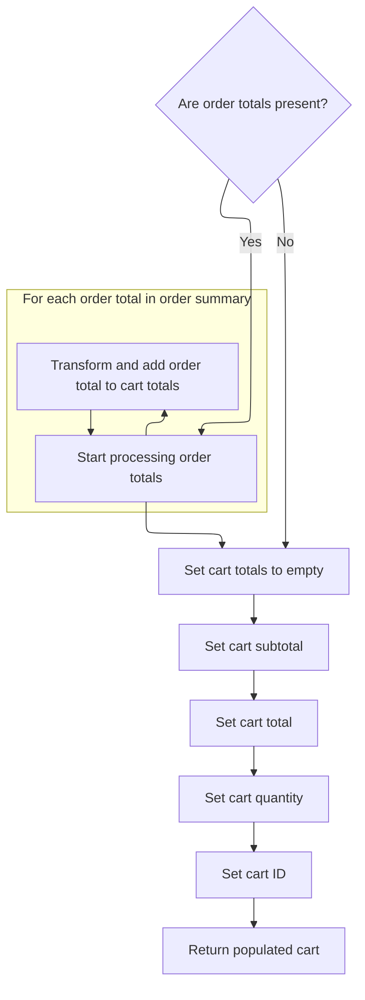

This document describes the flow for removing an item from a shopping cart. It includes retrieving and validating the cart, removing the specified item, updating and recalculating the cart, updating the user session, and returning the updated cart data for the user interface.



# Starting the removal process in the mini cart controller



This section describes the process of removing an item from the shopping cart in the mini cart controller, ensuring the cart exists, filtering out the item, and updating the session accordingly.

| Category        | Rule Name                     | Description                                                                                                                                        |
| --------------- | ----------------------------- | -------------------------------------------------------------------------------------------------------------------------------------------------- |
| Data validation | Cart existence validation     | If the shopping cart does not exist for the given shopping cart code and merchant store, the removal process returns null and no changes are made. |
| Business logic  | Item removal from cart        | Only items that exist in the cart line items can be removed; the removal filters out the specified item from the cart's line items.                |
| Business logic  | Empty cart session update     | After item removal, if the cart is empty, the session is updated to reflect the empty cart state.                                                  |
| Business logic  | Non-empty cart session update | If the cart is not empty after removal, the session is updated to reflect the current cart state with remaining items.                             |

<SwmSnippet path="/shopizer/sm-shop/src/main/java/com/salesmanager/web/shop/controller/shoppingCart/MiniCartController.java" line="68">

---

We start by getting the cart data to make sure the cart exists before removing an item. Then we call the facade to get that data.

```java
	public @ResponseBody ShoppingCartData removeShoppingCartItem(Long lineItemId, final String shoppingCartCode, HttpServletRequest request, Model model) throws Exception {
		Language language = (Language)request.getAttribute(Constants.LANGUAGE);
		MerchantStore merchantStore = (MerchantStore)request.getAttribute(Constants.MERCHANT_STORE);
		ShoppingCartData cart =  shoppingCartFacade.getShoppingCartData(null, merchantStore, shoppingCartCode);
		if(cart==null) {
			return null;
		}
```

---

</SwmSnippet>

## Retrieving and validating the shopping cart data



This section handles retrieving and validating the shopping cart data based on customer or shopping cart ID, ensuring the cart is current and properly populated for use.

| Category       | Rule Name                     | Description                                                                                 |
| -------------- | ----------------------------- | ------------------------------------------------------------------------------------------- |
| Business logic | Customer cart retrieval       | If a customer is provided, retrieve the shopping cart associated with that customer.        |
| Business logic | Fallback cart retrieval by ID | If no customer is provided but a shopping cart ID is given, retrieve the cart by that ID.   |
| Business logic | Obsolete cart deletion        | If a retrieved cart is marked as obsolete, delete it and return no cart.                    |
| Business logic | Cart data population          | Populate and calculate the shopping cart data before returning it for use in the web layer. |

<SwmSnippet path="/shopizer/sm-shop/src/main/java/com/salesmanager/web/shop/controller/shoppingCart/facade/ShoppingCartFacadeImpl.java" line="260">

---

In ShoppingCartFacadeImpl.getShoppingCartData, we start by checking if there's a customer. If yes, we get their cart via ShoppingCartServiceImpl.getShoppingCart. If not, we plan to get the cart by its code later. This step decides how we fetch the cart based on user context.

```java
    public ShoppingCartData getShoppingCartData( final Customer customer, final MerchantStore store,
                                                 final String shoppingCartId )
        throws Exception
    {

        ShoppingCart cart = null;
        try
        {
            if ( customer != null )
            {
                LOG.info( "Reteriving customer shopping cart..." );

                cart = shoppingCartService.getShoppingCart( customer );

            }

            else
            {
```

---

</SwmSnippet>

<SwmSnippet path="/shopizer/sm-core/src/main/java/com/salesmanager/core/business/shoppingcart/service/ShoppingCartServiceImpl.java" line="68">

---

In ShoppingCartServiceImpl.getShoppingCart, we get the cart for the customer, fill it with extra data, then check if it's obsolete. If it is, we delete it and return null. Otherwise, we return the cart. This keeps carts fresh and avoids using outdated ones.

```java
	public ShoppingCart getShoppingCart(final Customer customer) throws ServiceException {

		try {

			ShoppingCart shoppingCart = shoppingCartDao.getByCustomer(customer);
			populateShoppingCart(shoppingCart);
			if(shoppingCart!=null && shoppingCart.isObsolete()) {
				delete(shoppingCart);
				return null;
			} else {
				return shoppingCart;
			}


		} catch (Exception e) {
			throw new ServiceException(e);
		}

	}
```

---

</SwmSnippet>

<SwmSnippet path="/shopizer/sm-shop/src/main/java/com/salesmanager/web/shop/controller/shoppingCart/facade/ShoppingCartFacadeImpl.java" line="278">

---

After getting the cart from the service, if it's null and we have a cart ID, we try to get the cart by that code. Then we convert the cart model to a data object using ShoppingCartDataPopulator.populate, which prepares it for use in the web layer.

```java
                if ( StringUtils.isNotBlank( shoppingCartId ) && cart == null )
                {
                    cart = shoppingCartService.getByCode( shoppingCartId, store );
                }

            }
        }
        catch ( ServiceException ex )
        {
            LOG.error( "Error while retriving cart from customer", ex );
        }
        catch( NoResultException nre) {
        	//nothing
        }

        if ( cart == null )
        {
            return null;
        }

        LOG.info( "Cart model found." );

        ShoppingCartDataPopulator shoppingCartDataPopulator = new ShoppingCartDataPopulator();
        shoppingCartDataPopulator.setShoppingCartCalculationService( shoppingCartCalculationService );
        shoppingCartDataPopulator.setPricingService( pricingService );

        Language language = (Language) getKeyValue( Constants.LANGUAGE );
        MerchantStore merchantStore = (MerchantStore) getKeyValue( Constants.MERCHANT_STORE );
        return shoppingCartDataPopulator.populate( cart, merchantStore, language );

    }
```

---

</SwmSnippet>

## Transforming cart model to frontend data

```mermaid
%%{init: {"flowchart": {"defaultRenderer": "elk"}} }%%
flowchart TD
    node1["Start populating ShoppingCartData"] --> node2{"Shopping cart has line items?"}
    click node1 openCode "shopizer/sm-shop/src/main/java/com/salesmanager/web/populator/shoppingCart/ShoppingCartDataPopulator.java:73:127"
    node2 -->|"Yes"| loop1["For each item in cart: transform item details and accumulate quantity"]
    node2 -->|"No"| node3["Calculating order totals and summaries"]
    click node2 openCode "shopizer/sm-shop/src/main/java/com/salesmanager/web/populator/shoppingCart/ShoppingCartDataPopulator.java:81:127"
    loop1 --> node3
    node3["Calculating order totals and summaries"] --> node4{"Order summary has totals?"}
    
    node4 -->|"Yes"| loop2["For each order total: transform total details"]
    node4 -->|"No"| node5["Set cart summary values and return"]
    click node4 openCode "shopizer/sm-shop/src/main/java/com/salesmanager/web/populator/shoppingCart/ShoppingCartDataPopulator.java:139:146"
    loop2 --> node5
    node5["Set cart summary values and return"] --> node6["Return populated ShoppingCartData"]
    click node5 openCode "shopizer/sm-shop/src/main/java/com/salesmanager/web/populator/shoppingCart/ShoppingCartDataPopulator.java:147:159"
classDef HeadingStyle fill:#777777,stroke:#333,stroke-width:2px;
click node3 goToHeading "Calculating order totals and summaries"
node3:::HeadingStyle

%% Swimm:
%% %%{init: {"flowchart": {"defaultRenderer": "elk"}} }%%
%% flowchart TD
%%     node1["Start populating <SwmToken path="shopizer/sm-shop/src/main/java/com/salesmanager/web/shop/controller/shoppingCart/MiniCartController.java" pos="68:6:6" line-data="	public @ResponseBody ShoppingCartData removeShoppingCartItem(Long lineItemId, final String shoppingCartCode, HttpServletRequest request, Model model) throws Exception {">`ShoppingCartData`</SwmToken>"] --> node2{"Shopping cart has line items?"}
%%     click node1 openCode "<SwmPath>[shopizer/…/shoppingCart/ShoppingCartDataPopulator.java](shopizer/sm-shop/src/main/java/com/salesmanager/web/populator/shoppingCart/ShoppingCartDataPopulator.java)</SwmPath>:73:127"
%%     node2 -->|"Yes"| loop1["For each item in cart: transform item details and accumulate quantity"]
%%     node2 -->|"No"| node3["Calculating order totals and summaries"]
%%     click node2 openCode "<SwmPath>[shopizer/…/shoppingCart/ShoppingCartDataPopulator.java](shopizer/sm-shop/src/main/java/com/salesmanager/web/populator/shoppingCart/ShoppingCartDataPopulator.java)</SwmPath>:81:127"
%%     loop1 --> node3
%%     node3["Calculating order totals and summaries"] --> node4{"Order summary has totals?"}
%%     
%%     node4 -->|"Yes"| loop2["For each order total: transform total details"]
%%     node4 -->|"No"| node5["Set cart summary values and return"]
%%     click node4 openCode "<SwmPath>[shopizer/…/shoppingCart/ShoppingCartDataPopulator.java](shopizer/sm-shop/src/main/java/com/salesmanager/web/populator/shoppingCart/ShoppingCartDataPopulator.java)</SwmPath>:139:146"
%%     loop2 --> node5
%%     node5["Set cart summary values and return"] --> node6["Return populated <SwmToken path="shopizer/sm-shop/src/main/java/com/salesmanager/web/shop/controller/shoppingCart/MiniCartController.java" pos="68:6:6" line-data="	public @ResponseBody ShoppingCartData removeShoppingCartItem(Long lineItemId, final String shoppingCartCode, HttpServletRequest request, Model model) throws Exception {">`ShoppingCartData`</SwmToken>"]
%%     click node5 openCode "<SwmPath>[shopizer/…/shoppingCart/ShoppingCartDataPopulator.java](shopizer/sm-shop/src/main/java/com/salesmanager/web/populator/shoppingCart/ShoppingCartDataPopulator.java)</SwmPath>:147:159"
%% classDef HeadingStyle fill:#777777,stroke:#333,stroke-width:2px;
%% click node3 goToHeading "Calculating order totals and summaries"
%% node3:::HeadingStyle
```



This section transforms the internal shopping cart model into a frontend-friendly data structure for display, including item details, quantities, prices, images, attributes, and order totals.

| Category       | Rule Name                 | Description                                                                                                                                                         |
| -------------- | ------------------------- | ------------------------------------------------------------------------------------------------------------------------------------------------------------------- |
| Business logic | Cart item transformation  | Each item in the shopping cart must be transformed into a frontend-friendly object including product code, name, price, quantity, subtotal, and image if available. |
| Business logic | Attribute mapping         | Product attributes associated with each cart item must be mapped to a simplified structure including option names and values for frontend display.                  |
| Business logic | Cart quantity calculation | The total quantity of items in the cart must be accurately summed from all line items.                                                                              |
| Business logic | Order totals calculation  | Order totals must be calculated and included in the cart data to reflect accurate pricing summaries.                                                                |
| Business logic | Image inclusion           | If a product image is available for a cart item, it must be included in the frontend data with a valid image path.                                                  |

<SwmSnippet path="/shopizer/sm-shop/src/main/java/com/salesmanager/web/populator/shoppingCart/ShoppingCartDataPopulator.java" line="73">

---

In ShoppingCartDataPopulator.populate, we start by converting each internal cart item into a frontend-friendly object, including product details, prices, quantities, and images. We also map item attributes to a simpler structure for the UI.

```java
    public ShoppingCartData populate(final ShoppingCart shoppingCart,
                                     final ShoppingCartData cart, final MerchantStore store, final Language language) {

    	int cartQuantity = 0;
        cart.setCode(shoppingCart.getShoppingCartCode());
        Set<com.salesmanager.core.business.shoppingcart.model.ShoppingCartItem> items = shoppingCart.getLineItems();
        List<ShoppingCartItem> shoppingCartItemsList=Collections.emptyList();
        try{
            if(items!=null) {
                shoppingCartItemsList=new ArrayList<ShoppingCartItem>();
                for(com.salesmanager.core.business.shoppingcart.model.ShoppingCartItem item : items) {

                    ShoppingCartItem shoppingCartItem = new ShoppingCartItem();
                    shoppingCartItem.setCode(cart.getCode());
                    shoppingCartItem.setProductCode(item.getProduct().getSku());
                    shoppingCartItem.setProductVirtual(item.isProductVirtual());

                    shoppingCartItem.setProductId(item.getProductId());
                    shoppingCartItem.setId(item.getId());
                    shoppingCartItem.setName(item.getProduct().getProductDescription().getName());

                    shoppingCartItem.setPrice(pricingService.getDisplayAmount(item.getItemPrice(),store));
                    shoppingCartItem.setQuantity(item.getQuantity());
                    
                    
                    cartQuantity = cartQuantity + item.getQuantity();
                    
                    shoppingCartItem.setProductPrice(item.getItemPrice());
                    shoppingCartItem.setSubTotal(pricingService.getDisplayAmount(item.getSubTotal(), store));
                    ProductImage image = item.getProduct().getProductImage();
                    if(image!=null) {
                        String imagePath = ImageFilePathUtils.buildProductImageFilePath(store, item.getProduct().getSku(), image.getProductImage());
                        shoppingCartItem.setImage(imagePath);
                    }
                    Set<com.salesmanager.core.business.shoppingcart.model.ShoppingCartAttributeItem> attributes = item.getAttributes();
                    if(attributes!=null) {
                        List<ShoppingCartAttribute> cartAttributes = new ArrayList<ShoppingCartAttribute>();
                        for(com.salesmanager.core.business.shoppingcart.model.ShoppingCartAttributeItem attribute : attributes) {
                            ShoppingCartAttribute cartAttribute = new ShoppingCartAttribute();
                            cartAttribute.setId(attribute.getId());
                            cartAttribute.setAttributeId(attribute.getProductAttributeId());
                            cartAttribute.setOptionId(attribute.getProductAttribute().getProductOption().getId());
                            cartAttribute.setOptionValueId(attribute.getProductAttribute().getProductOptionValue().getId());
                            List<ProductOptionDescription> optionDescriptions = attribute.getProductAttribute().getProductOption().getDescriptionsSettoList();
                            List<ProductOptionValueDescription> optionValueDescriptions = attribute.getProductAttribute().getProductOptionValue().getDescriptionsSettoList();
                            if(!CollectionUtils.isEmpty(optionDescriptions) && !CollectionUtils.isEmpty(optionValueDescriptions)) {
                            	cartAttribute.setOptionName(optionDescriptions.get(0).getName());
                            	cartAttribute.setOptionValue(optionValueDescriptions.get(0).getName());
                            	cartAttributes.add(cartAttribute);
                            }
                        }
                        shoppingCartItem.setShoppingCartAttributes(cartAttributes);
                    }
                    shoppingCartItemsList.add(shoppingCartItem);
                }
```

---

</SwmSnippet>

<SwmSnippet path="/shopizer/sm-shop/src/main/java/com/salesmanager/web/populator/shoppingCart/ShoppingCartDataPopulator.java" line="129">

---

We calculate order totals to get accurate pricing for the cart display.

```java
            if(CollectionUtils.isNotEmpty(shoppingCartItemsList)){
                cart.setShoppingCartItems(shoppingCartItemsList);
            }

            OrderSummary summary = new OrderSummary();
            List<com.salesmanager.core.business.shoppingcart.model.ShoppingCartItem> productsList = new ArrayList<com.salesmanager.core.business.shoppingcart.model.ShoppingCartItem>();
            productsList.addAll(shoppingCart.getLineItems());
            summary.setProducts(productsList);
            OrderTotalSummary orderSummary = shoppingCartCalculationService.calculate(shoppingCart,store, language );

```

---

</SwmSnippet>

### Calculating order totals and summaries

This section covers the calculation of order totals and summaries, which is essential for providing accurate pricing and billing information to customers.

| Category       | Rule Name               | Description                                                                                                       |
| -------------- | ----------------------- | ----------------------------------------------------------------------------------------------------------------- |
| Business logic | Subtotal calculation    | Calculate the subtotal by summing the price of each item multiplied by its quantity.                              |
| Business logic | Discount application    | Apply discounts only to eligible items or the entire order as specified by the promotion rules.                   |
| Business logic | Tax calculation         | Calculate taxes based on the applicable tax rates for the customer's location and the taxable items in the order. |
| Business logic | Shipping cost addition  | Add shipping costs to the order total based on the selected shipping method and destination.                      |
| Business logic | Grand total calculation | The grand total must be the sum of subtotal, taxes, shipping costs, minus any discounts applied.                  |

See <SwmLink doc-title="Shopping Cart Total Calculation Flow">[Shopping Cart Total Calculation Flow](.swm%5Cshopping-cart-total-calculation-flow.30bc9vmj.sw.md)</SwmLink>

### Finalizing cart data with calculated totals



<SwmSnippet path="/shopizer/sm-shop/src/main/java/com/salesmanager/web/populator/shoppingCart/ShoppingCartDataPopulator.java" line="139">

---

After getting the calculation results, we map each internal order total to a frontend-friendly object with code and value, then set these totals on the cart data for display.

```java
            if(CollectionUtils.isNotEmpty(orderSummary.getTotals())) {
            	List<OrderTotal> totals = new ArrayList<OrderTotal>();
            	for(com.salesmanager.core.business.order.model.OrderTotal t : orderSummary.getTotals()) {
            		OrderTotal total = new OrderTotal();
            		total.setCode(t.getOrderTotalCode());
            		total.setValue(t.getValue());
            		totals.add(total);
            	}
```

---

</SwmSnippet>

<SwmSnippet path="/shopizer/sm-shop/src/main/java/com/salesmanager/web/populator/shoppingCart/ShoppingCartDataPopulator.java" line="147">

---

Finally ShoppingCartDataPopulator.populate returns the fully populated cart data object with all items, totals, and pricing info ready for the frontend. If something goes wrong, it throws an exception.

```java
            	cart.setTotals(totals);
            }
            
            cart.setSubTotal(pricingService.getDisplayAmount(orderSummary.getSubTotal(), store));
            cart.setTotal(pricingService.getDisplayAmount(orderSummary.getTotal(), store));
            cart.setQuantity(cartQuantity);
            cart.setId(shoppingCart.getId());
        }
        catch(ServiceException ex){
            LOG.error( "Error while converting cart Model to cart Data.."+ex );
            throw new ConversionException( "Unable to create cart data", ex );
        }
        return cart;


    };
```

---

</SwmSnippet>

## Handling cart data after retrieval in mini cart controller

<SwmSnippet path="/shopizer/sm-shop/src/main/java/com/salesmanager/web/shop/controller/shoppingCart/MiniCartController.java" line="75">

---

After getting the cart data, we call <SwmToken path="shopizer/sm-shop/src/main/java/com/salesmanager/web/shop/controller/shoppingCart/MiniCartController.java" pos="75:7:7" line-data="		ShoppingCartData shoppingCartData=shoppingCartFacade.removeCartItem(lineItemId, cart.getCode(), merchantStore,language);">`removeCartItem`</SwmToken> on the facade to remove the specified item. This updates the cart and returns the new cart data with the item removed.

```java
		ShoppingCartData shoppingCartData=shoppingCartFacade.removeCartItem(lineItemId, cart.getCode(), merchantStore,language);
		
		
```

---

</SwmSnippet>

## Filtering out the item from cart line items

```mermaid
%%{init: {"flowchart": {"defaultRenderer": "elk"}} }%%
flowchart TD
    node1["Start removeCartItem"] --> node2{"Is cartId provided?"}
    click node1 openCode "shopizer/sm-shop/src/main/java/com/salesmanager/web/shop/controller/shoppingCart/facade/ShoppingCartFacadeImpl.java:324:325"
    node2 -->|"No"| node3["Return null"]
    click node2 openCode "shopizer/sm-shop/src/main/java/com/salesmanager/web/shop/controller/shoppingCart/facade/ShoppingCartFacadeImpl.java:327:328"
    node2 -->|"Yes"| node4["Retrieve cart by cartId and store"]
    click node4 openCode "shopizer/sm-shop/src/main/java/com/salesmanager/web/shop/controller/shoppingCart/facade/ShoppingCartFacadeImpl.java:330:331"
    node4 --> node5{"Does cart exist?"}
    click node5 openCode "shopizer/sm-shop/src/main/java/com/salesmanager/web/shop/controller/shoppingCart/facade/ShoppingCartFacadeImpl.java:331:332"
    node5 -->|"No"| node3
    node5 -->|"Yes"| node6{"Does cart have line items?"}
    click node6 openCode "shopizer/sm-shop/src/main/java/com/salesmanager/web/shop/controller/shoppingCart/facade/ShoppingCartFacadeImpl.java:333:334"
    node6 -->|"No"| node3
    node6 -->|"Yes"| subgraph loop1["For each item in cart"]
        node7{"Is item ID equal to itemID to remove?"}
        click node7 openCode "shopizer/sm-shop/src/main/java/com/salesmanager/web/shop/controller/shoppingCart/facade/ShoppingCartFacadeImpl.java:337:343"
        node7 -->|"No"| node8["Include item in new cart item set"]
    end
    loop1 --> node9["Set new cart items"]
    click node9 openCode "shopizer/sm-shop/src/main/java/com/salesmanager/web/shop/controller/shoppingCart/facade/ShoppingCartFacadeImpl.java:344:345"
    node9 --> node10["Save updated cart"]
    click node10 openCode "shopizer/sm-shop/src/main/java/com/salesmanager/web/shop/controller/shoppingCart/facade/ShoppingCartFacadeImpl.java:345:346"
    node10 --> node11["Populate and return updated cart data"]
    click node11 openCode "shopizer/sm-shop/src/main/java/com/salesmanager/web/shop/controller/shoppingCart/facade/ShoppingCartFacadeImpl.java:350:353"
classDef HeadingStyle fill:#777777,stroke:#333,stroke-width:2px;

%% Swimm:
%% %%{init: {"flowchart": {"defaultRenderer": "elk"}} }%%
%% flowchart TD
%%     node1["Start <SwmToken path="shopizer/sm-shop/src/main/java/com/salesmanager/web/shop/controller/shoppingCart/MiniCartController.java" pos="75:7:7" line-data="		ShoppingCartData shoppingCartData=shoppingCartFacade.removeCartItem(lineItemId, cart.getCode(), merchantStore,language);">`removeCartItem`</SwmToken>"] --> node2{"Is <SwmToken path="shopizer/sm-shop/src/main/java/com/salesmanager/web/shop/controller/shoppingCart/facade/ShoppingCartFacadeImpl.java" pos="324:19:19" line-data="    public ShoppingCartData removeCartItem( final Long itemID, final String cartId ,final MerchantStore store,final Language language )">`cartId`</SwmToken> provided?"}
%%     click node1 openCode "<SwmPath>[shopizer/…/facade/ShoppingCartFacadeImpl.java](shopizer/sm-shop/src/main/java/com/salesmanager/web/shop/controller/shoppingCart/facade/ShoppingCartFacadeImpl.java)</SwmPath>:324:325"
%%     node2 -->|"No"| node3["Return null"]
%%     click node2 openCode "<SwmPath>[shopizer/…/facade/ShoppingCartFacadeImpl.java](shopizer/sm-shop/src/main/java/com/salesmanager/web/shop/controller/shoppingCart/facade/ShoppingCartFacadeImpl.java)</SwmPath>:327:328"
%%     node2 -->|"Yes"| node4["Retrieve cart by <SwmToken path="shopizer/sm-shop/src/main/java/com/salesmanager/web/shop/controller/shoppingCart/facade/ShoppingCartFacadeImpl.java" pos="324:19:19" line-data="    public ShoppingCartData removeCartItem( final Long itemID, final String cartId ,final MerchantStore store,final Language language )">`cartId`</SwmToken> and store"]
%%     click node4 openCode "<SwmPath>[shopizer/…/facade/ShoppingCartFacadeImpl.java](shopizer/sm-shop/src/main/java/com/salesmanager/web/shop/controller/shoppingCart/facade/ShoppingCartFacadeImpl.java)</SwmPath>:330:331"
%%     node4 --> node5{"Does cart exist?"}
%%     click node5 openCode "<SwmPath>[shopizer/…/facade/ShoppingCartFacadeImpl.java](shopizer/sm-shop/src/main/java/com/salesmanager/web/shop/controller/shoppingCart/facade/ShoppingCartFacadeImpl.java)</SwmPath>:331:332"
%%     node5 -->|"No"| node3
%%     node5 -->|"Yes"| node6{"Does cart have line items?"}
%%     click node6 openCode "<SwmPath>[shopizer/…/facade/ShoppingCartFacadeImpl.java](shopizer/sm-shop/src/main/java/com/salesmanager/web/shop/controller/shoppingCart/facade/ShoppingCartFacadeImpl.java)</SwmPath>:333:334"
%%     node6 -->|"No"| node3
%%     node6 -->|"Yes"| subgraph loop1["For each item in cart"]
%%         node7{"Is item ID equal to <SwmToken path="shopizer/sm-shop/src/main/java/com/salesmanager/web/shop/controller/shoppingCart/facade/ShoppingCartFacadeImpl.java" pos="324:12:12" line-data="    public ShoppingCartData removeCartItem( final Long itemID, final String cartId ,final MerchantStore store,final Language language )">`itemID`</SwmToken> to remove?"}
%%         click node7 openCode "<SwmPath>[shopizer/…/facade/ShoppingCartFacadeImpl.java](shopizer/sm-shop/src/main/java/com/salesmanager/web/shop/controller/shoppingCart/facade/ShoppingCartFacadeImpl.java)</SwmPath>:337:343"
%%         node7 -->|"No"| node8["Include item in new cart item set"]
%%     end
%%     loop1 --> node9["Set new cart items"]
%%     click node9 openCode "<SwmPath>[shopizer/…/facade/ShoppingCartFacadeImpl.java](shopizer/sm-shop/src/main/java/com/salesmanager/web/shop/controller/shoppingCart/facade/ShoppingCartFacadeImpl.java)</SwmPath>:344:345"
%%     node9 --> node10["Save updated cart"]
%%     click node10 openCode "<SwmPath>[shopizer/…/facade/ShoppingCartFacadeImpl.java](shopizer/sm-shop/src/main/java/com/salesmanager/web/shop/controller/shoppingCart/facade/ShoppingCartFacadeImpl.java)</SwmPath>:345:346"
%%     node10 --> node11["Populate and return updated cart data"]
%%     click node11 openCode "<SwmPath>[shopizer/…/facade/ShoppingCartFacadeImpl.java](shopizer/sm-shop/src/main/java/com/salesmanager/web/shop/controller/shoppingCart/facade/ShoppingCartFacadeImpl.java)</SwmPath>:350:353"
%% classDef HeadingStyle fill:#777777,stroke:#333,stroke-width:2px;
```

This section handles the removal of an item from the shopping cart by filtering out the specified item from the cart's line items and returning the updated cart data.

| Category        | Rule Name                 | Description                                                                                                         |
| --------------- | ------------------------- | ------------------------------------------------------------------------------------------------------------------- |
| Data validation | Cart ID required          | An item can only be removed if a valid cart ID is provided.                                                         |
| Data validation | Cart existence check      | The cart must exist for the item removal to proceed; if the cart does not exist, no changes are made.               |
| Data validation | Line items presence       | The cart must have line items for an item to be removed; if there are no items, the removal operation returns null. |
| Business logic  | Item removal by ID        | Only the item with the specified ID is removed from the cart; all other items remain unchanged.                     |
| Business logic  | Update cart after removal | After removing the item, the cart is updated and saved to reflect the changes.                                      |
| Business logic  | Return updated cart data  | The system returns the updated cart data formatted for the frontend after the removal operation.                    |

<SwmSnippet path="/shopizer/sm-shop/src/main/java/com/salesmanager/web/shop/controller/shoppingCart/facade/ShoppingCartFacadeImpl.java" line="324">

---

In <SwmToken path="shopizer/sm-shop/src/main/java/com/salesmanager/web/shop/controller/shoppingCart/facade/ShoppingCartFacadeImpl.java" pos="324:5:5" line-data="    public ShoppingCartData removeCartItem( final Long itemID, final String cartId ,final MerchantStore store,final Language language )">`removeCartItem`</SwmToken>, we loop through the cart's items and build a new set excluding the item with the given ID. This filters out the item to remove from the cart model.

```java
    public ShoppingCartData removeCartItem( final Long itemID, final String cartId ,final MerchantStore store,final Language language )
        throws Exception
    {
        if ( StringUtils.isNotBlank( cartId ) )
        {

            ShoppingCart cartModel = getCartModel( cartId,store );
            if ( cartModel != null )
            {
                if ( CollectionUtils.isNotEmpty( cartModel.getLineItems() ) )
                {
                    Set<com.salesmanager.core.business.shoppingcart.model.ShoppingCartItem> shoppingCartItemSet =
                        new HashSet<com.salesmanager.core.business.shoppingcart.model.ShoppingCartItem>();
                    for ( com.salesmanager.core.business.shoppingcart.model.ShoppingCartItem shoppingCartItem : cartModel.getLineItems() )
                    {
                        if ( shoppingCartItem.getId().longValue() != itemID.longValue() )
                        {
                            shoppingCartItemSet.add( shoppingCartItem );
                        }
                    }
```

---

</SwmSnippet>

<SwmSnippet path="/shopizer/sm-shop/src/main/java/com/salesmanager/web/shop/controller/shoppingCart/facade/ShoppingCartFacadeImpl.java" line="344">

---

After filtering items, we save the updated cart model and convert it to frontend data using ShoppingCartDataPopulator.populate. This finalizes the removal and prepares the updated cart for the UI.

```java
                    cartModel.setLineItems( shoppingCartItemSet );
                    shoppingCartService.saveOrUpdate( cartModel );


                    ShoppingCartDataPopulator shoppingCartDataPopulator = new ShoppingCartDataPopulator();
                    shoppingCartDataPopulator.setShoppingCartCalculationService( shoppingCartCalculationService );
                    shoppingCartDataPopulator.setPricingService( pricingService );
                    return shoppingCartDataPopulator.populate( cartModel, store, language );
                }
            }
        }
        return null;
    }
```

---

</SwmSnippet>

## Finalizing removal and updating session in mini cart controller

<SwmSnippet path="/shopizer/sm-shop/src/main/java/com/salesmanager/web/shop/controller/shoppingCart/MiniCartController.java" line="78">

---

After removing the item, if the cart is empty, we delete the cart and clear it from the session. Otherwise, we update the session with the current cart code and return the updated cart data.

```java
		if(CollectionUtils.isEmpty(shoppingCartData.getShoppingCartItems())) {
			shoppingCartFacade.deleteShoppingCart(shoppingCartData.getId(), merchantStore);
			request.getSession().removeAttribute(Constants.SHOPPING_CART);
			return null;
		}
		
		
		request.getSession().setAttribute(Constants.SHOPPING_CART, cart.getCode());
		
		LOG.debug("removed item" + lineItemId + "from cart");
		return shoppingCartData;
	}
```

---

</SwmSnippet>

&nbsp;

*This is an auto-generated document by Swimm 🌊 and has not yet been verified by a human*

<SwmMeta version="3.0.0" repo-id="Z2l0aHViJTNBJTNBU2hvcGl6ZXIlM0ElM0F1bWFsaW5nYXN3YW1p" repo-name="Shopizer"><sup>Powered by [Swimm](https://app.swimm.io/)</sup></SwmMeta>
