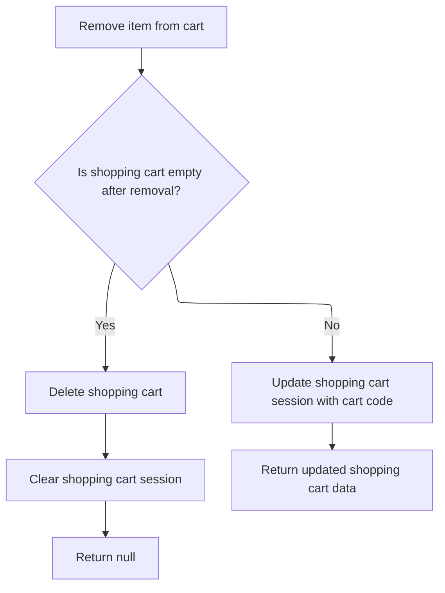

This document explains the flow of removing an item from the shopping cart. It involves retrieving and validating the current cart data, removing the specified item, and updating the session state accordingly. If the cart is empty after removal, it is deleted and the session cleared; otherwise, the session is updated with the cart code.

# Starting the item removal process in the mini cart controller

This section handles the removal of an item from the mini shopping cart by retrieving the current shopping cart data based on the user's session and request parameters.

| Category       | Rule Name              | Description                                                                                                                                                    |
| -------------- | ---------------------- | -------------------------------------------------------------------------------------------------------------------------------------------------------------- |
| Business logic | Retrieve current cart  | The system must retrieve the current shopping cart data using the provided shopping cart code and merchant store context before attempting to remove any item. |
| Business logic | Contextual cart access | The removal operation must be scoped to the merchant store and language context to ensure the correct cart and localized data are used.                        |

<SwmSnippet path="/shopizer/sm-shop/src/main/java/com/salesmanager/web/shop/controller/shoppingCart/MiniCartController.java" line="68">

---

In <SwmToken path="shopizer/sm-shop/src/main/java/com/salesmanager/web/shop/controller/shoppingCart/MiniCartController.java" pos="68:8:8" line-data="	public @ResponseBody ShoppingCartData removeShoppingCartItem(Long lineItemId, final String shoppingCartCode, HttpServletRequest request, Model model) throws Exception {">`removeShoppingCartItem`</SwmToken>, we start by getting the language and merchant store from the request, then fetch the shopping cart data using the facade. We call <SwmToken path="shopizer/sm-shop/src/main/java/com/salesmanager/web/shop/controller/shoppingCart/facade/ShoppingCartFacadeImpl.java" pos="51:4:4" line-data="public class ShoppingCartFacadeImpl">`ShoppingCartFacadeImpl`</SwmToken> next because it abstracts the retrieval of the shopping cart data, handling the details of fetching and preparing the cart for further operations.

```java
	public @ResponseBody ShoppingCartData removeShoppingCartItem(Long lineItemId, final String shoppingCartCode, HttpServletRequest request, Model model) throws Exception {
		Language language = (Language)request.getAttribute(Constants.LANGUAGE);
		MerchantStore merchantStore = (MerchantStore)request.getAttribute(Constants.MERCHANT_STORE);
		ShoppingCartData cart =  shoppingCartFacade.getShoppingCartData(null, merchantStore, shoppingCartCode);
		if(cart==null) {
			return null;
		}
```

---

</SwmSnippet>

## Retrieving and validating the shopping cart data

```mermaid
%%{init: {"flowchart": {"defaultRenderer": "elk"}} }%%
flowchart TD
    node1{"Is customer provided?"}
    click node1 openCode "shopizer/sm-shop/src/main/java/com/salesmanager/web/shop/controller/shoppingCart/facade/ShoppingCartFacadeImpl.java:268:270"
    node1 -->|"Yes"| node2["Retrieve cart by customer"]
    click node2 openCode "shopizer/sm-core/src/main/java/com/salesmanager/core/business/shoppingcart/service/ShoppingCartServiceImpl.java:70:79"
    node1 -->|"No"| node3{"Is shoppingCartId provided?"}
    click node3 openCode "shopizer/sm-shop/src/main/java/com/salesmanager/web/shop/controller/shoppingCart/facade/ShoppingCartFacadeImpl.java:278:280"
    node2 -->|"Cart found"| node5["Populate and calculate shopping cart data"]
    click node5 openCode "shopizer/sm-shop/src/main/java/com/salesmanager/web/shop/controller/shoppingCart/facade/ShoppingCartFacadeImpl.java:300:306"
    node2 -->|"Cart null"| node3
    node3 -->|"Yes"| node4["Retrieve cart by shoppingCartId and store"]
    click node4 openCode "shopizer/sm-shop/src/main/java/com/salesmanager/web/shop/controller/shoppingCart/facade/ShoppingCartFacadeImpl.java:279:281"
    node3 -->|"No"| node6["Return null"]
    click node6 openCode "shopizer/sm-shop/src/main/java/com/salesmanager/web/shop/controller/shoppingCart/facade/ShoppingCartFacadeImpl.java:293:296"
    node4 -->|"Cart found"| node5
    node4 -->|"Cart null"| node6
    node5 --> node7["Return populated shopping cart data"]
    click node7 openCode "shopizer/sm-shop/src/main/java/com/salesmanager/web/shop/controller/shoppingCart/facade/ShoppingCartFacadeImpl.java:306:307"
classDef HeadingStyle fill:#777777,stroke:#333,stroke-width:2px;

%% Swimm:
%% %%{init: {"flowchart": {"defaultRenderer": "elk"}} }%%
%% flowchart TD
%%     node1{"Is customer provided?"}
%%     click node1 openCode "<SwmPath>[shopizer/…/facade/ShoppingCartFacadeImpl.java](shopizer/sm-shop/src/main/java/com/salesmanager/web/shop/controller/shoppingCart/facade/ShoppingCartFacadeImpl.java)</SwmPath>:268:270"
%%     node1 -->|"Yes"| node2["Retrieve cart by customer"]
%%     click node2 openCode "<SwmPath>[shopizer/…/service/ShoppingCartServiceImpl.java](shopizer/sm-core/src/main/java/com/salesmanager/core/business/shoppingcart/service/ShoppingCartServiceImpl.java)</SwmPath>:70:79"
%%     node1 -->|"No"| node3{"Is <SwmToken path="shopizer/sm-shop/src/main/java/com/salesmanager/web/shop/controller/shoppingCart/facade/ShoppingCartFacadeImpl.java" pos="261:5:5" line-data="                                                 final String shoppingCartId )">`shoppingCartId`</SwmToken> provided?"}
%%     click node3 openCode "<SwmPath>[shopizer/…/facade/ShoppingCartFacadeImpl.java](shopizer/sm-shop/src/main/java/com/salesmanager/web/shop/controller/shoppingCart/facade/ShoppingCartFacadeImpl.java)</SwmPath>:278:280"
%%     node2 -->|"Cart found"| node5["Populate and calculate shopping cart data"]
%%     click node5 openCode "<SwmPath>[shopizer/…/facade/ShoppingCartFacadeImpl.java](shopizer/sm-shop/src/main/java/com/salesmanager/web/shop/controller/shoppingCart/facade/ShoppingCartFacadeImpl.java)</SwmPath>:300:306"
%%     node2 -->|"Cart null"| node3
%%     node3 -->|"Yes"| node4["Retrieve cart by <SwmToken path="shopizer/sm-shop/src/main/java/com/salesmanager/web/shop/controller/shoppingCart/facade/ShoppingCartFacadeImpl.java" pos="261:5:5" line-data="                                                 final String shoppingCartId )">`shoppingCartId`</SwmToken> and store"]
%%     click node4 openCode "<SwmPath>[shopizer/…/facade/ShoppingCartFacadeImpl.java](shopizer/sm-shop/src/main/java/com/salesmanager/web/shop/controller/shoppingCart/facade/ShoppingCartFacadeImpl.java)</SwmPath>:279:281"
%%     node3 -->|"No"| node6["Return null"]
%%     click node6 openCode "<SwmPath>[shopizer/…/facade/ShoppingCartFacadeImpl.java](shopizer/sm-shop/src/main/java/com/salesmanager/web/shop/controller/shoppingCart/facade/ShoppingCartFacadeImpl.java)</SwmPath>:293:296"
%%     node4 -->|"Cart found"| node5
%%     node4 -->|"Cart null"| node6
%%     node5 --> node7["Return populated shopping cart data"]
%%     click node7 openCode "<SwmPath>[shopizer/…/facade/ShoppingCartFacadeImpl.java](shopizer/sm-shop/src/main/java/com/salesmanager/web/shop/controller/shoppingCart/facade/ShoppingCartFacadeImpl.java)</SwmPath>:306:307"
%% classDef HeadingStyle fill:#777777,stroke:#333,stroke-width:2px;
```



This section handles retrieving and validating the shopping cart data for a customer or by shopping cart ID, ensuring the cart is current and populated with pricing and calculation details before returning.

| Category       | Rule Name                     | Description                                                                                                                                                                                                                                                                                                                                                               |
| -------------- | ----------------------------- | ------------------------------------------------------------------------------------------------------------------------------------------------------------------------------------------------------------------------------------------------------------------------------------------------------------------------------------------------------------------------- |
| Business logic | Customer cart retrieval       | If a customer is provided, retrieve the shopping cart associated with that customer.                                                                                                                                                                                                                                                                                      |
| Business logic | Obsolete cart handling        | If the retrieved shopping cart is marked as obsolete, delete it and return null to prevent use of outdated carts.                                                                                                                                                                                                                                                         |
| Business logic | Fallback cart retrieval by ID | If no cart is found for the customer and a <SwmToken path="shopizer/sm-shop/src/main/java/com/salesmanager/web/shop/controller/shoppingCart/facade/ShoppingCartFacadeImpl.java" pos="261:5:5" line-data="                                                 final String shoppingCartId )">`shoppingCartId`</SwmToken> is provided, retrieve the cart by this ID and store. |
| Business logic | Return null if no cart        | If no cart is found by customer or <SwmToken path="shopizer/sm-shop/src/main/java/com/salesmanager/web/shop/controller/shoppingCart/facade/ShoppingCartFacadeImpl.java" pos="261:5:5" line-data="                                                 final String shoppingCartId )">`shoppingCartId`</SwmToken>, return null indicating no active cart is available.         |
| Business logic | Populate cart data            | Before returning, populate the shopping cart data with pricing, calculation, language, and store details.                                                                                                                                                                                                                                                                 |

<SwmSnippet path="/shopizer/sm-shop/src/main/java/com/salesmanager/web/shop/controller/shoppingCart/facade/ShoppingCartFacadeImpl.java" line="260">

---

In <SwmToken path="shopizer/sm-shop/src/main/java/com/salesmanager/web/shop/controller/shoppingCart/facade/ShoppingCartFacadeImpl.java" pos="260:5:5" line-data="    public ShoppingCartData getShoppingCartData( final Customer customer, final MerchantStore store,">`getShoppingCartData`</SwmToken>, we start by checking if a customer is provided. If yes, we call the shopping cart service to get the cart for that customer. We call <SwmToken path="shopizer/sm-core/src/main/java/com/salesmanager/core/business/shoppingcart/service/ShoppingCartServiceImpl.java" pos="35:4:4" line-data="public class ShoppingCartServiceImpl extends SalesManagerEntityServiceImpl&lt;Long, ShoppingCart&gt; implements ShoppingCartService {">`ShoppingCartServiceImpl`</SwmToken> next because it handles the core logic of fetching and validating the cart from the database, including business rules like obsolete cart handling.

```java
    public ShoppingCartData getShoppingCartData( final Customer customer, final MerchantStore store,
                                                 final String shoppingCartId )
        throws Exception
    {

        ShoppingCart cart = null;
        try
        {
            if ( customer != null )
            {
                LOG.info( "Reteriving customer shopping cart..." );

                cart = shoppingCartService.getShoppingCart( customer );

            }

            else
            {
```

---

</SwmSnippet>

<SwmSnippet path="/shopizer/sm-core/src/main/java/com/salesmanager/core/business/shoppingcart/service/ShoppingCartServiceImpl.java" line="68">

---

<SwmToken path="shopizer/sm-core/src/main/java/com/salesmanager/core/business/shoppingcart/service/ShoppingCartServiceImpl.java" pos="68:5:5" line-data="	public ShoppingCart getShoppingCart(final Customer customer) throws ServiceException {">`getShoppingCart`</SwmToken> fetches the cart for a customer, populates it with details, then checks if it's obsolete. If obsolete, it deletes the cart and returns null, otherwise returns the cart. This enforces a business rule to avoid using outdated carts.

```java
	public ShoppingCart getShoppingCart(final Customer customer) throws ServiceException {

		try {

			ShoppingCart shoppingCart = shoppingCartDao.getByCustomer(customer);
			populateShoppingCart(shoppingCart);
			if(shoppingCart!=null && shoppingCart.isObsolete()) {
				delete(shoppingCart);
				return null;
			} else {
				return shoppingCart;
			}


		} catch (Exception e) {
			throw new ServiceException(e);
		}

	}
```

---

</SwmSnippet>

<SwmSnippet path="/shopizer/sm-shop/src/main/java/com/salesmanager/web/shop/controller/shoppingCart/facade/ShoppingCartFacadeImpl.java" line="278">

---

Back in <SwmToken path="shopizer/sm-shop/src/main/java/com/salesmanager/web/shop/controller/shoppingCart/MiniCartController.java" pos="71:9:9" line-data="		ShoppingCartData cart =  shoppingCartFacade.getShoppingCartData(null, merchantStore, shoppingCartCode);">`getShoppingCartData`</SwmToken>, after returning from the service layer, we check if the cart is still null and try fetching by code if needed. Then we populate the cart data object with pricing and calculation details before returning it.

```java
                if ( StringUtils.isNotBlank( shoppingCartId ) && cart == null )
                {
                    cart = shoppingCartService.getByCode( shoppingCartId, store );
                }

            }
        }
        catch ( ServiceException ex )
        {
            LOG.error( "Error while retriving cart from customer", ex );
        }
        catch( NoResultException nre) {
        	//nothing
        }

        if ( cart == null )
        {
            return null;
        }

        LOG.info( "Cart model found." );

        ShoppingCartDataPopulator shoppingCartDataPopulator = new ShoppingCartDataPopulator();
        shoppingCartDataPopulator.setShoppingCartCalculationService( shoppingCartCalculationService );
        shoppingCartDataPopulator.setPricingService( pricingService );

        Language language = (Language) getKeyValue( Constants.LANGUAGE );
        MerchantStore merchantStore = (MerchantStore) getKeyValue( Constants.MERCHANT_STORE );
        return shoppingCartDataPopulator.populate( cart, merchantStore, language );

    }
```

---

</SwmSnippet>

## Finalizing item removal and updating session state



<SwmSnippet path="/shopizer/sm-shop/src/main/java/com/salesmanager/web/shop/controller/shoppingCart/MiniCartController.java" line="75">

---

Back in <SwmToken path="shopizer/sm-shop/src/main/java/com/salesmanager/web/shop/controller/shoppingCart/MiniCartController.java" pos="68:8:8" line-data="	public @ResponseBody ShoppingCartData removeShoppingCartItem(Long lineItemId, final String shoppingCartCode, HttpServletRequest request, Model model) throws Exception {">`removeShoppingCartItem`</SwmToken>, after getting the updated cart data from the facade, we check if the cart is empty. If empty, we delete the cart and clear the session attribute. Otherwise, we update the session with the cart code and return the updated cart data.

```java
		ShoppingCartData shoppingCartData=shoppingCartFacade.removeCartItem(lineItemId, cart.getCode(), merchantStore,language);
		
		
		if(CollectionUtils.isEmpty(shoppingCartData.getShoppingCartItems())) {
			shoppingCartFacade.deleteShoppingCart(shoppingCartData.getId(), merchantStore);
			request.getSession().removeAttribute(Constants.SHOPPING_CART);
			return null;
		}
		
		
		request.getSession().setAttribute(Constants.SHOPPING_CART, cart.getCode());
		
		LOG.debug("removed item" + lineItemId + "from cart");
		return shoppingCartData;
	}
```

---

</SwmSnippet>

&nbsp;

*This is an auto-generated document by Swimm 🌊 and has not yet been verified by a human*

<SwmMeta version="3.0.0" repo-id="Z2l0aHViJTNBJTNBU2hvcGl6ZXIlM0ElM0F1bWFsaW5nYXN3YW1p" repo-name="Shopizer"><sup>Powered by [Swimm](https://app.swimm.io/)</sup></SwmMeta>
