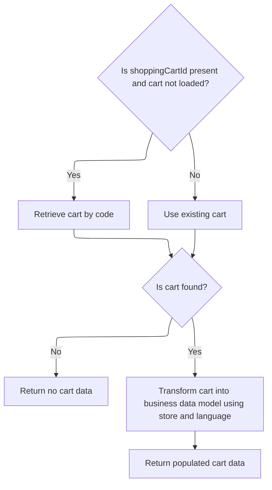
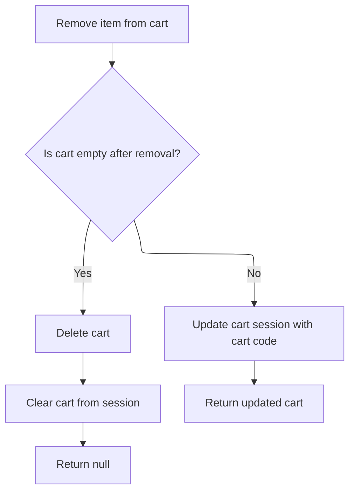

This document describes how users can remove items from their shopping cart. The flow validates the cart, removes the specified item, and returns the updated cart data or deletes the cart if it becomes empty.

# Removing an Item from the Mini Cart

This section governs the process of removing an item from the mini cart, ensuring that only valid carts are processed and that the cart data is updated accordingly.

| Category        | Rule Name            | Description                                                                                                                             |
| --------------- | -------------------- | --------------------------------------------------------------------------------------------------------------------------------------- |
| Data validation | Valid Cart Required  | A cart must be validated and confirmed to exist before any item removal action is performed.                                            |
| Business logic  | Accurate Cart Update | The cart data returned after item removal must reflect the current state of the cart, including all remaining items and updated totals. |

<SwmSnippet path="/shopizer/sm-shop/src/main/java/com/salesmanager/web/shop/controller/shoppingCart/MiniCartController.java" line="68">

---

We get the cart data using the facade to make sure we're working with a valid cart before doing anything else.

```java
	public @ResponseBody ShoppingCartData removeShoppingCartItem(Long lineItemId, final String shoppingCartCode, HttpServletRequest request, Model model) throws Exception {
		Language language = (Language)request.getAttribute(Constants.LANGUAGE);
		MerchantStore merchantStore = (MerchantStore)request.getAttribute(Constants.MERCHANT_STORE);
		ShoppingCartData cart =  shoppingCartFacade.getShoppingCartData(null, merchantStore, shoppingCartCode);
		if(cart==null) {
			return null;
		}
```

---

</SwmSnippet>

## Retrieving Cart Data via Facade

This section governs how shopping cart data is retrieved for a user, ensuring the correct cart is fetched based on available identifiers (customer or cart code). It ensures that the cart data returned is accurate and corresponds to the user's session or identity.

| Category        | Rule Name                 | Description                                                                                                                                                    |
| --------------- | ------------------------- | -------------------------------------------------------------------------------------------------------------------------------------------------------------- |
| Data validation | Store Context Enforcement | The shopping cart data returned must always correspond to the merchant store provided in the request, ensuring store-specific cart data is not mixed.          |
| Business logic  | Customer Cart Priority    | If a valid customer object is provided, the shopping cart must be retrieved using the customer's identity, regardless of whether a cart code is also provided. |
| Business logic  | Cart Code Fallback        | If no customer object is provided, the shopping cart must be retrieved using the provided cart code, if available.                                             |

<SwmSnippet path="/shopizer/sm-shop/src/main/java/com/salesmanager/web/shop/controller/shoppingCart/facade/ShoppingCartFacadeImpl.java" line="260">

---

In <SwmToken path="shopizer/sm-shop/src/main/java/com/salesmanager/web/shop/controller/shoppingCart/facade/ShoppingCartFacadeImpl.java" pos="260:5:5" line-data="    public ShoppingCartData getShoppingCartData( final Customer customer, final MerchantStore store,">`getShoppingCartData`</SwmToken>, we decide whether to fetch the cart by customer or by cart code, depending on what's available. We call ShoppingCartServiceImpl next to actually retrieve the cart entity from the database or cache, since the facade doesn't handle persistence directly.

```java
    public ShoppingCartData getShoppingCartData( final Customer customer, final MerchantStore store,
                                                 final String shoppingCartId )
        throws Exception
    {

        ShoppingCart cart = null;
        try
        {
            if ( customer != null )
            {
                LOG.info( "Reteriving customer shopping cart..." );

                cart = shoppingCartService.getShoppingCart( customer );

            }

            else
            {
```

---

</SwmSnippet>

### Fetching Cart Entity from Service

This section ensures that the correct shopping cart is fetched for the user, enabling subsequent operations such as viewing, updating, or checking out the cart.

| Category        | Rule Name                      | Description                                                                                                                             |
| --------------- | ------------------------------ | --------------------------------------------------------------------------------------------------------------------------------------- |
| Data validation | Valid Cart Identifier Required | A cart must be fetched using a valid user or session identifier. If the identifier is missing or invalid, the cart cannot be retrieved. |
| Business logic  | Create Cart If Not Exists      | If no cart exists for the given identifier, a new empty cart entity must be created and returned to the user.                           |
| Business logic  | Cart Item Integrity            | The fetched cart must include all items previously added by the user, along with accurate quantities and prices.                        |
| Business logic  | Applied Discounts Reflected    | Any discounts or promotions applied to the cart must be reflected in the cart entity when it is fetched.                                |

See <SwmLink doc-title="Retrieving and Validating a Shopping Cart">[Retrieving and Validating a Shopping Cart](.swm%5Cretrieving-and-validating-a-shopping-cart.d2irdlbg.sw.md)</SwmLink>

### Populating Cart Data for the Client



<SwmSnippet path="/shopizer/sm-shop/src/main/java/com/salesmanager/web/shop/controller/shoppingCart/facade/ShoppingCartFacadeImpl.java" line="278">

---

We convert the cart entity into a DTO for the client, using extra services for price calculations.

```java
                if ( StringUtils.isNotBlank( shoppingCartId ) && cart == null )
                {
                    cart = shoppingCartService.getByCode( shoppingCartId, store );
                }

            }
        }
        catch ( ServiceException ex )
        {
            LOG.error( "Error while retriving cart from customer", ex );
        }
        catch( NoResultException nre) {
        	//nothing
        }

        if ( cart == null )
        {
            return null;
        }

        LOG.info( "Cart model found." );

        ShoppingCartDataPopulator shoppingCartDataPopulator = new ShoppingCartDataPopulator();
        shoppingCartDataPopulator.setShoppingCartCalculationService( shoppingCartCalculationService );
        shoppingCartDataPopulator.setPricingService( pricingService );

        Language language = (Language) getKeyValue( Constants.LANGUAGE );
        MerchantStore merchantStore = (MerchantStore) getKeyValue( Constants.MERCHANT_STORE );
        return shoppingCartDataPopulator.populate( cart, merchantStore, language );

    }
```

---

</SwmSnippet>

## Removing Item and Updating Cart Session



<SwmSnippet path="/shopizer/sm-shop/src/main/java/com/salesmanager/web/shop/controller/shoppingCart/MiniCartController.java" line="75">

---

Back in <SwmToken path="shopizer/sm-shop/src/main/java/com/salesmanager/web/shop/controller/shoppingCart/MiniCartController.java" pos="68:8:8" line-data="	public @ResponseBody ShoppingCartData removeShoppingCartItem(Long lineItemId, final String shoppingCartCode, HttpServletRequest request, Model model) throws Exception {">`removeShoppingCartItem`</SwmToken>, after getting updated cart data from the facade, we remove the item, check if the cart is now empty, and if so, delete the cart and clear the session. Otherwise, we update the session with the new cart code and return the updated cart data.

```java
		ShoppingCartData shoppingCartData=shoppingCartFacade.removeCartItem(lineItemId, cart.getCode(), merchantStore,language);
		
		
		if(CollectionUtils.isEmpty(shoppingCartData.getShoppingCartItems())) {
			shoppingCartFacade.deleteShoppingCart(shoppingCartData.getId(), merchantStore);
			request.getSession().removeAttribute(Constants.SHOPPING_CART);
			return null;
		}
		
		
		request.getSession().setAttribute(Constants.SHOPPING_CART, cart.getCode());
		
		LOG.debug("removed item" + lineItemId + "from cart");
		return shoppingCartData;
	}
```

---

</SwmSnippet>

&nbsp;

*This is an auto-generated document by Swimm 🌊 and has not yet been verified by a human*

<SwmMeta version="3.0.0" repo-id="Z2l0aHViJTNBJTNBU2hvcGl6ZXIlM0ElM0F1bWFsaW5nYXN3YW1p" repo-name="Shopizer"><sup>Powered by [Swimm](https://app.swimm.io/)</sup></SwmMeta>
